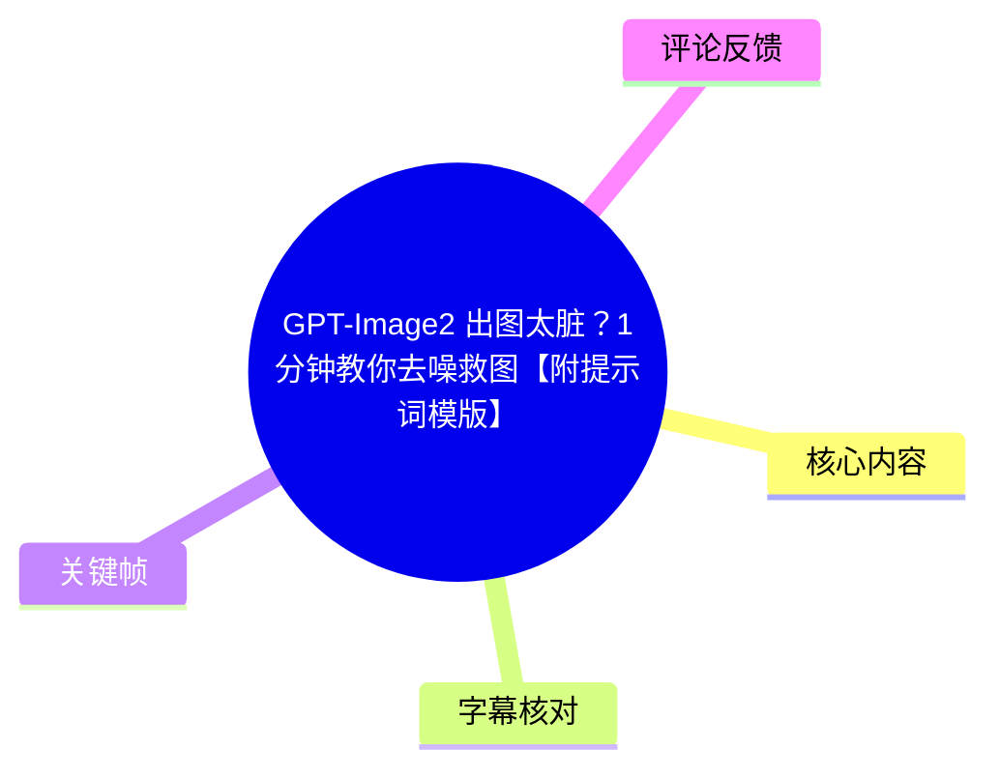
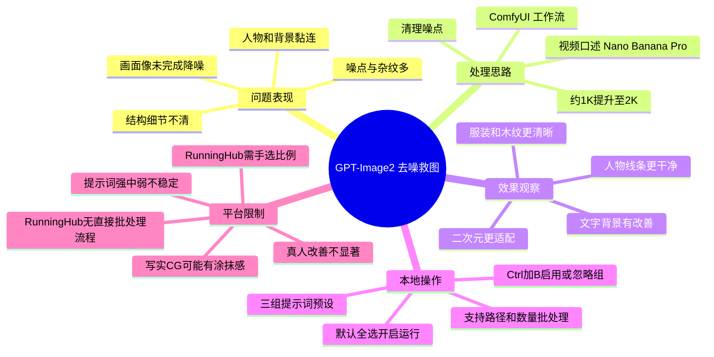
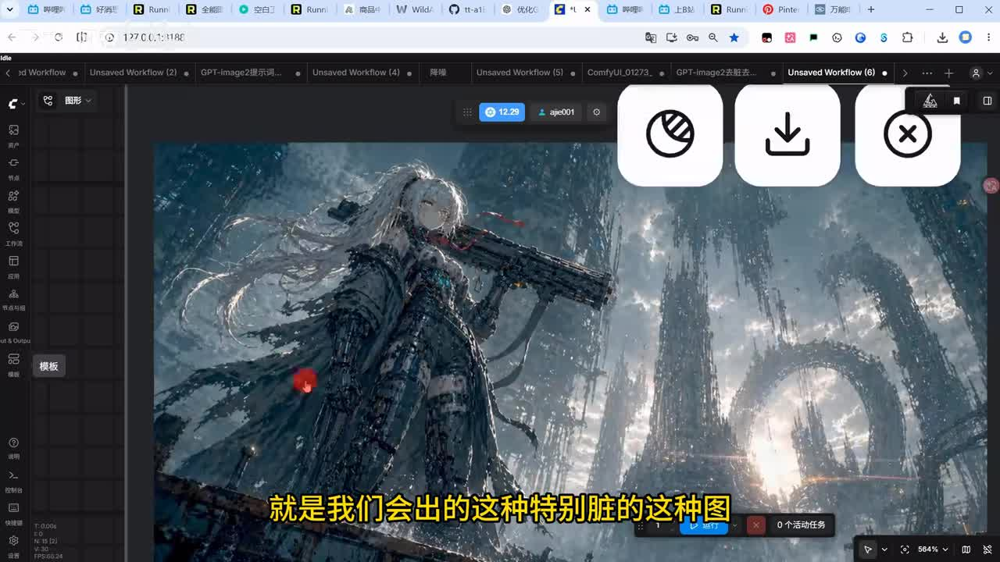
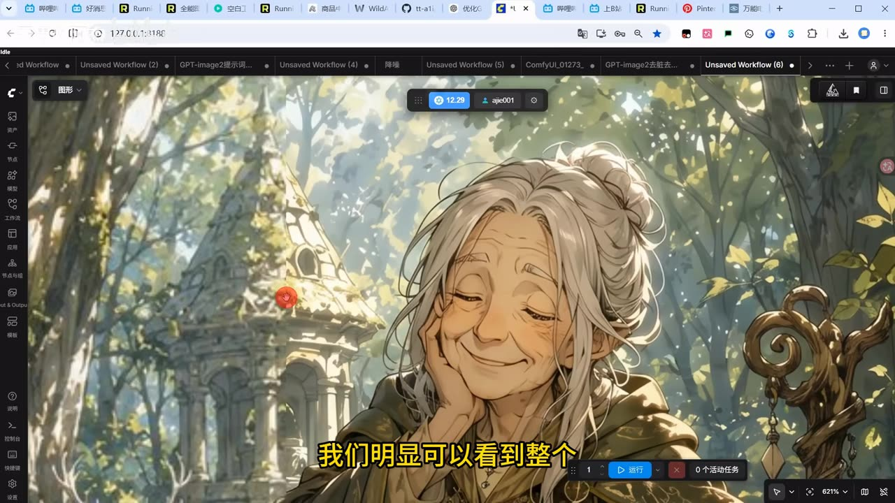
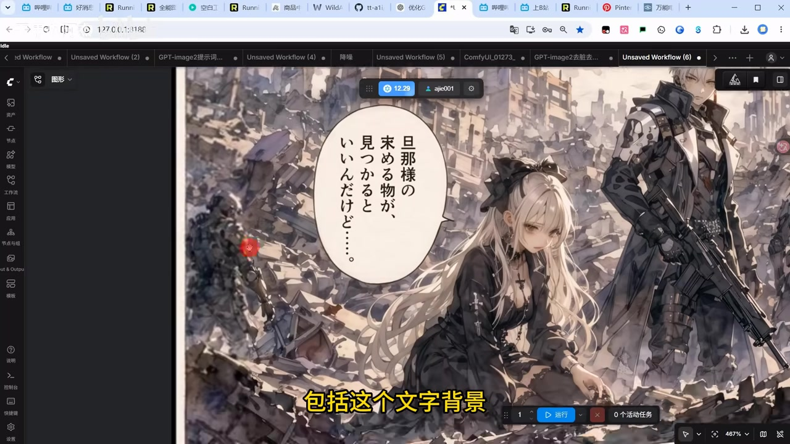
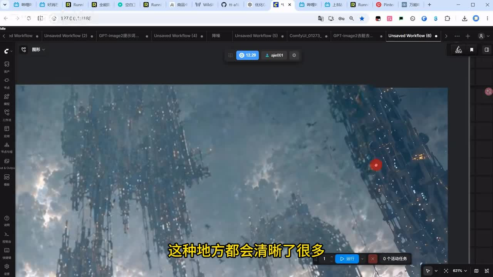

# GPT-Image2 出图太脏？1分钟教你去噪救图【附提示词模版】

> 来源：[Bilibili 视频](https://www.bilibili.com/video/BV1ZHE96aEE3) 
> UP 主：无用の阿杰｜合集：AIcode｜视频时长：06:37｜画面规格：1920 × 1080  
> 视频简介提供了工作流、提示词、插件、ComfyUI CPU 整合包及 RunningHub 体验地址；这些均为 UP 主在发布时提供的外链，实际可用性需以访问时状态为准。

## 小结

视频针对 GPT-Image2 生成图中常见的“脏、糊、噪点多、结构与背景黏连”的问题，展示了一个以 ComfyUI 工作流进行后处理的“洗图/去噪”方案。作者的核心思路不是仅做传统降噪，而是借助视频中口述为 **Nano Banana Pro** 的模型重新处理输入图像：在清理杂乱纹理和噪点的同时，将常见的约 1K 图片提升至 2K 输出。

从多个前后对比案例看，作者认为该流程能让人物线条、服装纹理、木质材质、文字背景等区域更清楚，且在部分样图中没有明显损失整体质感。对于具有清晰轮廓、线稿或块面结构的二次元图，作者评价效果更好；而偏写实 CG 或真人图可能出现涂抹感，改善幅度也相对不明显。

本地 ComfyUI 工作流中，作者预设了强、中、弱三组提示词/处理组，但明确指出三档强度并不能稳定、严格地按预期区分；其个人建议是优先使用其中一组“中档”提示词，并自行以真实素材测试。运行时可通过 `Ctrl + B` 忽略或启用所选节点组；另提供了可填写本地保存路径、图片文件夹路径和处理数量的批处理工作流。

在参数与平台差异上，作者不建议使用口述为“Nano Banana 2”的模型，理由是其细节处理不如 Pro 版本精细；本地流程可将图像比例设为视频口述的 `auto` 自动判定，无需手工修改。RunningHub 流程则没有该自动比例判定：必须按输入图比例手动选输出比例，否则人物可能被压扁；同时平台流程没有直接的批处理上传方案，批量处理需考虑 API 调用。

此视频是经验演示而非严格的模型评测：作者明确表示测试样本有限，未给出提示词全文、模型版本号、采样参数、耗时、显存要求或可重复的量化指标。因此，“去噪”和“2K 升级”的具体效果应理解为视频样例中的观察结果，不宜外推为对所有题材、所有模型版本都成立的结论。工具、模型名称、RunningHub 功能与外链均具有时效性。

## 思维导图

## 目录

- [问题定义与样例效果](#问题定义与样例效果)
- [各类图片的前后对比与适用范围](#各类图片的前后对比与适用范围)
- [本地 ComfyUI 工作流与模型选择](#本地-comfyui-工作流与模型选择)
- [提示词分组与节点启停方法](#提示词分组与节点启停方法)
- [分辨率、比例与批量处理](#分辨率比例与批量处理)
- [RunningHub 使用差异](#runninghub-使用差异)
- [可复用操作清单](#可复用操作清单)
- [限制、风险与时效性](#限制风险与时效性)
- [字幕比对](#字幕比对)
- [评论分析](#评论分析)
- [处理记录](#处理记录)

## 问题定义与样例效果 [00:23](https://www.bilibili.com/video/BV1ZHE96aEE3?t=23)

视频在约 00:23 开始进入讲解。作者将问题描述为：使用 GPT-Image2 出图时，图片可能呈现大量噪点，画面细节交代不清，结构和背景混在一起，从视觉上像“没有完成降噪”。

作者强调的判断标准并非简单地“锐化更多”，而是观察以下区域能否更清楚地分离：

1. **主体结构**：人物轮廓、衣服结构和线条是否能从背景中分辨。
2. **局部纹理**：服装、木质表面等区域是否减少杂乱、重复或难以解释的纹理。
3. **整体质感**：清理后是否仍保留原图的画面风格，而非明显损失质感。
4. **背景可读性**：远景建筑、环境元素和文字背景是否从“糊成一片”变得更可辨认。

> 图：关键帧展示了作者在 ComfyUI 界面中打开的一张高噪点科幻人物图。人物服装和建筑背景都存在碎裂、密集且难解释的细节，是视频所说“特别脏”的典型输入样例；它帮助理解该流程处理的不是单纯低清图，而是 AI 图中结构与伪纹理混杂的问题。

在第一个样例中，作者主张处理后的人物细节线条与整体结构更干净，且质感没有出现太大缺失。这里是作者基于画面对比作出的判断，视频没有提供客观噪声指标、像素级差异图或盲测数据。

## 各类图片的前后对比与适用范围 [00:50](https://www.bilibili.com/video/BV1ZHE96aEE3?t=50)

### 第二、三、四组样图：细节可读性提升

从约 00:50 起，作者连续展示更多样例：

- **人物与远景样例**：原图中的衣物、远处人物的服装、面部与头发显得“脏”；处理后，作者认为人物及木质纹理更干净。
- **带文字背景的二次元图**：原图“又脏又糊”，处理后作者认为背景文字与人物区域得到较明显修复。
- **轻度细节不清的图片**：这类图并非严重失真，但头发、衣服等区域细节不够明确；处理后，作者认为结构更清晰，质感也有所加强。

> 图：关键帧中的人物轮廓、头发线条、树木和遗迹背景具有相对明确的线性结构。它对应作者后文的判断：线条和结构清楚的二次元图，更适合使用该流程观察“去脏”和细节整理效果。

> 图：关键帧展示了一张带日文对话气泡、人物和复杂废墟背景的插画。此类图同时含有文字、角色和密集背景，适合说明作者所称的“文字背景”和人物细节修复场景；但视频未证明文字一定能被准确恢复，仍需逐字检查输出结果。

### 写实 CG 与真人题材的限制 [02:26](https://www.bilibili.com/video/BV1ZHE96aEE3?t=146)

作者在最后一个样例中给出明显保留意见：偏 CG、偏写实的图，处理结果可能带有一定**涂抹感**，效果不如二次元图理想。

其经验结论可整理为：

| 图像类型 | 视频中的效果判断 | 主要观察点 |
| --- | --- | --- |
| 二次元、线条结构明确的图 | 效果较好 | 线条、服装、背景结构更容易被整理清楚 |
| 常见的轻度“脏、糊”图 | 通常可改善 | 头发、衣物、局部结构和质感可能增强 |
| 偏写实 CG 图 | 效果不一定理想 | 可能出现涂抹感 |
| 真人图 | 效果相对不明显 | 作者未给出更多真人样例与参数对照 |

因此，实际使用中应把该工作流视为带生成性质的图像再处理，而不是无损修复工具。对于人物身份、文字内容、产品细节、设计稿尺寸或需要精确保真的素材，应逐一检查是否产生了新细节、纹理替换、轮廓变化或比例失真。

## 本地 ComfyUI 工作流与模型选择 [02:50](https://www.bilibili.com/video/BV1ZHE96aEE3?t=170)

作者称工作流较简单，已在 RunningHub 发布，也可在本地软件中使用。其本地方案的关键是使用 ASR 识别为“**Nano Banana Pro**”的模型进行“洗图”。

> **术语说明**：本次 ASR 对该模型名称存在音近转写，如 `nano brada pro`、`nano bradar` 等；站内字幕完全是无关内容，不能用于校对。依据连续语境，本文仅按作者口述将其记作“Nano Banana Pro”，但现有素材未提供模型官方页面、精确拼写或版本号，使用时应以 UP 主提供的工作流及插件说明为准。

作者的模型选择建议：

- 使用视频口述为 **Nano Banana Pro** 的模型处理；
- **不建议**使用视频口述为“Nano Banana 2”的模型；
- 给出的理由是：后者的细节处理不如 Pro 版本精细。

该建议属于作者的主观测试经验。视频没有公开两者在同一输入、相同提示词、相同随机种子下的对照结果，也没有给出速度、成本、显存占用或失败率，不应理解为普遍性能结论。

> 图：关键帧聚焦于复杂建筑背景的局部，画面内可见大量垂直结构、散点与环境细节。该截图的价值在于呈现作者判断“脏区域变清晰”的具体视觉对象：复杂背景是否仍能分辨为结构，而不是被噪点或模糊吞没。

## 提示词分组与节点启停方法 [03:15](https://www.bilibili.com/video/BV1ZHE96aEE3?t=195)

### 提示词的三组预设

作者最初准备了三份提示词，试图对应**强、中、弱**三个处理档位。但作者随后明确说明：即使三段提示词存在区分，实际输出也**不能被严格控制为稳定的强、中、弱差异**。

据此，视频给出的实践建议是：

- 不要假定提示词强度标签必然准确；
- 可优先使用作者建议的一组“中档”提示词；
- 三组提示词都应使用自己的真实图片测试，选择表现更合适的一组；
- 作者会将提示词放在网盘供下载，但本素材未包含提示词全文，不能在此补写或推断其具体措辞。

评论区有用户提出“减少假细节假纹理”“移除高频噪音，不要有细节”等补充措辞，但它们是评论者建议，不是视频中已验证的官方模板，详见后文评论分析。

### ComfyUI 中选择处理组

作者为新手说明了多组工作流的启停操作。ASR 将按键识别为“counter”，结合上下文应为 `Ctrl`：

1. 若希望使用某一组流程，先按住 `Ctrl` 全选不需要运行的那一组节点。
2. 按 `Ctrl + B`，将该组节点忽略/禁用。
3. 选中要启用的中间组或其他目标组，再按 `Ctrl + B` 将其打开。
4. 此时运行工作流，理论上只会运行未被忽略的目标组。
5. 日常默认运行时，可全选相关节点后按 `Ctrl + B` 打开，再执行运行。

> 这里的“忽略/打开”是依据作者口述整理的操作意图。不同 ComfyUI 前端、节点版本或快捷键配置可能不同；若 `Ctrl + B` 行为不符合预期，应先在当前界面确认节点的 bypass/禁用状态。

## 分辨率、比例与批量处理 [03:32](https://www.bilibili.com/video/BV1ZHE96aEE3?t=212)

### 1K 输入到 2K 输出

作者表示，GPT-Image2 常见输出大多为约 **1K** 分辨率，认为其并不算大。视频中的处理流程将其提升至 **2K**，并声称可同时完成两件事：

1. 在生成过程中处理原图的部分噪点；
2. 拉高分辨率，使图像视觉上更清晰。

这是一种“去脏 + 放大”的合并处理，不等同于保证恢复原始真实细节。尤其当原图本来不存在明确细节时，生成模型可能根据上下文补全或重绘纹理；需要对文字、五官、手部、饰品和产品结构等敏感区域进行人工复核。

### 本地比例设置

作者在本地流程中使用视频口述为 `auto` 的图像比例选项，并说明它会根据输入图像自动判定，通常无需手动修改。

视频未展示具体节点名称、所有可选比例、输出像素边长及自动判定逻辑。因此可确认的信息仅为：

| 项目 | 视频说明 |
| --- | --- |
| 常见输入 | 约 1K 的 GPT-Image2 图片 |
| 目标输出 | 约 2K |
| 本地比例 | 使用 `auto`，按输入图自动判定 |
| 去噪机制 | 作者描述为在生成过程中处理原图噪点 |
| 未提供参数 | 精确长宽、放大倍率、种子、采样器、步数、提示词全文、耗时 |

### 本地批处理工作流 [05:09](https://www.bilibili.com/video/BV1ZHE96aEE3?t=309)

作者另做了批量工作流。按视频说明，批量处理时需配置：

1. **本地保存路径**；
2. **待处理图片所在文件夹路径**；
3. **图片数量**；
4. 使用同一套提示词，作者称批处理提示词部分未额外改动。

操作逻辑仍是通过 `Ctrl + B` 关闭不使用的一侧流程、开启批量流程，然后运行。视频没有展示文件命名规则、输入格式限制、发生错误时的处理方式、重复文件覆盖策略或输出目录结构。批量执行前，建议先用少量副本验证路径与输出比例，避免错误配置导致整批返工。

## RunningHub 使用差异 [05:33](https://www.bilibili.com/video/BV1ZHE96aEE3?t=333)

作者称工作流也发布在 RunningHub，未注册用户可填写其邀请码；视频口述称注册成功可获得 **1000 RHB**，且每日可获得 **100**。这些属于平台激励/余额相关信息，可能随平台规则变化，本笔记不将其视为长期有效承诺。

与本地流程相比，作者重点提示了两项差异：

### 1. 没有 `auto` 自动比例判定 [05:58](https://www.bilibili.com/video/BV1ZHE96aEE3?t=358)

RunningHub 版没有本地流程中的 `auto` 自动判定，因此用户必须按输入图片的原始比例手动选择输出比例。

如果输出比例与输入比例不匹配，视频中已出现人物被压扁的示例。处理前应先确认：

- 输入图是横图、竖图还是接近正方形；
- 工作流选择的输出宽高比是否相同或足够接近；
- 输出预览中人物头部、躯干、肢体与建筑垂直线是否产生异常拉伸。

### 2. 没有直接批量上传流程 [06:22](https://www.bilibili.com/video/BV1ZHE96aEE3?t=382)

作者说明，RunningHub 侧因上传图像的问题，未提供视频所示的批量流程。若确有批量处理需求，可以通过调用 API 的方式处理；作者称也将发布 AI 应用供 API 调用。

需要注意，视频没有提供 API 地址、鉴权方式、请求参数、费用、并发限制、文件大小限制或示例代码。因此“可通过 API 批处理”仅是作者说明的可行方向，具体接入条件需查阅其后续发布内容及平台最新文档。

## 可复用操作清单 [02:50](https://www.bilibili.com/video/BV1ZHE96aEE3?t=170)

以下清单仅重组视频已披露的步骤，不补充未出现的节点参数：

1. 准备一张存在脏点、糊化、纹理杂乱或背景黏连问题的 GPT-Image2 图像。
2. 打开作者提供的本地 ComfyUI 工作流，或使用其在 RunningHub 发布的工作流。
3. 本地方案中，使用作者推荐的、视频口述为 **Nano Banana Pro** 的处理模型；作者不建议使用其口述的“Nano Banana 2”。
4. 在三组提示词/流程组中进行选择。不要依赖“强、中、弱”标签的绝对效果；可先按作者意见尝试中档，再用自己的图片横向比较。
5. 使用 `Ctrl + B` 按需忽略非目标节点组，确保只运行选定流程；默认工作流则开启相应节点后运行。
6. 对约 1K 的输入，使用视频所示流程尝试输出至约 2K。
7. 本地流程使用 `auto` 图像比例自动判定；RunningHub 则按输入图比例手动选输出比例。
8. 输出后重点检查人物轮廓、头发、服装纹理、背景结构、文字和是否有涂抹感或拉伸。
9. 需处理多张本地图片时，切换至批处理工作流，填写保存路径、图片文件夹路径和图片数量。
10. RunningHub 无直接批处理上传流程；大批量任务需另行核实 API 能力、成本和限制。

## 限制、风险与时效性 [05:33](https://www.bilibili.com/video/BV1ZHE96aEE3?t=333)

### 视频内已明确的限制

- 三档提示词无法严格、稳定地控制处理强度。
- 二次元图效果较好，但真人与偏写实 CG 图的提升可能不明显。
- 偏写实 CG 图可能出现涂抹感。
- 作者测试样本有限，建议用户分别测试三段提示词。
- RunningHub 没有 `auto` 比例自动判定，比例设置错误可能压扁人物。
- RunningHub 没有视频所示的直接批处理流程，批处理需要考虑 API 调用。

### 本素材未能确认的内容

视频与附件没有给出下列关键复现信息：

- 完整提示词文本；
- 工作流 JSON 文件内容；
- 模型的官方名称、下载地址、精确版本和许可证；
- 插件安装步骤及依赖版本；
- 显存、内存、CPU/GPU 需求；
- 单张耗时、队列限制、成本和失败处理；
- 精确输出分辨率及是否固定为 2K；
- 对不同输入尺寸、人物图、文字图的稳定性统计。

### 时效性说明

本条视频元数据抓取时间为 2026-07-15，发布元数据时间戳换算为 2026-06-10。生成模型、ComfyUI 节点、插件仓库、RunningHub 功能、RHB 活动和网盘链接都可能在之后变更、失效或调整。尤其是视频简介中的工作流、提示词、插件与整合包链接，应在使用前核验来源安全性、版本兼容性与授权条件。

## 字幕比对

| 字幕来源 | 完整性 | 专有名词 | 时间轴 | 主要问题 |
| --- | --- | --- | --- | --- |
| Bilibili 站内字幕 `p01-ai-zh.srt` | 形式上覆盖 00:00–04:22，但与视频主题完全不符 | 内容为诺贝尔物理学奖、引力波等，和本视频无关 | 时间段完整但不能用于本视频定位 | 明显串入其他视频字幕，必须弃用 |
| 本次 ASR 字幕 | 覆盖 00:23.280–06:34.630，语音覆盖率 93.28% | 多处模型名、快捷键与英文术语音近误识别 | 有真实起止时间，可用于正文时间轴 | 首段过长；`Ctrl` 被识别成“counter”；模型名存在音近转写；`auto` 被识别为“out2”等 |

### 最终字幕选择

正文采用**本次 ASR 的真实时间戳**作为时间轴依据，并结合标题、视频简介、关键帧与上下文修正明显的术语识别问题；不采用站内字幕内容。原因是站内字幕从开头即讲述诺贝尔奖，与标题“GPT-Image2 出图太脏”及关键帧中的 ComfyUI 图像处理界面完全矛盾。

本次 ASR 诊断显示：

- 识别语言：中文；
- 语言置信度：0.9976；
- 音频时长：396.643 秒；
- 首段语音：23.280 秒；
- 末段语音：394.630 秒；
- 不存在大间隔警告；
- 未标记 `noAudioStream=true`，因此可确认源视频存在可供识别的音轨，并非无音轨视频。

关键术语的处理原则：

| ASR 原文/近似转写 | 正文处理 | 依据与置信说明 |
| --- | --- | --- |
| `counter b` | `Ctrl + B` | 结合 ComfyUI 常用操作语境校正，置信度较高 |
| `out2` | `auto` | 作者明确称“根据输入图像自动判定”，正文保留为视频口述的 `auto`，置信度中等 |
| `nano brada pro`、`nano bradar` | “视频口述为 Nano Banana Pro” | 音近且上下文一致，但素材未给官方拼写，避免把推定拼写写成已证实事实 |
| `gbt 秘籍二` | GPT-Image2 | 与视频标题直接一致，置信度高 |
| `roninhub` | RunningHub | 与视频简介提供的域名一致，置信度高 |

## 评论分析

> 以下仅分析当前可获取的热评前三条。评论反映的是用户经验与看法，不等同于视频已验证的技术事实。

1. **摸鱼中延期｜19 赞**  
   评论认为可通过提示词要求“减少假细节、假纹理”来缓解问题，并将脏纹理解释为 AI 为了丰富画面而生成的重复性装饰细节，例如金属材质上的铁锈、指纹等。  
   - **补充价值**：把“脏”进一步拆解为可能的“伪细节/重复纹理”，与视频中“结构和背景糊在一起”的视觉描述形成互补。  
   - **可信度边界**：该评论没有给出具体模型、提示词、对照样例或复现条件，不能据此确认所有脏图均由同一原因造成。

2. **择日开张｜9 赞**  
   评论称，左侧为“香蕉”的图、右侧为 GPT 的图，在相同提示词下两者表现都不错。  
   - **补充价值**：反映评论者在同提示词条件下主观比较过两类生成结果。  
   - **可信度边界**：“香蕉”具体指代、模型版本、输入图、分辨率、种子和评价标准均未说明，无法作为模型性能对比证据。

3. **Moments须臾｜6 赞**  
   评论建议在提示词中增加“移除高频噪音，不要有细节”。  
   - **补充价值**：提供了一个面向“抑制高频杂纹”的具体提示词方向。  
   - **风险与争议**：直接要求“不要有细节”可能同时压制有价值的纹理、文字边缘和人物五官细节；视频作者也提到强弱提示词并不稳定，因此应以副本测试为前提，而非直接覆盖原图工作流。

## 处理记录

- **Worker ID**：worker-mrj0www4-e8d79408
- **模型**：gpt-5.6-terra
- **可用素材与工具结果**：使用任务提供的元数据、视频简介、12 个关键帧路径、站内 SRT、ASR 诊断与 ASR SRT、热评前三条；未获得工作流 JSON、提示词全文或 API 文档。
- **字幕选择**：检查了站内字幕与本次 ASR。站内 `p01-ai-zh.srt` 内容与视频完全无关，弃用；采用本次 ASR 时间戳作为章节定位依据，并对 `Ctrl + B`、RunningHub、GPT-Image2 等可由上下文确认的词作有限校正。模型名称保留不确定性说明。
- **音轨判断**：ASR 诊断未标记 `noAudioStream=true`，且完成中文语音识别，确认本视频有音轨；未将站内字幕错误归因于音频或工具失败。
- **关键帧选择依据**：选用 `frame-001` 展示高噪点科幻样例，`frame-002` 观察复杂背景局部，`frame-003` 展示线条清晰的二次元人物与环境，`frame-004` 展示包含文字、人物和密集背景的测试图。其余关键帧路径虽在清单中，但未提供可核验的画面内容，故未臆测使用。
- **评论范围**：仅处理可获取的热评前三条，未扩展分析其他评论。
- **缓存清理**：素材清单未提供缓存清理执行日志或结果；本记录不虚构已清理状态。
- **未解决问题**：无法从现有素材确认模型官方拼写与版本、完整提示词、具体工作流节点配置、输出精确尺寸、硬件要求、API 接入细节及外链当前有效性。
