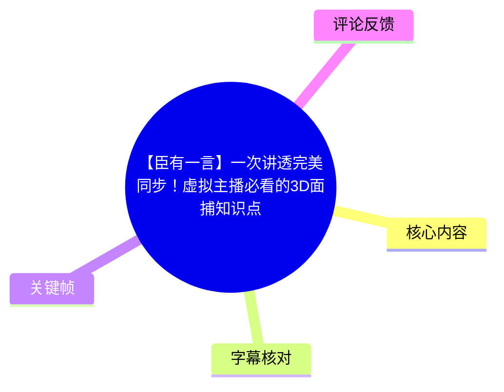
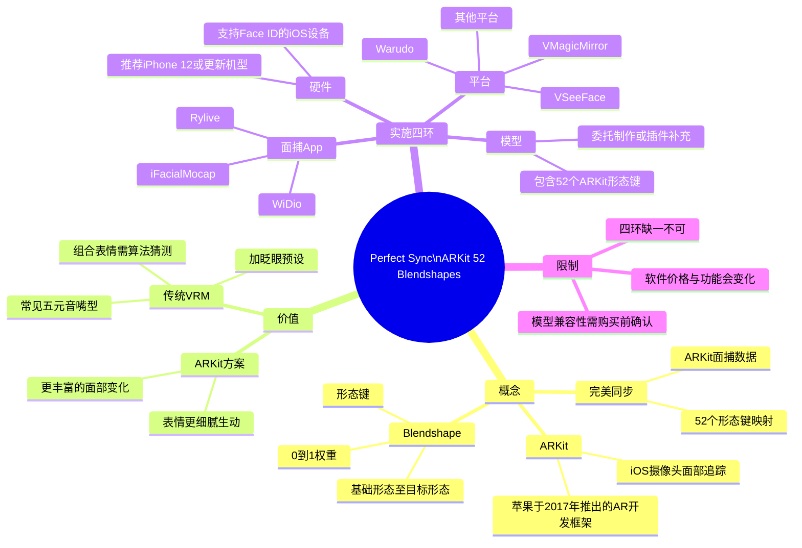
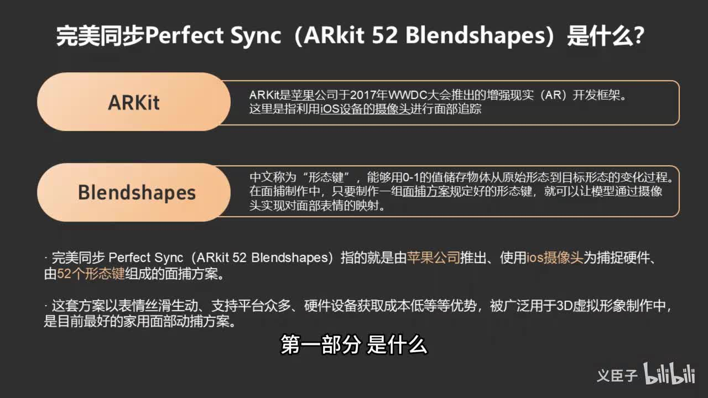
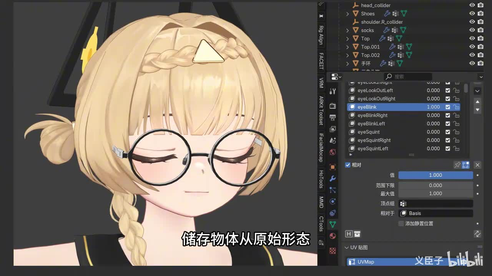
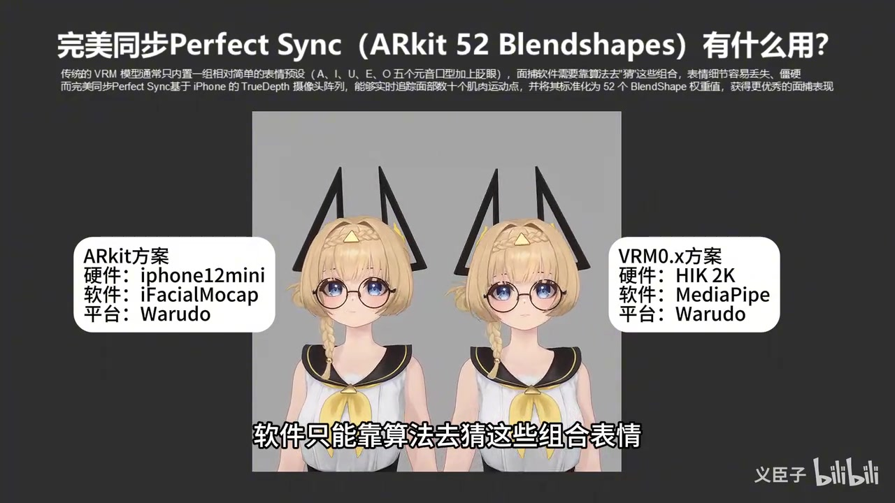

# 【臣有一言】一次讲透完美同步！虚拟主播必看的3D面捕知识点

> 来源：[Bilibili 视频](https://www.bilibili.com/video/BV1zxMA6hEQg)<br>
> UP 主：义臣子｜视频时长：05:00｜分辨率：1920×1080<br>
> 视频简介关键词：Perfect Sync、ARKit 52 Blendshapes、3D 虚拟形象、面部捕捉、Warudo

## 小结

本视频围绕虚拟主播常说的“完美同步（Perfect Sync）”展开，用“它是什么、有什么用、怎么用”三个问题，说明一套基于苹果 ARKit 面部追踪与 **52 个 Blendshape（形态键）** 的 3D 面捕方案。

核心概念是：ARKit 提供 iOS 设备上的面部追踪能力；Blendshape 则是以 `0–1` 权重记录模型从基础形态到目标形态变化的机制。模型若按 ARKit 的规范准备对应形态键，就能把摄像头识别到的面部运动映射为虚拟形象的表情。

视频将这套方案与传统、仅带少量元音嘴型和眨眼预设的 VRM 表情方案对比。作者的判断是：后者需要软件算法推测组合表情，细节较容易损失；ARKit 52 形态键能传递更多独立面部变化，因此虚拟形象的表情会更细腻、生动。该判断是视频的经验性结论，实际效果仍取决于模型制作质量、光照、设备状态和软件配置。

落地时需要四环：**支持 Face ID 的 iOS 设备、负责采集/传输的面捕 App、已匹配 ARKit 52 的模型、负责整合直播展示的平台软件**。其中作者推荐较新的 iPhone（iPhone 12 或更新机型）、iFacialMocap 与 Warudo；对于 VRoid 模型，提到可通过 Hana2 插件补充 ARKit 形态键。

需要特别注意，视频中有关“目前最好”“最全面”“国区售价 58 元”“免费/付费功能”的说法具有明显时效性，且软件功能、售价、地区可用性、兼容协议都会变化。购买设备、插件、模型或订阅前，应以对应产品的当前官方页面与模型交付说明为准。

## 思维导图





## 目录

- [视频背景与适用对象](#视频背景与适用对象)
- [一、Perfect Sync 是什么](#一perfect-sync-是什么)
- [二、为什么 52 形态键能改善表情](#二为什么-52-形态键能改善表情)
- [三、搭建方案的四个环节](#三搭建方案的四个环节)
  - [硬件：支持 Face ID 的 iOS 设备](#硬件支持-face-id-的-ios-设备)
  - [面捕 App：采集与传输面部数据](#面捕-app采集与传输面部数据)
  - [模型：匹配 ARKit 52 Blendshapes](#模型匹配-arkit-52-blendshapes)
  - [平台：整合数据并用于直播展示](#平台整合数据并用于直播展示)
- [四环关系与实际限制](#四环关系与实际限制)
- [字幕比对](#字幕比对)
- [评论分析](#评论分析)
- [处理记录](#处理记录)

## 视频背景与适用对象 [00:00](https://www.bilibili.com/video/BV1zxMA6hEQg?t=0)

视频面向希望使用 3D 虚拟形象直播或创作的虚拟主播、模型制作者，以及需要理解 VRM/ARKit 面部捕捉差异的初学者。作者开场明确将内容拆成三个层次：

1. 完美同步是什么；
2. 它有什么作用；
3. 实际要如何使用。

这里的“完美同步”并非一个独立硬件产品名称，而是中文虚拟形象社区中对 **ARKit 52 Blendshapes 面部方案**的常见称呼。视频的重点不是演示某个单一软件的完整安装流程，而是梳理从硬件到直播平台之间必须闭合的技术链路。

视频发布元数据对应 2026 年 7 月；其中设备代际、App 售价、免费策略和平台支持范围均可能在之后调整，应将本视频用于建立概念与选型框架，而非直接作为当前购买决策的唯一依据。

## 一、Perfect Sync 是什么 [00:18](https://www.bilibili.com/video/BV1zxMA6hEQg?t=18)

作者认为，理解 Perfect Sync 前需要先分清 **ARKit** 与 **Blendshapes** 两个概念。

- **ARKit**：视频表述为苹果公司在 2017 年 WWDC 推出的增强现实（AR）开发框架。本视频关注的是其借助 iOS 设备摄像头进行面部追踪的能力。
- **Blendshape（形态键）**：用 `0–1` 的数值保存或驱动对象从原始形态到目标形态的变化。放在角色面部制作中，可把“眨眼、抬眉、张嘴、鼓腮”等预先制作的目标形态，通过不同权重混合出来。
- **Perfect Sync / ARKit 52 Blendshapes**：视频将其描述为使用 iOS 摄像头作为捕捉硬件、由 52 个形态键组成的面部方案。其数据流可概括为：  
  `真人面部运动 → iOS 设备追踪 → 52 项形态权重 → 模型对应形态键 → 虚拟角色表情`



> 图：该关键帧直接列出 ARKit、Blendshapes 的定义，并将“完美同步”标注为“Perfect Sync（ARKit 52 Blendshapes）”。它是理解后续设备、模型和软件要求的概念锚点。

视频还给出作者的优势判断：该方案表情更细滑生动、支持平台较多、硬件获取成本较低，因此广泛用于 3D 虚拟形象制作，并被作者称为“目前最好的家用面部动捕方案”。其中“最好”属于作者评价，并非视频中通过统一测评得出的客观排名。

### Blendshape 如何工作 [00:45](https://www.bilibili.com/video/BV1zxMA6hEQg?t=45)

Blendshape 的关键不在于“摄像头自动生成模型表情”，而在于模型端已经存在可被驱动的预制形态。视频强调：只要依照面部方案规定的标准制作一组形态键，就可以实现摄像头面部表情到模型表情的映射。

可将单个形态键理解为一个权重通道：

| 参数 | 视频中的含义 |
| --- | --- |
| 基础形态 | 模型的默认面部状态 |
| 目标形态 | 例如闭眼、张嘴、眉毛上扬等特定变形 |
| 权重范围 | `0–1` |
| `0` | 不应用该目标形态 |
| `1` | 完整应用该目标形态 |
| 中间值 | 部分应用，可形成连续变化 |



> 图：关键帧展示了角色模型和 Blender 界面中的形态键列表，且 `eyeBlinkLeft` 被设置为 `1.000`。它把抽象的“0–1 权重”落到实际模型制作界面，说明 Perfect Sync 对模型资产有明确前置要求。

## 二、为什么 52 形态键能改善表情 [01:20](https://www.bilibili.com/video/BV1zxMA6hEQg?t=80)

作者用传统 VRM 模型与 ARKit 方案对比，解释完美同步的实用价值。

传统 VRM 模型通常仅内置较简单的表情预设：`A、I、U、E、O` 五个元音嘴型，加上眨眼等基础项目。面对更复杂的真人表情时，面部软件需要依据少量输入或预设去推测组合效果；作者认为，这会造成细节丢失，使画面显得相对僵硬。

相比之下，视频称 iPhone 的 **TrueDepth 摄像头阵列**能够实时追踪面部数十个肌肉运动点，并将结果标准化为 52 个 Blendshape 权重值。模型拥有相应形态键时，就可以分别接收这些数据，而非只从少量嘴型与眨眼状态中猜测表情组合。



> 图：该画面并列了两套链路：左侧为“iPhone 12 mini + iFacialMocap + Warudo”的 ARKit 方案，右侧为“HIK 2K + MediaPipe + Warudo”的 VRM 0.x 方案。它有助于理解视频讨论的不是单纯摄像头清晰度，而是输入追踪方式与模型表情规格的差异。

### 应如何理解“更细腻”

视频中的“更细腻”并不意味着只要使用 iPhone 就一定获得相同质量。根据视频所述链路，至少要同时满足以下条件：

1. iOS 设备能稳定提供面部追踪数据；
2. 面捕 App 能正确输出或传输所需数据；
3. 模型确实具有并正确命名/映射对应的 52 个形态键；
4. 平台软件已完成接收、绑定和灵敏度设置；
5. 角色的形态键本身制作质量足够好，且不同形态组合时没有明显穿模或表情失真。

因此，**“52 个通道”提升的是可传达信息的颗粒度与可配置空间，不自动保证审美效果。**

## 三、搭建方案的四个环节 [02:05](https://www.bilibili.com/video/BV1zxMA6hEQg?t=125)

作者把实际使用所需条件归纳为四环，分别是硬件设备、面部软件、模型匹配和平台支持。该框架的价值在于排查问题时可以按链路定位：没有数据采集、无法传输、模型不接收、平台不展示，都会导致最终效果失败。

### 硬件：支持 Face ID 的 iOS 设备 [02:12](https://www.bilibili.com/video/BV1zxMA6hEQg?t=132)

第一环是硬件。视频要求使用一台支持 **Face ID（面容 ID）** 的 iOS 设备，并表述自 2017 年的 iPhone X 之后，后续相关 iPhone 机型或任意 iPad Pro 均支持这一功能。

作者给出的选择建议：

- **推荐 iPhone 12 或更新型号**：理由是早期型号可能影响捕捉效果。
- **iPad Pro 可以使用**：但设备较大，手持不便。
- **全身动捕时的限制**：作者认为 iPad Pro 不方便配合头盔使用，因此整体体验会打折扣。

这里的“iPhone 12 或更新型号”是作者的推荐门槛，而不是视频中证明的最低技术门槛。若使用旧型号，应将其视作成本与效果之间的折中，并自行验证帧率、稳定性和长时间发热情况；上述具体表现并未在视频中给出测试数据。

### 面捕 App：采集与传输面部数据 [02:48](https://www.bilibili.com/video/BV1zxMA6hEQg?t=168)

第二环是面部软件，即驱动摄像头进行面部捕捉，并将数据交给后续平台的软件。

视频优先推荐 **iFacialMocap**，给出的理由是：

- 它较早进入该类应用领域；
- 使用人数较多；
- 更容易获取教程、使用技巧与求助资源；
- 更容易找到与之匹配、支持其工作流的平台。

作者在视频中称其国区售价为 **58 元**。价格属于强时效信息，可能因地区、税费、平台政策或版本调整而变化，购买时应以 App Store 当前页面为准。

视频还列举了免费的同类 App：

- Rylive；
- WiDio。

作者称这些同类应用也能提供“ARKit 级别”的捕捉精度，但未在视频中展示逐项延迟、稳定性、协议兼容性或画质对比测试。因此，应理解为功能方向上的推荐，而非已被视频严格量化验证的等效结论。

### 模型：匹配 ARKit 52 Blendshapes [03:18](https://www.bilibili.com/video/BV1zxMA6hEQg?t=198)

第三环是模型匹配。即使硬件与 App 已经能采集面部数据，模型仍必须具备可接收这些数据的对应形态键；否则平台没有足够的目标形态可驱动。

视频将模型来源分为三种情况：

1. **委托模型师制作的模型**  
   应直接与模型师沟通，在委托要求中明确制作相应的 **52 个 ARKit 形态键**。不要只提出“支持面捕”这类笼统需求，应确认交付标准。

2. **自己制作的 VRoid 模型**  
   视频推荐购买 **Hana2** 插件，并称其可以较方便地为模型添加 52 个 ARKit Blendshape。视频没有展示该插件的具体操作界面、价格或导出步骤，实际使用前仍需核对适配的 VRoid、VRM 和 Blender 工作流版本。

3. **直接购买成品模型**  
   必须在购买详情中确认模型包含 ARKit 52。仅有“VRM”“可动捕”“支持表情”等描述，不必然等同于完整支持 ARKit 52 Blendshapes。


> 图：画面中能看到 `eyeBlinkRight`、`eyeBlinkLeft`、`eyeSquintRight`、`eyeSquintLeft` 等独立条目。这说明模型需要具备细粒度、可单独驱动的表情目标，而不只是一个笼统的“闭眼”动作。

### 平台：整合数据并用于直播展示 [04:02](https://www.bilibili.com/video/BV1zxMA6hEQg?t=242)

第四环是平台软件。其职责是接收面捕数据、将其映射到模型，并完成直播展示。作者重点推荐 **Warudo**，并称其“非商用个人使用免费”，且是功能较全面的 3D 虚拟形象直播软件之一。

视频指出 Warudo 在面部配置上的特点：

- 有较好的引导流程；
- 可较容易地配置整套捕捉方案；
- 使用过程中可实时调整单独 Blendshape 的：
  - 开关；
  - 阈值；
  - 灵敏度；
- 可进行较细粒度的表情调校。

视频还列举了其他可选平台：

| 平台/软件 | 视频给出的信息 |
| --- | --- |
| Warudo | 非商用个人使用免费；可细调单个 Blendshape |
| VSeeFace | 免费 |
| VMagicMirror | 高级功能付费 |
| Senten | 高级功能付费 |
| Luppet | 付费 |

以上仅保留视频中出现的定位信息。软件名称的准确拼写、当前收费策略、ARKit 数据协议支持与各版本功能，应以软件开发者当前文档为准；视频没有展示每款软件的配置过程，也没有给出横向评测。

## 四环关系与实际限制 [04:35](https://www.bilibili.com/video/BV1zxMA6hEQg?t=275)

作者在结尾重新串起四环关系：

| 环节 | 在整套方案中的职责 |
| --- | --- |
| iOS 设备 | 捕捉面部数据 |
| 专属面捕 App | 负责传输面部数据 |
| 模型 | 接收数据并呈现表情 |
| 平台软件 | 整合各环节，用于直播展示 |

完整流程可整理为：

```text
支持 Face ID 的 iOS 设备
  → 面捕 App 采集、输出与传输数据
  → 平台软件接收并映射数据
  → 含 ARKit 52 Blendshapes 的模型响应
  → 直播画面展示
```

作者的结论是“四环环环相扣，缺少任何一环，整套方案都跑不起来”。这可以转化为实际排障顺序：

1. **设备层**：确认 iOS 设备确实支持所需面部追踪能力；
2. **采集层**：确认 App 获得摄像头权限并能识别面部；
3. **传输层**：确认 App 与平台之间的数据地址、协议或连接已建立；
4. **模型层**：确认模型具有 ARKit 52 形态键，而非仅基础 VRM 表情；
5. **映射层**：确认平台已将输入通道绑定到正确形态键；
6. **调校层**：根据实际角色调整单通道开关、阈值、灵敏度与表情幅度。

### 适用范围与限制

- 本视频讨论的是以 iOS 面部追踪和 ARKit 52 Blendshapes 为核心的方案，不等同于所有摄像头、所有 VRM 版本或全部面捕技术。
- 视频中的“传统 VRM”描述主要指带少量基础表情预设的情况；不能据此断言所有 VRM 模型都只能实现简单表情。
- 设备推荐、售价、免费策略、插件可用性和平台支持均具有时效性。
- 即使具备 52 个形态键，模型的面部拓扑、形态键质量、角色风格、眼镜/头发等附属物处理，也会影响最后的观感；这些制作细节未在视频中展开。
- 视频没有提供延迟、帧率、CPU/GPU 占用、网络传输方式或不同 App 的定量性能数据，因此不应从中推导具体性能结论。

## 字幕比对

本次任务已执行 ASR。站内字幕获取流程报错：`Missing JSON resource URL`，且素材中没有提供可用站内字幕，因此无法进行逐句对照或以站内字幕校订时间轴。

| 字幕来源 | 完整性 | 专有名词 | 时间轴 | 主要问题 |
| --- | --- | --- | --- | --- |
| Bilibili 站内字幕 | 不可用 | 无法评估 | 无法评估 | 未提供可用字幕；字幕工具报缺少 JSON 资源 URL |
| 本次 ASR 字幕 | 覆盖了完整讲述结构与四环内容 | 存在多处识别错误，已结合画面和语境校正 | 提供文本顺序，未提供逐句精确时间码 | 中英文术语、人名/软件名和个别句子有误识别或截断 |

最终正文以 **本次 ASR 字幕为主体**，并结合关键帧中可见的标题文字、视频简介与上下文校正专有名词；没有将无法从素材验证的内容补入正文。

重点校正如下：

| ASR 原始识别 | 正文采用 | 校正依据 |
| --- | --- | --- |
| “Archid 52 Blend Shapes”“R-Kit” | ARKit 52 Blendshapes | 视频标题、简介、关键帧标题均明确写有 ARKit 52 Blendshapes |
| “增强系列现实开发框架” | 增强现实（AR）开发框架 | ASR 断句/误识别；关键帧文字可读 |
| “A EU AO” | A、I、U、E、O | 语境为五元音嘴型；关键帧与常见字母序列相符 |
| “沃语斗” | Warudo | 视频标签与 ASR 上下文均指向该平台 |
| “Hana2”附近的零散识别 | Hana2 插件 | ASR 清楚提及名称；正文不扩展未给出的插件功能 |
| “Senten”“Lapd” | 按 ASR 所示保留为 Senten、Luppet（Luppet 为语境校正） | ASR 对软件名稳定性较弱；仅记录视频列举，不据此延伸技术细节 |

## 评论分析

仅处理可获取的热评前三条。三条评论均为互动或支持性表达，未提供可独立验证的技术补充，也未形成关于 ARKit、模型兼容性或软件选择的实质争议。

1. **Warudo_Official｜1 赞**  
   评论内容为表情包式打 call。该账号名称与视频中被推荐的平台同名，但评论本身没有说明合作、认证身份、功能承诺或技术资料，不能据此将其视为官方背书或产品信息。

2. **绝梦梦梦梦梦梦梦梦｜0 赞**  
   评论内容为敬礼表情包，没有提出问题、经验或技术观点。可反映一般支持性互动，但对方案选择没有新增信息价值。

3. **海豹打印机｜0 赞**  
   评论表达“关注义老师”的支持与感谢，同样未涉及具体技术内容。它可说明观众对作者内容表示认可，但不能替代对视频中软件、价格或兼容性陈述的验证。

## 处理记录

- **Worker ID**：worker-mrj0wjed-b0c290ad
- **模型**：gpt-5.6-terra
- **调用工具与素材**：视频素材整理管线输出 `merged.mp4`、`audio/audio.wav`、`frames/`、`comments/comments.json`、`asr/`；本次使用提供的元数据、ASR 文本、10 张关键帧路径及可获取热评。
- **字幕选择**：站内字幕不可用；已执行本次 ASR，并以 ASR 为主。对 `ARKit 52 Blendshapes`、`Warudo`、五元音嘴型等术语，依据视频关键帧可读文字、视频简介和上下文进行校正。
- **关键帧选择依据**：选用 `frame-001.jpg` 解释 ARKit、Blendshapes 与 Perfect Sync 的定义；选用 `frame-002.jpg` 展示 Blender 中独立形态键及 `0–1` 权重；选用 `frame-004.jpg` 展示 ARKit 与 VRM 0.x 的方案对比。未使用的关键帧未被臆测其具体内容。
- **缓存清理**：提供的素材记录未包含缓存清理执行结果；本文不宣称已完成缓存删除。
- **未解决问题**：
  - 站内字幕资源 URL 缺失，无法做逐句站内字幕对照；
  - ASR 未提供精确逐句时间码，章节时间轴按视频叙事段落整理，适合作为定位入口而非逐字级时间标注；
  - 软件价格、授权、兼容性和功能状态需以视频发布后各产品的官方当前信息复核。
