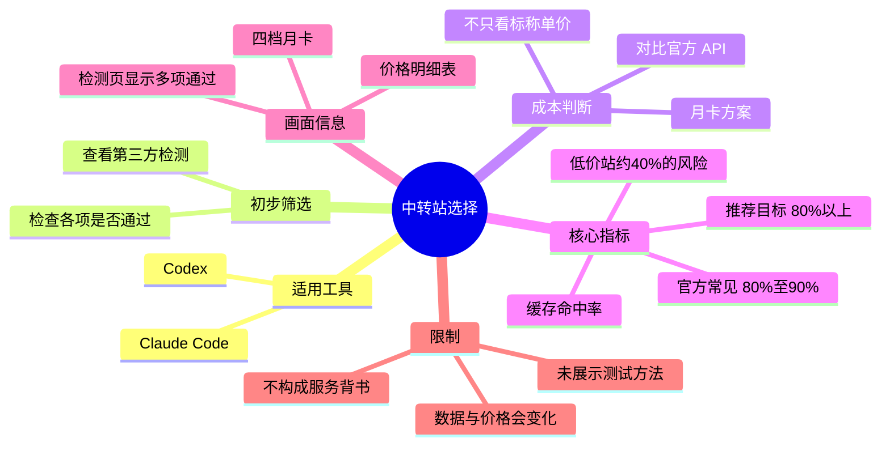
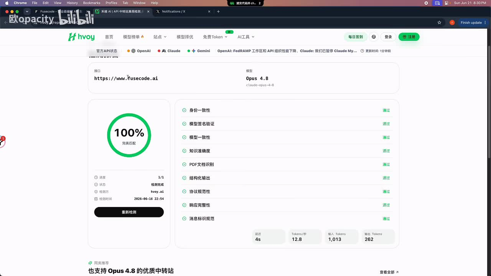
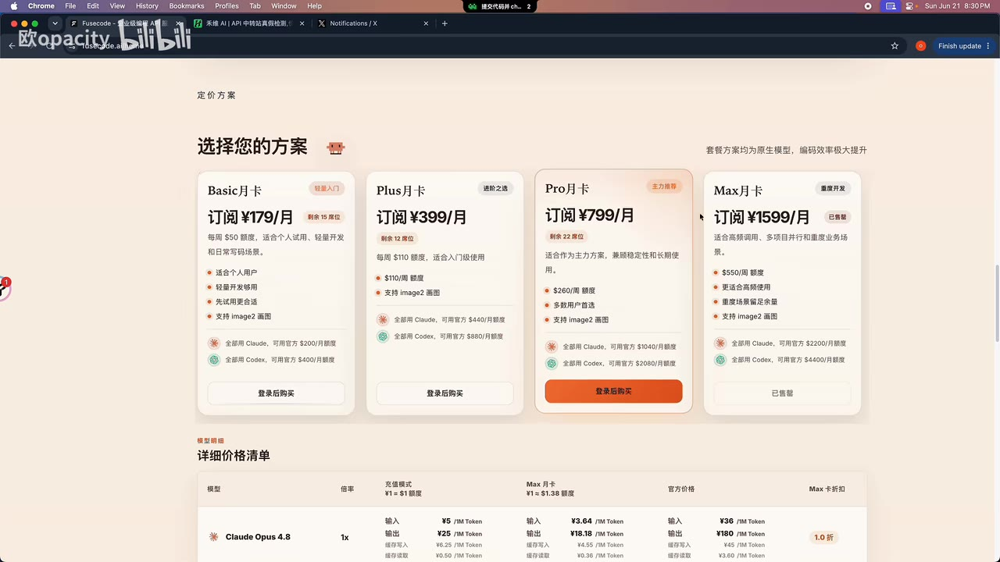
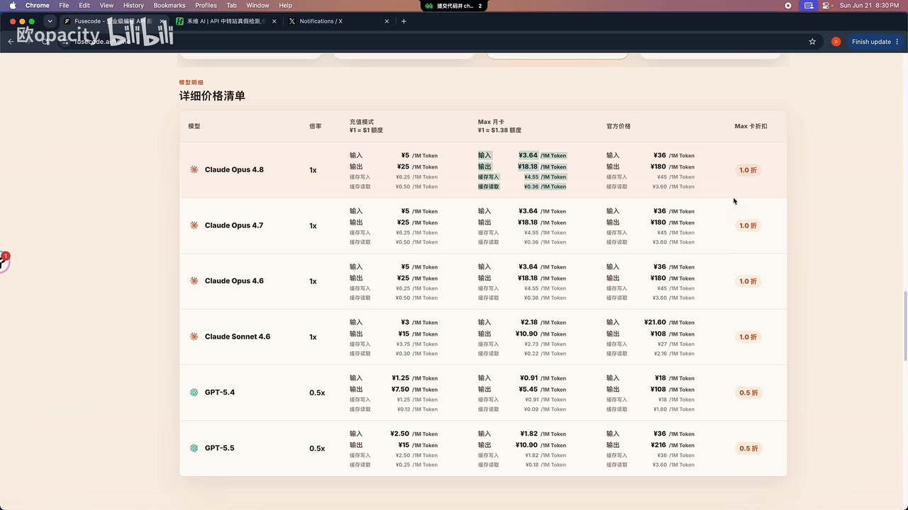

# 靠谱中转站推荐，高缓存命中

> 来源：[Bilibili 视频](https://www.bilibili.com/video/BV1C9j86iEiA) 
> UP 主：欧opacity｜发布时间：2026-06-21｜视频时长：01:21｜标签：Claude Code、Codex

## 小结

视频讨论的是为 **Claude Code、Codex** 等编码工具选择 API 中转站时，不能只看标称单价，还应重点看其**缓存命中情况**。UP 主展示了一个被第三方检测页面标记为多项“通过”的站点，以及该站点提供的月卡和价格表。

视频最核心的判断是：缓存命中率会显著影响实际任务成本。UP 主称，官方正常缓存命中率应在 **80%～90%** 左右；他认为一个中转站若能保持 **80% 以上** 的缓存命中率，才可视为“比较靠谱”。相对地，一些低价站点的命中率仅约 **40%**，即使标价低，完成同类任务的实际成本也可能更高。

UP 主同时称，所展示月卡方案相对官方 API 的价格大致在 **一折左右**。画面中的定价页展示了 Basic、Plus、Pro、Max 四档月卡，价格分别为 **179 元/月、399 元/月、799 元/月、1599 元/月**；但这些均为视频录制时网页信息，不构成当前价格或服务质量保证。

可迁移的经验是：比较中转服务时应至少交叉检查**第三方检测结果、模型/身份一致性、协议与响应完整性、缓存命中率、套餐限制与实际账单**；不要把“低单价”“检测通过”或评论区链接单独当作可靠性的充分证据。

本视频时效性较强。服务商套餐、模型名称、检测结论、缓存策略、价格与可用性均可能在视频发布后变化；视频未公开实际测试样本、统计周期、命中率计算口径，也未展示长期稳定性数据，因此不能据此验证“高命中”或“靠谱”的结论。

## 思维导图

## 目录

- [背景：为什么不能只看中转站单价](#背景为什么不能只看中转站单价)
- [检测页与基础筛选](#检测页与基础筛选)
- [套餐与价格展示](#套餐与价格展示)
- [缓存命中率：视频的核心判断](#缓存命中率视频的核心判断)
- [可执行的筛选步骤](#可执行的筛选步骤)
- [结论、限制与时效性](#结论限制与时效性)
- [字幕比对](#字幕比对)
- [评论分析](#评论分析)
- [处理记录](#处理记录)

## 背景：为什么不能只看中转站单价

### [00:00:00](https://www.bilibili.com/video/BV1C9j86iEiA?t=0)

视频面向需要通过 API 中转服务使用 **Claude Code** 或 **Codex** 的用户。UP 主开场推荐一个“中转站”，并提出选择此类服务时应前往类似的检测站点查看评分或检测项目是否通过。

这里的“中转站”在视频语境中指代为模型 API 调用提供转发、套餐或额度服务的平台。视频的目标不是讲解 Claude Code/Codex 的安装配置，而是提供一套以**检测结果与缓存命中率**为中心的服务筛选思路。

需要注意，站内字幕在此处将“中转站”误识别为“中文单词”，本次 ASR 也识别为“中软带”等无意义词；结合视频标题、简介“Claude code / codex 靠谱中转推荐”及上下文，可校正为“中转站”。

## 检测页与基础筛选

### [00:00:07](https://www.bilibili.com/video/BV1C9j86iEiA?t=7)

UP 主建议先在检测站点查看目标服务的评分或检测状态，并称画面所示站点的各项检查均为“通过”。

画面中的检测报告页面可见：

- 被检测接口显示为 `https://www.fusecode.ai`；
- 模型栏显示为 **Opus 4.8**，下方标注 `claude-opus-4-8`；
- 左侧圆环显示“**100% 完美匹配**”；
- 检测项目包括身份一致性、模型签名验证、模型一致性、知识准确度、PDF 文档识别、结构化输出、协议规范性、响应完整性、消息标识规范等；
- 右侧各项目均显示“通过”；
- 页面还显示延迟 **4s**、Tokens/秒 **12.8**、输入 Tokens **1,013**、输出 Tokens **262** 等一次检测结果。

> 图：该关键帧直接呈现视频所依赖的“检测通过”证据，包括 100% 完美匹配、模型 Opus 4.8、检测项目与延迟/吞吐等指标，有助于区分“页面展示结果”与“长期服务质量结论”。

这些项目能够作为初步筛选线索，但视频没有展示检测平台的评价规则、完整请求内容、样本量、复测次数或检测时间范围。因此，“全部通过”只能说明录屏中这一次展示的报告状态，不能独立证明服务在不同模型、不同时间、不同负载下持续稳定。

## 套餐与价格展示

### [00:00:17](https://www.bilibili.com/video/BV1C9j86iEiA?t=17)

UP 主称，所展示站点提供多种月卡方案；整体相较官方价格“相当于 API 的一折左右”。该比例是视频中的口述判断，未给出统一的计算公式、具体模型调用量或完整对照条件。

录屏定价卡片展示四档方案：

| 方案 | 订阅价格 | 页面显示月额度 | 页面描述摘要 |
| --- | ---: | ---: | --- |
| Basic 月卡 | ¥179/月 | $50 | 个人用户、轻量开发与日常写场景 |
| Plus 月卡 | ¥399/月 | $110 | 入门级使用，支持 image2 图片 |
| Pro 月卡 | ¥799/月 | $260 | 作为主力方案，多用户首选 |
| Max 月卡 | ¥1599/月 | $550 | 高频调用、多项目并行与重度业务场景 |

页面还写有“套餐方案均为原生模型，编码效率极大提升”等宣传语，并在功能区域列出“国内直连”“高可用架构”“简单集成”“完整兼容”等表述。这些属于服务页面的自我描述，视频未对其进行独立验证。

> 图：该关键帧保留四档月卡的价格、额度及场景文案，是核对 UP 主“提供多种月卡方案”及价格信息的直接画面依据；价格为录屏时状态，不能外推为当前售价。

在价格明细页中，画面可见 Claude Opus 4.8、Claude Opus 4.7、Claude Opus 4.6、Claude Sonnet 4.6、GPT-5.4、GPT-5.5 等模型条目。以画面中 Claude Opus 4.8 行为例，页面列出：

| 项目 | 页面显示数值 |
| --- | ---: |
| 充值模式输入 | ¥5 / 1M Token |
| 充值模式输出 | ¥25 / 1M Token |
| Max 月卡输入 | ¥3.64 / 1M Token |
| Max 月卡输出 | ¥18.18 / 1M Token |
| 官方价格输入 | ¥36 / 1M Token |
| 官方价格输出 | ¥180 / 1M Token |
| Max 卡折扣 | 1.0 折 |

> 图：该关键帧展示“充值模式”“Max 月卡”“官方价格”“Max 卡折扣”的并列对照，是视频“一折左右”说法在网页层面的可见依据，同时也提示该折扣可能依赖特定套餐和模型。

## 缓存命中率：视频的核心判断

### [00:00:27](https://www.bilibili.com/video/BV1C9j86iEiA?t=27)

UP 主强调，除套餐与单价外，选择中转站还要看**缓存命中情况**。这是视频最重要的经验结论。

视频中的具体表述与判断如下：

1. UP 主称官方“正常”缓存命中率在 **80%～90% 左右**。
2. 他认为较高的缓存命中可使常用任务只需支付较低比例的费用，并口述“只要花 1/10 左右的费用就可以”；但字幕在该处有断裂和误识别，视频未给出可复算的公式、缓存读写价格或具体任务 Token 构成。
3. UP 主称很多站点的缓存命中率只有 **40% 左右**。
4. 对于约 40% 的情形，他判断完成一个任务可能要花“**两倍多**”的价格。
5. 因而，他警告低价服务可能表面单价低、实际存在较多成本陷阱。
6. 对画面展示的站点，UP 主称其缓存命中率在 **80 以上**，据此评价其“非常靠谱”。

视频简介也重复了该判断：多数低价中转站缓存命中率约 40%，正常应达到 80%。应当明确：这是 UP 主的经验阈值与主张，而不是视频中完成了方法公开、可复现实验后的普适事实。

### [00:00:42](https://www.bilibili.com/video/BV1C9j86iEiA?t=42)

从成本逻辑看，缓存命中率之所以重要，是因为重复或相似上下文若能以缓存路径处理，其计费与延迟表现可能不同于全部重新处理上下文。对长上下文、多轮对话、代码库问答或持续编码任务而言，用户更应关注**账单中实际缓存相关用量与费用**，而非仅比较输入/输出单价。

不过，视频并没有说明以下决定结论的重要条件：

- 命中率的分母是请求数、输入 Token 数，还是可缓存 Token 数；
- 统计对象是单用户、全站用户还是某一模型；
- 统计周期、样本规模、缓存 TTL 与会话复用方式；
- 缓存读写费用、未命中后的价格规则；
- 不同模型、不同工具客户端、不同任务长度下是否一致。

因此，视频给出的“80% 以上”适合作为**进一步核验的门槛或提问方向**，不宜直接作为所有服务的统一合格线。

## 可执行的筛选步骤

### [00:00:07](https://www.bilibili.com/video/BV1C9j86iEiA?t=7)

基于视频展示内容，可按以下顺序进行筛选；其中第 1、2、4 步直接来自视频思路，第 3、5 步是为避免将视频口述结论直接当作事实而补充的核验动作。

1. **确认工具兼容性**  
   确认服务是否明确支持自己实际要用的客户端或协议，例如视频提到的 Claude Code、Codex。不要只看模型名称，还要看认证方式、API 地址格式和协议兼容性。

2. **查看第三方检测页**  
   按 UP 主建议，检查是否存在公开检测报告，并查看身份一致性、模型签名、协议规范性、响应完整性等项目。应记录报告链接、检测时间、模型名和本次结果，而不是只看“通过”徽章。

3. **核实检测的可重复性**  
   对同一模型做多次、不同时间段的实际请求，观察响应、报错率与延迟。视频中的单次报告显示延迟为 4 秒、吞吐为 12.8 Tokens/秒，但不能把该数值当作普遍性能承诺。

4. **比较套餐与实际计费结构**  
   读取月卡额度、模型限制、超额规则、输入/输出价格、缓存读写价格及可用期限。视频画面所列 ¥179～¥1599 月卡与对应额度仅为录屏时信息。

5. **把缓存命中率纳入实际成本测试**  
   针对自己的典型任务——例如同代码库连续提问、固定 system prompt、多轮修改——记录输入、输出、缓存读取/写入用量和最终账单。若服务只给出“80%”之类宣传数字但没有统计口径，不能据此推导实际节省比例。

6. **评估风险边界**  
   不要向不确定的第三方服务提交密钥、私有仓库、生产环境配置、客户数据或其他敏感上下文；月卡也应先小额度验证再决定是否长期购买。

## 结论、限制与时效性

### [00:00:53](https://www.bilibili.com/video/BV1C9j86iEiA?t=53)

视频的明确结论是：相对“低单价”，更应重视缓存命中；UP 主以 **80% 以上** 作为他认为较靠谱的中转站指标，并将 **约 40%** 的命中率视为可能拉高实际任务成本的风险信号。

这一结论可迁移为一个审查原则：**标称价格必须与实际账单、缓存口径、稳定性和协议兼容性一起比较。** 但视频仅展示了一个站点页面、一次检测报告和价格表，未展示缓存命中率后台截图、原始账单、对照实验、持续监控数据或服务条款。

还应注意以下限制：

- “官方 80%～90%”“80 以上靠谱”“40% 会花两倍多”等均是视频陈述，未提供可审计数据；
- “一折左右”取决于套餐、模型、用量、币种口径和是否包含缓存费用，不能概括为所有 API 调用的固定折扣；
- 检测报告中虽可见 `fusecode.ai`、Opus 4.8 和多个“通过”项，但视频没有完整说明该检测与服务商之间的关系；
- 视频时长为 81 秒，但可识别语音主要截止至约 **00:00:57.620**；其后未提供新的可转写口述内容；
- 服务商价格、模型版本、站点检测与可访问性均具有高时效性，应以当前官方页面、服务条款与自主测试为准。

## 字幕比对

| 字幕来源 | 完整性 | 专有名词 | 时间轴 | 主要问题 |
| --- | --- | --- | --- | --- |
| Bilibili 站内字幕 | 较完整，覆盖约 00:00:00.660～00:00:57.800 | 存在明显误识别，如“中文单词”“Cloud code” | 细粒度，分段时间可直接使用 | 多处词义错误；“如果90万”“一个常用物”等句子不通顺 |
| 本次 ASR 字幕 | 覆盖 3 个长段，语音覆盖率 68.45%，语音区间约 00:00:00.830～00:00:57.620 | 误识别较多，如“中软带”“检测弹点”“框枪”“章节” | 有真实时间戳，但分段过粗 | 专有名词与数值附近错误明显，且在 41 秒处跨段断句 |

本次 ASR 使用 `medium` 模型，识别语言为中文，语言置信度为 **0.99462890625**，音频时长约 **80.155 秒**。诊断中**未标记** `noAudioStream=true`，且提取到了音频与有效时间戳，因此不存在“源视频没有音轨”的情况。

最终正文以**站内字幕为主**，使用其更细粒度的真实时间轴；再结合本次 ASR、视频标题、简介和关键帧上下文进行校正。重要校正如下：

| 原始识别形式 | 正文采用形式 | 校正依据 |
| --- | --- | --- |
| 中文单词 / 中软带 / 中转带 | 中转站 | 视频标题、简介及上下文均围绕“中转站”展开 |
| Cloud code | Claude Code | 视频标签为“claude code”，且与 Codex 并列出现 |
| 检测弹点 / 检测站点 | 检测站点 | 语义与画面中的 hvoy 检测报告一致 |
| 阅卡 / 阄方案 | 月卡 / 月卡方案 | 定价页明确显示“Basic 月卡”等 |
| 缓冲命中率 | 缓存命中率 | 标题、简介与全文主题一致 |
| 如果90万 | 未作数值扩写，保留为 80%～90% 语境 | 站内字幕与 ASR 在该处都不可靠，视频未提供可验证公式 |

## 评论分析

仅处理本次可获取的热评前三条。评论内容不作为视频结论或服务质量的已验证证据。

1. **金铂中心（1 赞）**  
   评论泛泛讨论 AI 可扩展到不同实践场景、新范式设计、模型校正和材料工程等内容。它没有回应视频中的中转站、缓存命中率、定价或检测方法，对本视频的决策价值有限。

2. **FengLan_1201（2 赞）**  
   评论提供“免费的 DeepSeek”注册链接及推广参数。该信息与视频讨论的 Claude Code/Codex 中转服务并不等同，且链接指向、免费条件、隐私处理、额度限制和服务可靠性均未在素材中验证，应视为未验证的推广信息，而非推荐依据。

3. **静音区区长（0 赞）**  
   评论称“0.03x 稳定”，并给出一个 relay 域名。该说法没有说明模型、计费单位、测试时间、稳定性的测量方式或服务条款，无法验证；不应据此推导该服务的价格优势或可靠性。

## 处理记录

- **Worker ID**：worker-mrj0wjed-b0c290ad
- **模型**：gpt-5.6-terra
- **调用工具与素材**：视频元数据、站内时间轴字幕 `p01-ai-zh.srt`、本次 ASR 结果 `asr/asr-result.json` 与 `asr/transcript.srt`、关键帧、热评数据。
- **本次 ASR 检查**：已检查。ASR 使用 `medium`，CUDA、`float16`；存在有效音轨与时间戳，未出现 `noAudioStream=true` 标记。
- **字幕选择**：采用站内字幕作为主要时间轴来源，因其分段更细；对“中转站”“Claude Code”“月卡”“缓存命中率”等错误识别，以 ASR、标题、简介和画面语境交叉校正。数值和公式不清之处不作补写。
- **关键帧选择依据**：`frame-002.jpg` 用于展示第三方检测项目及一次检测指标；`frame-003.jpg` 用于记录月卡档位、价格与额度；`frame-004.jpg` 用于记录模型价格明细与页面折扣。所选帧均与正文中可核验的页面信息直接对应。
- **缓存清理**：素材未提供缓存清理执行日志或结果，无法确认是否已清理；不作“已清理”声明。
- **未解决问题**：未提供站点缓存命中率的后台统计截图、统计口径、原始账单、长期稳定性测试和服务条款；无法独立验证 UP 主对服务可靠性、折扣与实际成本的判断。
