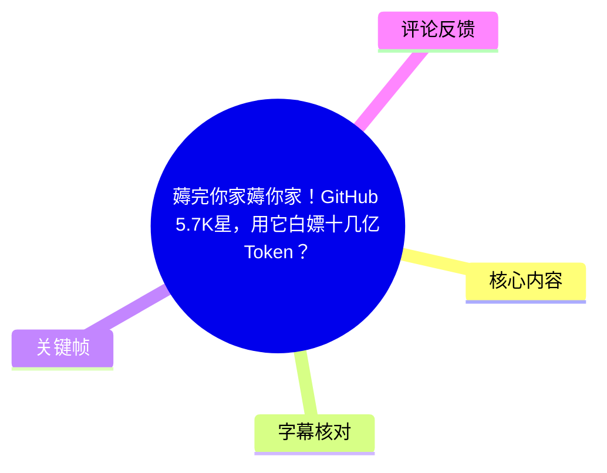
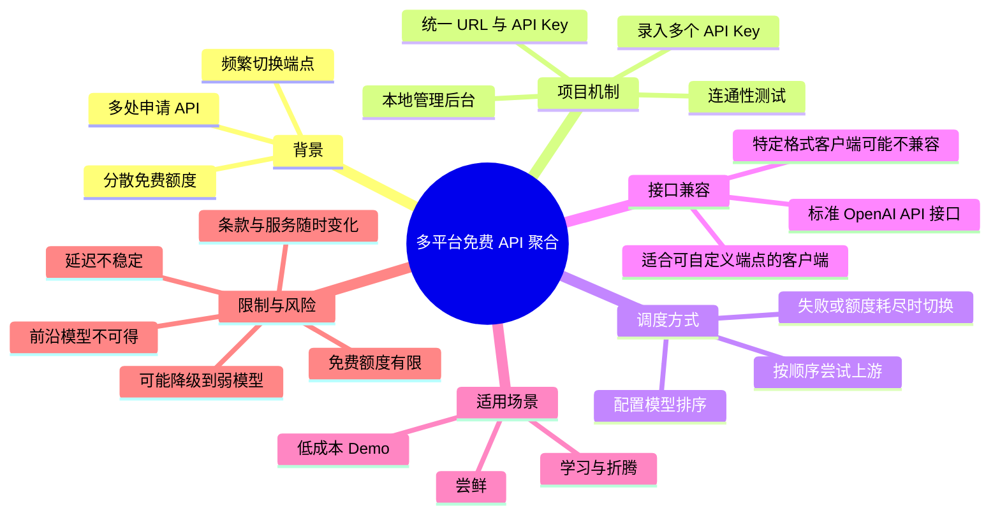
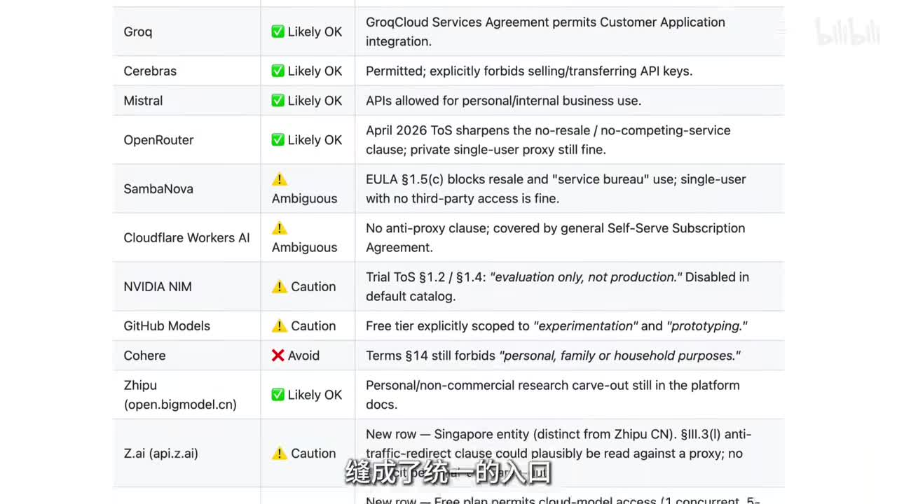
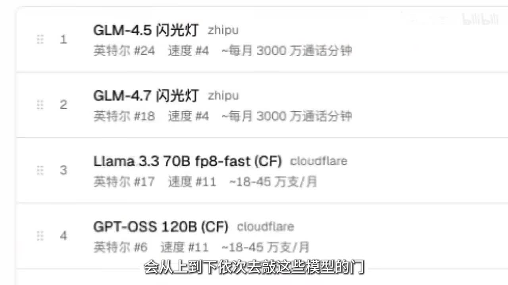

# 薅完你家薅你家！GitHub 5.7K星，用它白嫖十几亿Token？

> 来源：[Bilibili 视频](https://www.bilibili.com/video/BV13GVh6kEx8)<br>
> UP 主：机器之心官方｜视频时长：1 分 28 秒｜合集：AIcode  
> 说明：视频标题称项目约有 5.7K Star，视频口播与简介中称约有 5.9K Star；这反映 Star 数会随时间变化，本文不将其视为固定值。

## 小结

视频介绍了一个未在现有字幕素材中明确给出名称的 GitHub 开源项目。其目标不是直接“生成”免费的 Token，而是将多个大模型平台中由用户自行获取的免费 API 额度、密钥和模型，汇总为一个统一入口。视频称其可接入 **12 家主流大模型平台**，并通过统一的 URL 与 API Key 对外提供服务。

核心机制是**多上游 API 的顺序回退/切换**：用户在本地后台录入多个可用 API Key、进行连通性测试并配置模型排序；当下游发起任务时，系统会按列表从上到下尝试模型或供应商，直至任务完成。关键帧中可见排序列表示例：GLM-4.5 闪光灯、GLM-4.7 闪光灯、Llama 3.3 70B fp8-fast（CF）和 GPT-OSS 120B（CF）。

视频强调该方案输出的是**标准 OpenAI API 接口**，因此适合可配置 OpenAI 兼容端点的 Agent 或客户端；但视频也指出，某些只接受特定接口格式的工具无法直接接入。ASR 对具体产品名及格式名存在明显误识别，不能据此确认兼容或不兼容的具体软件清单。

结论并不乐观主义：免费额度本身有限，额度耗尽后可能切换到更弱的模型；同时延迟非常不稳定。它更适合体验、学习、测试 Agent 流程或制作低成本 Demo，而不适合作为严肃生产项目的唯一基础设施。视频用“不要把大楼盖在牛叉上”概括这一风险：项目的连续性不能建立在不可控、可变更的免费配额之上。

时效性尤其重要。视频元数据显示发布时间为 2026-05-30，但素材抓取时间为 2026-07-13；免费政策、模型名称、平台条款、可用额度、延迟和项目 Star 数都可能已经变化。视频中展示的条款判断仅能作为当时的讨论线索，实际使用前仍须以各服务商最新条款与账户状态为准。

## 思维导图





## 目录

- [背景：把分散免费额度聚合为一个入口](#背景把分散免费额度聚合为一个入口)
- [项目的工作机制：录入、测试、统一出口与回退](#项目的工作机制录入测试统一出口与回退)
- [操作流程与可见参数](#操作流程与可见参数)
- [接口兼容与 Agent 接入边界](#接口兼容与-agent-接入边界)
- [限制、风险与时效性](#限制风险与时效性)
- [关键帧索引](#关键帧索引)
- [字幕比对](#字幕比对)
- [评论分析](#评论分析)
- [处理记录](#处理记录)

## 背景：把分散免费额度聚合为一个入口 [00:00](https://www.bilibili.com/video/BV13GVh6kEx8?t=0)

视频开篇针对的痛点是：使用者为了获得低成本或免费的大模型调用，需要到不同平台申请 API、寻找免费额度，并在额度耗尽或接口不可用时手动更换端点。这一过程会造成：

1. **密钥分散**：不同供应商的 API Key 分别保存、分别维护。
2. **入口分散**：不同模型或平台有各自的服务地址、模型 ID、限额和调用限制。
3. **可用性波动**：免费额度用尽、接口延迟升高或上游故障时，需要人工切换。
4. **应用侧改造成本**：若每次更换供应商都要修改 Agent、SDK 或客户端配置，试用成本会进一步上升。

视频所说的开源项目试图解决的不是“绕过付费”或“凭空增加额度”，而是把多个已有的免费服务资格汇总起来，提供一个统一的调用入口。视频简介中的“狂薅个十几亿 token”属于宣传性表达；现有素材没有给出 Token 的精确计算方式、统计周期、账户数量、供应商额度明细或可复现的累计依据，因此不能将其理解为单一账户可稳定获得的保证额度。



> 图：该帧展示一个按服务商列出的表格，包含 Groq、Cerebras、Mistral、OpenRouter、SambaNova、Cloudflare Workers AI、NVIDIA NIM、GitHub Models、Cohere、智谱等名称，以及“Likely OK（可能可行）”“Ambiguous（模糊）”“Caution（谨慎）”“Avoid（避免）”等标记。它的价值在于说明：聚合多平台 API 不只是技术连通问题，还涉及各平台服务条款、免费层用途及密钥使用边界；画面中的判断不应替代对当前官方条款的核验。

## 项目的工作机制：录入、测试、统一出口与回退 [00:13](https://www.bilibili.com/video/BV13GVh6kEx8?t=13)

### 1. 将多个上游平台接入统一后台 [00:13](https://www.bilibili.com/video/BV13GVh6kEx8?t=13)

视频称，该项目将 **12 家主流大模型平台**的免费额度“缝成统一入口”。其前提是用户已经拥有相应平台的 API Key；项目承担的是密钥管理、连通性检查、模型排序与请求分发，而不是替用户自动创建账户或自动领取额度。

从视频所述流程看，系统可抽象为以下关系：

```text
下游客户端 / Agent
        │
        ▼
统一 URL + 统一 API Key
        │
        ▼
本地 API 管理后台 / 路由层
        │
        ├── 上游平台 A 的 API Key 与模型
        ├── 上游平台 B 的 API Key 与模型
        ├── 上游平台 C 的 API Key 与模型
        └── 其他已配置上游
```

该设计的关键价值在于：下游侧只需对接一个地址和一把由系统生成的统一密钥；上游侧的多平台差异则由路由层承接。

### 2. 测试可用模型、延迟与免费资格 [00:24](https://www.bilibili.com/video/BV13GVh6kEx8?t=24)

视频表示，在录入 API Key 后，可以进行测试；测试成功后，后台会显示至少三类信息：

- 当前可“白嫖”的模型，即当前被识别为可使用免费额度的模型；
- 对应的服务商或来源；
- 延迟，单位为毫秒（ms）。

这里的“测试成功”最多表示某个时点的连接或请求成功，不能等同于长期可用。免费层通常可能有请求频率、并发数、每日/月度额度、模型范围、地区、账户资格等限制。视频没有展示具体测试请求参数、超时阈值、重试策略或错误码处理，因此无法确认其健康检查的严格程度。

### 3. 以排序驱动顺序尝试与回退 [00:37](https://www.bilibili.com/video/BV13GVh6kEx8?t=37)

视频明确说明：复制系统生成的统一 URL 和 API 后，用户可“按照需求给模型自动排序”；任务发送后，系统会“从上到下依次去敲这些模型的门”，直到把任务完成。

这是一种**优先级队列式路由**。视频没有给出完整的切换条件，合理且保守的理解应是：当排在前面的上游不能完成当前请求时，系统会尝试后续候选项。至于“不能完成”是否包括余额耗尽、429 限流、鉴权失败、连接超时、模型错误、内容拦截、上下文过长或响应质量不足，素材并未逐项说明。



> 图：该帧直接展示模型排序界面，列表前四项依次为 GLM-4.5 闪光灯、GLM-4.7 闪光灯、Llama 3.3 70B fp8-fast（CF）和 GPT-OSS 120B（CF）；可见来源标注包括 zhipu 与 cloudflare，界面还显示“英特尔 #24”“速度 #4”“~每月 3000 万通话分钟”“~18–45 万支/月”等文字。由于这些文字的具体统计口径在视频中未解释，本文只记录其为界面显示信息，不将其解释为确定性能指标或官方配额。

## 操作流程与可见参数 [00:20](https://www.bilibili.com/video/BV13GVh6kEx8?t=20)

以下步骤按视频口播顺序整理。视频没有给出项目仓库地址、安装命令、容器配置、环境变量名称或具体字段，因此不补写不存在的命令。

### 步骤 1：下载开源项目到本地 [00:20](https://www.bilibili.com/video/BV13GVh6kEx8?t=20)

视频称先将开源项目下载到本地，随后会获得一个“极简的 API 管理后台”。

- **目的**：在本地管理多个上游服务的 API Key 与路由配置。
- **素材未提供的信息**：仓库名称、系统要求、安装方式、是否需要 Docker、端口号、是否支持远程部署。
- **实践提醒**：由于该后台涉及多个 API Key，部署环境应避免公开暴露；视频未说明其密钥加密、访问认证、日志脱敏或权限控制能力。

### 步骤 2：依次填写已有 API Key [00:24](https://www.bilibili.com/video/BV13GVh6kEx8?t=24)

将手头已获取、且允许用于相应场景的 API Key 填入后台。

- **输入**：各供应商的 API Key。
- **目标**：让路由层可以代表用户调用不同上游。
- **边界**：仅应使用本人合法获取、且符合平台服务条款的密钥。关键帧中的条款表也显示，部分服务存在“仅评估”“仅实验/原型”“不得转售/转交”等限制或不确定性。

### 步骤 3：执行连通性与模型测试 [00:28](https://www.bilibili.com/video/BV13GVh6kEx8?t=28)

视频称测试后可见“白嫖的是哪家模型、延迟是多少毫秒”。

建议将这一步理解为上线前的基础检查，而非质量保证：

| 检查项 | 视频可确认内容 | 不能从素材确认的内容 |
| --- | --- | --- |
| 认证 | 录入 Key 后可测试 | 是否区分密钥失效、权限不足与余额耗尽 |
| 模型可用性 | 可显示可用模型 | 是否测试每个模型的完整能力与上下文长度 |
| 延迟 | 可显示毫秒级延迟 | 测量口径、采样次数、网络位置与波动范围 |
| 免费资格 | 可识别可免费调用的模型 | 额度剩余量、限流规则、免费资格持续时间 |

### 步骤 4：复制统一 URL 与 API Key [00:35](https://www.bilibili.com/video/BV13GVh6kEx8?t=35)

后台会生成统一 URL 和 API Key，供下游应用配置。视频称其输出为标准 OpenAI API 接口。

可确认的调用层面含义是：对于支持自定义 OpenAI 兼容 API 地址与密钥的应用，通常只需将原有上游参数替换为该统一入口。视频没有展示请求示例，因此不能确认模型列表接口、聊天补全路径、流式输出、函数调用、视觉输入、嵌入模型或错误格式是否完全兼容。

### 步骤 5：按需求排序模型 [00:39](https://www.bilibili.com/video/BV13GVh6kEx8?t=39)

视频建议根据需求自动排序。结合画面，可用于排序的参考信息包括：

- 模型名称；
- 上游服务商；
- 界面中的速度或延迟信息；
- 界面显示的可用额度/调用量文字；
- 用户对模型能力与稳定性的主观优先级。

排序本质上是在“能力、响应速度、额度、稳定性”之间取舍。若把性能更好的模型放前面，免费额度可能更快耗尽；若把高限额但弱的模型放前面，Agent 的任务质量可能下降。

### 步骤 6：下游请求触发顺序尝试 [00:47](https://www.bilibili.com/video/BV13GVh6kEx8?t=47)

当 Agent 或客户端发送任务后，系统按排序尝试候选模型，直至任务完成。该机制带来的经验是：

- 为不同任务准备不同排序，可能优于全部任务共用一张列表；
- 对高要求任务，应避免把能力差异很大的模型无差别回退；
- 对需要结果一致性的任务，应记录实际命中的上游模型；
- 对长链路 Agent，某一步切换到弱模型可能影响后续推理、工具调用或代码质量。

视频没有展示是否支持任务分类、按成本路由、按延迟路由、熔断、缓存、并发队列或失败告警，不能默认具备这些能力。

## 接口兼容与 Agent 接入边界 [00:53](https://www.bilibili.com/video/BV13GVh6kEx8?t=53)

视频的兼容性判断可以分成两层。

### 可接入的一侧：标准 OpenAI API 接口 [00:53](https://www.bilibili.com/video/BV13GVh6kEx8?t=53)

口播称输出的是标准 OpenAI API 接口，因此“可以配置到某类 Agent”。ASR 将该 Agent 名称识别为“Open Cloud”，但这一专有名词缺乏站内字幕或清晰画面佐证，本文不据此确认具体产品名。

可可靠保留的技术结论是：**若下游应用支持自定义 OpenAI 兼容 Base URL 和 API Key，则存在接入可能。** 实际接入前仍须验证：

1. 所需模型名是否被路由层暴露；
2. 下游是否依赖特定的 OpenAI 扩展字段；
3. 流式响应格式是否兼容；
4. Tool Calling / Function Calling 是否透传；
5. 失败时是否会切换模型，且切换后任务上下文是否能保持一致。

### 不可直接接入的一侧：只认特定格式的工具 [00:58](https://www.bilibili.com/video/BV13GVh6kEx8?t=58)

视频称“像……这种只认……格式的”工具只能错过。ASR 对产品名识别为“Cloud Code”，对格式名识别为“SRP”，两者均缺乏可靠佐证，不能将其当作精确技术术语。

可保留的原则是：**API 兼容不是“能访问模型”就足够。** 如果客户端固定使用某一厂商私有协议、固定鉴权流程、固定请求结构或特有能力字段，而统一入口仅实现 OpenAI 兼容格式，则二者不能直接互通，除非额外存在协议适配层。视频未演示此类适配层。

## 限制、风险与时效性 [01:04](https://www.bilibili.com/video/BV13GVh6kEx8?t=64)

### 1. 免费层不能覆盖前沿模型 [01:04](https://www.bilibili.com/video/BV13GVh6kEx8?t=64)

视频明确提醒：“今天 GPT、Claude 的前沿模型想都别想。”这里应理解为视频所讨论的免费额度聚合方案无法保证获得这些前沿付费模型，而不是断言所有平台、所有时间都不存在任何试用机会。

这意味着对高难度编码、复杂推理、可靠工具调用、长上下文任务而言，实际可用模型可能与用户最初期望的能力存在落差。

### 2. 免费额度有限，耗尽后会发生能力降级 [01:11](https://www.bilibili.com/video/BV13GVh6kEx8?t=71)

视频称，每日免费额度“就那么点”；用完后系统会自动切换到更弱模型，使用者的直观感受是 Agent “越用越笨”。

这一描述揭示了自动回退的代价：

- **成功率不等于质量**：任务被完成不代表结果同样可靠。
- **模型漂移**：同一个工作流在不同时段可能命中不同模型，输出一致性下降。
- **隐性故障**：相比直接报错，弱模型给出貌似合理但错误的答案更难发现。
- **调试困难**：若没有记录每次实际命中的模型，难以定位质量下降来自提示词、工具、数据还是模型切换。

### 3. 延迟不稳定 [01:17](https://www.bilibili.com/video/BV13GVh6kEx8?t=77)

视频评价延迟“极其不稳定”。在多上游顺序尝试架构中，整体响应时间不仅取决于最终成功的模型，也可能叠加前序失败或超时的等待时间。对交互式 Agent、在线客服、实时编程辅助等场景，这会直接损害体验。

### 4. 适合 Demo，不适合承载严肃项目 [01:20](https://www.bilibili.com/video/BV13GVh6kEx8?t=80)

视频给出的适用范围很明确：

| 场景 | 视频态度 | 原因 |
| --- | --- | --- |
| 尝鲜、学习、折腾 | 适合 | 可降低试用多平台 API 的切换成本 |
| 低成本 Demo | 适合 | 可以利用多个免费层进行验证 |
| 正式项目 | 不建议依赖 | 额度、质量、延迟与上游政策不可控 |
| 关键生产服务 | 不建议依赖 | 缺乏稳定 SLA、能力一致性与长期保障 |


> 图：该帧是视频结尾的施工现场素材，字幕为“该掏钱还是得掏”。它以形象化方式重申视频的最终判断：免费聚合可以降低实验成本，但无法替代生产环境所需的稳定服务与可预期成本。

### 5. 合规与账户风险 [00:13](https://www.bilibili.com/video/BV13GVh6kEx8?t=13)

关键帧中的条款表对不同供应商标记了“可能可行、模糊、谨慎、避免”等等级，且提到“不得转售/转交 API Key”“仅评估用途”“实验与原型”等限制。由此可得的实践原则是：

- 不要将自己的 API Key 提供给第三方或公共转发服务；
- 不要将免费层用于服务条款明确禁止的生产、转售或代运营用途；
- 不要因为项目技术上能聚合就推断其在条款上必然允许；
- 平台条款更新、模型下架、配额缩减、账户风控都可能使现有配置立即失效。

上述原则是对画面内容和视频风险提示的归纳，不构成法律意见。

## 关键帧索引 [00:13](https://www.bilibili.com/video/BV13GVh6kEx8?t=13)

| 关键帧 | 正文位置 | 画面内容 | 选择价值 |
| --- | --- | --- | --- |
| `frames/frame-001.jpg` | 背景与合规风险 | 多家模型/API 服务商的条款可行性判断表 | 证明视频不仅讨论技术聚合，也意识到上游服务条款差异。 |
| `frames/frame-002.jpg` | 路由机制与步骤 | 具有拖拽排序标记的模型优先级列表 | 直接对应“从上到下依次尝试模型”的核心机制，并展示部分模型与来源。 |
| `frames/frame-003.jpg` | 结论与限制 | 施工现场片段及“该掏钱还是得掏”字幕 | 概括视频最终立场：免费方案适合实验，不应替代稳定付费基础设施。 |

## 字幕比对 [00:00](https://www.bilibili.com/video/BV13GVh6kEx8?t=0)

本次任务已执行 ASR；未提供可用的 Bilibili 站内字幕，因此不存在可直接采用的人工/站内字幕版本。

| 字幕来源 | 完整性 | 专有名词 | 时间轴 | 主要问题 |
| --- | --- | --- | --- | --- |
| Bilibili 站内字幕 | 无可用素材 | 无法评估 | 无法评估 | 素材明确标注“未提供可用站内字幕”。 |
| 本次 ASR 字幕 | 覆盖了完整口播主线 | 较差，存在多处误识别 | 未提供逐句时间戳 | 如“考验项目”“5.9PESTA”“免费油度”“OPPAI”“Open Cloud”“Cloud Code”“SRP”等识别不可靠。 |

### 最终字幕采用策略

本文以本次 ASR 的**语义主线**为基础，并通过视频元数据、关键帧文字和上下文进行有限校正；无法可靠校正的专有名词不作强行补全。

已校正或规范化的主要表述包括：

| ASR 原文 | 本文处理 | 依据 |
| --- | --- | --- |
| “免费油度” | 免费额度/配额 | 上下文为多家平台的免费调用资源。 |
| “API-K” | API Key | 上下文为“把零散的……往里填”，且后文有统一 API。 |
| “标准OPPAI接口” | 标准 OpenAI API 接口 | 语义与常见兼容接口表述相符；视频口播明确意指标准接口。 |
| “会从上到下一次去敲这些魔器的门” | 按排序从上到下依次尝试这些模型 | `frame-002.jpg` 显示模型排序列表，口播语义清晰。 |
| “今天JPT Cloud的前沿模型” | GPT、Claude 的前沿模型 | 语境为当前主流前沿模型；但 ASR 没有可靠逐字文本，保留为视频陈述，不扩展到具体型号。 |
| “Open Cloud”“Cloud Code”“SRP” | 不确认具体产品和协议名称 | 无站内字幕、无清晰关键帧可验证，避免编造。 |

## 评论分析 [01:24](https://www.bilibili.com/video/BV13GVh6kEx8?t=84)

仅处理已获取的热评前三条。评论反映观众对项目定位的理解，不构成关于该项目功能、合规性或模型质量的已验证事实。

1. **FlandreTiamat（33 赞）**  
   > “belike：当你把龙虾/cc 接入某黑心中转站0.5B模型”

   该评论担忧自动路由或中转可能把原本期待的高能力客户端/模型，导向参数量很小、能力很弱的模型。“龙虾/cc”具体所指未在素材中解释。它与视频“额度用完后自动切到更弱模型、Agent 越用越笨”的风险提示相呼应，但“黑心中转站”的评价是评论者的戏谑性判断，不能据此认定该项目或任何服务商存在恶意行为。

2. **awaw_a（15 赞）**  
   > “我以为自动薅呢，这不就是帮我用完一个换下一个吗[孤独摇滚_吃草]”

   该评论准确指出其理解的功能边界：项目并非替用户自动获取免费资格，而是将用户已有的多个额度按顺序使用并切换。这与视频口播“把手头好用的 API Key 依次填入”“从上到下依次尝试”的描述一致，是对项目定位的有效补充。

3. **超极巨化-傅立叶（7 赞）**  
   > “大众点评是吧”

   该评论将多模型聚合、排序和选择机制类比为“大众点评”的多选服务平台，强调它像一个汇集多个来源的入口。这是形象化比喻，没有提供可验证的技术细节；其价值在于反映观众对“聚合层/路由层”定位的直观理解。

## 评论分析

本次流程未获取到可用热评，因此不推断观众态度或额外结论。

## 处理记录

- Worker ID：`worker-mrj0wjed-b0c290ad`
- 模型：`gpt-5.6-terra`
- 调用工具与素材：视频元数据、视频素材产物清单、ASR 字幕、关键帧、热评数据；未提供可用站内字幕。
- 使用的应用工具：素材采集产物中包含合并视频、音频、关键帧、字幕目录、ASR 目录和评论目录；本次整理基于任务提供的已获取内容完成。
- 字幕选择：站内字幕不可用；已执行本次 ASR。正文以 ASR 的完整语义为基础，结合元数据与关键帧做保守校正；对无法核实的项目名、客户端名和协议名明确保留不确定性。
- 关键帧选择依据：`frame-001` 用于说明多服务商及条款边界；`frame-002` 直接支撑模型排序与顺序回退机制；`frame-003` 支撑视频对免费方案适用边界的最终结论。
- 评论范围：仅分析可获取热评前三条，分别为 33 赞、15 赞、7 赞的评论。
- 缓存清理：未在本次对话环境中生成额外可清理的临时缓存；任务提供的素材路径作为引用依据保留。
- 未解决问题：素材未给出开源项目仓库名、安装命令、配置字段、完整兼容性清单、准确路由失败条件及免费额度统计口径；ASR 中若干专有名词误识别，无法在不编造的前提下完全还原。
