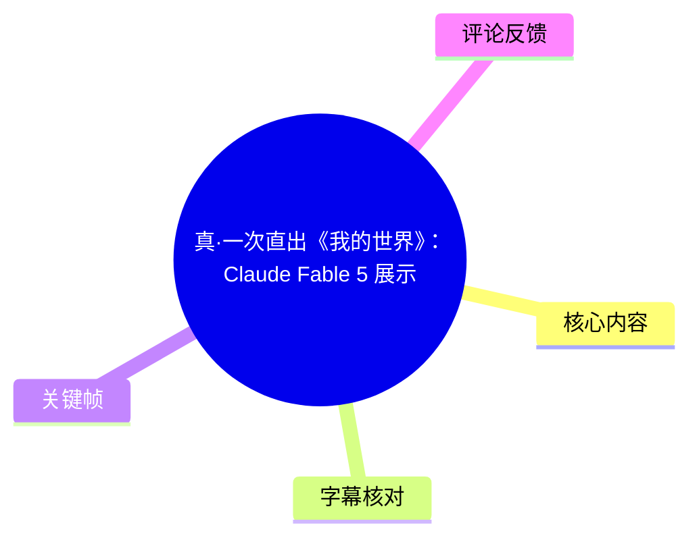
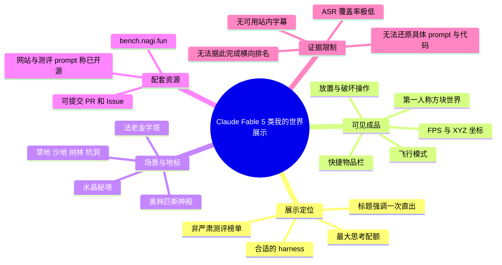
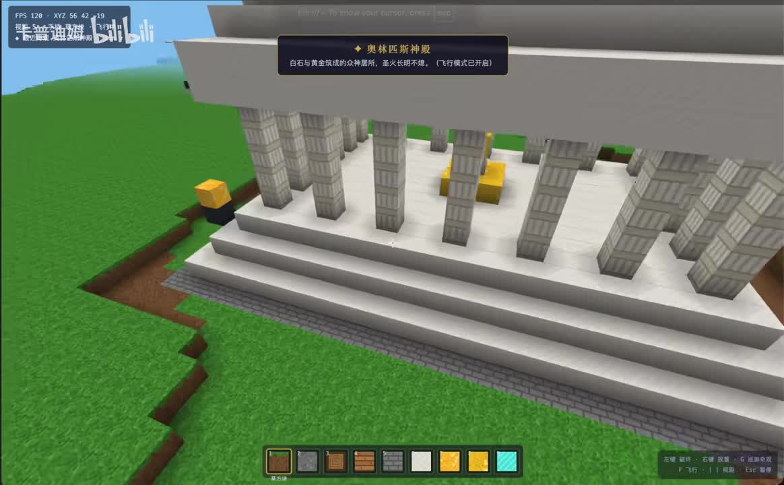
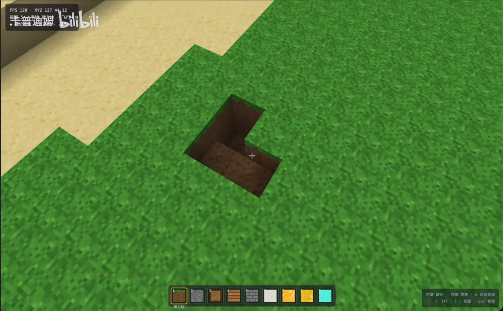
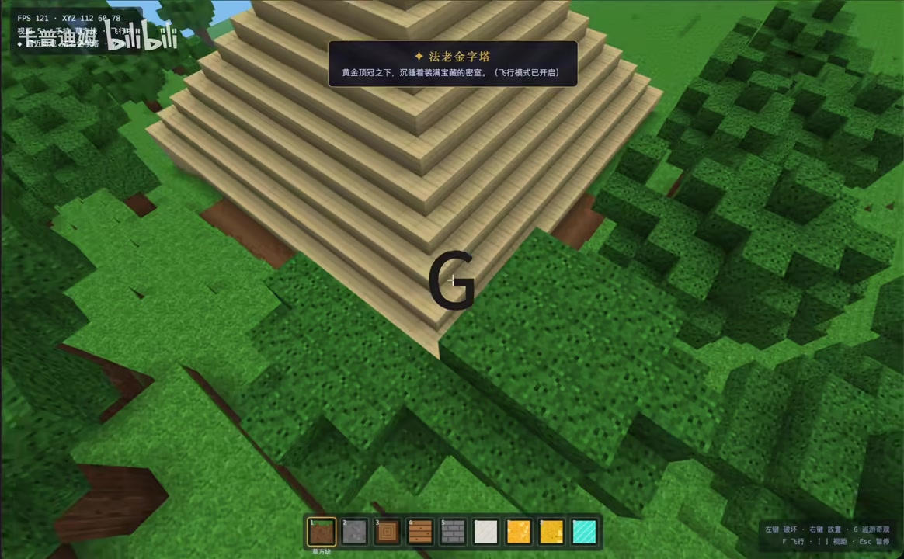
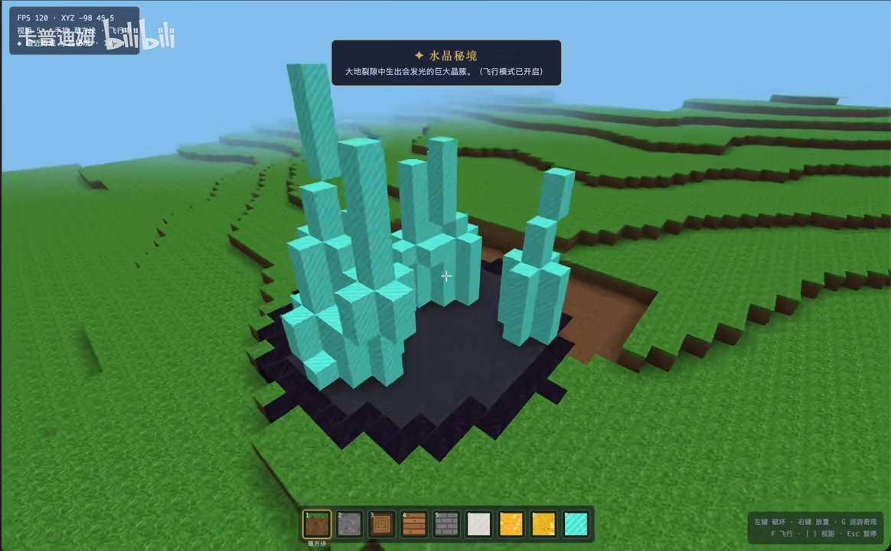

# 真·一次直出《我的世界》：Claude Fable 5 展示

> 来源：[Bilibili 视频](https://www.bilibili.com/video/BV1cSES6ZEiP) 
> UP 主：卡普迪姆｜视频时长：147 秒｜画面规格：1748×1080 
> 注：视频未提供可用站内字幕；本次 ASR 几乎未识别出有效口语，因此以下内容以视频标题、UP 主简介、元数据和关键帧可见画面为依据，并明确标注证据边界。

## 小结

这是一段展示以 **Claude Fable 5** 产出类《我的世界》像素沙盒作品效果的视频。标题强调“真·一次直出”，而 UP 主简介进一步限定了其展示条件：在“最大思考配额”和“最合适的 harness（执行/编排框架）”下，展示模型单次生成的效果；这并非严肃、可直接用于模型排名的测评榜单。

从关键帧可确认，成品具有第一人称方块世界的基本交互形态：画面左上角显示 FPS 和 XYZ 坐标，底部有物品快捷栏，右下角有鼠标建造/破坏、建造清单、飞行和菜单等操作提示。场景中可见草地、沙地、树林、坑洞，以及以方块搭建的神殿、金字塔和水晶簇等地标。

视频所展示的重点不只是静态建模。画面出现了“奥林匹斯神殿”“法老金字塔”“水晶秘境”等成就/地点提示，并明确可见“飞行模式已开启”。这说明展示对象至少包含世界浏览、方块放置与破坏、快捷物品切换、坐标显示、地标/成就提示等可见交互与 UI 元素；但仅凭现有画面，无法验证这些功能的内部实现、代码规模、性能压力测试结果或是否完整复刻《我的世界》的全部规则。

UP 主同时给出模型对战平台 `bench.nagi.fun`，并称网站与测评任务 prompt 已开源，可通过 PR、Issue 参与补充案例。该信息是视频外的配套资源说明，不能据此推导该视频具体使用的 prompt、harness 配置或 Fable 5 的公开版本参数。

本视频适合关注 AI 编程 Agent、生成式网页游戏/交互原型、模型评测方法的人阅读。最重要的使用原则是：将其视为**特定高资源预算与特定编排条件下的一次成果展示**，而不是“任意用户、任意提示词、任意环境都能稳定一次生成”的能力证明。视频及其相关模型、平台与开源仓库均有时效性，应以访问时页面和仓库状态为准。

## 思维导图

## 目录

- [展示背景与时效边界](#展示背景与时效边界)
- [可从画面确认的交互与技术要素](#可从画面确认的交互与技术要素)
- [场景、地标与关键帧解读](#场景地标与关键帧解读)
- [可复用的展示与评测经验](#可复用的展示与评测经验)
- [参数、限制与未证实事项](#参数限制与未证实事项)
- [字幕比对](#字幕比对)
- [评论分析](#评论分析)
- [处理记录](#处理记录)

## [展示背景与时效边界](https://www.bilibili.com/video/BV1cSES6ZEiP?t=7)

视频标题为“真·一次直出《我的世界》：Claude Fable 5 展示”，标签包括“我的世界”“沙盒游戏”“AI”“claude”“Fable5”“像素风”“大模型”“Agent”等。标题中的“《我的世界》”在此应理解为对方块沙盒视觉和玩法形态的描述；现有素材不足以证明它使用了《Minecraft》原始代码、素材或完整机制。

UP 主简介提供了该展示的必要限定：

1. 使用对象被描述为“Fable 5 做的模型对战平台”中的展示案例。
2. 平台地址为：[`bench.nagi.fun`](https://bench.nagi.fun)。
3. 网站和测评任务的 prompt 被 UP 主称为“均已开源”，并邀请用户通过 PR、Issue 补充评测案例。
4. UP 主明确声明：这“不是严肃测评榜单”，而是为了展示模型在**最大思考配额**与**最合适 harness**下“一次生成”的效果。

这里的 `harness` 可理解为驱动模型完成任务的外部执行框架或工具编排环境，例如上下文组织、文件读写、运行测试、迭代策略等。该词在简介中出现，但视频素材没有给出其具体实现、版本、工具权限、上下文长度、运行轮数或费用，不能擅自补全。

时间轴方面，本次 ASR 唯一可直接定位的语音片段位于 **00:00:07.180—00:00:07.260**。由于没有其他可靠字幕段落，不能依据文字叙述顺序反推其余画面发生时间；本章链接仅指向该唯一可验证的音频时间锚点，并不代表全部画面内容都发生在第 7 秒。

## [可从画面确认的交互与技术要素](https://www.bilibili.com/video/BV1cSES6ZEiP?t=7)

关键帧显示的是一个方块化、第一人称视角的沙盒世界。以下项目属于画面直接可见的功能或界面信息：

| 类别 | 可见证据 | 可确认结论 | 不能确认的部分 |
| --- | --- | --- | --- |
| 性能显示 | 左上角出现 `FPS 120`、`FPS 121` 等读数 | 展示版本带有实时帧率叠加层 | 无法确认测试机器、分辨率设置、帧率统计口径或持续稳定性 |
| 空间定位 | 左上角显示 `XYZ` 及数值 | 世界内存在坐标位置显示 | 不足以确认地图边界、种子、存档格式或坐标精度 |
| 物品选择 | 底部有一排方块图标快捷栏 | 至少具备物品/方块的快速切换界面 | 图标总数、物品体系、合成系统和库存逻辑未展示 |
| 基础建造 | 右下角提示“左键破坏、右键放置” | 可见设计意图包括破坏与放置两种方块操作 | 无法仅据单帧验证碰撞、掉落物、耐久、撤销或网络同步 |
| 辅助功能 | 右下角可见 `G` 建造清单、`F` 飞行、`Esc` 菜单等提示；顶部多处提示“飞行模式已开启” | 有建造清单、飞行和菜单入口的 UI 设计；飞行模式在展示中被启用 | 具体按键逻辑、可否重绑定、建造清单内容与菜单功能未展示 |
| 视觉表现 | 草地、土壤、沙地、树冠、石砖、白色建筑方块和亮青色晶簇 | 成品有多种纹理方块、地形和预设地标 | 光照、材质来源、渲染管线、版权授权与资源制作流程均无法确认 |

画面中 `FPS` 约为 120/121，只能说明这些抽帧瞬间的左上角数值；不能把它写成“游戏性能稳定为 120 FPS”，更不能外推到不同设备、不同地图规模或实际用户环境。

## [场景、地标与关键帧解读](https://www.bilibili.com/video/BV1cSES6ZEiP?t=7)

### 神殿建筑：白色方块、柱列与金色元素

> 图：画面展示带台阶、柱列和金色方块装饰的白色建筑；顶部提示可辨识为“奥林匹斯神殿”，并附有“飞行模式已开启”。这张图的价值在于，它同时呈现了大型预设建筑、方块拼装风格、物品栏、坐标/FPS 叠加层和飞行状态提示。

该场景由层叠台阶、规则排列的柱子和顶部金色构件组成，整体以白色方块为主。顶部提示的标题为“奥林匹斯神殿”，副文本可辨认出“白石与黄金铸就的众神居所，圣火长明不熄”一类的地标描述。该文案可证明展示内包含地标命名与描述性提示机制；但并不说明神殿是模型自主生成、人工预置，还是二者混合完成。

### 地形挖掘：草地与坑洞

> 图：画面中央为草地区域内的方块坑洞，准星指向地面方块，底部快捷栏和右下角操作提示仍可见。它有助于确认世界并非只有远景建筑展示，还呈现了可被挖开后的分层地形效果。

该帧中，草地方块被挖出一个具有立面和底面的坑洞，邻近区域可见沙地与草地交界。结合右下角“左键破坏、右键放置”的提示，可以谨慎判断该原型面向可编辑方块地形设计。

但这张图片只是坑洞状态，不能单独证明挖掘动画、方块掉落、背包收集、自动保存或物理系统已经实现。对于 AI 生成项目，尤其需要区分“可展示的界面和场景”与“经过完整测试的系统行为”。

### 金字塔地标：大体量阶梯结构

> 图：镜头从空中俯视阶梯状金字塔，周围有树林；顶部出现“法老金字塔”提示，中央还叠有一个字母 “G”。该图的价值是说明飞行视角可用于浏览较大结构，并展示了预设地标与环境的组合。

画面可见以浅色方块逐层堆砌的金字塔，其周围被树木和草地环绕。顶部的“法老金字塔”提示表明该结构被作为可命名地点处理。中央叠加的 `G` 可能对应建造清单快捷键或键盘操作反馈，但没有连续画面和字幕支撑，不能确定其触发结果。

该帧还再次显示飞行模式提示。飞行可以显著提高大地图展示效率，但也意味着视频中的镜头移动不等同于普通生存玩法移动；观看者不宜据此判断地面移动、跳跃或探索节奏。

### 水晶秘境：裂隙、晶簇与色彩区分

> 图：黑色裂隙/深色基底上生长出亮青色高低不一的方块晶簇，顶部提示为“水晶秘境”。该图的价值是呈现作品并非只使用常规土石木材方块，还包含具有主题辨识度的特殊地貌和色彩资产。

顶部提示“水晶秘境”的副文本可辨认出“大地裂隙中生出会发光的巨大晶簇”。从画面本身可确认：深色地表与亮青色柱状方块形成鲜明对比，晶簇由不同高度的方块柱构成。

“会发光”是屏幕提示文本中的设定描述；在静态关键帧中无法独立测量其真实照明、动态发光或对周围阴影的影响。因此，本文不将其扩展为已经验证的实时全局光照或特定渲染技术。

## [可复用的展示与评测经验](https://www.bilibili.com/video/BV1cSES6ZEiP?t=7)

尽管原视频没有公开具体 prompt、代码和构建步骤，仍可从 UP 主的自我限定与画面组织中整理出适用于 AI 编程项目展示的做法。

### 1. 先明确“展示”与“评测”的边界

UP 主已经明确此案例不是严肃排行榜，而是高思考预算、适配 harness 条件下的一次生成展示。若复用这一形式，建议在项目说明中同时写清：

- 模型名称及实际版本；
- 是否为单次生成，以及“单次”是否允许模型在工具环境中自行迭代；
- 思考预算、调用上限、上下文限制；
- 可用工具，例如终端、浏览器、文件系统、截图或测试工具；
- harness 的职责与人工介入程度；
- 评测任务 prompt 的完整版本及修改记录；
- 成功标准和失败案例。

否则，“一次直出”很容易被误解为没有运行、没有调试、没有工具调用、没有人工准备，而这些含义并未在本视频素材中得到证明。

### 2. 用可观察的交互证据替代单纯效果图

视频关键帧展示了坐标、FPS、快捷栏、操作提示、挖坑状态、飞行和多个地标。对交互原型而言，这类元素比单张精美封面更容易帮助观众判断系统边界。

可参考的展示清单如下：

1. **基础视角与定位**：显示第一人称视角、准星、坐标或调试信息。
2. **核心操作**：分别演示放置、破坏、物品切换和菜单入口。
3. **状态变化**：如飞行模式切换、方块被移除后形成的坑洞。
4. **规模场景**：从飞行视角展示大型建筑或地形。
5. **差异化内容**：例如水晶裂隙等区别于普通草地的主题地标。
6. **可复现材料**：将任务 prompt、构建方法、依赖和运行命令与视频同步公开。

本视频只明确提供了平台和“prompt 已开源”的简介说明，未给出上述材料的具体链接、提交版本或运行命令。因此后续验证应前往 UP 主提供的平台及相关仓库，而不是根据视频自行推定实现细节。

### 3. 将高资源条件写入结论，而非隐藏在脚注中

“最大思考配额”和“最合适 harness”是影响结果的重要实验条件。对于需要衡量模型真实工程能力的案例，至少应把下列因素单列记录：

| 条件 | 本视频已知情况 | 对复现的影响 |
| --- | --- | --- |
| 模型 | 标题指向 Claude Fable 5 | 未提供精确模型标识、发布日期或调用接口 |
| 生成方式 | UP 主称为一次生成效果展示 | 未说明是否包含自动工具迭代 |
| 思考预算 | 明确为最大思考配额 | 未给出 token、轮数、时长或费用 |
| 编排环境 | 明确使用最合适 harness | 未给出框架名称、版本与权限 |
| 任务材料 | UP 主称测评 prompt 已开源 | 当前素材未附 prompt 原文与固定提交版本 |
| 成功证据 | 视频展示可见画面和 UI | 未提供测试报告、错误列表、源码或可执行包 |

## [参数、限制与未证实事项](https://www.bilibili.com/video/BV1cSES6ZEiP?t=7)

### 已知参数与事实

- 视频时长：147 秒；ASR 读取到的音频时长为 146.2160625 秒，两者相差约 0.784 秒，可能来自容器时长与音频流时长的统计口径差异。
- 视频分辨率：1748×1080。
- 关键帧可见帧率读数：约 120 和 121 FPS。
- 可见快捷栏：底部存在一排方块图标，图标中可辨识出草方块、石材、木材/木板、砖块、白色方块、金色方块及亮青色方块等，但不宜仅凭缩略图为每个格子指定精确物品名称。
- 可见地标名称：奥林匹斯神殿、法老金字塔、水晶秘境。
- 可见操作/状态文字：左键破坏、右键放置、`G` 建造清单、`F` 飞行、`Esc` 菜单，以及“飞行模式已开启”。

### 重要限制

1. **字幕证据不足**：没有可用站内字幕；ASR 只识别到 0.08 秒英文短句，无法支撑逐段口述整理。
2. **关键帧缺少时间标记**：提供的关键帧文件没有对应的抽帧秒数，不能把神殿、坑洞、金字塔或水晶秘境强行绑定到某一具体时间点。
3. **没有代码与运行日志**：无法核验项目语言、引擎、依赖、文件数、构建时间、错误修复过程、模型调用次数和人工修改情况。
4. **“一次直出”的语义受限**：应按 UP 主的“最大思考配额 + 最合适 harness”条件理解，不能等同于无工具、无预设、零人工或低成本。
5. **版权与命名边界**：标题使用《我的世界》作为参照，但素材没有提供授权、资源来源或与原作代码/资产关系的说明。
6. **时效性**：模型版本、平台可用性、开源材料、评测 prompt 和站点内容可能在视频发布后变动；本文仅记录本次抓取到的元数据与素材，不保证链接长期有效。

### 未能从素材验证的事项

以下内容均不应当被本文当作既成事实：

- Fable 5 的具体版本号、所属产品线和官方技术规格；
- 游戏是否由模型从空目录完全生成；
- 是否存在人工后期修复、素材预置、模板代码或多轮人工提示；
- 是否支持存档、敌对生物、合成、红石逻辑、多人联机、昼夜循环与完整碰撞物理；
- 所示 FPS 在其他设备、分辨率和场景下能否复现；
- `bench.nagi.fun` 的当前服务状态、开源许可证和代码仓库位置。

## [字幕比对](https://www.bilibili.com/video/BV1cSES6ZEiP?t=7)

| 字幕来源 | 完整性 | 专有名词 | 时间轴 | 主要问题 |
| --- | --- | --- | --- | --- |
| Bilibili 站内字幕 | 未提供可用字幕 | 无从核验 | 无从使用 | 素材明确说明未提供可用站内字幕 |
| 本次 ASR 字幕 | 极低：仅 1 段、0.08 秒；语音覆盖率约 0.05% | 未识别出 Claude、Fable 5、地标等中文专名 | 有效：`00:00:07,180 --> 00:00:07,260` | 自动判断语言为英语，唯一文本为 “Thanks for watching!”；诊断提示有效语音少于 4%，不适合转写视频主体 |

本次 ASR 已被检查。ASR 诊断中**没有** `noAudioStream=true` 标记，因此不能称源视频没有音轨；实际情况是音频流已被提取，但识别结果的有效语音覆盖率极低。诊断给出的可能原因包括音乐、静音、音轨不匹配或识别不完整，当前素材不足以在这些原因之间作出确定判断。

最终字幕策略如下：

- 不采用 ASR 的 “Thanks for watching!” 作为内容主体证据，因为它既过于短暂，也无法与视频主题建立可靠对应。
- 站内字幕不可用，不存在可替代的逐句文本。
- 对“奥林匹斯神殿”“法老金字塔”“水晶秘境”“飞行模式已开启”、FPS、XYZ、快捷栏与操作提示的整理，来自关键帧中可见的中文 UI 与画面信息。
- 因关键帧没有抽帧时间元数据，除 ASR 唯一的 7 秒时间段外，本文不为各个视觉事件编造具体时间点。

## [评论分析](https://www.bilibili.com/video/BV1cSES6ZEiP?t=7)

仅处理本次获取到的热评前三条；评论反映的是用户态度或观点，不作为模型能力、企业行为或产品事实的证据。

1. **C_O_T_R_（912 赞）：“[打call]”**  
   这是纯支持性互动，没有提出对视频内容、Fable 5、一次生成条件或评测方法的可验证补充信息。它只能说明该评论获得较多互动，不能说明观众普遍认同任何具体技术结论。

2. **owli_（746 赞）：“月初fable five,月中5.5high,月末doubao-lite”**  
   评论以时间线式表达并列提及 Fable Five、5.5 High 和 Doubao Lite，可能是在调侃或讨论当月模型/产品发布与竞争节奏。评论未给出来源、发布日期、版本定义或比较指标，因此不能作为产品排期或模型能力对比的可靠依据。其价值主要在于提示观众关心多个模型之间的横向竞争。

3. **基洛夫级maomao（651 赞）**  
   该评论以高度反讽的长串表述批评 Anthropic，涉及营销、版权、蒸馏、用户隐私、模型限流、人工维护、定制榜单与公平竞争等话题。评论没有提供具体事件链接、证据或可核验案例，且修辞明显夸张，因此应将其视为情绪化立场表达，而不能据此确认对 Anthropic 或视频展示方的任何指控。它反映出的讨论风险是：模型展示和排行榜很容易被观众放入厂商信誉、评测公正性与用户权益的争议框架中审视。

## [处理记录](https://www.bilibili.com/video/BV1cSES6ZEiP?t=7)

- Worker ID：`worker-mrj0wbly-5dc4e50c`
- 整理模型：`gpt-5.6-terra`
- 可用素材：Bilibili 元数据、视频素材清单、ASR 诊断与 SRT、12 个关键帧路径清单、已获取热评前三条。
- 使用的应用工具：基于任务提供的素材解析产物进行整理；未提供可核验的额外工具调用日志，故不虚构下载、OCR、代码执行或网页访问记录。
- 字幕选择：站内字幕未提供可用版本；已检查本次 ASR。ASR 有音频时长和时间戳，但只识别出 `00:00:07.180—00:00:07.260` 的 “Thanks for watching!”，覆盖率约 0.05%，未作为正文转写依据。正文采用元数据、UP 主简介和关键帧可见文字/画面。
- 时间轴依据：唯一可直接使用的真实字幕时间段为 7 秒处；各章节链接统一使用 `t=7` 作为唯一可验证的音频锚点。未依据文字顺序臆测神殿、金字塔、水晶秘境等视觉场景的发生秒数。
- 关键帧选择依据：
  - `frames/frame-001.jpg`：神殿、飞行状态、FPS/XYZ、物品栏与大型建筑同屏；
  - `frames/frame-002.jpg`：坑洞与地形编辑结果，适合说明破坏/放置语境；
  - `frames/frame-003.jpg`：金字塔全景与飞行浏览视角；
  - `frames/frame-004.jpg`：水晶秘境的特殊地貌与主题方块配色。
- 缓存清理：任务素材未提供缓存清理执行记录；无法确认是否已清理，因此标记为“未提供记录，未作已清理声明”。
- 未解决问题：缺少完整字幕、关键帧抽取时间、原始 prompt、harness 配置、源代码、运行日志、模型精确版本与独立复现实验，故不能对“一次直出”的全过程或工程质量作超出画面证据的判断。

## 评论分析

- 热评 1：[打call]
- 热评 2：月初fable five,月中5.5high,月末doubao-lite
- 热评 3：致敬最不会营销、最清白、最懂安全、最尊重版权、最不会蒸馏、最严于律己宽于待人、最喜欢给用户发福利、最不爱定制榜单、最不喜欢把模型降智给用户限流、最便宜、最喜欢人工维护、最不会全程让AI工作然后出岔子只会甩锅、最不会侵犯用户隐私然后倒打一耙限制蒸馏、最喜欢修bug然后补偿用户损失、最见的别人家好、最喜欢公平竞争、最讨厌装神弄鬼的Anthropic

以上内容是观众反馈摘录，只用于补充理解视频反响，不作为正文事实依据。
