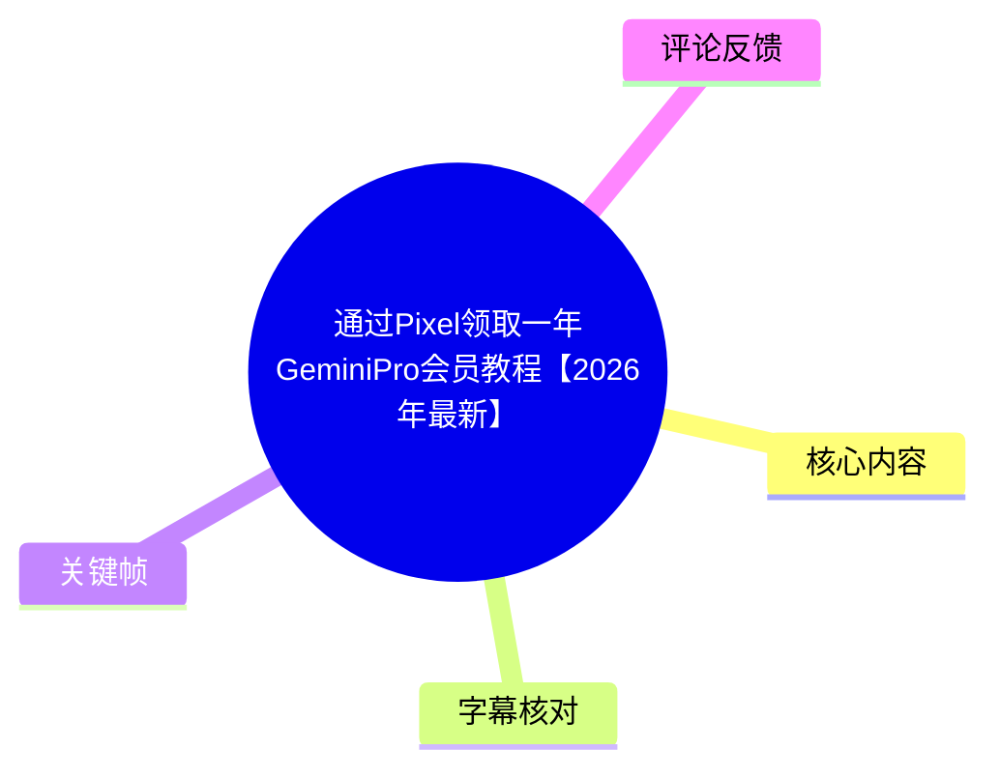
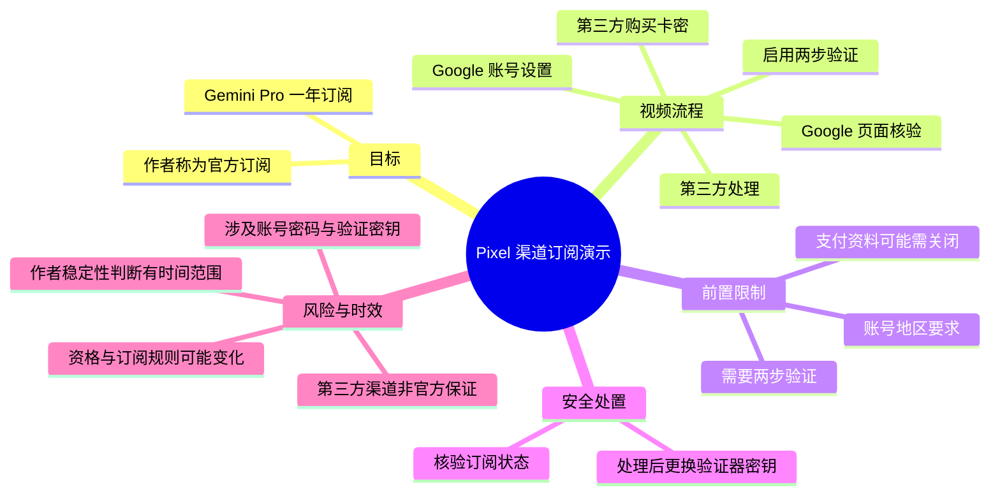
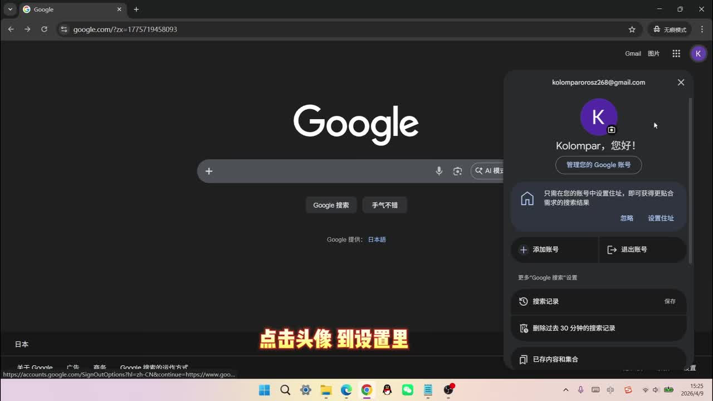
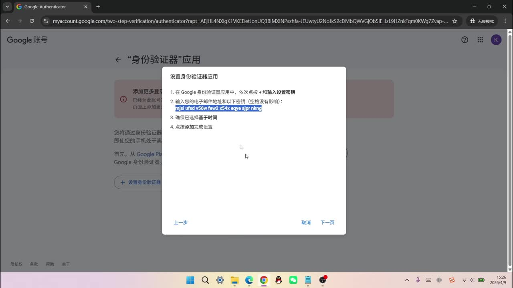
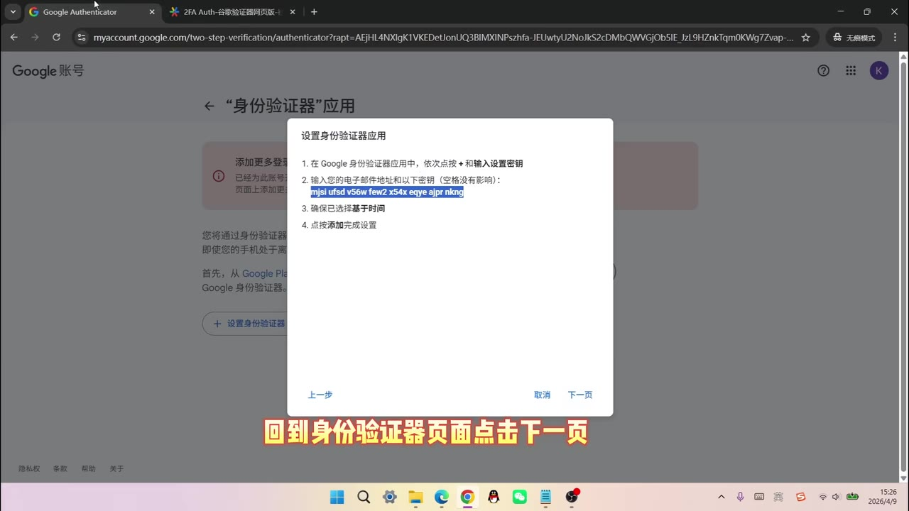

# 通过Pixel领取一年GeminiPro会员教程【2026年最新】

> 来源：[Bilibili 视频](https://www.bilibili.com/video/BV1rFRMBoEAj) 
> UP 主：放空菌QAQ ｜视频时长：04:35｜合集：AIcode  
> 视频简介声称该方案不是家庭组或学生优惠，而是“Pixel 方法”；简介还提供了外部购买页和教程网盘链接。

## 小结

视频演示了一个被作者称为“Pixel 渠道”的 Gemini Pro 一年订阅获取流程：先在 Google 账号中启用两步验证并取得身份验证器设置密钥，再经由视频所示的第三方页面购买卡密、提交账号信息及验证材料，等待处理后到 Google 账号订阅页核验结果。

该视频最重要的信息并非 Gemini Pro 本身的功能，而是作者对渠道稳定性的判断：作者称 Pixel 渠道自“去年 12 月”开始仍较稳定，且其观察范围内未出现掉订阅；同时声称此前的学生方法“已经掉得差不多了”。这均为作者在视频发布时的个人陈述，不能视为 Google 的官方承诺，也不构成渠道安全性或长期有效性的证据。

视频明确提及账号地区、支付资料状态是下单前的限制条件，但未完整展示如何核验地区资格或如何关闭支付资料。作者还要求向第三方提交 Google 账号密码及两步验证相关密钥；这会使第三方能够介入账号登录和验证，存在显著的账号接管、隐私泄露、订阅被撤销或违反服务条款风险。

出于账号安全与合规考虑，本文保留视频的流程结构、事实和风险信息，但不复述可用于向第三方交付账号密码、动态验证码或身份验证器密钥的可操作细节。若需要订阅，应优先使用 Google/Gemini 官方订阅页面及适用于自身地区的官方资格活动。

适合阅读对象：需要理解视频声称的方法、前置条件、核验位置与风险边界的观众；不适合作为将 Google 账号凭据交给第三方服务的操作指南。

## 思维导图

## 目录

- [视频定位、范围与时效性](#视频定位范围与时效性-000001)
- [账号两步验证与设置密钥](#账号两步验证与设置密钥-000007)
- [购买与兑换环节：视频陈述及限制](#购买与兑换环节视频陈述及限制-000115)
- [订阅结果核验与安全收尾](#订阅结果核验与安全收尾-000247)
- [作者的渠道稳定性判断](#作者的渠道稳定性判断-000415)
- [风险、限制与替代建议](#风险限制与替代建议-000115)
- [字幕比对](#字幕比对)
- [评论分析](#评论分析)
- [处理记录](#处理记录)

## 视频定位、范围与时效性 [00:00:01](https://www.bilibili.com/video/BV1rFRMBoEAj?t=1)

视频开头称将“快速获取 Gemini Pro 一年的官方订阅”。后续实际展示的是：利用被称为“Pixel”的第三方销售/兑换渠道，购买“一年 Gemini”的卡密，并由外部页面处理账号信息的过程。

需要区分以下三层信息：

1. **视频的演示对象**：Google 账号安全设置、卡密购买页面、外部兑换页面、Google 账号中的“钱包和订阅”页，以及 Gemini 官网。
2. **作者的主张**：该渠道“目前比较稳”，不是家庭组或学生优惠。
3. **未被视频独立证实的部分**：渠道是否获得 Google 官方授权、适用地区及资格规则、卡密来源、服务方如何处理账号数据、订阅是否能长期保留，以及是否符合 Google 服务规则。

视频元数据的发布时间对应 2026 年 5 月。作者提到“去年 12 月开始”且当前未遇到掉订阅，这只是截至视频制作时的经验描述。订阅促销、设备资格、地区限制、支付资料规则与风控策略均可能随时调整。

## 账号两步验证与设置密钥 [00:00:07](https://www.bilibili.com/video/BV1rFRMBoEAj?t=7)

视频首先进入 Google 账号设置，路径被口述为“点击头像到设置里”，随后进入“安全性与登录”，向下查找“两步验证”，再选择“身份验证器”。

作者在此阶段展示了身份验证器的设置界面：当无法扫描二维码时，页面可以显示一串手动设置密钥。视频要求复制并保存该密钥，然后在另一个生成验证码的网站中粘贴密钥取得一次性验证码，最后回填 Google 页面完成两步验证启用。

> 图：关键帧展示浏览器中的 Google 页面与右上角账号菜单，画面字幕提示“点击头像 到设置里”。它用于确认视频的起始操作发生在 Google 账号界面，而非 Gemini 站点内。

> 图：关键帧显示“设置身份验证器应用”弹窗，其中包含可手动输入的设置密钥，并有“下一页”按钮。该画面说明视频涉及两步验证器密钥，而不是普通登录验证码；此类密钥属于高敏感认证材料。

> 图：关键帧展示 Google 账号主页面及左侧“安全性与登录”入口，页面中还出现“重要安全提醒”。它有助于理解后续视频要求返回安全设置进行验证器更换的原因。

### 视频中可确认的设置要点

- 进入 Google 账号的“安全性与登录”页面。
- 找到并启用“两步验证”。
- 选择“身份验证器”作为验证方式。
- 视频在约 01:06 口述：应确保两步验证处于开启状态。
- 视频后半段再次进入相同页面，删除此前添加的身份验证器并重新添加，以生成新的设置密钥。

### 安全边界

身份验证器设置密钥可持续生成一次性验证码，其敏感性接近账号密码。视频将该密钥粘贴到“二方网站”以取得验证码，并在后续兑换环节向外部页面提交账号登录材料。即便视频随后建议更换密钥，也无法消除已向第三方披露凭据期间的风险，例如：

- 第三方可能在密钥轮换前登录或保留会话；
- 账号密码、一次性验证码和设置密钥的组合可显著扩大账户接管风险；
- 账号可能触发异常登录、风控或恢复流程；
- 凭据提交行为可能不符合平台条款或组织账号安全规范。

因此，不建议将账号密码、验证码、恢复码或身份验证器设置密钥提供给非官方页面、陌生服务商或个人。

## 购买与兑换环节：视频陈述及限制 [00:01:15](https://www.bilibili.com/video/BV1rFRMBoEAj?t=75)

约 01:15，作者打开视频简介所指向的外部页面；约 01:24 选择 Gemini，约 01:28 购买“开通一年 Gemini”的卡密。作者称页面内附有使用教程。

### 视频明确说明的前置条件

| 条件 | 视频口述时间 | 视频说明 | 未展示/未证实部分 |
| --- | ---: | --- | --- |
| 账号地区 | 01:30–01:35 | 作者称账号地区有要求 | 未说明具体支持地区、资格判定依据或官方规则来源 |
| 支付资料 | 01:35–01:42 | 作者称若有支付资料“还需要关闭” | 未演示关闭方法、原因、适用范围与潜在影响 |
| 两步验证 | 00:07–01:09 | 需启用身份验证器相关验证 | 并非 Google 官方订阅的普遍前置条件；视频用途与第三方流程相关 |
| 卡密 | 01:28–01:48 | 购买一年 Gemini 卡密 | 卡密来源、授权关系、适用规则及售后保障未验证 |

作者表示，如果上述条件都符合即可购买；约 01:46 称卡密已购买完成。随后打开兑换地址并粘贴卡密。

### 外部兑换页面涉及的高风险信息

在约 02:00，视频口述称要“输入账号密码、Alpha 密钥”；结合前后语境和关键帧，ASR 中反复出现的“Alpha 密钥”很可能是对身份验证器相关设置密钥的错误识别，不能据此确认其官方字段名称。无论字段名为何，视频要求在第三方页面输入：

- Google 账号；
- Google 账号密码；
- 两步验证相关密钥或验证码材料；
- 已购买的卡密。

这些属于高敏感账户材料。本文不提供填写顺序、第三方网址、字段操作或绕过地区/支付限制的方法。

### 视频中关于参数的说法

作者在约 02:24 提到，外部操作教程称“Alpha 秘钥不能有空格”，但其个人实测认为“可以有空格”。此处存在两个不确定性：

1. ASR 对该字段名的识别不可靠，无法确认其准确术语；
2. “可以有空格”仅是作者一次测试的经验，不能推广为稳定规则，也不应作为提交认证密钥的依据。

约 02:29，作者点击外部页面的“全流程”；约 02:34 表示等待运行完成；约 02:45 口述“终于跑完了”。中间约 19 秒无语音，画面操作细节未能通过 ASR 完整还原，且不应据此补写未出现的处理机制。

## 订阅结果核验与安全收尾 [00:02:47](https://www.bilibili.com/video/BV1rFRMBoEAj?t=167)

外部处理结束后，作者返回 Google 账号设置，在约 02:47 口述进入“钱包与订阅”，并在约 02:53 表示已成功订阅一年会员。约 03:00 打开 Gemini 官网，约 03:18 称账号已经成为 Pro 会员。

### 视频展示的核验位置

- **Google 账号侧**：进入“钱包和订阅”查看订阅状态；
- **Gemini 官网侧**：查看账号是否显示 Pro 会员状态。

这两个位置是视频实际用于观察结果的页面，但画面和口述并未提供可独立核验的订单编号、订阅条款、续费金额、退款条件或官方资格说明。因此，视频仅能说明作者演示账号在录制当时显示了相应状态，不能证明所有账号均可复现相同结果。

### 视频建议的安全收尾

约 03:26 起，作者提醒“刚才在别处登了我们的账号”，因此需要修改“Alpha”。随后的动作是：

1. 返回“安全性与登录”；
2. 进入“两步验证”与“身份验证器”；
3. 删除此前添加的身份验证器；
4. 按相同流程重新添加身份验证器；
5. 保存新的设置密钥并完成新的验证码验证。

该建议的核心意图是**使先前向外部页面暴露的验证器设置失效**。但应注意：更换验证器密钥只是事后降低风险的一步，不等于完整的账户安全审计。若已经将账号交由第三方登录，至少还应在官方账号安全页自行检查：

- 最近的安全活动和已登录设备；
- 第三方应用及服务授权；
- 恢复邮箱、恢复电话及转发规则；
- 密码是否需要立即修改；
- 是否存在未知付款资料、订阅或账号信息变更。

上述检查属于通用账号安全建议，不代表视频完整演示的步骤。

## 作者的渠道稳定性判断 [00:04:15](https://www.bilibili.com/video/BV1rFRMBoEAj?t=255)

视频结尾给出以下判断：

- 作者称该订阅方式是“目前比较稳的 Pixel 渠道”；
- 作者称此前的学生方法“现在已经掉得差不多了”；
- 作者称 Pixel 渠道从“去年 12 月开始”至录制时仍稳定，且“还没有出现过掉订阅的情况”；
- 作者据此建议观众“可以放心冲”。

这些都是作者基于自身观察或用户反馈作出的经验性判断。视频没有提供样本量、统计范围、渠道授权证明、Google 官方公告、长期订阅协议或平台支持承诺。尤其“未出现过掉订阅”不能推导为未来不会取消、不会验证资格、不会被追回或不会触发账号审核。

## 风险、限制与替代建议 [00:01:15](https://www.bilibili.com/video/BV1rFRMBoEAj?t=75)

### 关键限制

| 类别 | 视频内信息 | 影响 |
| --- | --- | --- |
| 地区资格 | 作者称账号地区有要求 | 不符合条件时可能无法兑换、无法维持订阅或触发验证 |
| 支付资料 | 作者称已有支付资料可能需关闭 | 未说明具体规则，贸然修改可能影响其他 Google 服务或付款方式 |
| 处理时长 | 点击“全流程”后需等待 | 视频未说明实际服务时效、失败处理方式与退款机制 |
| 订阅状态 | 通过“钱包和订阅”和 Gemini 官网查看 | 仅反映演示时的页面状态，不代表长期有效性 |
| 字段准确性 | ASR 对“Alpha 密钥”等词识别不稳定 | 不应依赖转写文本操作认证字段 |

### 核心风险

1. **凭据安全风险**：将账号、密码、身份验证器设置密钥或动态验证码交给第三方，会使账号面临未授权访问风险。
2. **隐私风险**：Google 账号通常关联邮件、云端文件、联系人、浏览历史、支付信息或其他服务，外部登录可能超出订阅事项本身。
3. **条款与资格风险**：以设备、地区或促销资格为基础的订阅可能具有资格限制；视频未提供官方授权或规则依据。
4. **财务与售后风险**：卡密渠道的来源、退款、失效处理和售后能力均未由视频独立证明。
5. **时效风险**：作者在录制时的稳定性判断无法保证在之后继续成立。热评中亦出现“6.1 会再次验证”的说法，但该说法未经视频或官方材料证实。

### 更稳妥的选择

- 通过 Gemini 或 Google 官方订阅入口确认所在地区的价格、试用资格与条款；
- 若存在设备赠送或教育优惠，仅使用官方活动页面、官方零售商说明或 Google 账户内直接显示的资格入口；
- 不向非官方页面提交密码、验证码、恢复码、Cookie 或身份验证器设置密钥；
- 对已发生的可疑登录，优先在 Google 官方安全中心修改密码、撤销未知会话与应用授权，并检查恢复信息。

## 字幕比对

| 字幕来源 | 完整性 | 专有名词 | 时间轴 | 主要问题 |
| --- | --- | --- | --- | --- |
| Bilibili 站内字幕 | 未提供可用字幕，无法比对文本内容 | 无法评估 | 无法评估 | 素材明确标注“未提供可用站内字幕” |
| 本次 ASR 字幕 | 48 段；语音覆盖约 146.35 秒，占全片约 53.22% | 一般，存在多处错词或不确定转写 | 完整，时间戳覆盖 00:00:00–00:04:34.820 | “安全性与登彌”“二发翻”“布置验证码”“Alpha 密钥”等转写不稳定；有两处较长无语音间隔 |

本次 ASR 已实际检查：识别语言为中文，模型为 `medium`，置信度约 `0.9985`，音频时长约 `274.97` 秒，带有效时间戳。诊断中**没有** `noAudioStream=true` 标记，说明源视频存在音轨；不能将站内字幕缺失误判为没有音频。

### 最终字幕选择与校正原则

最终以本次 ASR 的时间轴为正文链接依据，并结合关键帧和上下文做有限校正：

- “安全性与登彌”按画面侧栏和语境整理为“安全性与登录”；
- “身份验證器/身份驾证器”统一整理为“身份验证器”；
- “密钵/秘钥”统一以中性表述“设置密钥”或“身份验证器相关密钥”呈现；
- “Alpha 密钥”未能从素材可靠确认具体字段名，因此保留其为 ASR 原词，同时不把它断言为正式产品术语；
- “二发翻这个网站”“布置验证码”等转写无法仅凭素材准确还原网址或原始用词，正文不据此编造第三方服务名称或操作细节。

ASR 在 `02:05.620–02:24.580` 和 `03:01.970–03:18.040` 分别存在约 18.96 秒与 16.07 秒的大间隔。本文不根据文字顺序推测这些空档中的具体画面操作。

## 评论分析

以下仅分析本次可获取的热评前三条，评论内容不等同于已验证事实。

1. **Vu11un（31 赞）**  
   评论为“求问，这种情况应该咋操作，可以用视频里的覆盖吗”。该评论显示观众可能遇到与视频不同的账号或订阅状态，并希望套用视频方法解决；但评论未附带截图或具体条件，无法判断其问题是否符合视频所称的地区、支付资料或资格前提。这里的“覆盖”含义也不清晰，不应据此推导可行操作。

2. **放空菌QAQ（44 赞）**  
   UP 主发布“每日免单大放送”活动说明：活动时间为 5 月 14 日至 5 月 31 日，要求当日购买、对视频一键三连并关注、在评论区发送“已三连”，每天随机抽取 3 人免除当日一笔订单。该内容属于营销活动信息，不是 Pixel 渠道有效性、官方授权或账号安全性的证据；活动条件和时效应以发布页面当时状态为准。

3. **炎芒（19 赞）**  
   评论称“目前还没掉，但是说 6.1 会再次验证，到时候再来买应该也来得及吧”。这反映了用户对再次验证和订阅稳定性的担忧，但“6.1 会再次验证”没有在视频正文、元数据或其他提供素材中得到证实，应视为未经核实的评论传闻，而非时间表或购买建议。

## 处理记录

- Worker ID：`worker-mrj0www4-e8d79408`
- 模型：`gpt-5.6-terra`
- 调用工具与素材：视频元数据、关键帧清单与画面、ASR 结果 JSON、ASR SRT 时间轴、热评 JSON。
- 使用的应用工具：素材采集流程已输出 `merged.mp4`、`audio/audio.wav`、`frames/`、`asr/`、`comments/comments.json`；本文基于已提供的结构化结果整理，未补造外部网页内容。
- 字幕选择：站内字幕不可用；已检查本次 ASR，确认存在音轨且 ASR 带时间戳。正文时间轴以 ASR SRT 的真实起始秒数生成。
- 关键帧选择依据：选用 `frames/frame-001.jpg` 展示 Google 账号入口、`frames/frame-002.jpg` 展示身份验证器手动设置密钥界面、`frames/frame-003.jpg` 展示 Google 账号安全设置页面；三张画面均直接对应正文中的账号安全环节。其余帧仅有路径清单、未提供可供核验的画面内容，未强行引用。
- 安全处理：未转录、复现或扩散画面中可能出现的身份验证器设置密钥；未提供将账号密码、动态验证码或认证密钥交给第三方的可执行步骤。
- 缓存清理：未提供缓存清理执行日志或结果，无法确认是否已清理；本文不虚构清理状态。
- 未解决问题：第三方卡密来源与授权关系、地区资格规则、支付资料关闭的具体含义、订阅持续时间与续费条款、作者所称“掉订阅”统计依据，以及评论提到的“6.1 再次验证”均无法从现有素材独立验证。
