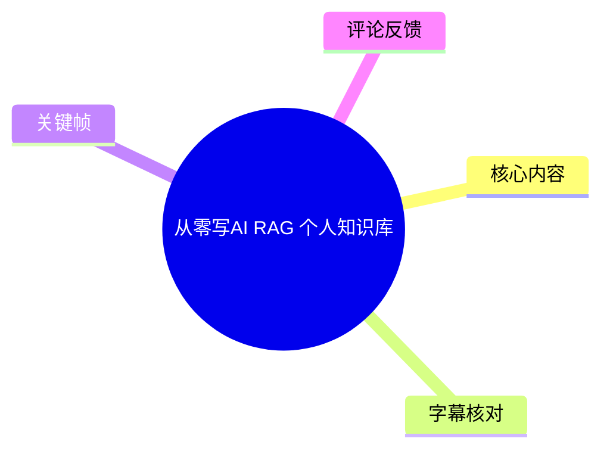
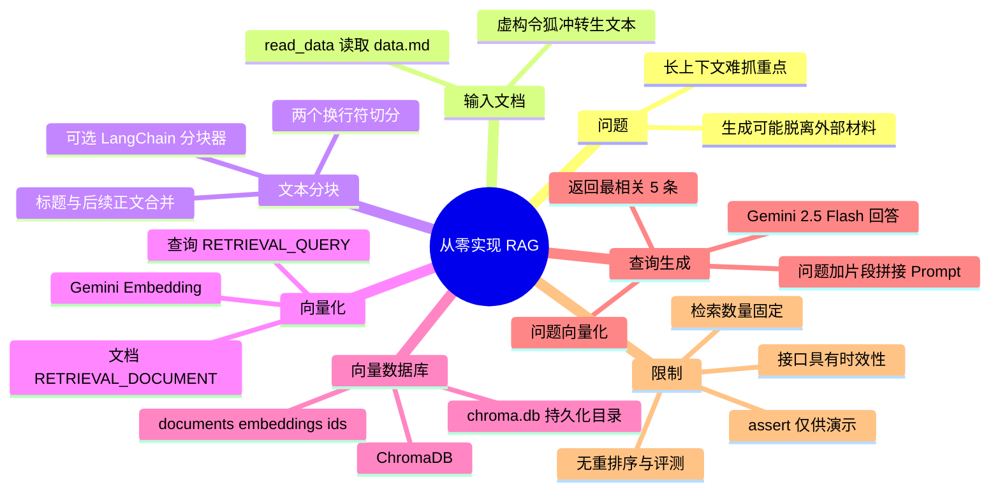
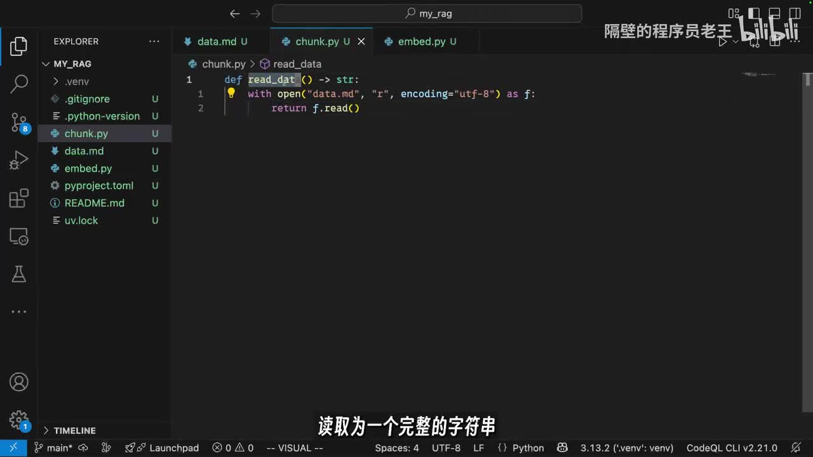
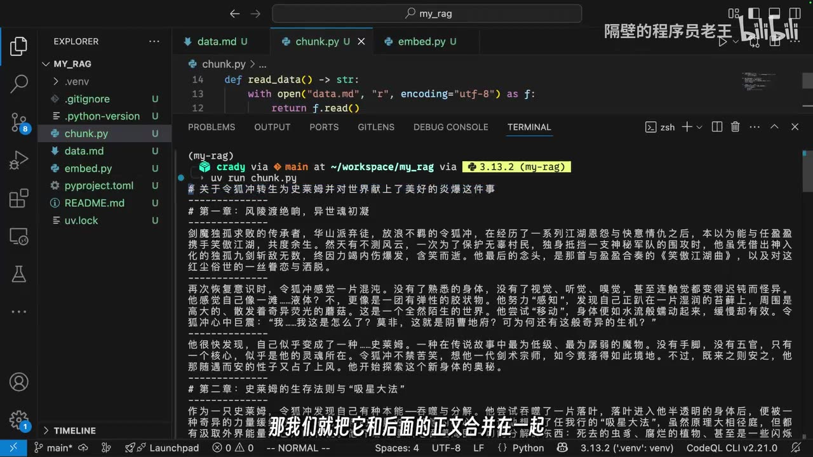
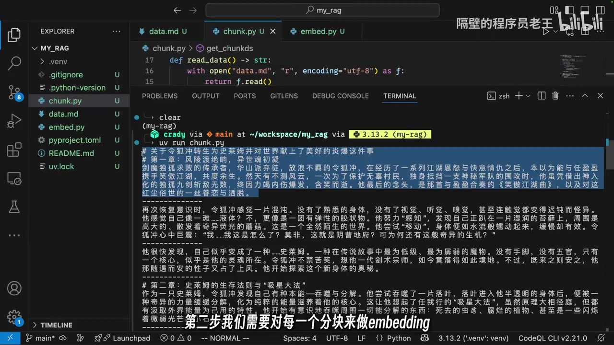

# 从零写 AI RAG 个人知识库

> 来源：[Bilibili 视频](https://www.bilibili.com/video/BV168j7zCE6D)  
> UP 主：隔壁的程序员老王｜发布时间：2025-05-29｜视频时长：15 分 07 秒  
> 标签：AI、人工智能、教程、机器学习、RAG、Python、知识库

## 小结

视频以一个可运行的 Python 小项目，演示了最基础的 RAG（Retrieval-Augmented Generation，检索增强生成）个人知识库链路：**读取文档 → 文本分块 → 生成向量 → 写入 ChromaDB → 以问题检索相关段落 → 将问题和检索结果拼接为 Prompt → 调用大语言模型回答**。

作者将 RAG 定义为应对“大模型在超长上下文中难以抓住重点、容易胡说八道”的架构。其示例刻意选取一篇模型“肯定没见过”的虚构文本，用来观察模型是否能依据外部文档而非已有知识作答。这个例子说明了 RAG 的核心价值：让生成阶段带上可检索的外部材料。

实现上，作者没有引入复杂框架：文档按两个换行符切分，并额外处理 Markdown 标题与正文分离的问题；向量数据库选择 **ChromaDB**；嵌入模型选择 Google/Gemini Embedding；生成模型选择 **Gemini 2.5 Flash**。这是便于理解的数据流示范，而不是生产级知识库方案。

视频特别强调 Gemini Embedding 的一个参数化差异：入库文本使用 `RETRIEVAL_DOCUMENT`，查询文本使用 `RETRIEVAL_QUERY`。作者用“老王爱吃瓜 / 老王喜欢吃瓜 / 老王喜欢吃什么”的例子解释：文档与问题的语义关联并不总会自然映射到相近向量位置，因此 Google 通过任务类型区分存储和查询语境。

需要注意：视频中的错误处理仅以 `assert` 演示，作者明确提示真实开发应采用更稳妥的错误处理；检索固定返回 5 条记录，Prompt 拼接方式也较为直接。它没有展示文档增量更新、元数据过滤、重排序、引用溯源、权限控制、评测集、Token 预算或防提示注入等生产问题。

本视频发布于 2025-05-29。Gemini 模型名、Python SDK、Google API 配置方式、ChromaDB API 及 LangChain 文档都可能在之后发生变动；文中出现的模型与接口参数应以当前官方文档为准。

## 思维导图





## 目录

- [背景、目标与整体架构](#背景目标与整体架构)
- [第一步：读取与分块](#第一步读取与分块)
- [第二步：生成 Embedding](#第二步生成-embedding)
- [第三步：写入 ChromaDB](#第三步写入-chromadb)
- [第四步：检索相关文本](#第四步检索相关文本)
- [第五步：拼接 Prompt 并调用模型](#第五步拼接-prompt-并调用模型)
- [完整流程、经验与限制](#完整流程经验与限制)
- [字幕比对](#字幕比对)
- [评论分析](#评论分析)
- [处理记录](#处理记录)

## 背景、目标与整体架构 [00:00:34](https://www.bilibili.com/video/BV168j7zCE6D?t=34)

作者在约 00:00:34 开始进入正题。视频所实现的 RAG 流程可归纳为：

1. 将原始文章拆成多个较短的文本块（chunk）。
2. 对每一个文本块生成 Embedding，即浮点数组形式的向量表示。
3. 将原文块及其向量一一对应写入向量数据库。
4. 用户提出问题时，先将问题转换为查询向量。
5. 以查询向量在数据库中检索语义最接近的文本块。
6. 将“用户问题 + 检索出的文档片段”组合成 Prompt。
7. 将 Prompt 发送给大语言模型，让模型依据上下文回答。

作者的表述重点是：RAG 不是直接把整篇文章塞进模型，而是先对资料建立可检索的向量索引，再仅取回与当前问题最相关的少量片段。

示例知识源是一篇题为《**关于令狐冲转生为史莱姆并对世界献上了美好的炎爆这件事**》的虚构文本。作者选择它的理由是：希望避免 AI 借助预训练知识“提前知道答案”，以便更直观地验证检索结果是否真正参与了回答。


> 图：画面直接写有“个人知识库架构 RAG”，并提示可先了解 RAG 核心概念。它适合作为本视频从概念进入编码实现的视觉锚点。

### 本视频使用的技术组件

| 环节 | 视频中的选择 | 用途 |
| --- | --- | --- |
| 开发语言 | Python | 编写分块、嵌入、建库和检索逻辑 |
| 输入文件 | `data.md` | 保存待检索的原始文本 |
| 分块脚本 | `chunk.py` | 读取文本、按段落分块 |
| 向量与数据库脚本 | `embed.py` | 调用 Embedding、写入与查询 ChromaDB |
| 向量数据库 | ChromaDB | 保存文档、向量与 ID 的对应关系 |
| Embedding 模型 | Gemini Embedding `gemini-embedding-exp-03-07`（视频口述/ASR 近似转写） | 将文本转换为浮点向量 |
| 生成模型 | Gemini 2.5 Flash | 根据 Prompt 生成最终答案 |
| 密钥配置 | `GOOGLE_API_KEY` 环境变量 | 调用 Google 模型接口 |

> 模型与 SDK 名称以视频内容为准。ASR 对英文技术名词存在误识别，详见“字幕比对”；实际使用时应查阅 Google 当前官方文档。

## 第一步：读取与分块 [00:01:22](https://www.bilibili.com/video/BV168j7zCE6D?t=82)

作者首先处理文本切分。由于示例文章的段落间有两个换行符，且段落长度较均匀，因此采用“双换行符”作为边界。这种切法依赖源文档本身结构规整，并不代表适用于所有资料。

### 1. 读取 `data.md` [00:01:22](https://www.bilibili.com/video/BV168j7zCE6D?t=82)

作者在 `chunk.py` 中预先提供 `read_data` 函数：以 UTF-8 打开 `data.md`，读取为一个完整字符串。

```python
def read_data() -> str:
    with open("data.md", "r", encoding="utf-8") as f:
        return f.read()
```



> 图：VS Code 中的 `chunk.py` 展示了 `read_data()`：使用 `open("data.md", "r", encoding="utf-8")` 并返回 `f.read()`。该画面明确了输入文件、编码与读取结果均为字符串。

### 2. 初版：按两个换行符切分 [00:01:47](https://www.bilibili.com/video/BV168j7zCE6D?t=107)

接着增加一个返回字符串列表的分块函数。视频的核心操作是以两个回车/换行作为分隔符：

```python
chunks = data.split("\n\n")
```

作者运行脚本观察输出后认为，正文分段效果基本可用。

### 3. 修复标题被单独切成块的问题 [00:02:36](https://www.bilibili.com/video/BV168j7zCE6D?t=156)

初版分块存在一个明确问题：Markdown 章节标题也会作为独立短段落被切出来。作者认为标题块太短，不适合单独拿去做检索，因此修改逻辑：

- 若当前段落以井号 `#` 开头，则将其与后面的正文合并；
- 让标题成为所属正文块的一部分，而不是孤立向量。



> 图：终端输出中可见 Markdown 标题与段落文本，视频在此说明要将标题和后续正文合并。该画面有助于理解“按空行切分”会造成标题孤立这一具体问题。

作者没有完整逐行讲解字符串处理代码，而是将其归为简单逻辑；重点在于分块结果要保留必要语义上下文。

### 4. 可选方案：LangChain 分块器 [00:03:31](https://www.bilibili.com/video/BV168j7zCE6D?t=211)

作者提到，除了手写分块，网上有现成方案；视频简介提供了 `RecursiveCharacterTextSplitter` 的 LangChain 文档链接。但本例刻意不引入更多复杂度，只演示基本分块。

### 分块经验与适用边界

- **适合本例的原因**：原文每段以双换行分隔，且长度比较均匀。
- **标题合并的必要性**：标题往往是对正文主题的压缩表达，独立入库会缺少上下文；和正文合并可改善检索块的语义完整性。
- **不应机械复用**：网页、PDF、表格、代码、扫描件、聊天记录等数据未必有可靠的双换行结构。
- **视频未展开的参数**：最大 chunk 长度、chunk overlap（重叠窗口）、按句子/语义切分、表格与代码块保护等，均未在本项目中设置或验证。

## 第二步：生成 Embedding [00:03:49](https://www.bilibili.com/video/BV168j7zCE6D?t=229)

完成分块后，作者在 `embed.py` 中处理向量化与存储。其技术选择是 **ChromaDB + Google/Gemini Embedding**。

### 1. API Key 配置 [00:04:26](https://www.bilibili.com/video/BV168j7zCE6D?t=266)

由于调用 Google 的 Embedding 模型，视频要求将 API Key 放在名为 `GOOGLE_API_KEY` 的环境变量中。作者表示自己已提前配置，并在演示中打印检查。

**安全提醒：**

- 环境变量通常比把密钥硬编码进源文件更合适；
- 不应将真实 Key 提交到 Git 仓库；
- 视频没有展示密钥缺失、权限不足、配额耗尽、网络失败等异常分支，实际项目应补充处理。

### 2. `embed` 函数的输入输出 [00:04:52](https://www.bilibili.com/video/BV168j7zCE6D?t=292)

作者定义 `embed` 函数：

- 输入：一段文本；
- 输出：该文本对应的 Embedding；
- 结果形式：浮点数数组。

其调用模型的关键概念如下：

| 参数/概念 | 视频说明 |
| --- | --- |
| `model` | 指定 Embedding 模型名称 |
| `content` | 需要向量化的文本 |
| 返回值 | 一串浮点数，即文本的向量表示 |
| 任务类型 | 必须区分“存储文本”与“查询文本” |

作者使用的模型名在 ASR 中被转写为 `Geminy Embedden EXP0307`，结合视频描述和简介中的 Gemini Embedding 文档，应理解为视频当时的 Gemini Embedding 实验模型名称；不能据此保证当前接口仍使用同一名称。

### 3. 文档向量与查询向量的任务类型 [00:05:12](https://www.bilibili.com/video/BV168j7zCE6D?t=312)

这是视频最关键的实现细节之一。作者指出，Google 的 Embedding 接口将嵌入任务分成两类：

| 场景 | `task_type` 值 | 视频中的封装语义 |
| --- | --- | --- |
| 对知识库片段建索引 | `RETRIEVAL_DOCUMENT` | `store=True` |
| 对用户问题进行检索 | `RETRIEVAL_QUERY` | `store=False` |

作者以三句话说明其动机：

- “老王爱吃瓜”
- “老王喜欢吃瓜”
- “老王喜欢吃什么”

前两句作为文档，彼此语义相近；第三句虽然与前两句相关，却是问句，表达形式不同。视频的说法是：若明确告诉模型当前向量用于“存储”还是“查询”，模型能够更好地将查询与相关文档拉近。至于内部具体实现，作者明确表示 Google 没有说明，因此只需按文档约定使用。

```python
def embed(text: str, store: bool):
    task_type = (
        "RETRIEVAL_DOCUMENT"
        if store
        else "RETRIEVAL_QUERY"
    )
    # 调用 Gemini Embedding API，并通过 config 传入 task_type
    # return embedding
```

> 上述代码是根据视频所讲参数关系整理的结构示意，不是视频中逐字展示的完整可运行源码。真实 SDK 的导入路径、客户端构造与响应对象解析，应以当前 Gemini 官方文档为准。

### 4. 演示中的 `assert` 限制 [00:07:36](https://www.bilibili.com/video/BV168j7zCE6D?t=456)

作者在演示中使用 `assert` 判断返回值，并主动说明：这是为方便展示，实际开发需要更稳妥的错误处理。

可迁移的工程化补充包括：

- 检查 API 响应是否包含有效向量；
- 处理超时、限流、认证失败、模型不可用；
- 记录失败文本和重试次数；
- 检查向量维度是否一致；
- 避免仅依赖 `assert`，因为 Python 在优化模式下可能禁用断言；
- 对批量嵌入设置速率限制与断点续跑。

### 5. 验证第一个 Chunk 的向量 [00:08:08](https://www.bilibili.com/video/BV168j7zCE6D?t=488)

作者打印第一个 chunk 的 Embedding，终端显示一长串数字。该输出本身不用于人工阅读，而是确认：

1. 分块函数确实返回了文本；
2. Embedding 接口被成功调用；
3. 返回了可写入数据库的数值向量。

## 第三步：写入 ChromaDB [00:08:21](https://www.bilibili.com/video/BV168j7zCE6D?t=501)

有了文本块和 `embed` 方法后，作者创建 ChromaDB 实例，并把原始文本和向量一对一写入数据库。

### 1. 数据库存储位置与集合 [00:08:55](https://www.bilibili.com/video/BV168j7zCE6D?t=535)

视频指定数据库目录为当前目录下的：

```text
chroma.db/
```

作者还创建了一个 collection（视频中称为数据表），名称可自行决定；例子中使用“令狐冲”的拼音命名。

这意味着本示例采用本地持久化目录：首次创建和写入后，后续查询可直接复用已有数据库，不必每次重新嵌入全部文档。

### 2. 对每个 Chunk 生成文档向量 [00:09:27](https://www.bilibili.com/video/BV168j7zCE6D?t=567)

建库时，调用：

```python
embedding = embed(chunk, store=True)
```

这里 `store=True` 对应 `RETRIEVAL_DOCUMENT`，因为被向量化的是未来待检索的知识库内容，而非用户问题。

### 3. 写入 ID、原文与向量 [00:09:50](https://www.bilibili.com/video/BV168j7zCE6D?t=590)

作者指出，ChromaDB 需要为每条记录提供字符串类型的 ID。示例中 ID 没有承载额外业务语义，直接使用片段序号。

写入数据的对应关系为：

| 字段 | 内容 |
| --- | --- |
| `id` | 字符串形式的 chunk 序号 |
| `documents` | 原始文本片段 |
| `embeddings` | 对应的文本向量 |

概念结构可以写成：

```python
collection.add(
    ids=[str(index)],
    documents=[chunk],
    embeddings=[embedding],
)
```

> 此处使用 `collection.add` 仅表达视频所说的“将 ID、原文、Embedding 写入 ChromaDB”的数据关系。ASR 将方法名误识别为“absurd”，不能据此当作真实 API 名称。

### 4. 执行建库并确认结果 [00:10:29](https://www.bilibili.com/video/BV168j7zCE6D?t=629)

作者运行 `create_db` 后，程序会依次对每个文本片段进行 Embedding，并写进向量库；完成后，可在当前目录看到新增的 `chroma.db` 文件夹。



> 图：画面显示 `get_chunks` 函数及终端中的分块文本，字幕正在说明“第二步对每一个分块来做 embedding”。它连接了分块结果与后续入库向量化两个阶段。

## 第四步：检索相关文本 [00:11:01](https://www.bilibili.com/video/BV168j7zCE6D?t=661)

建库后，作者实现查询函数。该函数的输入是用户问题 `question`。

### 查询步骤

1. 对 `question` 进行 Embedding；
2. 因其用途是检索，调用时设定 `store=False`；
3. 用问题向量在 ChromaDB 中检索相似文档；
4. 通过 `n_results` 指定返回最相关的 5 条记录；
5. 直接返回检索到的文本片段。

```python
def query(question: str):
    question_embedding = embed(question, store=False)
    results = collection.query(
        query_embeddings=[question_embedding],
        n_results=5,
    )
    return results["documents"]
```

> 这是依据视频流程整理的伪代码。视频 ASR 在函数命名上存在混淆：建库函数和查询函数都被错误转写为 `create db`；按实际逻辑，应视为两个不同职责的函数。

### 查询参数：`n_results=5` [00:11:33](https://www.bilibili.com/video/BV168j7zCE6D?t=693)

视频将返回条数固定为 5 条。这个数值是示例参数，而不是通用最优值：

- 返回太少，可能漏掉支撑答案的重要信息；
- 返回太多，Prompt 变长、成本上升，并可能引入无关上下文；
- 不同文档粒度、问题类型、模型上下文窗口都可能需要不同设置。

### 测试问题与检索结果 [00:11:47](https://www.bilibili.com/video/BV168j7zCE6D?t=707)

作者以“令狐冲领悟到了什么样子的魔法”为问题测试检索。视频说明：数据库已经在前面初始化完成，因此查询时不需要再次执行建库流程。

运行后，检索出了与问题最相关的片段，包括与“破爆式”“炎爆雏形”等内容相关的文本。作者认为整体效果不错，已能看出 RAG 的基本工作方式。

## 第五步：拼接 Prompt 并调用模型 [00:12:48](https://www.bilibili.com/video/BV168j7zCE6D?t=768)

检索并不是最终回答。RAG 的最后一步，是把用户问题和检索出的文本一起交给大模型。

### 1. 构造 Prompt

作者将以下两部分拼接为一个 Prompt：

- 用户原始问题：“令狐冲领悟到了什么魔法？”
- 向量数据库检索出的相关文本块。

视频先打印 Prompt，确认其形态，然后把这段完整 Prompt 发送给大语言模型。

可抽象为：

```text
请根据以下参考资料回答问题。

参考资料：
{retrieved_documents}

问题：
{question}
```

视频没有展示更严格的系统提示词，例如“只根据资料回答”“资料不足时明确说不知道”“给出引用片段编号”等。

### 2. 生成模型 [00:13:43](https://www.bilibili.com/video/BV168j7zCE6D?t=823)

作者在这里使用 **Gemini 2.5 Flash**。由于 Gemini 的返回数据结构较复杂，演示直接打印整个返回对象/返回值，而不是只抽取最终文本字段。

### 3. 最终效果：模型纠正了问题前提 [00:14:07](https://www.bilibili.com/video/BV168j7zCE6D?t=847)

最终，模型回答：令狐冲领悟的**不是魔法**，而是一种名为“破爆式”的能量爆发。作者特别肯定这个结果，因为模型依据检索到的文本纠正了提问中的错误前提。

这体现了该示例中 RAG 的预期行为：检索上下文不只是补全答案，还应对用户问题中的不准确假设产生约束作用。

## 完整流程、经验与限制 [00:14:31](https://www.bilibili.com/video/BV168j7zCE6D?t=871)

### 可复现的最小工作流

```text
准备 data.md
    ↓
read_data() 读取完整文本
    ↓
get_chunks() 按 \n\n 切分，标题与正文合并
    ↓
embed(chunk, store=True)
    ↓
ChromaDB 保存 ids + documents + embeddings
    ↓
embed(question, store=False)
    ↓
ChromaDB 相似度检索 n_results=5
    ↓
检索文本 + question 拼接 Prompt
    ↓
Gemini 2.5 Flash 生成回答
```

### 作者给出的学习建议

视频结尾，作者建议观众不要只看代码，而是照着例子亲手写一遍。其理由是：代码只有实际写出来，才能逐渐转化为自己的能力；实现过程中会发现新的细节、问题和思路。

### 本视频方案已展示与未展示的能力

| 范围 | 已展示 | 未展示或未验证 |
| --- | --- | --- |
| 数据接入 | 单个本地 Markdown 文本 | PDF、网页、Office、图片、扫描件、数据库等 |
| 文本切分 | 双换行切分、标题正文合并 | chunk 长度、重叠、语义切分、结构化内容保留 |
| 嵌入 | Gemini Embedding、文档/查询任务类型 | 批量吞吐、缓存、降级、不同模型对比 |
| 数据库 | 本地 ChromaDB 持久化 | 多用户隔离、权限、备份、迁移、版本管理 |
| 检索 | 向量相似度检索、返回 5 条 | BM25 混合检索、元数据过滤、重排序、阈值控制 |
| 生成 | 检索文本与问题拼接后交给 Gemini | 引用标记、拒答策略、上下文压缩、防 Prompt 注入 |
| 可靠性 | 简单 `assert` 演示 | 重试、监控、日志、评测、成本控制、异常恢复 |

### 时效性与技术风险

1. **模型/API 变化**：视频中的 Gemini Embedding 模型名为当时演示所用名称；实验模型、SDK 导入方式、任务类型枚举及返回结构可能已调整。
2. **知识更新不是自动完成**：RAG 只能检索已经导入且完成索引的资料。源文档更新后，需要重新或增量分块、嵌入和写入。
3. **RAG 不能保证绝对正确**：检索不到、检索错、分块丢失上下文、Prompt 中出现干扰信息，都会影响最终回答。即使检索正确，模型仍可能误读或编造。
4. **Token 与成本问题仍存在**：RAG 减少的是“把整库内容直接放进上下文”的需求，但最终发送给生成模型的检索片段依然占用输入 Token；检索条数、文本块长度和 Prompt 设计都会影响成本与上下文长度。
5. **隐私与权限问题**：个人/企业知识库可能包含敏感资料。向第三方 Embedding 或生成 API 发送文本前，需确认数据合规、保留策略和访问权限。
6. **教学取舍**：作者明确选择不引入额外复杂度，因此该项目非常适合理解基本管线，但不应直接视作生产级个人知识库成品。

## 字幕比对

| 字幕来源 | 完整性 | 专有名词 | 时间轴 | 主要问题 |
| --- | --- | --- | --- | --- |
| Bilibili 站内字幕 `p01-ai-zh.srt` | 与本视频内容完全不匹配 | 内容为京都旅行、怀石料理等，与 RAG 无关 | 有完整时间段，但仅覆盖约 13 分 11 秒且对应另一视频 | 明显串片/错配，不能作为本视频事实依据 |
| 本次 ASR 字幕 | 覆盖 00:00:34 至 00:14:59，语音覆盖率 72.03% | 中文主体可用；`RAG`、`ChromaDB`、Gemini、函数名等有较多误识别 | 有真实分段时间轴；存在演示操作造成的长空白段 | 英文技术词与函数名误识别，如 `Rug`、`KoramaDB`、`absurd`、`create db` 等 |

### 最终字幕选择

本次整理**采用 ASR 时间轴字幕作为时间定位和主要内容依据**，并结合关键帧中的 VS Code 画面、视频标题、简介链接及上下文，对明显的术语误识别进行谨慎校正。

站内字幕虽存在，但其内容从开头的“飞 1500km 去京都吃怀石料理”开始就与本视频标题、画面和 ASR 完全冲突，应判定为错误字幕，未用于正文事实提取。

### 重要校正项

| ASR/字幕表现 | 正文采用的表述 | 校正依据 |
| --- | --- | --- |
| `Rug` / `rog` | RAG | 视频标题、封面画面、上下文架构描述 |
| `KoramaDB` | ChromaDB | 作者明确说向量数据库；视频简介与常见工具名匹配 |
| `Lanchen` | LangChain | 视频简介提供 `RecursiveCharacterTextSplitter` 的 LangChain 文档 |
| `Jimny` / `Geminy` / `Gemina` | Gemini | 视频简介提供 Gemini Embedding 官方文档 |
| `absurd` 方法 | 仅表述为“写入 ChromaDB”，示意中使用 `collection.add` | ASR 显著误识别；不将错误词作为 API 名称 |
| 建库、查询均被转成 `create db` | 分别按“建库函数”“查询函数”描述 | 两段的输入、行为和上下文不同 |
| `盐爆`、`破爆时` | 保留为虚构文本中的“炎爆/破爆式”等近似称谓，并避免扩展设定 | 示例文档属虚构文本，ASR 对具体名称不稳定 |

ASR 诊断中**未标记 `noAudioStream=true`**；相反，已检测到约 653.09 秒语音，语言识别为中文（置信度约 0.999）。因此不存在“源视频无音轨”的情况。

## 评论分析

以下仅分析可获取的热评前三条；评论代表评论者观点，不等同于已验证事实。

### 1. `sarasarsar`：对代码逻辑的概括性确认

> 点赞 104  
> “代码逻辑大概就是这么个意思吧？”

这条评论没有补充具体技术细节，更像是对视频“用少量代码串起 RAG 主流程”的直观反馈。它间接说明视频的教学定位偏向概念入门和最小实现，而非完整工程框架。

### 2. `Vinceshu`：补充 RAG 的三类实际动机

> 点赞 64  
> 观点：RAG 不仅为减少幻觉，还涉及知识时效性、领域适配性和准确性。

该评论指出，视频开头把 RAG 主要解释为缓解模型“抓不住重点而胡说八道”，但 RAG 在实际应用中常还用于：

1. **知识时效性**：为模型补充预训练截止日期之后的信息；
2. **领域适配性**：接入行业知识、企业私有文档；
3. **准确性**：以真实资料约束生成，降低幻觉概率。

这是对视频教学表述的有价值扩展，尤其是“RAG 只能减少、不能彻底消除幻觉”的提醒，与工程实践相符。不过评论中关于具体模型训练截止时间及示例回答的内容没有在本素材中核验，不能将其作为已证实事实。

### 3. `何惧西天万里遥`：质疑 RAG 是否真的节省上下文与费用

> 点赞 23  
> 观点：RAG 最终仍会把检索内容和用户问题发送给大模型，因此不一定减少最终调用的 Token 或上下文长度。

这条评论准确指出一个容易被忽略的边界：RAG 的典型作用是避免将**全部资料**直接加入 Prompt，而不是让模型调用完全不消耗上下文。最终检索到的片段仍要进入生成模型输入，因此：

- 与“全量文档直接塞入上下文”相比，RAG 通常能显著缩短输入；
- 与“只发送用户短问题”相比，RAG 必然增加输入 Token；
- 实际成本取决于 chunk 大小、召回数量、重排序结果、Prompt 模板以及模型计费规则；
- 还应计入 Embedding 调用与向量数据库的成本。

这一问题正是视频未展开的工程限制。评论没有给出结论性计算，适合作为后续实践中应测试和监控的指标，而不是把“RAG 一定省钱”或“RAG 一定不省钱”当作绝对结论。

## 处理记录

- Worker ID：`worker-mrj0wjed-b0c290ad`
- 模型：`gpt-5.6-terra`
- 调用工具与素材：视频元数据、ASR 结果与 SRT、站内字幕 SRT、关键帧、热评 JSON。
- 本次 ASR 检查：已检查。ASR 模型标记为 `medium`，设备为 CUDA、计算类型为 float16；识别语言为中文，置信度约 `0.9990234375`；检测到音频与时间戳，未出现 `noAudioStream=true`。
- 字幕选择：站内字幕与 RAG 视频内容完全错配，未采用；以本次 ASR 的真实时间分段为时间轴依据，并依靠标题、简介、关键帧和上下文校正技术专名。
- 关键帧选择依据：
  - `frames/frame-001.jpg`：展示“个人知识库架构 RAG”，用于概述阶段；
  - `frames/frame-002.jpg`：展示 `read_data()` 与 `data.md` 读取逻辑，用于文档加载步骤；
  - `frames/frame-003.jpg`：展示 Markdown 标题、正文和终端输出，用于解释标题合并问题；
  - `frames/frame-004.jpg`：展示 `get_chunks` 与分块输出，用于衔接分块和 Embedding 入库。
- 缓存清理：素材清单未提供缓存清理执行日志；未将“已清理”作为事实记录。
- 未解决问题：
  - 未提供完整源码文件，正文只能按 ASR、关键帧和视频简介整理逻辑，未将伪代码冒充为原始逐字代码；
  - Gemini SDK 的精确导入方式、模型当前可用性及 ChromaDB 的具体版本均未在素材中验证；
  - 站内字幕显著错配，无法用于补全 ASR 中空白的操作画面细节。
