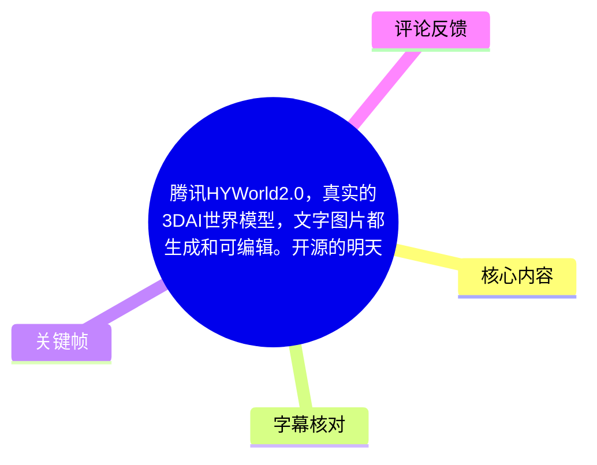
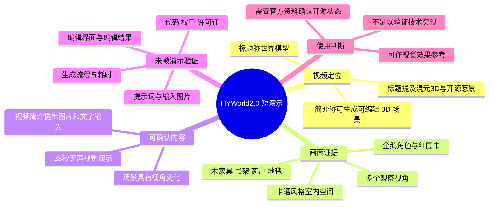
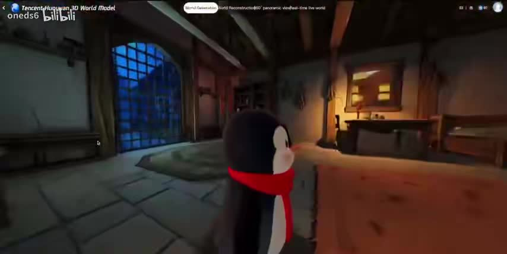
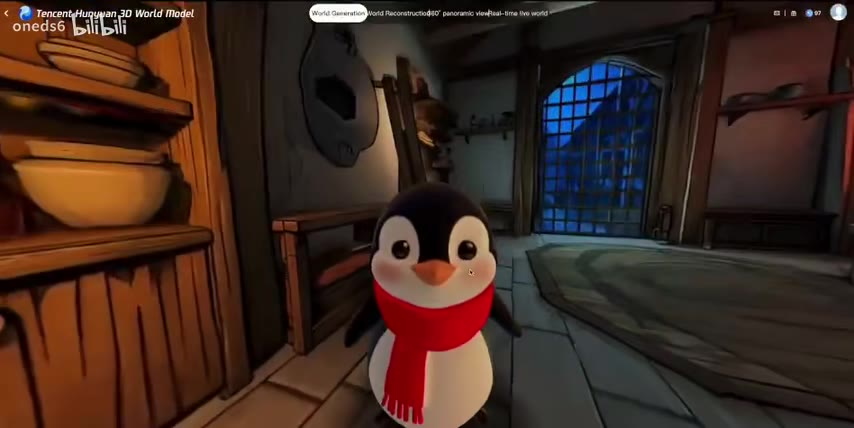
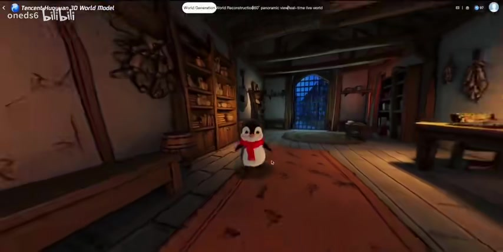
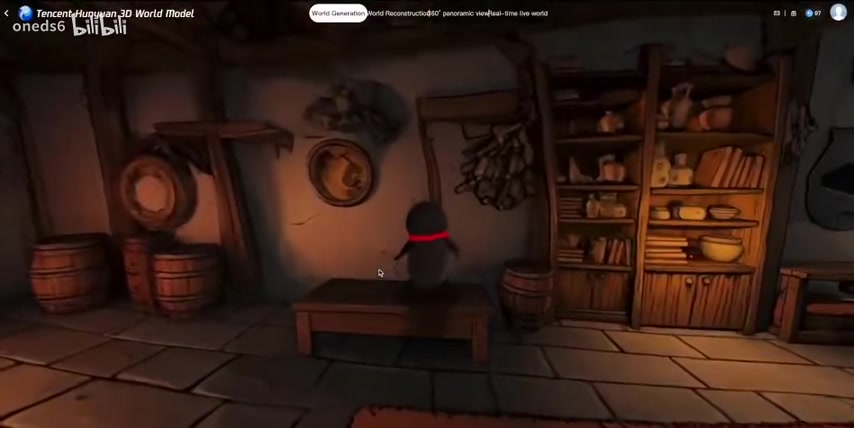

# 腾讯HYWorld2.0，真实的3DAI世界模型，文字图片都生成和可编辑。开源的明天，来自混元3D。

> 来源：[Bilibili 视频](https://www.bilibili.com/video/BV1VMQJBgEBe) 
> UP 主：oneds6 ｜时长：28 秒｜标签：世界模型 
> 视频简介称：腾讯 HYWorld2.0 是一款世界模型；“一张图片一段文字”可形成“一个完整的 3D 世界”，并主张其中内容可生成、可编辑。

## 小结

这是一段 28 秒的无声画面演示。视频标题与简介将演示对象描述为“腾讯 HYWorld2.0”及“真实的 3D AI 世界模型”，强调它并非普通预渲染视频，而是能够由图片、文字生成，且可继续编辑的三维场景。标题同时提到“混元 3D”与“开源的明天”，但视频素材中未提供项目地址、代码仓库、模型权重、许可证或发布日期等可核验信息。

从画面可直接观察到：镜头在一间具有木质家具、书架、窗户、地毯与暖色照明的卡通风格室内空间中移动；一只系红围巾的企鹅角色持续处于场景内。不同画面展示了近距离、远距离和侧后方等视角，能够支持“同一场景存在多视角浏览效果”的判断。

不过，“真实 3D”“全部生成”“全部可编辑”“一张图片一段文字生成完整世界”等均是标题或简介中的宣传性陈述，并没有在这段素材中展示输入图片、文本提示词、生成耗时、网格/材质资产、编辑面板、保存导出或前后对比。因此，视频足以作为视觉效果展示，不能单独证明其生成链路、编辑粒度、几何真实性、物理一致性或开源状态。

对关注世界模型、3D 内容生成、游戏/虚拟场景制作的人而言，本视频可作为一个短小的视觉案例：重点不在操作教程，而在展示一个可从多视角观察的室内三维风格场景。若要评估实际可用性，还需要补充官方论文、模型卡、代码仓库、许可协议、硬件需求与可复现样例。

时效上，元数据记录的视频发布时间为 2026-04-15。AI 模型的版本、开源计划和可用入口可能快速变化；截至所给素材，无法确认 HYWorld2.0 是否已经公开发布、是否与混元 3D 存在具体技术依赖关系，以及是否真正开源。

## 思维导图

## 目录

- [视频定位与证据边界](#视频定位与证据边界)
- [场景多视角演示](#场景多视角演示)
- [技术主张、参数与缺失证据](#技术主张参数与缺失证据)
- [可迁移的观察与验证步骤](#可迁移的观察与验证步骤)
- [结论、限制与时效性](#结论限制与时效性)
- [字幕比对](#字幕比对)
- [评论分析](#评论分析)
- [处理记录](#处理记录)

## 视频定位与证据边界 [00:00](https://www.bilibili.com/video/BV1VMQJBgEBe?t=0)

视频标题写有“腾讯 HYWorld2.0”“真实的 3D AI 世界模型”“文字图片都生成和可编辑”，简介进一步给出以下主张：

1. 演示对象被称为一款“世界模型”。
2. 该内容被描述为“不是视频”，而是“真实的 3D 场景”。
3. 输入表述为“一张图片一段文字”。
4. 输出表述为“一个完整的 3D 世界”。
5. 场景被描述为“全部生成和可编辑”。

这些信息应区分为**视频发布者的文字主张**，而非由短片直接完成验证的技术事实。所给素材没有展示输入端、生成过程、编辑器操作、资产结构、模型推理日志或官方文档。

视频总时长为 **28 秒**。由于没有可用的逐句字幕，也没有关键帧时间戳数据，不能依据文字顺序为具体镜头虚构精确秒点；本章及下文的 `00:00` 链接仅用于定位至该短片起点。

## 场景多视角演示 [00:00](https://www.bilibili.com/video/BV1VMQJBgEBe?t=0)

画面主体是一间卡通/动画渲染风格的室内。可以辨认出石质或块状地面、木地板区域、地毯、木质书架、桌椅或柜体、圆桶、墙面装饰、格栅窗户，以及局部暖色光照。窗外呈现蓝色调，与室内暖光形成明显的冷暖对比。

场景中的企鹅角色是视觉锚点：黑白身体、橙色喙、红色围巾。镜头在不同构图中靠近角色、后撤至较广视野，并改变观察方向。就视觉结果而言，这表明发布者希望通过连续移动视角来传达空间感，而不是只展示单张静态图。

> 图：该帧同时呈现企鹅角色、门窗、地面和室内家具。它的价值在于建立场景的主要视觉元素，并显示镜头位于室内可观察空间中。

> 图：企鹅正对镜头，背景可见书架、窗户与地毯。该帧有助于观察角色与环境的相对位置及风格一致性，但不能据此证明角色或场景资产的生成来源。

> 图：镜头拉远后，画面纳入更大范围的地板、书架、窗户、桌面和企鹅角色。它是判断“同一室内空间被不同视角浏览”的较强画面依据。

> 图：该帧将视角转向墙面、书架、桶和长凳区域，企鹅背对镜头。其价值在于补充展示场景侧部区域，说明镜头观察范围并不局限于单一正面构图。

### 画面所能支持与不能支持的判断

| 判断 | 素材支持程度 | 依据或原因 |
| --- | --- | --- |
| 画面展示了带角色的卡通室内场景 | 可直接确认 | 多张关键帧均可见室内环境与企鹅角色。 |
| 演示包含不同观察角度或镜头位置 | 可直接确认 | 关键帧中的角色大小、朝向、家具位置与构图发生变化。 |
| 该场景必然是实时可自由漫游的 3D 世界 | 无法仅凭素材确认 | 视角变化也可能来自预先录制的镜头运动；没有交互界面、操作输入或性能指标。 |
| 场景由一张图片和一段文字生成 | 无法仅凭素材确认 | 这是简介主张，未展示输入、推理和输出过程。 |
| 每个对象均可编辑 | 无法仅凭素材确认 | 未展示选中对象、修改属性、重生成、撤销或导出。 |
| 项目已开源 | 无法确认 | 标题仅提及“开源的明天”，未提供仓库、许可证或权重地址。 |

## 技术主张、参数与缺失证据 [00:00](https://www.bilibili.com/video/BV1VMQJBgEBe?t=0)

### 已提供的技术相关信息

视频中可用的明确技术信息非常有限，主要来自标题、简介与画面：

| 项目 | 内容 | 证据类型 |
| --- | --- | --- |
| 名称 | HYWorld2.0 | 标题与简介文字 |
| 提及机构 | 腾讯 | 标题文字 |
| 方向 | 世界模型、3D AI 场景 | 标题、简介和标签“世界模型” |
| 输入主张 | 一张图片、一段文字 | 简介文字 |
| 输出主张 | 完整 3D 世界 | 简介文字 |
| 能力主张 | 生成、编辑 | 标题与简介文字 |
| 关联表述 | “来自混元3D” | 标题文字 |
| 视频时长 | 28 秒 | 视频元数据 |
| 画面分辨率 | 948 × 476 | 视频元数据 |

### 未提供的关键参数

本视频没有公开以下决定技术能力和复现价值的重要信息：

- 使用的底层模型、版本号、训练数据范围或论文链接；
- 输入图像分辨率、文本提示词内容、是否支持多图输入；
- 生成的几何表示：网格、点云、NeRF、3D Gaussian Splatting、体素或其他形式；
- 纹理质量、材质系统、光照表示、碰撞体、物理规则或动画系统；
- 场景规模上限、对象数量、可行走范围、帧率、显存占用、推理时长；
- “编辑”具体指对象增删、材质替换、文本驱动局部修改、布局调整，还是其他能力；
- 导出格式、商用条件、部署方式与 API；
- 开源代码、权重、数据集和许可证。

因此，不能将这条短片中的视觉效果直接等同于完整产品规格，也不能推断其在复杂场景、室外场景、多角色交互或长时稳定性上的表现。

## 可迁移的观察与验证步骤 [00:00](https://www.bilibili.com/video/BV1VMQJBgEBe?t=0)

视频本身没有演示可供照做的软件操作步骤、命令、提示词或配置参数。若读者希望把这类短演示转化为可验证的技术评估，可遵循以下**验证流程**；这些是基于素材缺口提出的核验建议，不是视频中已经展示的操作。

1. **确认项目身份与版本**
   - 查找发布方的官网、论文、模型卡或官方账号。
   - 核对“HYWorld2.0”的正式英文/中文命名、版本号及与“混元3D”的确切关系。
   - 避免仅依据二次传播标题认定模型归属。

2. **核验开源状态**
   - 检查是否存在官方代码仓库、可下载权重和明确许可证。
   - 区分“计划开源”“开放体验”“开放 API”与“代码及权重开源”。
   - 若没有许可证，即使存在仓库，也不应默认可商用或可再分发。

3. **复现输入—输出链路**
   - 固定一张输入图片与一条文本提示词，记录输入分辨率、随机种子、生成耗时和硬件环境。
   - 保存输出资产，确认是否真的获得可使用的三维数据，而不仅是可播放的渲染结果。
   - 在独立软件或引擎中加载输出，测试视角移动、遮挡关系及近景细节。

4. **验证“可编辑”边界**
   - 分别测试对象移动、删除、替换、材质修改、局部文本编辑和重新生成。
   - 检查编辑后是否会破坏几何、纹理、光照或对象之间的一致性。
   - 对编辑前后画面与资产文件进行留档，避免只凭宣传片判断编辑能力。

5. **测试空间一致性与可用性**
   - 以多视角截图或录屏检查书架、窗户、墙面、地面接缝等位置是否稳定。
   - 观察角色、家具和边界区域是否存在漂浮、穿插、纹理拉伸或视角切换异常。
   - 对长镜头、极近距离观察、室外扩展和复杂布局另行测试；本视频不含这些压力场景。

## 结论、限制与时效性 [00:00](https://www.bilibili.com/video/BV1VMQJBgEBe?t=0)

这段视频的核心价值是用连续视角变化展示一个具有统一美术风格的室内角色场景。企鹅、书架、窗户、地毯、家具和光照共同构成了一个较完整的视觉空间，适合用来理解发布者所宣传的“3D 世界”效果方向。

但该视频没有音轨，且未提供站内字幕；同时缺少技术讲解、输入输出展示、编辑过程与开源材料。因此，最稳妥的结论是：**视频展示了一个看起来可从多个视角观察的三维风格场景，并提出文字/图片生成与可编辑的能力主张；这些能力主张仍需依赖官方资料和可复现实验验证。**

需要特别注意以下限制：

- 不能从镜头移动直接推出实时渲染、真实交互或底层三维表示；
- 不能从简介文案推导出可编辑对象的范围与编辑质量；
- 不能从“开源的明天”推导出已开源；
- 不能确认“腾讯”“HYWorld2.0”“混元3D”之间的具体产品、团队或技术关系；
- 本片为 28 秒短演示，未覆盖失败案例、复杂场景、性能成本和使用门槛。

发布时间元数据为 2026-04-15。模型开放策略、在线体验入口和项目状态都具有明显时效性；在实际采用前，应以发布方最新的官方公告、仓库提交记录和许可证文本为准。

## 字幕比对

| 字幕来源 | 完整性 | 专有名词 | 时间轴 | 主要问题 |
| --- | --- | --- | --- | --- |
| Bilibili 站内字幕 | 无可用字幕 | 无法核验 | 无 | 素材明确说明未提供可用站内字幕。 |
| 本次 ASR 字幕 | 无语音文本 | 无法识别 | 无有效语音分段 | `asr-result.json` 标记 `noAudioStream=true`；源视频没有音频流，ASR 被正常跳过。 |

本次任务已检查 ASR 结果。诊断显示：

- `noAudioStream=true`
- ASR 状态为跳过，原因是 `NO_AUDIO_STREAM`
- 语音片段数为 0，语音覆盖时长为 0 秒
- 未检测到语言与语音起止时间

这不是识别工具故障，而是源视频本身不包含音频流。又因站内字幕不可用，正文采用的证据顺序为：

1. 视频元数据中的标题、简介、时长、标签与分辨率；
2. 所提供关键帧中的视觉内容；
3. 无声视频的整体时长。

术语“HYWorld2.0”“世界模型”“混元3D”均来自标题或简介文字；企鹅角色、室内空间、多视角构图来自关键帧画面。由于没有任何可用的时间轴字幕，正文不对各关键帧虚构精确出现时刻。

## 评论分析

仅处理可获取的热评前三条。评论反映的是观众即时反馈，不构成对模型能力、开源状态或技术归属的验证。

| 热评 | 点赞 | 观点概括 | 可提供的补充信息与可信度 |
| --- | ---: | --- | --- |
| 苏苜悠：“牛逼啦” | 3 | 对演示效果表示肯定。 | 属于情绪化赞赏，没有提供技术细节、使用体验或外部证据。 |
| bili_20266221454：“咕咕嘎嘎” | 1 | 无明确技术观点，可能是玩笑式回应。 | 不提供可用于判断模型能力或发布状态的信息。 |
| 后厄：“这个是不是开源的呢” | 0 | 询问项目是否开源。 | 该问题与标题中的“开源的明天”相呼应，但评论本身没有答案；结合素材，开源状态仍无法确认。 |

评论区中最具信息价值的是对开源状态的疑问：它提示观众也未从视频中获得明确授权或仓库信息。对此应以官方代码仓库、模型权重和许可证为唯一可靠核验来源。

## 处理记录

- Worker ID：`worker-mrj0www4-e8d79408`
- 模型：`gpt-5.6-terra`
- 使用素材：视频元数据、音频状态、ASR 诊断、热评前三条、关键帧列表及所提供画面。
- 字幕检查：已检查站内字幕与本次 ASR。站内字幕未提供可用内容；本次 ASR 的 `noAudioStream=true`，确认源视频没有音轨，因此未将其视为工具失败。
- 字幕选择：无可用文本字幕可合并。正文以标题、简介、元数据、关键帧和无声画面理解为依据；不生成不存在的台词或分段字幕。
- 时间轴策略：视频总长 28 秒，但没有站内 SRT、ASR 分段或关键帧时间戳。为避免按文字顺序臆测镜头位置，涉及视频内容的章节统一链接至 `t=0`，并在正文明确不对画面虚构精确秒点。
- 关键帧选择依据：选用 `frames/frame-001.jpg` 至 `frames/frame-004.jpg`。这些帧分别覆盖角色与环境近景、正面构图、拉远全景及侧部区域，能够支撑“室内场景、多视角观察、角色—环境关系”的画面描述。
- 缓存清理：素材清单未提供缓存清理执行日志或结果；不宣称已执行未记录的清理操作。
- 未解决问题：HYWorld2.0 的正式技术资料、输入输出流程、生成速度、编辑方式、资产格式、模型归属细节、代码/权重地址、许可证及实际开源状态，均无法由现有素材确认。
