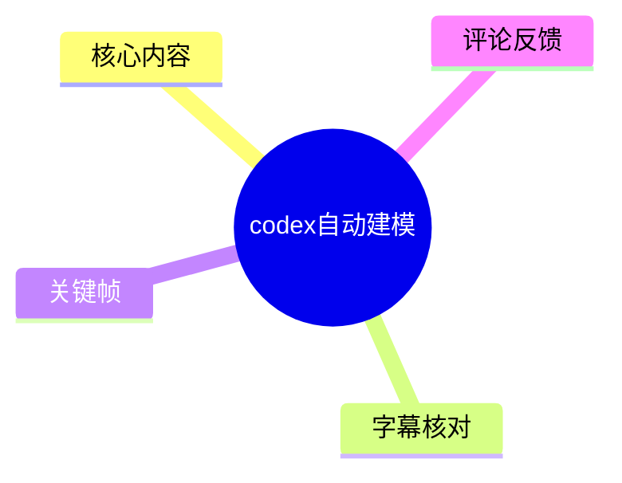
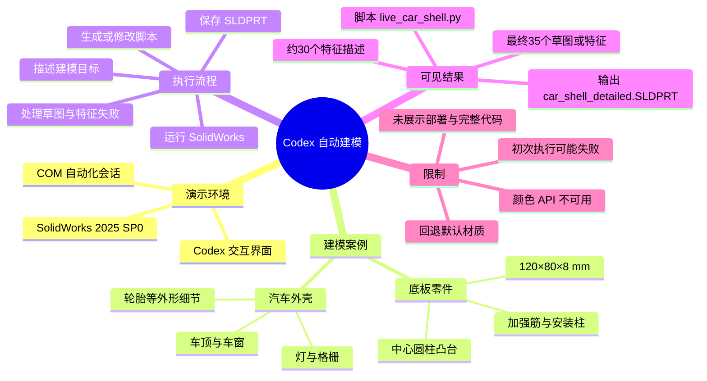
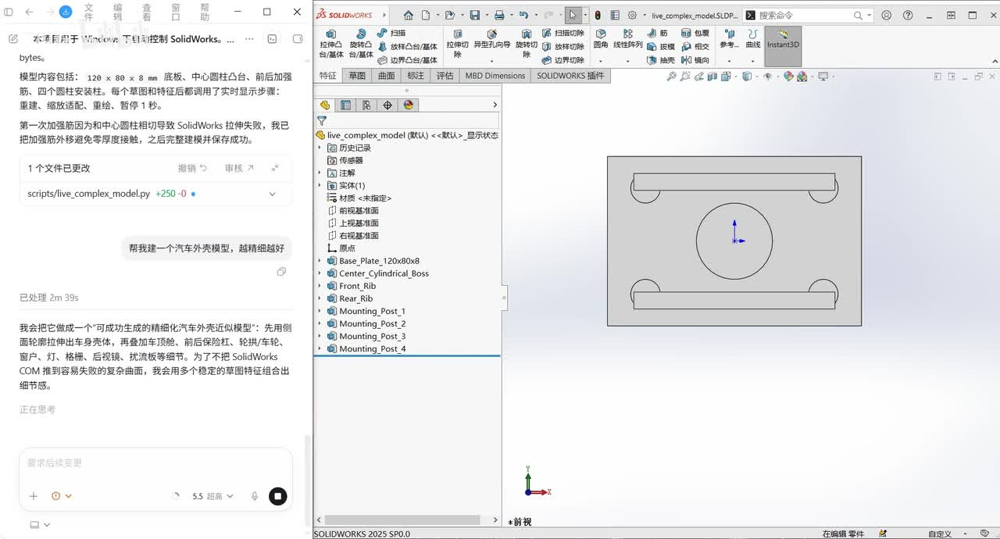
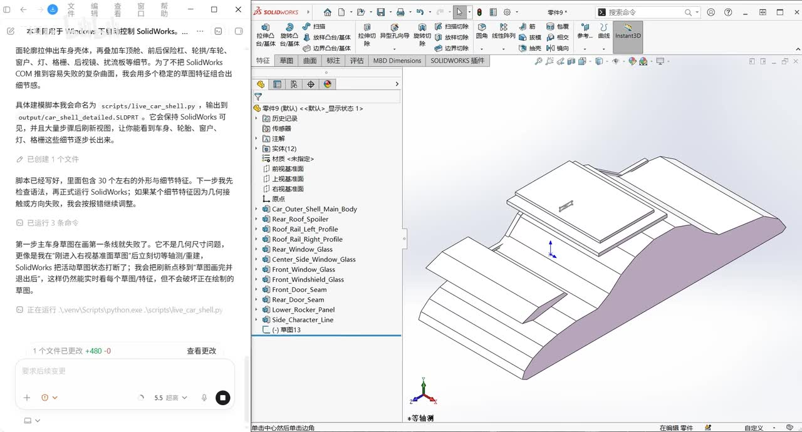
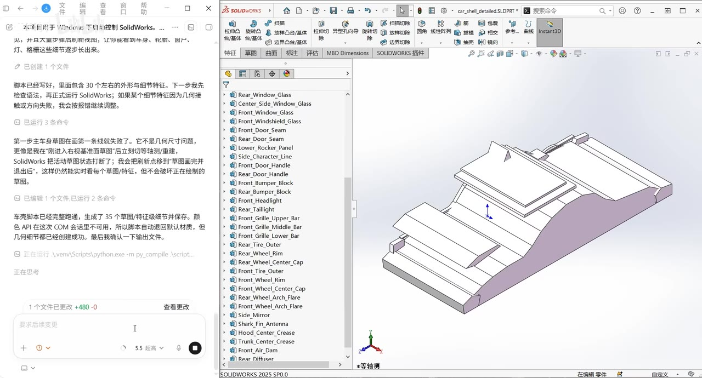

# codex自动建模

> 来源：[Bilibili 视频](https://www.bilibili.com/video/BV1kXdFBGE86)  
> UP 主：quu森｜分区/标签：软件、学习、SolidWorks、codex｜时长：1 分 23 秒  
> 数据抓取时的互动数据：48,134 播放、212 点赞、453 收藏、481 分享、136 评论（抓取时间：2026-07-13；数据会继续变化）。

## 小结

视频以 SolidWorks 2025 SP0 的桌面操作画面，展示了让 Codex 参与自动生成 SolidWorks 建模脚本并执行的结果。关键帧表明，流程并非“一次提示即可无误完成”：初次生成或执行会遇到 SolidWorks 拉伸失败、草图线失败等问题，随后通过修改脚本、重新运行和逐步显示特征来完成模型。

视频中可确认的两个建模案例分别是：一个尺寸明确的底板零件，以及一个细节较多的汽车外壳。底板案例要求建立 `120 × 80 × 8 mm` 底板、中心圆柱凸台、前后加强筋和 4 个圆柱安装柱；汽车案例则生成了包含车顶、车窗、灯、格栅、轮胎等部件的外壳模型。

汽车外壳脚本在画面中被说明为 `scripts/live_car_shell.py`，输出为 `output/car_shell_detailed.SLDPRT`。脚本约包含 30 个外形与细节特征；最终界面文字称生成了 35 个草图/特征。视频还暴露了一个兼容性限制：本次 COM 会话中颜色 API 不可用，因此脚本自动回退到默认材质，但几何与细节仍被确认创建。

这是一段结果演示和调试过程记录，而不是完整部署教程。画面未提供 Codex 的安装方式、SolidWorks 与脚本之间的完整接口代码、权限配置、命令行调用、版本兼容清单或可复现的完整脚本。因此，适合将其作为“AI 辅助参数化 CAD 建模需要可执行脚本与错误修复闭环”的案例阅读，不宜据此直接推断为任意 SolidWorks 环境均可一键建模。

信息具有版本与环境时效性：画面明确显示使用 **SolidWorks 2025 SP0**，且 COM 颜色 API 已出现不可用情形。Codex 能力、Windows 自动化权限、SolidWorks API 行为以及脚本依赖都可能随软件版本、许可证与运行环境变化。

## 思维导图





## 目录

- [视频概览与证据边界](#视频概览与证据边界)
- [底板零件：参数化需求与第一次修复](#底板零件参数化需求与第一次修复-0000)
- [汽车外壳：脚本生成与草图失败](#汽车外壳脚本生成与草图失败-0028)
- [最终模型、输出与 COM 限制](#最终模型输出与-com-限制-0055)
- [可复用的实践流程](#可复用的实践流程)
- [结论、限制与时效性](#结论限制与时效性)
- [字幕比对](#字幕比对)
- [评论分析](#评论分析)
- [处理记录](#处理记录)

## 视频概览与证据边界

视频全长 83 秒，核心画面由左侧 Codex 对话/任务输出与右侧 SolidWorks 建模窗口组成。该形式可直观看到“文本目标—脚本—SolidWorks 特征树—模型视图”之间的关联，但素材没有提供可用语音转写，因此本文仅以关键帧内可读文字、SolidWorks 特征树与模型视图作为事实依据。

需要特别区分以下三类信息：

1. **画面直接可见的事实**：例如 SolidWorks 版本、模型名称、脚本与输出文件路径、模型特征名称、参数和报错/回退描述。
2. **画面中的 Codex 文本陈述**：例如“脚本已经写好”“模型已创建成功”。这些反映视频所展示的自动化任务状态，但未附带脚本源文件，不能独立验证其内部实现。
3. **不能从素材确认的事项**：Codex 的部署步骤、API 密钥、使用的具体插件、SolidWorks API 调用代码、执行耗时、模型尺寸完整定义、文件是否可在其他机器复现等。

## 底板零件：参数化需求与第一次修复 [00:00](https://www.bilibili.com/video/BV1kXdFBGE86?t=0)

画面中的第一个案例是带有中心凸台、加强筋和安装柱的底板件。左侧可读任务描述给出了少量明确尺寸与结构要求：

| 项目 | 画面可见要求 |
| --- | --- |
| 底板尺寸 | `120 × 80 × 8 mm` |
| 中心结构 | 圆柱凸台 |
| 加强结构 | 前后加强筋 |
| 安装结构 | 4 个圆柱安装柱 |
| 执行可视化 | 每个草图和特征后调用实时显示步骤 |
| 显示动作 | 重建、缩放适配、重绘、暂停 1 秒 |

这组要求体现了 CAD 自动化中两类指令的组合：一类是**几何约束**，如底板长宽厚与结构组成；另一类是**执行/展示约束**，如在每个草图和特征之后执行重建、视图适配、重绘和暂停。后者不直接改变零件几何，却有助于在自动执行时观察建模状态、定位失败步骤。



> 图：该关键帧同时显示了左侧的底板参数与右侧 SolidWorks 前视图。右侧特征树可见 `Base_Plate_120x80x8`、`Center_Cylindrical_Boss`、`Front_Rib`、`Rear_Rib` 以及 `Mounting_Post_1` 至 `Mounting_Post_4`，可用于核对任务要求与已生成的特征命名是否对应。

画面文字还记录了一次失败与修正：初次运行因“中心圆柱和引导 SolidWorks 拉伸失败”而失败，之后增加加强筋实体并再次执行，最终显示完整建模成功。素材未给出失败的 API 异常、草图约束状态或具体修复代码，因此不能判断该失败究竟由轮廓封闭、选择集、拉伸方向、参考平面还是 API 调用顺序引起。

从该案例可提炼的经验是：即使结构相对简单，AI 生成的 CAD 自动化仍应保留逐特征检查。把实体拆为命名明确的底板、凸台、肋和安装柱，可使失败定位落在单一特征层面，而不必在整段建模逻辑失败后重新构造全部几何。

## 汽车外壳：脚本生成与草图失败 [00:28](https://www.bilibili.com/video/BV1kXdFBGE86?t=28)

第二个案例的目标是“汽车外壳模型，结构细节做好”。画面中的 Codex 输出将其描述为精细汽车外壳，并列举了计划建立的外形部分，包括车顶、前后保险杠、轮拱/车轮、车窗、灯、格栅、后视镜和扰流板等。

对于该案例，画面提供了两个对复现较重要的文件信息：

```text
建模脚本：scripts/live_car_shell.py
输出文件：output/car_shell_detailed.SLDPRT
```

画面还声称脚本包含约 30 个外形与细节特征，并会在多个草图特征组合中逐步构建车身。右侧 SolidWorks 特征树可见的条目包括：

- `Car_Outer_Shell_Main_Body`
- `Rear_Roof_Spoiler`
- `Roof_Rail_Left_Profile`
- `Roof_Rail_Right_Profile`
- `Rear_Window_Glass`
- `Center_Side_Window_Glass`
- `Front_Window_Glass`
- `Front_Windshield_Glass`
- `Front_Door_Seam`
- `Rear_Door_Seam`
- `Lower_Rocker_Panel`
- `Side_Character_Line`



> 图：该帧展示汽车外壳的中间建模状态。左侧说明脚本约有 30 个外形与细节特征；右侧特征树已出现车身主体、车顶扰流板、车窗玻璃、门缝和侧面特征线等条目。这说明自动化输出不是单一块体，而是由多个命名特征构成，便于后续检查与修改。

视频没有把自动生成描述为完全无错。左侧文字指出，第一步主车身草图在画一条线时失败；提示并非几何尺寸本身的问题，而是“像有个不可见草图平面或切换轴影响了 SolidWorks”，使活动草图状态混乱。随后执行的处理是：清除/取消当前草图状态，并退出后重新创建新的草图面，再继续绘制每个草图/特征。

这段内容的技术价值在于指出了自动化建模中常见的**状态性错误**：失败不必然来自设计尺寸，也可能来自 CAD 应用当前激活的编辑上下文，例如草图编辑模式、参考平面、视图/坐标状态或当前选择对象。视频只记录了现象和恢复方向，未给出原始报错日志，故不应将“不可见草图平面或切换轴”视为已被严格诊断的根因。

## 最终模型、输出与 COM 限制 [00:55](https://www.bilibili.com/video/BV1kXdFBGE86?t=55)

最终画面中，汽车外壳以等轴测视图显示，右侧特征树进一步出现前后门把手、保险杠、前大灯、尾灯、格栅、轮胎、轮毂、轮拱、后视镜、天线及引擎盖/尾箱特征线等名称。左侧状态文字称：汽车脚本已完整跑通，生成 **35 个草图/特征**，细节已保存。

可从特征树读出的部分后续构件包括：

| 类别 | 可见特征名称示例 |
| --- | --- |
| 门部细节 | `Front_Door_Handle`、`Rear_Door_Handle` |
| 前后保险杠 | `Front_Bumper_Block`、`Rear_Bumper_Block` |
| 灯具 | `Front_Headlight`、`Rear_Taillight` |
| 格栅 | `Front_Grille`、`Front_Grille_Upper_Bar`、`Front_Grille_Middle_Bar`、`Front_Grille_Lower_Bar` |
| 轮胎与轮毂 | `Rear_Tire_Outer`、`Rear_Wheel_Rim`、`Rear_Wheel_Center_Cap`、`Front_Tire_Outer`、`Front_Wheel_Rim`、`Front_Wheel_Center_Cap` |
| 车身附属件 | `Front_Wheel_Arch_Flare`、`Side_Mirror`、`Shark_Fin_Antenna` |
| 曲面/折线细节 | `Hood_Center_Crease`、`Trunk_Center_Crease`、`Front_Air_Dam` |



> 图：该帧的价值在于呈现最终模型与更完整的特征树。它支持“模型已经生成多类车身细节”的画面结论，也直接显示了模型仍以简化的分层块面/特征形式呈现，而非可据此判断为已完成工程级曲面质量、装配关系或制造可行性验证。

视频还明确说明了材质/颜色环节的限制：**颜色 API 在本次 COM 会话中不可用**。面对这一问题，脚本自动退回默认材质；画面文本同时称几何和细节已经创建成功。这里可得出两个边界：

- 成功范围是：几何实体与所列细节特征在视频环境中已显示并被声称保存。
- 未成功范围是：通过该次 COM 会话自动设置颜色/材质的能力。
- 不可由视频证明的范围是：不同颜色 API、不同 SolidWorks 版本、不同许可证或不同电脑上是否同样不可用。

## 可复用的实践流程 [01:05](https://www.bilibili.com/video/BV1kXdFBGE86?t=65)

视频未公开完整操作命令与代码，以下是依据画面中实际出现的过程整理的工作流，不补造未展示的部署细节。

1. **将目标拆成可命名特征**
   - 对底板案例，拆分为底板、圆柱凸台、前/后加强筋和 4 个安装柱。
   - 对汽车案例，拆分为车身主体、车顶、车窗、门缝、灯、格栅、轮胎、后视镜等。
   - 使用明确的特征命名，可在 SolidWorks 特征树中对应检查。

2. **同时说明几何要求和执行要求**
   - 几何要求需要包含尺寸、结构数量和相对位置。
   - 若需观察自动化过程，可像视频中那样要求在草图或特征后执行重建、缩放适配、重绘与暂停。
   - 视频只展示了底板的 `120 × 80 × 8 mm` 明确尺寸；汽车外壳未展示尺寸参数，不能据此推导其真实比例。

3. **生成并保存脚本，再交由 SolidWorks 执行**
   - 汽车案例画面中的脚本路径为 `scripts/live_car_shell.py`。
   - 输出目标为 `output/car_shell_detailed.SLDPRT`。
   - 画面没有给出 Python 版本、SolidWorks API 引用、执行命令或目录结构全貌，因此这些应由实际使用者自行确认。

4. **逐特征监视，避免将整段脚本视为原子操作**
   - 底板案例要求每个草图和特征后进行显示更新。
   - 汽车案例的初次草图失败后，没有完全放弃模型，而是修正草图状态后继续。
   - 对自动 CAD 流程而言，逐步保存或建立检查点通常比一次性生成复杂模型更便于恢复；这一点是结合视频流程得出的工程建议，不是视频明确展示的保存策略。

5. **针对 CAD 状态错误重置编辑上下文**
   - 视频中的处理方向是取消/清除当前草图状态，退出后重新创建草图面。
   - 这一方法适用于画面所述的活动草图状态混乱情形；是否适用于其他失败原因，仍需看具体错误日志。

6. **为非几何属性准备降级路径**
   - 本例中颜色 API 不可用，脚本退回默认材质。
   - 这说明自动化任务宜区分“几何构建完成”与“外观属性设置完成”，并在属性 API 失败时保证核心几何输出不丢失。

## 结论、限制与时效性 [01:15](https://www.bilibili.com/video/BV1kXdFBGE86?t=75)

视频展示的主要结论不是“AI 已能稳定替代 CAD 建模”，而是 Codex 可以参与生成、迭代和修复 SolidWorks 建模脚本，并在实际桌面软件中形成可见的、具有命名特征树的零件结果。底板与汽车外壳两个案例均表明，复杂度提高后，AI 自动化仍需要处理草图状态、拉伸/特征失败和 API 兼容等问题。

可迁移的经验包括：

- 优先把自然语言需求拆成尺寸明确、名称明确、依赖关系清晰的独立特征。
- 在自动执行中保留逐步显示和检查机制，便于确定失败发生在哪个草图或特征。
- 对 CAD 自动化的成功标准分层判断：几何是否创建、特征树是否完整、文件是否保存、外观/材质是否设置、后续是否可编辑与可制造。
- 出现异常时，不应只检查尺寸；还需要检查当前草图、选择集、参考面与应用程序编辑状态。

主要限制如下：

| 限制 | 影响 |
| --- | --- |
| 无可用站内字幕，ASR 输出为空 | 无法依据语音补全讲解、步骤和主观判断。 |
| 未提供脚本源码 | 无法审查具体 SolidWorks API、参数、异常处理和安全性。 |
| 未展示 Codex 部署过程 | 无法回答“只安装 SolidWorks 和 Codex 是否即可自动建模”。 |
| 未展示工程图、装配、干涉分析或制造验证 | 不能将可见外形直接等同于工程可用模型。 |
| 颜色 API 在 COM 会话中不可用 | 外观自动化在该环境中未完全跑通。 |
| 软件版本固定为 SolidWorks 2025 SP0 | 其他版本的 API 行为和兼容性可能不同。 |

视频元数据发布时间按 Unix 时间戳换算为 2026-05-07（UTC），数据抓取于 2026-07-13。与 Codex、SolidWorks、Windows COM 自动化相关的能力及限制均可能在后续版本中变化；本文仅记录该视频素材所呈现的环境与结果。

## 字幕比对

| 字幕来源 | 完整性 | 专有名词 | 时间轴 | 主要问题 |
| --- | --- | --- | --- | --- |
| Bilibili 站内字幕 | 未提供可用字幕 | 无法核验 | 无 | 无站内字幕文件可供对照。 |
| 本次 ASR 字幕 | 已执行，但结果为空 | 无法从转写核验 `Codex`、`SolidWorks`、`COM`、`SLDPRT` 等词 | 无有效条目 | 未产生可用文本与分段时间戳，不能作为正文事实来源。 |

最终未采用任何字幕文本作为正文依据。本次 ASR 已执行，但提供的 ASR 字幕内容为空；站内字幕同样不可用。

本文通过关键帧文字和软件界面校正、确认的术语包括：

- `SolidWorks 2025 SP0`
- `scripts/live_car_shell.py`
- `output/car_shell_detailed.SLDPRT`
- `COM`
- `Base_Plate_120x80x8`
- `Center_Cylindrical_Boss`
- `Car_Outer_Shell_Main_Body`
- `Rear_Roof_Spoiler`

由于没有有效字幕时间轴，正文中的时间轴链接用于定位视频的对应内容阶段；具体文字内容以关键帧证据为准。

## 评论分析

以下仅处理可获取的热评前三条。评论反映观众需求或体验，不构成对视频功能、部署条件或效率的验证。

1. **叼你蕾姆｜55 赞**  
   > “有这跟ai墨迹的时间我已经画好了开始摸鱼了”

   - **观点概括**：质疑 AI 建模在当前场景下的时间效率，认为与 AI 交互、等待和调试的成本可能高于手工完成简单模型。
   - **与视频的关系**：视频确实展示了至少两次建模/执行问题，因此该担忧与素材中的调试过程存在关联。
   - **可信度边界**：评论没有提供模型复杂度、人工建模熟练度、AI 执行耗时或对照实验，不能据此得出 AI 建模整体更慢的结论。

2. **啊啊啊啊--彪｜46 赞**  
   > “画图感觉没啥用，主要是很AI难把脑子里的模型，准确的投射到软件上。最想要的是那种自动出图的skill，直接把一整个文件夹的模型扔进去，自动出工程图。”

   - **观点概括**：评论者认为核心难点是将脑中的设计意图准确映射至软件，而非单纯生成几何；其更关注批量自动出工程图。
   - **补充价值**：提出了从“建模”扩展到“工程图自动化”的实际工作流需求，包括批量处理文件夹内模型。
   - **可信度边界**：视频未展示工程图生成、批量文件处理、尺寸标注或图纸模板配置，因此这属于评论者提出的需求方向，不能视为视频已经具备的能力。

3. **阪本和大将｜42 赞**  
   > “请问怎么部署的呢？只安装sw，和codex交互就能自动做了吗”

   - **观点概括**：关注自动化链路的最小部署条件，即是否只需安装 SolidWorks 并与 Codex 交互。
   - **与视频的关系**：该问题直接指出视频素材的主要信息缺口。画面可见 Codex、SolidWorks、Python 脚本路径和 COM 会话描述，但没有完整安装与调用说明。
   - **结论边界**：基于现有素材无法回答“只安装 SW 与 Codex 是否足够”。至少可以确认视频中存在脚本文件和 COM 会话；是否还需要 Python 环境、API 引用、自动化权限、插件或其他依赖，素材没有说明。

## 处理记录

- Worker ID：`worker-mrj0www4-e8d79408`
- 模型：`gpt-5.6-terra`
- 调用工具与素材：视频素材采集结果（`merged.mp4`、`audio/audio.wav`、`frames/`、`comments/comments.json`、`subtitles/`、`asr/`）；关键帧图像阅读；热评数据读取。
- 使用的应用工具：素材处理流程已生成合并视频、音频、关键帧、字幕目录、ASR 目录与评论文件；本次 ASR 已执行。
- 字幕选择：站内字幕未提供可用文件；ASR 结果为空；因此不采用字幕文本，仅以可读关键帧中的界面文字与模型画面编写。
- 关键帧选择依据：
  - `frames/frame-001.jpg`：包含底板的明确尺寸、结构要求、首次失败说明与对应特征树。
  - `frames/frame-002.jpg`：包含汽车外壳脚本/输出路径、约 30 个特征的说明、草图失败及中间特征树。
  - `frames/frame-003.jpg`：包含最终汽车模型、更多细节特征、35 个草图/特征的完成说明，以及颜色 API 回退限制。
- 缓存清理：提供的素材中未附缓存清理日志；无法确认是否执行缓存清理，本文不将其记为已完成。
- 未解决问题：无完整语音文本；无脚本源码；无部署与权限配置；无报错日志；无输出文件可下载校验；关键帧素材未提供原始截帧秒数。
