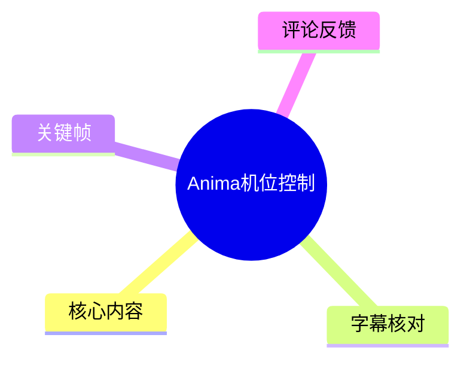
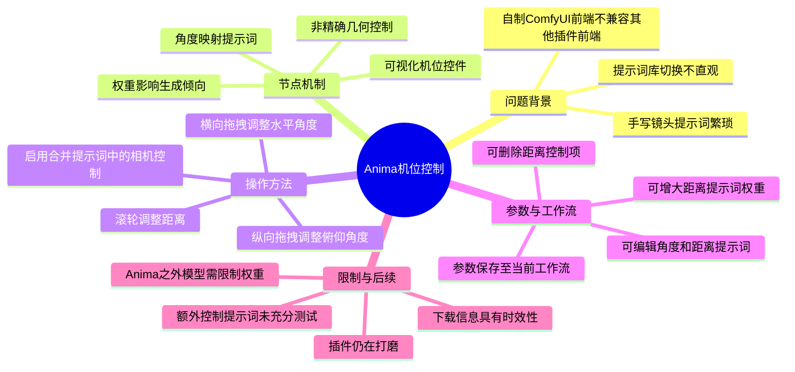
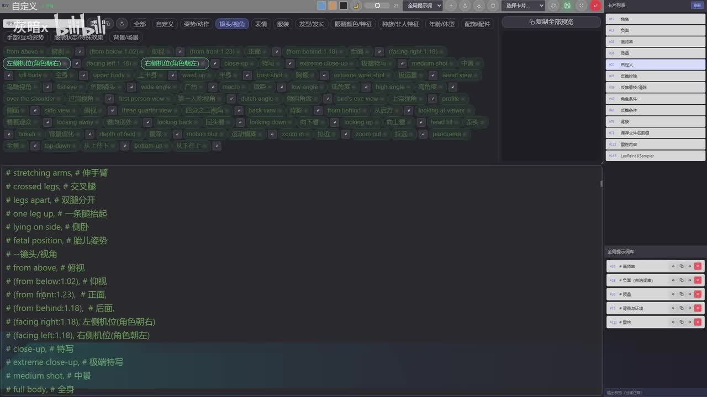
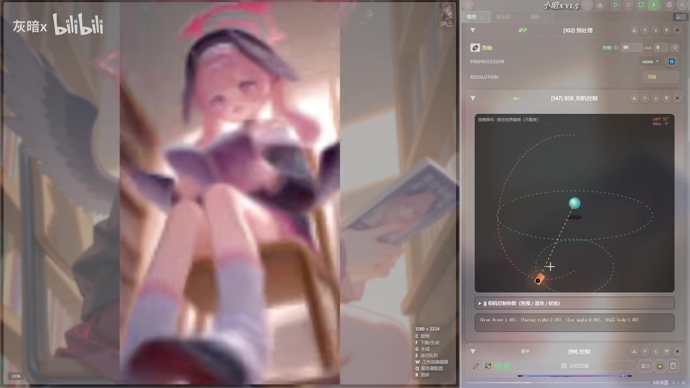

# Anima机位控制

> 来源：[Bilibili 视频](https://www.bilibili.com/video/BV11SNq6wEvP) 
> UP 主：灰暗x｜发布时间：2026-07-15｜视频时长：14 分 56 秒｜分区标签：教程、图生图、ControlNet、ComfyUI、ComfyUI 插件、工作流

## 小结

视频展示了 UP 主为其自制 ComfyUI 前端适配开发的「相机机位控制」节点。其核心目标不是通过传统三维相机或姿态控制器精确锁定镜头，而是把可视化机位控件的角度、仰俯与距离转换为提示词及其权重，从而较直观地改变图像生成的观察视角。

作者先演示了旧方案：在提示词库编辑器中以 `Ctrl + 鼠标左键双击` 启用/禁用镜头提示词，或手写提示词控制机位。该方案虽然可用，但修改视角步骤多、缺乏直观反馈；随后切换到新节点，用户可直接拖动控件中的“相机”图标，并用滚轮调节距离。

操作层面，节点需在“合并提示词”节点中打开“相机控制”开关。横向拖拽用于调整前、后、左、右方向，纵向拖拽调整上、下视角，滚轮调整镜头距离。节点会根据机位状态分配相应角度与距离提示词及权重，生成结果可大致接近所设置的机位。

该工具本质上仍是**提示词驱动**，并非几何意义上的精确相机控制，因此结果存在随机性和偏差。作者明确指出：中间参数区可替换为更有效的提示词；部分额外控制提示词尚未严格测试；针对 Anima 的权重设置不应直接照搬到其他模型，需要限制权重大小。

视频的口播教程在约 07:25 结束，之后主要为测试画面与音乐内容。插件当时“刚做好”，作者称部分细节仍需打磨，后续是否更新、下载地址是否仍有效均具有时效性。视频简介称插件与 LoRA 下载地址位于置顶评论，但本次可获取的前三条热评中未包含具体链接，不能据此确认当前下载可用性。

## 思维导图

## 目录

- [背景：旧式提示词机位控制的局限](#背景旧式提示词机位控制的局限)
- [新节点：可视化机位到提示词权重的映射](#新节点可视化机位到提示词权重的映射)
- [实操步骤：从加载工作流到生成](#实操步骤从加载工作流到生成)
- [参数设置、测试与模型适配](#参数设置测试与模型适配)
- [工作流保存、可编辑项与交流信息](#工作流保存可编辑项与交流信息)
- [结论、限制与时效性](#结论限制与时效性)
- [关键帧索引](#关键帧索引)
- [字幕比对](#字幕比对)
- [评论分析](#评论分析)
- [处理记录](#处理记录)

## 背景：旧式提示词机位控制的局限 [00:00:00](https://www.bilibili.com/video/BV11SNq6wEvP?t=0)

作者开场说明新增了一个“相机机位控制节点”，希望以更直观、快捷的方式设定相机位置。根据视频简介，其开发动机来自此前使用 Wan 模型时见过的同类思路：通过可视化控件来控制输出提示词，进而影响镜头。

不过，作者使用的是自制 ComfyUI 界面，该界面不能直接兼容其他插件的前端，因此其自行制作了适配节点。作者在简介中表示未参考其他插件源码，而是按自身需求实现；此前熬夜做出的第一版效果不理想，随后重做了一版，才形成视频中演示的版本。

### 旧工作流与提示词库操作 [00:00:07](https://www.bilibili.com/video/BV11SNq6wEvP?t=7)

启动前端后，系统会自动载入上一次保存的工作流。若载入的并非目标工作流，视频给出的处理方式是：

1. 按 `Q` 打开工作流面板；
2. 选择指定名称的工作流；
3. 确认该工作流已添加相机控制节点；
4. 先关闭“合并提示词”节点中的相机控制；
5. 按 `G` 运行；
6. 按 `B` 打开提示词库编辑器，并定位到左上角的“自定义”区域。

提示词库编辑器可以添加提示词与导航按钮，也支持搜索定位提示词及添加中文注释。作者认可这种“快速启用/禁用提示词”的机制已经比较方便，但仍认为它不适合频繁调整镜头：用户不仅要理解各条镜头提示词，还要手动切换、保存并重新生成，难以从文字直接预判镜头位置。

> 图：该画面展示提示词库内的镜头、角度、景别等候选条目，以及对应的中文注释和权重写法。它说明旧方案依赖用户手动处理提示词，是新可视化机位节点要解决的主要痛点。

### 旧方案的快捷键与问题 [00:00:56](https://www.bilibili.com/video/BV11SNq6wEvP?t=56)

视频给出了旧方案中两项容易混淆的操作：

| 操作 | 用途 | 视频说明 |
| --- | --- | --- |
| `Ctrl + 鼠标左键双击` | 启用或禁用提示词 | 用于快速切换某条镜头提示词。 |
| `Ctrl + 鼠标双击` 中文注释 | 将注释标记为绿色 | 作者特别提示：中文注释也必须按住 `Ctrl` 再双击，才能以绿色注释状态显示。 |
| `Q` | 打开工作流面板 | 可用于覆盖保存当前载入的工作流。 |
| `G` | 运行/生成 | 在保存或调整提示词后执行生成。 |
| `B` | 打开提示词库编辑器 | 用于定位、编辑或切换提示词。 |

作者以“从后面”视角为例演示了提示词的切换，然后通过 `Q` 打开工作流面板、覆盖保存，再按 `G` 生成。其总结是：无论采用这种逐条切换方式，还是直接手写提示词，视角控制都“不方便”。

## 新节点：可视化机位到提示词权重的映射 [00:01:57](https://www.bilibili.com/video/BV11SNq6wEvP?t=117)

作者表示，第一版机位控制节点在前一晚完成但效果不好，第二天上午重新制作后，认为已达到“还比较好用”的状态。视频中的节点以可视化机位控件替代了用户逐条修改镜头词的过程。

### 节点启用与控件操作 [00:02:22](https://www.bilibili.com/video/BV11SNq6wEvP?t=142)

使用新节点时，先在“合并提示词”节点中找到“相机控制”开关并启用。之后直接操作控件中的相机/手机图标：

| 控件输入 | 控制效果 |
| --- | --- |
| 左右拖拽 | 调整前、后、左、右方向的角度。 |
| 上下拖拽 | 调整上、下方向的角度。 |
| 鼠标滚轮 | 调整相机与主体之间的距离。 |

视频中控件以主体与相机的相对位置、轨迹线及角度信息表现机位关系，用户可在同一界面内一边移动虚拟相机，一边观察输出画面的镜头变化。

> 图：画面左侧为人物背后视角的生成结果，右侧为机位控制节点的可视化控件。该对照是视频最直接的证据：控件设定的方位能够使生成图像呈现接近的观察方向。

### 技术机制：提示词与权重，而不是精确相机 [00:02:45](https://www.bilibili.com/video/BV11SNq6wEvP?t=165)

作者解释，插件会根据当前角度分配提示词和权重，使生成图像的视角与控件中调整的机位“大差不多”。这一表述明确了其实现边界：

- 节点将相机位置转换为镜头方向、景别、距离等语义提示；
- 权重用于增强某些方向或距离语义对模型输出的影响；
- 输出仍由扩散模型对提示词的理解决定；
- 因此它不是可保证透视、构图、主体姿态均严格一致的精确相机系统。

换言之，控件提供的是更易用的**语义镜头控制接口**，而非三维场景中可复现的物理相机参数。若需要严格透视、空间关系或镜头轨迹，不能仅依据该节点的提示词映射能力作保证。

> 图：该帧显示控件中的低位相机位置及其对应的低角度生成画面。它有助于理解“纵向拖拽控制上下角度”的实际视觉效果，同时也能看到生成结果并非完全稳定、精确的几何投影。

## 实操步骤：从加载工作流到生成 [00:00:07](https://www.bilibili.com/video/BV11SNq6wEvP?t=7)

以下流程按视频实际演示顺序整理，适用于已具备该自制前端、目标工作流和相机控制节点的情况。

### 1. 打开并确认目标工作流 [00:00:12](https://www.bilibili.com/video/BV11SNq6wEvP?t=12)

1. 启动前端界面。
2. 检查自动加载的工作流是否正确。
3. 若不正确，按 `Q`，在工作流面板中选择目标工作流。
4. 确认工作流中已经存在相机控制节点。

### 2. 需要时先用提示词库验证旧工作流 [00:00:24](https://www.bilibili.com/video/BV11SNq6wEvP?t=24)

1. 在“合并提示词”节点中暂时关闭相机控制。
2. 按 `G` 运行。
3. 按 `B` 打开提示词库编辑器。
4. 进入“自定义”区域，搜索或定位镜头提示词。
5. 通过 `Ctrl + 鼠标左键双击` 切换所需提示词。
6. 对中文注释执行 `Ctrl + 双击`，确保其以绿色注释状态显示。
7. 按 `Q` 打开工作流面板，执行覆盖保存。
8. 再按 `G` 生成并观察结果。

此段并非新节点的必要步骤，而是用来说明旧方法的工作方式与局限。

### 3. 启用可视化相机控制 [00:02:22](https://www.bilibili.com/video/BV11SNq6wEvP?t=142)

1. 返回“合并提示词”节点。
2. 打开其中的“相机控制”开关。
3. 在相机控制节点中拖动相机图标：
   - 横向移动：改变主体前后左右的观察角度；
   - 纵向移动：改变俯视、平视或仰视倾向。
4. 使用鼠标滚轮改变距离。
5. 执行生成，比较控件机位与图像中的镜头视角。
6. 若方向或距离效果偏弱，再展开参数设置区调整对应提示词与权重。

> 图：该帧同时展示人物基准图与右侧工作流节点区域，说明视频是在既有图生图/工作流环境中加入机位控制，而不是单独运行的独立相机软件。

## 参数设置、测试与模型适配 [00:03:34](https://www.bilibili.com/video/BV11SNq6wEvP?t=214)

作者从约 03:35 开始进行简单测试与参数调整。此部分重点不在提供一套固定数值，而在说明哪些提示词和权重可以被改动，以及改动时应注意模型差异。

### 可调整的内容 [00:02:57](https://www.bilibili.com/video/BV11SNq6wEvP?t=177)

节点的中间参数设置区可展开，作者建议在这里使用“更有效的提示词”。根据后续说明，绝大多数对应**角度**和**距离**的提示词都可以配置。

可迁移的配置思路包括：

- 对“前方、后方、侧方、俯视、仰视”等方向词设置适合目标模型的表达；
- 对“近景、远景、拉近、拉远”等距离相关提示词单独设置；
- 当某类镜头不需要时，删除其对应的提示词设置；
- 将测试有效的提示词与权重保存进当前工作流，便于复用。

视频简介也明确提到，插件理论上支持任何模型，因为各方位对应提示词可以在参数中设置；但这只是作者对配置能力的说明，**不等于所有模型均已被实际验证**。

### 距离权重的测试结论 [00:04:55](https://www.bilibili.com/video/BV11SNq6wEvP?t=295)

作者在测试中指出，距离相关提示词起初没有加权重。随后演示了展开参数设置并增大权重的做法，结论是：拉大距离权重后，距离变化效果明显增强。

这里可以归纳为一个实际调参顺序：

1. 先用默认距离提示词测试结果是否能体现远近变化；
2. 若远近效果不明显，展开参数区；
3. 提高距离相关提示词的权重；
4. 重新生成，对比画面景别和主体大小变化；
5. 若出现模型过度响应或画面失真，则回调权重或替换提示词。

视频没有给出可普遍复用的具体权重数值。因此，不能把演示画面中的数值当作通用预设。

### Anima 模型与其他模型的权重限制 [00:05:05](https://www.bilibili.com/video/BV11SNq6wEvP?t=305)

作者特别提示：视频所示增大权重的效果是针对 **Anima**；换用其他模型时，应限制权重大小。这意味着至少存在以下风险：

- 不同模型对括号权重、镜头词和方向词的敏感度不同；
- Anima 上有效的加强幅度，在其他模型上可能导致语义压制、构图异常或镜头词过拟合；
- “距离”通常会同时影响景别、主体占比和透视感，不能仅以人物大小判断控制是否成功；
- 控制不稳定时，应优先检查词汇是否适配模型，再考虑继续提高权重。

视频没有提供其他模型的安全权重范围，也没有展示跨模型对比测试。因此，其他模型的参数应从较低权重开始逐步试验。

## 工作流保存、可编辑项与交流信息 [00:06:06](https://www.bilibili.com/video/BV11SNq6wEvP?t=366)

### 参数会保存到当前工作流 [00:06:11](https://www.bilibili.com/video/BV11SNq6wEvP?t=371)

作者两次强调，节点中的设置数据会保存到当前工作流。这一机制的实际意义是：

- 不同项目可以分别保留不同模型适配词；
- 已调好的角度、距离词与权重可随工作流恢复；
- 覆盖保存工作流前，应确认当前配置确实是希望保留的版本；
- 若切换工作流，不能默认另一工作流会自动继承相同参数。

### 不使用距离控制时的处理 [00:06:30](https://www.bilibili.com/video/BV11SNq6wEvP?t=390)

若不希望节点控制距离，作者给出的做法不是关闭整个节点，而是删除距离对应的提示词设置。这样可以保留方向与高度等机位控制，同时排除距离语义对画面的干扰。

### 未充分测试的额外控制 [00:06:44](https://www.bilibili.com/video/BV11SNq6wEvP?t=404)

作者称部分“额外控制”的提示词尚未测试充分，用户可以自行替换为更有效的方案。站内字幕将其中一个方向译作“翻滚”，但后续术语识别存在不稳定；作者明确表达的可靠信息是：**这部分尚未找到满意的提示词方案，目前采用的是临时方案。**

因此，额外控制部分应被视作实验性功能，而不是稳定能力。对于旋转/翻滚等复杂镜头语义，建议保留原工作流备份，并通过少量种子、多次生成来验证其在特定模型上的稳定性。

### 下载、画风与交流渠道 [00:03:17](https://www.bilibili.com/video/BV11SNq6wEvP?t=197)

视频提到：

- 本次工作流所用画风相关资源，可在字幕所称的“C 站”搜索 `BSKFF`；
- 作者此前遗漏过新版工作流的下载地址；
- 视频简介称插件与 LoRA 下载地址在置顶评论；
- 有想法或不会使用插件的观众，可加入 QQ 群 `439870282` 讨论。

需要区分的是：`BSKFF`、QQ群号和“下载地址见置顶评论”均为视频中的发布时信息。本次采集到的前三条热评没有实际下载链接，也未验证资源页面、QQ群或插件仓库在当前时间是否仍可访问。

### 作者的维护状态说明 [00:07:04](https://www.bilibili.com/video/BV11SNq6wEvP?t=424)

作者称插件刚完成，仍有一些细节需要打磨，今后有时间和精力时会更新。其自定义 ComfyUI 界面的配色由作者手动逐项调整，虽自评“不算经验”，但代表个人偏好的视觉风格。

口播到约 07:24 结束。之后站内字幕主要识别为英文歌曲歌词，ASR 也不再识别出新的中文讲解；视频总时长仍为 14:56，因此后半段不应被误读为继续提供了新的操作步骤或参数结论。

## 结论、限制与时效性 [00:07:04](https://www.bilibili.com/video/BV11SNq6wEvP?t=424)

### 可复用的经验

1. **把复杂提示词参数化、可视化。** 对频繁调整的镜头方向、俯仰和距离，将文字提示词映射到拖拽控件，比在长提示词库中手动寻找和切换更高效。
2. **将“控件操作”与“提示词配置”分层。** 前者服务于快速构图，后者承担模型适配；界面方便并不能取代提示词测试。
3. **按功能分开调权重。** 距离词效果不足时可以针对距离项增强，而不必盲目提高全部镜头词权重。
4. **以工作流保存配置。** 每个模型、画风或项目都可保留独立的方向词、距离词和权重版本，降低重复调参成本。
5. **对跨模型迁移保持保守。** 作者已提示 Anima 之外的模型要限制权重；应从小幅调整开始，而非复制同一强度。

### 已知限制

| 限制 | 视频依据 | 使用影响 |
| --- | --- | --- |
| 不是精确机位控制 | 作者明确说明靠提示词控制角度，“并不精确”。 | 不能保证透视、人物朝向与镜头位置完全符合控件。 |
| 效果受模型影响 | 视频专门区分 Anima 与其他模型。 | 其他模型可能需要不同词表和更低权重。 |
| 部分额外提示词未测试 | 作者直接说明未测试充分。 | 实验性功能可能无效或产生意外画面。 |
| 距离控制依赖权重 | 测试显示加大距离权重后效果明显。 | 默认值下距离变化可能偏弱，过高又可能过度干预生成。 |
| 插件仍在打磨 | 作者称刚做好，未来可能更新。 | 界面、节点名称、参数结构与下载位置可能变化。 |

### 时效性说明

本视频发布于 2026-07-15，内容对应作者当时自制前端与刚完成的插件版本。插件下载、LoRA 资源、工作流文件、QQ 群和外部资源站点均可能在发布后变更。本文仅记录视频及提供素材中可验证的说法，不将“理论支持任何模型”扩展为已验证的兼容性结论。

## 关键帧索引

| 时间位置 | 关键帧 | 画面内容与正文价值 |
| --- | --- | --- |
| 约 00:30–00:50 |  | 提示词库中可见镜头/视角词、中文注释与权重表达，是理解旧方案繁琐性的关键画面。 |
| 约 01:00–01:40 |  | 展示人物基准图与右侧节点工作流，说明机位控制运行在现有生成工作流内。 |
| 约 02:45–03:00 |  | 左侧生成结果与右侧机位控件同屏，直接支持“视角大致接近”的演示结论。 |
| 约 03:30 后测试段 |  | 通过低位相机位置和仰视结果，帮助理解纵向拖动、低机位与生成稳定性之间的关系。 |

> 关键帧用于辅助解释界面和视觉结果；其中画面上可见的细小参数文字不作为未被字幕或作者口播确认的通用数值依据。

## 字幕比对

| 字幕来源 | 完整性 | 专有名词 | 时间轴 | 主要问题 |
| --- | --- | --- | --- | --- |
| Bilibili 站内字幕 | 覆盖开场至约 07:25 的中文讲解，后续覆盖部分歌曲歌词；与视频结构较完整。 | 对 `Ctrl`、`Q`、`G`、`B`、Anima、QQ 群号等信息较可靠；个别前端名称与资源站名称仍有歧义。 | 分段细，提供了可直接使用的毫秒级起止时间。 | 将软件名称写为“CONFERRY”、部分词语如“LAURAC”“DAR真狗”难以确认；歌曲歌词识别也存在错误。 |
| 本次 ASR 字幕 | 识别到 00:00–07:24.740 的中文口播，共 24 段；诊断显示有效语音约 191.55 秒。 | `Confiri`、`Config`、`LauraC`、提示词/权重等词多有误识别。 | 有时间戳，但单段较长，例如 00:12.740–00:36.800 合并了多项操作。 | 多处同音或形近误识别，如“插线”“提示辞”“启动禁运”“权力”；未覆盖歌曲歌词。 |

### 最终字幕选择与校正原则

正文以**站内字幕的细粒度时间轴**为主，因为其可将操作拆分到具体按钮和快捷键；同时对照本次 ASR 复核口播范围、段落边界和关键表述。ASR 诊断中未标记 `noAudioStream=true`，且已成功识别中文语音，因此该视频并非无音轨素材。

以下内容通过两份字幕交叉比对并结合关键帧/视频语境处理：

- “相机控制”“合并提示词”“提示词库编辑器”“工作流”“距离权重”等核心概念，两份字幕语义一致，正文采用规范表述。
- `Ctrl`、`Q`、`G`、`B` 是站内字幕中明确给出的快捷键，ASR 对其也存在相应语义片段，予以保留。
- “Anima”在站内字幕与 ASR 中均有近似识别，正文使用视频标题与口播中更稳定的写法 **Anima**。
- 站内字幕中的“C站搜索 BSKFF”与 ASR 的“LauraC站搜索BSKFF”无法共同确认具体资源站名称；正文只记录“字幕所称 C 站搜索 `BSKFF`”，不扩展为确定外部链接。
- 对“额外控制”中的临时提示词，两个字幕均出现无法可靠还原的词语，正文不强行补全具体英文或中文术语，仅保留作者“未充分测试、可自行替换”的明确结论。

## 评论分析

本次仅获取到热评前三条，均为简短反馈，未包含可验证的下载链接、配置参数或技术纠错信息。

1. **变量系统**（获赞 1）：“woc，好帅的插件”  
   - 观点：对插件的界面或交互观感表达正向评价。  
   - 补充信息：无技术细节。  
   - 可信度与边界：属于主观感受，不能用于证明插件控制精度或兼容性。

2. **灰暗x（UP 主）**（获赞 5）：“老哥们觉得有用就个关注支持下吧, 做这玩意花了不少精力和米,[大哭]”  
   - 观点：UP 主表示开发投入了较多时间与成本，并希望获得关注支持。  
   - 补充信息：与视频中“自制界面花了不少精力”的口播相呼应。  
   - 可信度与边界：可作为作者本人对开发投入的陈述，但未提供成本明细、版本计划或技术文档。

3. **那就那就打断**（获赞 1）：“牛逼”  
   - 观点：表达肯定。  
   - 补充信息：无。  
   - 可信度与边界：属于情绪性评价，不构成技术验证。

## 处理记录

- Worker ID：`worker-mrj0wbly-5dc4e50c`
- 模型：`gpt-5.6-terra`
- ASR 模型与运行信息：`medium`，语言识别为 `zh`，置信度 `0.99951171875`，CUDA / `float16`。
- 使用的素材与工具结果：
  - 视频元数据、简介、标签与统计信息；
  - 站内字幕 `p01-ai-zh.srt`；
  - 本次 ASR 输出 `asr-result.json`、`transcript.srt` 与覆盖诊断；
  - 关键帧目录 `frames/`；
  - 热评抓取结果 `comments/comments.json`，限制为前三条。
- 字幕选择：以站内 SRT 的细粒度时间轴作为章节链接依据；逐段对照本次 ASR，使用 ASR 复核语音范围与语义。未发现 `noAudioStream=true` 标记。
- 关键帧选择依据：选取提示词库界面、图生图工作流、后方机位对照、低机位测试四类画面，分别覆盖旧方案、运行环境、核心控件机制和视角效果；图片均使用相对路径 `frames/xxx.jpg`。
- 缓存清理：提供的素材中没有缓存清理日志，无法确认是否执行或清理结果；本文不将其记为已完成。
- 未解决问题：
  - “C站 / LauraC”“BSKFF”对应的确切外部资源站与资源链接未在可用素材中得到可靠确认；
  - “额外控制”所使用的临时提示词存在字幕识别歧义，未据此编造术语；
  - 视频简介提到的置顶下载链接未出现在本次可获取的前三条热评中，当前有效性未验证。
