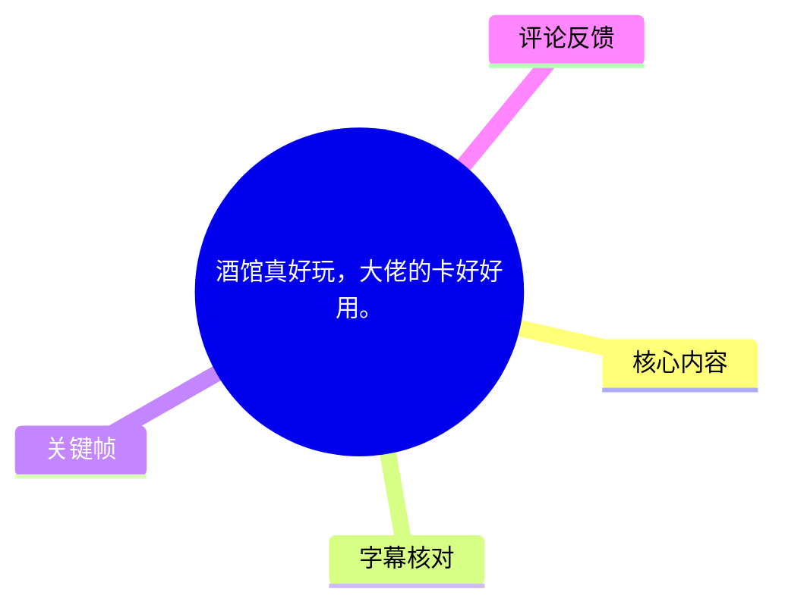
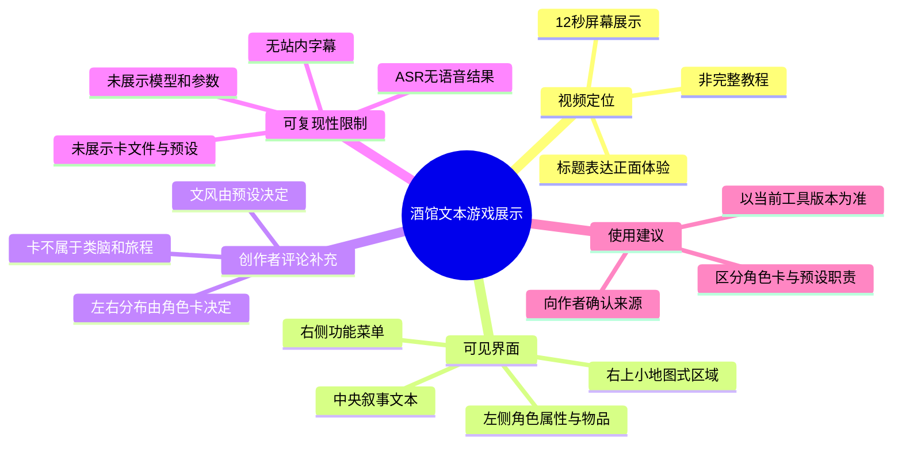
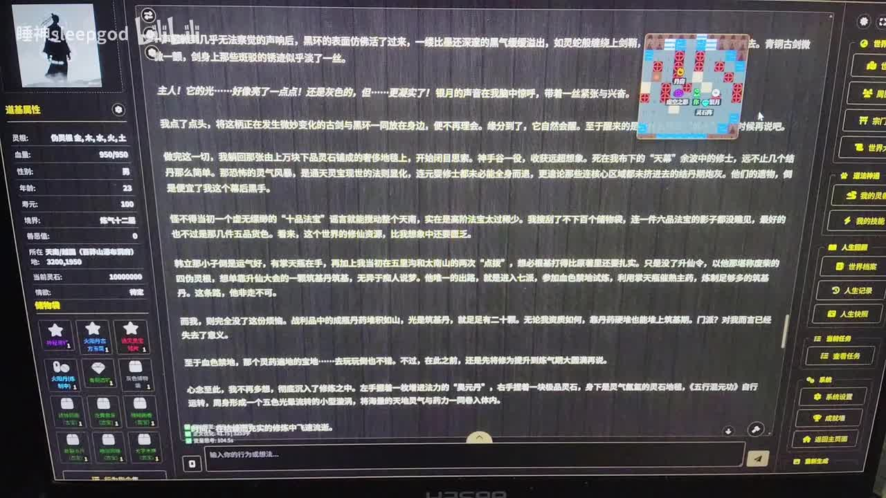
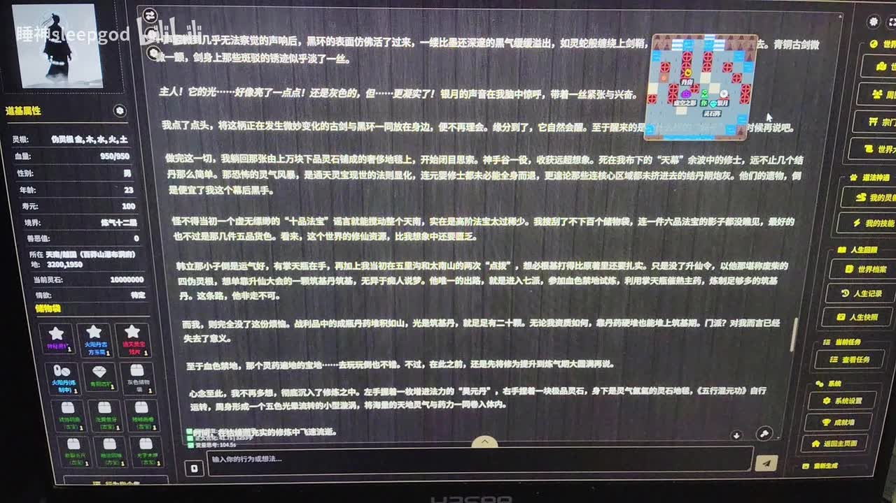

# 酒馆真好玩，大佬的卡好好用。

> 来源：[Bilibili 视频](https://www.bilibili.com/video/BV1Lw6iBFEu4) 
> UP 主：睡神sleepgod｜发布时间：2026-01-30｜视频时长：12 秒｜标签：穿越、AI文本游戏

## 小结

该视频是一段时长仅 12 秒的屏幕展示。画面主体为一套深色主题的 AI 文本游戏/角色扮演界面：中央区域持续显示长篇中文叙事文本，左侧为人物或角色属性与物品栏，右侧为功能菜单，右上角还能看到小地图式的图形区域。视频标题表达了 UP 主对“酒馆”及某张“卡”的正面体验。

从可见界面判断，视频强调的不是操作教程，而是展示一张角色卡及其预设在实际文本冒险中的呈现效果：界面有较完整的角色数值、道途属性、背包物品、任务/世界/人生记录等功能分区，并在中央生成连续的剧情文本。标题中的“卡好好用”是创作者的主观评价，不等同于对卡质量、兼容性或生成稳定性的客观测试结论。

视频没有提供可用的站内字幕；本次 ASR 也未识别到任何语音片段。因此，无法从音轨确认所使用的平台名称、模型、角色卡名称、预设内容、提示词、世界书、采样参数或具体操作步骤。文档只能基于视频元数据、可见界面和热评进行谨慎整理，不能将画面中难以可靠辨认的长文本扩写为完整剧情。

热评中，UP 主补充说明：视频中的卡“不是类脑和旅程里的”，左右栏分布由角色卡决定，文风由预设决定。这是理解画面布局与输出风格的关键补充，但它属于评论区的作者说明，未提供卡文件、预设文本或可复现配置，不能据此复现相同效果。

适合本文的读者包括：希望快速确认该视频展示类型的 AI 文本游戏用户、关注角色卡与预设分工的酒馆类工具用户，以及需要辨析“视频实机展示”与“可复现教程”差别的读者。由于视频发布于 2026-01-30，且相关工具、角色卡来源、扩展能力与社群链接都可能变化，涉及工具生态的信息应以当前实际页面和作者后续公开说明为准。

## 思维导图

## 目录

- [视频范围与证据边界](#视频范围与证据边界)
- [界面展示：角色属性、叙事文本与功能区](#界面展示角色属性叙事文本与功能区)
- [可归纳的角色卡与预设分工](#可归纳的角色卡与预设分工)
- [复现步骤与缺失参数](#复现步骤与缺失参数)
- [结论、限制与时效性](#结论限制与时效性)
- [字幕比对](#字幕比对)
- [评论分析](#评论分析)
- [关键帧索引](#关键帧索引)
- [处理记录](#处理记录)

## [视频范围与证据边界](https://www.bilibili.com/video/BV1Lw6iBFEu4?t=0)

本视频总时长为 11.9815 秒（元数据标注为 12 秒）。由于站内未提供可用字幕，本次 ASR 也没有生成带时间戳的语音分段，不能据字幕为具体界面内容建立细粒度起止时间。

因此，本节及后文统一使用视频起点链接作为可验证入口，而不将画面中的文字出现顺序伪造为精确时间轴。视频从起点即可查看整体屏幕展示：

- **中央主区域**：深色背景上的多段中文叙事文本，呈现文本冒险/角色扮演的持续生成结果。
- **左侧栏**：可见“道途属性”等属性区域，包含数值条目、角色状态与多格物品/能力图标。
- **右侧栏**：可见多项纵向功能按钮，画面可辨认到与世界、人生、任务、角色等相关的管理入口，但无法仅凭当前帧可靠还原全部按钮名称。
- **右上区域**：有一块格子化、小地图式的图形信息面板。
- **底部**：存在文本输入区及发送/执行样式按钮，说明该界面支持用户输入行动或指令。

视频没有出现口播、字幕式说明或可可靠读取的配置面板。它展示的是一次已经运行中的游戏/叙事状态，而不是从安装、导入到开始对话的过程。

> 图：该关键帧保留了中央叙事区、左侧属性与物品栏、右侧功能区及底部输入栏的完整空间关系。它的价值在于证明视频确实以“已运行的文本游戏界面”为核心，而非单纯展示角色卡文件或聊天记录。

## [界面展示：角色属性、叙事文本与功能区](https://www.bilibili.com/video/BV1Lw6iBFEu4?t=0)

### 1. 中央区域：长文本叙事输出

画面中央是连续段落形式的中文文本。其排版更接近小说式场景描写与角色扮演叙事，而不是简短的问答聊天。文本中可见人物行动、环境描写、战斗或事件推进式的表达；但受屏幕拍摄角度、分辨率与压缩影响，不能将其中具体句子作为可靠的逐字转录。

可确认的呈现特点包括：

1. 文本内容较长，单次输出覆盖多个段落。
2. 叙事区带有滚动条或可滚动布局，暗示存在更长的历史文本。
3. 文本以故事推进为主，结合人物状态、场景与行动结果。
4. 底部输入框表明用户可继续输入行动，使叙事形成交互循环。

这类展示至少说明：当前角色卡与预设组合能够在该界面中生成具有连续段落结构的中文剧情文本。它**不能单独证明**文本完全由某张卡、某个模型或某项特定插件产生，因为视频没有展示调用链和配置。

### 2. 左侧区域：角色状态、数值与物品/能力格

左侧栏顶部显示头像与“睡神sleepgod”字样；下方为“道途属性”样式的角色信息区域。可见多个标签与数值，包含生命/灵能等角色状态形式的条目，以及一组图标化的物品、能力或特性格。

从交互设计角度，左栏承担了“叙事状态可视化”的作用：

- 将角色基础状态从中央叙事区拆出，避免每次阅读剧情时重复查找；
- 以图标格收纳能力、物品或特质，使状态管理可视化；
- 让文字生成的剧情与数值/物品系统并存，构成带规则感的 AI 文本游戏界面。

需要注意的是：视频未说明这些数值是否由模型直接维护、由前端脚本计算，还是由用户手动编辑；也未展示任何刷新、装备、结算或存档操作。因此不能把界面存在直接等同于机制已被验证。

### 3. 右侧区域：世界、任务与记录类入口

右侧是纵向排列的菜单按钮。可见其设计包含世界、人生、任务、角色等方向的功能分组，体现该工具不仅生成单段对话，还尝试提供世界状态、事件记录、人物信息或任务管理等外围模块。

从视频画面可以得出的保守结论是：

- 界面具备面向长流程角色扮演的功能入口；
- 这些入口与中央的连续剧情文本共同构成“文本叙事 + 状态管理”的工作流；
- 但视频没有点开任一入口，故无法确认其具体字段、数据来源、保存方式、是否可编辑，或是否属于某一特定扩展。

> 图：该帧适合观察左右侧栏的功能定位。左侧强调角色属性与图标格，右侧为纵向管理入口；二者夹住中央叙事文本，体现界面将“故事阅读”和“状态管理”同时呈现的设计。

## [可归纳的角色卡与预设分工](https://www.bilibili.com/video/BV1Lw6iBFEu4?t=0)

视频标题只称赞“大佬的卡”，未给出卡名、作者、下载地址或导入方式。可获取热评中，UP 主对观众疑问作出如下补充：

> “这个卡确实不是类脑和旅程里的，左右分布是角色卡的原因，文风是预设的原因。”

该说明可以谨慎拆分为三层信息：

| 层面 | 来自评论的说明 | 对视频画面的解释 | 当前不能确认的内容 |
| --- | --- | --- | --- |
| 角色卡来源 | 该卡不在“类脑和旅程”中 | 不能按该名称直接定位卡源 | 卡名、作者、授权、发布地址 |
| 左右分布 | 左右分布由角色卡决定 | 角色卡可能携带或影响信息展示结构 | 是前端模板、角色卡字段还是扩展渲染 |
| 文风 | 文风由预设决定 | 长篇叙事风格并非只能归因于角色卡 | 预设全文、系统提示词、采样参数、模型 |

这一补充的重要价值，是避免将全部效果简单归功于“卡”。至少按 UP 主自身说法，画面中的两类效果由不同来源主导：

1. **结构/布局层**：与角色卡有关；
2. **语言风格层**：与预设有关。

不过，这不意味着角色卡与预设之间存在严格、通用且在所有工具中一致的边界。不同酒馆类工具、前端版本、角色卡格式和扩展机制对字段的支持并不相同。上述归因仅适用于 UP 主所展示的这一套环境，应被视为作者经验，而非通用技术规范。

## [复现步骤与缺失参数](https://www.bilibili.com/video/BV1Lw6iBFEu4?t=0)

视频没有提供可直接执行的教程、命令或配置文件。若读者希望接近画面的使用方式，以下是依据视频可见结构及 UP 主评论整理的**信息核验流程**，不是视频中已演示完毕的操作步骤。

### 可执行的核验流程

1. **确认目标工具与当前版本**
   - 视频标题含“酒馆”，标签含“AI文本游戏”，但画面和元数据均未明确给出软件的准确名称、版本号或部署方式。
   - 应先向作者或原卡发布者确认其使用的具体前端、扩展和版本，而不要仅依据界面外观安装某一软件。

2. **取得经过授权的角色卡来源**
   - UP 主明确表示该卡“不在类脑和旅程里”。
   - 不能据此推断卡一定公开、免费、可重新分发，亦不能猜测链接。
   - 若作者提供卡源，应同时核对角色卡格式、导入方式和适用环境。

3. **取得或重建相应预设**
   - 根据 UP 主评论，文风主要由预设决定。
   - 若只导入角色卡而没有相同或近似预设，生成文本的叙述节奏、描写密度与表达方式可能明显不同。
   - 视频未公开预设内容，无法从画面反向可靠还原。

4. **在相近的界面结构中检查角色状态区**
   - 导入后检查是否能看到角色属性、物品/能力格、中央叙事区、右侧任务/世界类入口等结构。
   - 如果布局不一致，优先检查工具版本、主题、扩展、角色卡字段以及前端模板，而不宜仅调整模型参数。

5. **以同类场景测试输出**
   - 在同一角色卡和预设组合下，用相近的冒险/行动提示连续交互数轮，观察叙事是否保持连贯。
   - 测试时应保留模型名称、上下文长度、温度、Top-p、重复惩罚、最大输出长度、提示词模板等记录，以便判断差异来源。

### 视频未给出的关键参数

下列信息均不能从现有素材中确认，复现时必须另行获取：

| 项目 | 视频是否给出 | 影响 |
| --- | --- | --- |
| 角色卡名称与文件 | 否 | 无法定位或导入同一角色 |
| 角色卡作者与来源链接 | 否 | 无法核验授权、版本与更新状态 |
| 预设全文 | 否 | 无法复现叙事文风 |
| 模型/API 提供方 | 否 | 输出能力与合规限制未知 |
| 温度、Top-p、重复惩罚等采样参数 | 否 | 生成稳定性与文风可能变化 |
| 上下文长度与最大输出长度 | 否 | 长剧情承接能力未知 |
| 扩展、插件、主题与前端版本 | 否 | 界面布局与功能按钮可能不一致 |
| 世界书/ lorebook / 规则文件 | 否 | 世界观、事件触发与设定承接未知 |
| 存档和状态同步机制 | 否 | 数值、物品和任务是否可靠更新未知 |

## [结论、限制与时效性](https://www.bilibili.com/video/BV1Lw6iBFEu4?t=0)

### 可迁移的经验

- 在 AI 文本角色扮演场景中，应将“角色/结构”和“预设/文风”分开排查。UP 主的评论表明，至少本例中左右区域的分布与角色卡有关，而文本风格与预设有关。
- 观看短视频实机展示时，界面效果与文本效果需要分别判断：前者可能来自前端、主题、扩展或结构化字段，后者还受到预设、模型和采样参数影响。
- 想复现某个效果时，优先索取角色卡、预设、工具版本和模型参数；仅凭截图或一段生成文本通常不足以获得相同结果。

### 主要限制

1. **音频证据缺失**：ASR 没有识别到语音，无法从口播获得操作说明。
2. **字幕证据缺失**：没有站内字幕，也没有可用 ASR 时间轴文本。
3. **配置证据缺失**：未展示卡文件、预设、模型、参数、扩展和导入步骤。
4. **展示时长极短**：12 秒只能说明某一运行时画面，不足以评价稳定性、长上下文一致性、数值系统准确性或内容安全性。
5. **界面文字可读性有限**：屏幕拍摄画面中的长叙事文本与部分按钮无法进行可靠逐字抄录，故本文未将其作为精确文本证据。

### 时效性

视频发布于 2026-01-30；抓取元数据时间为 2026-07-15。酒馆类前端、扩展、生图功能、角色卡发布渠道及社群链接均可能在后续更新、迁移、下架或改变兼容性。评论中提及的 Discord 链接当时尚未在可获取素材中提供，不能将其视为现有可用资源。

## 字幕比对

| 字幕来源 | 完整性 | 专有名词 | 时间轴 | 主要问题 |
| --- | --- | --- | --- | --- |
| Bilibili 站内字幕 | 无可用字幕 | 无法核验 | 无 | 素材明确标注“未提供可用站内字幕” |
| 本次 ASR 字幕 | 空 | 无法识别 | 无可用分段 | Whisper medium 自动语言识别为英语，置信度 0.541015625；识别结果为 0 段、语音覆盖 0 秒 |

本次 ASR 已执行，使用 `medium` 模型、CUDA 与 `float16` 计算；诊断结果提示“未识别到语音片段”，需核查源视频是否含可听语音或是否需要选择其他音轨。由于站内字幕和 ASR 均不可用，本文没有采用任何字幕文本，而是采用“元数据 + 可见关键帧 + 热评作者补充”的保守整理方式。

未对画面中难以辨认的长段叙事进行 OCR 式逐字校正，也未将“酒馆”“类脑和旅程”等词扩展为未获证实的软件、平台或卡名：

- “酒馆”来自视频标题；
- “类脑和旅程”来自 UP 主热评；
- 角色卡布局与预设文风的分工来自 UP 主热评；
- 具体工具名称、角色卡名称和预设名称均未能确认。

## 评论分析

以下仅处理可获取的热评前三条。评论反映的是发言者的个人说明或建议，不自动构成已验证事实。

### 1. 睡神sleepgod｜56 赞

> “这个卡确实不是类脑和旅程里的，左右分布是角色卡的原因，文风是预设的原因。不过我最近被电信诈骗被坑了很多钱，不想回复别人。”

- **核心观点**：视频中的卡不属于“类脑和旅程”；画面布局主要受角色卡影响，文风主要受预设影响。
- **补充价值**：这是现有素材中最直接的配置归因说明，能帮助读者避免把布局和文风都简单归因于角色卡。
- **可信度与边界**：评论由 UP 主本人发布，对其展示环境有较高的一手说明价值；但未提供卡、预设或技术文档，无法独立复现与验证。
- **其他信息**：UP 主提到遭遇电信诈骗并暂不愿回复他人。这是其个人处境陈述，与工具效果无直接技术关联，也不应被延伸解读。

### 2. 摸鱼QvO｜36 赞

> “[doge]扩展区有生图附体”

- **核心观点**：评论者指出扩展区域可能存在“生图附体”能力或相关功能。
- **补充价值**：提示观众关注可能的扩展功能，且与画面右上方的图形区域存在表面上的关联。
- **可信度与边界**：该评论未说明功能名称、安装方式、适用版本或实际运行结果；视频也未演示生图过程。因此不能据此确认视频使用了生图扩展，更不能据此写出安装教程。

### 3. 睡神sleepgod｜21 赞

> “电脑不在身边，明天想得起来给你推个discode链接”

- **核心观点**：UP 主曾表示可能稍后分享 Discord 链接。
- **补充价值**：表明相关资源或交流渠道可能存在于 Discord。
- **可信度与边界**：在当前可获取的热评前三条中没有实际链接，也没有后续确认信息；“想得起来”本身表示并非承诺。不能把它当作现成的下载渠道或资源出处。

## 关键帧索引

| 关键帧 | 用途 | 画面价值 |
| --- | --- | --- |
|  | 正文整体界面说明 | 同时呈现中央叙事区、左右侧栏、右上图形区与底部输入区，是识别视频类型与界面结构的主要证据。 |
|  | 角色卡与界面结构讨论 | 便于观察左侧属性/物品样式区和右侧功能菜单的并置关系，支持“布局需与文风分开分析”的讨论。 |

其余关键帧路径已获取，但当前提供的帧画面与已选帧高度相似，未显示新的可验证操作、配置页或文本变化。为避免重复插图和过度解读，未额外纳入正文。

## 处理记录

- **Worker ID**：`worker-mrj0wbly-5dc4e50c`
- **模型**：`gpt-5.6-terra`
- **ASR 模型与运行参数**：`medium`；自动语言识别；CUDA；`float16`；识别语言结果为 `en`，语言置信度 `0.541015625`。
- **调用工具与素材**：使用任务提供的视频元数据、关键帧清单与画面、ASR 覆盖诊断、ASR 输出状态、热评前三条；未提供站内可用字幕。
- **字幕选择**：未选择任何字幕作为正文转录依据。站内字幕缺失；本次 ASR 已执行但输出为空（0 个时间分段、0 秒语音覆盖），故采取视觉与元数据保守记录。
- **时间轴依据**：不存在可直接使用的 SRT/ASR 分段时间。正文各视频章节链接统一指向经元数据确认的视频起点 `t=0`，不对无证据支持的画面内容标注虚构的出现时刻。
- **关键帧选择依据**：选择 `frame-001.jpg` 展示完整运行界面，选择 `frame-006.jpg` 强调左右分栏和功能结构；两帧均能直接支撑正文的界面结构描述。未对难以可靠辨认的长文本作逐字转写。
- **缓存清理**：任务素材仅提供输出路径与处理完成状态，未提供缓存目录、删除日志或清理回执；缓存清理状态无法确认，未声称已清理。
- **未解决问题**：具体工具名称与版本、角色卡名称和来源、预设全文、模型/API、采样参数、扩展配置、世界书/规则文件、Discord 实际链接，以及右上图形区是否由生图扩展生成，均无法由现有素材确认。
