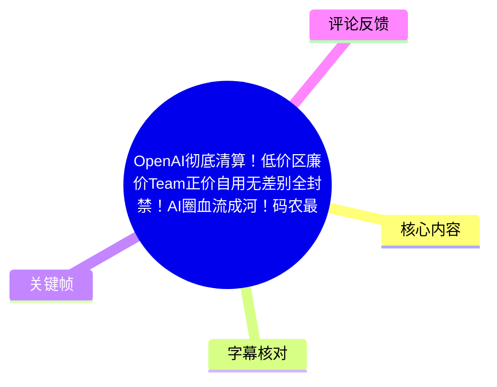
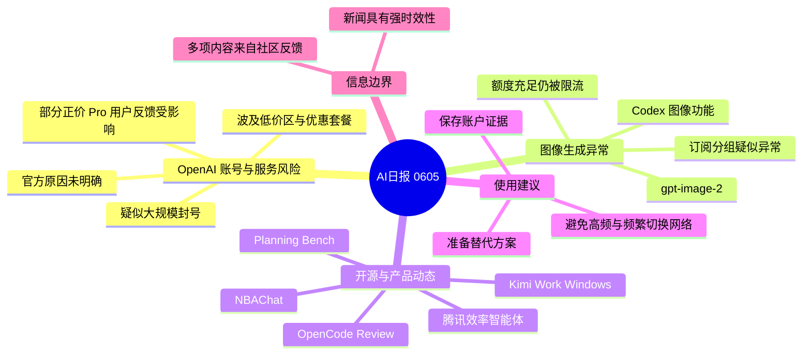
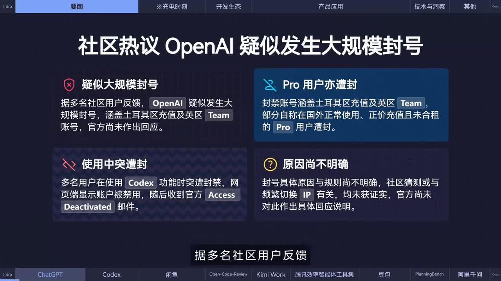
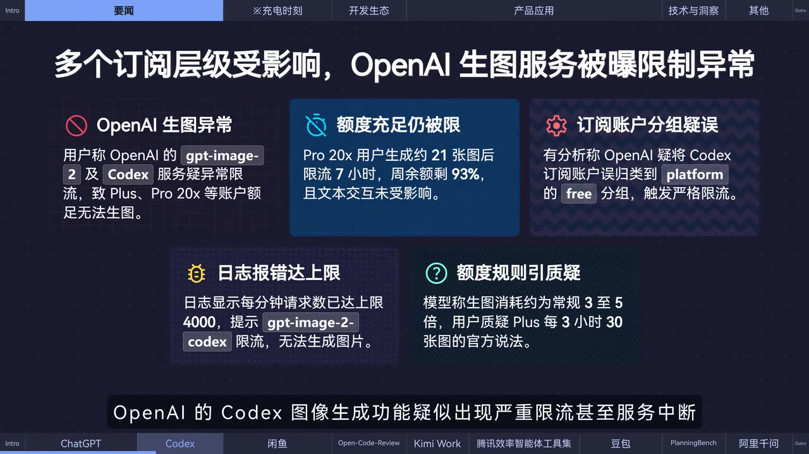

# OpenAI彻底清算！低价区廉价Team正价自用无差别全封禁！AI圈血流成河！码农最黑暗一日！ | AI日报0605

> 来源：[Bilibili 视频](https://www.bilibili.com/video/BV17v7k6cEPZ) 
> UP 主：黑鸦Heya｜发布时间：2026-06-05｜视频时长：02:05｜分辨率：3840×2160

## 小结

本期 AI 日报的首要新闻是：据社区用户反馈，OpenAI 疑似出现大规模账号封禁。视频所述受影响范围包括低价区充值、优惠价 Business/Team 套餐，以及部分声称在境外以实体卡正价充值、单独使用的 Pro 用户。视频强调，封禁规则与具体原因当时尚未获得官方明确说明，因此“与频繁切换 IP 有关”等说法仍只是社区猜测，不能视为已证实结论。

与账号风险并行的是 OpenAI 图像服务异常：视频称 `gpt-image-2` 与 Codex 图像生成功能疑似被严重限流甚至中断。有用户反馈，即使账户可用额度充足，生成约 21 张图后仍可能被限制约 7 小时；画面还提到请求频率达到每分钟 4,000 次上限、订阅账户疑似被错误归类为 `platform free` 等线索。上述均为用户反馈或分析，并非 OpenAI 官方公告。

其后视频快速汇总多项产品与开源动态：阿里巴巴在 GitHub 开源内部 AI 代码审查工具 OpenCode Review；Kimi Work Windows 版上线并内置 300 个 Agent；腾讯发布覆盖个人、职场和企业场景的效率智能体工具集；豆包给出“剧毒混淆风险”提示；腾讯与人大团队开源复杂规划评测基准 Planning Bench；NBA 中国与阿里联合推出官方大模型 NBAChat。

对 OpenAI/Codex 重度用户而言，视频的可迁移经验是：不要把订阅、额度或单一账户等同于服务可用性的保证；在规则不透明、服务异常期间，应保存付款与登录记录、降低高频调用、避免频繁变更网络环境，并准备替代工作流。视频为 2026 年 6 月 5 日的新闻播报，账号状态、限额、产品可用性及官方规则都可能已变化。

## 思维导图

## 目录

- [OpenAI 疑似大规模封号与服务异常](#openai-疑似大规模封号与服务异常-0000)
  - [封禁范围、现象与证据边界](#封禁范围现象与证据边界-0000)
  - [图像生成限流与疑似订阅分组问题](#图像生成限流与疑似订阅分组问题-0024)
  - [账户风险的应对步骤](#账户风险的应对步骤-0034)
- [开发者生态与 AI 工具快讯](#开发者生态与-ai-工具快讯-0051)
  - [OpenCode Review：工程管线与 LLM Agent 混合](#opencode-review工程管线与-llm-agent-混合-0051)
  - [Kimi Work 与腾讯效率智能体](#kimi-work-与腾讯效率智能体-0103)
- [安全提示、评测与垂类应用](#安全提示评测与垂类应用-0139)
- [结论、限制与时效性](#结论限制与时效性)
- [字幕比对](#字幕比对)
- [评论分析](#评论分析)
- [处理记录](#处理记录)

## OpenAI 疑似大规模封号与服务异常 [00:00](https://www.bilibili.com/video/BV17v7k6cEPZ?t=0)

视频开场将焦点放在 OpenAI 账户与 Codex 服务的异常上。这里需要严格区分三层信息：

1. **视频可确认的播报内容**：UP 主转述了“多名社区用户反馈”的封号、限流现象。
2. **画面列出的用户现象与分析**：包括 `Access Deactivated` 邮件、账户分组异常、请求上限等。
3. **尚未证实的原因推断**：例如“频繁切换 IP 导致封禁”并无官方确认，不能据此得出确定的风控规则。

### 封禁范围、现象与证据边界 [00:00](https://www.bilibili.com/video/BV17v7k6cEPZ?t=0)

ASR 在 00:00.270—00:24.270 的播报显示，疑似受影响账号包括：

- 低价区充值相关账号；
- 优惠价的 Business 套餐等类型；
- 部分声称在境外正常使用、以实体卡正价充值、且未与他人合租的 Pro 用户；
- 使用 Codex 功能时突然遭遇封禁的用户。

画面进一步将情况归纳为四点：

| 画面归纳 | 视频呈现的具体信息 | 证据状态 |
| --- | --- | --- |
| 疑似大规模封号 | 覆盖土耳其区充值及英区 Team 等账户类型；官方尚未回应。 | 社区反馈 |
| Pro 用户亦遭封 | 部分自称境外正常使用、正价充值且未合租的 Pro 用户称遭封。 | 社区反馈 |
| 使用中突然封禁 | 有用户在使用 Codex 时网页显示账号被禁用，之后收到 `Access Deactivated` 邮件。 | 社区反馈 |
| 原因尚不明确 | 社区猜测可能和频繁切换 IP 有关；画面明确标注“均未获证实”。 | 未证实推测 |

> 图：画面将“低价区/英区 Team”“部分 Pro 用户”“Codex 使用中封禁”“原因尚不明确”置于同一信息面板中。它的价值在于保留了视频对证据边界的强调：这是用户反馈汇总，而不是官方封禁规则说明。

对于依赖 Codex、ChatGPT Pro、Team 或 Business 工作流的开发者，最重要的不是根据传闻反推一条绝对规则，而是认识到：**正价支付、订阅等级、账户剩余额度与当下可用性并不构成绝对保证**。在官方说明缺位时，应避免将单一案例扩大成普遍因果关系。

### 图像生成限流与疑似订阅分组问题 [00:24](https://www.bilibili.com/video/BV17v7k6cEPZ?t=24)

ASR 在 00:24.270—00:34.430 表示，OpenAI 的 Codex 图像生成功能疑似出现严重限流甚至服务中断；一些用户在额度充足时仍遇到长达数小时的生成限制。

关键帧给出了比 ASR 更完整的画面文字，包含以下指标与线索：

| 项目 | 视频画面内容 | 应如何理解 |
| --- | --- | --- |
| 受影响功能 | `gpt-image-2` 与 Codex 服务疑似异常限流。 | 画面称 Plus、Pro 20x 等账户也可能无法生图。 |
| 个案限流参数 | Pro 20x 用户生成约 **21 张**图后，被限流约 **7 小时**，周剩余额度 **93%**。 | 单个用户反馈，不能推出统一官方限额。 |
| 可能的分组异常 | 有分析称 Codex 订阅账户可能被误归类为 `platform free` 分组，从而触发严格限流。 | 分析性解释，未获官方证实。 |
| 日志线索 | 日志显示每分钟请求数已达到上限 **4,000**，并提示 `gpt-image-2-codex` 限流。 | 可能反映系统侧阈值或报错信息，不等于所有用户的固定上限。 |
| 配额争议 | 画面称模型称生图消耗约为常规的 **3—5 倍**，与“Plus 每 3 小时 30 张图”的既有说法不一致。 | 为用户质疑，不是视频确认的定价/配额政策。 |

> 图：该帧集中展示 `gpt-image-2`、Codex、约 21 张图后限制 7 小时、4,000 请求/分钟、`platform free` 分组等关键词。它弥补了 ASR 对数字和英文产品名识别不完整的问题，也明确这些内容多数来自用户观察与分析。

### 账户风险的应对步骤 [00:34](https://www.bilibili.com/video/BV17v7k6cEPZ?t=34)

ASR 在 00:34.430—00:51.360 存在 **16.93 秒空白**，无法据音频转写确认该段全部口播细节。依据视频主题、前后内容与已提供关键帧，只能整理与已出现信息一致的审慎操作建议，不能把它们误称为视频逐字步骤。

当遇到封禁、图像生成中断或限额异常时，可采取以下低风险流程：

1. **保留状态证据**  
   截图保存错误页、`Access Deactivated` 邮件、账户订阅状态、剩余额度、请求日志与发生时间。视频画面明确提到邮件与额度未耗尽却被限流的现象，这些信息有助于后续排查。

2. **区分账户封禁与服务限流**  
   - 无法登录、页面称账户被禁用、收到停用邮件：更接近账户层问题。  
   - 能登录、文本交互正常但图像生成失败：更接近功能限流或服务异常。  
   两者应分别记录，不能仅凭“无法生图”断定账户已经被封。

3. **避免把未证实猜测当作修复手段**  
   视频中关于 IP 切换和订阅分组的说法没有官方确认。不要因猜测而反复变更网络、支付资料或账户环境；频繁变更本身可能增加排查难度。

4. **降低生产依赖与请求峰值**  
   对图像生成任务实施队列、重试间隔、结果缓存和备用模型/平台策略。若日志确实出现请求频率上限，继续短时间密集重试通常无法解决问题。

5. **以官方账户渠道为准**  
   社区帖、评论和截图可用于理解现象，但申诉结果、订阅状态及规则解释仍应以 OpenAI 官方账户通知、账单记录和支持渠道为依据。

## 开发者生态与 AI 工具快讯 [00:51](https://www.bilibili.com/video/BV17v7k6cEPZ?t=51)

### OpenCode Review：工程管线与 LLM Agent 混合 [00:51](https://www.bilibili.com/video/BV17v7k6cEPZ?t=51)

ASR 在 00:51.360—01:15.400 报道：阿里巴巴近期在 GitHub 开源内部 AI 代码审查工具 **OpenCode Review**。视频给出的技术定位是：

- 采用**确定性工程管线**与 **LLM Agent** 的混合架构；
- 兼容 **OpenAI API** 与 **Anthropic API**。

“确定性工程管线”意味着代码审查并非完全交给模型自由推理，而是可能先由固定规则、流程或工程环节处理，再由 LLM Agent 完成适合语义理解和建议生成的部分。视频未提供仓库地址、许可证、部署命令、支持的编程语言、模型版本、评测数据或调用成本，因此不能据此补写安装步骤或性能结论。

对团队选型而言，视频所传递的关键判断是：如果项目需要将 AI 审查接入现有工程流程，**混合架构**可能比纯聊天式审查更便于获得可控的流程边界；但是否适合生产使用，仍需核验仓库文档、权限模型、代码数据出域方式及实际误报率。

### Kimi Work 与腾讯效率智能体 [01:03](https://www.bilibili.com/video/BV17v7k6cEPZ?t=63)

视频继续报道两类办公自动化产品动态。

#### Kimi Work Windows 版

视频称，Kimi 旗下桌面端 AI 工作台 **Kimi Work** 的 Windows 版已正式上线，产品内置 **300 个 Agent**，可全天候自动化执行任务。

这里的“300 个 Agent”是视频提供的产品数量信息，但未说明每个 Agent 的具体职责、是否支持本地执行、Windows 系统要求、权限范围、价格、并发上限或任务失败恢复机制。因此，面对“全天候自动化”的宣传，应特别核实：

- Agent 是否需要用户持续登录或保持设备在线；
- 是否具备文件、浏览器、企业系统等敏感权限；
- 长任务的审批、审计与停止机制；
- 自动化结果能否回溯和人工复核。

#### 腾讯效率智能体工具集

ASR 在 01:15.400—01:39.400 说明，腾讯在“2026 腾讯云 AI 产业应用大会”发布效率智能体工具集，按目标用户分为：

| 面向对象 | 视频提到的工具或形态 |
| --- | --- |
| 个人 | QClaw、IMA 等轻量化工具 |
| 职场 | WorkBuddy、CodeBuddy 等 Buddy 家族 |
| 企业 | 办公智能体套件与垂直行业解决方案 |

视频没有展示这些工具的获得方式、具体能力边界及企业部署条件。“面向个人—职场—企业”的分类可以作为理解产品矩阵的框架，但不能代替功能评估。企业场景还应额外关注数据隔离、权限控制、审计日志、模型调用位置与合规要求。

## 安全提示、评测与垂类应用 [01:39](https://www.bilibili.com/video/BV17v7k6cEPZ?t=99)

ASR 在 01:39.400—02:03.690 汇总以下信息：

### 豆包的风险提示

视频称，豆包识别时提示“剧毒混淆风险”，并建议务实处理；同时强调 AI 输出仅供参考，涉及安全时务必多方求证。

这是一条可迁移的安全原则：对可能涉及有毒物质、危险操作、健康或人身安全的识别与建议，不能只依赖 AI 的一次回答。应使用可靠资料、专业人士或权威渠道进行交叉验证，并避免将不确定识别直接用于现实操作。

### Planning Bench：复杂规划任务评测基准

视频称，腾讯与人大团队开源 **Planning Bench**，用于大模型复杂规划任务的评估与训练，已发布 **467 个合成评测实例**。

这里可以确定的参数是实例数量为 467、定位是复杂规划评估与训练。视频没有给出基准任务类别、评分指标、数据生成方法、污染控制、开放许可证或模型排行榜。因此，不能从“开源基准”直接推断某个模型的真实世界规划能力；使用时应查看基准说明，并结合实际业务任务做验证。

### NBAChat：基于千问的篮球问答服务

视频称，NBA 中国与阿里联合打造的首个官方大模型 **NBAChat** 正式上线，球迷可在官方 App 中体验基于千问大模型的智能篮球问答服务。

可从播报中确认的是合作主体、产品名称、官方 App 入口属性及底层“基于千问大模型”的描述。视频未说明覆盖的平台版本、地区可用性、知识更新时间、是否联网检索以及赛事数据的实时性。体育问答可能涉及赛程、比分、球员状态等易变化信息，使用时仍应核对官方实时数据来源。

## 结论、限制与时效性

### 可迁移结论

- **账户与服务需要分层判断**：账户停用、模型限流、额度显示异常和服务整体故障可能同时发生，但处置路径不同。
- **订阅不是可用性的绝对承诺**：视频中的 Pro、Plus、Team/Business 相关案例提醒用户，面对服务策略或系统异常时，应避免单点依赖。
- **开发工具应审查工程可控性**：OpenCode Review 的“确定性管线 + LLM Agent”定位，反映了将模型能力纳入受控流程的工程方向。
- **自动化越强，权限与审计越重要**：Kimi Work、企业效率智能体等工具若能长期自动执行任务，必须同步评估数据、权限、复核和中断机制。
- **安全类信息必须多方求证**：视频明确提醒，AI 对风险物质或安全问题的回答只可作为参考。

### 内容限制

1. OpenAI 封号、Codex 生图限流、订阅分组问题主要来自社区用户反馈及画面整理；视频明确表示官方尚未给出具体回应或规则说明。
2. ASR 在 00:34.430—00:51.360 存在较大空白，无法确认该段完整口播；本文未将推测内容补写为事实。
3. 视频是短新闻播报，并未提供 OpenCode Review、Kimi Work、腾讯工具集、Planning Bench、NBAChat 的链接、部署指南、价格、性能评测或完整参数。
4. 视频标题与发布日指向 2026-06-05。账号风控、服务状态、调用限额、产品版本和可用地区均具有强时效性，阅读时应以当前官方公告和产品页面为准。

## 字幕比对

| 字幕来源 | 完整性 | 专有名词 | 时间轴 | 主要问题 |
| --- | --- | --- | --- | --- |
| Bilibili 站内字幕 `p01-ai-zh.srt` | 与当前视频内容完全不匹配 | 无法用于本视频 | 00:00—00:33 虽有时间轴，但对应“新车涂鸡血”内容 | 字幕讲述汽车开光、鸡血和丈母娘，与 AI 日报音频、标题及关键帧完全无关，应判定为错配字幕。 |
| 本次 ASR 字幕 | 覆盖约 106.93 秒语音，语音覆盖率 85.64% | 存在明显误识别，但可结合画面校正 | 具有有效时间戳；00:34.430—00:51.360 有 16.93 秒空白 | 若干英文名、人名、产品名及个别中文词被连写或误识别，例如 Codex、Business、OpenCode Review、Kimi Work、Planning Bench、NBAChat。 |

### 最终字幕选择与校正原则

最终采用**本次 ASR 时间轴**作为章节定位基础，理由是其内容与视频标题、音频主题及关键帧均一致；站内字幕虽有精细分段，但内容属于另一支“新车鸡血开光”视频，不能使用。

本次 ASR 已被检查。其诊断显示：

- 识别语言：中文，置信度约 **0.9985**；
- 音频时长：约 **124.85 秒**；
- 存在音频流，**未标记 `noAudioStream=true`**；
- 最大转写空白：00:34.430—00:51.360，共 **16.93 秒**；
- 没有工具诊断警告。

依据关键帧文字与 ASR 上下文校正或保留的关键术语包括：

- `OpenAI`、`Codex`、`gpt-image-2`；
- `Business`、`Team`、`Pro`、`Plus`、`platform free`；
- `Access Deactivated`；
- **OpenCode Review**（ASR 误作类似 “OpenCode Review” 的连读形式）；
- **Kimi Work**；
- **QClaw**、**IMA**、**WorkBuddy**、**CodeBuddy**；
- **Planning Bench**；
- **NBAChat**、**千问大模型**。

## 评论分析

以下仅分析可获取的热评前三条，评论均代表用户个人经历或判断，不能替代官方信息。

1. **超能力者友利奈绪（328 赞）**  
   评论认为举报者可能是“号商”，其举报目的可能是修补漏洞、延续代充生意，但最终导致低价区渠道整体受影响。该评论提供了对事件动机和产业链的推测，能够反映社区对低价区、代充与举报关系的情绪；但没有附带可验证证据，不能据此认定举报者身份或动机。

2. **Charles一Leclerc（227 赞）**  
   评论者自述刚被封号，称自己使用正价 Play 商店支付与自建 VPS，仍受到影响。这与视频“部分正价、境外正常使用的 Pro 用户也报告被封”的播报相呼应，属于个体案例补充。由于无法核验账户实际环境、历史使用方式、邮件内容及平台判定理由，不能将其视为“正价用户必然被封”的证据。

3. **一口八颗巴豆（99 赞）**  
   评论称“开始调查了，估计又要重置额度了”。这是对平台可能采取后续措施的预测，并未提供调查来源或官方公告。它体现了用户对历史限额调整的担忧，但可信度受限，应等待服务状态和官方说明验证。

## 处理记录

- **Worker ID**：worker-mrj0wbly-5dc4e50c
- **模型**：gpt-5.6-terra
- **调用工具与素材**：视频元数据读取；站内 SRT 检查；本次 ASR 结果与 SRT 时间轴检查；关键帧多模态阅读；热评抓取结果读取。
- **字幕选择**：弃用站内字幕 `p01-ai-zh.srt`，因为其内容为“新车涂鸡血开光”，与目标 AI 日报完全错配；采用本次 ASR 的有效时间戳，并以关键帧校正产品名、英文术语及数值信息。
- **关键帧选择依据**：
  - `frames/frame-001.jpg`：展示封禁覆盖范围、Codex 使用中遭封、`Access Deactivated` 和“原因尚不明确”，适合支撑账号风险与证据边界。
  - `frames/frame-003.jpg`：展示图像生成异常、约 21 张后限流 7 小时、周剩余 93%、每分钟 4,000 请求上限与 `platform free` 分组猜测，适合支撑限流参数与不确定性说明。
- **关键帧使用限制**：素材仅提供了部分关键帧的可视内容；未对未展示内容的帧作事实性描述。
- **缓存清理**：未提供实际缓存清理执行日志；不虚构清理结果。素材路径、ASR 文件与关键帧路径仅作为本次整理的引用依据。
- **未解决问题**：
  1. OpenAI 封禁和图像限流的官方原因、具体规则及最终处置结果未在素材中给出。
  2. ASR 在 00:34.430—00:51.360 有时间空白，无法还原该段完整语音内容。
  3. 各工具的仓库链接、版本、部署参数、价格、许可和性能数据未在视频素材中提供。
