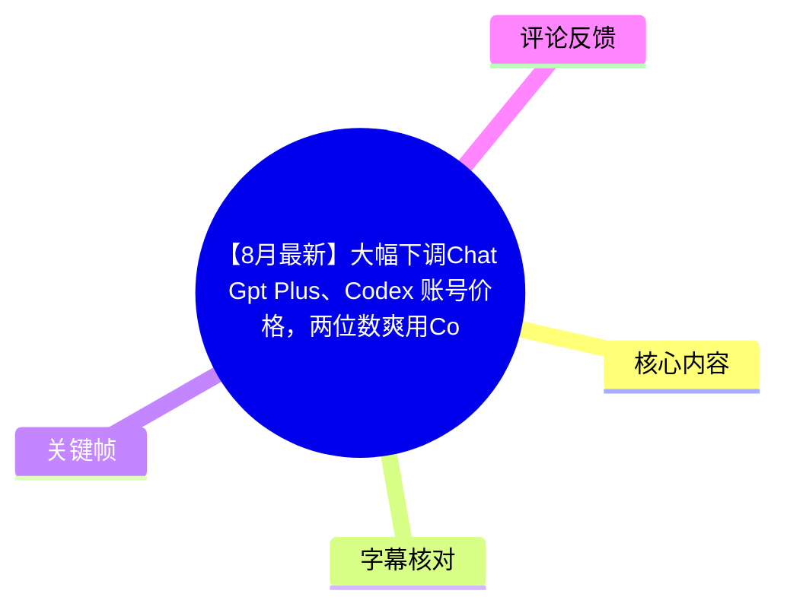
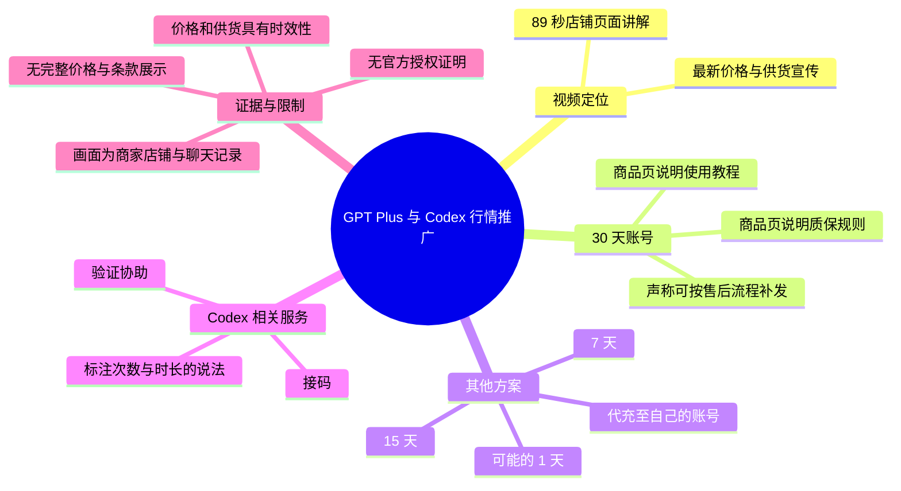
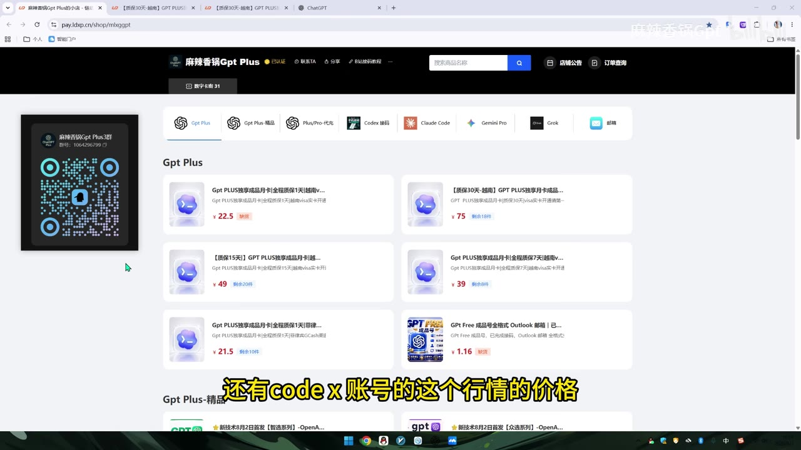
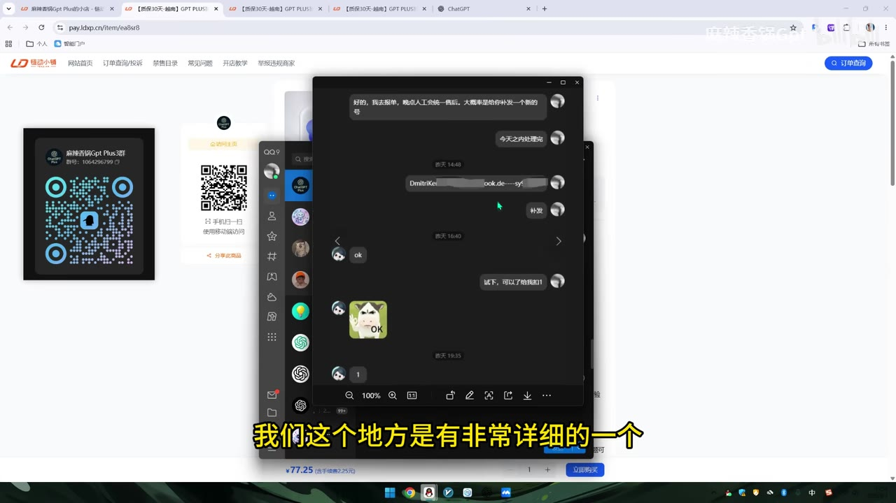
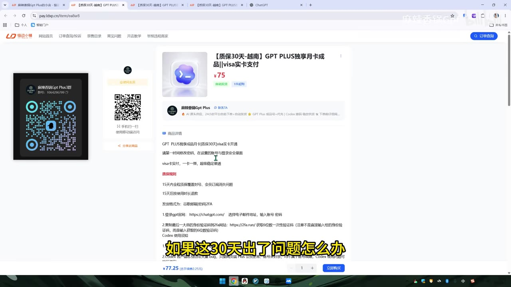

# 【8月最新】大幅下调Chat Gpt Plus、Codex 账号价格，两位数爽用Codex爽用纯血gpt 5.6-sol 模型

> 来源：[Bilibili 视频](https://www.bilibili.com/video/BV1wVMd6nEf1) 
> UP 主：麻辣香锅Gpt｜视频时长：89 秒｜分辨率：1920×1080  
> 视频简介称：8 月 3 日 GPT Plus、Codex 账号渠道恢复供货并“大幅度下调”价格，同时提供 QQ 群与店铺链接。本文仅整理视频中展示和口述的信息，不构成购买、代充或账号使用建议。

## 小结

视频是一则面向 GPT Plus 与 Codex 相关账号/服务的行情推广说明。UP 主在开头表示要分享“最新”的 GPT Plus、Codex 账号价格，并以店铺商品页展示不同期限商品；画面可见 30 天、15 天、7 天及更短期限的条目，但视频口播未逐一明确全部售价，也没有解释价格变化的外部原因。

重点介绍的是一个“30 天”账号商品。UP 主称商品页面会写明质保规则和使用教程；当账号在 30 天内发生问题时，可以按其售后流程反馈，口头承诺“当天反馈，基本上当天处理完”，并进行补发。该承诺属于发布者的销售与服务表述，不能据此推定实际处理时效、质保范围或补发一定可获得。

视频后半段列出更多选择：除 30 天外，还有 15 天、7 天、可能的 1 天方案，以及“代充到自己的账号”一类服务。UP 主主观称代充方案“目前是最稳定的”“无限趋近于官方正版”，并称已售出很多订单、无人反馈问题；这些均未给出订单记录、官方授权或独立验证材料，应与 OpenAI 官方订阅渠道区分看待。

UP 主还提及“接码 Codex”、协助验证等服务，并表示商品页会写明可用次数、使用方式与时长。视频没有展示完整的具体规则、限额、适用地区、退款条件、账号来源或服务合规性，因此不能从本视频推导出 Codex 的官方能力、模型版本或稳定性结论。标题中的“gpt 5.6-sol”等说法也未在口播和所给商品页画面中得到进一步技术说明或演示。

这是一条高度时效性的商业信息：视频简介标注为 8 月 3 日的渠道供货及降价情况，账号价格、库存、售后政策、平台条款与服务可用性均可能随时变化。对账号共享、第三方代充、验证码/验证辅助等事项，尤其需要自行核验服务条款、账号控制权、个人信息与支付风险。

## 思维导图

## 目录

- [视频背景与信息边界](#视频背景与信息边界-000001)
- [店铺页面与 30 天账号说明](#店铺页面与-30-天账号说明-000008)
- [售后与补发承诺](#售后与补发承诺-000023)
- [期限选项、代充与 Codex 验证服务](#期限选项代充与-codex-验证服务-000052)
- [关键帧索引](#关键帧索引)
- [结论、限制与时效性](#结论限制与时效性)
- [字幕比对](#字幕比对)
- [评论分析](#评论分析)
- [处理记录](#处理记录)

## 视频背景与信息边界 [00:00:01](https://www.bilibili.com/video/BV1wVMd6nEf1?t=1)

视频从约 1.42 秒开始有站内字幕，UP 主称将分享“最新的 GPT Plus 和 Codex 账号的行情价格”。本片主体不是对 ChatGPT、Codex 或模型能力的技术教程，而是展示一个第三方店铺中的商品与售后说明。

元数据简介称“8 月 3 日，Gpt Plus、Codex 账号价格大幅度下调，渠道恢复供货”。这是视频发布者提供的商业信息；素材中没有价格历史曲线、供货来源、官方公告或第三方市场数据，无法独立验证“下调幅度”“渠道恢复供货”的范围。

视频标题包含“两位数”“纯血 gpt 5.6-sol 模型”等营销性表述，但站内字幕、ASR 内容与现有关键帧均未对模型名称、模型版本、调用方式、上下文长度、速率限制或 Codex 的实际功能作出说明。因此，本文不将这些标题词视作已经在视频中证明的技术参数。

> 图：画面展示“Gpt Plus”分类下的多个商品卡片，能直接佐证视频是在浏览第三方店铺页面，并可看到不同商品/期限并存；它不能证明商品为官方服务或证明其长期可用。

## 店铺页面与 30 天账号说明 [00:00:08](https://www.bilibili.com/video/BV1wVMd6nEf1?t=8)

UP 主将“30 天”的账号称为最火爆的方案，并称页面写明了关键要素，包括：

1. **质保规则**：UP 主说商品页对质保规则有详细介绍。
2. **使用教程**：UP 主说页面提供使用教程。
3. **问题处理预期**：随后转入“30 天出了问题怎么办”的说明。

从商品详情画面可读到商品标题含“质保30天”“GPT PLUS 独享月卡”“Visa”等字样，页面还列有“质保规则”“15 天内全程质保覆盖封号、会员订阅消失问题”“15 天后按使用时长退款”等可见文本。由于截图文字较小、页面部分内容被字幕遮挡，且其可读条款与口播的“30 天”质保说法并不完全一致，不能将二者简单等同。应以购买时可见的完整条款为准。

> 图：该帧显示“质保30天”商品详情页、标价区域和规则正文，是核对“页面写明规则/教程”这一口播的关键视觉依据；同时也显示画面中的具体规则文字需要与口播分开理解。

### 可复核的展示与不可确认的部分

| 项目 | 视频中可确认的内容 | 视频未提供或无法确认的内容 |
| --- | --- | --- |
| 商品期限 | 口播提及 30 天，并在后文提及 15 天、7 天、1 天 | 各期限是否持续有货 |
| 商品页面 | 画面确有第三方店铺商品详情和规则区 | 条款全文、页面更新日期、适用地域 |
| 价格 | 画面可见若干商品卡片与价格数字 | “大幅下调”的基准价格、各服务最终成交价 |
| 服务属性 | UP 主称有质保、教程、售后 | 官方授权、账号来源、是否符合平台规则 |
| 模型能力 | 标题提到模型名称 | 模型实际版本、能力测试、Codex 配额与性能 |

## 售后与补发承诺 [00:00:23](https://www.bilibili.com/video/BV1wVMd6nEf1?t=23)

针对“30 天出了问题怎么办”，UP 主的口播流程为：

1. 用户在出现问题时向其反馈；
2. UP 主称有“非常详细”的售后流程；
3. 其承诺“当天反馈，基本上当天处理完”；
4. 处理结果为“给你进行一个补发”。

约 34.88 秒起，UP 主展示此前售后记录；约 41.82 秒表示记录“都是经过本人同意的”。画面为聊天窗口与疑似补发信息，能够说明视频作者以聊天记录作为售后案例，但不能证明所有订单均会得到同等处理，也不能替代完整售后协议。

> 图：聊天窗口覆盖在商品页面上，呼应“展示真实售后记录”的口播。画面中的部分账号/消息信息模糊或难以完整读取，因此只将其作为“作者展示过售后案例”的依据，不将其扩展为服务质量证明。

### 经验与风险提示

- **把口头承诺转为可留存证据**：若确需评估某项第三方服务，应优先查看下单页面中的质保期限、触发条件、补发/退款定义与联系方式，而不是只依据视频口播。
- **核对期限的矛盾**：本片口播围绕“30 天”说明问题处理，但商品详情画面可见“15 天内全程质保”等表述。期限、封号情形、订阅消失、退款或补发之间的对应关系，必须在交易前逐项确认。
- **保护账户与验证码**：第三方账号、代充或接码/验证服务可能涉及登录凭证、验证码与支付信息。视频没有给出安全隔离、数据删除或责任承担机制，不应向不可信主体提供敏感信息。
- **不要把案例当成普遍结果**：单个或少量聊天截图不能统计售后成功率、平均处理时长或争议率。

## 期限选项、代充与 Codex 验证服务 [00:00:52](https://www.bilibili.com/video/BV1wVMd6nEf1?t=52)

约 52.36 秒起，UP 主说明除 30 天账号外，还有 15 天、7 天、“可能说一天”的选择；随后提到可以“代充到你自己的账号上”。这是视频中列出的服务类型，而不是操作教程：视频未展示下单、充值、登录、绑定支付方式或验证的实际操作步骤。

UP 主对代充方案作出以下主观评价：

- “目前是最稳定的”；
- “无限趋近于官方正版”；
- “卖了很多单”；
- “没有一个人过来找我说有问题”。

这些均为发布者的自述，视频未提供订单量、采样窗口、投诉渠道、退款统计、官方认证或可验证的对照材料。尤其“趋近于官方正版”不是官方服务身份的证明；第三方代充与共享/转售账号的合规性、持续性和售后可执行性，需要以服务提供方和官方平台当前规则核验。

约 74.67 秒起，UP 主又提及“接码 Codex”、协助验证，称“不贵”，并称页面会写明：

- 可使用多少次；
- 怎么使用；
- 使用多长时间。

然而，视频没有给出具体次数、具体时长、价格、验证对象、是否需要用户提供手机号或验证码，也没有展示 Codex 的安装、调用、模型选择、代码生成或运行效果。因此可整理为“存在此类销售服务的宣传”，不能整理为可复现的 Codex 使用方案。

> 图：该帧将商品规则区与“如果这30天出了问题怎么办”的字幕同时呈现，有助于定位视频从商品说明转入售后说明的衔接点，也提示观众应核对页面实际条款与口播承诺是否一致。

## 关键帧索引

| 关键帧 | 对应内容 | 正文使用价值 |
| --- | --- | --- |
| `frames/frame-001.jpg` | GPT Plus 商品分类页与多张商品卡片 | 证明视频正在展示店铺商品列表，而非演示官方 ChatGPT/Codex 客户端。 |
| `frames/frame-002.jpg` | 30 天商品详情、价格与规则区域 | 用于核对“规则、教程、质保”在商品页中被提及。 |
| `frames/frame-003.jpg` | 商品详情与“30 天出问题怎么办”字幕 | 用于连接质保商品和售后议题。 |
| `frames/frame-004.jpg` | 聊天记录截图 | 用于说明 UP 主展示了售后案例，但不作为售后普遍有效的证据。 |

## 结论、限制与时效性

视频提供的核心信息不是 GPT Plus 或 Codex 的技术知识，而是第三方商家对不同期限账号、代充及验证辅助服务的推介。其可迁移的判断方法是：面对类似宣传，应分开记录**画面实际展示的商品信息**、**发布者的口头承诺**与**尚无独立验证的结论**。

本片没有给出完整价格表、完整售后条款、官方授权证明、账号来源、Codex 的具体技术参数，也没有演示标题所称模型。任何将视频中的“稳定”“官方正版”“无人反馈问题”等描述解释为客观质量保证的做法，均超出了素材证据范围。

时效性方面，视频简介将行情限定在“8 月 3 日”，视频总时长仅 89 秒，店铺页面、库存、价格、订阅政策与服务条款可能已变化。对于 GPT Plus、Codex 等产品，应优先查阅 OpenAI 官方页面与当前适用条款；对于第三方服务，应明确评估账号归属、个人信息、验证码、付款、封禁和售后不可兑现等风险。

## 字幕比对

| 字幕来源 | 完整性 | 专有名词 | 时间轴 | 主要问题 |
| --- | --- | --- | --- | --- |
| Bilibili 站内字幕 `p01-ai-zh.srt` | 覆盖约 00:00:01.420—00:01:28.440，分句细，基本覆盖整段口播 | 将 “GPT” 识别为“GB t”，但“codex”“代充”“接码 codex”等语义较清楚 | 逐句时间轴，可直接定位 | 个别词存在自动转写误差；未解释标题中的模型名 |
| 本次 ASR `large-v3-turbo` | 覆盖约 00:00:01.230—00:01:28.160；诊断语音覆盖率 95.1%，共 4 个长分段 | 有“gbtplus”“财号包装”“带充”“接码 Codex”等错词或断词 | 有时间戳，但每段跨度 13—24 秒，定位粒度较粗 | 文本未加标点、多个词误识别，难以单独作为精确引文来源 |

### 字幕选择与校正

最终以**站内字幕为主、本次 ASR 为交叉检查**。选择理由是站内 SRT 提供了 40 个较细的真实时间分段，适合生成章节时间轴；ASR 虽也带时间戳，但仅分为 4 段，且专有名词和短语错误更多。

本次 ASR 已实际检测到音频：识别时长为 88.468 秒、首段语音约在 1.23 秒开始、末段至 88.16 秒结束；提供的诊断中**没有** `noAudioStream=true` 标记。因此本片不是无音轨视频，未采用“无音轨”处理路径。

结合站内字幕、ASR 与关键帧，对正文作如下谨慎校正：

- “GB t / gbtplus”统一按上下文与商品页写为 **GPT Plus**。
- ASR 的“带充到你自己的财号包装之中”对应站内字幕的“**代充到你自己的账号上之中**”，正文采用“代充到自己的账号”。
- ASR 的“货币三加”对应站内字幕“**货比三家**”。
- “接码 Codex”保留为 UP 主口播的服务称呼；视频没有说明其技术实现或官方关系。
- 标题中的“gpt 5.6-sol”未被字幕与画面进一步解释，故不补写其能力或参数。

## 评论分析

仅获取到热评前三条，三条均为“111”，点赞数均为 0：

| 评论者 | 评论内容 | 可得信息与可信度判断 |
| --- | --- | --- |
| 再来yi舞 | `111` | 未表达对价格、服务、模型或售后的明确观点，不能构成产品反馈。 |
| Turium-- | `111` | 无补充事实、使用体验或争议信息。 |
| 守护最好的悯 | `111` | 无法据此判断赞同、质疑或购买意愿。 |

这些评论只表明评论区存在简短互动；由于没有实质内容，不能作为“服务可靠”“价格优惠”或“观众认可”的证据。

## 处理记录

- **Worker ID**：`worker-mrj0www4-e8d79408`
- **模型**：`gpt-5.6-terra`
- **ASR 模型与工具**：`large-v3-turbo`；输入音频为 `audio/audio.wav`，输出包括 `asr/transcript.srt`、`asr/asr-result.json`。
- **使用素材**：视频元数据、站内字幕 `p01-ai-zh.srt`、本次 ASR 结果、热评前三条、已提供关键帧 `frames/frame-001.jpg` 至 `frames/frame-004.jpg`。
- **字幕选择**：采用站内 SRT 的细粒度时间轴作为章节定位依据；本次 ASR 已检查并用于覆盖率、音频存在性与文字交叉校验。站内字幕与 ASR 的错词均已在“字幕比对”中说明。
- **关键帧选择依据**：选择商品列表、30 天商品详情、售后议题字幕和聊天记录四类画面，分别支撑商品展示、规则说明与售后案例；未把模糊聊天记录或店铺页面延伸解释为官方授权或服务保证。
- **缓存清理**：本次整理仅引用任务提供的相对素材路径，未生成或保留额外下载文件；未报告需进一步清理的缓存。
- **未解决问题**：未提供完整店铺条款、价格历史、订单统计、官方授权证明、账号来源、实际模型演示及 Codex 服务参数；上述内容均无法由本视频素材确认。
