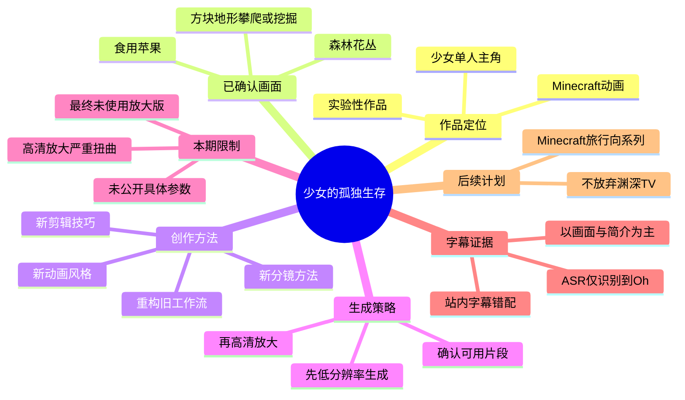
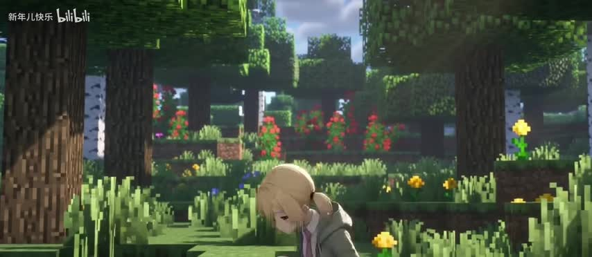
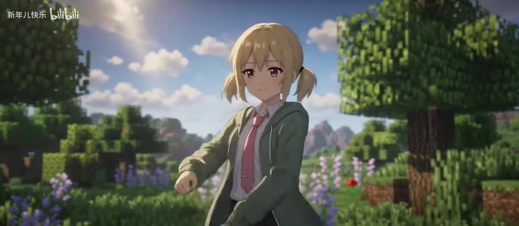
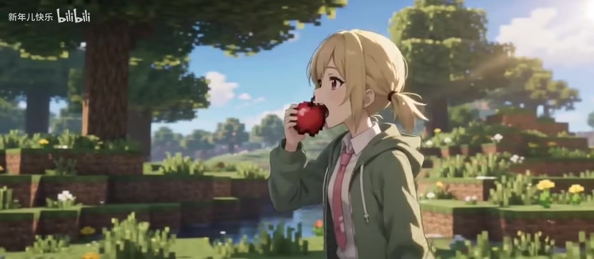
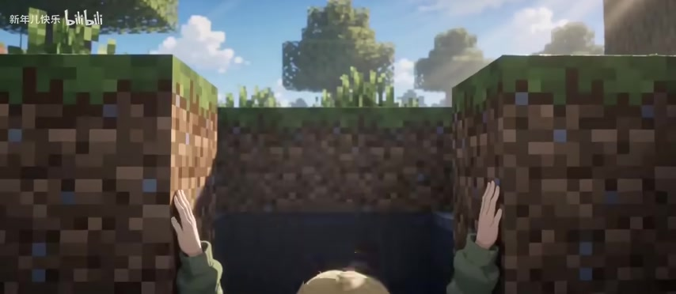

# 『Minecraft动画』EP.1少女的孤独生存

> 来源：[Bilibili 视频](https://www.bilibili.com/video/BV1XL5z6iEx5)  
> UP 主：新年儿快乐｜时长：06:08｜画面规格：992×432  
> 标签：动画、我的世界、少女、可爱、沙盒游戏、AI、Minecraft、seedance 2、像素风  
> 数据抓取时间：2026-07-16；当时播放 568,622、点赞 49,948、收藏 31,202、投币 16,172、分享 3,600、评论 1,625。

## 小结

这是一支以《Minecraft》方块世界为视觉场景、以金发少女为主角的实验性动画短片。视频标题指向“少女的孤独生存”，而现有关键帧可直接确认的画面包括：少女独自在森林与花丛间活动、食用苹果，以及在方块地形中向下攀爬或挖掘。

创作者在视频简介中说明，本期重点不是讲解游戏玩法，而是一次动画制作实验：尝试了新的动画风格，并参考“渊深TV”学习内容，推翻过去的工作流，实践新的剪辑技巧和分镜方法。后续计划将 Minecraft 作品做成偏“旅行向”的系列，同时不会停止“渊深TV”相关创作。

技术层面最重要的信息是其生成与发布策略：先生成低分辨率视频，确认片段可用后再进行高清放大；但本期低清成片在高清放大后出现严重扭曲，因此最终发布的是**未经过高清放大的版本**。创作者将这一结果视为画质妥协，尤其认为它不符合“可爱美少女 Minecraft 生活”题材对角色稳定性的要求。

这份整理不能把站内字幕当作视频内容依据：站内 SRT 实际是济南烧烤访谈，与本片题材、画面和标题完全不符；本次 ASR 仅在 00:00:08.300—00:00:08.640 识别到一句英文“​​Oh”，语音覆盖率仅 0.09%。因此，正文以视频元数据、创作者简介、ASR 的唯一可靠时间锚点和关键帧画面为依据，不补写未经素材证实的剧情、对白、Minecraft 具体配方或生成模型参数。

适合希望了解 AI 动画制作取舍、角色一致性与高清放大风险的创作者阅读；若需要完整剧情、镜头逐秒解读或可复现的工作流参数，当前素材不足以支持，需以原视频及创作者后续说明为准。

## 思维导图

## 目录

- [作品定位与证据边界](#作品定位与证据边界-000008)
- [画面中的少女与 Minecraft 场景](#画面中的少女与-minecraft-场景-000008)
- [创作者披露的工作流与技术取舍](#创作者披露的工作流与技术取舍-000008)
- [可迁移的制作经验与限制](#可迁移的制作经验与限制-000008)
- [时效性与数据说明](#时效性与数据说明-000008)
- [字幕比对](#字幕比对-000008)
- [评论分析](#评论分析-000008)
- [处理记录](#处理记录-000008)

## [作品定位与证据边界](https://www.bilibili.com/video/BV1XL5z6iEx5?t=8) [00:00:08]

### 标题、分 P 名称与题材

视频主标题为“『Minecraft动画』EP.1少女的孤独生存”；单 P 名称为“『Minecraft世界冒险』EP.1可爱少女的悠闲生存”。两者共同确认：

- 作品属于 Minecraft 主题动画；
- 这是编号为 EP.1 的系列起点；
- 主角定位为“少女”；
- 标题使用“孤独生存”与“悠闲生存”两种描述，但当前素材无法判断二者是叙事上的阶段差异，还是不同标题文案；
- 不能据此扩展出具体生存目标、敌对生物、建造内容、地图种子或任务流程。

### 唯一可直接使用的本次 ASR 时间锚点

本次 ASR 结果只有一条：

| 时间 | 识别文本 | 证据状态 |
| --- | --- | --- |
| 00:00:08.300—00:00:08.640 | `Oh` | ASR 直接识别；语义不足以支撑剧情判断 |

章节链接统一使用 8 秒，是因为这是一份本次 ASR 明确提供、可复核的真实时间点。其余关键帧虽按文件序号提供，但素材未附带各帧的提取时间，不能将它们强行标注为某一秒，也不能依文字顺序臆测剧情时间轴。

## [画面中的少女与 Minecraft 场景](https://www.bilibili.com/video/BV1XL5z6iEx5?t=8) [00:00:08]

### 森林中的单人角色

> 图：该帧可见一名金发少女置身于 Minecraft 风格的树林、草地和花朵之间。它是确认“少女主角”与“方块自然环境”视觉融合方式的直接证据，也呈现了角色独自出现的画面构图。

关键帧中，角色为金色双马尾或侧分束发的二次元风格少女，穿着带兜帽的绿色外套、白衬衫和粉色领带。背景的树木、草方块、泥土方块与花卉采用 Minecraft 的方块形态，但角色本身具有较平滑的动画人物造型。该组合与视频标签中的“AI”“像素风”“Minecraft”相符。

需要注意：“孤独”是标题中的描述；关键帧只足以表明画面中未见其他人物，不能据此推断角色没有同伴、没有旁白，或整个 368 秒都处于独处状态。

### 角色动作与生活化意象

> 图：角色在明亮的树林背景前面对镜头，服装、发型和表情更清晰。该帧有助于观察本片以二次元角色置入 Minecraft 世界的角色设计方向。

> 图：角色手持并食用红色苹果，背景仍为方块化草地、树木和水边环境。苹果是 Minecraft 中具有代表性的食物意象；此处只能确认画面表现了进食动作，不应延伸为游戏内饥饿值、食物回复数值或实际合成/采集步骤。

这些画面共同呈现一种日常、明亮、偏可爱化的生存氛围。结合创作者简介中“主打可爱美少女 mc 生活”的表述，可以确认“可爱少女的 Minecraft 日常视觉体验”是创作者明确提到的目标；但“旅行向”是后续系列计划，不能直接断言本期已呈现完整旅行叙事。

### 方块地形中的移动或挖掘

> 图：画面以第一人称或近景方式呈现角色双手抓住两侧泥土方块，中央是向下的暗部空间。该帧直接体现了 Minecraft 方块地形与角色动作的结合，适合说明“生存”题材中地形探索的视觉表达。

该帧可确认以下视觉信息：

1. 两侧是带草皮的泥土方块；
2. 角色双手位于方块边缘；
3. 镜头中央存在较暗的下方空间；
4. 画面可能表现攀爬、下探或挖掘后的坑洞边缘。

由于没有对应的画面时间戳、连续片段和可用叙事字幕，不能把该场景确定为“挖矿”“进入洞穴”“逃生”或某种特定 Minecraft 机制。

## [创作者披露的工作流与技术取舍](https://www.bilibili.com/video/BV1XL5z6iEx5?t=8) [00:00:08]

### 本期的创作实验

根据视频简介，创作者明确说明本片是“实验性作品”，其工作重点包括：

- 实践新的动画风格；
- 参考从“渊深TV”学习到的内容；
- 推翻过去的工作流；
- 实践新的剪辑技巧；
- 实践新的分镜方法。

这说明视频的知识价值主要在于创作流程的转型，而不是提供一个已经公开的、固定可复刻的技术教程。简介没有给出所用软件版本、提示词、采样器、帧率、分辨率数值、放大模型、显存占用、成本明细或剪辑工程结构，因此这些参数均不能补全。

### 已披露的生成—筛选—放大流程

创作者描述的策略可按其原意整理为：

1. **先生成低分辨率视频**：以较低分辨率完成初始视频生成。
2. **确认片段是否可用**：从低分辨率结果中筛选“合适的片子”。
3. **对合适片段进行高清放大**：意图是在筛选后才投入高清处理。
4. **根据成片质量决定发布版本**：本期放大后质量不可接受，最终转用未高清放大的低分辨率版本发布。

该策略的目标是节省成本。创作者的具体判断是：当 “sd2” 出现明显“降智”时，先低分辨率生成、后筛选再放大，有助于避免在不合格片段上消耗更多资源。这里“sd2”出现在创作者简介中，但未进一步定义其完整产品名称、版本或工作模式，故不能将其等同于某一确定模型版本。

### 本期失败点：高清放大后的扭曲

本片的关键技术问题并非原始低分辨率生成不可用，而是：

- 低分辨率视频完成后；
- 高清放大版本出现“严重的扭曲错误问题”；
- 创作者认为这一问题对以可爱美少女为主的作品不可接受；
- 经权衡，发布未经过高清放大的版本。

这体现的不是“高清一定更好”，而是角色驱动型视频需要优先检查放大链路是否破坏人物。对于角色脸部、发型、肢体、服装边缘和连续动作而言，分辨率提升若伴随几何变形或身份不稳定，会直接损害观看体验。

## [可迁移的制作经验与限制](https://www.bilibili.com/video/BV1XL5z6iEx5?t=8) [00:00:08]

### 可以迁移的经验

在不超出创作者原始披露范围的前提下，本片可提炼出以下流程经验：

| 环节 | 可迁移做法 | 本片依据 |
| --- | --- | --- |
| 生成资源分配 | 先用低分辨率验证片段可用性，再决定是否投入更高成本的后续处理 | 创作者明确说明先低清生成、筛选后高清放大 |
| 质量评估优先级 | 对人物主导型动画，角色稳定性应高于单纯分辨率指标 | 创作者因角色扭曲而放弃高清放大版 |
| 成片发布决策 | 当增强链路造成明显视觉缺陷时，可保留更低清但更稳定的原始版本 | 本期最终采用未放大版本 |
| 制作迭代 | 可将新风格、剪辑和分镜安排放在实验性单集内验证 | 创作者将本期定义为实验性作品 |
| 系列发展 | 单集试验可作为后续系列方向的探索基础 | 创作者计划将 Minecraft 作品继续做成旅行向系列 |

### 不应误读为“完整教程”的部分

以下信息在素材中没有出现，不能据此制作操作教程或给出确定性结论：

- 未披露低分辨率与目标高清分辨率的具体数值；
- 未披露视频生成模型、放大模型、工作节点或模型版本；
- 未披露提示词、参考图、角色 LoRA、ControlNet、种子值或工作流文件；
- 未披露“严重扭曲”的具体发生率、触发条件和修复尝试；
- 未披露本片帧率、镜头数量、剪辑软件或分镜脚本；
- 未披露 Minecraft 游戏版本、模组、地图种子或是否存在真实游戏录制；
- 未披露“sd2 降智”这一观察的实验方法或可重复测量标准。

因此，最稳妥的实际应用是把“低成本预览—筛选—增强—复核”视为质量控制框架，而不要把它误认为某个特定 AI 工具的官方最佳实践。

## [时效性与数据说明](https://www.bilibili.com/video/BV1XL5z6iEx5?t=8) [00:00:08]

### 创作计划的时效性

创作者表示“接下来想把这个 mc 的作品作为一个旅行向的系列做下去”，同时“不会放弃渊深TV”。这是发布时的创作意向，不等同于后续每一集已制作完成或一定按该方向发布。系列是否更新、形式是否改变，应以 UP 主后续动态为准。

### 数据与技术判断的时效性

- 页面互动数据为抓取时快照，播放、点赞、收藏、评论等会持续变化。
- 创作者关于“sd2”在不同时间段可能有不同“智力”表现的说法，属于其个人观察，不是经公开实验验证的稳定规律。
- 生成式视频与高清放大工具的模型能力、价格、服务状态和输出稳定性变化很快；本片发布时的失败经验仍具质量控制价值，但不应直接外推到所有后续版本。
- 作品发布于 2026-05-16；数据抓取于 2026-07-16。本文不将抓取后的平台变化、更新或评论增长反写入视频内容。

## [字幕比对](https://www.bilibili.com/video/BV1XL5z6iEx5?t=8) [00:00:08]

| 字幕来源 | 完整性 | 专有名词/题材一致性 | 时间轴 | 主要问题 |
| --- | --- | --- | --- | --- |
| Bilibili 站内字幕 `p01-ai-zh.srt` | 覆盖约 00:00:00—00:04:07，但未覆盖全片 06:08 | 严重不一致：内容为济南烧烤、厦门、羊肉串等，与本片 Minecraft 少女动画不符 | 时间段格式完整、可直接解析，但属于错配内容 | 明显来自另一支烧烤访谈视频，不能用于本片叙事 |
| 本次 ASR `medium` | 极低：仅 0.34 秒语音、1 条片段 | 仅识别到 “Oh”，无法确认剧情、角色或技术信息 | 有真实时间戳：00:00:08.300—00:00:08.640 | 自动语言判定为英语，置信度 0.4448；语音覆盖率 0.0009，诊断提示可能为音乐、静音、错误音轨或识别不完整 |

### 最终字幕与证据选择

本次 ASR 已被检查。其结果**没有**标记 `noAudioStream=true`，因此不能称源视频没有音轨；素材清单也提供了 `audio/audio.wav`。但 ASR 只识别到“​​Oh”，无法形成可用的叙事转写。

站内字幕虽然拥有大量时间段，却与标题、画面和元数据完全矛盾。例如它提到“济南烧烤”“羊肉串”“厦门”等，故判定为错配字幕，不纳入正文事实。

最终采用的证据优先级为：

1. 视频标题、分 P 名称、标签与元数据；
2. UP 主在简介中直接披露的创作流程和发布决策；
3. 本次 ASR 的唯一时间锚点 00:00:08.300—00:00:08.640；
4. 四张可见关键帧提供的多模态画面证据。

关键帧所校正或补充的信息包括：本片确为 Minecraft 方块自然环境与二次元少女角色结合的动画；出现苹果进食和方块地形边缘动作。由于关键帧没有各自的原始时间戳，不对这些视觉事件标注精确秒数。

## [评论分析](https://www.bilibili.com/video/BV1XL5z6iEx5?t=8) [00:00:08]

仅处理可获取的热评前三条。评论反映观众感受，不视作已验证的制作事实或剧情证据。

| 热评 | 点赞数 | 观点概括 | 可提供的信息与可信度 |
| --- | ---: | --- | --- |
| 沉日笙笛：“真好啊。。” | 3,446 | 直接表达正面观感 | 说明该评论者对作品有强烈好感，但未说明具体喜欢画面、角色、音乐还是叙事，信息量有限。 |
| 洛逸飞_：“我在这里留一张图，说不定能唤起谁的童年回忆[doge]” | 2,386 | 将作品与童年回忆联系 | 可看出作品可能触发了该用户对 Minecraft 或相关视觉文化的怀旧联想；“留一张图”所指图片未在提供素材中附带，不能判断其具体内容。 |
| After_A11：“美少女干啥都有人看系列” | 1,753 | 以“美少女”主角吸引力概括观看动机 | 与标题和关键帧中的少女角色相呼应，反映角色设定可能是观众关注点之一；该说法是调侃性评价，不可用于证明实际受众结构或播放增长原因。 |

三条热评整体呈现积极、轻松的观众氛围，未提供关于生成工具、画质问题或剧情细节的可核验补充信息。

## [处理记录](https://www.bilibili.com/video/BV1XL5z6iEx5?t=8) [00:00:08]

- **Worker ID**：`worker-mrj0www4-e8d79408`
- **整理模型**：`gpt-5.6-terra`
- **ASR 模型与运行信息**：`medium`；CUDA；`float16`；自动语言识别为英语，语言置信度 `0.44482421875`。
- **使用素材工具产物**：`merged.mp4`、`audio/audio.wav`、`asr/transcript.srt`、`asr/asr-result.json`、站内字幕 `p01-ai-zh.srt`、关键帧目录 `frames/`、热评数据 `comments/comments.json`。
- **字幕选择**：检查了站内字幕和本次 ASR。站内字幕内容与本片严重错配，予以排除；ASR 仅有 00:00:08.300—00:00:08.640 的“​​Oh”，仅作为时间锚点使用。正文以视频简介、元数据与关键帧多模态信息为主。
- **关键帧选择依据**：选用 `frame-001.jpg` 至 `frame-004.jpg`，分别用于证明森林中的单人少女、角色造型、苹果进食动作和方块地形边缘动作；未将未提供时间信息的关键帧伪造为精确时间点。
- **缓存清理**：未提供缓存清理命令或执行结果，无法确认是否已清理；本记录不将其表述为已完成。
- **未解决问题**：
  - 无可用、与视频内容一致的完整字幕；
  - ASR 覆盖率极低，无法恢复对白或旁白；
  - 关键帧缺少原始提取时间；
  - 未公开模型、分辨率、放大工具、提示词及工作流参数；
  - 无法仅凭现有素材复原完整剧情或逐镜头时间轴。

## 评论分析

- 热评 1：真好啊。。
- 热评 2：我在这里留一张图，说不定能唤起谁的童年回忆[doge]
- 热评 3：美少女干啥都有人看系列

以上内容是观众反馈摘录，只用于补充理解视频反响，不作为正文事实依据。
