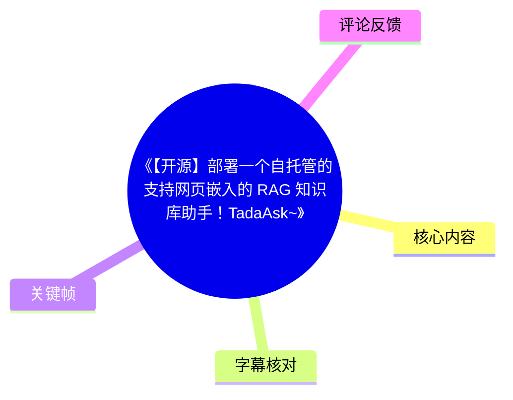
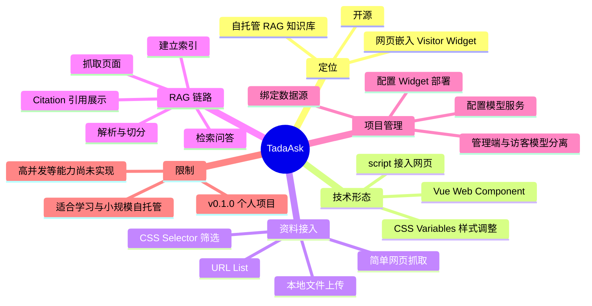
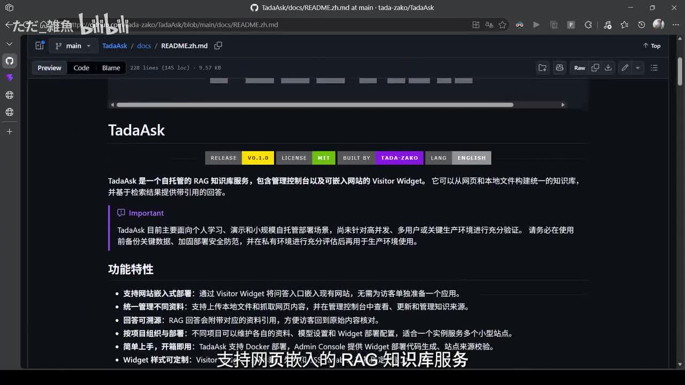
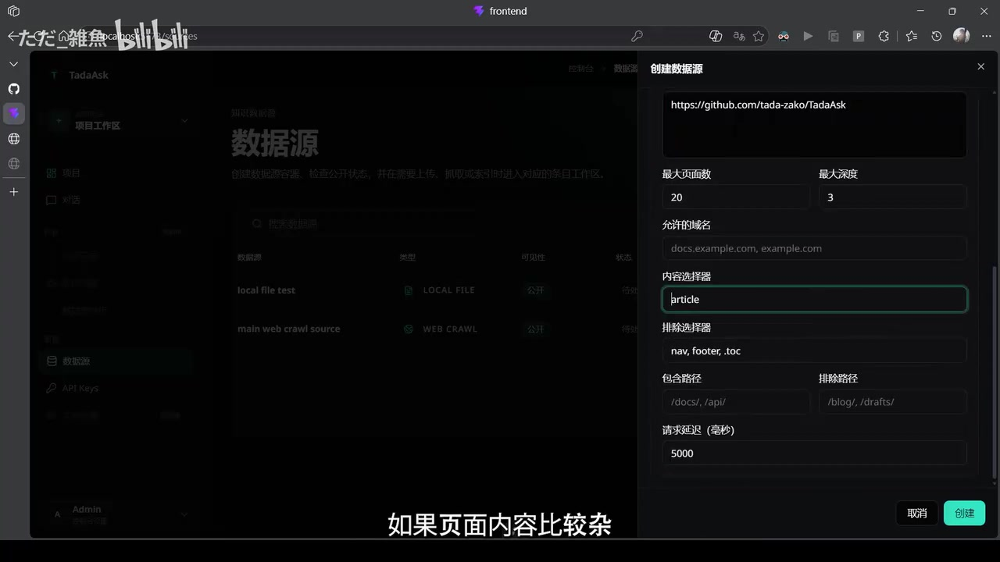
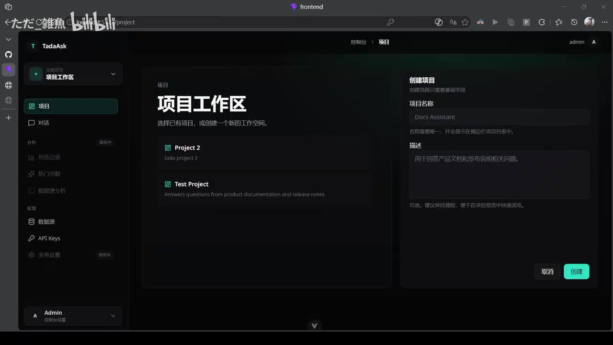
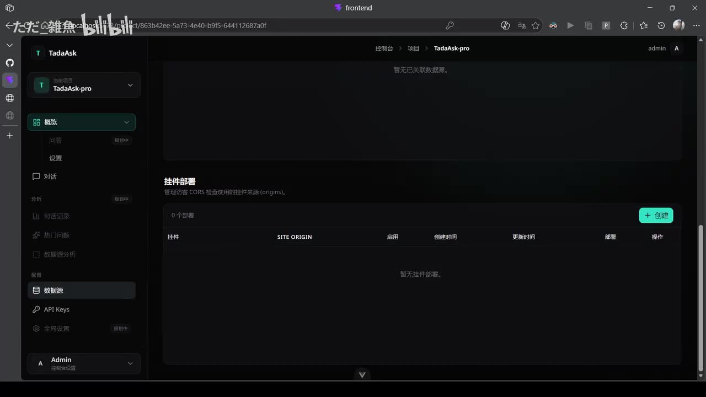

# 《【开源】部署一个自托管的支持网页嵌入的 RAG 知识库助手！TadaAsk~》

> 来源：[Bilibili 视频](https://www.bilibili.com/video/BV15kKm6rEgt)  
> UP 主：ただ_雑魚｜视频时长：04:00｜合集：AIcode  
> 项目地址：[GitHub：tada-zako/TadaAsk](https://github.com/tada-zako/TadaAsk)

## 小结

TadaAsk 是 UP 主开源的自托管 RAG（检索增强生成）知识库服务。它的核心目标不是单独提供一个后台问答页，而是把本地文件或网页内容整理为知识库后，通过可嵌入网页的 Visitor Widget，为文档站、个人博客等站点提供面向访客的问答入口。

视频展示了一条完整但偏基础的操作链路：创建网页抓取型数据源、配置 URL 列表与 CSS 选择器筛选、同步抓取并解析切分建立索引、在 Global Chat 中进行 RAG 问答和查看 Citation 引用，最后在项目中绑定资料来源、设置访客 Widget 的默认模型并复制嵌入代码。

项目的网页嵌入设计强调兼容性：Widget 是基于 Vue 的 Web Component；按视频说法，只要目标网页能插入一段 `<script>`，无论是 Vue、React、静态 HTML 还是手写页面，理论上都可以接入。Widget 的颜色、字号和位置还能通过 CSS Variables 调整。

需要特别注意其成熟度边界：视频明确定位当前版本为 **v0.1.0 的个人开源项目**，适合个人学习、作品展示和小规模自托管；高并发、多管理员、复杂任务队列等能力仍在未来计划中。因此，不能据此将其视为已经面向大规模企业生产场景验证完成的 SaaS。

本视频反映的是发布时点的项目状态。网页抓取能力、可支持的数据源类型、模型服务配置方式、部署方法及后续路线图，都可能随仓库版本迭代而变化；实际接入前应以项目 README、部署文档和当前版本配置为准。

## 思维导图

## 目录

- [项目定位与网页嵌入机制](#项目定位与网页嵌入机制-0000)
- [资料来源创建与网页抓取参数](#资料来源创建与网页抓取参数-0047)
- [同步、索引与 RAG 问答](#同步索引与-rag-问答-0119)
- [项目配置与访客 Widget 部署](#项目配置与访客-widget-部署-0155)
- [适用范围、样式调整与限制](#适用范围样式调整与限制-0246)
- [实践步骤清单](#实践步骤清单-0047)
- [字幕比对](#字幕比对-0000)
- [评论分析](#评论分析-0000)
- [处理记录](#处理记录-0000)

## 项目定位与网页嵌入机制 [00:00](https://www.bilibili.com/video/BV15kKm6rEgt?t=0)

视频开头介绍项目名称为 **TadaAsk**。UP 主将其定义为可自行部署、支持网页嵌入的 RAG 知识库服务。

其工作方式可概括为：

1. 将本地文件或网页资料上传／接入 TadaAsk；
2. 系统将资料整理为知识库；
3. 在自己的网页中嵌入一个 Widget；
4. 网站访客通过 Widget 提问；
5. Widget 基于所绑定知识库进行检索后回答。

视频口述指出，项目主体由 API 服务与 Vue 构成，Widget 则是基于 Vue 开发的 Web Component。站内字幕将 API 框架识别为“cs API”，本次 ASR 识别为“SizedABI”，两者对该专有名词均不可靠，因此本文不据此扩展或确认具体 API 框架名称；但“Vue”与“Web Component”的信息在两份字幕中一致。

网页端的兼容性判断是：只要页面能够插入一段 `script`，理论上即可接入 Widget。视频列举的页面类型包括 Vue、React、静态 HTML，以及手写的传统页面；这属于作者对 Widget 接入条件的说明，不等同于对所有前端框架、CSP 策略或复杂站点环境的全面兼容性承诺。

> 图：该帧展示 GitHub README 中文页面中的 TadaAsk 标题、`v0.1.0`、MIT 标识及功能说明。它可作为“自托管 RAG 服务、支持网站嵌入、带引用回答”的画面依据，并直观提示版本仍处于早期。

## 资料来源创建与网页抓取参数 [00:47](https://www.bilibili.com/video/BV15kKm6rEgt?t=47)

视频说明，当前支持两类资料接入：

- **本地文件上传**；
- **简单网页抓取**。

演示采用的是网页抓取（Web Crawl）类型的数据源创建流程。此时“暂时只支持 URL List”，即视频所演示的抓取入口以 URL 列表为基础，而非展示一个任意站点自动发现的完整配置流程。

示例使用了 TadaAsk 自己的 GitHub 仓库页面。对于页面内容较杂的情况，作者建议使用 **Selector（选择器）** 做筛选，以减少无关内容进入后续知识库处理。

画面中可见的网页抓取配置字段和示例参数如下：

| 配置项 | 画面可见值／含义 |
| --- | --- |
| 起始地址 | `https://github.com/tada-zako/TadaAsk` |
| 最大页面数 | `20` |
| 最大深度 | `3` |
| 允许的域名 | 输入框示例为 `docs.example.com, example.com` |
| 内容选择器 | `article` |
| 排除选择器 | `nav, footer, toc` |
| 包含路径 | 示例为 `/docs/, /api/` |
| 排除路径 | 示例为 `/blog/, /drafts/` |
| 请求延迟（毫秒） | `5000` |

上述参数来自演示界面可见内容。视频没有解释每个参数的默认值、边界条件、抓取失败重试机制或实际生产推荐值，因此不能将这些显示值视为通用最佳实践。尤其是“最大页面数 20、最大深度 3、5000 毫秒延迟”只应理解为该演示配置。

> 图：该帧清楚呈现 Web Crawl 数据源的 URL、最大页面数、最大深度、选择器、路径过滤及请求延迟等配置，是理解“通过选择器控制知识库网页语料范围”的关键画面证据。

创建完成后，每一个抓取到的页面会成为一个 **Source Page**。用户可在数据源界面查看其来源状态，以及页面后续是否已经成功进入知识库。

## 同步、索引与 RAG 问答 [01:19](https://www.bilibili.com/video/BV15kKm6rEgt?t=79)

资料来源创建后，需要执行一次同步。按视频描述，TadaAsk 会依次完成：

1. 抓取网页内容；
2. 解析内容；
3. 切分文本；
4. 建立索引。

之后进入 **Global Chat**，可直接选择已创建的知识库进行 RAG 问答。视频用“什么是 TadaAsk”作为提问示例，系统会先从资料中检索，再组织回答。

这一区别于直接让大模型脱离资料回答：视频强调其回答基于已创建的资料来源。不过，视频未展示具体检索分数、召回数量、切分策略、嵌入模型、重排序、上下文窗口、幻觉控制或答案质量评测，因此无法从素材判断其检索效果和准确率。

在回答之后，用户还能展开 **Citation**，查看该回答具体参考了哪些内容。引用展示构成了视频所称“资料接入—索引—检索问答—引用展示”闭环的一部分，可用于追溯回答依据；但视频没有展示引用链接的精确格式、跳转行为或引用正确率。

## 项目配置与访客 Widget 部署 [01:55](https://www.bilibili.com/video/BV15kKm6rEgt?t=115)

完成数据源准备后，视频进入创建好的 Project（项目）管理端。这里可以配置：

- 项目资料来源；
- 模型服务；
- Widget 部署。

操作顺序为：先将此前创建的资料来源绑定到项目，再新建一个 Widget 部署配置。画面中项目工作区提供了项目列表与创建项目表单，表单包含项目名称和描述；这表明项目是组织资料与部署配置的工作单元。

> 图：该帧展示“项目工作区”中的项目列表和右侧创建项目表单，说明视频不是直接在单一知识库页面操作，而是先以 Project 作为后续资料、模型和部署配置的承载对象。

在正式部署 Widget 前，作者特别指出，需要在 **Project Settings** 中为“访客侧 Widget”配置默认模型。这样可使：

- 管理端自身进行操作、调试或问答时所用的模型；
- 网站访客通过 Widget 实际调用的模型；

分开配置。视频没有进一步给出模型供应商、模型名称、密钥配置方式、计费归属、并发限制或访客调用鉴权方案，因此仅能确认这种模型角色分离的设计意图，不能推断其完整安全策略。

随后，管理端会提供嵌入代码，用户将其复制并粘贴到目标网页。视频没有完整展示代码文本，因而不能从本素材补写具体标签属性、脚本地址、初始化参数或域名白名单写法。

> 图：该帧显示项目侧的“挂件部署”区域、创建按钮及 Site Origin（站点源）字段列，说明 Widget 部署与允许接入的站点来源存在配置关系；画面未显示具体已填写的域名或最终嵌入代码。

## 适用范围、样式调整与限制 [02:46](https://www.bilibili.com/video/BV15kKm6rEgt?t=166)

作者表示，粘贴嵌入代码后，网页“理论上”就会拥有一个根据资料回答问题的小助手。这里的“理论上”是作者主动保留的边界：TadaAsk 只是 **v0.1.0 的个人项目**，并非已经融资、面向大量企业服务的成熟 SaaS。

视频给出的当前适用场景是：

- 个人学习；
- 作品展示；
- 小规模自托管；
- 文档站；
- 个人博客；
- 希望为网站增加知识库问答入口的站点。

Widget 支持通过 **CSS Variables** 调整：

- 颜色；
- 字体尺寸；
- 位置。

这意味着它可在一定程度上减少与个人网站既有视觉风格的冲突。但视频没有给出变量名、默认值、可调整范围、响应式表现或深度主题适配方案，因此不能直接据此编写具体 CSS 配置。

作者明确说明，下列能力仍处于未来计划中：

- 高并发；
- 多管理员；
- 复杂任务队列。

因此，部署决策应建立在真实需求上：若站点面临大量并发访客、多角色管理、复杂且长期运行的异步抓取／索引任务，视频本身已提示当前版本尚不应被视作完成验证的解决方案。README 画面也提示应先备份关键数据、加固部署安全防护，并在充分评估后再用于生产环境。

截至视频所述版本，作者认为已经完成的链路是：**资料接入、索引、检索问答、网站嵌入、引用展示**。项目刚开源，作者没有承诺成熟度或解决大问题的能力，并邀请用户试用、提交 Issue 和 Star。

## 实践步骤清单 [00:47](https://www.bilibili.com/video/BV15kKm6rEgt?t=47)

以下按视频实际演示顺序整理；仅保留素材可确认的步骤，不补充未出现的命令或部署细节。

1. **准备资料来源**
   - 可选择本地文件上传，或创建简单网页抓取数据源。
   - 视频演示的是 Web Crawl 数据源。

2. **填写 URL List 并限制抓取范围**
   - 将目标 URL 加入列表；演示使用 TadaAsk GitHub 仓库页面。
   - 页面复杂时，使用内容选择器筛选主体内容。
   - 可见配置中，`article` 用于内容选择器，`nav, footer, toc` 用于排除导航、页脚和目录等内容。
   - 按需求配置最大页面数、抓取深度、允许域名、路径包含／排除规则和请求延迟。

3. **创建数据源并检查页面状态**
   - 创建后，被抓到的每个页面成为 Source Page。
   - 查看来源状态，并确认页面是否成功进入知识库。

4. **执行同步**
   - 触发同步后，系统抓取网页内容。
   - 系统对内容进行解析、切分与索引建立。

5. **在 Global Chat 验证问答**
   - 使用已创建的知识库进行 RAG 问答。
   - 可提出与资料内容相关的问题，例如视频中的“什么是 TadaAsk”。
   - 展开 Citation，核查回答参考了哪些内容。

6. **创建或进入 Project**
   - 在项目管理端管理资料来源、模型服务和 Widget 部署。
   - 将准备好的资料来源绑定到目标项目。

7. **为访客 Widget 配置默认模型**
   - 在 Project Settings 中设置访客侧 Widget 所使用的默认模型。
   - 保持其与管理端所使用模型可分离配置。

8. **创建 Widget 部署并嵌入网页**
   - 新建 Widget 部署配置。
   - 复制管理端提供的嵌入代码，粘贴至目标网页可执行脚本的位置。
   - 视需要用 CSS Variables 调整颜色、字号和位置。

> 重要缺口：素材没有给出 Docker 命令、环境变量、数据库／向量库依赖、模型服务 URL、API Key 配置、反向代理、HTTPS、跨域策略或可直接复制的 Widget 代码。因此这些内容必须查阅仓库当前文档，不能由本视频反推。

## 字幕比对 [00:00](https://www.bilibili.com/video/BV15kKm6rEgt?t=0)

| 字幕来源 | 完整性 | 专有名词 | 时间轴 | 主要问题 |
| --- | --- | --- | --- | --- |
| Bilibili 站内字幕 | 覆盖从 00:00:00.240 到 00:03:58.520，分段细，基本覆盖全片口述 | TadaAsk、Vue、React、HTML、GitHub、Global Chat、Citation、Project Settings、CSS Variables 等多数可辨；部分词明显误识别 | 时间粒度细，可直接定位操作环节 | 将 Widget、RAG、Web Crawl、URL List、Source Page、Selector 等多处识别为近音词，如“wig”“机器库”“web crow”“source patter” |
| 本次 ASR 字幕 | 覆盖 00:00:00.110 至 00:03:58.300；诊断显示语音覆盖约 80.55%，存在两段主要画面／停顿间隙 | 可识别 TadaAsk、Vue、React、HTML、GitHub、Citation、Project、CSS Variables；API 框架名失真明显 | 有时间戳，但每段较长，不如站内字幕便于精细定位 | 将“网页嵌入”识别成“网页切入”，并将 Widget、Web Crawl、Selector、Source Page、RAG 等识别错误或不稳定 |

本次素材中 `asr-result.json` **未标记** `noAudioStream=true`；相反，ASR 诊断确认音频时长约 239.488 秒、识别语言为中文、语言置信度约 0.966，因此源视频存在可识别音轨，不属于无音轨视频。

最终采用策略为：**以站内 SRT 的细粒度时间轴作为章节定位依据，以本次 ASR 交叉检查语音覆盖和口述内容，并用关键帧修正界面术语。** 主要校正包括：

- “机器库”统一校正为“知识库”；
- “wig / widgit / WJ”等近音识别，按项目语境统一为 **Widget**；
- “网页切入”校正为“网页嵌入”；
- “web crow / WebCrowd”统一记作 **Web Crawl**；
- “sd letter / SElect”按视频语境与界面字段记作 **Selector（选择器）**；
- “source patter / Source Python”统一记作 **Source Page**；
- “citation”保留为 **Citation（引用）**；
- API 框架名称因站内字幕与 ASR 均不可靠，未擅自补全。

## 评论分析 [00:00](https://www.bilibili.com/video/BV15kKm6rEgt?t=0)

可获取热评不足三条；接口仅返回 1 条，因此仅分析该条，不补写不存在的评论。

1. **春秋_official**：「可以可以[哦呼]」
   - **观点概括**：对项目或视频表达简短正面认可。
   - **补充信息**：未提供部署经验、功能验证、性能数据或使用建议。
   - **可信度与争议**：这是主观态度反馈，不能作为 TadaAsk 功能稳定性、性能或适用范围的证据。

## 处理记录 [00:00](https://www.bilibili.com/video/BV15kKm6rEgt?t=0)

- Worker ID：`worker-mrj0www4-e8d79408`
- 模型：`gpt-5.6-terra`
- 调用工具与素材：视频元数据、站内字幕 `p01-ai-zh.srt`、本次 ASR 结果 `asr/asr-result.json` 与 `asr/transcript.srt`、关键帧 `frames/frame-001.jpg` 至 `frames/frame-012.jpg` 的已提供画面、热评数据 `comments/comments.json`
- 字幕选择：章节时间轴优先采用站内 SRT 的精细起止时间；同时检查本次 ASR。正文术语采用两者交叉验证并结合关键帧校正，无法可靠确认的 API 框架名不作扩写。
- ASR 检查结果：ASR 使用 `medium` 模型、CUDA、float16；识别语言为中文，语言概率 `0.96630859375`，语音覆盖率 `0.8055`；未出现 `noAudioStream=true`。
- 关键帧选择依据：
  - `frame-001.jpg`：README 中的版本、定位与功能说明，支撑项目定位和早期版本限制；
  - `frame-002.jpg`：项目工作区和创建项目表单，支撑 Project 管理环节；
  - `frame-003.jpg`：挂件部署区域与 Site Origin 字段，支撑 Widget 部署配置说明；
  - `frame-004.jpg`：网页抓取表单及实际可见参数，支撑抓取配置表。
- 评论处理：按要求仅处理可获取热评前三条；实际仅获取 1 条。
- 缓存清理：未提供可执行的缓存清理工具或清理日志；本记录不声称已执行缓存删除。
- 未解决问题：视频未展示可复制的嵌入代码、部署命令、环境变量、模型服务参数、数据存储依赖及安全配置；这些均需以 GitHub 仓库当前文档为准。

## 评论分析

- 热评 1：可以可以[哦呼]

以上内容是观众反馈摘录，只用于补充理解视频反响，不作为正文事实依据。
