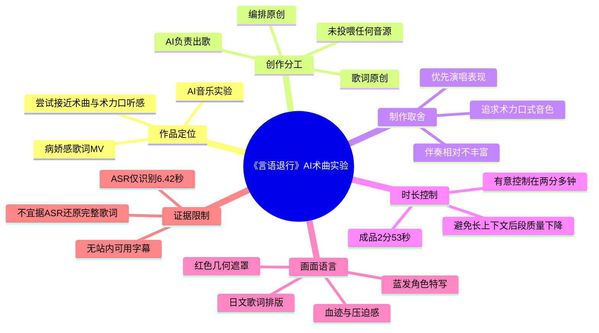
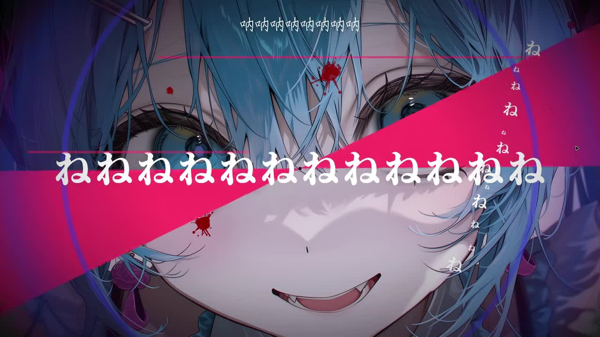
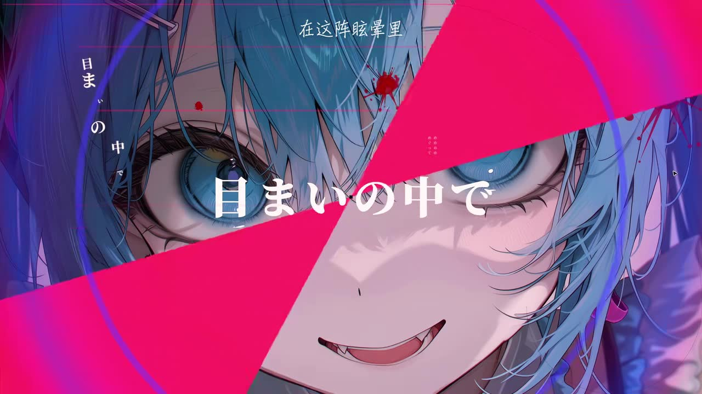
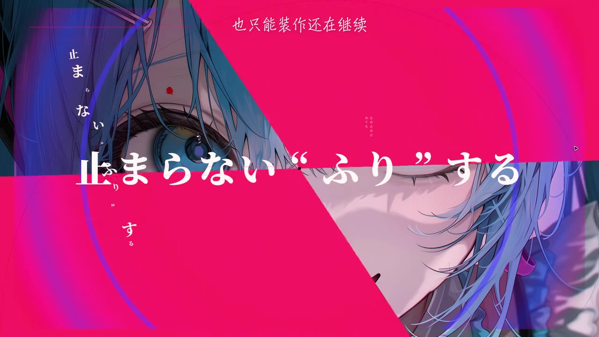
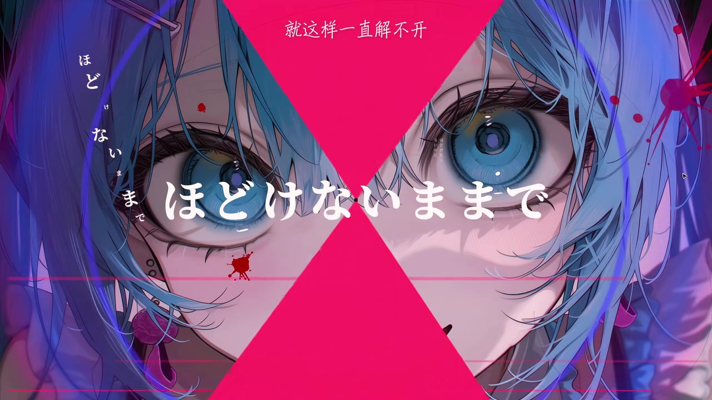

# 来鉴定一下：这真的是术曲吗？

> 来源：[Bilibili 视频](https://www.bilibili.com/video/BV1GYEk6xEaP)<br>
> UP 主：纯和平｜发布时间：2026-06-12｜视频时长：2 分 53 秒｜分辨率：2560×1440

## 小结

这是纯和平发布的一首 AI 音乐实验作品，视频分 P 标题为“这可能是你听过最像术曲的AI -言语退行”。作品以日语人声、歌词排版动画和病娇感插画构成，目标不是单纯展示“AI 能生成歌曲”，而是尝试在听感与视觉表达上接近“术曲／术力口”风格。

UP 主在简介中明确了制作分工：**AI 负责出歌，歌词与编排为原创**，且“没有喂任何音源”。为了尽可能使音色靠近术力口，制作时几乎将所有权重都压在演唱表现上；相应代价是伴奏相对没有那么丰富。这是本视频最重要的技术经验：在当前 AI 音乐生成条件下，人声风格、伴奏复杂度与成品长度之间存在资源分配和质量权衡。

作品被有意控制在两分多钟。UP 主给出的原因是：随着生成上下文变长，AI 音乐后半段质量通常会不同程度下降；做得短，整体质量可能更高但“不够听”，做得长，则后段质量更难稳定。因此，2 分 53 秒并非随意剪裁，而是反复调整后的质量控制结果。

从可见画面看，MV 使用蓝发角色大特写、红色几何遮罩、血迹点缀、横竖混排日文歌词及少量中文译文，形成强烈、压迫且带失控感的视觉气质。标签中的“初音未来”“VOCALOID”“病娇”“术曲”“伪术曲”“术力口”表明作品主动置身于 VOCALOID／术力口审美的参照框架中；但“像不像术曲”仍属于听众的审美判断，而非可由元数据直接证明的事实。

本条视频适合关注 AI 音乐生成、VOCALOID 风格模仿边界、短曲质量控制与歌词 MV 设计的人阅读。需要注意，视频没有提供完整可用字幕，且本次 ASR 对歌曲日语歌词的覆盖率仅 3.73%，故不能据此重建完整歌词或逐段精确解读。有关“AI 音乐后半段质量下降”的判断是 UP 主在本作品制作阶段的经验，受具体模型、提示词、生成链路和后续技术迭代影响，具有时效性。

## 思维导图




## 目录

- [作品定位、来源与时效性](#作品定位来源与时效性00-00-00)
- [已确认的创作信息与技术取舍](#已确认的创作信息与技术取舍00-00-00)
- [开场可确认的音频与歌词呈现](#开场可确认的音频与歌词呈现00-00-00)
- [歌词 MV 的画面设计](#歌词-mv-的画面设计00-00-07500)
- [可迁移的制作步骤与参数边界](#可迁移的制作步骤与参数边界00-00-00)
- [结论、限制与待验证项](#结论限制与待验证项00-00-00)
- [字幕比对](#字幕比对)
- [评论分析](#评论分析)
- [处理记录](#处理记录)

## 作品定位、来源与时效性：[00:00](https://www.bilibili.com/video/BV1GYEk6xEaP?t=0)

视频标题为“来鉴定一下：这真的是术曲吗？”，分 P 标题为“这可能是你听过最像术曲的AI -言语退行”。标题以提问方式邀请观众判断：这首由 AI 参与生成的歌曲，是否能在风格感受上被听作术曲。

可确认的基础信息如下：

| 项目 | 信息 |
| --- | --- |
| UP 主 | 纯和平 |
| 视频时长 | 173 秒（2 分 53 秒） |
| 画面规格 | 2560×1440 |
| 所属收藏夹 | AIcode |
| 标签 | 初音未来、VOCALOID、病娇、术曲、伪术曲、术力口 |
| 作品名线索 | 分 P 标题含“言语退行” |
| 视频性质 | 歌曲／歌词 MV；未提供口播讲解片段的证据 |

“术曲”“术力口”在这里是作品主动对标的审美语境，而不是平台或技术意义上的正式认证。视频标签同时出现“术曲”与“伪术曲”，也说明作品保留了对其 AI 身份及风格归属的自我调侃或开放讨论空间。

发布时间按素材元数据为 2026-06-12；观看、点赞、收藏等统计值为抓取时快照，后续会持续变化，不能视作固定成绩。

## 已确认的创作信息与技术取舍：[00:00](https://www.bilibili.com/video/BV1GYEk6xEaP?t=0)

UP 主在视频简介中给出了作品最关键的制作说明。这些内容属于作者自述，应与对成品的外部听感评价分开看待。

### 创作分工与来源声明

- **AI 负责出歌**：歌曲的生成环节由 AI 承担。
- **歌词和编排是原创**：作者明确表示歌词及编排由其原创。
- **没有喂任何音源**：作者声明未向生成流程提供音源作为投喂材料。
- **歌曲完成与视频发布存在间隔**：作者称歌曲“其实两个月前就做好了”，但视频制作拖延至发布时才完成。

上述声明界定了本作品的创作主张，但素材中未提供所用 AI 音乐平台、模型版本、提示词、采样率、种子、生成轮数、后期软件或具体编排工程，因此不能补写为某个特定工具或工作流。

### 核心取舍：演唱表现优先

作者的目标是让音色“尽可能像术力口”，并称为此几乎将所有权重都压在**演唱表现**上。由此产生的可见取舍是：

| 优先项 | 作者希望获得的结果 | 作者说明的代价 |
| --- | --- | --- |
| 演唱表现／音色 | 更接近术力口风格的人声感受 | 伴奏相对没那么丰富 |
| 风格辨识度 | 让听众听出一点术曲感觉 | 不等于完全复现传统术曲制作方式 |
| 成品稳定性 | 尽量保持前后段质量 | 需要限制歌曲长度并反复调整 |

这里的“权重”是作者对生成偏好的描述；素材没有给出可输入复现的数值权重、参数面板或提示词文本。因此，不能将其误记为某个模型的官方参数名称。

## 开场可确认的音频与歌词呈现：[00:00](https://www.bilibili.com/video/BV1GYEk6xEaP?t=0)

本次 ASR 在开场识别到一段约 1.22 秒的人声文本：

> `ネネ ネヌネ`

这段内容是 ASR 输出，且与画面中反复出现的日文“ね”在形式上存在对应关系；但 ASR 对歌曲人声的整体识别质量较低，不能据此断定其完整、标准的歌词写法或语义。

在 00:07.500—00:12.700，ASR 识别为：

> `泣いてねじねじ ねじでる音でナ ナ ナ 飲み込むのっともっとのノイズだけ`

该行存在明显的连读、断词与词形不确定性，尤其是“ねじねじ”“ねじでる”“のっともっと”等部分，不能当作经过校对的正式歌词。可可靠使用的是该段**确有连续日语歌唱人声**以及其真实时间区间，而不是把该转写扩展为完整歌词释义。



> 图：该关键帧展示蓝发角色近景、横贯画面的红色几何色块和大量重复的“ね”字。它对应开场 ASR 所识别的重复音节，并直观说明 MV 如何以文字重复、强对比色和面部特写强化歌曲的紧迫感。由于关键帧素材未附逐帧时间戳，图片不被用作精确时间定位证据。

## 歌词 MV 的画面设计：[00:07.500](https://www.bilibili.com/video/BV1GYEk6xEaP?t=7)

在已提供的关键帧中，画面持续围绕同一蓝发角色展开，但通过裁切、遮罩形状、文字层级和视线方向变化，避免单张插画静止展示的单调感。可确认的视觉元素包括：

1. **角色表情与近距离构图**  
   角色面部占据画面主体，双眼被特写强调，部分帧中带有不自然的笑容与尖齿。结合“病娇”标签，这种表现服务于偏压迫、失衡的情绪风格；这只是基于画面与标签的风格观察，不等于对歌词剧情作出定论。

2. **高饱和红／粉几何遮罩**  
   大面积三角形、扇形或放射状遮罩横切角色脸部，造成遮蔽、切割与视觉冲突。其作用不仅是装饰，也为歌词文字留出高对比承载区。

3. **日文歌词的多层排版**  
   画面中可见横排主歌词、竖排日文文字、小字号注音式文字与中文句子并置。例如关键帧中可见“目まいの中で”“止まらない ‘ふり’ する”“ほどけないままで”等日文片段，以及“在这阵眩晕里”“也只能装作还在继续”“就这样一直解不开”等中文文本。由于未取得官方歌词稿，本文仅将这些视作画面中可见的文字，不补全未出现的上下文。

4. **血迹点缀与冷暖对撞**  
   蓝紫色角色、暗色背景与红粉遮罩形成冷暖强对比，少量红色飞溅状元素进一步增强危险感和不安定感。



> 图：关键帧中可见主文字“目まいの中で”、中文“在这阵眩晕里”及竖排日文。它体现了歌曲画面并非只有单语字幕，而是通过不同字号、方向和语言层次组织视线。



> 图：画面以大块红色扇形覆盖角色面部，同时将“止まらない ‘ふり’ する”置于中央。该帧有助于观察歌词排版如何与几何转场共同制造“中断／伪装／失控”的视觉节奏；这里不把文字进一步解释为完整剧情。



> 图：该帧突出角色正视的双眼、面部血迹和中央日文“ほどけないままで”，红色几何形状从上下夹击画面。它是概括作品病娇感与高压视觉设计的代表性画面。

## 可迁移的制作步骤与参数边界：[00:00](https://www.bilibili.com/video/BV1GYEk6xEaP?t=0)

视频没有展示可逐项执行的软件操作，但作者简介足以整理出一套**原则层面**的制作顺序。以下是对作者实际说明的结构化归纳，不应理解为其公开的完整工程文件或通用模型教程。

### 1. 先定义可检验的风格目标

本作的目标不是泛泛生成日语歌，而是让听感尽可能接近作者心中的术力口／术曲氛围。目标需要明确到可进行人工试听判断的维度，例如：

- 演唱是否具有预期的音色与咬字感；
- 人声是否比伴奏更承担风格辨识功能；
- 画面、歌词排版与歌曲情绪是否一致；
- 成品是否会让熟悉该风格的听众产生“有一点术曲感觉”的联想。

### 2. 明确人机分工与原创边界

作者的实际分工是“AI 出歌、人工原创歌词和编排”，并声明没有投喂音源。对类似项目而言，至少应在发布时说明：

| 应说明项 | 本作已提供的信息 | 素材中未公开的信息 |
| --- | --- | --- |
| AI 参与环节 | AI 负责出歌 | 具体生成平台与模型 |
| 人工创作环节 | 歌词、编排原创 | 具体工程和后期链路 |
| 音源投喂情况 | 声明没有喂任何音源 | 无法从素材独立验证流程 |
| 风格目标 | 尽量像术力口 | 提示词及权重数值 |

这种信息披露能让观众区分“作者自述的制作过程”“可直接从成品听到的特征”与“外部评论的推测”。

### 3. 在生成偏好中优先保障人声表现

本作的关键经验是：如果核心目标是模仿术力口式听感，应优先保证演唱表现；代价是伴奏丰富度可能下降。该原则适用于强调虚拟歌声辨识度的项目，但并不自动适用于所有 AI 音乐类型。

需要避免的误读是：作者并没有公布“所有权重”的数值，也没有证明这是所有模型的最优解。这里能复用的是**取舍逻辑**，不是一组可直接复制的参数。

### 4. 通过限制时长管理长上下文风险

作者将歌曲控制在两分多钟，理由是 AI 音乐生成在上下文变长时，后半段质量可能下降。其实际决策逻辑可以写为：

```text
若曲长过短：
  可能维持更高整体质量
  但听感上可能“不够听”

若曲长过长：
  内容容量增加
  但后半段更可能出现质量下降

因此：
  在目标听感、完整度与后段稳定性之间反复调整，
  选择约两分多钟的成品长度。
```

本片的最终参数是 **173 秒**。但“上下文多长开始下降”“何种下降最明显”“是否可通过分段生成、拼接或后期修复规避”等问题，视频均未给出数据或实操验证，不能据此扩展为确定结论。

### 5. 以歌词 MV 补强风格一致性

在成品呈现层，使用角色插画、日文主歌词、中文辅助文字、几何转场与高对比配色，将声音的风格实验延伸为完整的视听包装。对于 AI 音乐作品，这种视觉层的统一性可帮助观众以“歌曲作品”而非“单次模型输出”的方式理解成品。

## 结论、限制与待验证项：[00:00](https://www.bilibili.com/video/BV1GYEk6xEaP?t=0)

本视频给出的最具迁移价值的经验，不是某个未公开的 AI 模型参数，而是三项创作控制原则：

1. **明确风格目标后进行资源倾斜**：本作将重心放在人声演唱表现上，以换取更强的术力口风格指向。
2. **将曲长作为质量控制变量**：作者认为长上下文会损伤后段质量，因而以两分多钟控制风险。
3. **用统一 MV 语言放大风格感受**：角色特写、红蓝对比、歌词排版与病娇感图像共同参与作品风格建构。

同时应保留以下限制：

- 视频未公开生成模型、版本、提示词、具体权重、生成次数和后期流程，无法复现实验。
- “没有喂任何音源”“歌词和编排原创”均为作者声明；当前素材没有独立审计资料。
- “最像术曲”是标题中的主观传播表达，是否像术曲取决于听众的风格经验，不能被本报告裁定。
- 本次 ASR 只识别出 6.42 秒语音，且歌曲人声识别错误较多，无法形成完整歌词、逐句翻译或全片结构时间表。
- 作者关于长上下文质量下降的经验具有技术时效性。AI 音乐模型与产品机制更新后，生成稳定性和最佳时长可能变化。
- 关键帧素材没有附带每张图片对应的视频秒数，故正文仅将其用于解释视觉设计，不将其伪作精确时间证据。

## 字幕比对

| 字幕来源 | 完整性 | 专有名词／歌词 | 时间轴 | 主要问题 |
| --- | --- | --- | --- | --- |
| Bilibili 站内字幕 | 不可用；素材明确标注“未提供可用站内字幕” | 无法核对 | 无 | 没有可供提取、比对或采用的站内字幕文件 |
| 本次 ASR 字幕 | 很低：2 段、共 6.42 秒，占 172.128 秒音频约 3.73% | 对日语歌唱歌词存在明显断词、拟音与词形错误 | 有真实 SRT 时间轴：00:00.000—00:01.220、00:07.500—00:12.700 | 仅覆盖开场极少部分，不能还原全曲歌词或用于可靠翻译 |

### 比对结论与字幕选择

本视频**没有可用站内字幕**，因此不存在可与 ASR 合并的官方文本。本次 ASR 已实际检查：识别语言为日语（置信概率 0.99658203125），音频流存在，诊断中**未标记 `noAudioStream=true`**；其低覆盖率被工具提示为“识别语音少于 4%”，更可能与歌曲、伴奏、歌唱发音或识别不完整有关，而不是“源视频没有音轨”。

最终采用策略如下：

- 时间定位仅采用 ASR SRT 提供的两段真实区间。
- 对 00:00—00:01.220 的重复音节，保留 ASR 原文 `ネネ ネヌネ`，不做未经证实的规范化改写。
- 对 00:07.500—00:12.700 的长句，仅记录 ASR 原文及其不可靠性，不将其作为正式歌词引用。
- 画面中可清晰辨认的“目まいの中で”“止まらない ‘ふり’ する”“ほどけないままで”及相邻中文文字，依据关键帧做**可见文字转录**；它们不是站内字幕，也不能用来补全全曲。
- 未从画面或 ASR 推定未出现的歌词、角色设定、故事情节或具体音乐生成工具。

## 评论分析

本次仅获取到 2 条热评，少于“热评前三条”的上限；以下仅分析可获取内容，不补造第 3 条评论。

| 热评 | 点赞数 | 观点概括 | 可提供的信息与边界 |
| --- | ---: | --- | --- |
| 垃圾_P：“一耳suno，vocalchop的习惯与音色太突出了” | 13 | 评论者认为歌曲一听就具有其所称的 Suno 特征，尤其是 vocal chop 的使用习惯与音色。 | 这是基于听感的模型／工具归因，与作者简介中“AI 负责出歌”并不矛盾；但作者未公开具体模型，不能把该评论作为“使用 Suno”的事实证据。 |
| 我英语过敏：“好曲，Bro，好曲[doge]” | 5 | 对作品整体听感给出正面评价。 | 属于简短主观赞赏，没有提供制作流程、风格判定标准或可验证的技术信息。 |

评论区可见的核心分歧点并非作品是否由 AI 参与生成——作者已明确 AI 负责出歌——而是听众能否从声音特征进一步猜测具体生成工具。由于素材未公开工具名称，这一猜测应保持为评论者观点。

## 处理记录

- **Worker ID**：worker-mrj0wbly-5dc4e50c
- **模型**：gpt-5.6-terra
- **调用工具与素材**：视频元数据、视频简介、关键帧清单与已提供关键帧画面、ASR 诊断与 `asr/transcript.srt`、热评数据。
- **使用的应用工具**：素材解析产物中的音频 ASR（模型标记为 `medium`，CUDA、float16）、关键帧提取结果、站内字幕检索结果、评论抓取结果。
- **字幕选择**：站内无可用字幕；已检查本次 ASR。源视频存在音频流，未出现 `noAudioStream=true`。因 ASR 仅覆盖 3.73% 音频且日语歌词断词明显，采用其真实时间戳作局部定位，不将其作为全曲歌词底稿。
- **关键帧选择依据**：选用 `frames/frame-001.jpg` 至 `frames/frame-004.jpg`，原因是它们分别呈现重复“ね”字、可读日文与中文文字、多层歌词排版、红色几何遮罩、角色表情及血迹元素，足以支撑对 MV 视觉语言的说明。关键帧未提供逐帧时间戳，未用其推定具体秒数。
- **缓存清理**：未提供缓存清理执行日志；本记录不宣称已执行或完成清理。
- **未解决问题**：未获得完整官方歌词、完整可用字幕、关键帧精确时间、AI 音乐具体模型及版本、提示词、权重数值、生成轮次与后期工程；上述信息均未据猜测补全。
