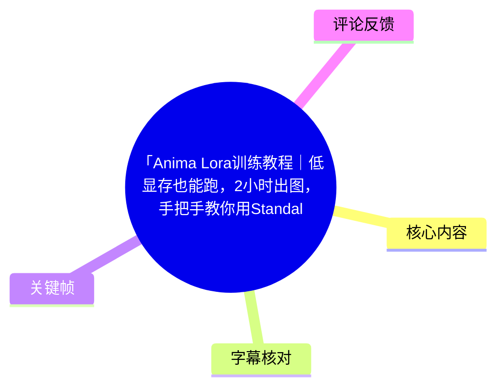
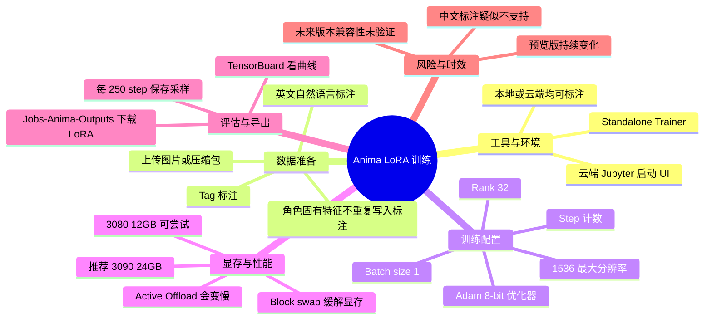
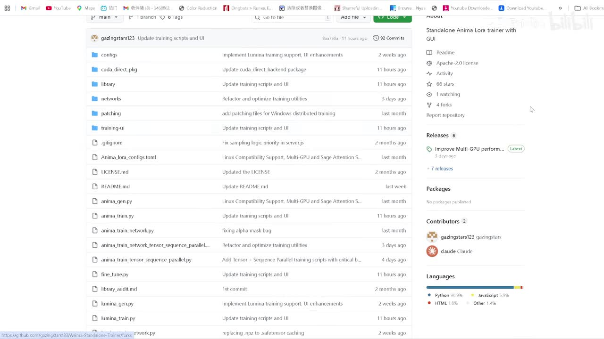
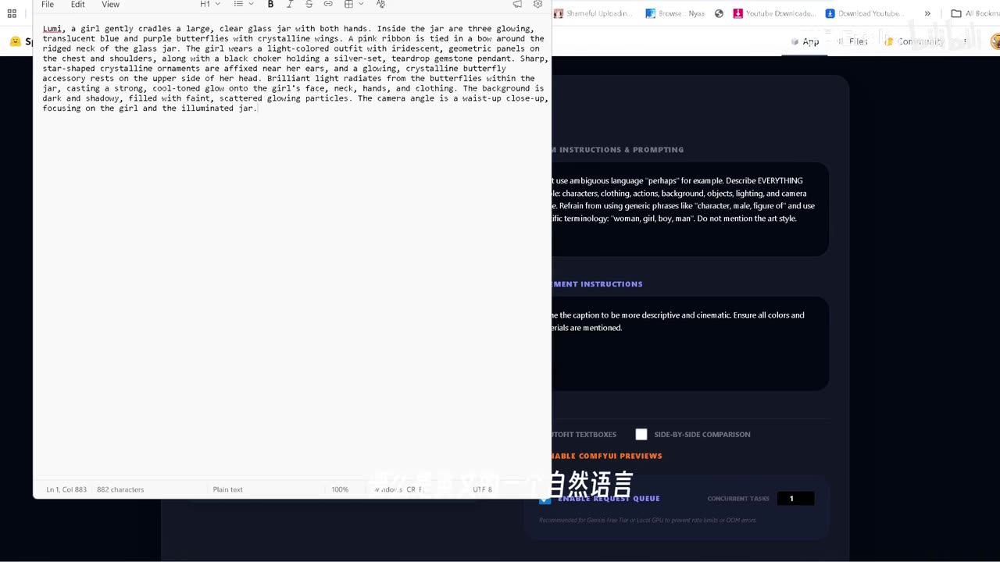
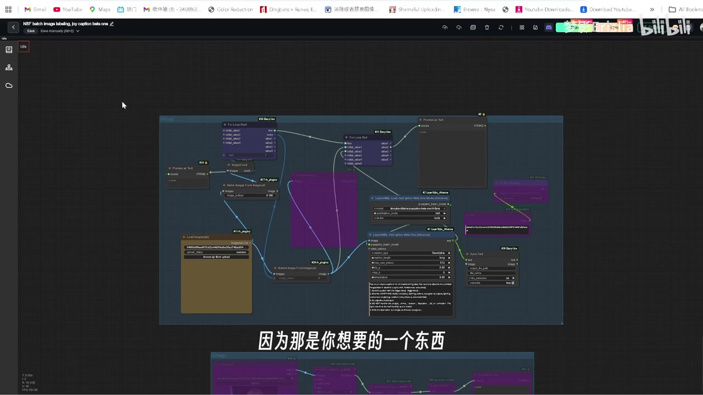
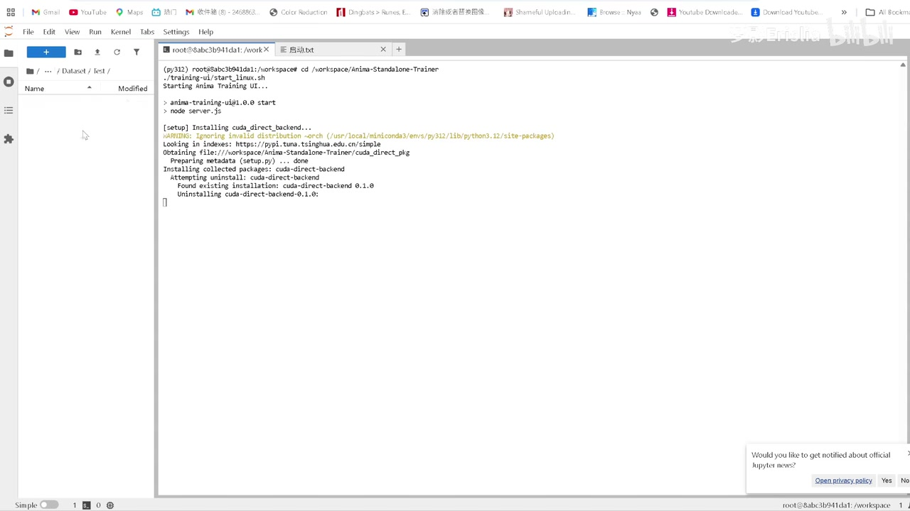

# 「Anima Lora训练教程｜低显存也能跑，2小时出图，手把手教你用Standalone Trainer」

> 来源：[Bilibili 视频](https://www.bilibili.com/video/BV1EyQHBWEnF)  
> UP 主：梦影Erislia｜时长：6 分 50 秒｜合集：AIcode  
> 视频主题：使用 **Anima Standalone Trainer** 为 Anima 模型训练角色 LoRA，并在云端环境演示数据准备、参数配置、训练、采样预览与模型下载。

## 小结

本视频给出了一条面向 Anima 模型的 LoRA 训练实操路径：通过独立版 **Standalone Trainer** 启动训练 UI，上传已完成标注的数据集，创建项目并配置训练、数据集、网络与采样参数，最后从输出目录下载 LoRA 文件。

数据标注是结果的关键前置条件。视频给出两种标注形式：**Tag 标签**与**英文自然语言描述**。作者称已测试英文自然语言标注可用，而该模型“似乎不支持中文”标注；对于角色 LoRA，目标是让模型学习的固有特征（如发色、眼睛颜色）不应被反复写入对应图片的提示词，非目标内容则应标注出来。

显存门槛是本教程的主要卖点。作者推荐使用 **RTX 3090 24GB**，同时称 **RTX 3080 12GB** 也可运行；其演示训练显示约占用 12GB 与 8GB（画面中为不同资源读数，但未进一步说明各自具体含义）。若显存不足，可启用 `block swap`，建议可尝试设为 `20` 或 `30`；`Active Offload` 会与 CPU 交换内存，但会降低训练速度。

作者的演示配置以 `1536` 为最大训练分辨率、`896–1536` 为最小/最大分辨率范围、`batch size=1`、`network rank=32`、按 `step` 计数、每 `250 step` 保存和采样为基准。演示中单次迭代约为 2～3 秒，作者称约 2,000 step 已能看到效果，2,000 多 step 的训练可在不足两小时完成；这些均是作者在其环境与数据集上的经验值，不应视作不同显卡、数据量或版本下的固定性能承诺。

工具与模型均有时效性限制：视频所谈对象是 Anima 的 **Preview 3 / 预览版**生态，热评也指出后续训练集和版本仍可能变化。因此，已经训练出的 LoRA 是否兼容后续 Anima 正式版或新版，视频未作验证；开始长时间训练前应先用小步数测试模型兼容性与采样效果。

## 思维导图

## 目录

- [背景、工具与适用范围](#背景工具与适用范围)
- [数据集与标注策略](#数据集与标注策略)
- [启动 Standalone Trainer 与创建项目](#启动-standalone-trainer-与创建项目)
- [训练参数：显存、分辨率与网络设置](#训练参数显存分辨率与网络设置)
- [采样、训练观察与结果判断](#采样训练观察与结果判断)
- [导出 LoRA 与完整操作清单](#导出-lora-与完整操作清单)
- [结论、限制与时效性](#结论限制与时效性)
- [字幕比对](#字幕比对)
- [评论分析](#评论分析)
- [处理记录](#处理记录)

## 背景、工具与适用范围 [00:00](https://www.bilibili.com/video/BV1EyQHBWEnF?t=0)

视频介绍的是面向 **Anima** 的 LoRA 训练，而不是通用 SD/Flux LoRA 参数教程。作者使用的工具为 **Standalone Trainer**，将其描述为针对 Anima 的独立训练方案；视频简介同时提供了项目仓库链接：

- GitHub：`https://github.com/gazingstars123/Anima-Standalone-Trainer`
- 云端镜像/部署入口：视频简介中提供优云智算链接。

作者的操作环境为云端，流程中通过 Jupyter 启动服务；但其明确表示，前置的标注工作流可以在**本地或云端**完成。教程适合已经拥有可用于角色或风格训练的图片素材、并希望在相对有限显存下试跑 Anima LoRA 的使用者。

> 图：画面展示 `Anima-Standalone-Trainer` 的 GitHub 仓库页面及项目文件结构。它用于确认视频所用工具的项目名称与独立训练器定位，但截图不能替代查看仓库当前 README、依赖和版本说明。

### 视频中的硬件判断

作者给出的判断如下：

| 项目 | 视频中的说法 | 使用时应如何理解 |
| --- | --- | --- |
| 推荐显卡 | RTX 3090 24GB“完全够用” | 是作者推荐的演示级配置。 |
| 可尝试的较低显存卡 | RTX 3080 12GB 也可以 | 取决于 batch、分辨率、缓存与版本，需实际试跑。 |
| 演示 batch size | 默认 `1` | 作者建议作为保守默认值。 |
| 3090 的 batch size | 可设为 `2` | 作者称可行，但不代表所有训练集或其他参数组合均可行。 |
| 训练速度 | 每迭代约 2～3 秒 | 为作者云端演示环境的观察值。 |
| 效果出现节点 | 约 2,000 step 可见效果 | 应结合采样图判断，不能只按步数结束训练。 |
| 演示训练耗时 | 2,000 多 step 不足两小时 | 并非对所有机器、数据量和版本的保证。 |

## 数据集与标注策略 [00:20](https://www.bilibili.com/video/BV1EyQHBWEnF?t=20)

### 两种标注形式

作者将素材标注分为两条路线：

1. **Tag 标签标注**  
   使用标签形式描述图像内容。作者提到此前已分享过相应工作流，可在本地或云端使用。

2. **英文自然语言标注**  
   可使用此前介绍过的 **Lora Captioner** 一类工具进行描述式标注。作者称自己已测试过英文自然语言标注“完全没有问题”。

作者特别提醒：Anima 模型“好像并不支持中文”。因此，视频建议在此训练场景中使用：

- Tag；
- 英文自然语言描述。

这是一项基于作者测试的经验，而不是视频中展示的官方兼容性说明。若必须使用中文，应该先制作小数据集、低步数训练和固定提示词采样来验证，而非直接投入完整训练。

> 图：画面左侧是英文图像描述文本，右侧为标注工具界面及提示说明。这张图直接说明了视频所说的“英文自然语言打标”是什么：为图像写出具体、可读的英文内容描述，而非仅填写单个触发词。

### 角色 LoRA 的标注取舍

视频用角色 LoRA 举例，提出一条重要原则：

- **想让 LoRA 学会并固化的角色特征，不必反复写入标注。**
- **不希望 LoRA 学到、或需要与角色特征区分开的内容，应进行标注。**

作者举例的角色固有特征包括：

- 头发特征；
- 眼睛颜色等。

其逻辑是：如果目标就是让 LoRA 吸收这些角色属性，那么没有必要在每张图的提示词中重复描述它们；反之，背景、姿势、服装、镜头等不希望被误归因到角色本体的因素，需要通过标注帮助模型区分。

这不是“任何角色属性都绝不能标注”的机械规则。视频未展开讨论数据集一致性、触发词设计、去重、素材数量和版权来源等问题，因此实际使用时仍应先统一训练目标：究竟训练的是角色身份、服装、画风，还是特定构图。

> 图：画面展示节点式批量图像处理/标注工作流，并叠加“因为那是你想要的一个东西”的字幕。它对应视频中“目标特征少描述、非目标因素应标注”的讲解，有助于理解标注策略与工具工作流的关系。

### 上传训练集

进入训练 UI 后，作者的操作是：

1. 在文件区域进入 `DataSets`；
2. 进入或使用 `test` 目录；
3. 放入训练图片；
4. 也可以直接上传压缩包；
5. 进行批量打标。

演示中作者只随机上传了两张图片，用于说明界面与流程。两张图不应被理解为可稳定训练出通用角色 LoRA 的推荐数据量；视频没有给出正式建议的数据集规模。

## 启动 Standalone Trainer 与创建项目 [01:25](https://www.bilibili.com/video/BV1EyQHBWEnF?t=85)

作者切换至云端环境后，先打开 Jupyter，并在终端中执行/复制界面给出的两段启动内容。素材没有可靠提供完整命令文本，因此不能补写或猜测启动命令；应以当前镜像或 GitHub README 中的命令为准。

> 图：画面为 Jupyter 文件浏览器和终端，终端中可见进入工作目录、启动训练 UI 及安装/更新依赖的过程。这张图的价值在于说明训练器并非直接在网页中自动可用，而要先完成服务启动并等待 UI 就绪。

### 创建训练项目

服务启动、训练集已放入对应目录后，作者进入训练 UI：

1. 打开训练 UI；
2. 点击界面中的“6”，创建一个项目；
3. 依据图片数量调整重复次数（repeats）；
4. 配置所需参数；
5. 点击 `Train` 开始训练。

视频提到“可根据图片数量改一下重复次数”，但没有给出图片数量与 repeats 的具体换算公式，也未说明总 step、epoch、repeats 三者的精确计算关系。故不能从视频推导出某个数据集应填入的唯一重复次数。

## 训练参数：显存、分辨率与网络设置 [02:05](https://www.bilibili.com/video/BV1EyQHBWEnF?t=125)

以下参数均来自作者演示和口述；未被视频明确解释的底层机制不作延伸推断。

### Global Setting 与训练基础参数

| 区域/参数 | 视频说明 | 作者的建议或默认取向 |
| --- | --- | --- |
| `Global Setting` | 包含模型路径、VAE 等文件路径 | 使用对应环境已配置的路径。 |
| Optimizer | 可选择优化器 | 默认使用 `Adam 8-bit`。 |
| 更高配置时的优化器 | 可选其他优化器 | 作者未清晰给出具体替代项名称及适用条件。 |
| 训练计数 | 有 `epoch` 与 `step` 两种方式 | 作者个人更喜欢 `step`。 |
| 总训练步数示例 | `10,000 step` | 是讲参数时的示例，不等同于其后“2,000 step 有效果”的经验结论。 |
| 保存间隔 | 每 `250 step` 保存一次 | 与采样间隔配合，方便比较过程效果。 |
| LoRA 保存格式 | 提及 `safetensors` | 视频将其作为 LoRA 保存相关设置提及。 |
| Flash Attention | 可开启 | 作者在演示配置中建议开启。 |
| Gradient 等高级项 | 有相关选项 | 作者说通常无需特别处理。 |

### 显存不足时的设置

| 参数 | 功能（按视频表述） | 视频建议 | 代价/限制 |
| --- | --- | --- | --- |
| `block swap` | 交换部分虚拟内存，以缓解显存问题 | 可尝试填 `20` 或 `30`；默认 `0` 为关闭 | 视频未给出不同数值对应的显存节省或速度损失数据。 |
| `Active Offload` | 与 CPU 进行内存交换 | 通常不建议打开 | 打开后会更慢。 |
| VAE 相关强制设置 | 视频提及“强制 VAE”一类选项 | 未提供明确配置值 | 不应自行从字幕误识别结果补全。 |

“低显存可跑”在视频语境中是可以通过保守 batch 与内存交换机制完成训练，并不意味着任意显存都能无代价运行。特别是热评中存在 `bs=8` 时显存接近 26GB 的反馈，说明 batch size 等配置会显著改变资源占用。

### Dataset 参数

| 参数 | 演示值/建议 | 说明 |
| --- | --- | --- |
| 最大分辨率 | `1536` | 作者称这是 Anima 训练支持的最大分辨率，因此直接采用。 |
| 最小分辨率 | `896` | 作者依据模型介绍中支持的分辨率范围取值。 |
| 最大分辨率 | `1536` | 与模型上限保持一致。 |
| `batch size` | 默认 `1` | 作者的保守默认值。 |
| 3090 上的 batch size | 可尝试 `2` | 作者称 3090 可以设置为 2。 |
| 数据集路径 | 上传后右键复制路径 | 需使用绝对路径，并“记得加上斜杠”。 |
| 多数据集 | 支持添加多个 Dataset | 视频未说明各数据集的权重/混合规则。 |
| repeats | 根据图像数量修改 | 未给出具体数值公式。 |

### Network 与 GPU

| 参数 | 视频设置 |
| --- | --- |
| Network rank | `32` |
| GPU 数量 | 演示为 `1` 张 GPU |
| 其他网络参数 | 视频未给出明确数值或适用条件 |

`rank=32` 是作者常用值，并非视频证明的最优解。不同目标（角色、风格、细节特征）以及不同数据集下，rank 的最佳选择需要用采样结果对比。

## 采样、训练观察与结果判断 [04:08](https://www.bilibili.com/video/BV1EyQHBWEnF?t=248)

### 训练中采样

作者在高级设置中配置了每 `250 step` 采样一次，目的不是单纯生成图片，而是让训练过程中持续输出可比较的结果：

1. 在采样/提示词区域填写用于验证的 prompt；
2. 需要时增加额外 prompt；
3. 可将 seed 设为随机；
4. 统一宽高比与分辨率，减少对比时的变量；
5. 配置完成后可使用 `Generate` 生成；
6. 后续随着更多 LoRA 检查点出现，可在界面下方选择相应 LoRA 继续采样、查看效果。

作者在自己的首次训练中遗漏了采样设置：因为一开始没有填写提示词，所以没有产生这部分采样缓存/预览。这是视频中最明确的实操踩坑之一——**开始训练前必须确认验证 prompt 已填，且采样开关/间隔已设置**。否则即使模型正在正常训练，也会失去按保存节点观察效果的便利。

### 日志与曲线

训练开始后，运行情况会在界面下方显示。作者还提到可使用 **TensorBoard** 查看曲线。视频没有展示具体应该依据哪些曲线指标停止训练或判定过拟合，因此 TensorBoard 在这里属于辅助观察工具，而非给出了自动选最佳 checkpoint 的完整方法。

### 作者的实际观察

作者展示了已训练至 `2500 step` 左右的结果，并作出如下判断：

- 单次迭代约 3 秒，整体速度较快；
- 演示资源占用较低，画面中出现约 12GB 与 8GB 的读数；
- 在外部测试中，角色特征基本得到还原；
- 肢体结构没有明显问题；
- 约 2,000 step 已能显示效果；
- 2,000 多 step 的演示训练在两小时内完成。

这些是作者对单一示例 LoRA 的主观效果评价。视频没有展示多个随机种子、不同提示词、不同 checkpoint 的完整横向对照，也没有给出定量指标，因此应把它作为“值得先试跑的配置方向”，而不是普遍性能结论。

## 导出 LoRA 与完整操作清单 [05:52](https://www.bilibili.com/video/BV1EyQHBWEnF?t=352)

### LoRA 文件位置

视频结尾补充了 LoRA 输出位置。操作路径为：

1. 回到训练 UI；
2. 点击 `Jobs`；
3. 进入 `Anima`；
4. 点击 `Outputs`；
5. 在该目录中查找训练生成的 LoRA 文件；
6. 右键下载到本地；
7. 将文件用于后续推理/测试。

作者称其已训练的 2,000 多步 LoRA 可直接从该目录下载使用。

### 从数据到模型的实操清单

1. **确认版本与环境**
   - 确认使用的是面向 Anima 的 Standalone Trainer。
   - 查看当前镜像或 GitHub README，避免使用视频录制时已过期的命令与依赖。

2. **准备训练图片**
   - 整理要训练的角色/风格图片。
   - 确定本次真正希望 LoRA 学习的特征范围。

3. **完成标注**
   - 选择 Tag 或英文自然语言描述。
   - 避免直接以中文标注作为主方案，因为作者称该模型似乎不支持中文。
   - 对角色 LoRA，谨慎处理发色、眼睛颜色等希望模型固化的角色属性。
   - 将非目标内容作为描述信息，以减少错误绑定。

4. **上传数据集**
   - 在 `DataSets` 对应目录放入图片，或上传压缩包。
   - 复制数据集目录时使用绝对路径，并注意路径末尾斜杠要求。

5. **启动训练器并创建项目**
   - 在云端 Jupyter 环境启动训练 UI。
   - 进入 UI，创建项目。
   - 按图片数量调整 repeats；视频未提供具体公式，应先小规模测试。

6. **配置训练**
   - 优化器：可先采用视频默认的 `Adam 8-bit`。
   - 计数方式：可按作者偏好选择 `step`。
   - 分辨率：最高 `1536`，演示范围为 `896–1536`。
   - Batch：默认 `1`；在作者所述 3090 环境可尝试 `2`。
   - Network rank：`32`。
   - 打开 Flash Attention。
   - 设置每 `250 step` 保存与采样。

7. **处理显存问题**
   - 先保持 `batch size=1`。
   - 若仍显存不足，尝试启用 `block swap=20` 或 `30`。
   - 谨慎启用 `Active Offload`，因为作者明确指出会降低速度。

8. **设置验证采样并开跑**
   - 在开始前填写验证用 prompt。
   - 设定 seed、宽高比与分辨率。
   - 确认采样设置已生效，避免复现作者“忘记写提示词导致无采样”的问题。
   - 点击开始训练。

9. **中途检查与选择结果**
   - 每 250 step 查看采样结果。
   - 结合训练日志与 TensorBoard 曲线观察。
   - 不要仅以达到某个固定 step 数作为完成条件。

10. **导出与验证**
    - 前往 `Jobs → Anima → Outputs`。
    - 下载 LoRA 文件。
    - 在固定的 prompt、seed、分辨率下测试角色特征、肢体和泛化表现。

## 结论、限制与时效性 [06:35](https://www.bilibili.com/video/BV1EyQHBWEnF?t=395)

本教程最有价值的可迁移经验有三点：

- 对 Anima LoRA 而言，**英文自然语言或 Tag 标注**是作者已测试的输入形式；中文标注兼容性存在疑问。
- 以 `batch size=1`、`896–1536` 分辨率范围、`rank=32`、每 250 step 保存与采样作为起点，能建立一套可观察、可回退的训练流程。
- 显存不够时，不应立即盲目提高资源规格；可以先降低 batch，并使用 `block swap`。代价是性能与实际效果仍需自行验证。

同时，视频没有覆盖下列问题：

- 推荐数据集图片数量、清洗标准、重复图处理与数据集权重；
- 学习率、LoRA alpha、具体 VAE 配置等明确数值；
- `epoch`、`step`、repeats 之间的换算方法；
- 不同显卡、不同 batch、不同分辨率的完整显存测试；
- 训练后的 LoRA 在 Anima 后续版本或正式版上的兼容性；
- 角色素材的版权、肖像权与使用授权问题。

时效性尤其需要注意：视频和评论均显示其讨论的是 Anima Preview 版本阶段。热评提及“预览版 V3”及未来训练集仍可能扩充，这意味着训练器、基础模型、推荐参数乃至 LoRA 文件兼容性都可能发生变化。应优先以当前项目仓库、当前云镜像说明和模型发布说明为准。

## 字幕比对

| 字幕来源 | 完整性 | 专有名词 | 时间轴 | 主要问题 |
| --- | --- | --- | --- | --- |
| Bilibili 站内字幕 | 覆盖了从标注、云端训练到导出 LoRA 的完整口述内容 | 较多术语被自动翻译或音译，如 Anima、LoRA、Flash Attention、block swap 等不稳定 | 未提供逐句时间戳 | 字幕为阿拉伯语，与原视频中文讲解不一致；部分技术词被意译，路径与参数名可读性较低。 |
| 本次 ASR 字幕 | 已执行并覆盖视频完整内容 | 能识别出 Anima、Standalone Trainer、Lora Captioner、Jupyter、DataSets、TensorBoard、rank 32、1536 等核心信息 | 未提供逐句时间戳 | 中文识别存在明显同音/错词，如“劳拉/捞拉”“Tug”“Stamp”“雷劈指数”“群体 UI”等，需要结合上下文和画面校正。 |

### 最终字幕采用策略

本次 ASR 已执行。正文以**本次 ASR 的中文语义和视频关键帧**为主体，并使用站内字幕补足段落完整性；对于两份字幕均存在歧义的内容，保守保留原始界面英文或明确标注为“视频未给出完整值”。

已基于上下文与画面校正或统一的重点术语包括：

| ASR/站内字幕中的不稳定表述 | 正文采用写法 | 校正依据 |
| --- | --- | --- |
| “standalone traner” | Standalone Trainer | 视频标题与项目名称。 |
| “Jubyta / JITA” | Jupyter | 启动画面为 Jupyter 文件与终端界面。 |
| “DataSize” | `DataSets` | ASR 上下文与口述目录名称。 |
| “Tug” | Tag | 标注语境及站内字幕中的 tags。 |
| “Stamp / step” | `step` | 作者与站内字幕均对比 `epoch` 和 `step`。 |
| “ARDIUM 8 bits” | `Adam 8-bit` | 站内字幕明确提及 Adam 8BITS。 |
| “flush attention” | Flash Attention | 训练界面的常见英文参数及站内字幕音译。 |
| “block to swap” | `block swap` | 两份字幕均指向显存/虚拟内存交换选项；具体 UI 拼写仍以当前版本为准。 |
| “Active Offload” | `Active Offload` | 两份字幕均提及 CPU 内存交换。 |
| “LAMP C5 / Safe Tension” | `safetensors` 保存相关设置 | 站内字幕中出现 save tension，ASR 有严重误识别；视频未提供完整字段名。 |

## 评论分析

> 以下仅处理素材中可获取的热评前三条。评论是个人经验或观点，不作为已验证事实。

### 1. 云平台 UI 与开机体验问题

- 评论者：川味面最好吃
- 点赞：4
- 观点：认为视频所用网站难用，主要不满包括 UI 设计、没有开机进度提示、启动等待时间不透明，以及操作被打断后可能浪费数十分钟的开机等待。
- 补充价值：提醒实际训练成本不只有显卡费用和训练时长，还包括云端实例启动、状态反馈与任务恢复体验。
- 可信度与边界：这是单一用户对平台交互体验的反馈，不能据此断言平台普遍不可用；但对于需要频繁启动实例的用户，确实应在训练前确认实例状态、自动保存和断线恢复机制。

### 2. `batch size=8` 时显存占用异常高

- 评论者：海奈うみな
- 点赞：3
- 观点：其训练时将 `bs` 开到 `8`，显存占用接近 26GB，与其观察到的“别人约 10GB”存在显著差异。
- 补充价值：这与视频中“默认 batch size=1、3090 可尝试 2”的建议形成直接对照，说明将 batch 提高到 8 可能显著推高显存。
- 可信度与边界：评论未给出分辨率、数据集、优化器、是否开启缓存/交换、基础模型版本和完整日志，因此无法判断异常来自 batch 本身、参数组合还是环境差异。可将其视为“不要跳过保守 batch 测试”的警示。

### 3. Preview V3 与未来兼容性担忧

- 评论者：口径不足背过气去
- 点赞：3
- 观点：指出 Anima 当时仍为 Preview V3、并非完全版，且作者可能继续增加训练集；担心现在训练的 LoRA 与未来版本不兼容。
- 补充价值：直接指出本教程的时效性风险：基础模型版本演进可能影响 LoRA 的适配性。
- 可信度与边界：该评论未附官方版本公告或兼容性测试，不能确认一定不兼容；但视频本身也没有提供跨版本兼容保证，因此在预览版阶段进行小规模验证、保留训练参数和数据集记录是合理做法。

## 处理记录

- Worker ID：`worker-mrj0wbly-5dc4e50c`
- 调用模型：`gpt-5.6-terra`
- 使用的素材与工具：依据任务提供的视频元数据、站内字幕、已执行的本次 ASR 字幕、12 个关键帧路径清单、已获取热评前三条及素材产物目录进行整理；未在正文中补造未提供的命令、版本号或参数值。
- 字幕选择：站内字幕存在但为阿拉伯语自动转写，专有名词有翻译/音译偏差；本次 ASR 已执行，虽为中文但存在同音错词。最终采用“ASR 中文语义 + 站内字幕互证 + 关键帧界面校正”的合并策略。
- 关键帧选择依据：
  - `frames/frame-001.jpg`：展示 GitHub 项目页，用于确认 Standalone Trainer 项目背景；
  - `frames/frame-002.jpg`：展示英文自然语言描述与标注界面，支撑标注方式说明；
  - `frames/frame-003.jpg`：展示节点式工作流，支撑角色特征标注取舍；
  - `frames/frame-004.jpg`：展示 Jupyter 终端启动训练器，支撑云端启动步骤。
- 缓存清理：素材中仅提供了 `merged.mp4`、音频、关键帧、字幕、ASR、评论等产物目录信息，未提供缓存清理日志；因此无法确认是否已执行缓存清理，也未虚构清理结果。
- 未解决问题：
  - 视频未提供可复现的完整启动命令、学习率及其他全部训练配置；
  - `block swap` 等字段的当前 UI 精确拼写需以当前 Trainer 版本为准；
  - Anima Preview 版本与未来版本的 LoRA 兼容性未经视频验证；
  - 数据集规模、版权授权和最佳超参数选择不在视频覆盖范围内。
