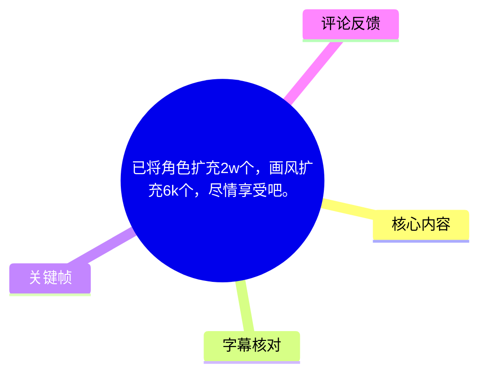
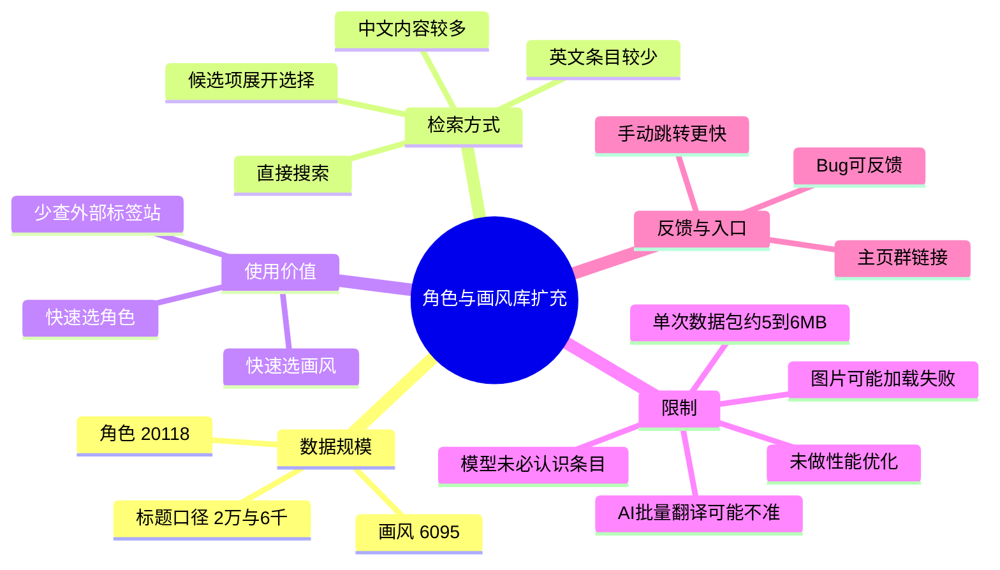
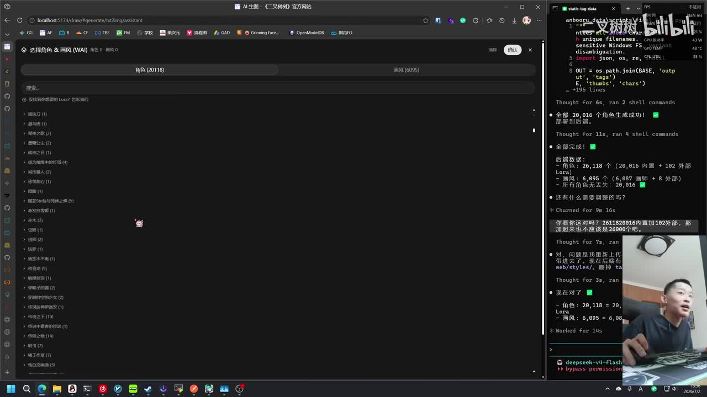
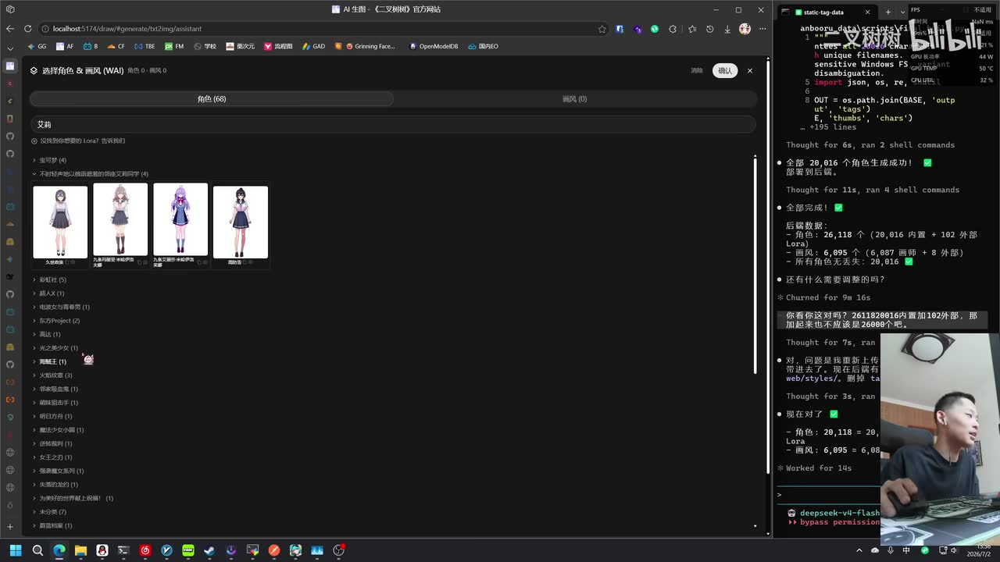
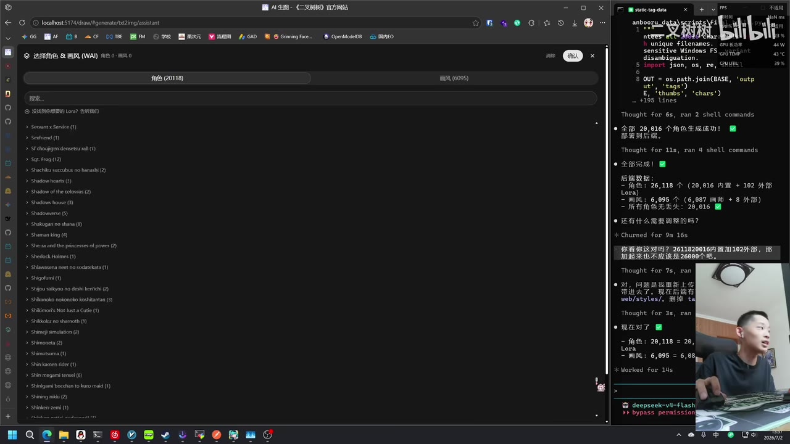
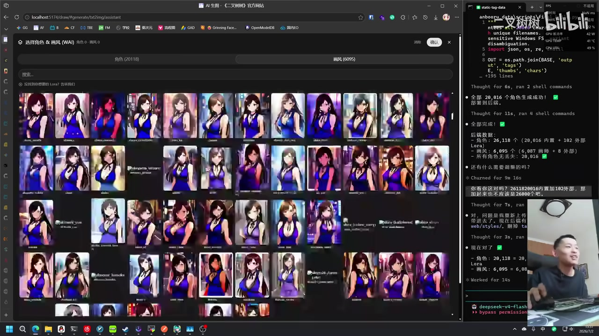

# 已将角色扩充2w个，画风扩充6k个，尽情享受吧。

> 来源：[Bilibili 视频](https://www.bilibili.com/video/BV1GoTj69EmJ) 
> UP 主：二叉树树｜时长：2 分 26 秒｜分辨率：2560×1440｜合集：AIcode  
> 数据抓取时视频统计：44,156 播放、2,200 收藏、752 点赞、34 条回复。上述统计会随时间变化。

## 小结

视频展示了一个本地网页式 AI 绘图辅助界面的数据扩充成果：角色条目显示为 **20,118 个**，画风条目显示为 **6,095 个**。UP 主称自己已将某个角色/标签数据库中的内容批量抓取并接入界面，使用户可以直接在搜索框中查找角色和画风，而不必自行到外部站点检索角色标签。

核心价值不在于讲解绘图模型参数，而在于提供一个“角色/画风素材检索层”：输入名称、展开候选项、选择角色或画风，再将选择结果用于后续生成。视频尤其强调中文检索覆盖较多，UP 主口述约 **70% 为中文内容**；英文内容相对少，部分名称可能没有对应英文名。

数据规模虽大，但视频明确承认未做性能优化。页面可能在打开画风库、加载图片或一次性下发数据时卡顿；UP 主估计单次数据包可达到约 **5～6 MB**。部分图像还可能因平台/服务限制或服务器问题无法显示，具体原因在视频中未被确认。

适合希望快速查找二次元角色、作品相关画风或提示词参考的 AI 绘图用户阅读。使用时应把检索结果视为辅助信息，而不是模型一定能够准确识别并复现的保证；热评也指出，最终仍取决于 Anima 本身是否认识相应条目。

本视频具有较强时效性：角色数量、画风数量、中文覆盖、加载速度、群链接与服务可用性均是发布时的演示状态。视频中所称“无敌”“随便选”是 UP 主的主观评价，不等于覆盖完整性、翻译正确性或服务稳定性的客观承诺。

## 思维导图

## 目录

- [数据扩充成果与界面证据](#数据扩充成果与界面证据)
- [角色库：搜索、语言覆盖与候选条目](#角色库搜索语言覆盖与候选条目)
- [画风库：规模与选择方式](#画风库规模与选择方式)
- [性能、图片显示与使用限制](#性能图片显示与使用限制)
- [实际使用步骤与反馈入口](#实际使用步骤与反馈入口)
- [结论与时效性](#结论与时效性)
- [字幕比对](#字幕比对)
- [评论分析](#评论分析)
- [处理记录](#处理记录)

## 数据扩充成果与界面证据 [00:00](https://www.bilibili.com/video/BV1GoTj69EmJ?t=0)

视频开头，UP 主说明已将整套数据库内容“爬下来”，但加载时一度因网络状况不佳而卡住。随后其口述角色总量为 **20,118 个角色**，并让观众直接查看界面。

关键帧中的网页界面顶部显示“角色（20118）”，右侧终端日志还出现了角色与画风的构建/生成过程。界面与日志共同构成了本视频最直接的数据规模证据：

| 项目 | 视频画面可见数值 | 标题口径 | 应如何理解 |
| --- | ---: | ---: | --- |
| 角色 | 20,118 | 2w 个 | “2w”是标题中的约数，画面给出更精确的展示值。 |
| 画风 | 6,095 | 6k 个 | “6k”同样是约数，画面给出更精确的展示值。 |
| 数据来源 | UP 主称为批量爬取的数据库内容 | 未在素材中提供可验证的公开数据链接 | 应视为 UP 主的演示陈述，不能据此推断数据授权、完整性或长期维护情况。 |

> 图：画面左侧的检索界面显示“角色（20118）”，右侧终端窗口显示批量处理日志。这一帧同时支持“角色数量已扩充”与“数据经批处理导入”的视频叙述，是核对规模数字的关键证据。

从右侧日志可见，角色与画风的最终数量旁还出现了“内置”和“外部”等拆分信息，但由于画面文字较小、字幕转写误差较大，本文不将拆分数值作为确定结论，仅保留界面清晰可见的角色总数 20,118 和画风总数 6,095。

## 角色库：搜索、语言覆盖与候选条目 [00:18](https://www.bilibili.com/video/BV1GoTj69EmJ?t=18)

UP 主演示的主要操作是直接在“角色”区域进行搜索。其观点是：用户不再需要为了找角色而前往外部标签站逐项寻找 tag，可以在此界面内先搜索、再选择候选条目。

### 演示中透露的检索规则

1. **直接输入想找的角色或名称。**  
   视频以若干角色/作品名称进行示例搜索；字幕对专名的识别不稳定，无法可靠还原所有示例名称，因此不将其作为可复现的精确检索词。

2. **在候选树或搜索结果中定位条目。**  
   搜索结果以分类条目、折叠列表和预览卡片等形式呈现。搜索不仅依赖用户手动背诵标准 tag，也允许从界面中浏览候选。

3. **优先尝试中文名。**  
   UP 主称顶部展示的内容基本以中文为主，约 **70%** 为中文内容。这个比例是口述估计，未见完整统计表，因此应理解为经验性描述。

4. **英文名可能不完整。**  
   英文内容“就这么一点点”；部分角色可能没有合适的英文对应名称，或者名称受 AI 自动翻译影响而不够准确。

5. **旧数据可能仍存在但排序靠后。**  
   UP 主提到此前的数据没有删除，只是可能被大量新数据“埋在别的地方”。这意味着“搜不到”未必等于条目被移除，也可能是检索词、翻译名或结果排序不匹配。

> 图：界面中搜索词为“艾莉”，左侧列出候选分类，中央出现多个角色预览卡片。该帧说明角色库并非只有文本标签，也提供视觉候选，适合在名称模糊时辅助辨认。

> 图：角色面板仍显示“角色（20118）”，中部为按字母排列的英文/罗马字条目。它直观反映出库中确实同时存在非中文条目，但不能据此证明每个角色都有完善的多语言映射。

### 术语与可靠性边界

UP 主口述中提到了一个发音近似 “Danbooru” 的外部标签/图库站点，并将其描述为过去需要找角色、找 tag 的地方。由于站内字幕为阿拉伯语机器转写、本次 ASR 也将该词识别为不稳定的近似拼写，本文仅将其记录为“UP 主所指的外部标签站”，不据此断言具体抓取来源、数据许可或 API 实现。

## 画风库：规模与选择方式 [01:13](https://www.bilibili.com/video/BV1GoTj69EmJ?t=73)

在角色库之后，UP 主转到画风库，说明画风部分“依旧”采用批量抓取方式：按单个作品汇集对应画风内容。画面顶部显示 **画风（6095）**，与视频标题“画风扩充 6k 个”相互对应。

UP 主提醒，自己点击打开画风区域时页面会卡顿一段时间。也就是说，画风库虽然可供选择，但当前实现更偏向“先完整装载大数据集”，而不是按需分页或延迟加载。

> 图：顶部显示“画风（6095）”，下方密集排列大量相似的图像预览。该帧能说明画风库采用视觉缩略图辅助选择，也能解释为什么打开大量内容时可能对浏览器和网络造成压力。

### 角色与画风的功能区分

| 分类 | 视频中的用途 | 典型操作 | 已知问题 |
| --- | --- | --- | --- |
| 角色 | 指定人物、作品角色或相关标签 | 搜索名称，展开候选项并选择 | 翻译可能不佳；中文/英文覆盖不均；旧数据可能被大量结果淹没。 |
| 画风 | 选择作品或视觉风格相关内容 | 打开画风库并自行挑选 | 数据量大，打开时可能卡顿；部分图片可能无法显示。 |

视频没有展示选择条目后如何自动写入最终提示词，也没有展示实际出图前后的对照。因此可以确认的是“存在检索和选择界面”，不能确认每个条目会以何种格式传给生成模型，或是否一定能产生准确的角色/画风效果。

## 性能、图片显示与使用限制 [01:43](https://www.bilibili.com/video/BV1GoTj69EmJ?t=103)

UP 主对当前版本的限制说明较明确，重点包括以下几项。

### 1. 没有进行性能优化

其原话意思是尚未做任何性能优化，服务可能会一次性把较大的数据包传给客户端。UP 主估计单包约 **5～6 MB**；本次 ASR 在此处识别为“5、6、6 的包”，存在明显断词，站内字幕则更接近“5 或 6 MB”，因此采用“约 5～6 MB”的保守表述。

这会带来以下实际影响：

- 网络较慢时，首次加载、切换库或打开画风面板可能等待较久；
- 浏览器需要同时渲染大量树形条目、文字和缩略图；
- 低性能设备或内存紧张的环境更可能出现卡顿；
- 使用者不应把演示中的数据规模等同于实时流畅性保证。

### 2. 部分图片可能不可见

UP 主提到可能出现“辣眼睛”的内容，但随后又说这些内容/图片可能“出不来”。其推测原因包括某种限制（字幕中出现“EO/EU 限制”的不稳定识别）或自己的服务器故障，并明确表示“暂时不知道”。

因此可确认的结论是：**存在图片无法显示的现象，原因未确认。**  
不可确认的结论包括：具体是哪一种平台策略、服务器错误、内容审核规则或网络问题导致了该现象。

### 3. 自动翻译不等于人工校验

UP 主承认部分翻译“不太好”，原因是内容由 AI 批量处理生成。由此可得到的实践建议是：

- 搜索失败时，尝试中文名、英文名、罗马字、作品名或更短关键词；
- 对含义重要的角色名称，应结合缩略图与候选列表核实；
- 不要仅凭自动翻译出的单一名称判断条目身份；
- 最终生成前仍需确认所选内容是否被下游模型支持。

## 实际使用步骤与反馈入口 [02:02](https://www.bilibili.com/video/BV1GoTj69EmJ?t=122)

依据视频演示，可整理出以下最小操作流程。视频未提供账号权限、部署要求、模型配置或完整网址，因此步骤仅覆盖画面中已经出现的交互。

1. **进入角色/画风选择界面。**  
   页面中存在“角色”和“画风”两个主要区域，顶部会显示当前条目数。

2. **需要人物时先搜索角色。**  
   在搜索框输入名称。优先使用中文；若无结果或候选不对，再尝试英文、罗马字、作品名或更宽泛的关键词。

3. **展开候选并借助预览确认。**  
   不要仅依据自动翻译名称选取。应查看分类、列表和缩略图，判断候选是否接近所需角色。

4. **需要视觉风格时切换到画风库。**  
   打开画风库后自行选择。若面板短时无响应，应优先等待加载完成，而不是立即反复点击。

5. **接受当前性能边界。**  
   大数据量与一次性传输可能导致加载缓慢；图像未显示时，视频没有给出确定修复方案。

6. **遇到 Bug 进行反馈。**  
   UP 主表示可以反馈问题或在评论区留言。对于不会加入群的用户，视频指引在 Bilibili App 中打开其个人主页，寻找群入口；素材中的语音/字幕将链接识别为接近 `2x.nz/Q` 的形式，但字符存在识别风险，本文不将其作为可靠可点击地址。

7. **优先使用页面提供的手动跳转。**  
   UP 主称点击式/手动跳转会更快一些。视频未解释其技术原因，也未展示性能测量结果。

## 结论与时效性 [02:20](https://www.bilibili.com/video/BV1GoTj69EmJ?t=140)

这是一段针对 AI 绘图角色与画风检索库扩容的短演示。最重要的可验证画面信息是：角色栏显示 **20,118**，画风栏显示 **6,095**；同时，视频展示了中文为主的搜索/候选浏览方式和大量预览图。

可迁移的经验是：当可选角色、作品和画风条目规模增长到数千或数万时，必须同时考虑多语言检索、名称别名、候选预览、结果排序与前端性能。仅“把数据爬下来”并不足以保证易用性；AI 自动翻译、模型识别能力和大包加载都是实际体验的瓶颈。

应特别避免做出以下超出素材的推断：

- 不能确认所有条目的来源、版权/授权状态或是否可商用；
- 不能确认每个角色与画风都能被 Anima 或其他模型准确理解；
- 不能确认 20,118 与 6,095 在后续版本中仍然有效；
- 不能确认图片加载失败的具体技术或审核原因；
- 不能确认视频中提到的群链接在当前仍可访问。

## 字幕比对 [00:00](https://www.bilibili.com/video/BV1GoTj69EmJ?t=0)

本次任务中，**站内字幕与本次 ASR 均已提供并执行**。两份字幕都没有逐句时间戳，且均存在专有名词和口语断句误识别，故本文采用“关键帧数值 + 两份字幕共同语义 + 上下文”的合并校正策略。

| 字幕来源 | 完整性 | 专有名词 | 时间轴 | 主要问题 |
| --- | --- | --- | --- | --- |
| Bilibili 站内字幕 | 覆盖从数据介绍到结尾引流的主要内容 | 较多中文专名被转换为阿拉伯语音译/意译，站点名和角色名难还原 | 未提供逐句时间码 | 数字“20118”较清楚，但角色示例、限制名称、群链接均不可靠。 |
| 本次 ASR 字幕 | 覆盖完整，保留中文口语语气 | 可识别出“角色”“画风”“中文”“AI”等核心词，但将 Danbooru、角色名和链接转写为不稳定近似词 | 未提供逐句时间码 | 有明显错字、断句和数字误识别，如“20加要8个”“一辈子遛下来个画风”。 |

### 最终字幕选择与校正原则

- **主体采用**：本次 ASR 的中文语序和话题结构，因其更接近原视频语言。
- **交叉校正**：当 ASR 出现明显数字或断词错误时，参考站内字幕与关键帧。
- **以画面优先确认的词/数值**：
  - 角色数量：`20,118`，来自界面顶部“角色（20118）”；
  - 画风数量：`6,095`，来自界面顶部“画风（6095）”；
  - 角色/画风库均支持搜索与视觉候选，来自关键帧界面；
  - 画风库数据量大且会卡顿，来自两份字幕的一致语义及界面中的密集预览。
- **保留不确定性而未强行校正的内容**：
  - 演示中的具体角色名；
  - 被提及外部标签站的准确拼写；
  - “EO/EU 限制”的真实含义；
  - 群链接的准确字符与当前可用性。

## 评论分析 [02:22](https://www.bilibili.com/video/BV1GoTj69EmJ?t=142)

以下仅处理可获取的热评前三条；评论表达的是用户态度，不应作为功能、数据源或模型能力的验证依据。

| 热评 | 点赞 | 观点与信息价值 | 可信度边界 |
| --- | ---: | --- | --- |
| `hzqst`：“尽情的享受吧，装兜吧” | 32 | 呼应标题“尽情享受”，以玩笑式表达肯定数据量大、可尽情使用的感受。 | 未提供具体使用反馈、性能数据或条目质量评价。 |
| `OKbiuyeah`：“这下就得看anima本身认不认识了[doge]” | 24 | 点出了关键技术边界：检索库有条目，不代表下游 Anima 模型一定认识对应角色或画风。 | 属于合理提醒，但没有展示模型测试样本，不能量化识别率。 |
| `福气蒸馍`：“初见端倪” | 10 | 对项目发展阶段作简短评价，暗示其认为功能仍处于初步显现阶段。 | 表述过于简略，未说明具体优点、缺陷或复现条件。 |

三条热评中，第二条最具实践参考意义：**标签库/检索库的覆盖能力与生成模型的知识、训练数据和提示词响应能力是两个不同层面的问题。** 视频本身没有提供实际出图对照，使用者仍需自行验证目标角色和画风的可识别程度。

## 评论分析

本次流程未获取到可用热评，因此不推断观众态度或额外结论。

## 处理记录

- Worker ID：`worker-mrj0www4-e8d79408`
- 模型：`gpt-5.6-terra`
- 调用工具与素材：视频元数据、素材清单、站内字幕、已执行的本次 ASR 字幕、关键帧 `frames/frame-001.jpg` 至 `frames/frame-004.jpg`、热评数据 `comments/comments.json`。
- 使用的应用工具：素材下载/合并输出（`merged.mp4`）、音频导出（`audio/audio.wav`）、关键帧提取（`frames/`）、字幕读取（`subtitles/`）、ASR 输出读取（`asr/`）、热评读取。
- 字幕选择：本次 ASR 作为中文叙述骨架；站内阿拉伯语字幕用于交叉确认语义；对于数量和界面状态，优先采用关键帧可见信息。未对无法可靠复原的角色名、站点名、限制缩写和链接进行臆测补全。
- 关键帧选择依据：
  - `frame-001.jpg`：清晰展示角色总数与后台批处理日志，适合支持规模结论；
  - `frame-002.jpg`：展示中文搜索、树形候选与角色预览，适合说明检索流程；
  - `frame-003.jpg`：展示英文/罗马字列表，适合说明多语言条目并存；
  - `frame-004.jpg`：展示画风总数与大量缩略图，适合说明画风库规模和性能压力。
- 未采用的关键帧：`frames/frame-005.jpg` 路径虽在清单中提供，但当前素材未附带可供核验的画面内容说明，故未据其扩展事实。
- 缓存清理：素材仅提供处理完成记录，未提供缓存目录或清理日志；无法确认是否执行过缓存清理，故不作“已清理”声明。
- 未解决问题：外部数据库/站点的准确名称和授权状态、群链接准确字符及有效性、图片显示失败的具体原因、下游 Anima 对各条目的实际识别率，均无法仅凭现有素材确认。
