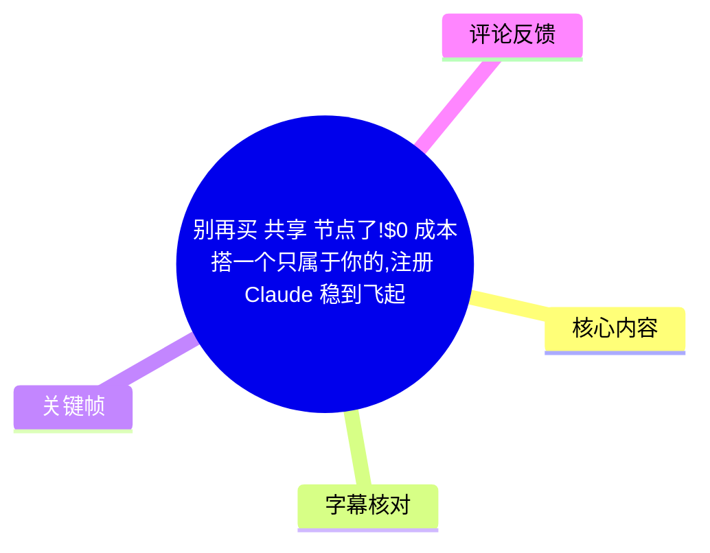
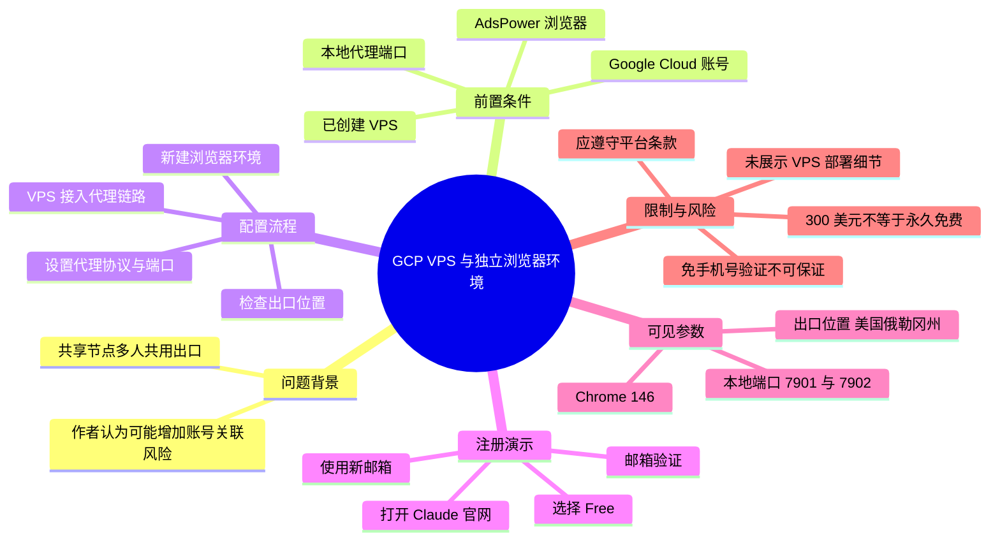
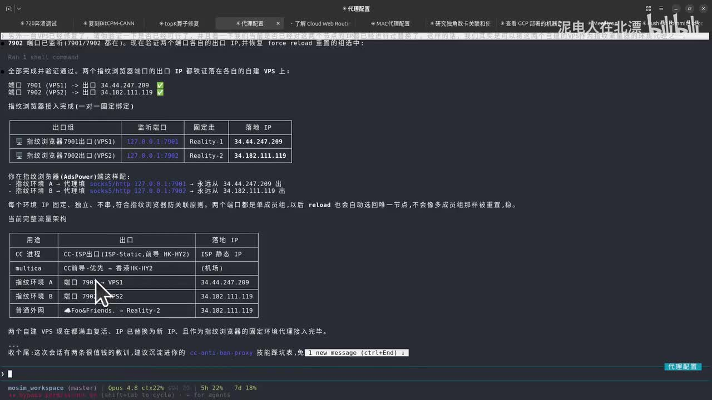
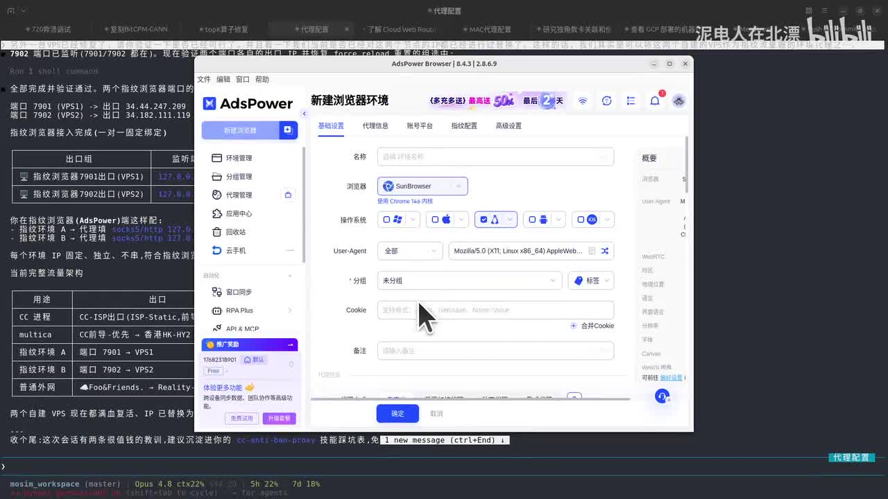
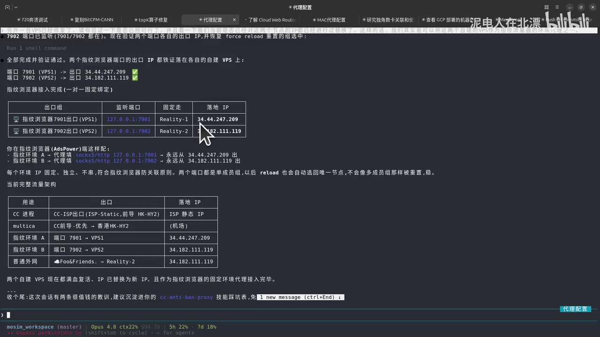

# 别再买“共享”节点了！$0 成本搭一个只属于你的，注册 Claude 稳到飞起

> 来源：[Bilibili 视频](https://www.bilibili.com/video/BV18oTv6iE4N) 
> UP 主：泥电人在北漂｜时长：07:50｜分辨率：1920×1080 
> 标签：Claude、Claude 账号注册、教程攻略、账号

## 小结

视频给出了一套以 Google Cloud VPS（GCP）为网络出口、配合 AdsPower 指纹浏览器创建独立浏览器环境的演示流程。作者的核心判断是：相较购买多人共用的代理/节点，独占 VPS 出口能减少同一 IP 被多人账户共用所带来的环境关联风险。

作者称，GCP 新用户可获得 **300 美元试用额度**，可将其用于创建 VPS；但视频没有展示 GCP 的实际开通、实例规格、计费项目、VPS 代理协议部署命令或防火墙规则。因此，“$0 成本”应理解为作者基于试用额度提出的短期成本说法，而不是长期永久免费承诺。

实操部分从“已有 VPS 节点和 AdsPower”开始：将本机监听端口绑定至 VPS 出口，在 AdsPower 中新建浏览器环境、填写代理信息、检查出口地理位置，再访问 Claude 网站完成邮箱登录/注册演示。画面中可见两个本机监听端口：`127.0.0.1:7901` 与 `127.0.0.1:7902`，分别对应不同 VPS 出口。

视频声称其演示中的 Claude 注册未出现手机验证，并将其归因于网络环境和新邮箱准备。但这只是单次演示结果：注册验证、地区可用性、风控与服务条款均可能随账号、IP、设备、支付资料及平台策略变化。不能据此推导出“必然免手机号验证”或“不会封号”。

适合已经具备 GCP 账户、可自行部署和维护 VPS、并需要把不同工作环境分开的用户。若只是为规避服务验证、绕过地区限制或违反 Claude、Google Cloud、邮箱服务商的规则而操作，视频没有提供合规保证，且存在账号、服务和费用风险。

## 思维导图

## 目录

- [背景、主张与适用范围](#背景主张与适用范围)
- [前置条件与成本说法](#前置条件与成本说法)
- [代理链路与独占出口配置](#代理链路与独占出口配置)
- [AdsPower 浏览器环境设置](#adspower-浏览器环境设置)
- [Claude 注册演示与结果](#claude-注册演示与结果)
- [参数汇总、限制与时效性](#参数汇总限制与时效性)
- [字幕比对](#字幕比对)
- [评论分析](#评论分析)
- [处理记录](#处理记录)

## 背景、主张与适用范围 [00:00](https://www.bilibili.com/video/BV18oTv6iE4N?t=0)

视频开场将问题聚焦在 Claude 账号注册失败、注册后被封等现象。作者提出的解释是：许多购买来的节点属于共享节点，多个陌生用户可能经由同一个公网出口 IP 访问服务；如果一个出口后出现多个账户，可能增加被服务风控系统判定为异常的概率。

这里需要区分三层信息：

1. **视频中的事实陈述**：作者使用 GCP VPS，并在 AdsPower 中建立浏览器环境后，完成了一次 Claude 登录/注册演示。
2. **作者的经验判断**：独占 VPS 比共享节点“更干净”、更稳定，且更不易产生环境关联。
3. **不能由视频单独验证的结论**：共享 IP 是否是某个账号被限制的直接原因、独占 IP 是否可保证注册成功或避免限制，视频均未提供平台侧证据、对照实验或长期成功率。

作者将 VPS 描述为可提供 VPN/代理节点能力的服务器。实际上，VPS 本身仅是云服务器资源；能否成为可用代理出口，还取决于系统配置、代理服务、网络转发、防火墙、出口 IP 信誉、服务地区规则及客户端配置等因素。

## 前置条件与成本说法 [00:39](https://www.bilibili.com/video/BV18oTv6iE4N?t=39)

作者说明，操作前需要具备 Google Cloud 账号，并提到如果观众已经使用过编程工具或相关云服务，创建对应 GCP 资源“相对简单”。

视频中的前提包括：

- 一个可用的 Google Cloud 账号；
- 已创建的 VPS 实例；
- 可将 VPS 接入本地代理/网络工具的配置；
- AdsPower 指纹浏览器；
- 用于 Claude 注册或登录的邮箱；
- 能正常访问相关网站的网络条件。

作者称 GCP 新用户有 **300 美元免费额度**，并建议用该额度创建 VPS 节点。该说法具有明显时效性：

- 新用户试用金额、资格、有效期、适用地区和可使用服务由 Google Cloud 当期规则决定；
- 云资源即使处于试用期，也可能因实例类型、磁盘、静态 IP、流量或其他附加资源产生费用；
- 试用额度耗尽、到期或升级为付费账号后，继续运行 VPS 通常会产生费用；
- 视频没有给出实例地区、机器型号、操作系统、磁盘规格、带宽消耗、月度费用或预算告警设置，无法据此复现实付成本。

因此，视频标题中的“$0 成本”更准确的理解是“作者尝试利用新用户试用额度降低初期成本”，而不是一个可长期普遍复用的成本结论。

## 代理链路与独占出口配置 [01:30](https://www.bilibili.com/video/BV18oTv6iE4N?t=90)

作者表示已创建两个 VPS，并已在其使用的网络工具中配置好节点。视频没有展开“如何创建 VPS”或“如何将 VPS 部署为代理节点”的过程，而是直接进入已完成的配置状态。

画面中展示的终端信息表明，作者建立了两组浏览器代理监听端口和对应的 VPS 出口：

| 浏览器环境/用途 | 本地监听地址 | 对应出口 | 画面可见落地 IP |
| --- | --- | --- | --- |
| 指纹浏览器 7901 出口（VPS1） | `127.0.0.1:7901` | Reality-1 | `34.44.247.209` |
| 指纹浏览器 7902 出口（VPS2） | `127.0.0.1:7902` | Reality-2 | `34.182.111.119` |

画面文字还显示作者认为两个端口是“单成员组”，重新加载配置后会自动回到各自节点，不会被多成员组覆盖。这说明其配置意图是建立**浏览器环境—本地端口—固定 VPS 出口**的一对一映射。

> 图：该关键帧展示 `7901`、`7902` 两个本地监听端口分别指向不同的 VPS 出口，并列出对应落地 IP。它是理解作者“独占出口”和“一环境一出口”主张的直接画面依据；但 IP 是否长期独占、其历史信誉如何，无法仅凭截图验证。

作者称每个环境的 IP 应固定、独立且不串联。这可作为隔离工作环境的一般配置目标，但“固定 IP”不自动等于可信、合规或不会触发服务风控。云 IP 也可能有历史使用记录，且账号风险通常还会综合账户行为、浏览器特征、登录地点、支付信息和服务策略判断。

## AdsPower 浏览器环境设置 [02:28](https://www.bilibili.com/video/BV18oTv6iE4N?t=148)

作者以第二个 VPS 节点为例，在 AdsPower 中创建新的浏览器环境。视频口述中将该工具称为“Power 浏览器”，画面应用标题和界面显示为 **AdsPower**。

可从画面和 ASR 中整理出的设置步骤如下：

1. 在 AdsPower 选择新建浏览器环境。
2. 基础选项大多按默认或自行选择，作者未提出明确的强制要求。
3. 浏览器内核/版本选用画面中可见的 **Chrome 146** 相关选项。
4. 在代理信息中选择代理协议。作者口述可选择 HTTP，也提到另一种协议，但 ASR 对该协议识别不清；画面无法据此确认其准确名称，因此不将其补写为确定参数。
5. 填写或选择本机代理地址与端口。作者示例使用已绑定至第二个 VPS 的 `7902` 端口。
6. 执行代理检查，确认该环境的出口位置。
7. 检查结果显示位置为美国俄勒冈州后，保存环境并打开浏览器。

> 图：该关键帧显示 AdsPower 新环境创建页，能看到“基础设置”“代理信息”等配置标签及浏览器选项。其价值在于说明作者不是直接在普通浏览器中操作，而是先建立独立的浏览器配置档案；截图未完整展示所有代理字段和值，不能替代实际配置文档。

作者称，代理检查通过并显示美国俄勒冈州，说明“环境配置正确”。更严谨地说，这只能说明当时检测服务识别到的出口地理位置符合预期；并不能验证该出口在所有服务中的可用性、稳定性或合规状态。

> 图：该帧放大了第二条 `7902 → VPS2` 的出口记录。它补充了“将本地端口绑定至指定 VPS”这一关键步骤的结果，但未展示代理服务端部署方式、认证信息或防火墙配置。

## Claude 注册演示与结果 [04:08](https://www.bilibili.com/video/BV18oTv6iE4N?t=248)

完成浏览器环境配置后，作者在新打开的环境中进入 Claude 官网并选择登录。视频中的注册/登录路径可概括为：

1. 打开 Claude 官方网站。
2. 进入登录入口。
3. 作者表示不使用 Google 邮箱，而是准备一个“新的自建邮箱”；ASR 将其识别为“字件邮箱”，结合上下文可确认其意图是新准备的邮箱，但具体邮箱服务商和创建方法未展示。
4. 选择创建新账号。
5. 在页面中选择 `Free` 并继续。
6. 填写名字和密码。
7. 登录邮箱，点击验证邮件中的验证链接。
8. 验证完成后进入 Claude 页面，并发起一个简单提问以确认可用。

作者在完成页面出现后表示，本次流程“没有任何手机号验证”，并称账号创建成功。视频尾部还提到，如有创建账号需求，作者可提供协助，但“并不是免费的”。

这一段有几个重要边界：

- 视频仅展示一次具体会话，并没有完整呈现邮箱申请、验证码邮件全文、账户设置或长期使用情况；
- 作者没有公开可复用的账号信息、密码规则、邮箱服务或成功率；
- “不需要手机号验证”是该次演示中的结果，不应理解为 Claude 面向所有用户、所有地区或所有时间点的固定政策；
- 视频未说明该操作是否符合 Claude、Anthropic、Google Cloud、AdsPower 及邮箱服务商的最新条款；
- 本文不将指纹浏览器、网络出口隔离或新邮箱视为绕过平台验证的保证，也不建议以规避验证或规避地区/账户规则为目的操作。

## 参数汇总、限制与时效性 [07:15](https://www.bilibili.com/video/BV18oTv6iE4N?t=435)

### 视频中明确或画面可见的参数

| 项目 | 视频内容 | 说明 |
| --- | --- | --- |
| 云服务 | Google Cloud / GCP | 作者用其创建 VPS；具体区域、规格未公开。 |
| 新用户额度 | 300 美元 | 作者口述；需以 Google Cloud 当期官方政策为准。 |
| VPS 数量 | 2 个 | 作者称已创建两个对应 VPS。 |
| 浏览器工具 | AdsPower | 用于创建新的浏览器环境。 |
| 本地监听端口 | `127.0.0.1:7901`、`127.0.0.1:7902` | 画面可见，分别对应两个出口。 |
| VPS1 落地 IP | `34.44.247.209` | 画面可见，仅代表录制时状态。 |
| VPS2 落地 IP | `34.182.111.119` | 画面可见，仅代表录制时状态。 |
| 浏览器版本选项 | Chrome 146 | 画面中可见的选择项。 |
| 代理协议 | HTTP；另一协议名称不清 | 作者称可二选一，ASR 对另一名称识别不可靠。 |
| 出口检测位置 | 美国俄勒冈州 | 作者在代理检查后口述。 |
| Claude 套餐选择 | Free | 视频注册页面中选择。 |

### 未展示或无法确认的关键内容

- GCP 账号开通及账单验证流程；
- VPS 的机型、CPU、内存、磁盘、操作系统和区域；
- 代理服务软件、协议实现、配置文件、密钥和端口；
- 防火墙、安全组、静态 IP、DNS、流量费用和预算告警；
- AdsPower 的完整指纹参数、代理认证字段和版本兼容性；
- Claude 的地区资格、最新验证要求、账号长期稳定性；
- “共享节点导致封号”“独占 VPS 可防封”的量化证据；
- 作者提供有偿协助的具体价格、交付内容与售后边界。

### 使用与合规提醒

作者的方案可被理解为对不同工作浏览器环境进行网络出口隔离的经验演示。但账户创建与服务访问应遵守所在地法律、云服务与目标平台的服务条款；不要将该视频中的单次结果视为规避身份验证、地区限制或账户风控的通用方法。对于云资源，尤其应主动设置预算、账单提醒、最小权限和资源回收策略，避免试用结束后的意外扣费。

## 字幕比对 [07:30](https://www.bilibili.com/video/BV18oTv6iE4N?t=450)

| 字幕来源 | 完整性 | 专有名词 | 时间轴 | 主要问题 |
| --- | --- | --- | --- | --- |
| Bilibili 站内字幕 | 不可用 | 无法评估 | 无法评估 | 素材记录显示字幕工具报错：`Missing JSON resource URL`；未提供可用站内字幕。 |
| 本次 ASR 字幕 | 覆盖了开场、配置、注册和结尾的大意 | 存在明显误识别 | 未提供逐句时间戳 | 将 AdsPower 识别为“POWER”；Claude 多次识别为“Klolo”“Klod”“Cloud”；将“自建邮箱”误作“字件邮箱”；部分代理协议名称不清。 |

最终采用**本次 ASR 字幕为主，并结合关键帧和上下文做有限校正**。本次 ASR 已执行；站内字幕不可用，因此不存在可合并的站内文本。

重要校正如下：

| ASR 原文/近似识别 | 正文采用 | 校正依据 |
| --- | --- | --- |
| POWER 浏览器 | AdsPower | 关键帧应用窗口标题与界面 Logo 显示“AdsPower”。 |
| Klolo / Klod / Cloud | Claude | 视频标题、标签、描述及上下文均指向 Claude。 |
| 字件邮箱 | 新准备的邮箱 / 作者称“自建邮箱” | 语境为用邮箱接收 Claude 验证邮件；未能确认具体邮箱服务。 |
| A45 | 未确定具体协议 | ASR 识别不可靠，画面材料不足以确认，不作扩写。 |
| Corel 的 146 版本 | Chrome 146 选项 | 关键帧中可见 Chrome 146 相关文字；具体内核实现以工具实际版本为准。 |

## 评论分析 [07:38](https://www.bilibili.com/video/BV18oTv6iE4N?t=458)

可获取热评仅有 **2 条**，少于要求分析的前三条数量；以下仅处理实际可取得的两条，不补造第三条。

1. **华予丶： “up 声音有点小”**
   - 观点：认为视频音量偏低。
   - 补充价值：这是对观看体验的直接反馈，与内容正确性无关。
   - 可采纳性：有限但明确。后续观看者可通过提高播放器音量、佩戴耳机或配合字幕阅读改善理解；创作者若更新内容，可考虑提升人声响度。

2. **洋仔福利派：推广“9.9 兑换 50 元 AI 体验金”**
   - 观点：评论中推广一个付费兑换 AI 体验金的信息。
   - 补充价值：未补充视频中的 GCP、代理、AdsPower 或 Claude 注册步骤。
   - 可信度与风险：该内容属于第三方营销信息，存在重复推广表述，未提供可核验的服务主体、规则、期限或退款机制；不应当作视频内容的事实依据，也不建议在未核实平台资质与条款前参与。

## 处理记录 [07:45](https://www.bilibili.com/video/BV18oTv6iE4N?t=465)

- Worker ID：`worker-mrj0wjed-b0c290ad`
- 模型：`gpt-5.6-terra`
- 调用工具与素材：视频元数据读取、视频素材提取结果、关键帧读取、评论读取、本次 ASR 字幕；素材输出包含 `merged.mp4`、`audio/audio.wav`、`frames/`、`comments/comments.json` 与 `asr/`。
- 字幕选择：站内字幕未获取成功，素材警告为 `Missing JSON resource URL`；已执行并采用本次 ASR。对 AdsPower、Claude、Chrome 146 等名词通过关键帧、标题、标签和上下文校正；对无法确认的代理协议名称保留不确定性。
- 关键帧选择依据：
  - `frames/frame-001.jpg`：展示 AdsPower 新建浏览器环境界面，支持“先创建独立浏览器环境”的操作描述。
  - `frames/frame-002.jpg`：展示 `7901`、`7902` 监听端口及两条 VPS 出口，支持“一环境一出口”的配置结果。
  - `frames/frame-004.jpg`：突出 `7902 → VPS2` 的映射与落地 IP，补充第二个示例节点的关联关系。
- 评论处理：按“仅处理可获取热评前三条”执行；当前可获得 2 条，均已分析，未虚构缺失的第三条。
- 缓存清理：素材未提供缓存清理执行结果或日志，无法确认是否已清理；本文不将其表述为已完成。
- 未解决问题：GCP 计费与试用资格、VPS 部署细节、代理协议与认证配置、Claude 当期验证规则、账号长期稳定性及作者有偿协助的具体条件，均未在素材中充分披露。

## 评论分析

本次流程未获取到可用热评，因此不推断观众态度或额外结论。
