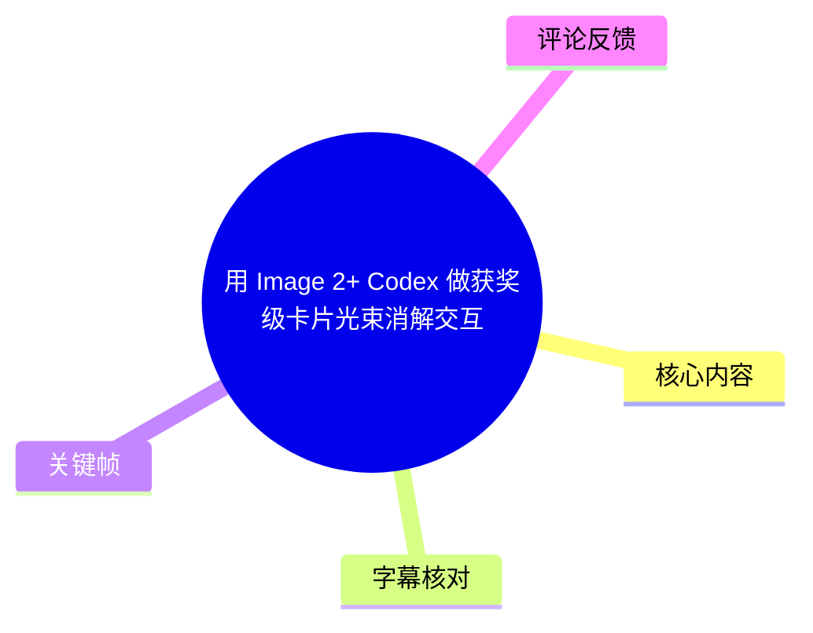
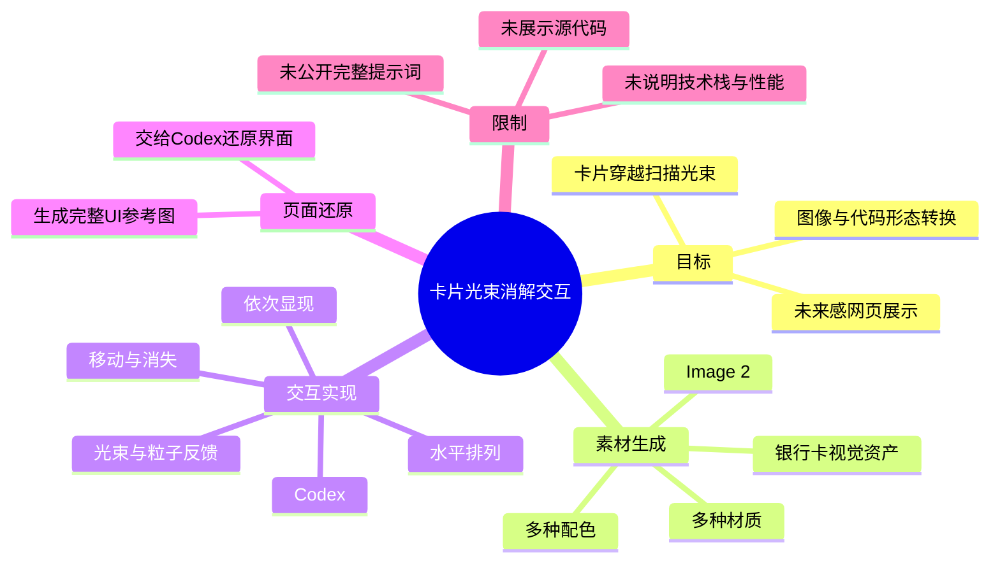
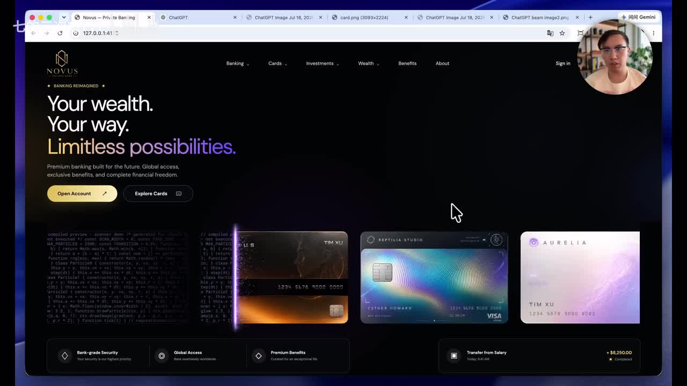
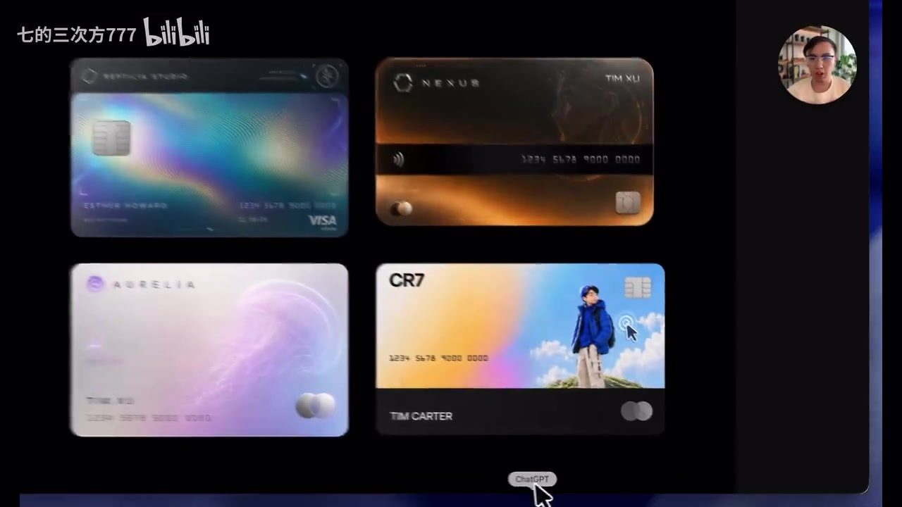
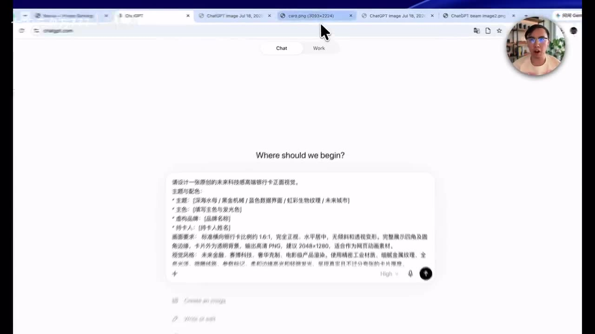

# 用 Image 2+ Codex 做获奖级卡片光束消解交互

> 来源：[Bilibili 视频](https://www.bilibili.com/video/BV12vKq6vE7o)  
> UP 主：七的三次方777｜时长：38 秒｜分辨率：3840×2160  
> 标签：人工智能、Image2、交互设计、Codex、VibeCoding  
> 数据抓取时视频统计：681 播放、33 点赞、68 收藏、4 条回复、4 次分享。

## 小结

本视频展示了一条面向网页视觉交互原型的 AI 工作流：先用 **Image 2** 生成多张不同材质、不同配色的银行卡视觉素材，再将素材交给 **Codex**，实现卡片在水平排列中穿过光束、依次显现、移动并消失的效果；最后生成完整网页 UI 参考图，并让 Codex 按参考图还原界面。

成品的核心不是单张卡片图，而是“**卡片图像 / 代码形态—扫描光束—粒子或光效反馈—完整网站界面**”之间的组合。视频简介将其定位为未来感卡片光束扫描交互，可用作科技官网、AI 产品展示页及创意作品集的设计参考。

可迁移的方法是将任务拆成两层：**图像模型负责视觉资产与界面审美基准，代码模型负责交互行为和 UI 实现**。这样可以避免仅用文字让代码模型同时猜测卡片材质、页面版式和动画逻辑。

但视频是 38 秒的流程演示，不是可直接复刻的完整教程：未展示完整提示词、Codex 输出代码、前端技术栈、动画库、粒子参数、光束实现方式、浏览器兼容性与性能测试。因此，“获奖级”是标题中的创意定位，不应当理解为已有获奖记录或性能结论。

工具名称及界面会随产品版本变化。视频发布于 2026 年 7 月，文中关于 Image 2、Codex 的操作描述仅反映该视频素材所展示的工作流，实际可用入口、模型能力与调用规则应以使用时的产品界面和官方文档为准。

## 思维导图





## 目录

- [背景、目标与适用场景](#背景目标与适用场景)
- [生成银行卡视觉素材](#生成银行卡视觉素材-0000)
- [用 Codex 制作光束消解交互](#用-codex-制作光束消解交互-001756)
- [以完整 UI 参考图还原网站](#以完整-ui-参考图还原网站-001756)
- [可复用的实践步骤](#可复用的实践步骤)
- [参数、证据与限制](#参数证据与限制)
- [字幕比对](#字幕比对)
- [评论分析](#评论分析)
- [处理记录](#处理记录)

## 背景、目标与适用场景 [00:00](https://www.bilibili.com/video/BV12vKq6vE7o?t=0)

视频要解决的问题是：如何从“几张独立的卡片视觉图”快速构建为具有科技感的网页 Hero 区交互。UP 主的描述明确包含以下视觉与行为目标：

1. 多张卡片保持水平排列；
2. 卡片沿扫描光束依次出现、移动与消失；
3. 卡片穿过扫描线时，呈现图像与代码形态之间的转换；
4. 加入光束及粒子反馈；
5. 将交互收束到一张完整的网站 UI 中。

该思路适合需要强调“技术感、产品创新或 AI 能力”的展示型首页，而非主要面向高信息密度业务操作的后台界面。视频简介点名的参考场景包括科技官网、AI 产品展示和创意作品集。

视频画面中的完成页采用深色背景、顶部导航、左侧大标题与 CTA、下部卡片展示及底部信息区的结构。它说明交互被置于完整页面语境中，而不是孤立的特效演示。



> 图：该关键帧展示最终网页的整体构图：黑色主视觉区、导航栏、标题按钮和多张卡片。它有助于判断本案例的交付目标是网页展示界面，而非单独导出的一段动画。

## 生成银行卡视觉素材 [00:00](https://www.bilibili.com/video/BV12vKq6vE7o?t=0)

根据 ASR 在 `00:00:00,000–00:00:14,270` 的内容，UP 主先输入提示内容，使用 Image 系列生成“不同材质和配色的银行卡”，之后将卡片素材交给 Codex。视频标题和简介明确写为 **Image 2 + Codex**；因此，本文将图像生成工具统一记为 Image 2，而不将 ASR 中识别出的“em1”当作可信的模型版本号。

关键在于，生成阶段输出的不是一张风格固定的卡，而是一组可用于横向陈列的候选资产。画面中可见至少四种明显不同的卡片方向：

- 蓝紫渐变、带虹彩纹理的卡片；
- 黑金或暖色光泽卡片；
- 浅紫色、偏柔和发光风格的卡片；
- 蓝天人物图像与深色下半区组合的卡片。

这些差异为页面提供了色彩层次，也为扫描光束经过时的反光、明暗变化和视觉对比留下素材基础。视频没有说明卡片是否经过人工筛选、后期修图或统一裁切，不能据此推断其完全由单次生成直接产出。



> 图：画面直接陈列四张银行卡素材，能验证“不同材质和配色”的资产准备环节。它比单一成品页更能说明后续交互为何需要多卡片序列。

### 提示内容的可见信息

画面中能看到在 ChatGPT 输入框内填写了较长的中文提示，但截图文字清晰度不足，不能可靠逐字转录。可从画面和结果确认其约束方向包括：

- 生成银行卡 / 信用卡样式视觉；
- 需要多种风格、色彩或材质；
- 成果用于后续网站视觉与交互展示。



> 图：该关键帧展示了图像生成前的提示输入步骤，证明工作流确实从自然语言描述开始；但原始文字无法清晰辨认，因此不应把截图中的模糊字符当作可复制提示词。

## 用 Codex 制作光束消解交互 [00:17](https://www.bilibili.com/video/BV12vKq6vE7o?t=17)

ASR 在 `00:00:17,560–00:00:36,940` 中明确说明：将卡片保持**水平排列**，并让它们“沿着光束依次显现、移动和消失”。这是视频中最具体的行为描述。

结合标题、简介和成品画面，可以将交互拆解为以下可观察到的设计意图：

| 层次 | 视频中可确认的内容 | 未被视频公开的实现细节 |
| --- | --- | --- |
| 卡片布局 | 多张卡片水平排列 | 卡片数量、间距、响应式断点 |
| 触发媒介 | 光束 / 扫描线穿过卡片 | 鼠标、滚动、自动循环或点击触发 |
| 时间行为 | 依次显现、移动、消失 | 时长、缓动曲线、延迟与循环策略 |
| 视觉反馈 | 光束和粒子反馈；简介提到图像与代码形态实时转换 | 粒子数量、混合模式、噪声算法与 shader 实现 |
| 交付工具 | 将卡片素材交给 Codex | 具体框架、DOM / Canvas / WebGL 方案及代码 |

视频描述“卡片穿过扫描线时，会在图像与代码形态之间实时转换”。这可以作为成品交互目标理解；不过视频没有提供帧级实现解释，也没有展示代码编辑器或运行时代码，无法确认“代码形态”是文字层、图像贴图、DOM 元素替换，还是视觉化的代码纹理。

### 对 Codex 分工的理解

视频中 Codex 的职责至少包括两部分：

1. 接收已经生成的卡片素材，组织水平卡片序列及光束消解动画；
2. 接收完整网站 UI 参考图，将其还原为可运行的网页界面。

这是一种“图像参考驱动前端实现”的 Vibe Coding 路径。它的优势是能把审美决策提前固化在图像中；其风险则是如果需求没有额外说明，生成代码可能偏重视觉近似，而在语义结构、键盘可访问性、加载策略和适配性上不足。

## 以完整 UI 参考图还原网站 [00:17](https://www.bilibili.com/video/BV12vKq6vE7o?t=17)

在交互完成后，UP 主表示再使用 Image 生成一张完整的网站 UI 参考图，再将该参照图交给 Codex 还原 UI。这里的“先生成整体参照、再写页面”的顺序值得注意：

1. 先由单卡片素材建立视觉语言；
2. 再完成卡片与光束的核心交互；
3. 用完整 UI 图确定导航、标题、按钮、卡片位置和页面层级；
4. 让 Codex 将界面参考图转为网页实现。

最终参考画面可见品牌名 “NOVUS”、顶部导航、左侧英文营销标题、两个按钮、四张卡片及底部功能信息区。文字内容和品牌标识应视为画面示例，视频没有说明其是否可商用或是否涉及真实金融产品。


> 图：该帧同时保留页面导航、英雄文案、按钮和卡片区，可作为“整体 UI 参考图交给 Codex”的视觉依据。其价值在于说明还原对象包含完整布局，而不仅是卡片组件。

## 可复用的实践步骤 [00:00](https://www.bilibili.com/video/BV12vKq6vE7o?t=0)

以下流程依据视频旁白、简介与关键帧整理；其中“步骤顺序”可确认，“具体代码与参数”未公开。

### 1. 明确交互叙事

先定义画面中需要表达的状态变化，而不只是要求“做一个酷炫特效”：

- 初始状态：多张卡片以横向队列呈现；
- 作用事件：扫描光束横向穿行；
- 过程状态：卡片按顺序出现、位移、消失；
- 附加表现：光束发光、粒子反馈、图像与代码形态转换；
- 最终状态：交互嵌入完整网站页面。

这类描述能让图像生成与代码生成对齐同一目标。

### 2. 用 Image 2 建立多样化卡片资产

为卡片素材提供明确的视觉约束：卡片尺寸比例、材质方向、配色范围、芯片和号码等金融卡元素、是否要虹彩反光或发光纹理。视频展示的策略是保留多张不同风格卡片，而非使它们完全同质。

建议在投入编码前人工检查：

- 各卡片长宽比例是否一致；
- 文字和芯片等元素是否因生成而畸变；
- 卡片主体是否有足够留白，便于添加扫描光和代码覆盖层；
- 不同卡片在深色背景上的对比度是否足够。

### 3. 将卡片素材与交互说明一并交给 Codex

不能只提交图片而不描述目标动画。根据视频旁白，最低限度的交互约束应包括：

```text
- 卡片保持水平排列
- 光束沿卡片队列移动
- 卡片按顺序显现、移动、消失
- 加入光束与粒子反馈
- 扫描经过时呈现图像与代码形态的转换感
```

以上为从视频整理的行为清单，不是 UP 主公开的原始提示词或 Codex 指令。

### 4. 生成并确定完整 UI 参考图

在单一交互确认后，再生成完整页面参考图，用它统一以下要素：

- 顶部导航与品牌位置；
- Hero 标题、说明文本与按钮；
- 卡片区域相对于标题的布局；
- 深色背景、渐变光和底部功能模块；
- 页面上各区块的视觉权重。

视频成品中的整体风格偏金融科技 / 高端产品展示，但这种风格不构成唯一实现方案。

### 5. 让 Codex 根据整体参考图还原 UI，并进行人工验收

视频最后展示“参照图交给 Codex 还原 UI”的结果。实际落地时，应额外验收视频未覆盖的工程项：

- 窄屏时卡片横排是否溢出；
- 动画是否支持降低动态效果偏好；
- 粒子和模糊是否造成低性能设备掉帧；
- CTA、导航和卡片是否具备清晰语义与键盘焦点；
- 所使用卡片图、商标、字体是否拥有授权。

## 参数、证据与限制 [00:17](https://www.bilibili.com/video/BV12vKq6vE7o?t=17)

### 已知参数与事实

| 项目 | 可确认信息 |
| --- | --- |
| 视频时长 | 38 秒；音频分析时长为 37.384 秒 |
| 视频分辨率 | 3840×2160 |
| 图像工具 | 标题与简介明确为 Image 2 |
| 代码工具 | Codex |
| 卡片布局 | 水平排列 |
| 动画动作 | 沿光束依次显现、移动、消失 |
| 视觉反馈 | 光束、粒子；简介称有图像与代码形态的实时转换 |
| 页面交付方式 | 生成完整 UI 参考图，再交由 Codex 还原 |
| 适用定位 | 科技官网、AI 产品展示、创意作品集参考 |

### 未公开或不可从素材确认的参数

下列内容均未在视频、字幕或关键帧中给出，不能补写为既定事实：

- 使用的前端框架、CSS 方案与动画库；
- 是否采用 Canvas、WebGL、SVG 或纯 DOM/CSS；
- 粒子数、扫描线宽度、发光强度、颜色值、帧率与动画时长；
- 输入给 Image 2 与 Codex 的完整提示词；
- 图片生成的数量、轮次和筛选标准；
- 页面是否真实部署、源码是否公开；
- 交互的鼠标、滚动、点击或自动播放触发条件；
- 无障碍、移动端适配及性能测试结果。

### 时效性与使用边界

视频元数据对应 2026 年 7 月。Image 2、Codex 的模型名称、访问入口和输出质量会迭代，复刻时不应依赖视频中界面的具体按钮位置或模型下拉选项。涉及银行卡外观时，还应避免使用真实卡号、真实品牌标识和未经授权的金融机构视觉资产。

## 字幕比对 [00:00](https://www.bilibili.com/video/BV12vKq6vE7o?t=0)

| 字幕来源 | 完整性 | 专有名词 | 时间轴 | 主要问题 |
| --- | --- | --- | --- | --- |
| Bilibili 站内字幕 | 未提供可用字幕，无法用于核对 | 无法评估 | 无法评估 | 素材清单明确标注“未提供可用站内字幕” |
| 本次 ASR 字幕 | 覆盖两段旁白；诊断语音覆盖率 90.01% | 存在明显误识别 | 有真实 SRT 时间段 | 将 Image / 提示词等识别为“em”“吉尔茨”，并出现“交产”“卡票”“姿势”等错字 |

本次 ASR 使用 `medium` 模型，识别语言为中文，语言置信度为 `0.99462890625`，运行设备为 CUDA、计算类型为 float16。ASR 给出两段可直接使用的真实时间范围：

- `00:00:00,000–00:00:14,270`：生成不同材质、配色的银行卡，并交给 Codex；
- `00:00:17,560–00:00:36,940`：水平排列、沿光束依次显现移动消失、生成完整 UI 参考图并由 Codex 还原。

最终采用“**ASR 时间轴 + 标题/简介 + 关键帧画面校正**”的方式整理内容。校正原则如下：

- ASR 中的 “em2” 结合标题和简介校正为 **Image 2**；
- ASR 中的 “CodeX / codex” 统一为 **Codex**；
- ASR 的“吉尔茨”无法作为有效专有名词使用。结合画面可确认该位置是输入较长中文提示内容的步骤，但无法可靠逐字还原；
- ASR 中“em1”“em3”缺乏画面与元数据对相应独立模型版本的支持，不能据此断言使用了 Image 1 或 Image 3；
- 未检测到 `noAudioStream=true` 标记；相反，ASR 诊断显示存在可识别音频流，因此没有将字幕缺失误判为工具故障。

## 评论分析 [00:00](https://www.bilibili.com/video/BV12vKq6vE7o?t=0)

本次仅获取到 2 条热评，少于“热评前三条”的上限；以下只分析实际可获取内容，不补造第三条。

1. **你陈哥额**（1 赞）：“这种这么好看的交互一般用在哪里啊”  
   - 观点：关注该视觉交互的实际业务落点。  
   - 与视频的关系：与视频简介给出的“科技官网、AI 产品展示、创意作品集”定位一致，说明观众更关心从视觉案例到使用场景的转化。  
   - 可信度边界：这是提问，不提供额外可验证事实，也不构成对技术效果的评价。

2. **安安zev**（0 赞）：“哥们，你粉丝这么少吗？你在哪个平台的”  
   - 观点：关注创作者的账号规模和其他发布平台。  
   - 与视频内容的关系：不涉及 Image 2、Codex 或交互实现。  
   - 可信度边界：评论未给出平台信息，不能据此推断 UP 主的账号运营情况或外部平台归属。

## 处理记录 [00:00](https://www.bilibili.com/video/BV12vKq6vE7o?t=0)

- Worker ID：`worker-mrj0wbly-5dc4e50c`
- 模型：`gpt-5.6-terra`
- 调用工具与素材：视频元数据读取、音频 ASR 结果读取、SRT 时间轴读取、关键帧多模态核验、热评 JSON 读取。
- ASR 工具信息：`medium` 模型；中文识别；CUDA / float16；音频时长 37.384125 秒；带时间戳。
- 字幕选择：站内无可用字幕；采用本次 ASR 的真实 SRT 时间段作为章节时间锚点，并以视频标题、简介和关键帧校正 ASR 专有名词与明显错字。
- 关键帧选择依据：
  - `frames/frame-003.jpg`：显示中文提示输入界面，支持“自然语言生成卡片素材”的步骤；
  - `frames/frame-004.jpg`：显示四张风格不同的银行卡，支持“多材质、多配色卡片素材”的结论；
  - `frames/frame-001.jpg`：显示完整深色网页布局及卡片区，支持“生成 UI 参考图并还原网站”的交付形态。
- 评论处理：请求上限为 3 条，实际仅获取 2 条；已按可获取内容分析，未将评论当作事实来源。
- 缓存清理：未提供缓存清理执行日志或结果，无法确认是否已清理；本文未声称已完成清理。
- 未解决问题：原始 Image 2 / Codex 提示词、生成轮次、源代码、技术栈、动画参数、可访问性、性能数据及部署地址均未在提供素材中公开。

## 评论分析

- 热评 1：我有个问题，这种这么好看的交互一般用在哪里啊
- 热评 2：哥们，你粉丝这么少吗？你在哪个平台的

以上内容是观众反馈摘录，只用于补充理解视频反响，不作为正文事实依据。
