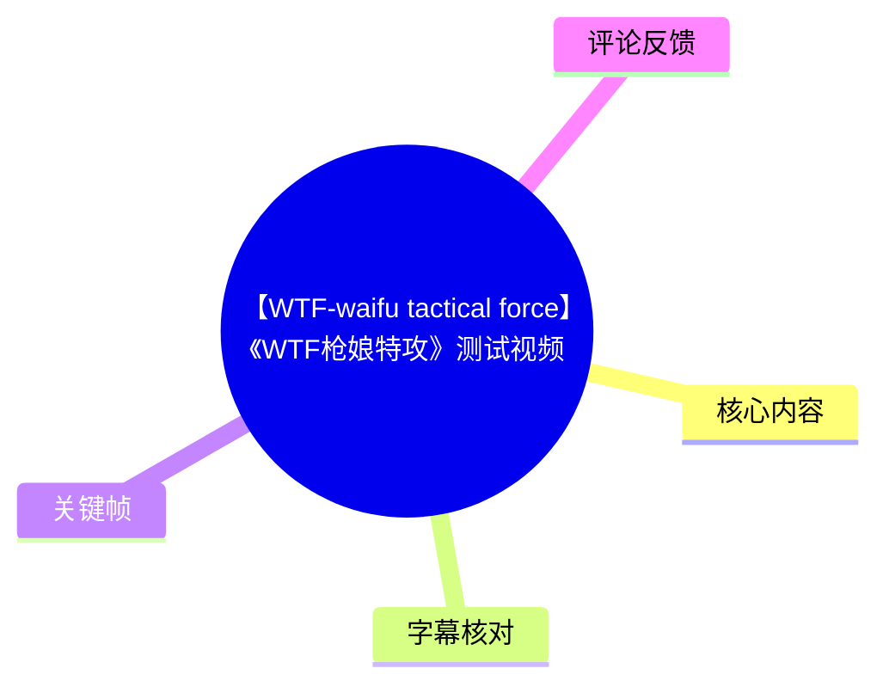
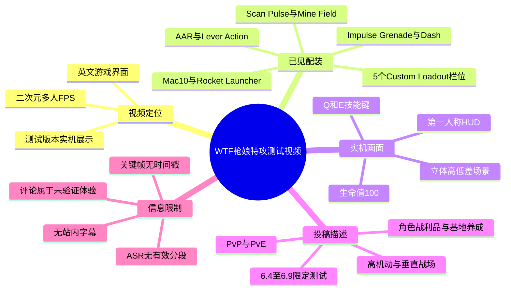
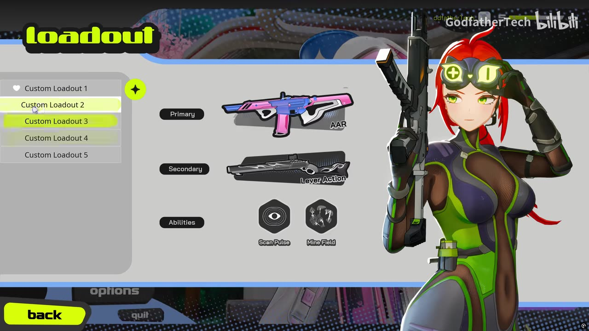
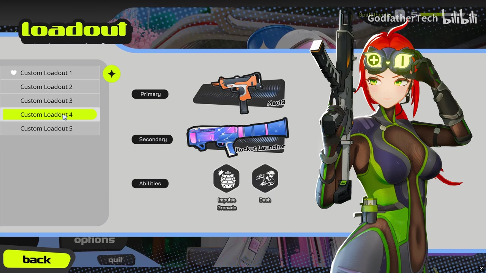
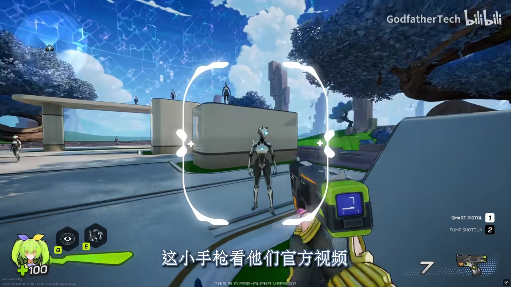

# 【WTF-waifu tactical force】《WTF枪娘特攻》测试视频

> 来源：[Bilibili 视频](https://www.bilibili.com/video/BV1PLEc6oEKY) 
> UP 主：GodfatherTech ｜视频时长：839 秒（约 13 分 59 秒）｜画面分辨率：2848×1602

## 小结

这是一支围绕《WTF - Waifu Tactical Force》（描述中中文名为《WTF枪娘特攻》）测试版本的实机展示视频。根据视频标题、投稿描述、关键帧及画面内文字，该作定位为带有二次元角色视觉风格的多人 FPS，重点宣传高机动、垂直立体战场、PvP/PvE 对战，以及角色与战利品收集、基地养成等系统。

现有画面证据能确认游戏具有英文界面的 `loadout`（配装）菜单，至少展示了 5 个自定义配装栏位；不同栏位可配置主武器、副武器与两项能力。可辨识的组合包括：AAR + Lever Action + Scan Pulse + Mine Field，以及 Mac10 + Rocket Launcher + Impulse Grenade + Dash。

实机第一人称画面中，可见带有立体平台、桥梁和高低差的场景，以及可站上高处的机器人目标/角色模型；HUD 显示角色生命值为 100、技能快捷键 `Q` 与 `E`、武器槽位 `1` 与 `2`。这与投稿描述中“高机动性”“垂直立体战场”的宣传方向相符，但仅凭静态关键帧不能量化移动速度、跳跃高度、技能冷却、武器平衡或实际模式规则。

视频画面内出现中文硬字幕，例如“这不是全英文吗”“这小手枪看他们官方视频”，说明视频至少包含中文解说或字幕层；但本次 ASR 未识别出任何语音分段，且没有站内字幕文件可用。因此，本文不将无法由画面、元数据或评论直接验证的玩法细节写成事实，也不为画面内容虚构精确发生时间。

投稿描述称宣传团队在“6.4-6.9”开展限定测试，并表示若创作者愿意制作视频或直播，可提供游戏激活码。描述没有明确测试年份；结合视频发布时间只能作为当时的招募/测试信息记录，不能据此判断游戏目前是否仍开放测试、服务器状态或激活码是否仍可申请。

适合阅读本文的人包括：希望快速确认本作已展示的武器/技能配装信息的 FPS 玩家、关注二次元射击品类的人，以及需要区分官方宣传、视频画面证据与玩家评论反馈的人。尤其应注意，热评集中提到网络延迟、手柄适配、辅助瞄准与滑墙判定问题，但这些均为玩家个人体验，尚非经视频或开发方材料验证的结论。

## 思维导图

## 目录

- [信息来源、时效与证据边界](#信息来源时效与证据边界)
- [游戏定位与测试招募信息](#游戏定位与测试招募信息)
- [配装菜单：武器与能力组合](#配装菜单武器与能力组合)
- [第一人称 HUD 与立体场景](#第一人称-hud-与立体场景)
- [可复核的操作观察与未知参数](#可复核的操作观察与未知参数)
- [结论、限制与时效性](#结论限制与时效性)
- [字幕比对](#字幕比对)
- [评论分析](#评论分析)
- [处理记录](#处理记录)

## [信息来源、时效与证据边界](https://www.bilibili.com/video/BV1PLEc6oEKY?t=0)

本视频总时长为 839 秒。当前素材没有提供站内 SRT，也没有提供各关键帧对应的抽帧秒数；本次 ASR 虽声明支持时间戳，但结果中 `segments` 为空，因而不存在可据以引用的真实字幕起止时间。

因此，本整理只将 `00:00` 作为视频页面起点链接，不把它误称为下文画面实际出现的时间。涉及配装界面、HUD 与字幕文字的内容均依据给定关键帧本身，而非依据文字先后顺序推定时间位置。

证据层级如下：

1. **可直接确认**：视频元数据、投稿描述、关键帧中可见的菜单文字、武器名称、技能名称、HUD 文字与画面硬字幕。
2. **投稿描述中的宣传口径**：高机动多人 FPS、垂直立体战场、角色/战利品收集、母基地养成、PvP/PvE 等。
3. **玩家个人反馈**：评论中的延迟、手柄适配、辅助瞄准及滑墙判定评价。
4. **不能确认的内容**：具体职业数量、地图数量、对局人数、武器数值、技能效果数值、测试资格规则、当前运营状态，以及评论问题是否普遍存在。

## [游戏定位与测试招募信息](https://www.bilibili.com/video/BV1PLEc6oEKY?t=0)

投稿描述将《WTF - Waifu Tactical Force》称为“有独特二次元画风的高机动性多人 FPS”，并强调玩家可在“快节奏和垂直立体的战场中展现身法”。从该表述及第一人称画面中的多层平台环境看，游戏宣传的核心并不只是传统平面枪战，而是包含高度差与位移空间的战斗场景。

描述还提出以下系统/模式方向：

- **战斗目标**：与队友建立羁绊，在 PvP 或 PvE 中作战。
- **成长要素**：在战斗中收集角色和战利品。
- **基地要素**：打造“终极母基地”。
- **创作者招募**：若有兴趣制作视频或直播，宣传团队表示可提供游戏激活码。
- **测试窗口**：描述写明“6.4-6.9 展开了限定测试”。

这里的“6.4-6.9”未注明年份，也未给出平台、地区、测试容量、申请途径或资格发放条件。它应被视为视频发布前后的阶段性宣传信息，而不是当前可直接执行的参与指南。

此外，视频标题明确使用“测试视频”。这意味着画面中的 UI、平衡与操作实现都应按测试版本理解，不能默认等同于正式上线版本。

## [配装菜单：武器与能力组合](https://www.bilibili.com/video/BV1PLEc6oEKY?t=0)

关键帧显示游戏有题为 `loadout` 的配装页面，左侧可见：

- `Custom Loadout 1`
- `Custom Loadout 2`
- `Custom Loadout 3`
- `Custom Loadout 4`
- `Custom Loadout 5`

页面中部按 `Primary`、`Secondary` 与 `Abilities` 分区，说明至少存在主武器、副武器和能力的组合配置结构。右侧则有一名红发、绿色护目镜风格的二次元角色立绘，强化了游戏以角色形象配合枪械/能力配置的表现方式。

> 图：该帧中高亮的是 `Custom Loadout 2`。主武器标为 `AAR`，副武器标为 `Lever Action`，能力为 `Scan Pulse` 与 `Mine Field`。它直接证明配装页能同时呈现双武器与双能力；但画面没有给出伤害、射速、弹药量、冷却时间或能力机制说明。

### 可见组合一：侦测与布雷倾向

`Custom Loadout 2` 中可读到：

| 配置位置 | 画面可见名称 | 可确认信息 |
| --- | --- | --- |
| 主武器 | AAR | 被列于 `Primary` 栏位 |
| 副武器 | Lever Action | 被列于 `Secondary` 栏位 |
| 能力 1 | Scan Pulse | 图标下方明确标注名称 |
| 能力 2 | Mine Field | 图标下方明确标注名称 |

从名称层面可合理理解 `Scan Pulse` 与扫描/侦测相关、`Mine Field` 与地雷区域相关，但这只是对英文名称的语义解释；画面未展示它们的触发方式、作用范围、持续时间或敌我识别规则。

> 图：该帧中高亮的是 `Custom Loadout 4`。它显示 `Mac10` 主武器、`Rocket Launcher` 副武器，以及 `Impulse Grenade`、`Dash` 两项能力。与上一套相比，名称上更偏向爆炸与位移，但实际战术效用需要动态实机证据验证。

### 可见组合二：冲击与位移倾向

`Custom Loadout 4` 中可读到：

| 配置位置 | 画面可见名称 | 可确认信息 |
| --- | --- | ---|
| 主武器 | Mac10 | 被列于 `Primary` 栏位 |
| 副武器 | Rocket Launcher | 被列于 `Secondary` 栏位 |
| 能力 1 | Impulse Grenade | 图标下方明确标注名称 |
| 能力 2 | Dash | 图标下方明确标注名称 |

`Dash` 明确是“冲刺/突进”语义的能力名称，和投稿描述中的“高机动性”方向一致。`Impulse Grenade` 的中文含义可理解为“冲击手雷”或“脉冲手雷”，但不能仅凭名称断定其是击退、位移、伤害还是控制用途。类似地，`Rocket Launcher` 被列为副武器，表明副武器栏并不局限于手枪类武器。

### 菜单语言与本地化观察

配装界面的系统文字与装备名称均为英文，例如 `Primary`、`Secondary`、`Abilities`、`Custom Loadout`。给定画面中另有中文硬字幕“这不是全英文吗”，可确认视频对游戏英文界面有所提及或吐槽；但由于 ASR 未获得完整上下文，无法可靠还原解说者对本地化、汉化计划或语言设置的完整观点。

## [第一人称 HUD 与立体场景](https://www.bilibili.com/video/BV1PLEc6oEKY?t=0)

> 图：画面展示第一人称视角、道路与高台组成的多层场景，远近多个机器人模型分别位于地面、桥面和高处。它是“垂直立体战场”宣传方向的直观画面证据，但不能单独证明地图机制或角色移动性能。

该帧可辨识的 HUD 元素包括：

| HUD 区域 | 画面信息 | 可确认结论 |
| --- | --- | --- |
| 左下角 | 角色头像、绿色生命条、`100` | 当前展示状态下角色生命值为 100 |
| 左下角技能区 | 两个技能图标，快捷键为 `Q`、`E` | 至少存在两个可由键盘触发的能力槽 |
| 右侧武器区 | `SMART PISTOL 1`、`PUMP SHOTGUN 2` | 画面中存在绑定至数字键 1、2 的两把武器 |
| 右下角 | 数字 `7` 与枪械图标 | 可见一个数值为 7 的计数，但画面不足以确定它代表当前弹匣、备弹或其他资源 |
| 画面中央 | 白色括号式准星/瞄准框 | 游戏采用中心瞄准辅助视觉元素 |
| 底部 | `THIS IS A PRE-ALPHA VERSION` | 此段画面明确标注为 Pre-Alpha（预 Alpha）版本 |

最重要的版本限制是底部的 `THIS IS A PRE-ALPHA VERSION`。它比“测试视频”进一步明确：至少该关键帧所呈现的内容属于预 Alpha 阶段。预 Alpha 版本常会发生 UI、角色、地图、枪械、操作和网络架构变动，因此不能把截图中的界面、武器搭配或数值显示直接视作正式版承诺。

画面底部还有中文硬字幕“这小手枪看他们官方视频”。由于没有有效 ASR 时间段，无法判断这句话前后完整语境，也不能据此判定视频作者对 `SMART PISTOL` 的具体性能评价；只能确认视频中出现了围绕小手枪/官方视频的中文文本。

## [可复核的操作观察与未知参数](https://www.bilibili.com/video/BV1PLEc6oEKY?t=0)

### 从画面可复核的配装查看步骤

以下不是视频完整操作流程的转写，而是根据配装页面可以复核的最小交互结构：

1. 进入标题为 `loadout` 的配装页面。
2. 在左侧的 `Custom Loadout 1` 至 `Custom Loadout 5` 中选择一个配装栏位。
3. 查看该栏位已展示的 `Primary` 主武器。
4. 查看 `Secondary` 副武器。
5. 查看 `Abilities` 下的两项能力。
6. 切换不同配装栏位以比较武器与技能组合。

画面中的 `back`、`options` 等按钮说明菜单底部存在返回与选项入口，但关键帧没有展示鼠标/手柄实际选择过程，也未显示保存、解锁、购买、升级或编辑按钮。因此，不能确认配装是否允许自由替换、是否受角色限制、是否需要解锁，或是否与局外养成系统联动。

### 已见参数与无法获得的参数

| 类别 | 已见信息 | 未见或无法确认的信息 |
| --- | --- | --- |
| 视频长度 | 839 秒；ASR 音频诊断时长为 838.4853125 秒 | 两者约 0.515 秒差异的技术原因 |
| 画面规格 | 2848×1602，横向画面 | 实际录制帧率、码率、图形设置 |
| 配装槽位 | 至少 5 个 `Custom Loadout` 项 | 是否能扩展栏位、是否有角色专属限制 |
| 武器分类 | 主/副武器分栏 | 伤害、射程、后坐力、射速、弹药、换弹、平衡关系 |
| 技能输入 | `Q`、`E` 两个快捷键 | 冷却、消耗、升级、被动技能、手柄映射 |
| 战斗状态 | HUD 展示生命值 100 | 护甲、护盾、复活、治疗及资源规则 |
| 版本标记 | `PRE-ALPHA VERSION` | 版本号、构建日期、更新日志 |

### 不应从画面过度推导的内容

- 高处角色/机器人存在，不等于每个玩家都可到达同样位置。
- 出现 `Dash`，不等于所有角色或全部配装均拥有冲刺。
- 出现 `Rocket Launcher`，不等于其一定可用于对人爆发、破坏地形或火箭跳。
- HUD 的 `7` 不应直接写为“剩余 7 发子弹”，因为画面没有标签。
- 画面中的机器人模型可能是训练目标、AI、角色模型或其他对象，现有素材不能确证其身份。
- 视频内中文文字并不等价于游戏已经具备中文本地化；给定 UI 画面仍主要为英文。

## [结论、限制与时效性](https://www.bilibili.com/video/BV1PLEc6oEKY?t=0)

这支视频最有价值的可验证信息，是它提供了《WTF枪娘特攻》预 Alpha 阶段的配装界面和第一人称 HUD 样貌：游戏至少以“主武器 + 副武器 + 两项能力”为一组配装结构，已见 AAR、Lever Action、Mac10、Rocket Launcher、Scan Pulse、Mine Field、Impulse Grenade、Dash 等名称；同时，实机场景呈现出明显的高低差空间。

从投稿描述看，产品试图结合多人 FPS、二次元角色视觉、高机动战斗、PvP/PvE 以及局外收集与基地养成。然而，这些是宣传团队给出的定位，尚不能替代对实际玩法循环、付费模式、服务器质量、匹配机制与长期内容供给的验证。

主要限制包括：

- 无可用站内字幕。
- 本次 ASR 未识别出任何语音文本或时间段。
- 关键帧没有提供抽帧时间戳，不能为各画面建立可靠的秒级时间轴。
- 画面明确处于 Pre-Alpha；功能、UI、操作与性能均可能发生变化。
- 视频描述中的限定测试日期仅写为“6.4-6.9”，没有年份和当前状态。
- 热评虽指出实际体验问题，但样本仅为前三条可获取热评，不能代表整体玩家群体。

对于想评估该作的人，更稳妥的下一步是寻找带有完整对局、网络延迟显示、控制器实测、滑墙操作、命中判定与版本号的后续材料；尤其应核验测试期后是否发布修复说明或新版本更新，而非只依赖这支测试展示视频。

## [字幕比对](https://www.bilibili.com/video/BV1PLEc6oEKY?t=0)

| 字幕来源 | 完整性 | 专有名词 | 时间轴 | 主要问题 |
| --- | --- | --- | --- | --- |
| Bilibili 站内字幕 | 未提供可用字幕文件 | 无法核对 | 无可用分段 | 素材明确标记为“未提供可用站内字幕” |
| 本次 ASR 字幕 | 无有效内容：`segments` 为空、语句数为 0 | 无法识别 | 虽启用时间戳能力，但无任何可用起止段 | 诊断提示“未识别到语音分段”；识别语言为英文，置信度 0.541015625 |
| 关键帧中的硬字幕/界面文字 | 仅覆盖个别截图 | 可读到部分 UI 与中文硬字幕 | 关键帧未附抽帧秒数 | 无法构成连续字幕，也不能重建完整解说 |

本次 ASR 已被检查：其音频诊断时长为 `838.4853125` 秒，输出语言为 `en`，但没有识别到任何语音片段，`speechCoverage` 为 0。诊断中**没有**标记 `noAudioStream=true`，因此不能称源视频“没有音轨”；只能如实记录为：现有 ASR 对该音频未产出有效文本，且素材未提供可用站内字幕。

最终未采用 ASR 文本作为正文证据，而是使用以下可见文字：

- 界面：`loadout`、`Custom Loadout 1` 至 `Custom Loadout 5`、`Primary`、`Secondary`、`Abilities`。
- 装备：`AAR`、`Lever Action`、`Mac10`、`Rocket Launcher`、`Scan Pulse`、`Mine Field`、`Impulse Grenade`、`Dash`。
- HUD：`SMART PISTOL`、`PUMP SHOTGUN`、`THIS IS A PRE-ALPHA VERSION`。
- 中文硬字幕：“这不是全英文吗”“这小手枪看他们官方视频”。

上述硬字幕与 UI 文字均来自关键帧视觉读取；由于没有对应的 SRT/ASR 起止时间，未为其编造具体秒数。

## [评论分析](https://www.bilibili.com/video/BV1PLEc6oEKY?t=0)

以下仅处理当前可获取的热评前三条，按点赞数列出。评论反映的是用户体验、期待或情绪表达，不应作为游戏机制已经证实的事实。

| 热评 | 观点概括 | 可提供的补充信息 | 可信度与限制 |
| --- | --- | --- | --- |
| 心夏大王（14 赞）：“长官我延迟也是高的离谱，下不去200ms，真没招了” | 认为游戏延迟很高，且无法降到 200ms 以下 | 提出网络体验可能影响测试可玩性 | 没有地区、网络运营商、服务器、测试时间、测速或截图；只能视为单一玩家的网络反馈 |
| 日生穹辰（10 赞）：“你去干掉卡拉比丘喵” | 希望或调侃该作与《卡拉彼丘》竞争 | 反映评论者将本作放入二次元射击品类竞品语境 | 这是主观期待/玩笑式表达，不构成两作玩法、质量或市场表现的比较证据 |
| 雒仁（9 赞）：“纯粑粑现在，手柄适配做的一坨，甚至没有一点辅助瞄准，外加抽象滑墙判定，现在看想抢卡丘生态是痴人说梦” | 对测试阶段的手柄适配、辅助瞄准和滑墙判定持强烈负面态度 | 指出三个可供后续实测验证的方向：控制器映射/适配、瞄准辅助、滑墙判定 | 措辞情绪化，且无设备型号、设置、复现步骤和版本号；不能据此断定所有平台或所有玩家均存在同样问题 |

三条热评共同提示：除美术、配装与机动性宣传外，玩家实际关心的重点还包括网络质量、控制器体验和移动判定。若后续进行实测，应优先记录服务器区域与延迟、输入设备、辅助瞄准设置、滑墙触发条件及版本号，才能将主观反馈转为可复核的问题描述。

## [处理记录](https://www.bilibili.com/video/BV1PLEc6oEKY?t=0)

- Worker ID：`worker-mrj0wbly-5dc4e50c`
- 模型：`gpt-5.6-terra`
- 可用素材与工具产物：视频元数据、投稿描述、12 个关键帧路径、ASR 诊断结果、ASR 输出、热评前三条；素材清单显示已生成 `merged.mp4`、`audio/audio.wav`、`frames/`、`asr/` 与 `comments/comments.json`。
- 字幕检查：已检查站内字幕与本次 ASR。站内字幕未提供可用文件；ASR 使用 `medium` 模型、CUDA、`float16`，自动识别结果语言为英文，但无语音分段。
- 字幕选择：不采用空 ASR 作为内容来源；站内字幕不可用。正文以关键帧可见 UI、硬字幕、视频元数据和投稿描述为依据。
- 关键帧选择依据：
  - `frames/frame-002.jpg`：完整展示 `Custom Loadout 2` 的双武器与双能力结构。
  - `frames/frame-003.jpg`：展示不同配装栏位及 Mac10、Rocket Launcher、Dash 等另一组组合。
  - `frames/frame-004.jpg`：展示第一人称 HUD、武器槽、技能键、高低差场景及 Pre-Alpha 标记。
- 未使用的关键帧：素材仅提供文件路径而未提供全部帧的画面内容和时间戳；为避免对未展示画面编造描述，未引用无法直接核验的帧。
- 时间轴依据：ASR 与站内 SRT 均无可用分段，关键帧也无抽帧秒数；因此仅使用可验证的视频起点 `t=0` 作为章节入口，不对具体画面虚构发生秒数。
- 缓存清理：未提供缓存清理执行记录，无法确认是否已清理；不作“已清理”声明。
- 未解决问题：完整解说内容、关键帧精确时间、音频未识别原因、当前测试/运营状态、网络与手柄问题的复现条件，均需后续取得有效字幕、完整实机录制或官方更新材料后再核验。

## 评论分析

- 热评 1：长官我延迟也是高的离谱，下不去200ms，真没招了
- 热评 2：你去干掉卡拉比丘喵[香奈美·追寻那道光 应援装扮_mvp]
- 热评 3：纯粑粑现在，手柄适配做的一坨，甚至没有一点辅助瞄准，外加抽象滑墙判定，现在看想抢卡丘生态是痴人说梦

以上内容是观众反馈摘录，只用于补充理解视频反响，不作为正文事实依据。
