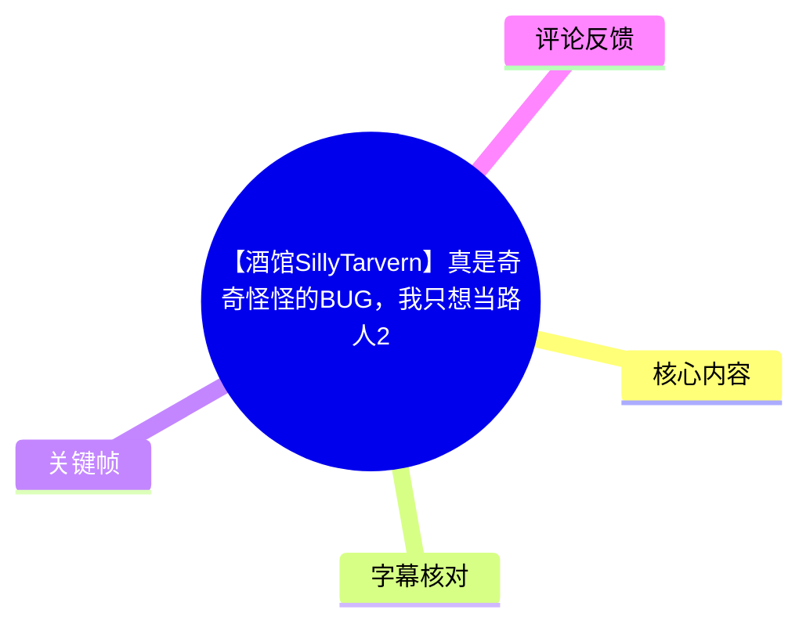
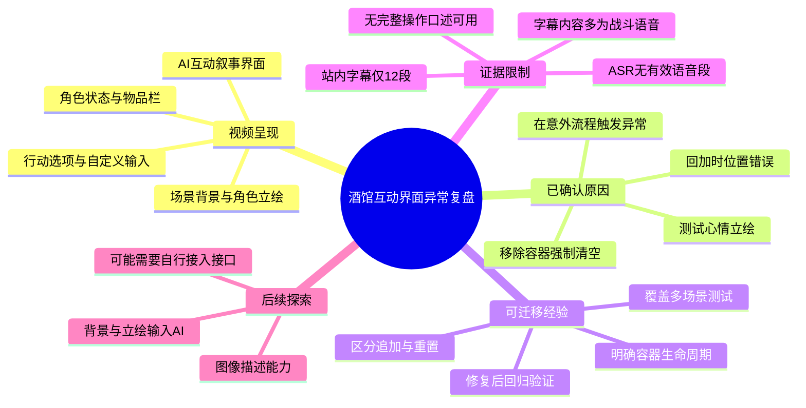
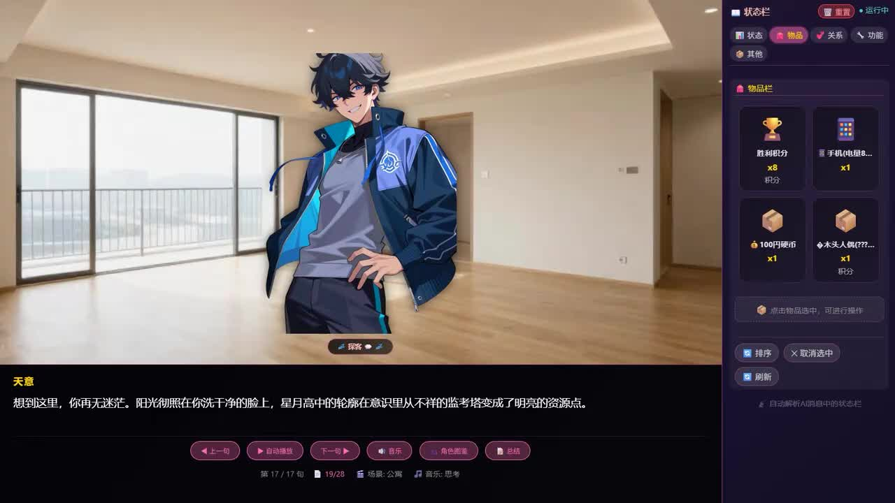
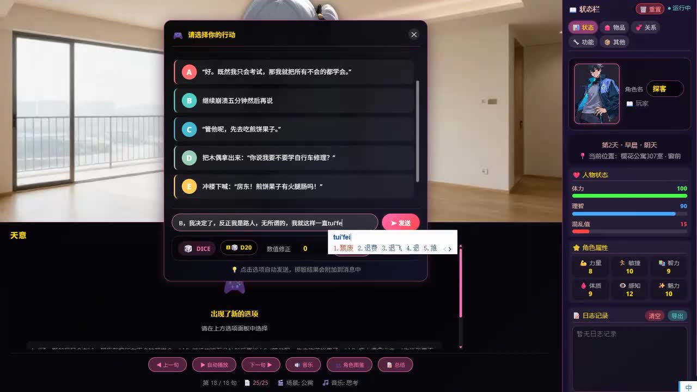
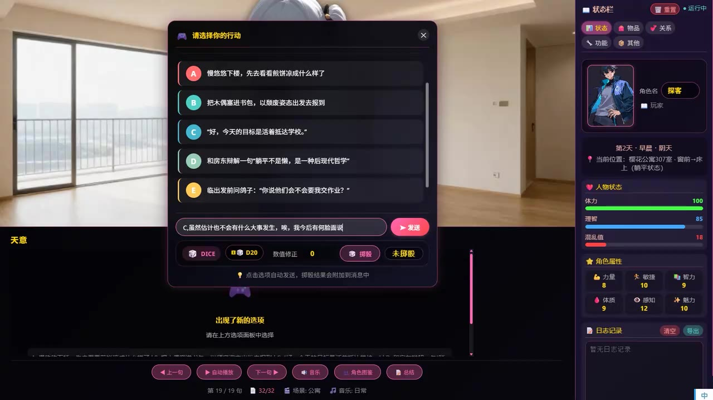
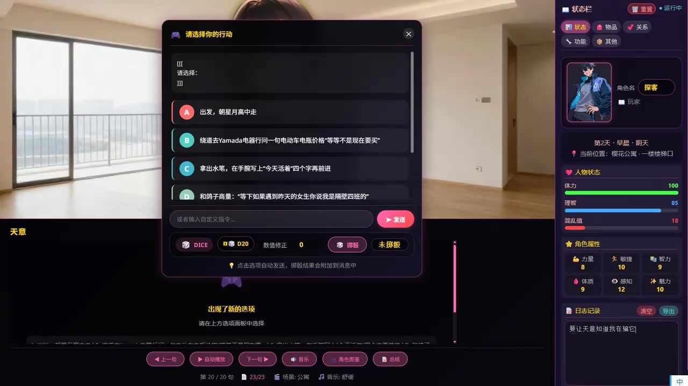

# 【酒馆SillyTarvern】真是奇奇怪怪的BUG，我只想当路人2

> 来源：[Bilibili 视频](https://www.bilibili.com/video/BV1t2Eg64EDo) 
> UP 主：技术探客｜视频时长：36 分 28 秒｜分区集合：AIcode 
> 素材抓取时间：2026-07-15｜视频页面统计：748 播放、20 点赞、15 收藏、4 回复（抓取时数据，会持续变化）

## 小结

视频展示了一个基于“酒馆（SillyTavern）”场景的互动叙事/角色扮演界面在实际使用中出现的异常现象。标题中的“我只想当路人2”对应画面里以“探客”为玩家角色、通过选项或自由输入推动剧情的交互过程；可见界面包含场景背景、角色立绘、行动选项、骰子与属性栏、物品栏、人物状态和日志记录等模块。

本视频最重要的技术信息不来自语音讲解，而是 UP 主在投稿简介中给出的复盘：为测试“心情立绘效果”，其曾为了让同一页面显示多个表情而移除了容器的“强制清空”；之后虽尝试加回该行为，却加到了错误的位置，最终在未预期的流程中造成了异常。这属于典型的**状态容器清理逻辑作用域或调用时机错误**。

从关键帧可见，交互界面多次生成行动选项，并允许玩家在选项外输入自定义行动；但由于 ASR 没有识别出任何有效语音段、站内字幕也只覆盖约 96 至 189 秒的一小段游戏战斗语音，因此无法将整段 36 分钟视频还原为完整的操作口述流程。本文只记录素材中可验证的 UI、投稿简介、字幕和评论信息，不把猜测写成视频事实。

对于开发类似 AI 互动剧情、角色卡或“背景 + 角色立绘 + 状态面板”应用的人，本视频的可迁移经验是：当页面支持同屏多表情或多角色时，需要明确“保留已有节点”和“在场景/轮次切换时清空旧节点”两类操作的边界；修复时不能只确认某个清空函数存在，还应验证它是否挂在正确的容器、正确的生命周期位置和正确的触发条件上。

时效性方面，视频发布于 2026-06-08；酒馆前端、扩展接口以及图像描述能力均可能在之后迭代。尤其评论中涉及“是否有可直接发送图片的函数”的判断，仅代表评论者当时的观察，不能据此断言当前版本的接口能力。

## 思维导图

## 目录

- [视频背景与可确认问题](#视频背景与可确认问题)
- [界面流程与关键帧](#界面流程与关键帧)
- [BUG 原因与可执行排查步骤](#bug-原因与可执行排查步骤)
- [参数、功能边界与限制](#参数功能边界与限制)
- [可用站内字幕片段](#可用站内字幕片段)
- [字幕比对](#字幕比对)
- [评论分析](#评论分析)
- [结论与时效性](#结论与时效性)
- [处理记录](#处理记录)

## 视频背景与可确认问题

视频标题将内容定位为“酒馆（SillyTarvern）”相关的 BUG 展示。画面证据表明，作者使用的是一套带 RPG 化状态栏的互动剧情界面：左侧为场景与立绘，中部为叙事/行动内容，右侧为状态栏。

投稿简介提供了本次异常的唯一明确原因说明：

1. 作者在测试“心情立绘效果”时，希望一个页面中出现多个表情。
2. 为实现上述测试效果，作者去掉了容器的“强制清空”行为。
3. 在后续恢复该行为时，清空逻辑被放到了错误位置。
4. 因此，该逻辑没有只在预期场景生效，而是在某个“奇怪”的使用位置造成了问题。
5. 作者表示，测试阶段原本看起来正常，所以该异常属于未覆盖到的边界流程。

这里的“容器”“强制清空”“错误位置”均来自作者文字说明；素材没有给出代码、DOM 结构、函数名称、调用栈、浏览器控制台输出或具体扩展配置。因此，不能进一步断定它是 `innerHTML` 清空、节点销毁、状态数组重置、CSS 容器替换，还是某个酒馆插件的渲染函数。

## 界面流程与关键帧

### 互动叙事主界面与状态面板

> 图：该关键帧展示了本视频讨论对象的基本界面组成：左侧是室内背景及角色立绘，右侧为“状态栏”，底部有“上一句”“自动播放”“下一句”“音乐”“角色图鉴”“总结”等按钮。它的价值在于说明 BUG 并非孤立文本输出问题，而是发生在一个同时维护背景、立绘、物品、角色数值与剧情进度的复合 UI 中。

从该画面可直接读取到的界面信息包括：

- 当前角色显示为“探客”，标记为“玩家”。
- 右侧标签包含“状态”“物品”“关系”“功能”“其他”。
- 物品栏内可见“胜利积分 ×8”“手机（电量…）×1”“100羽硬币 ×1”“失去人偶(???) ×1”等项目；其中被截断或含问号的名称不应擅自补全。
- 叙事区域显示角色名“天意”，底部进度可见“第 17 / 17 句”和“19 / 28”等计数。
- 当前场景文本旁可见“场景：公寓”，音乐栏显示“思考”。

这说明系统至少提供了剧情句子分页、背景/场景、音乐、角色图鉴、状态与物品管理等可视功能，但无法仅凭截图确认这些模块分别由酒馆原生功能还是外部前端实现。

### 行动选项、自由输入与骰子机制

> 图：关键帧中弹窗标题为“请选择你的行动”，列出 A 至 E 预设选项；下方同时存在自定义文本输入和“发送”按钮。它证明该界面并非只能点击固定分支，而是支持在预设行动与自由文本之间切换。

画面中可确认的交互组件包括：

- 行动弹窗标题：“请选择你的行动”。
- 多个带字母标识的预设选项（A、B、C、D、E）。
- 文本输入框，用户正在输入内容。
- “发送”按钮。
- `DICE` 与 `D20` 控件。
- “数值修正 0”。
- “掷骰”按钮与“未投骰”状态。
- 提示文字：“点击选项自动发送，掷骰结果会附加到消息中”。

因此，若开发者需要复现此类交互，应区分两条消息路径：

1. **点击预设行动**：系统会自动发送选项内容。
2. **输入自定义指令**：用户自行撰写行动后发送。
3. **掷骰结果附加**：界面提示表明掷骰结果会被附加到消息，但素材未展示其具体消息格式或 AI 侧解析规则。

### 选项刷新后的场景状态

> 图：该关键帧保留了行动选择弹窗，同时显示“第2天·早晨·阴天”、位置、体力/理智/混乱值与属性。它有助于理解此界面涉及多种会随剧情轮次变化的状态；这也使容器清理时机变得重要。

该画面中可直接读取的状态包括：

| 状态类别 | 可见内容 |
| --- | --- |
| 时间 | 第 2 天 · 早晨 · 阴天 |
| 位置 | 樱花公寓 307 室 · 窗前 · 床上（部分文字可见） |
| 人物状态 | 体力 100、理智 85、混乱值 18 |
| 角色属性 | 力量 8、敏捷 10、智力 9、体质 9、感知 12、魅力 10 |
| 剧情进度 | 第 19 / 19 句、32 / 32 |
| 场景与音乐 | 场景：公寓；音乐：日常 |

画面本身不能证明这些数值的计算公式、上限规则或与骰子结果的因果关系；只能确认 UI 在这一时刻展示了这些参数。

### 异常选项文本与日志信息

> 图：弹窗顶部出现“[[[”“请选择：”“]]]”一类未经正常整理的文本，下面仍继续生成 A 至 D 行动选项。这一关键帧是“奇奇怪怪的 BUG”最直接的画面线索：生成内容或渲染结果中存在结构化标记残留/格式异常，但仅凭画面不能确定它是否正是作者所述“强制清空位置错误”的唯一表现。 

该帧中可见：

- 行动弹窗顶部出现异常格式片段：`[[[`、`请选择：`、`]]]`。
- 正常的 A 至 D 行动选项仍在后方继续出现。
- 输入框显示占位提示“或者输入自定义指令...”。
- 右侧“日志记录”区域有一条以“要让天意知道我在骗它”开头的记录，但后续内容受画面裁切/分辨率影响，不能完整转录。
- 位置变化为“樱花公寓 · 一楼楼梯口”（画面可见）。

从 UI 表现看，较谨慎的解释是：某些应被消费、替换或清理的结构化输出仍被保留在显示层。该解释与作者“容器强制清空”相关的说明一致，但二者之间的具体程序因果链没有在素材中展示，故仍应保留为基于画面与简介的推断，而非已见代码事实。

## BUG 原因与可执行排查步骤

### 作者已确认的原因

作者在简介中已明确表示，发布视频时已经找到原因。问题不是模型生成质量本身被明确归因为异常，而是前端/容器处理逻辑在测试“多个表情同屏”时被改动后又恢复错误：

> 为了一个页面出现多个表情，去掉了容器的强制清空；加回去时加错了位置。

这说明修复方向应当首先回到 UI 状态管理与渲染生命周期，而不是直接调整模型提示词。

### 可从本案提炼的排查顺序

以下是根据作者已确认原因整理出的工程化排查步骤；其中“步骤框架”是可迁移经验，不是视频展示的逐条实操录像。

1. **先定义立绘容器的状态语义**
   - 同一页面是否允许多个表情/多个立绘共存？
   - 场景切换、角色切换、剧情轮次结束时，旧立绘应保留、替换还是删除？
   - “清空”操作作用于整个容器、指定角色节点，还是仅作用于同一情绪层？

2. **区分“测试需求”与“正式生命周期”**
   - 为测试多个表情而禁用强制清空，可能让旧节点得以保留。
   - 不能把测试时的临时策略直接泛化到所有剧情切换、选项刷新和消息渲染流程。

3. **检查清空函数的挂载位置**
   - 清空操作应只在需要重置立绘状态的事件触发。
   - 若放在过宽的父流程中，可能误删刚生成的内容。
   - 若放在过窄或过晚的位置，则可能保留历史节点、格式残留或重复立绘。
   - 本案作者明确指出“加错位置”，因此调用点比“是否存在清空函数”更值得优先检查。

4. **为同屏多表情设计可验证规则**
   - 如果需求是“一页多表情”，建议以角色 ID、表情 ID、层级或时间戳区分节点，而非简单取消全部清空。
   - 需要规定追加时是否去重、替换时匹配什么键、页面切换时回收哪些节点。
   - 上述设计原则为通用建议；素材未提供该项目实际的数据结构。

5. **进行覆盖边界路径的回归测试**
   - 单角色单表情。
   - 同角色多表情。
   - 多角色同屏。
   - 场景切换后继续生成选项。
   - 自定义输入与预设选项分别发送。
   - 掷骰结果附加后的消息刷新。
   - 长对话、滚动与自动播放。
   - 这些测试能覆盖“测试时正常、在奇怪地方才出错”的典型遗漏路径。

6. **保留可定位证据**
   - 在容器变更前后记录节点数量、角色/表情标识、触发事件和当前场景。
   - 对异常文本如 `[[[`、`]]]`，记录它进入 UI 前的原始模型输出、解析结果和最终 DOM，以区分“模型输出异常”“解析未消费标记”“旧节点残留”三类问题。
   - 素材未提供日志或开发者工具截图，因此不能报告本案的具体节点数量或调用顺序。

## 参数、功能边界与限制

### 可见参数与功能

| 项目 | 画面中可确认的信息 | 不能据此确认的内容 |
| --- | --- | --- |
| 骰子 | `D20`、数值修正 `0`、掷骰状态 | 掷骰算法、成功阈值、随机源 |
| 人物状态 | 体力、理智、混乱值 | 状态变化公式和效果 |
| 属性 | 力量、敏捷、智力、体质、感知、魅力 | 属性如何影响剧情或骰子 |
| 时间/地点 | 第 2 天早晨、天气、房间/楼梯位置 | 时间推进规则 |
| 物品 | 可显示物品与数量 | 获取、消耗和装备逻辑 |
| 行动 | A-E 选项和自由输入并存 | 选项由何模型/提示词/插件生成 |
| 立绘 | 背景上叠加角色形象 | 立绘加载协议、角色 ID、缓存策略 |
| 音乐 | 可见音乐标签与控制按钮 | 实际音频源和播放逻辑 |

### 本素材无法提供的技术细节

本视频及其可用字幕没有提供以下内容，因此不能补写为既定结论：

- 酒馆、扩展、预设、模型或 API 的具体版本号。
- 立绘容器的 HTML/CSS/JavaScript 实现。
- “强制清空”对应的准确函数名、代码片段与调用位置。
- 触发 BUG 的稳定复现步骤。
- 修复后的画面或回归测试结果。
- 模型提示词、世界书、正则、脚本或角色卡配置。
- 画面中异常格式文本究竟由模型原始输出、解析器还是前端渲染导致。

## 可用站内字幕片段

### 站内字幕覆盖的战斗语音 [01:35](https://www.bilibili.com/video/BV1t2Eg64EDo?t=95)

站内字幕仅提供 12 段，覆盖范围为 [01:35.880](https://www.bilibili.com/video/BV1t2Eg64EDo?t=95) 至 [03:09.500](https://www.bilibili.com/video/BV1t2Eg64EDo?t=189)。内容多为疑似游戏内战斗/广播语音，与投稿简介中关于立绘容器 BUG 的说明没有直接对应关系。

| 时间 | 站内字幕原文 |
| --- | --- |
| [01:35.880](https://www.bilibili.com/video/BV1t2Eg64EDo?t=95) | 多少有也不能给 |
| [02:15.740](https://www.bilibili.com/video/BV1t2Eg64EDo?t=135) | 友军部队正在入侵据点 |
| [02:17.620](https://www.bilibili.com/video/BV1t2Eg64EDo?t=137) | Braver2 |
| [02:25.340](https://www.bilibili.com/video/BV1t2Eg64EDo?t=145) | 已压制 |
| [02:28.700](https://www.bilibili.com/video/BV1t2Eg64EDo?t=148) | 据点braver已遭到攻击 |
| [02:44.700](https://www.bilibili.com/video/BV1t2Eg64EDo?t=164) | 敌方兵力剩余不多 |
| [02:46.320](https://www.bilibili.com/video/BV1t2Eg64EDo?t=166) | 行动机制 |
| [02:50.960](https://www.bilibili.com/video/BV1t2Eg64EDo?t=170) | 我在中弹制导导弹已发射据点 |
| [02:56.590](https://www.bilibili.com/video/BV1t2Eg64EDo?t=176) | braver2已被友军肃清 |
| [03:03.140](https://www.bilibili.com/video/BV1t2Eg64EDo?t=183) | 立即构筑新的防线 |
| [03:04.780](https://www.bilibili.com/video/BV1t2Eg64EDo?t=184) | 阻止敌军攻占该区域据点 |
| [03:08.090](https://www.bilibili.com/video/BV1t2Eg64EDo?t=188) | brave me已失守 |

其中 `Braver2`、`braver`、`brave me` 的大小写和分词在字幕内不一致，且“我在中弹制导导弹已发射据点”语义不通顺，说明该站内字幕的专名与断句质量有限。由于没有与之匹配的有效 ASR 段，无法可靠校订这些词。

除上述时间段外，现有素材没有提供可直接使用的可信语音时间轴。因此，本文没有把关键帧画面或简介内容强行绑定到未经证实的秒数位置。

## 字幕比对

| 字幕来源 | 完整性 | 专有名词 | 时间轴 | 主要问题 |
| --- | --- | --- | --- | --- |
| Bilibili 站内字幕 `p01-ai-zh.srt` | 很低：仅 12 段，约覆盖 94 秒；相对 2,188 秒总时长约 4.3% | 较差：`Braver2/braver/brave me` 不一致 | 有效：SRT 起止时间可直接定位 | 内容像战斗广播，与视频 BUG 复盘缺乏直接关联；存在明显断句/识别异常 |
| 本次 ASR（medium） | 无：0 个语音段、0 秒语音覆盖 | 不适用 | 无可用段落时间轴 | 自动语言判定为英语，概率 0.541；诊断显示未识别到任何语音段 |

本次 ASR 已实际检查：`asr-result.json` 显示总时长为 2187.136 秒、`segments` 为空、`sentenceCount` 为 0、`speechCoverage` 为 0。其诊断建议检查音频是否含可识别语音或音轨选择是否正确。

该诊断**没有**标记 `noAudioStream=true`，因此不能将本视频断定为“没有音轨”，也不能把 ASR 为空简单归咎于工具失败。更准确的表述是：本次 ASR 在给定音频上未识别出语音，而站内字幕仅提供有限且质量不稳定的游戏音频片段。

最终字幕策略如下：

- 对有精确时间码的少量片段，保留站内 SRT 原文并提供时间轴链接。
- 不用空 ASR 补写任何台词。
- 对主线问题，优先使用投稿简介中的作者自述与关键帧可见 UI。
- 不把站内字幕中的 `Braver2` 等词与酒馆 BUG、角色立绘或界面状态建立未经证实的联系。

## 评论分析

仅获取到 1 条热评，少于“热评前三条”的上限；以下不扩展分析不存在或未获取到的评论。

### 热评 1：图像输入与描述接口的设想

- 评论者：技术探客（UP 主）
- 点赞数：0（抓取时）
- 核心观点：作者设想将背景和角色立绘直接交给 AI 描述，以缓解“立绘、场景、角色介绍、场景描述不匹配”的问题。
- 补充信息：作者认为酒馆当前提供的函数“好像没有能发送图片的”，但存在“图片描述”功能；因此提出是否需要自行编写接口，并表示会继续研究。
- 可信度与边界：该评论是作者的开发设想和当时的接口观察，能说明其后续研究方向，但不是已经完成的方案，也不是对酒馆当前所有版本/扩展能力的权威结论。是否真的没有可发送图片的函数，仍需以实际版本文档、所用扩展与模型接口能力为准。

该评论与本视频的立绘问题形成了合理的后续方向：如果系统能够基于实际背景和立绘生成或校验描述，理论上可能降低文本描述与视觉元素不匹配的概率；但它并不能自动解决本视频中已经确认的“容器清空位置错误”，后者仍属于前端状态管理问题。

## 结论与时效性

本视频可确认的核心不是一套完整教程，而是一次真实的 UI BUG 复盘：为了支持同页多个心情立绘，作者移除了容器强制清空；恢复时又将清空逻辑放错位置，造成异常在测试未覆盖的流程中出现。

关键帧显示，该项目把场景背景、角色立绘、行动选项、自由输入、掷骰、人物数值、物品和日志放在同一套互动叙事界面中。此类系统的风险点在于多个状态层共用或交错更新：任何“全量清空”“追加渲染”“场景切换”“选项刷新”的调用时机不当，都可能导致旧内容残留、内容误删或结构化文本泄漏到 UI。

可迁移的结论是：

- 多表情同屏不应仅靠取消清空实现，而应定义节点身份、追加规则、替换规则与回收边界。
- 修复容器问题时，应验证调用位置和事件生命周期，而不仅是“把清空代码加回去”。
- 必须测试正常路径之外的组合状态，尤其是场景切换、选项更新、自由输入、自动播放及多角色/多表情并存。
- 对 AI 输出中的结构化标记，应在“原始输出—解析结果—最终渲染”三个阶段保留调试信息。

受限于字幕覆盖不足、ASR 空结果和缺少代码素材，本文不能提供具体补丁、配置参数或稳定复现脚本。视频与评论所涉酒馆功能、图片描述功能和接口可用性均具有版本时效性，应以 2026-06-08 之后实际使用的版本文档与运行环境复核。

## 处理记录

- Worker ID：`worker-mrj0wjed-b0c290ad`
- 模型：`gpt-5.6-terra`
- 使用素材与工具结果：视频元数据、投稿简介、12 张关键帧路径、站内字幕 `p01-ai-zh.srt`、ASR 诊断 `asr/asr-result.json`、热评数据 `comments/comments.json`。
- ASR 检查结果：已检查本次 ASR；模型为 `medium`，自动识别语言为英语（概率 `0.541015625`），识别段数 `0`，语音覆盖 `0`。诊断中未出现 `noAudioStream=true`。
- 字幕选择：以站内 SRT 为唯一可用的带时间码字幕来源，但仅用于保留其原始片段；BUG 成因以作者投稿简介为准，画面理解以关键帧为准；未使用空 ASR 生成台词。
- 关键帧选择依据：选择 `frame-001` 说明总界面与立绘/物品容器并存环境；`frame-002` 说明行动选项、自由输入与骰子；`frame-003` 说明角色状态和场景上下文；`frame-004` 展示异常格式文本残留，是与 BUG 主题最直接相关的画面证据。
- 时间轴依据：只采用站内 SRT 提供的真实起止时间，覆盖 [01:35.880](https://www.bilibili.com/video/BV1t2Eg64EDo?t=95) 至 [03:09.500](https://www.bilibili.com/video/BV1t2Eg64EDo?t=189)；未依据文字顺序为关键帧或简介虚构时间点。
- 评论处理：仅获取到 1 条热评，已完整处理；未虚构第二、第三条。
- 缓存清理：素材清单未提供缓存清理执行记录，无法确认是否已清理；本文不虚报清理完成。
- 未解决问题：异常发生时的具体代码位置、触发条件、完整画面时间点、修复后验证结果，以及评论所述图像接口能力均未在现有素材中得到直接证实。
