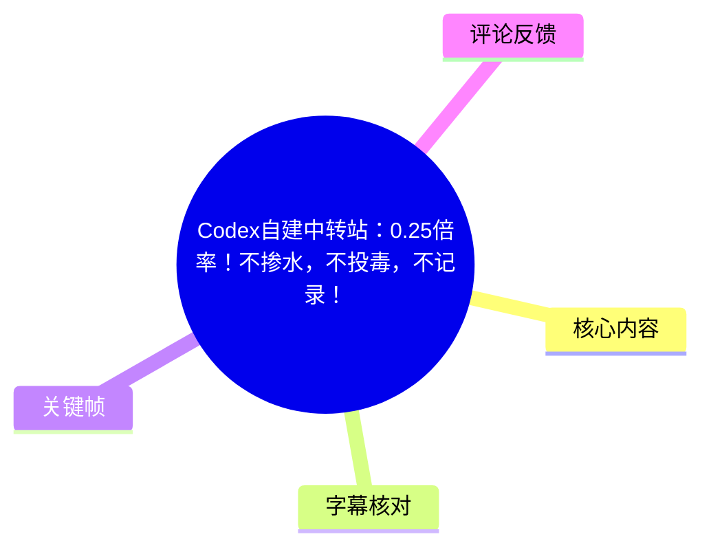
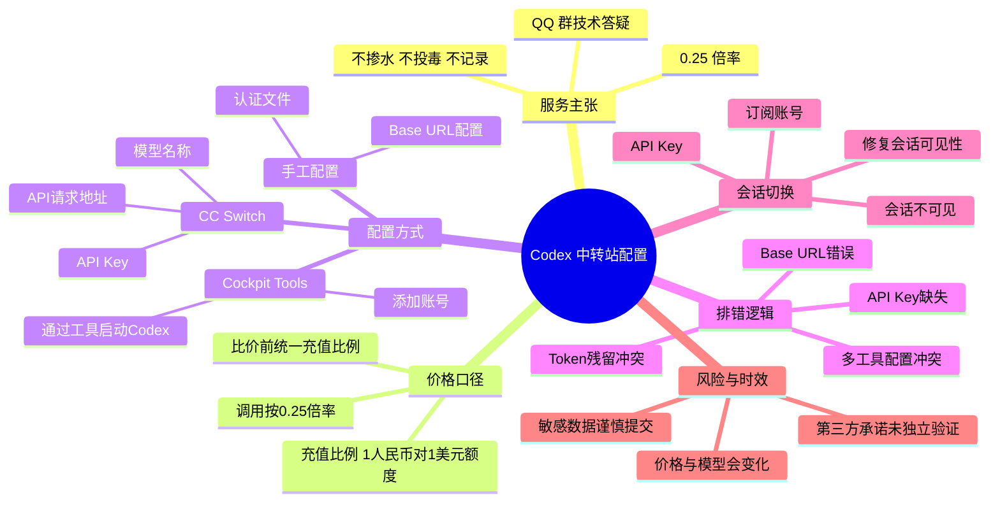
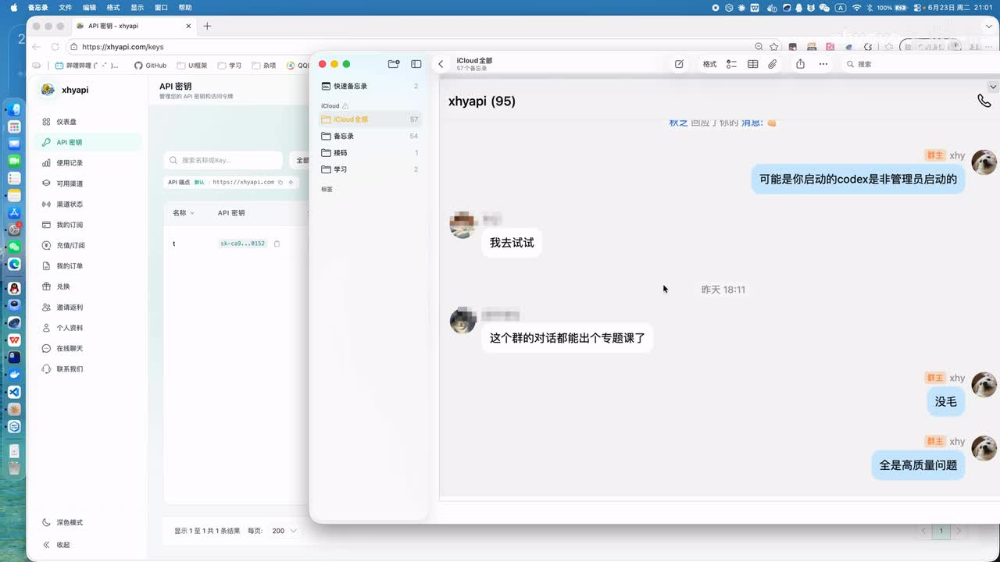
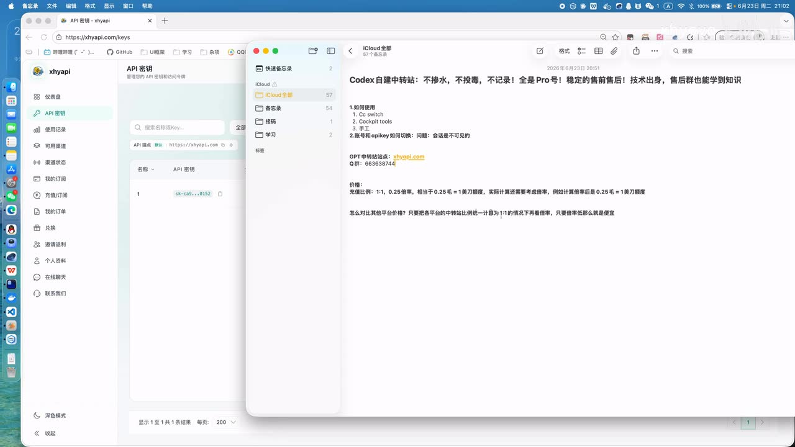
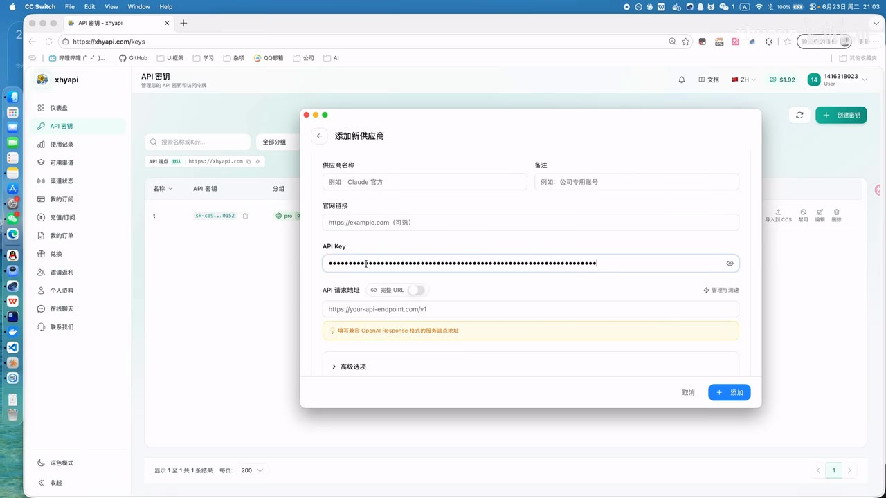
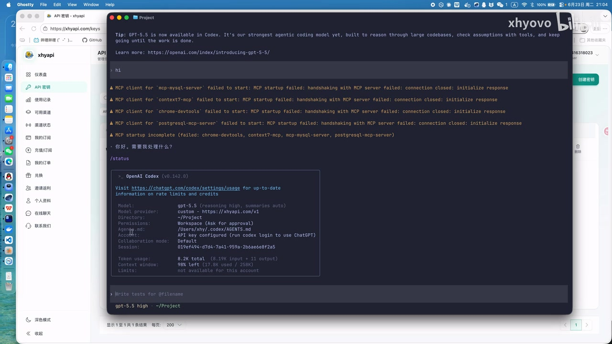

# Codex自建中转站：0.25倍率！不掺水，不投毒，不记录！

> 来源：[Bilibili 视频](https://www.bilibili.com/video/BV1UEjS6wEcP)  
> UP 主：xhyovo｜发布时间：2026-06-23 20:26:47（UTC+8，按元数据时间戳换算）｜时长：12 分 27 秒  
> 内容性质：第三方 Codex API 中转服务介绍、客户端配置与排错演示。价格、隐私、稳定性及模型来源等均为视频中 UP 主的陈述，不构成独立验证。

## 小结

视频介绍了 UP 主自建的 Codex 中转站，并将其卖点概括为“0.25 倍率”“不掺水、不投毒、不记录”“稳定”和 QQ 群技术答疑。UP 主给出的价格口径是：充值比例按 **1 元人民币对应 1 美元额度**计算，实际调用再按 **0.25 倍率**结算；按视频的解释，可理解为约 **0.25 元对应 1 美元额度**。这只是视频发布时的服务方口径，实际价格还受模型、输入输出、缓存、限流、余额规则等因素影响。

视频给出三种对接路径：使用 **CC Switch**、使用 **Cockpit Tools**，以及直接修改 Codex 的本地认证与请求地址配置。前两种方式均通过图形工具填写 API Key 和 API 请求地址；手工方式用于理解底层配置、排查工具残留和认证冲突。

最具通用价值的排错经验是：遇到调用失败时，将问题拆分为 **Base URL 是否正确**、**API Key 是否存在且有效**、以及 **多个工具是否同时写入认证信息**。视频通过故意改错请求地址、移除密钥、删除额外 Token，分别演示了不同故障现象。

后半段讨论订阅账号与 API Key 切换。视频观察到：在其演示环境中，订阅账号（如 Plus、Pro）与 API Key 方式下的 Codex 会话列表不同，呈现“会话不可见”。UP 主称 Cockpit Tools 可以尝试修复会话可见性，而 CC Switch 在该演示中不能实现同类修复；此结论受工具版本、Codex 版本、本地状态及启动方式影响，不能直接泛化。

视频没有展示可审计的隐私政策、日志制度、上游模型授权、服务等级协议、限流与退款规则。因此，“不记录”“稳定”“不投毒”“全是 Pro 号”等均应视为运营方承诺，而不是已经由本整理验证的事实。若请求中包含源码、密钥、客户资料或内部文档，使用第三方中转前应先评估数据与合规风险。

## 思维导图





## 目录

- [服务定位、价格与宣传边界](#服务定位价格与宣传边界)
- [方式一：CC Switch 配置中转](#方式一cc-switch-配置中转)
- [方式二：Cockpit Tools 配置与启动](#方式二cockpit-tools-配置与启动)
- [方式三：手工配置与排错](#方式三手工配置与排错)
- [订阅账号与 API Key 的会话切换](#订阅账号与-api-key-的会话切换)
- [限制、风险与时效性](#限制风险与时效性)
- [字幕比对](#字幕比对)
- [评论分析](#评论分析)
- [处理记录](#处理记录)

## 服务定位、价格与宣传边界 [00:00:00](https://www.bilibili.com/video/BV1UEjS6wEcP?t=0)

UP 主开场表示，视频分享的是其自建 Codex 中转站，并提出以下服务卖点：

1. 不掺水；
2. 不投毒；
3. 不记录用户信息；
4. 稳定；
5. 提供技术支持；
6. 可在 QQ 群交流配置与故障处理思路。

视频还称，群内答疑不只解决表面问题，也会解释问题成因与后续自行处理的方法。就视频内容而言，社群答疑是该服务宣传的一部分。



> 图：左侧为名为“xhyapi”的站点后台 API 密钥页面，右侧为群聊记录，其中出现“这个群的对话都能出个专题课了”等反馈。该帧证明视频展示了密钥后台与社群交流场景，但群聊评价不等同于对服务质量、隐私或稳定性的独立证明。

### 价格口径与倍率理解 [00:00:48](https://www.bilibili.com/video/BV1UEjS6wEcP?t=48)

视频对价格的说明可拆为两层：

| 项目 | 视频中的说法 | 整理说明 |
| --- | --- | --- |
| 充值比例 | 1:1 | 1 元人民币对应 1 美元额度。 |
| 调用倍率 | 0.25 倍率 | UP 主称实际调用会按倍率计算。 |
| 视频解释 | 约 0.25 元对应 1 美元额度 | 这是 UP 主对其计费口径的概括。 |
| 横向比价 | 先统一为 1:1，再比较倍率 | 只有在模型、计费规则与限制可比时，低倍率才可直接代表更低成本。 |
| 模型定价基础 | 以美元计算 | UP 主称技术上模型价格以美元计。 |

视频的比价逻辑是：先将不同中转站的充值兑换关系统一到同一口径，再比较调用倍率。这个逻辑存在前提：比较对象必须使用相同或类似模型，且输入、输出、缓存、上下文、并发、限流、工具调用、服务费等规则也应相近。仅比较“倍率”不能完整判断最终成本。



> 图：备忘录中列出“CC switch”“Cockpit tools”“手工”三种使用路线，并展示“充值比例：1:1、0.25 倍率”等文字。这一帧用于确认视频的整体结构和 UP 主的价格表达口径。

### 宣传边界

视频未展示日志审计、隐私协议、源代码、模型采购链路、独立检测材料或 SLA。因此下列内容只能记录为服务方主张：

- “不记录用户信息”；
- “不投毒”；
- “稳定”；
- “全是 Pro 号”；
- 具体模型和模型名称的长期可用性。

使用第三方转发服务时，API 请求、提示词、源代码、模型输出、IP 信息、账户信息和用量数据可能经过该服务运营方。处理敏感项目时，不应仅依据视频宣传判断安全性。

## 方式一：CC Switch 配置中转 [00:01:42](https://www.bilibili.com/video/BV1UEjS6wEcP?t=102)

视频首先演示通过 **CC Switch** 添加自定义供应商。站内字幕在这一段没有实际语音文本，因此本节以本次 ASR 的真实时间段为时间依据，并以画面校正工具名称和字段。

### 操作步骤

1. 打开 CC Switch，进入添加自定义供应商的界面。
2. 在中转站后台进入“API 密钥”页面。
3. 创建 API Key；视频称创建时选择 **Pro 分组**。
4. 复制生成的 API Key。
5. 将 API Key 填入 CC Switch 的 **API Key** 字段。
6. 将中转站提供的 API 请求地址填入 **API 请求地址**或端点字段。
7. 填写供应商名称或备注。
8. 设置模型名称；视频称其站点使用 `GPT-5.5` / `gpt-5.5`。
9. 点击“添加”，再启用该配置。
10. 启动 Codex 并发起测试请求。
11. 在 Codex 状态信息中确认模型提供商、模型名和 API Key 认证状态。



> 图：CC Switch 的“添加新供应商”窗口中可见“供应商名称”“备注”“官网链接”“API Key”“API 请求地址”等字段，并提示填写兼容 OpenAI Response 格式的服务端地址。该帧直接说明视频配置的核心参数是 API Key 与请求地址。

### 关键参数

| 参数 | 用途 | 视频中的注意点 |
| --- | --- | --- |
| API Key | 用于服务端认证 | 是敏感凭据，不应上传到公开仓库、截图或群聊。 |
| API 请求地址 / Base URL | 指向中转服务端 | 填错会导致请求失败。 |
| 供应商名称 | 在 CC Switch 中识别配置 | 可自定义，不等于模型名。 |
| 模型名称 | 选择实际调用模型 | 视频中出现 `gpt-5.5`，其他中转站可能采用自定义名称。 |
| Pro 分组 | 视频称创建密钥时选择 | 分组权限与价格应以当期站点页面为准。 |

ASR 在约 00:02:30 处将 URL 后缀识别为“后面加上一个 -VE”，该表述不清晰，且画面没有完整展示最终 URL。因 URL 是高风险配置参数，不能据此给出确定拼接规则。实际应以服务端“使用密钥”页、客户端字段说明或 API 文档为准。

### 连通性验证 [00:03:06](https://www.bilibili.com/video/BV1UEjS6wEcP?t=186)

UP 主测试后查看 Codex 状态，并称当前模型服务商为自定义供应商、认证方式为 API Key。实际验证时，至少应检查：

- 请求是否获得正常返回；
- 当前生效的提供商是否为预期地址；
- 当前认证是否为 API Key；
- 模型名是否符合已购买或已授权的模型；
- 是否同时存在与本次中转无关的工具或 MCP 错误。



> 图：终端状态中可见 `Model: gpt-5.5`、自定义模型提供商 URL，以及 `API key configured`。顶部还有多个 MCP Client 启动握手失败警告。该帧的价值是同时区分：API 中转配置被识别，不代表 MCP 服务也已正常启动。

## 方式二：Cockpit Tools 配置与启动 [00:03:30](https://www.bilibili.com/video/BV1UEjS6wEcP?t=210)

ASR 将第二个工具识别为“CLCKPIT”“CLCI”等不同拼写；结合画面提纲中明确写出的 “Cockpit tools”，本文统一称为 **Cockpit Tools**。

### 配置与启动步骤

1. 在 Cockpit Tools 中添加账号或供应商配置。
2. 填入 API Key。
3. 填入中转站提供的服务地址。
4. 视频称此工具中的地址“可以不用加 V1”，但这是 UP 主口语化的经验表述，不应替代当前工具和服务端文档。
5. 添加完成后，关闭 CC Switch。
6. 在 Cockpit Tools 中选择对应 Codex 的中转或启动方式。
7. 关闭正在运行的原生 Codex App。
8. 必须通过 Cockpit Tools 启动 Codex，以使该工具接管的配置生效。
9. 再执行一次实际访问测试。

### 不要让多个工具同时接管配置 [00:03:49](https://www.bilibili.com/video/BV1UEjS6wEcP?t=229)

UP 主明确提醒，CC Switch 与 Cockpit Tools 的配置会“打架”。从后续 Token 残留案例可见，这类工具可能修改相同的 Codex 认证或端点配置。

建议的切换顺序：

1. 退出 Codex；
2. 关闭当前接管配置的工具；
3. 只启用一个配置工具；
4. 核对 API Key、Base URL、模型名及当前激活账号；
5. 通过对应工具重新启动 Codex；
6. 用真实请求验证，而不是只看配置是否保存。

如果长期需要在多个工具间切换，应先备份本机配置文件；备份内可能包含密钥或 Token，必须避免同步到公开位置。

## 方式三：手工配置与排错 [00:04:37](https://www.bilibili.com/video/BV1UEjS6wEcP?t=277)

UP 主将手工方式称为“最原始的原理”：理解 Codex 的认证配置与 Base URL 配置后，即使不依赖特定图形工具，也可自行完成配置和故障定位。

视频称不同操作系统的配置位置不同：Windows 的配置位于用户信息目录下；演示环境为 macOS。由于素材未提供可清晰核对的完整目录路径，不应将 ASR 的口述转写直接当作准确路径。

### 两类重点配置 [00:05:09](https://www.bilibili.com/video/BV1UEjS6wEcP?t=309)

ASR 将两个文件识别为“`os.json`”和“`config.tor` / `c`”。其中第二个文件名明显不完整，且没有对应可核验的画面文字。可以确认的结构关系是：

```text
认证配置
└─ 保存 API Key、Token 或其他认证状态

请求配置
└─ 保存 Base URL / API 请求地址等连接设置
```

因此，正文不确认上述文件名或扩展名。实际操作应以当前 Codex 版本的官方文档、本机已有文件或所用工具导出的配置为准，不要根据 ASR 误识别结果新建文件。

### 用故意改错区分故障来源 [00:05:37](https://www.bilibili.com/video/BV1UEjS6wEcP?t=337)

视频依次演示了两类错误：

1. **改错 Base URL**  
   UP 主在请求地址后增加额外字符，并说明此时请求无法正常执行。  
   这说明当调用失败时，应先检查域名、路径、版本路径与网络连通性。

2. **恢复地址后改动认证信息**  
   UP 主恢复请求地址，再改动保存密钥的 JSON 配置，随后出现“API Key 不存在”的报错。  
   这说明端点恢复不等于认证恢复；Base URL 与密钥必须分别确认。

| 现象 | 视频中的对应原因 | 优先检查项 |
| --- | --- | --- |
| 请求无法运行 | 请求地址被改错 | Base URL、路径、版本号、网络、代理。 |
| API Key 不存在 | 密钥配置不存在或失效 | Key 是否完整、当前工具是否覆盖认证、是否选错账号。 |

### Token 残留导致冲突 [00:06:54](https://www.bilibili.com/video/BV1UEjS6wEcP?t=414)

UP 主恢复密钥后仍发现调用异常，检查认证 JSON 后发现除 API Key 外还存在一个 Token。视频称该 Token 由 CC Switch 写入；删除后再次测试，配置恢复可用。

这一段可提炼出以下经验：

- API Key 与 Token 可能同时保存在同一认证范围内；
- 客户端最终选择何种认证，可能受字段优先级、工具版本及启动方式影响；
- 图形配置工具可能留下额外认证字段；
- 删除字段前应先离线备份配置；
- 排障时应先确认字段来源和作用，不要无差别删除认证信息。

视频最后把对接简化为“Base URL + API Key”。这适用于其演示场景，但不意味着所有 Codex 版本、认证方式或中转协议都只需要这两个参数；账户登录、组织权限、模型映射、网络代理、证书与工具版本也可能影响调用。

## 订阅账号与 API Key 的会话切换 [00:07:21](https://www.bilibili.com/video/BV1UEjS6wEcP?t=441)

UP 主将两种使用方式区分为：

- **订阅账号方式**：使用 Plus、Pro 等订阅账号登录；
- **API Key 方式**：通过 API Key 调用，包括视频中的中转站配置。

视频称，在其演示环境中，两种方式切换后 Codex 会话列表不一致，即“会话不可见”。UP 主将此描述为 Codex 自身系统带来的问题。

### 视频中的对比流程 [00:08:11](https://www.bilibili.com/video/BV1UEjS6wEcP?t=491)

1. 在 CC Switch 中恢复已经可用的 API Key 配置。
2. 添加并启用官方账号方式。
3. 退出后以账号方式重新登录。
4. 打开 Codex，观察并记住当前会话列表。
5. 切换回 API Key 方式。
6. 再次打开 Codex，观察到会话列表与账号方式不同。

视频没有展示会话数据具体存储位置、服务端同步机制、工作区绑定关系或完整客户端日志。因此可以记录的事实仅是：UP 主在该环境中观察到账号方式与 API Key 方式呈现不同会话列表；不能进一步推断两者会话必然永久隔离。

### Cockpit Tools 的会话可见性修复 [00:10:56](https://www.bilibili.com/video/BV1UEjS6wEcP?t=656)

UP 主随后使用 Cockpit Tools 演示：

1. 关闭原生 Codex；
2. 在 Cockpit Tools 中选择另一个账户或配置；
3. 通过 Cockpit Tools 启动 Codex；
4. 画面短暂出现“正在修复 Codex 会话可见性”的提示；
5. 再切换回 API Key 方式后，视频称会话列表与此前一致；
6. 工具中还存在“会话管理”和“手动修复可见性”入口。

视频同时称 CC Switch 不能完成该修复。该结果可能与工具实现、工具版本、Codex 版本、账户状态、本地缓存和操作顺序有关，应在自己的环境中验证。

### 切换配置时的检查清单

- 切换前先退出正在运行的 Codex；
- 确认本次使用的是订阅账号还是 API Key；
- 不要同时让多个工具修改 Codex 配置；
- 记录切换前的工作区和关键会话，避免误以为会话被删除；
- 在执行“修复可见性”前备份本地配置；
- 不要把“会话列表相同”理解为权限、账单、模型可用性和数据策略也相同；
- 修复操作涉及本地状态时，应先用非生产环境或无敏感数据的账户测试。

## 限制、风险与时效性 [00:12:05](https://www.bilibili.com/video/BV1UEjS6wEcP?t=725)

视频结尾引导用户到 QQ 群联系客户服务，并访问站点充值订阅。以下关键事项没有在视频中得到展示或独立验证：

| 未展示或未验证事项 | 重要性 |
| --- | --- |
| 是否记录请求、保存多久、谁能访问 | 影响代码、提示词、文件和账户信息隐私。 |
| 上游模型来源与授权链路 | 影响模型真实性、合规性与持续可用性。 |
| 输入、输出、缓存、工具调用计费 | 单一倍率无法完整解释总成本。 |
| 并发、限流、上下文长度、超时、重试 | 直接影响“稳定”的实际体验。 |
| 退款、故障补偿和 SLA | 影响充值后的服务保障。 |
| API Key 的撤销、轮换和权限控制 | 关系到密钥泄露后的风险控制。 |
| 配置工具改写的本地文件范围 | 关系到配置冲突、恢复成本和会话问题。 |

### 安全建议

1. 先创建低余额或最小范围的测试 Key，验证连通性、模型、用量与计费。
2. 不要把 API Key、Token、Base URL 截图、配置文件上传至公开仓库或聊天群。
3. 发送源码、客户资料、数据库结构和内部文档前，先确认第三方服务的数据处理规则。
4. 在使用 CC Switch、Cockpit Tools 等工具前备份本机 Codex 配置。
5. 每次切换工具后重新确认当前模型、当前认证、当前端点和当前账户。
6. 优先相信服务端当前“使用密钥”页面或正式 API 文档，不要只依据视频中的“加不加 V1”等口头经验。
7. 将 MCP 启动错误与 API 中转连通性分开排查；前者不必然说明 API Key 或 Base URL 配置失败。

### 时效性

视频发布于 2026 年 6 月。以下信息均可能随时间变化：

- 中转站域名、访问方式和充值入口；
- 价格、充值比例与倍率；
- 分组权限和订阅规则；
- 模型名称、模型版本与可用性；
- Codex 配置目录、配置格式和认证字段；
- CC Switch、Cockpit Tools 的功能与界面；
- 会话修复机制与兼容性。

视频及关键帧中出现的 `gpt-5.5` 只是当时演示中的模型标识，不代表任何服务在当前仍提供相同模型、价格或行为。

## 字幕比对 [00:00:00](https://www.bilibili.com/video/BV1UEjS6wEcP?t=0)

| 字幕来源 | 完整性 | 专有名词 | 时间轴 | 主要问题 |
| --- | --- | --- | --- | --- |
| Bilibili 站内字幕 `p01-ai-zh.srt` | 极低，仅覆盖约 00:00:07—00:00:56 | 无技术讲解名词 | 有真实 SRT 时间轴 | 全部为“♪ 音乐 ♪”，不能承担正文内容。 |
| 本次 ASR 字幕 | 较高，共 47 段，语音覆盖约 592.25 秒，占视频约 79.31% | 多处工具名、文件名和 URL 片段不稳定 | 有真实分段起止时间，可用于章节定位 | 存在误听、词语截断、停顿空白与专有名词混淆。 |

### 字幕选择与校正

正文采用 **本次 ASR 的带时间轴分段**作为章节时间依据，因为站内字幕没有实际讲解内容。本次 ASR 已实际检查：识别语言为中文，语言置信度约 `0.9976`，诊断中未出现 `noAudioStream=true`，说明该源视频具有音轨；不是无音轨视频，也不是工具失败。

以下词语依据关键帧和上下文进行了有限校正：

| ASR 中的不稳定识别 | 正文处理 | 校正依据 |
| --- | --- | --- |
| “CJSwitch”“CDS维系” | 统一为 **CC Switch** | 关键帧顶部菜单显示“CC Switch”。 |
| “CLCKPIT”“CLCI” | 统一为 **Cockpit Tools** | 视频提纲画面中可见“Cockpit tools”。 |
| “GPD-5.5” | 记为 `gpt-5.5` / `GPT-5.5` | Codex 状态帧中可见 `Model: gpt-5.5`。 |
| “os.json”“config.tor / c” | 不确认精确文件名 | ASR 对文件名存在明显截断，给定关键帧未展示完整文件名。 |
| “后面加上一个 -VE” | 不给出确定 URL 规则 | ASR 不清晰，画面也未提供完整端点。 |

## 评论分析 [00:00:00](https://www.bilibili.com/video/BV1UEjS6wEcP?t=0)

本次素材仅获取到热评 **2 条**，少于“热评前三条”的数量；因此仅分析可获得的两条，不补造第三条。

1. **爱潜水的ml（获赞 2）**  
   评论：“哎怀念白票的时光一天5亿token.每天都是goal跑一天[笑哭]，现在不行咯花米都太贵了”。  
   - 观点：该用户感受到 AI 编程模型的使用成本相较过去上升。  
   - 补充价值：说明视频的低倍率宣传切中了部分用户对成本的关注。  
   - 可信度边界：评论未给出服务、模型、时间范围、用量记录或账单证据，不能用于证明本视频中转站确实更便宜。

2. **Scorpion丶泽（获赞 2）**  
   评论：“用了一段时间，还挺稳定的，价格也便宜，不吹不黑，站长还能解惑”。  
   - 观点：该评论者认可稳定性、价格与答疑服务。  
   - 补充价值：与视频中“稳定、低价、技术支持”的宣传相互呼应。  
   - 可信度边界：这是单个用户评价，未说明使用时长、模型、地区、网络环境、调用量或支付证据，不能作为稳定性、隐私承诺或价格优势的独立验证。

## 处理记录 [00:00:00](https://www.bilibili.com/video/BV1UEjS6wEcP?t=0)

- Worker ID：`worker-mrj0wjed-b0c290ad`
- 模型：`gpt-5.6-terra`
- 使用素材与工具：
  - 视频元数据、视频页统计信息；
  - 音频文件：`audio/audio.wav`；
  - 本次 ASR：`medium`，中文识别，CUDA / float16；
  - ASR 时间轴字幕：`asr/transcript.srt`；
  - 站内字幕：`subtitles/p01-ai-zh.srt`；
  - 关键帧：`frames/frame-001.jpg` 至 `frames/frame-012.jpg`；
  - 热评数据：`comments/comments.json`。
- 字幕选择：站内字幕只有音乐提示，无法提供讲解内容；采用本次 ASR 的真实时间段作为正文时间轴，并以关键帧校正 CC Switch、Cockpit Tools、`gpt-5.5` 等可见专有名词。
- 关键帧选择依据：
  - `frames/frame-001.jpg`：展示 API 密钥后台与群聊反馈，用于服务入口和社群支持语境；
  - `frames/frame-002.jpg`：展示三种配置路线与价格提纲；
  - `frames/frame-003.jpg`：展示 CC Switch 的 API Key、API 请求地址等具体字段；
  - `frames/frame-004.jpg`：展示 Codex 状态、模型提供商与 API Key 认证状态，也显示 MCP 报错需独立排查。
- 缓存清理：素材中未提供缓存清理操作日志或完成结果；因此未将缓存清理表述为已完成。
- 未解决问题：
  - 无法从站内字幕或给定关键帧确认手工配置涉及文件的准确名称与完整路径；
  - 无法独立验证“不记录”“不投毒”“稳定”“全是 Pro 号”等服务宣传；
  - 无法验证当前价格、倍率、模型可用性、分组权限、充值规则与会话修复能力；
  - 热评接口仅返回两条可获取评论，第三条缺失。

## 评论分析

- 热评 1：哎怀念白票的时光一天5亿token.每天都是goal跑一天[笑哭]，现在不行咯花米都太贵了
- 热评 2：用了一段时间，还挺稳定的，价格也便宜，不吹不黑，站长还能解惑[doge][doge][doge]

以上内容是观众反馈摘录，只用于补充理解视频反响，不作为正文事实依据。
