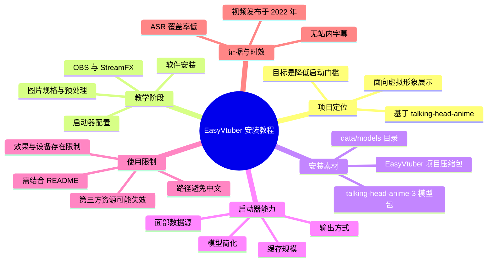
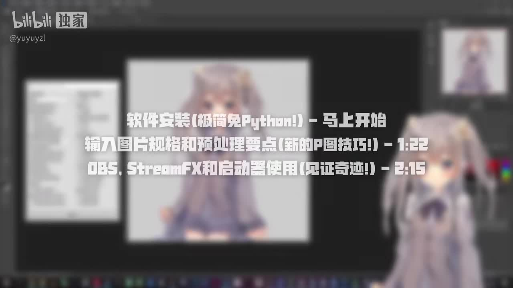
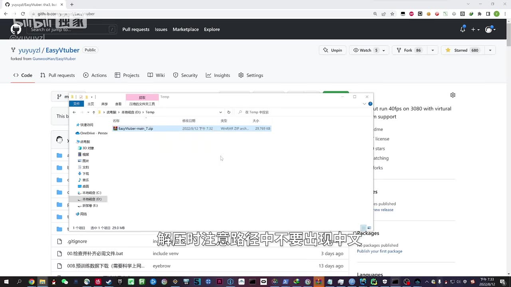
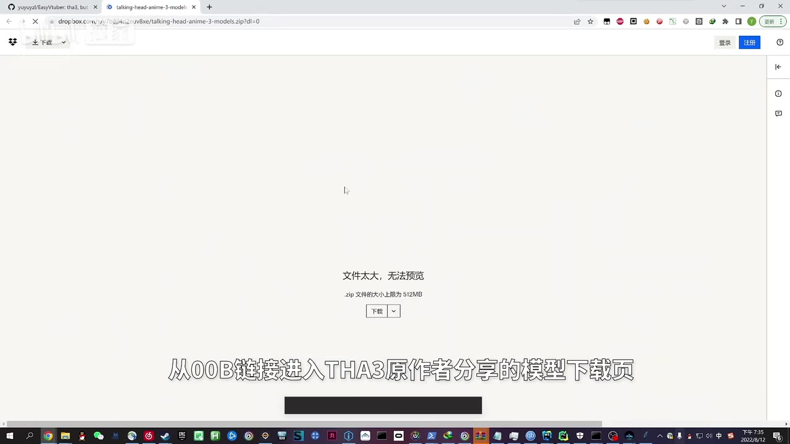
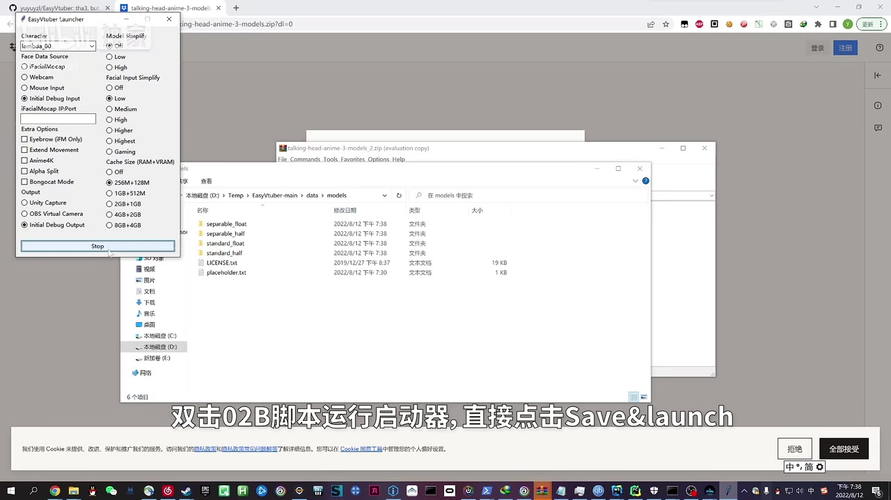

# 一键部署，专治精神内耗！不画画不建模，四步就能实现皮套自由？（新安装教程）【EasyVtuber】

> 来源：[Bilibili 视频](https://www.bilibili.com/video/BV1gS4y1x75w)  
> UP 主：yuyuyzl｜发布时间：2022-08-13｜视频时长：03:49｜合集：AIcode  
> 项目仓库：`yuyuyzl/EasyVtuber`（视频简介及 UP 主热评提供）

## 小结

本视频是 EasyVtuber 的安装与启动演示，目标是让用户在不自行绘制 Live2D、也不进行传统建模的前提下，利用一张角色图片和 `talking-head-anime` 系列模型获得可用于虚拟形象展示的动态角色效果。UP 主说明该项目魔改自 `talking-head-anime`，并围绕“配完环境就能开播”的技术落地目标补充了实用功能。

视频开场给出的教学结构分为三段：软件安装从开头开始；输入图片规格与预处理要点从 01:22 开始；OBS、StreamFX 与启动器使用从 02:15 开始。标题中的“四步”是宣传表述；现有可用素材不足以可靠还原为四个具名、独立且完整的步骤，因此本文按视频明确展示的阶段整理，不将其擅自扩写为固定“四步法”。

安装过程至少涉及：获取 EasyVtuber 项目压缩包、将项目解压到不含中文的路径、下载并放置 `talking-head-anime-3` 模型文件，以及运行 `02B` 启动脚本并在启动器中保存、启动配置。画面还显示应用可选择多种面部数据源、模型简化等级、缓存规模和输出方式。

该视频发布于 2022 年。仓库结构、模型下载地址、第三方依赖、Python 环境兼容性、OBS/StreamFX 版本以及网盘资源均可能已经变化。UP 主也明确提醒：视频是完整安装教学的一部分，应结合仓库 README；前置软件问题需参考对应软件的说明。

本次 ASR 仅在开头识别出一句英文 “Thanks for watching.”，语音覆盖率约 2.06%，不能作为教程内容的可靠文字依据。站内未提供可用字幕；因此正文以视频画面中可读文字、关键帧、视频简介和热评中的可归属信息为主，并对无法确认的内容保留不确定性。

## 思维导图




## 目录

- [项目背景与适用边界](#项目背景与适用边界)
- [教程结构与时间轴](#教程结构与时间轴)
- [获取项目与解压路径要求](#获取项目与解压路径要求)
- [下载并部署模型文件](#下载并部署模型文件)
- [启动器：保存并启动配置](#启动器保存并启动配置)
- [输入图片、OBS 与 StreamFX](#输入图片obs-与-streamfx)
- [参数、经验与限制](#参数经验与限制)
- [时效性与资源核验](#时效性与资源核验)
- [字幕比对](#字幕比对)
- [评论分析](#评论分析)
- [处理记录](#处理记录)

## 项目背景与适用边界 [00:00](https://www.bilibili.com/video/BV1gS4y1x75w?t=0)

视频标题将 EasyVtuber 描述为一种可快速实现“皮套自由”的安装方案。根据视频简介，项目由 UP 主基于久负盛名的 `talking-head-anime` 项目进行修改，并增加实用特性；其明确目标是“全力保证配完环境就能开播”。

这里的“无需画画、不建模”应理解为：教程试图避免用户自行完成传统 VTuber 制作流程中的绘制与模型绑定工作，而不是宣称任何输入图片、任何电脑、任何软件版本都能无条件获得专业级效果。热评中也有用户指出，专业性、视觉效果和运行设备方面仍存在限制；这属于评论者观点，与视频的低门槛定位相互补充，但并非视频中已量化验证的性能结论。

视频简介列出的关联信息：

- 项目介绍视频：`BV1vU4y1v7vh`；
- GitHub 仓库：`yuyuyzl/EasyVtuber`；
- 致谢对象：
  - `pkhungurn/talking-head-anime-3-demo`
  - `GunwooHan/EasyVtuber`
- UP 主建议需要仔细观看时使用较高帧率并以 `0.5×` 速度观看，原因是本视频演示节奏较快。

## 教程结构与时间轴 [00:00](https://www.bilibili.com/video/BV1gS4y1x75w?t=0)

开场目录画面明确给出以下三个时间入口：

| 阶段 | 视频标示时间 | 内容 |
| --- | ---: | --- |
| 软件安装 | 00:00 | “软件安装（极简免 Python！）” |
| 图片输入 | 01:22 | “输入图片规格和预处理要点（新的 P 图技巧！）” |
| 直播链路与启动 | 02:15 | “OBS、StreamFX 和启动器使用（见证奇迹！）” |



> 图：该关键帧直接给出视频作者制作的章节时间轴，是本文划分主要内容的最可靠依据；它也表明视频并非只演示安装，还涉及图片输入与直播输出环节。

需要注意：开场目录只明确展示三段教学内容。标题里的“四步”没有在可读字幕或当前关键帧中展开为四项名称，因此不能据此杜撰第四步。

## 获取项目与解压路径要求 [00:00](https://www.bilibili.com/video/BV1gS4y1x75w?t=0)

视频画面展示在 GitHub 仓库 `yuyuyzl/EasyVtuber` 页面获取项目压缩包。资源管理器中可见压缩文件名为 `EasyVtuber-main_7.zip`，画面显示大小约为 `29,769 KB`；该文件名和文件大小属于录制当时界面信息，不应作为当前仓库版本或下载体积的保证。

演示中的关键操作是解压项目。画面字幕明确提示：

> 解压时注意路径中不要出现中文。

这是一条重要的环境约束。视频没有在当前可用素材中解释具体技术原因，但可合理归纳为旧版脚本、依赖库或外部程序对非 ASCII/中文路径兼容性可能不足。实践时应采用纯英文、数字和常规符号组成的短路径，例如：

```text
D:\EasyVtuber\
```

而避免类似：

```text
D:\直播工具\虚拟形象\EasyVtuber\
```



> 图：画面同时提供项目来源、压缩包形式和“路径不能含中文”的关键安装经验。对复现安装而言，这比仅记录仓库名称更具操作价值。

### 可复现的最小操作顺序

1. 从视频简介或 UP 主热评提供的 GitHub 地址进入 `yuyuyzl/EasyVtuber`。
2. 获取对应项目文件。
3. 解压到英文路径。
4. 不要假定当前仓库仍保留视频演示中的文件名、脚本编号或目录结构；应以当前 README 和 Release/下载页为准。
5. 继续准备该项目所依赖的模型文件。

## 下载并部署模型文件 [00:00](https://www.bilibili.com/video/BV1gS4y1x75w?t=0)

视频展示通过项目中的 `00B` 链接进入 `talking-head-anime-3` 原作者分享的模型下载页。浏览器画面显示 Dropbox 页面提示：

- 文件过大，无法预览；
- `.zip` 文件大小约为 `512 MB`；
- 需要执行下载，而不是在网页内预览。

因此，项目压缩包本身并不等于可运行的完整模型环境；用户还需要另行下载模型包。该模型下载链接是否仍有效、文件是否仍为同一版本，当前素材无法确认。



> 图：该画面证明安装过程中存在独立模型下载步骤，并可帮助用户理解下载页“无法预览”不是异常提示，而是大体积 ZIP 文件的常见网页表现。

后续画面中的资源管理器定位在项目的 `data\models` 目录，可见模型相关目录：

```text
data\models\
├── separable_float
├── separable_half
├── standard_float
└── standard_half
```

同时还可见 `LICENSE.txt` 与 `placeholder.txt`。可确认的是：视频演示将模型文件解压/放置到项目的 `data\models` 下，并且目录包含 `standard` 与 `separable`、`float` 与 `half` 的不同组合。

当前素材没有给出这些模型变体各自的精确性能、显存或质量差异，不能将目录名称直接推导为严格性能结论。用户应优先读取当前仓库对各模型目录、文件完整性和选择规则的说明。

## 启动器：保存并启动配置 [02:15](https://www.bilibili.com/video/BV1gS4y1x75w?t=135)

视频后段展示 EasyVtuber Launcher。画面字幕说明操作方式：

> 双击 02B 脚本运行启动器，直接点击 Save&Launch。

这表明录制版本以编号为 `02B` 的脚本启动图形化配置器，并在配置完成后通过 **Save&Launch** 保存、启动。由于该编号属于 2022 年录制时的项目文件组织，当前版本未必仍使用相同脚本名；不能在缺少 README 核验时把它视为跨版本通用命令。

启动器画面可辨认的配置维度包括：

| 配置区 | 画面中可见选项/信息 | 用途判断 |
| --- | --- | --- |
| Character | 角色下拉框 | 选择角色或角色配置 |
| Face Data Source | iFacialMocap、Webcam、Mouse Input、Initial Debug Input 等 | 选择驱动面部/表情的数据来源 |
| FacialMocap Port | 端口输入框 | iFacialMocap 类输入可能需要配置网络端口 |
| Model Simplify | Off、Low、High | 选择模型简化等级 |
| Facial Input Simplify | Off、Low、Medium、High、Higher、Highest | 调整面部输入简化程度 |
| Extra Options | Eyebrow（IFM Only）、Extend、Anime4K、Alpha Split、Bongocat Mode 等复选项 | 附加效果或输出行为开关 |
| Cache Size（RAM+VRAM） | 多档 RAM 与显存组合 | 根据机器资源配置缓存 |
| Output | Unity Capture、OBS Virtual Camera、Initial Debug Output 等 | 选择输出目标或调试输出 |



> 图：该关键帧是教程中最关键的配置证据：它同时呈现模型目录、启动器参数区、输出方式以及“Save&Launch”启动动作，有助于理解 EasyVtuber 不只是一个单文件程序，而是包含模型、输入源、缓存和输出链路的组合配置。

### 缓存档位

画面中“Cache Size（RAM+VRAM）”区域可辨认的档位为：

```text
0 GB + 512 MB
256 MB + 128 MB
1 GB + 512 MB
2 GB + 1 GB
4 GB + 2 GB
8 GB + 4 GB
```

其中，画面勾选的似为：

```text
256 MB + 128 MB
```

这只能说明录制演示时选择的档位，不能证明它适用于所有设备。配置缓存时应遵循以下保守原则：

1. 可用内存和显存较小，先选择较低档；
2. 出现内存/显存不足、程序无法启动或系统不稳定时，下调档位；
3. 只有在确认硬件余量充足、且当前版本 README 支持的情况下再提高缓存；
4. 缓存大小不是唯一性能决定因素，输入分辨率、模型类型、输出分辨率及 OBS 场景也会影响实际负载。

## 输入图片、OBS 与 StreamFX [01:22](https://www.bilibili.com/video/BV1gS4y1x75w?t=82)

开场目录把“输入图片规格和预处理要点（新的 P 图技巧！）”单列为从 01:22 开始的章节，这说明角色图片不是可以完全忽略的输入条件。视频标题中的“不画画不建模”并不等于“无需准备图片”：至少仍需要向程序提供角色图片，并按教程要求进行规格和预处理。

然而，当前可获取的站内字幕为空，而 ASR 也未能识别这段中文教学；提供的关键帧中没有保留 01:22 段落的具体尺寸、格式、透明通道要求或修图流程。因此以下事项**不能**被写成视频已明确给出的参数：

- 图片的准确像素尺寸；
- 必须使用 PNG/JPG 中的哪一种格式；
- 是否必须带透明背景；
- 面部占画布的具体比例；
- 修图软件、图层操作或处理命令；
- OBS 具体滤镜、分辨率、帧率和 StreamFX 参数。

可以确认的只是：作者认为输入图片的规格与预处理足够重要，值得作为独立章节讲解。实际操作时应回看 [01:22](https://www.bilibili.com/video/BV1gS4y1x75w?t=82) 处画面，并将当前 README 的输入规范作为优先依据。

OBS、StreamFX 和启动器使用从 [02:15](https://www.bilibili.com/video/BV1gS4y1x75w?t=135) 开始。启动器输出区域中出现了 `OBS Virtual Camera` 和 `Unity Capture`，说明录制版本至少考虑了与 OBS 相关的输出/捕获路径；但视频素材不足以确认每一种选项的完整安装步骤、插件版本要求或 OBS 场景设置。尤其是 StreamFX 为第三方插件，需自行核实其与当前 OBS、显卡驱动和系统版本的兼容性。

## 参数、经验与限制 [02:15](https://www.bilibili.com/video/BV1gS4y1x75w?t=135)

### 视频可确认的经验

- **路径兼容性优先**：项目解压路径不要包含中文。
- **模型需单独准备**：项目本体以外，还要下载 `talking-head-anime-3` 模型包。
- **模型目录需正确放置**：演示中模型位于 `data\models`。
- **启动前要完成输入/输出选择**：启动器中可选面部数据源和输出目标。
- **资源配置应匹配硬件**：启动器提供 RAM+VRAM 缓存档位，而非单一固定值。
- **教程需要配合文档**：UP 主明确称视频仅为完整安装教学的一部分，建议结合仓库 README 使用。
- **慢放观看有必要**：UP 主说明视频以技术展示为主、节奏较快，建议在需要细看时使用 `0.5×` 播放。

### 不应忽略的限制

1. **语音/字幕证据不足**  
   本次 ASR 没有成功转写教程主体，站内也无可用字幕；本文不能补造画面外的命令、依赖版本和参数。

2. **“极简免 Python”不等于无前置条件**  
   开场用语写有“极简免 Python”，但视频简介又提到“前置软件安装部分”。因此更准确的理解是：教程试图降低用户直接处理 Python 环境的门槛，而不是证明系统、驱动、OBS、模型下载或其他运行依赖完全不需要准备。

3. **模型与下载资源具有外部依赖风险**  
   模型下载页为第三方托管页面；链接可访问性、文件版本、网络速度及地区限制都可能影响复现。

4. **输出链路依赖直播软件生态**  
   涉及 OBS、StreamFX、虚拟摄像头或捕获方式时，兼容性会受操作系统、OBS 版本、插件版本和显卡环境影响。

5. **低门槛不等于专业级效果**  
   热评中关于视觉效果、专业性和设备限制的提醒具有合理性，但它是用户评价，不能替代对当前版本的实际测试。

## 时效性与资源核验

视频发布于 **2022-08-13**，而当前素材抓取时间为 2026 年。以下信息应被视为历史教程线索，而非当前环境的最终规范：

| 信息 | 录制时证据 | 当前使用建议 |
| --- | --- | --- |
| 项目仓库 | 视频简介与 UP 主热评均给出 `github.com/yuyuyzl/EasyVtuber` | 先查看仓库是否仍存在、README 是否更新、是否有 Release/迁移说明 |
| 项目文件 | 画面显示 `EasyVtuber-main_7.zip` | 不要依赖固定压缩包名称 |
| 模型下载 | 画面为 Dropbox，约 512 MB ZIP | 检查链接有效性、模型许可证、校验方式与当前推荐下载地址 |
| 启动脚本 | 画面字幕为 `02B` | 先按当前仓库的启动说明操作 |
| OBS/StreamFX | 开场明确列为教程内容 | 检查当前 OBS、StreamFX 和系统兼容性 |
| 模型目录 | 画面展示 `data\models` 与多种模型变体 | 以当前项目目录和 README 指示为准 |

在未验证当前仓库内容前，不建议直接下载评论区第三方整合包、执行未知脚本，或将 2022 年版本的目录与文件名机械套用到最新版本。

## 字幕比对

| 字幕来源 | 完整性 | 专有名词 | 时间轴 | 主要问题 |
| --- | --- | --- | --- | --- |
| Bilibili 站内字幕 | 未提供可用字幕 | 无法核验 | 无可用分段 | 无法支撑正文转写 |
| 本次 ASR 字幕 | 极低：仅 1 条、4.7 秒，覆盖约 2.06% 音频 | 未识别 EasyVtuber、OBS、StreamFX、talking-head-anime 等核心术语 | 有效：`00:00:00,000 → 00:00:04,700` | 自动识别语言为英语，结果为 “Thanks for watching.”，与中文技术教程主体不匹配 |

本次 ASR 使用 `medium` 模型，自动检测语言为英语，语言置信度约 `0.7339`；音频总时长约 `228.59` 秒。诊断提示语音覆盖率低于 4%，可能存在音乐、静音、错误音轨或识别不完整等情况。诊断中**没有** `noAudioStream=true` 标记，因此不能称源视频没有音轨；实际情况是源素材存在音频文件，但 ASR 对主体内容识别严重不足。

最终字幕策略：

- 不采用 ASR 的英文句子作为教程正文依据；
- 因没有站内字幕，不进行站内字幕与 ASR 的逐句合并；
- 时间定位优先采用开场画面明确标出的 `00:00`、`01:22`、`02:15`；
- 专有名词通过视频简介、UP 主热评、GitHub 页面关键帧和启动器画面交叉确认；
- 通过关键帧校正/确认的名称包括：`EasyVtuber`、`talking-head-anime-3`、`OBS`、`StreamFX`、`Save&Launch`、`data\models`、`Unity Capture`、`OBS Virtual Camera`。

## 评论分析

仅分析已获取的热评前三条；评论中的链接、主张和资源均不因点赞数而自动成为已验证事实。

### 1. CR俩圆圈：低时间成本有利于普及，但仍有专业性与设备限制

- 点赞数：149
- 核心观点：该方案具有较广应用性、较低时间成本和基础模型带来的回报，能够降低普通人尝试虚拟形象所需的时间、精力和资源。
- 补充价值：评论明确提醒，专业性、视觉效果和运行设备方面仍可能存在较多限制。
- 可信度判断：这是对使用门槛与潜力的主观看法，不包含可复现的测试数据；其中“存在限制”的提醒与本文的时效性、兼容性分析一致，但不能据此推导具体硬件门槛或效果水平。

### 2. 玻色雪风：提供第三方百度网盘整合包

- 点赞数：147
- 核心信息：评论者称考虑到部分用户下载数百兆压缩包不便，已将所需下载内容打包到百度网盘，并附链接及提取码。
- 补充价值：反映了原始模型资源下载可能存在网络访问障碍，也说明用户社区试图降低获取成本。
- 风险与可信度：该资源由评论用户发布，不是 UP 主在本条评论中确认的官方发布渠道。内容版本、文件完整性、许可证、是否夹带额外文件及安全性均未在素材中验证。应优先使用 UP 主提供的 GitHub 仓库和其指向的官方/原作者资源；如确需使用第三方包，应自行进行文件来源、哈希、杀毒和许可证核验。

### 3. yuyuyzl：重申官方仓库与上期介绍视频

- 点赞数：134
- 核心信息：UP 主本人在热评中再次给出仓库地址 `https://github.com/yuyuyzl/EasyVtuber`，并链接上期视频 `BV1vU4y1v7vh`，同时呼吁点 Star。
- 补充价值：这是本组热评中最接近第一方来源的信息，可作为定位项目与项目介绍视频的优先入口。
- 可信度判断：该评论可确认 UP 主当时推荐的仓库地址和关联视频；但仓库在 2026 年是否仍可用、内容是否保持原样，仍需访问时实时核验。

## 处理记录

- Worker ID：`worker-mrj0wjed-b0c290ad`
- 生成模型：`gpt-5.6-terra`
- ASR 模型：`medium`（CUDA / `float16`，自动语言识别）
- 使用的素材与工具产物：
  - 视频元数据与简介；
  - 音频文件 `audio/audio.wav`；
  - ASR 结果 `asr/asr-result.json`、`asr/transcript.srt`；
  - 关键帧目录 `frames/`；
  - 热评文件 `comments/comments.json`；
  - 站内字幕检查结果。
- 字幕选择：
  - 已检查站内字幕：未提供可用站内字幕；
  - 已检查本次 ASR：仅识别 `00:00:00,000 → 00:00:04,700` 的 “Thanks for watching.”，主体覆盖不足；
  - `asr-result.json` 未标记 `noAudioStream=true`，故不将低识别率归因为无音轨；
  - 正文改以开场章节卡、关键帧文字、元数据、视频简介及第一方热评为依据。
- 时间轴依据：
  - `00:00`、`01:22`、`02:15` 来自开场画面中明确显示的教程目录；
  - 未根据正文文字顺序臆测其他章节时间。
- 关键帧选择依据：
  - `frames/frame-001.jpg`：开场目录，提供真实章节与时间；
  - `frames/frame-002.jpg`：GitHub 项目包与“路径中不要出现中文”的安装限制；
  - `frames/frame-003.jpg`：独立模型包下载及约 512 MB 的体积线索；
  - `frames/frame-004.jpg`：模型目录、启动器参数、输出选项与 Save&Launch 操作。
- 缓存清理：未提供缓存清理执行记录；本文不宣称已删除下载文件、音频、视频、关键帧或中间缓存。
- 未解决问题：
  - 无法从可用字幕可靠恢复图片规格、修图流程、OBS/StreamFX 具体配置及全部前置软件版本；
  - 无法验证 2022 年模型下载链接、仓库文件结构、`02B` 脚本和第三方评论资源在当前时间是否仍可用；
  - 无法仅凭当前关键帧确认各模型变体与缓存档位的精确性能差异。
