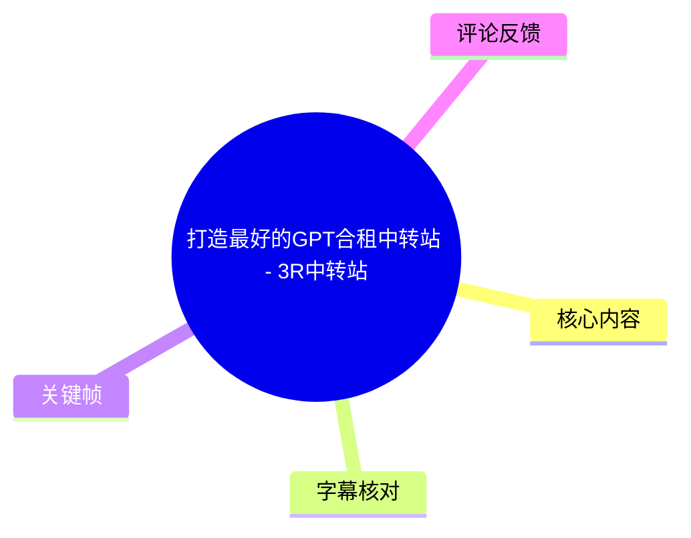
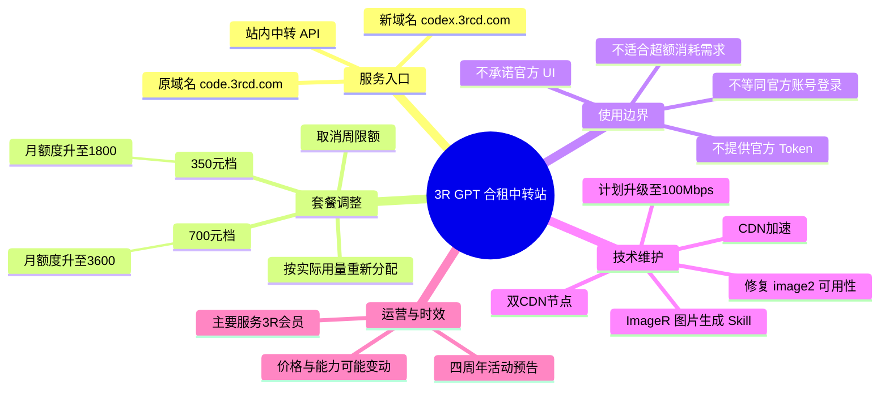
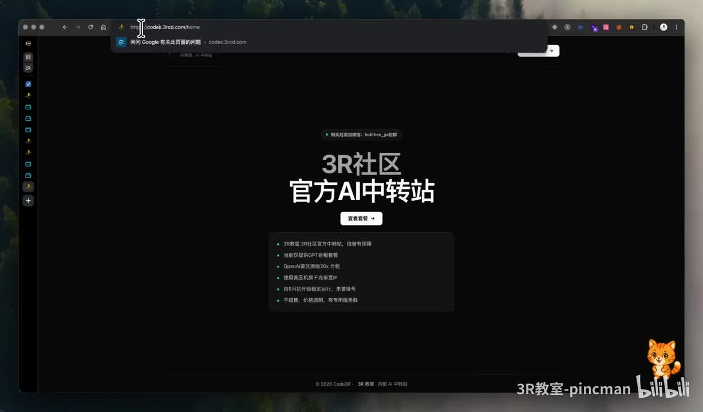
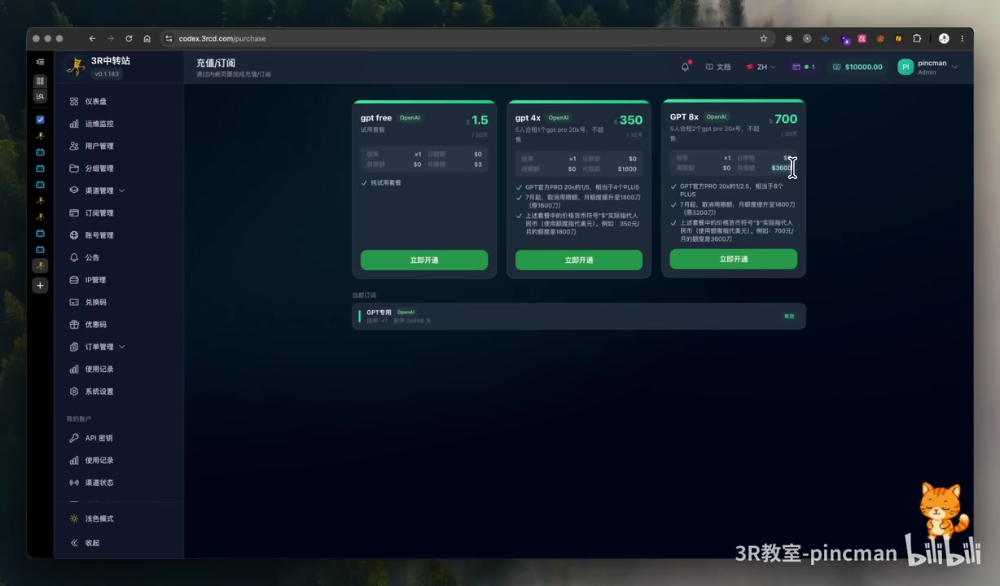
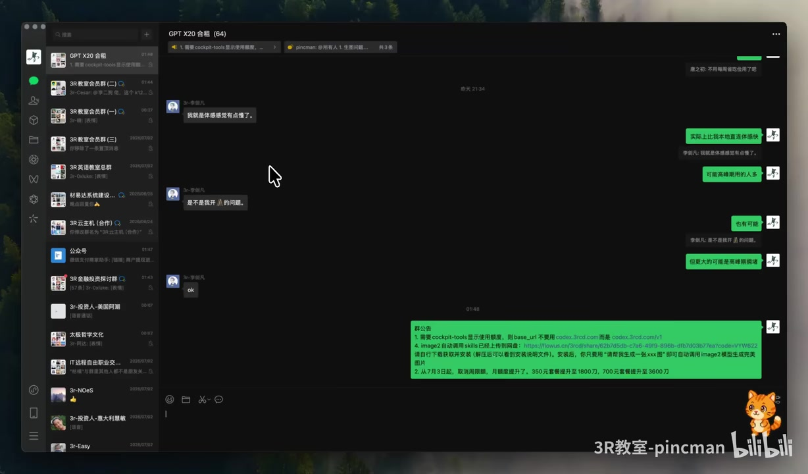

# 打造最好的GPT合租中转站 - 3R中转站

> 来源：[Bilibili 视频](https://www.bilibili.com/video/BV1SXTW6zEbn)  
> UP 主：3R教室-pincman｜时长：7 分 36 秒｜视频简介地址：`codex.3rcd.com`  
> 标签：GPT 中转站、GPT 合租、OpenAI、GLM、Codex、Token

## 小结

视频是 3R 教室对其“GPT 合租中转站”服务的一次套餐、使用边界与运维更新说明。UP 主称服务域名已由 `code.3rcd.com` 改为 `codex.3rcd.com`，并展示了“3R社区官方 AI 中转站”页面和后台套餐页。

本次最重要的变更是：**取消周限额、上调月额度**。UP 主口述的两个付费档位分别为 350 元和 700 元，对应月额度从约 1600、3200 提升至 1800、3600（视频口述单位为“刀”，应理解为站内展示/分配的额度口径，而非本地货币金额）。其解释是，多数合租用户实际用量不足分配额度的 50%～60%，每月存在约 30%～40% 的余量，因此调整了总体额度分配。

视频还明确了服务定位：这不是让用户以自己的官方 GPT 账号登录、也不是直接提供官方 API；购买中转服务后，应使用该站生成或提供的中转 API。UP 主对要求官方 UI、官方 Token 或试图以低档位消耗远超套餐额度的需求表达了拒绝态度。

技术层面，UP 主称其修复了 `image2` 无法使用的问题，并制作了可调用 ImageR 模型生成图片的 Skill；网络侧则把服务器从美国西部更换为带 CDN 加速、双 CDN 配置的节点。虽然带宽数字从此前约 1000 Mbps 级别降至 50 Mbps，但其主张实际访问速度更快，并计划后续升至 100 Mbps。上述性能、模型可用性和额度承诺均为视频中的服务方陈述，未提供独立测速、SLA 或第三方审计材料。

这份内容适合正在评估中转站、合租 API 或图像生成工作流的用户阅读。购买前应重点确认：套餐的实际计费规则、模型范围、并发/IP 限制、隐私与日志政策、服务可用性、退款和故障支持方式。视频展示的是特定时间点的运营方案，价格、额度、域名、线路与模型支持均可能变化。

## 思维导图

## 目录

- [服务背景、入口与时效性](#服务背景入口与时效性)
- [套餐额度调整与分配逻辑](#套餐额度调整与分配逻辑)
- [中转 API 的定位与使用边界](#中转-api-的定位与使用边界)
- [维护内容：图像生成 Skill 与网络线路](#维护内容图像生成-skill-与网络线路)
- [购买提示、适用对象与风险](#购买提示适用对象与风险)
- [关键参数汇总](#关键参数汇总)
- [字幕比对](#字幕比对)
- [评论分析](#评论分析)
- [处理记录](#处理记录)

## 服务背景、入口与时效性 [00:00](https://www.bilibili.com/video/BV1SXTW6zEbn?t=0)

UP 主开场将 3R 中转站描述为“GPT 合作站/合租站”，并宣布入口域名变更：

- 原域名：`code.3rcd.com`
- 当前域名：`codex.3rcd.com`
- 视频简介中同样给出：`codex.3rcd.com`

这里存在一个需要注意的字幕识别问题：ASR 中出现了 `codex.srrcd.com`，但视频简介和首帧浏览器地址栏均显示为 `codex.3rcd.com`，因此正文以 `codex.3rcd.com` 为准。

> 图：首帧展示“3R社区 官方AI中转站”首页，浏览器地址栏可见 `codex.3rcd.com/home`。它为域名更改及服务页面确实存在提供了画面依据，但不能单独证明服务稳定性、模型真实性或额度兑现情况。

从页面文案可辨识的定位包括“3R 教室官方中转站”“提供 API 接口”“OpenAI 模型额度 20x 合租”等。这些是服务方自述及页面营销信息，不应直接等同于 OpenAI 官方服务或官方账号权益。

### 时效性说明

视频元数据的发布时间为 2026 年 7 月。中转站属于持续运营的第三方服务，以下内容具有明显时效性：

1. 域名和访问入口可能迁移；
2. 350 元、700 元档的价格和额度可能调整；
3. 支持的模型、图像功能及调用方式可能更换；
4. CDN、带宽与线路质量会受节点、地区和高峰负载影响；
5. 视频中预告的周年优惠未给出稳定的长期规则。

因此，应以购买前页面、客服书面说明及实际控制台为准。

## 套餐额度调整与分配逻辑 [00:25](https://www.bilibili.com/video/BV1SXTW6zEbn?t=25)

本段是视频的主要更新。UP 主称已提高月额度，并移除了此前的周限额。其口述信息可整理如下：

| 套餐价格 | 调整前月额度（口述） | 调整后月额度（口述） | 限制变化 |
| --- | ---: | ---: | --- |
| 350 元 | 约 1600 | 1800 | 取消周限额 |
| 700 元 | 约 3200 | 3600 | 取消周限额 |

UP 主还用“20x 用量”解释套餐比例：

- 350 元档：约为 Pro/20x 用量的五分之一，即约 20%；
- 700 元档：其口述为约 2.5%，但与“3200 升至 3600”的数值比例及前后语句并不完全清晰；
- 因此，视频可确认的是**两档月额度提高、周限额取消**，但“具体对应官方何种订阅比例”的表达存在口语化与 ASR 误识别，不能据此推导精确的官方产品换算关系。

> 图：后台“充值/订阅”页同时展示免费档、350 元档和 700 元档，能直观对应视频所说的两个主要付费套餐。画面中文字较小，且部分细节模糊，因此金额、额度数值仍以口述与上下文交叉整理，不将截图作为独立精确计费凭据。

### 为什么能够提高额度

UP 主给出的原因并非上游官方降价或获得了更高固定配额，而是合租池的实际使用率结构：

1. 多数用户实际使用量未达到其获配额度；
2. UP 主估计大量用户只使用到约 50%～60%；
3. 每月总体可能存在约 30%～40% 的闲置余量；
4. 因而将闲置空间重新分配至月额度，并取消单周限制。

这是一种典型的共享池/超额分配运营逻辑：依赖于用户用量的非同时性与平均使用率。它的前提是高频、重度用户不会在同一周期集中满额使用。若整体使用率突然上升，实际体验可能受站方总量、并发控制、上游限流或站内规则影响；视频未展示相应的容量保障机制、公开 SLA 或“满额时如何处理”的规则。

## 中转 API 的定位与使用边界 [02:10](https://www.bilibili.com/video/BV1SXTW6zEbn?t=130)

UP 主集中回应了一类咨询：为什么不是用官方账号直接登录、为什么不是官方 API，而是该站自己的 API。

视频中的明确立场是：

- 用户购买的是该中转站服务，应使用中转站提供的 API；
- 服务不等同于购买并独占一个 GPT 官方账号；
- 站方不会向低价合租用户提供官方 Token；
- 若要直接使用官方账号、官方 API 或官方界面，应自行购买相应官方产品；
- 不建议不了解中转站使用机制、同时又要求官方账号权限的用户购买。

这里必须区分三个常被混用的概念：

| 概念 | 本视频中的含义 | 用户应理解的边界 |
| --- | --- | --- |
| 官方账号 | 用户自行向官方购买并登录的账号 | 不属于视频所售中转服务的默认交付物 |
| 官方 API | 官方平台直接签发、直接计费的 API 凭证 | 视频明确表示不会作为合租套餐的 Token 提供 |
| 中转站 API | 由第三方服务封装、分配或转发的接口 | 需要遵循站方的额度、鉴权、模型和风控规则 |
| 官方 UI | 官方网站或客户端的交互界面 | 不应假定中转 API 可直接获得同等 UI 权益 |

UP 主还提到有人以“模型库日期对不上”“不是真正的 GPT”等理由咨询。视频未展示这些用户的测试样本、请求/响应日志、模型标识、上游来源或可复现方法，因而无法从视频材料独立验证模型版本、路由方式或与官方端的一致性。

### 实际接入前的核查步骤

视频没有提供完整 API 文档或具体请求示例。基于它已经明确的“中转 API”定位，用户至少应在付费前按以下顺序确认：

1. **确认入口**：通过视频简介和站内页面核对域名为 `codex.3rcd.com`，警惕相似拼写域名。
2. **确认交付物**：问清是 API Key、控制台账户、模型白名单还是其他形式；不要默认会拿到官方账号或官方 Token。
3. **确认额度定义**：核对“1800/3600”的单位、重置周期、不同模型消耗倍率、是否存在隐藏的请求频率或并发限制。
4. **确认隐私边界**：中转 API 的请求可能经过第三方服务器。不要在未确认日志保留、数据处理和密钥管理规则前提交敏感信息。
5. **先做低风险测试**：用非敏感提示词验证模型名称、响应速度、错误码、图片生成和额度扣减是否符合页面说明。
6. **留存规则证据**：保存购买页面、套餐说明、客服答复和测试记录，以处理后续额度或服务争议。

## 维护内容：图像生成 Skill 与网络线路 [04:05](https://www.bilibili.com/video/BV1SXTW6zEbn?t=245)

UP 主称自己持续维护服务，并给出两项技术侧变更。

### 1. 图像生成：修复 image2 并制作 Skill

视频称此前 `image2` 无法使用，目前已恢复可用；同时，UP 主制作了一个 Skill，可调用 ImageR 模型生成图片。其描述的使用场景是：某些中转站原本不能像官方账号/官方产品那样直接生成图片，而 Skill 可以作为调用图像模型的补充方式。

> 图：画面展示名为“GPT X20 合租”的群聊，以及一条包含 image2/Skill 相关说明和额度调整信息的公告。它说明 UP 主确实通过社群渠道发布维护通知；但链接内容、Skill 代码、权限范围和安全性未完整展示，不能据此直接执行或信任外部链接。

视频没有提供以下关键技术资料：

- Skill 的完整代码、安装方式与版本；
- ImageR 的精确模型标识、上游来源与能力边界；
- API endpoint、认证头、请求体、响应格式；
- 图片生成额度如何扣减；
- 输入提示词和生成图片是否被记录；
- 失败重试、内容审核与版权处理规则。

因此，视频可确认的是“存在一个由 UP 主称为 Skill 的辅助方案”，而不能将其视为通用、开源或已经安全审计的图片生成工具。

### 2. 网络：从美西线路切换至 CDN 加速节点

UP 主称，原先使用的是美国西部服务器，带宽约为 1000 Mbps 量级；之后更换为标称 50 Mbps 的服务器，但由于 CDN 加速及“双 CDN”配置，体感速度更快。其口述中还提到东岸/洛杉矶等地点，地理描述前后不够严谨，无法据此准确确定服务器物理位置。

可确认的运营结论是：

- 新线路带宽标称较低，但服务方认为实际响应速度更好；
- 站方提到 CDN 加速和双 CDN；
- 计划将带宽升级至 100 Mbps；
- UP 主称服务器成本较低，并将此视为提供较低价套餐的基础之一。

需要特别指出：**带宽数字不等于 API 响应速度**。API 体验还取决于上游模型排队、网络往返时延、DNS/CDN 路由、节点负载、缓存、限流、请求大小及客户端网络。视频没有提供不同地区的延迟数据、吞吐压测、可用率统计或故障恢复方案。

## 购买提示、适用对象与风险 [06:05](https://www.bilibili.com/video/BV1SXTW6zEbn?t=365)

UP 主表示，服务主要面向 3R 会员，而非大量 Bilibili 外部用户；其称现有合租用户约六十多人，其中带有 3R 前缀的用户占多数。该人数为口述信息，未见后台统计证明。

视频末尾还预告 3R 教室即将进行四周年庆活动，并称直接联系购买可能比官网便宜约 400 元；ASR 对官网价格识别为“4299、1299”，语义不完整，无法明确对应具体产品、原价或优惠价。因此，仅能记录为“存在周年促销预告”，不能将其作为确定报价。

### 适合的需求

- 已理解第三方中转 API 与官方账号差异；
- 可接受共享额度/共享资源的使用模式；
- 使用场景以日常对话、编码或轻中度图像生成测试为主；
- 愿意自行测试模型可用性、网络延迟和额度扣减；
- 能接受服务规则可能随运营状况调整。

### 不适合的需求

- 必须获得官方账号、官方 Token 或官方 UI 权益；
- 对模型版本、数据来源或官方一致性有严格合规要求；
- 需要明确 SLA、企业级合同、审计记录或长期固定配额；
- 有高并发、满额、生产关键链路或敏感数据处理需求；
- 无法接受第三方中转服务可能发生的限流、迁移或停服风险。

### 使用安全建议

1. 不在第三方中转 API 中输入密码、支付信息、身份证件、商业机密或未脱敏客户数据。
2. API Key 不要直接写入公开仓库、截图或群聊；使用环境变量或密钥管理工具。
3. 为不同项目设置独立密钥和消费上限；发现异常调用后立即轮换密钥。
4. 核对站方的服务条款、退款方案、日志策略、IP 限制和封号处理规则。
5. 对“官方模型”“无限”“稳定”“不封号”等营销表述要求提供可验证定义，避免将口头承诺误解为保障。

## 关键参数汇总 [06:45](https://www.bilibili.com/video/BV1SXTW6zEbn?t=405)

| 项目 | 视频中信息 | 可信边界与备注 |
| --- | --- | --- |
| 当前入口 | `codex.3rcd.com` | 与视频简介、首帧地址栏一致；访问前仍应核验域名 |
| 旧入口 | `code.3rcd.com` | UP 主口述为旧域名 |
| 服务类型 | GPT 合租中转站 / 中转 API | 并非默认交付官方账号或官方 API |
| 350 元档 | 月额度升至 1800 | “1800”的精确计费单位、倍率与重置规则未展示 |
| 700 元档 | 月额度升至 3600 | 同上 |
| 周限额 | 已取消 | 视频未说明是否仍有并发、速率、IP 或模型单独限制 |
| 用量依据 | 多数用户使用约 50%～60%，月余量约 30%～40% | 服务方经验判断，未提供统计明细 |
| 图像能力 | `image2` 恢复；Skill 可调用 ImageR 生成图片 | API、模型版本、代码和安全细节均未公开 |
| 网络调整 | CDN 加速、双 CDN；当前口述约 50 Mbps，计划 100 Mbps | 无独立测速和可用率证据 |
| 面向用户 | 主要为 3R 会员 | UP 主口述的运营定位 |
| 促销信息 | 四周年活动将发布，称直接联系可能更便宜 | 具体价格、日期、规则不清晰，购买前应重新确认 |

## 字幕比对 [07:05](https://www.bilibili.com/video/BV1SXTW6zEbn?t=425)

本次任务中，**站内字幕与本次 ASR 均已获取并执行比对**。两者质量差异很大：站内字幕内容是英雄联盟赛事解说，与视频主题、画面和语音均不匹配；本次 ASR 虽有较多同音字、断句和专名误识别，但整体覆盖了中转站、套餐、额度、服务器及周年活动等实际内容。

| 字幕来源 | 完整性 | 专有名词 | 时间轴 | 主要问题 |
| --- | --- | --- | --- | --- |
| Bilibili 站内字幕 | 与本视频完全不匹配 | 出现 Faker、Oner、Keria、贾克斯等赛事名词 | 未提供可用时间戳 | 疑似错误绑定了其他视频的英雄联盟解说字幕，不能使用 |
| 本次 ASR 字幕 | 基本覆盖全片口述内容 | 存在域名、模型名、额度单位等误识别 | 提供的是连续文本，未附逐句精确时间戳 | 口语重复多，断句混乱；如“srrcd”“ImageR”“20差”等需结合画面和上下文校正 |

### 最终字幕选择与校正

正文以**本次 ASR 为主**，以视频简介、元数据和关键帧画面进行交叉校正；站内字幕不采用。主要校正项如下：

| ASR 表达 | 校正结果 | 校正依据 |
| --- | --- | --- |
| `codex.srrcd.com` | `codex.3rcd.com` | 视频简介明确给出该地址；首帧地址栏显示同一域名 |
| `code.srcd.com` | `code.3rcd.com` | 与现域名结构、UP 主口述上下文对应 |
| `ImageR` / `image2` | 保留原称呼，不扩展为具体官方产品 | 视频仅口述相关名称，未展示完整技术文档 |
| `1800刀`、`3600刀` | 记录为“月额度 1800/3600（视频口述单位）” | 无法确认其等同真实美元、Token 或官方账单额度 |
| `20差`、`Pro2Star` | 不作精确产品映射 | ASR 误识别可能性高，画面未提供足够清晰的佐证 |
| `4299,1299` | 不纳入确定价格表 | 缺乏具体套餐对应关系，不能据此编造促销价 |

## 评论分析 [07:20](https://www.bilibili.com/video/BV1SXTW6zEbn?t=440)

素材中按“热评前三条”请求获取，但实际仅返回 **2 条可获取评论**；因此只分析这两条，不补造第三条，也不将评论内容视为已验证事实。

1. **吗你吗米**：  
   > “有群没？昨天试了下中转，有些问题不知道咋办”

   - 观点：用户已尝试使用中转服务，但遇到了问题，希望获得社群支持渠道。
   - 补充价值：反映出潜在用户对接入文档、排障流程和客服响应有现实需求。
   - 可信度与限制：评论未说明问题类型，无法判断是配置错误、服务故障、模型限制还是个人网络问题；不能据此推断服务存在普遍技术问题。

2. **Maxwell-69**：  
   > “这个月没钱了，下个月支持。”

   - 观点：表达未来可能购买或支持的意愿。
   - 补充价值：反映价格是用户决策因素之一。
   - 可信度与限制：不包含对服务质量、模型能力、价格合理性或实际购买行为的可验证信息。

## 评论分析

本次流程未获取到可用热评，因此不推断观众态度或额外结论。

## 处理记录

- Worker ID：`worker-mrj0www4-e8d79408`
- 模型：`gpt-5.6-terra`
- 调用工具与素材：任务提供的视频元数据、视频素材清单、站内字幕、本次 ASR 字幕、关键帧、热评抓取结果。
- 使用的应用工具：素材侧已完成视频合并、音频提取、关键帧提取、站内字幕获取、ASR 转写及评论获取；本记录基于这些已提供产物整理，未虚构额外网页访问或实测。
- 字幕选择：站内字幕为明显错配的英雄联盟赛事内容，弃用；采用本次 ASR 作为主体，并以视频简介和关键帧校正域名、套餐与页面信息。
- 关键帧选择依据：
  - `frames/frame-001.jpg`：展示官方中转站首页与当前域名，支撑入口说明；
  - `frames/frame-003.jpg`：展示订阅后台的免费、350 元、700 元套餐并列结构，支撑套餐章节；
  - `frames/frame-004.jpg`：展示群公告与维护/额度更新语境，支撑 Skill 和社群通知说明。
- 缓存清理：素材仅提供了处理完成状态，未提供缓存清理执行回执；因此无法确认是否已清除下载视频、音频、ASR 中间文件或关键帧缓存。
- 未解决问题：
  - 无法验证上游模型来源、模型版本、官方一致性及实际 Token/额度换算；
  - 无法验证服务器所在地、CDN 架构、带宽、延迟和服务可用率；
  - 无法确认 `ImageR`、`image2` 和 Skill 的完整技术实现及安全性；
  - 无法从现有素材确认周年活动的具体价格、开始时间和购买规则；
  - 热评仅返回两条，第三条不可获取。
