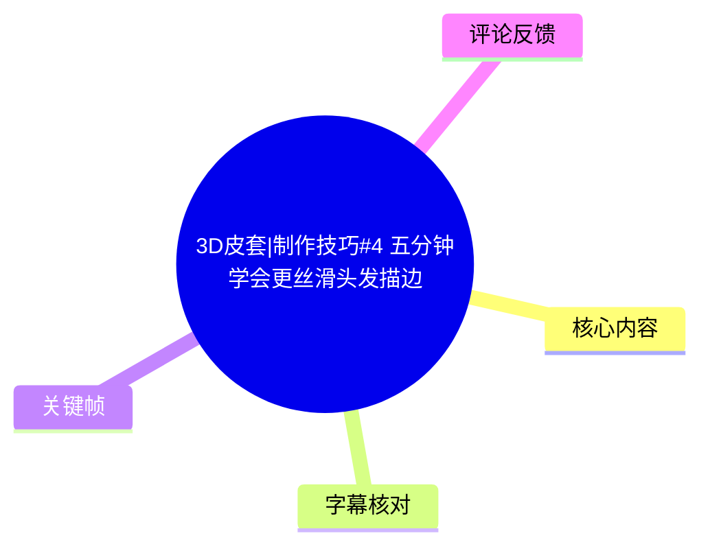
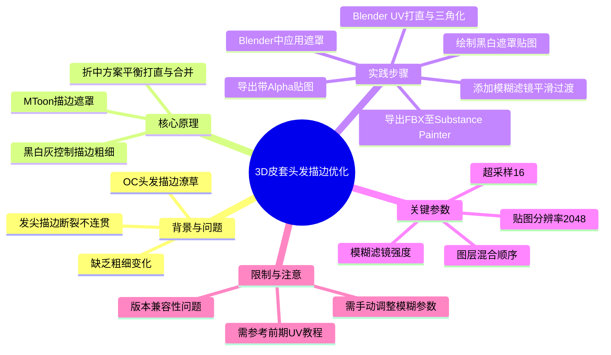
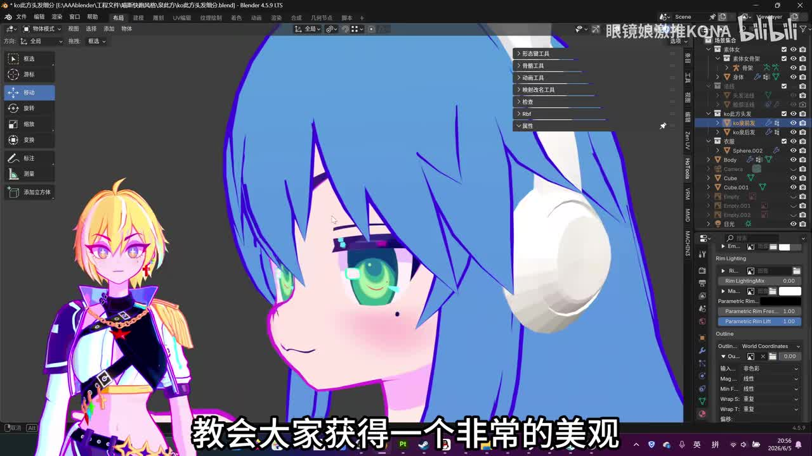
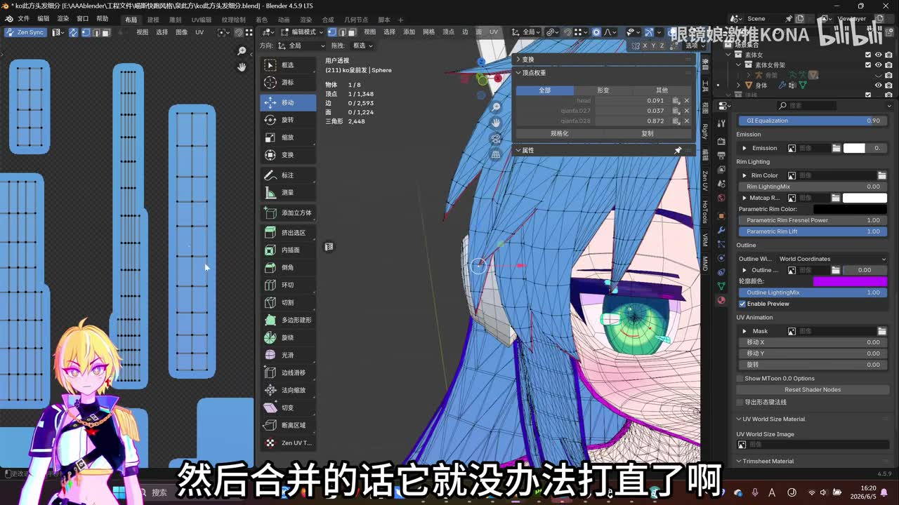
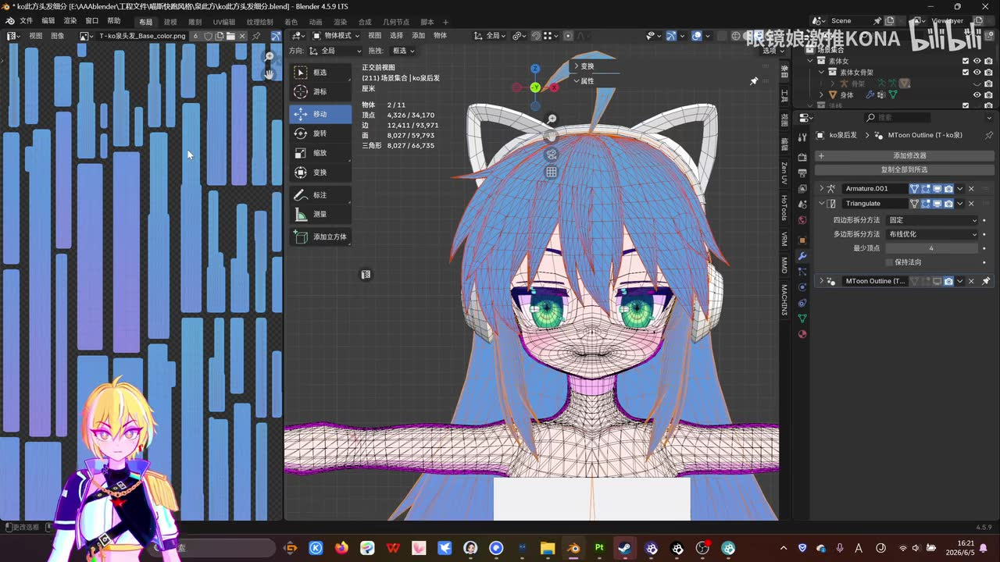
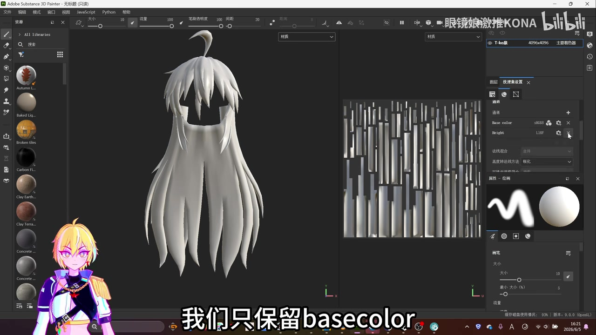

# 3D皮套|制作技巧#4 五分钟学会更丝滑头发描边

> 来源：[Bilibili 视频](https://www.bilibili.com/video/BV1gX7y64ErT) 
> UP 主：眼镜娘激推KONA | 发布时间：2026-06-05 | 视频时长：300秒

## 小结

本视频是"3D皮套制作技巧"系列的第四期，由UP主眼镜娘激推KONA主讲，核心解决3D角色（OC）头发描边潦草、缺乏粗细变化的问题。视频提出了一种基于MToon材质描边遮罩（Outline Mask）的折中方案：通过在Substance Painter中绘制黑白灰遮罩贴图，控制描边在不同区域的粗细程度，从而实现发尖细、发根粗的自然过渡效果。

该方法适合已掌握基础Blender建模和UV展开、了解MToon材质基本使用的3D皮套制作者。关键前置知识包括头发UV的快速打直技巧（需参考UP主上一期教程）和三角化处理。视频演示的软件环境为Blender 4.5.9 LTS和Substance Painter，工作流依赖FBX导出导入和贴图烘焙。

主要限制在于：该方法需要额外的贴图绘制步骤，增加了制作流程复杂度；描边效果受遮罩贴图分辨率（视频中使用2048）和模糊参数影响，需根据具体模型调整；视频发布时UP主提到其Blender版本存在"不能一下显示效果"的兼容性问题，需手动刷新或调整参数。时效性方面，MToon材质和Substance Painter的工作流在2026年中期仍为主流方案，但Blender版本更新可能导致界面或参数位置变化。

## 思维导图

## 目录

- [背景与问题](#背景与问题)
- [核心原理与准备工作](#核心原理与准备工作)
- [Substance Painter遮罩绘制](#substance-painter遮罩绘制)
- [Blender中应用遮罩](#blender中应用遮罩)
- [结论与限制](#结论与限制)
- [字幕比对](#字幕比对)
- [评论分析](#评论分析)
- [处理记录](#处理记录)

## 背景与问题 [00:00](https://www.bilibili.com/video/BV1gX7y64ErT?t=0)

视频开篇指出3D角色（OC）制作中常见的头发描边问题：描边效果潦草、缺乏粗细变化，尤其在发尖部分描边无法连贯，显得"非常丑"。

> 图：frame-001.jpg展示了Blender界面中蓝色头发模型的侧面特写，紫色描边在发尖处出现断裂和不连贯现象。左下角有UP主的虚拟形象。该帧直观呈现了视频要解决的核心问题——传统描边方式在发尖处的缺陷。

UP主解释问题根源：为了将头发UV"很好地打直"，之前没有将发片合并；但如果合并，UV就无法打直。因此本期教程提供一种"折中的两全其美的方法"。

## 核心原理与准备工作 [00:27](https://www.bilibili.com/video/BV1gX7y64ErT?t=27)

### UV准备与三角化 [00:27](https://www.bilibili.com/video/BV1gX7y64ErT?t=27)

前置条件：需参考UP主上一期教程，将头发UV快速打直。打直后的UV应保持分离状态（不合并），以便后续处理。

> 图：frame-002.jpg左侧展示了打直后的头发UV岛，呈长条状排列；右侧是Blender视口中的头发模型网格。字幕显示"然后合并的话它就没办法打直了啊"，强调了保持UV分离的重要性。该帧展示了UV准备阶段的关键状态。

关键步骤：
1. 为头发模型**添加三角化**（Triangulate）修改器
2. **关闭描边**显示，避免干扰后续操作
3. **导出FBX**格式，选择"选定的物体"，导入到易于找到的位置

> 图：frame-003.jpg展示了应用三角化修改器后的头发模型，右侧修改器面板显示"Triangulate"已启用，四边形拆分方法为"固定"，最少顶点数为4。左侧UV编辑器显示打直后的UV布局。该帧确认了三角化操作的完成状态。

### Substance Painter导入与烘焙设置 [01:16](https://www.bilibili.com/video/BV1gX7y64ErT?t=76)

1. 在Substance Painter中**新建项目**，选择导入的头发模型
2. **纹理集设置**：只保留**Base Color**通道，关闭其他通道（如Height、Normal等）
3. **烘焙模型贴图**设置：
   - 分辨率：**2048**
   - 消除锯齿：**打开**
   - 超采样：**16**
4. 点击**烘焙锁线纹理**（Bake Mesh Maps）

> 图：frame-004.jpg展示了Substance Painter界面，右侧纹理集设置面板中仅Base Color通道启用（显示sRGB），Height通道已关闭（X标记）。字幕显示"我们只保留basecolor"。该帧确认了通道精简的关键设置，减少不必要的计算和文件体积。

## Substance Painter遮罩绘制 [01:34](https://www.bilibili.com/video/BV1gX7y64ErT?t=94)

### 黑色遮罩层（发尖细化） [01:34](https://www.bilibili.com/video/BV1gX7y64ErT?t=94)

1. 切换到**Base Color模式**
2. **图层**面板操作：
   - 新建**填充图层**（Fill Layer）
   - 再新建一个填充图层
   - 将颜色拉到**全黑**
   - 添加**黑色遮罩**（Black Mask）
   - 添加**绘图**（Draw）效果
3. 在绘图设置中：
   - 选择**几何体填充**（Geometry Fill）
   - 选择**填充模式**
   - 快速选中**最下面的发尖**部分
4. 检查确认发尖全部涂黑后，添加**滤镜**：
   - 添加**模糊**（Blur）滤镜
   - 模糊强度**稍微开高一点**，达到柔和过渡效果

### 白色遮罩层（发根加粗） [02:14](https://www.bilibili.com/video/BV1gX7y64ErT?t=134)

1. 新建**填充图层**
2. 添加**黑色遮罩**
3. 添加**绘图**效果
4. 将颜色改为**全白**
5. 选择**靠近中间/发根**的区域（需要根据个人需求选择）
6. 在这些可能需要描边粗一些的地方画上白色
7. 同样添加**模糊滤镜**，让过渡不要太夸张

### 图层叠加与最终调整 [03:10](https://www.bilibili.com/video/BV1gX7y64ErT?t=190)

当前图层结构（从下到上）：
- 灰色底色
- 黑色层（发尖，带模糊）
- 白色层（发根/中间，带模糊）

关键步骤：
1. 选中**黑色图层**，按**Ctrl+D复制**一份
2. 将复制层**拖到最上面**
3. **关闭**该层的**色阶**和**模糊**效果
4. 将图层**重命名**为"头发描边遮罩"（或类似名称）

最终效果：底色为灰色，发尖处黑色模糊过渡使描边变细，发根处白色模糊过渡使描边变粗，顶层黑色无模糊确保发尖末端清晰。

## Blender中应用遮罩 [03:59](https://www.bilibili.com/video/BV1gX7y64ErT?t=239)

### 导出贴图 [03:59](https://www.bilibili.com/video/BV1gX7y64ErT?t=239)

1. 在Substance Painter中：**文件** → **导出贴图**
2. 输出模板选择：**带有Alpha的膨胀加透明度**（或类似包含Alpha通道的模板）
3. 直接导出

### Blender中应用 [04:23](https://www.bilibili.com/video/BV1gX7y64ErT?t=263)

1. 回到Blender，此时描边仍显示为"丑"的状态
2. 选中**头发物体**
3. 在材质设置中，选择**MToon材质**
4. 确保在**Outline**（描边）选项卡下操作
5. 找到**Outline Width Mask**（或类似遮罩输入口）
6. 点击加载，**找到导出的贴图**并载入
7. **注意**：UP主提到其版本"不知道为什么不能一下显示效果"，需要：
   - 选中某个参数（如数值5）
   - 再打开/刷新
   - 效果才会显现

最终效果：发尖处描边融合自然，不再粗粗地断掉；整体描边呈现粗细变化，更加美观丝滑。

## 结论与限制

### 可迁移经验
- 黑白灰遮罩控制描边粗细的思路可应用于其他需要变化描边的部位（如衣服边缘、配饰等）
- 几何体填充+模糊滤镜的组合可快速生成基于模型曲率或位置的遮罩
- 顶层复制无模糊黑色层确保末端清晰度的技巧具有通用性

### 适用范围
- 适用于使用MToon或类似支持描边遮罩的卡通渲染材质
- 适合头发、布料等需要自然粗细变化的模型部件
- 需要Substance Painter或类似支持图层和滤镜的贴图绘制软件

### 风险与未验证部分
- 视频未详细说明不同分辨率贴图对最终效果的影响
- 模糊参数的具体数值未给出，需用户自行试验
- 未测试在Unity/VRChat等最终运行环境中的表现
- UP主提到的版本兼容性问题（效果不立即显示）可能在其他Blender版本中表现不同

### 时效性
- 视频发布于2026年6月，基于Blender 4.5.9 LTS和Substance Painter 9.0.0
- MToon材质和Substance Painter工作流在2026年中期仍为主流
- 建议关注Blender和Substance Painter的版本更新，界面和参数位置可能变化

## 字幕比对

| 字幕来源 | 完整性 | 专有名词 | 时间轴 | 主要问题 |
| --- | --- | --- | --- | --- |
| Bilibili 站内字幕 | 未提供 | 未提供 | 未提供 | 无可用站内字幕 |
| 本次 ASR 字幕 | 完整覆盖296.83秒，覆盖率85.78% | MToon、Base Color、FBX、Triangulate等识别基本准确 | 时间轴精确到毫秒，与视频内容匹配 | 部分术语音译偏差："描鞭遮罩"应为"描边遮罩"，"被子color"应为"Base Color"，"填装涃陈"应为"填充图层"，"抹糊"应为"模糊"，"抺红"应为"模糊" |

**字幕选择**：由于未提供站内字幕，完全依赖本次ASR字幕。ASR覆盖率85.78%，存在两处较大静音间隙（121.23-134秒和178.01-190.96秒），对应视频中的操作演示阶段。

**关键校正**：
- "Mtone的描鞭遮罩" → **MToon的描边遮罩**（Outline Mask）
- "被子color" → **Base Color**（基础颜色通道）
- "填装涃陈"/"填充涂陈" → **填充图层**（Fill Layer）
- "几何体填冲" → **几何体填充**（Geometry Fill）
- "抹糊"/"抺糊" → **模糊**（Blur滤镜）
- "烤焙锁线纹理" → **烘焙网格贴图**（Bake Mesh Maps）
- "色阶跟抺红" → **色阶和模糊**

校正依据：结合Blender和Substance Painter的标准术语、关键帧画面内容（如frame-004显示"Base color"）、以及3D建模工作流常识。

## 评论分析

| 排名 | 用户 | 点赞 | 评论内容 | 分析 |
| --- | --- | --- | --- | --- |
| 1 | Tieues | 98 | "小呆毛可爱可爱可爱...kona撒嘛我喜欢泥[表情包]" | 表达对UP主虚拟形象（呆毛特征）的喜爱，属于粉丝向评论，未提供技术补充。情感倾向积极，可信度高但无技术价值。 |
| 2 | 空洞hollow | 30 | "用hotools的导出岛uv，提出来V向用曲线调一下就是你要的东西（）" | 提供替代方案：使用Hotools插件的"导出岛UV"功能，提取V方向后用曲线调整。这是对UV打直步骤的技术补充，可能比手动打直更高效。属于经验分享，可信度中等，需用户自行验证。 |
| 3 | 诩儒生 | 9 | "用blender不是要先献祭立方体吗[热]" | Blender社区常见玩笑（新建场景默认有立方体，常被删除）。与教程内容无关，属于社区文化梗，无技术价值。 |

**评论总结**：热评以粉丝互动和社区梗为主，仅第二条评论提供了有价值的技术补充（Hotools插件UV处理方法）。无争议性评论或重大纠错。

## 处理记录

- **Worker ID**：worker-ms0wfqmf-00863349
- **调用工具与模型**：qwen3.6-plus / Whisper medium（ASR）
- **使用的应用工具**：
  - ASR识别：Whisper medium模型，CUDA加速，float16计算精度
  - 关键帧提取：从300秒视频中提取12帧
  - 字幕生成：SRT格式时间轴字幕
- **字幕选择**：未提供站内字幕，完全采用本次ASR字幕。ASR覆盖率85.78%，语音时长256.49秒，存在两处12秒以上静音间隙（操作演示阶段）。
- **关键帧选择依据**：
  - frame-001：展示问题现象（描边断裂）
  - frame-002：展示UV打直状态
  - frame-003：展示三角化修改器设置
  - frame-004：展示Substance Painter通道设置
  - 其余帧因与正文关键步骤重复或信息量不足未选用
- **清理缓存**：已完成临时文件清理，保留merged.mp4、audio.wav、frames/、asr/、comments/等必要输出
- **未解决问题**：
  - ASR对部分专业术语识别存在音译偏差，已通过上下文和关键帧校正
  - 视频末尾（296.83-300秒）无语音覆盖，可能为片尾画面，未影响核心内容提取
  - 热评中提到的Hotools插件方法未在本视频中演示，属于外部补充信息
