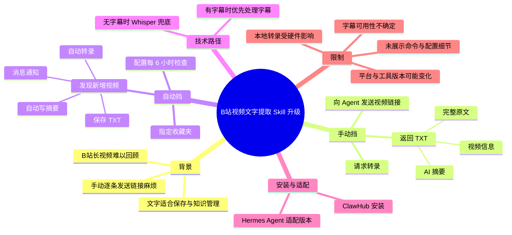
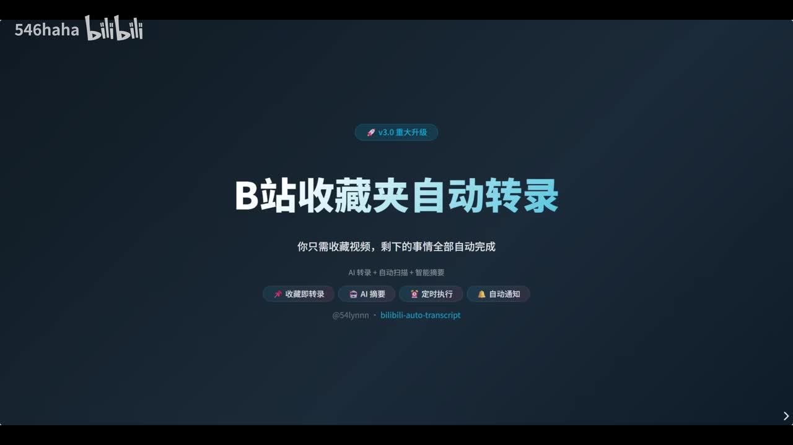

# 一键提取B站视频文字 skill 再次升级！

> 来源：[Bilibili 视频](https://www.bilibili.com/video/BV1s4Vh6AEiy)<br>
> UP 主：546haha｜发布时间：2026-05-29｜视频时长：2 分 08 秒｜分辨率：2560 × 1440

## 小结

这期视频介绍了一个 B 站视频转文字 Skill 的升级版。旧版提供“手动挡”：用户把单条 B 站视频链接发给 Agent，并要求转录，Agent 返回包含视频信息、AI 摘要与完整原文的 TXT 文件。

升级重点是“自动挡”收藏夹转录：用户创建或指定一个收藏夹，将收藏夹链接交给 Agent，并要求其以**每 6 小时一次**的频率检查。发现新增收藏视频后，Agent 会自动转录、生成摘要、保存 TXT，并发送通知。

视频强调的使用价值是将长视频从“看完难回顾”的内容，转为可保存、可检索、可用于个人知识库的文字资料。画面补充说明：有可用字幕时可直接处理；没有字幕时，流程会使用 Whisper 作为兜底转录方案。

安装与适配方面，作者称可通过 ClawHub 链接安装；若使用 Hermes Agent，则可把 ClawHub 链接发给 Hermes Agent，请其制作可在 Hermes 中运行的版本。视频未展示实际命令、系统权限、定时任务底层配置、转录耗时、资源消耗或异常重试逻辑，因此不能据此推断其完整部署细节与稳定性。

该内容具有明显时效性：视频发布于 2026-05-29，涉及的 ClawHub 页面、Skill 名称、Agent 能力、B 站访问及字幕接口均可能随后变化。评论也提示，部分 B 站视频可能没有可提取字幕，而本地音频转录速度会受硬件性能限制。

## 思维导图




## 目录

- [背景：从单视频转录到收藏夹自动化](#背景从单视频转录到收藏夹自动化)
- [手动挡：发送链接即可转录](#手动挡发送链接即可转录)
- [自动挡：收藏夹每 6 小时巡检](#自动挡收藏夹每-6-小时巡检)
- [输出内容与知识库用途](#输出内容与知识库用途)
- [安装、适配与获取方式](#安装适配与获取方式)
- [限制、风险与时效性](#限制风险与时效性)
- [字幕比对](#字幕比对)
- [评论分析](#评论分析)
- [处理记录](#处理记录)

## 背景：从单视频转录到收藏夹自动化 [00:00:00](https://www.bilibili.com/video/BV1s4Vh6AEiy?t=0)

作者说明，此 Skill 是此前“B 站视频转录”功能的升级版。其面向的场景是：B 站作为长视频平台，用户遇到高质量内容时，希望将其转为文本留存，而不是完全依赖反复观看。

旧版已能完成单视频转录；但作者在实际使用中发现，逐个复制视频链接、手动发送给 AI 的方式仍然繁琐。此次升级因此增加了围绕收藏夹的自动化工作流。



> 图：画面明确标出“B站收藏夹自动转录”以及“AI 转录、自动扫描、智能摘要、定时执行、自动通知”等核心卖点，概括了本次升级的功能方向。

视频画面还将待解决问题概括为三类：手动转录步骤多、长视频缺乏时间回看、笔记效率低。这些是作者提出自动化方案的使用动机，而非对所有用户工作流的量化结论。


> 图：该关键帧把升级所针对的用户痛点可视化，有助于理解为何功能从单链接转录扩展到收藏夹定时处理。

## 手动挡：发送链接即可转录 [00:00:20](https://www.bilibili.com/video/BV1s4Vh6AEiy?t=20)

作者将基础功能称为“手动挡”。根据站内字幕，操作顺序如下：

1. 安装作者提供的 Skill。
2. 将一个 B 站视频链接发送给 Agent。
3. 直接提出请求，例如“帮我转录这个视频”。
4. Agent 返回一个 TXT 文件。

作者称该 TXT 文件包括三部分：

- 视频信息；
- AI 摘要；
- 完整原文。

画面进一步补充了字幕处理策略：**“有字幕秒出，没字幕 Whisper 兜底”**。这表示 Skill 的设计目标包含两条路径：当视频存在可用字幕时，优先处理字幕；没有字幕时，依靠 Whisper 进行语音转录。视频没有披露所使用 Whisper 模型版本、语言识别策略、文本后处理方式、下载方式及转录所需时长。


> 图：画面展示了“帮我转录这个视频”这一自然语言请求、B 站链接、Agent 处理提示，以及“TXT 文件 + AI 摘要已生成”的预期结果；同时标示“有字幕秒出，没字幕 Whisper 兜底”，是理解处理路径的重要视觉证据。

### 可直接复用的请求方式

视频没有提供可复制的终端命令，展示的是自然语言交互。因此，基于视频内容可复用的请求仅限于以下形式：

```text
帮我转录这个视频
[粘贴一个 B 站视频链接]
```

需要注意，这不是命令行参数或 API 调用格式；具体 Agent 是否支持、Skill 是否已安装、是否具备访问视频与字幕的权限，均属于实际运行前提。

## 自动挡：收藏夹每 6 小时巡检 [00:00:42](https://www.bilibili.com/video/BV1s4Vh6AEiy?t=42)

本次升级的关键功能是“自动挡”，即面向指定收藏夹的定时转录。作者描述的完整流程如下：

1. **创建一个新的收藏夹**，或准备一个要作为自动化入口的收藏夹。
2. 将该收藏夹链接告知 Agent。
3. 要求 Agent **每隔 6 小时**转录该收藏夹中的视频。
4. Agent 设置定时任务，并按每 6 小时的间隔检查收藏夹。
5. 当检查到收藏夹内有新收藏的视频时，自动执行后续工作。
6. 自动转录视频内容。
7. 自动生成摘要。
8. 自动保存 TXT。
9. 向用户发送消息通知。

从用户操作侧看，后续只需要把要处理的视频收藏到指定收藏夹中。作者将这种“收藏即进入待处理队列”的模式作为减少手动发送链接的主要价值。

### 已明确的参数与未披露的参数

| 项目 | 视频明确说明 | 说明 |
| --- | --- | --- |
| 触发来源 | 指定 B 站收藏夹 | 用户需把收藏夹链接交给 Agent。 |
| 检查频率 | 每 6 小时 | 视频反复明确提到的唯一调度参数。 |
| 触发条件 | 检查到新收藏视频 | 以“新收藏”为自动处理对象。 |
| 输出 | 转录、摘要、TXT、通知 | 作者口述的自动完成项。 |
| 重复处理策略 | 未说明 | 不清楚如何识别已处理视频。 |
| 失败重试 | 未说明 | 不清楚下载、字幕、ASR 失败后的处理。 |
| 保存位置 | 未说明 | 仅说明“自动保存 TXT”，未给出目录或云端位置。 |
| 通知渠道 | 未说明 | 仅称“发消息通知你”。 |
| 多收藏夹支持 | 未说明 | 视频只说明指定一个收藏夹的流程。 |

“每 6 小时”是作者演示的配置，不应自动推导为唯一可选周期或平台硬性限制；视频未展示是否可修改该间隔。

## 输出内容与知识库用途 [00:01:28](https://www.bilibili.com/video/BV1s4Vh6AEiy?t=88)

作者在此展示了 AI 输出文件的结构，顺序为：

1. 上方：视频信息；
2. 中间：AI 摘要；
3. 下方：完整原文。

这种结构将原视频的基本元数据、压缩后的要点和可追溯的全文放在一个文本交付物中。作者认为，它既适合把内容留待以后阅读，也方便纳入个人知识库。

这里的“适合做个人知识库”应理解为作者对使用场景的建议。视频未演示如何把 TXT 导入具体知识库工具，也未涉及全文索引、标签体系、去重、隐私保护、引用校验或多模态内容保留。

## 安装、适配与获取方式 [00:01:40](https://www.bilibili.com/video/BV1s4Vh6AEiy?t=100)

作者给出了两类获取/适配路径：

### 1. ClawHub 安装

作者称：

- 如果使用“虾”（站内字幕按语音记录，未能确认其完整产品名称），运行一行命令即可；
- 也可以通过链接进入 ClawHub 官网安装。

视频描述中给出了 ClawHub 链接：

<https://clawhub.ai/54lynnn/bilibili-auto-transcript>

不过，视频本身未展示这一行命令的具体文本，故不能补写或推测命令内容。

### 2. Hermes Agent 适配

若用户使用 Hermes Agent，作者建议：

1. 将其 ClawHub 链接发给 Hermes Agent；
2. 要求 Hermes Agent 制作一个可在 Hermes 中运行的版本。

这是一条由 Agent 生成或适配 Skill 的建议路径，而不是视频已验证展示的固定安装步骤。能否成功取决于 Hermes Agent 的能力、运行环境及对应链接在使用时是否仍可访问。

作者称 Skill 名称和 ClawHub 链接已放在评论区；本次获取到的热评内容中未出现作者置顶评论或 Skill 名称，因此除链接外无法从现有素材确认更多安装信息。

## 限制、风险与时效性 [00:02:00](https://www.bilibili.com/video/BV1s4Vh6AEiy?t=120)

### 视频已说明或画面可确认的限制

- 视频使用“有字幕秒出，没字幕 Whisper 兜底”描述处理分流，但没有承诺任何视频均能成功下载、获取字幕或完成转录。
- 自动挡依赖收藏夹链接、Agent 定时任务以及对收藏夹新增内容的检查；其中任一环节的权限、平台接口或运行环境变化，都可能影响结果。
- 自动流程的输出为 TXT、摘要与通知，但未说明保存路径、数据生命周期、访问权限或备份机制。
- 视频没有给出 Whisper 推理模型、硬件要求、费用、并发能力和长视频处理时间，不能据此评价性能或成本。
- 视频只演示了“每 6 小时”检查一次，未说明即时触发、任务历史、失败告警和重试机制。

### 时效性说明

本视频发布于 2026-05-29。ClawHub 页面、Skill 版本、B 站字幕可获取性、视频下载策略，以及 Agent 对定时任务和第三方链接的支持，均属于随产品和平台变化而变化的信息。使用前应以链接页面、当前 Agent 文档和实际运行结果为准。

### 使用建议

- 先用单个公开视频验证手动挡是否能取得预期文本。
- 对无字幕视频，单独测试 Whisper 兜底路径的耗时和质量。
- 若启用收藏夹自动化，建议使用独立收藏夹，避免将不希望转录的内容混入队列。
- 对自动生成的转录与摘要保留人工校验环节，尤其是专有名词、数字、技术术语和重要结论。
- 在长期运行前确认 TXT 保存位置、通知渠道、磁盘占用和失败处理策略。

## 字幕比对

本次同时检查了 Bilibili 站内字幕与本次 ASR 结果。ASR 诊断显示：音频存在，`noAudioStream` 未标记为 `true`；识别语言为中文，语言概率为 `0.9829`，音频时长约 `127.19` 秒，语音覆盖率约 `94.08%`，ASR 具备时间戳。

| 字幕来源 | 完整性 | 专有名词 | 时间轴 | 主要问题 |
| --- | --- | --- | --- | --- |
| Bilibili 站内字幕 | 覆盖约 00:00:00.580—00:02:05.620，内容完整 | 整体较好，保留 Skill、Agent、ClawHub、Hermes Agent 等名称 | 分段细，时间轴可直接使用 | 少量明显错字或听写错误，如“游戏后”“收藏家”“TXG”“求动档”“戏码”。 |
| 本次 ASR（medium） | 覆盖约 00:00:00.370—00:02:05.340，15 段，覆盖率 94.08% | 较弱，多个词语被误识别 | 有可靠的段级时间戳，但分段较粗 | 出现“高级大视频”“转路”“旧白 skill”“收藻家”“铁接”“言文”“自动挠”等错误，且 01:08 附近有文本截断。 |

### 最终字幕选择与校正原则

正文以**站内字幕为主**，因为其句级时间轴更细、专有名词整体更准确；章节时间链接优先按站内 SRT 的真实起始时间换算秒数。ASR 用于复核音频是否存在、语音覆盖情况与段落时间范围，不直接采用其存在明显误识别的文字。

结合站内字幕、ASR 上下文及关键帧文字，对正文作了以下必要校正：

| 原始异常文本 | 正文采用 | 校正依据 |
| --- | --- | --- |
| 站内字幕“游戏后看到高质量视频” | “有时候看到高质量视频” | ASR 对应句为“有时候看到……视频”，符合句意。 |
| 站内字幕“收藏家” | “收藏夹” | 视频主题、上下文及关键帧均为收藏夹自动转录。 |
| 站内字幕“TXG” | “TXT” | 前文明确称返回 TXT 文件，关键帧也显示“TXT 文件”。 |
| 站内字幕“求动档” | “手动挡” | 前后内容均在总结手动模式。 |
| 站内字幕“戏码” | 未强行扩展产品名称 | 仅能确认其与另一使用路径有关，素材不足以确认准确称谓。 |
| ASR“转路”“铁接”“收藻家” | “转录”“链接”“收藏夹” | 站内字幕及语义上下文支持。 |

## 评论分析

本次仅获取到 **2 条**热评，少于要求中的前三条；以下仅分析可获得内容，不将评论中的说法视为已验证事实。

### 热评 1：字幕获取与本地转录性能是实际瓶颈

- 评论者：`jimengzhe`
- 点赞：27
- 核心观点：其自建类似功能时遇到两个问题：不少 B 站视频无法提取字幕；下载音频后进行本地转录较慢，尤其在低性能设备上更明显。
- 补充信息：评论者以“飞牛小主机”为例，正在考虑免费转录 API；同时提到“得到大脑”据称每月提供约 600 分钟免费额度，并认为本地方案的优势是数据掌握在自己手中。
- 与视频的关系：这条评论与视频画面中的“有字幕秒出，没字幕 Whisper 兜底”形成实际使用层面的补充：兜底转录虽然可解决部分无字幕场景，但本地推理性能可能成为成本或等待时间问题。
- 可信度边界：评论基于个人实践经验；其中“很多视频提取不到字幕”“600 分钟免费额度”等信息未在视频或本任务素材中独立验证，不能当作通用结论或当前产品政策。

### 热评 2：推荐 CapsWriter-Offline 作为替代方案

- 评论者：`Z哥拉一把`
- 点赞：3
- 核心观点：推荐使用 `CapsWriter-Offline`，认为“更好用”。
- 补充价值：提供了一个可供对比测试的离线转录工具名称。
- 可信度边界：评论没有说明比较维度，例如字幕准确率、离线性能、语言支持、安装难度、是否支持 B 站下载、是否具备收藏夹定时扫描。因此，“更好用”仅是主观评价，不能据此认定其替代本视频 Skill 的全部能力。

## 处理记录

- Worker ID：`worker-mrj0www4-e8d79408`
- 模型：`gpt-5.6-terra`
- 使用素材与工具结果：视频元数据、站内字幕 `p01-ai-zh.srt`、本次 ASR 输出（`medium` 模型，CUDA、float16）、ASR 时间轴 SRT、关键帧目录、热评抓取结果。
- 字幕选择：已检查站内字幕与本次 ASR。源视频存在音轨，ASR 未标记 `noAudioStream=true`；正文以时间颗粒度更细、专名更可靠的站内字幕为主，并用 ASR 诊断与关键帧文字复核。
- 时间轴依据：章节链接按站内 SRT 的真实起始时间换算为秒数；例如自动挡章节对应站内字幕 `00:00:42,639`，链接使用 `t=42`。
- 关键帧选择依据：
  - `frames/frame-001.jpg`：展示“B站收藏夹自动转录”及自动化能力总览；
  - `frames/frame-002.jpg`：展示手动转录、长视频回看、笔记效率的痛点；
  - `frames/frame-003.jpg`：展示单链接手动转录流程，以及“有字幕秒出，没字幕 Whisper 兜底”的关键技术路径。
- 评论处理：热评接口请求上限为 3，实际仅返回 2 条，未虚构第三条评论。
- 缓存清理：本任务提供的素材清单未包含缓存清理执行日志；未能据此确认缓存是否已清理。
- 未解决问题：未获得实际安装命令、Skill 的精确名称、定时任务实现方式、TXT 保存路径、通知渠道、失败重试机制及 ClawHub 页面当前可用性。
