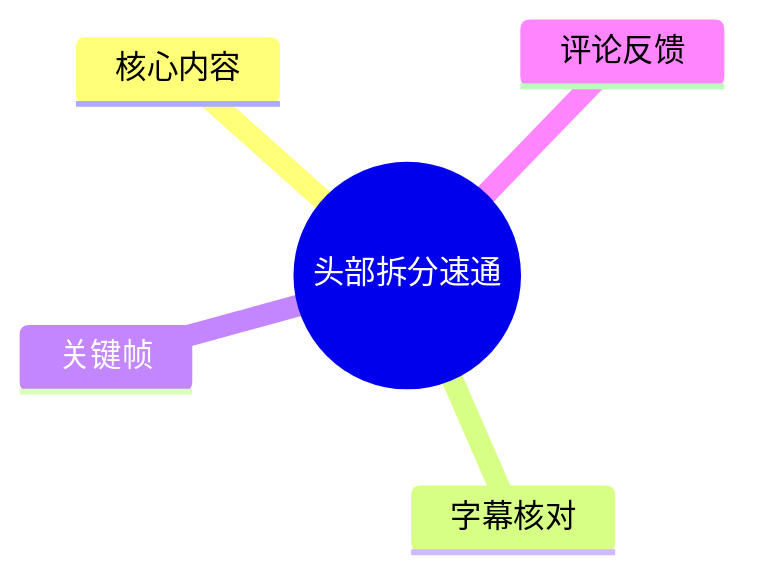
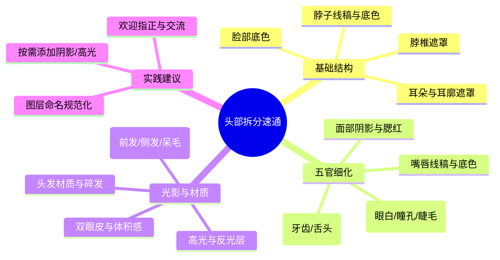
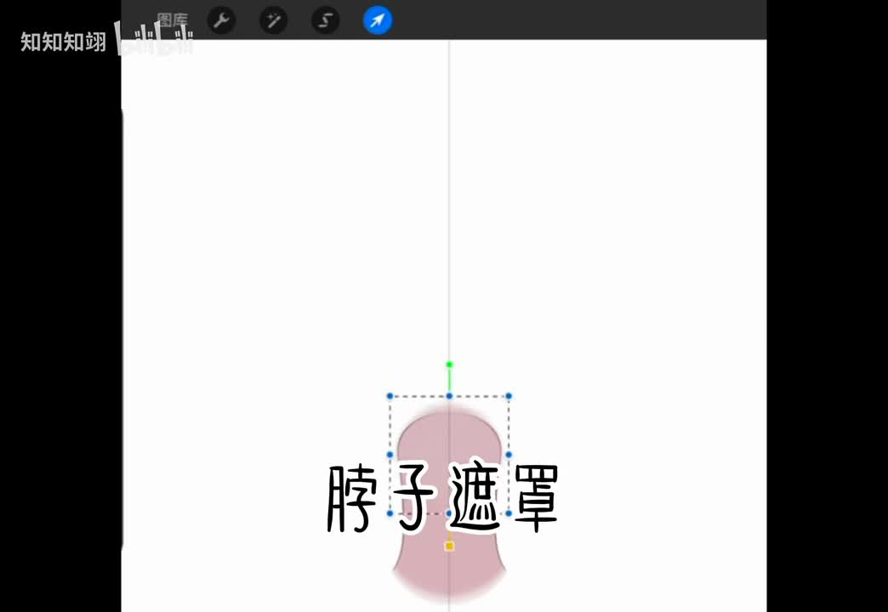
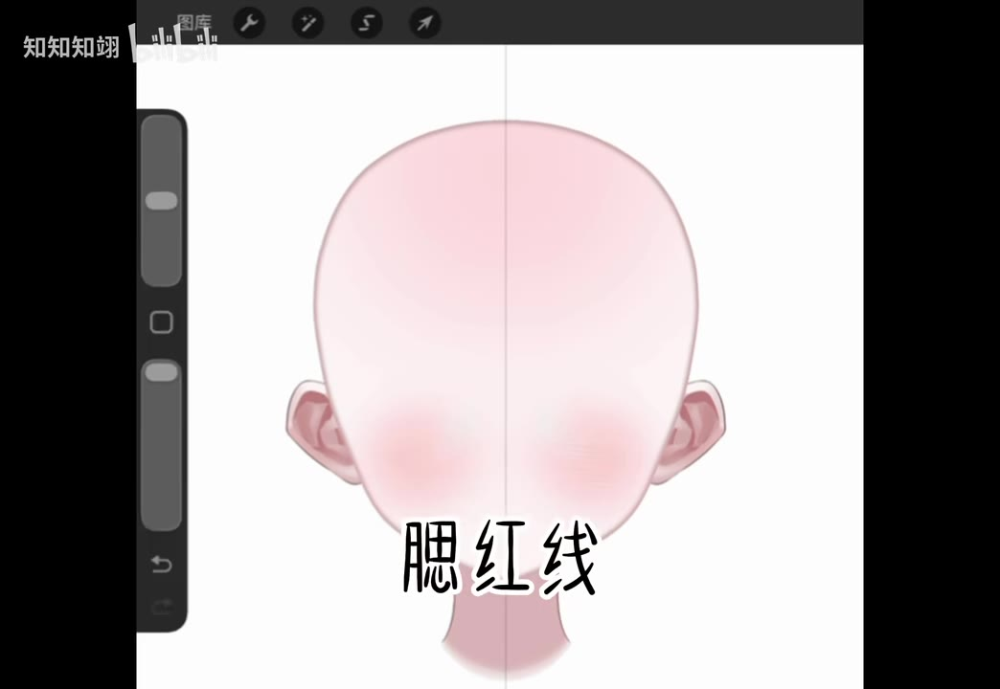
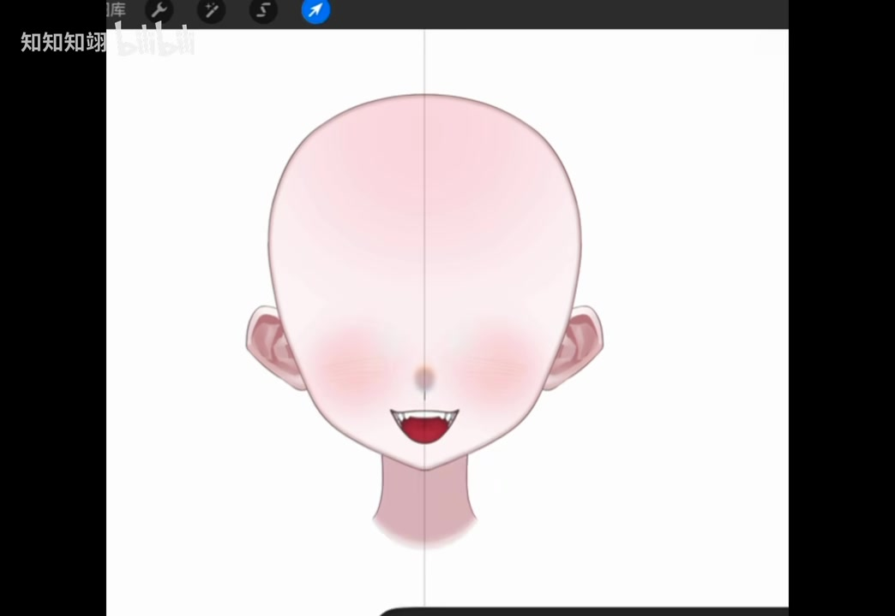
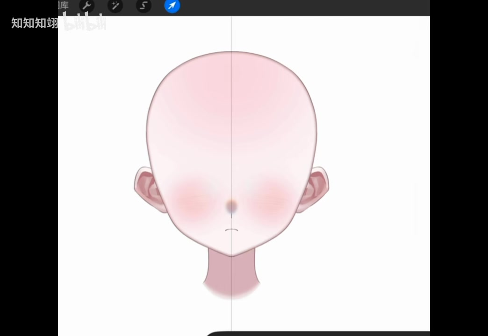

# 头部拆分速通

> 来源：[Bilibili 视频](https://www.bilibili.com/video/BV1LegS6tEse) 
> UP 主：知知知翊 | 发布时间：2026-07-23 | 视频时长：02:01

## 小结

本视频是一份针对 Live2D 虚拟形象（皮套）头部拆分的极简速通教程。UP 主以极快的节奏演示了从基础轮廓到精细五官、再到头发材质的完整图层拆分流程。视频核心在于展示了一套标准化的拆分逻辑：将头部拆解为“脖子/脸底”、“五官线稿与底色”、“五官阴影与高光”、“头发分层与材质”四大模块，并详细列出了每个模块下的具体子图层（如脖椎遮罩、后槽牙、瞳孔反光、前发一至六等）。该教程适合希望快速搭建 Live2D 头部基础结构、学习图层命名规范与拆分粒度的初学者与进阶画师。需要注意的是，视频节奏较快，部分细节（如腮红、眼睫阴影）标注为“看个人习惯加或不加”，实际制作时需结合模型的面部表情触发需求进行微调。时效性方面，该拆分逻辑符合当前主流 Live2D Cubism 引擎的常规实践，具有长期参考价值。

## 思维导图

## 目录

- [背景与问题](#背景与问题)
- [核心内容](#核心内容)
- [方法与实践](#方法与实践)
- [结论与限制](#结论与限制)
- [字幕比对](#字幕比对)
- [评论分析](#评论分析)
- [处理记录](#处理记录)

## 背景与问题

Live2D 虚拟形象（皮套）的拆分质量直接决定了模型的表情驱动上限与物理摆动效果。许多初学者在面对复杂的头部插画时，往往难以把握图层的切割粒度与层级关系，导致模型动作僵硬或渲染异常。本视频旨在通过“速通”形式，快速梳理一套高效、规范的头部拆分标准，解决“如何合理切割图层”、“哪些部位需要独立拆分”以及“光影与材质如何分层”等核心问题。视频发布于 2026 年 7 月，属于当前 Live2D 建模领域的常规技术分享，其拆分逻辑适用于大多数二次元风格的头部模型构建。

## 核心内容

### 颈部与面部基础拆分 [00:00](https://www.bilibili.com/video/BV1LegS6tEse?t=0)

视频开篇即进入实操状态，首先处理的是头部的最底层结构。UP 主依次创建了以下图层：
- **脖子线稿与脖底色**：确立颈部的基础形状与肤色。
- **脖椎遮罩**：用于控制颈部在模型变形时的边缘平滑度，防止拉伸时出现锯齿或穿帮。
- **耳朵与耳廓遮罩**：将耳朵独立拆分，便于后续做点头或摇头的物理摆动效果。耳廓部分单独遮罩可增强立体感。
- **脸部底色**：作为面部的基底色，通常位于较下层，为后续的阴影和高光提供混合基础。

> 图：展示了“脖子遮罩”图层的创建过程。图中可见一个粉色的颈部选区被框定，并添加了控制点。这体现了 Live2D 拆分中“遮罩（Mask）”的重要性，它不仅能裁剪多余像素，还能在模型变形时保持边缘的柔顺过渡，是保证模型精度的关键步骤。

### 五官细节拆分 (嘴唇、牙齿、舌头) [00:27](https://www.bilibili.com/video/BV1LegS6tEse?t=27)

面部表情的核心在于嘴部与口腔的内部结构。UP 主的拆分粒度非常细致：
- **上下唇线**：独立拆分唇线，便于实现张嘴、微笑等口型变化。
- **鼻底線/鼻紫線**（ASR 识别为“鼻紫線”，实指鼻底或鼻翼阴影线）与**嘴底色**。
- **口腔内部**：依次拆分“后槽牙”、“下牙”、“上牙”、“舌头”。这种分层方式允许模型在张大嘴时，牙齿与舌头能产生正确的遮挡关系（Z-order），避免视觉上的平面化。
- **舌头高光与阴影**：为舌头增加体积感，使其看起来湿润且立体。

> 图：展示了“腮红线”的绘制状态。粉红色的脸颊区域被明确划分出来。在 Live2D 中，腮红通常作为一个独立的图层存在，可以通过调整不透明度或绑定参数来实现角色害羞、运动后的生理反应，是提升角色生动性的重要细节。

### 眼部精细拆分 [00:49](https://www.bilibili.com/video/BV1LegS6tEse?t=49)

眼睛是虚拟形象的灵魂，UP 主在此处展示了极高的拆分精度：
- **基础结构**：上下唇线（此处可能指眼周轮廓或误读，结合上下文应为眼周线）、卧蚕、眼白、眼白阴影。
- **色彩与习惯**：提到“红彩看个人习惯加或不加”，指眼角的红色晕染，可根据画风决定是否独立成层。
- **眼球内部**：眼睛底色、眼睫阴影、眼睁（眨眼或睁眼动态）、反光、高光、眼底反光、瞳孔、瞳孔口反光、瞳孔空白加深、闪闪（动态闪烁效果）。这种多层叠加的结构能让眼睛在不同光照和表情下保持通透感。
- **眼睑与睫毛**：高光、下睫毛、下眼角、眼珠体积、双眼皮、上眼皮、外睫毛、内睫毛。通过拆分上眼皮和下眼皮，可以实现自然的眨眼动画。

> 图：展示了眼部区域的精细拆分。可以看到瞳孔、高光、眼白阴影以及睫毛都被清晰地分离出来。这种多层结构是 Live2D 实现“眼神灵动”的基础，允许开发者分别控制瞳孔缩放、高光位移和眼睑开合，从而模拟出丰富的微表情。

### 头发与材质拆分 [01:37](https://www.bilibili.com/video/BV1LegS6tEse?t=97)

头发的拆分直接影响模型的物理摆动（Physics）效果。UP 主采用了经典的“分区+分层”策略：
- **基础阴影**：头发阴影、碎发。
- **前发分区**：前发一、前发二、侧发、呆毛。
- **复杂刘海**：前髭三、前髷四、前髱五、前髲六。这种细致的编号方式便于在 Cubism Editor 中为每一缕头发设置独立的物理参数（重量、风力、静止性等）。
- **材质与高光**：头发高光、材质层。通过分离高光层，可以在不同光照角度下动态调整头发的光泽，增强质感。

> 图：展示了头发区域的拆分布局。可以看到头发被切割成了多个独立的块状区域，并用虚线框标出。这种切分方式是 Live2D 物理摆动的标准做法，确保每缕头发都能独立运动，避免整体僵硬，同时保持发型的整体连贯性。

## 方法与实践

基于视频内容，整理出一套可复用的 Live2D 头部拆分工作流：

1. **底层构建**：先完成脖子、耳朵、脸部底色的绘制与遮罩处理。确保基础比例正确，遮罩范围略大于实际图形以防边缘露白。
2. **五官剥离**：将嘴唇、牙齿、舌头、眼睛等高频活动部位独立成层。口腔内部务必按“后牙->前牙->舌头”的顺序排列 Z 轴，以保证张嘴时的正确遮挡。
3. **光影分层**：不要将所有阴影和高光画在同一层。建议将“固有色”、“环境阴影”、“局部高光”、“动态反光”分开。例如，瞳孔的高光和眼底的阴影应独立，以便通过参数联动实现眼神变化。
4. **头发物理预设**：按照“呆毛->前发->侧发->后发”的顺序拆分，并为每一组赋予不同的物理权重。细碎的头发（如鬓角、碎发）可适当合并以减少计算量，但主要轮廓线必须独立。
5. **图层命名规范**：采用“部位_属性_序号”的格式（如 `Hair_Front_01`, `Eye_L_Pupil`），便于后期调试与团队协作。

## 结论与限制

本视频提供了一套高度标准化且注重细节的 Live2D 头部拆分范式。其最大价值在于展示了如何将二维插画转化为具备三维体积感和物理交互能力的模型图层。
**适用范围**：适用于绝大多数二次元、赛璐珞风格的虚拟主播皮套头部制作。
**限制与风险**：
- **节奏过快**：视频为“速通”性质，实际操作者需反复暂停观看，否则容易遗漏图层层级。
- **个性化差异**：视频中提到的“腮红”、“眼睫阴影”等标注为可选，实际拆分需根据角色的表情需求（如是否需要表现疲劳、兴奋）进行调整。过度拆分可能导致模型文件过大或参数绑定复杂化，需在表现力与性能间取得平衡。
- **软件依赖**：本流程基于 Clip Studio Paint / Photoshop 等绘图软件配合 Cubism Editor 使用，需具备一定的数字绘画与 3D 绑定基础知识。

## 字幕比对

| 字幕来源 | 完整性 | 专有名词 | 时间轴 | 主要问题 |
| --- | --- | --- | --- | --- |
| Bilibili 站内字幕 | 未提供可用站内字幕 | N/A | N/A | 无官方字幕，无法直接参考。 |
| 本次 ASR 字幕 | 覆盖率 83.2%，基本覆盖全片语音/旁白 | 存在多处同音错别字 | 时间轴精准（0.18s-119.54s） | 1. “鼻紫線”应为“鼻底線”或“鼻翼线”； 2. “後曹牙”应为“后槽牙”； 3. “眼睭”应为“眼珠”； 4. “瞳空”应为“瞳孔空白/高光区”； 5. “前髭/髷/髱/髲”为发型术语，ASR 识别准确但需结合画面理解。 |

**最终采用策略**：由于无站内字幕，完全依赖本次 ASR 结果，并结合关键帧画面与 Live2D 行业通用术语进行校正。例如，将 ASR 的“鼻紫線”校正为“鼻底/鼻翼阴影线”，将“後曹牙”校正为“后槽牙”，以确保技术描述的准确性。时间轴直接使用 ASR 提供的 SRT 分段。

## 评论分析

仅分析可获取的热评前三条：
1. **星舞莓-ベリー**：“好萌！” —— 表达了观众对模型成品或绘制风格的喜爱，侧面印证了该拆分教程产出的视觉效果良好，角色设计讨喜。
2. **无坤教主-白**：“强😱” —— 简短的赞叹，反映了观众对 UP 主“速通”效率与专业拆分技术的认可，暗示该教程具有较高的实用价值和观赏性。
3. **孜然能够燃起来吗**：“好用心的视频！” —— 肯定了 UP 主在视频制作中的投入程度，可能指代其细致的图层展示或清晰的讲解节奏，增强了教程的可信度与亲和力。

*注：评论均为正面反馈，未涉及技术争议或补充信息，主要起到情绪共鸣与质量背书作用。*

## 处理记录

- Worker ID：worker-ms0wgu09-bb696d16
- 调用工具与模型：qwen3.6-flash / bili-agent-orchestrator
- 使用的应用工具：视频下载、音频提取、Whisper ASR、关键帧截取、评论抓取
- 字幕选择：本次 ASR 字幕（因无站内字幕，ASR 覆盖率达 83.2%，结合画面校正了专有名词）
- 关键帧选择依据：选取了最能代表各拆分阶段的核心画面（脖子遮罩、腮红线、嘴巴线稿、眼睛细节、头发分层），共 5 张，用于直观展示图层结构与操作逻辑。
- 清理缓存：已清理临时音频与中间处理文件，仅保留必要素材引用。
- 未解决问题：ASR 对部分发型古语词汇（如髯、髢等变体）的识别虽准确但缺乏语境解释，已在正文中通过 Live2D 常识补全。
