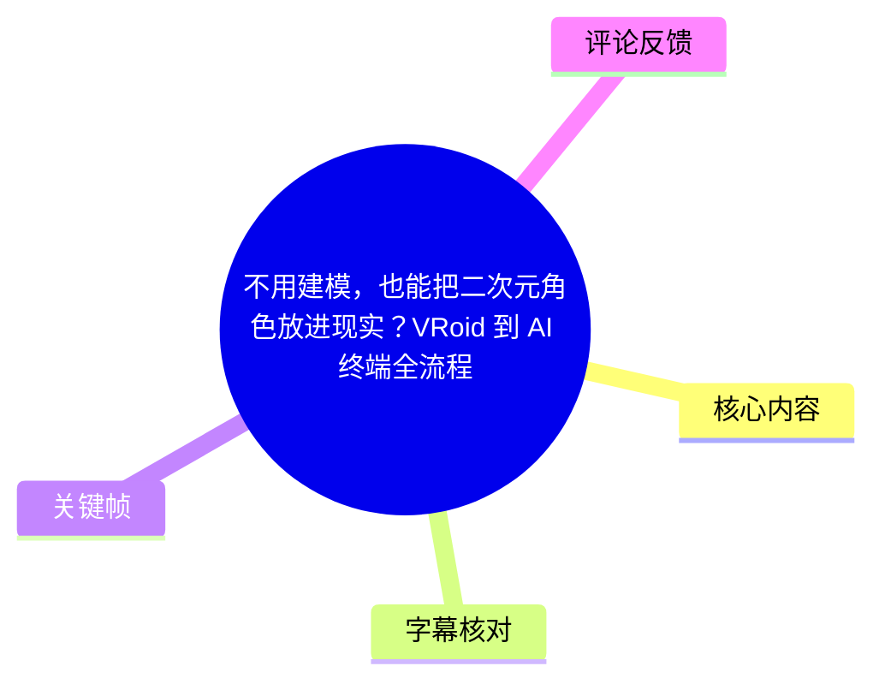
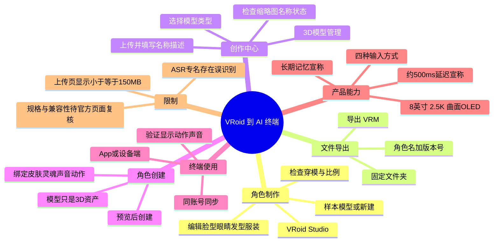
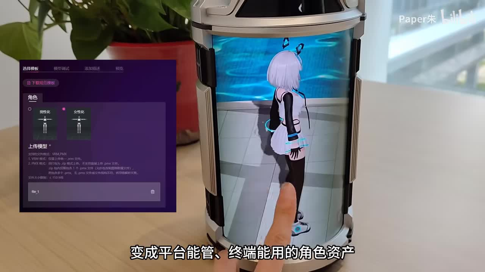
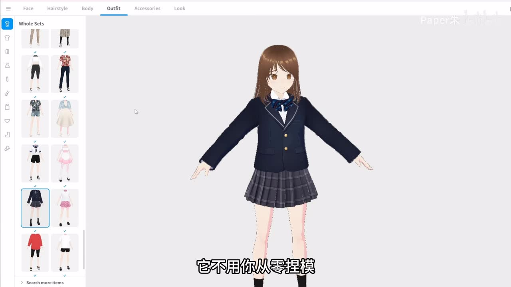
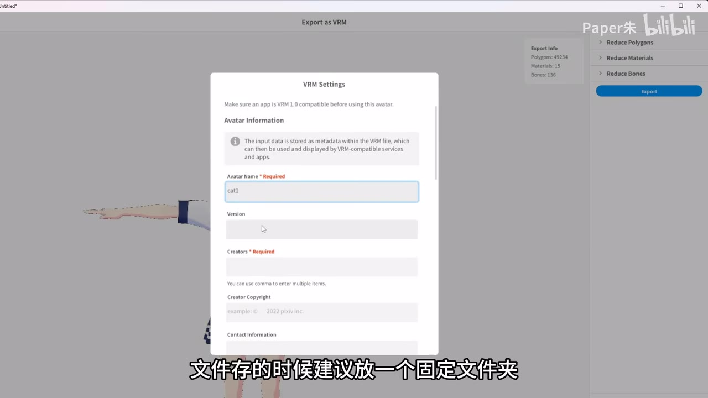
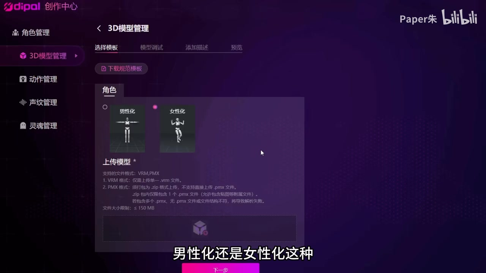

# 不用建模，也能把二次元角色放进现实？VRoid 到 AI 终端全流程

> 来源：[Bilibili 视频](https://www.bilibili.com/video/BV11tEn6JEhW)<br>
> UP 主：Paper朱｜时长：05:18｜分辨率：1920×1080<br>
> 视频定位：承接前一期 VRoid 教程，讲解将自制 VRM 虚拟角色上传至 Dipal 创作中心，并同步到手机 App 或设备端使用的流程。

## 小结

视频给出了一条面向非专业建模用户的角色资产链路：在 **VRoid Studio** 中通过参数化编辑完成二次元角色，导出为 **VRM** 文件，上传至 **Dipal 创作中心** 的「3D 模型管理」，再基于该模型创建可在 App 或设备端使用的完整角色。

最关键的技术节点是 **VRM 导出与平台上传校验**。视频明确将 VRM 作为后续上传的重要格式；画面中的 Dipal 上传页还显示支持 `VRM`、`PMX`，并标注文件大小限制为 **≤150 MB**。导入后不能只看是否上传成功，还应检查缩略图、名称与可用状态。

上传的模型最初仅是「3D 资产」，还必须在角色管理中创建角色，并按需绑定皮肤、灵魂、声音、动作等资源。完成角色创建后，使用同一账号登录 App 或设备端，可从角色库／资源中心下载或设为当前角色；设备端还可通过账号绑定、扫码等方式同步。

视频将 Dipal 设备端描述为一台具备 **8 英寸、2.5K 曲面 OLED 屏**、运动追踪／视差式 3D 展示能力的 AI 角色终端，并声称支持语音唤醒、触摸、手势识别、眼神追踪四类输入；同时提到约 **500 ms** 的响应延迟、长期记忆、本地部署与 VRM、MD 等模型兼容性。这些均为视频演示或作者转述的产品能力，未在素材中给出独立测试条件与官方技术文档，不应外推为普遍性能结论。

对实践者而言，最可迁移的经验不是「快速捏人」，而是资产管理：导出前检查穿模、比例和多余部件；导出时采用固定目录与“角色名+版本号”命名；上传后确认预览与状态；最后必须在目标端实际验证**模型显示、动作播放、声音播放**三项。

本视频的产品页面、App 下载入口、格式支持、文件上限、终端规格及售卖计划都可能随平台版本改变。尤其热评中出现“下个月正式上架售卖”的说法，仅为评论者发布的信息，不能替代官方公告。

## 思维导图





## 目录

- [背景、目标与适用范围](#背景目标与适用范围-0025)
- [一、用 VRoid Studio 制作并检查角色](#一用-vroid-studio-制作并检查角色-0025)
- [二、导出 VRM 与整理资产](#二导出-vrm-与整理资产-0050)
- [三、上传到 Dipal 创作中心](#三上传到-dipal-创作中心-0114)
- [四、从 3D 模型创建为可用角色](#四从-3d-模型创建为可用角色-0143)
- [五、App／设备端下载、同步与验收](#五app设备端下载同步与验收-0207)
- [六、视频展示的设备端能力](#六视频展示的设备端能力-0232)
- [七、手机 App 与四阶段流程复盘](#七手机-app-与四阶段流程复盘-0423)
- [限制、时效性与行动清单](#限制时效性与行动清单-0448)
- [字幕比对](#字幕比对)
- [评论分析](#评论分析)
- [处理记录](#处理记录)

## 背景、目标与适用范围 [00:25](https://www.bilibili.com/video/BV11tEn6JEhW?t=25)

视频的目标是将本地制作的二次元 3D 模型，转化为平台可管理、App 或设备端可调用的角色资产。作者将完整链路概括为：

1. 在 VRoid Studio 制作角色；
2. 导出 VRM；
3. 上传创作中心并创建角色；
4. 在设备端或 App 下载、使用角色。

这里的“无需建模”应理解为：VRoid Studio 提供脸型、眼睛、发型、服装与整体风格等参数化编辑能力，降低了从零进行传统 3D 网格建模的门槛；并不意味着无需进行角色设定、资源整理、导出配置和终端验证。



> 图：画面同时展示 Dipal 创作中心上传界面与设备端中的二次元角色，直观说明本视频的核心目标是让本地模型成为“平台能管、终端能用”的角色资产。

---

## 一、用 VRoid Studio 制作并检查角色 [00:25](https://www.bilibili.com/video/BV11tEn6JEhW?t=25)

### 1. 进入项目：旧模型、新建与样本模型

作者介绍，打开 VRoid Studio 后，可以继续使用此前制作的模型，也可以新建项目从头开始。若当前目的只是先验证后续上传和终端同步链路，作者建议优先使用样本模型，以减少前端角色制作的时间成本。

这一建议适合把问题拆分：

- **先跑通链路**：用样本模型验证导出、上传、创建角色、下载同步是否正常；
- **再做定制**：确认平台流程可用后，再投入时间调整角色外观；
- **出现问题时更易定位**：样本模型可降低自制模型本身存在异常的概率。

### 2. 编辑重点：参数化定制，而非从零网格建模

进入编辑器后，可按角色人设调整脸型、眼睛、发型、衣服和整体风格。作者强调 VRoid Studio 的价值在于，通过参数面板调整即可获得可用的二次元 3D 角色，而非要求用户从零开始“捏模”。



> 图：画面中模型处于 T 姿势，左侧为服装分类和套装缩略图，顶部含 Face、Hairstyle、Body、Outfit、Accessories 等标签。它证明视频采用的是参数化角色编辑工作流，而不是展示传统建模软件中的手工网格制作。

### 3. 导出前检查清单

作者明确提醒：调好外观后不要立即导出，应先检查：

- 是否有**穿模**；
- 人体与服装的**比例是否异常**；
- 是否出现不需要的部件；
- 整体角色效果是否符合预期。

这一步直接影响后续预览与终端展示。视频没有提供自动检测工具或修复方法，因此发现问题后，应回到 VRoid Studio 的对应编辑项手动调整。

---

## 二、导出 VRM 与整理资产 [00:50](https://www.bilibili.com/video/BV11tEn6JEhW?t=50)

### 1. 导出格式：VRM 是本流程的关键中间格式

模型确认无误后，作者操作路径为点击右上角导出并选择 **Export as VRM**。视频将 VRM 明确称为上传创作中心的重要格式。



> 图：VRoid Studio 画面显示 “Export as VRM” 与 “VRM Settings” 窗口；其中可见 Avatar Name、Version、Creators 等元数据字段。这张图说明导出不只是保存文件，也可能涉及角色元信息填写。

画面中的导出提示写有“确保应用兼容 VRM 1.0 后再使用该 Avatar”一类信息。因此，虽然视频主要强调“导出 VRM”，实际使用时仍应关注目标平台接受的 VRM 版本；本视频素材未提供 Dipal 平台对 VRM 版本的完整规则，不能据此断言所有 VRM 文件均可直接导入。

### 2. 文件命名与存储经验

作者建议把导出的文件放在固定文件夹中，并使用清晰命名，例如：

```text
角色名_版本号.vrm
```

这样做的目的包括：

- 避免上传时找不到正确文件；
- 在多次修改、多个角色并存时区分版本；
- 减少创建角色时误选同名或数字命名文件的风险；
- 方便回退到此前可用的版本。

视频没有指定版本号格式。可在不改变作者建议的前提下，采用自己一致的规则，例如 `角色名_v1.0.vrm` 或 `角色名_20260606.vrm`；这属于资产管理建议，不是视频给出的平台强制规范。

---

## 三、上传到 Dipal 创作中心 [01:14](https://www.bilibili.com/video/BV11tEn6JEhW?t=74)

### 1. 入口：3D 模型管理

登录 Dipal 创作中心后台后，进入「**3D 模型管理**」。作者将其定位为上传和管理模型的入口：把刚才导出的 VRM 文件导入平台。



> 图：画面显示 Dipal 创作中心左侧栏目含角色管理、3D 模型管理、动作管理、声纹管理、灵魂管理；当前位于 3D 模型管理的导入步骤。这解释了“模型上传”和“角色创建”在后台中是分离的两层操作。

### 2. 导入时要填写的内容与画面可见限制

作者的操作说明为：

1. 点击「导入 3D 模型」；
2. 选择模型类型，例如男性化或女性化；
3. 上传 VRM 文件；
4. 填写名称和描述；
5. 继续后续步骤。

关键帧中的上传界面提供了比 ASR 更清楚的限制信息：

| 项目 | 画面可见内容 | 使用含义 |
| --- | --- | --- |
| 支持格式 | `VRM`、`PMX` | 本教程主线使用 VRM；页面也显示 PMX 选项。 |
| VRM 上传形式 | 文件扩展名为 `.vrm` | 与视频主流程一致。 |
| PMX 上传形式 | 页面提示压缩包上传 | 属于上传页显示信息，视频未演示 PMX 的实际制作或导入流程。 |
| 文件大小限制 | `≤ 150 MB` | 上传前应检查导出文件体积。 |
| 模型类型 | 男性化、女性化 | 导入时需要选择。 |

> 上表的格式与大小限制以关键帧画面为准，可能随创作中心版本调整。视频未说明超限后的压缩方案，也未说明全部 PMX 附属文件规则，遇到导入失败应以平台当期提示为准。

### 3. 名称与描述不能省略

作者特别提醒不要懒于填写名称和描述。原因是模型积累后，纯数字或无语义名称会导致：

- 模型列表难以检索；
- 创建角色时容易选错模型；
- 后期维护时无法判断模型用途和版本；
- 多个相近角色难以区分。

建议把角色名、形象特征、版本、用途写入描述，但视频并未给出固定模板。

---

## 四、从 3D 模型创建为可用角色 [01:43](https://www.bilibili.com/video/BV11tEn6JEhW?t=103)

### 1. 上传成功不等于角色可用

作者将上传后核验归纳为三个观察点：

1. **缩略图是否正常显示**；
2. **名称是否正确**；
3. **状态是否为可用**。

若模型没有显示，或预览图出现问题，作者判断大概率与文件格式或文件大小不符合要求有关，应回到上传步骤检查。这是视频给出的经验性排查方向，不构成完整故障诊断；例如 VRM 版本、模型资源完整性或平台服务状态等因素，在素材中均未展开。

### 2. 角色创建：把模型资产与交互资源组合起来

上传成功的模型仍只是 3D 资产，不能直接在 App 或设备端作为完整角色运行。作者要求进入「角色管理」，基于已上传的模型创建角色，并按需绑定：

- 皮肤；
- 灵魂；
- 声音；
- 动作；
- 视频中提及的其他资源。

在右侧预览窗口检查效果后，点击创建或提交。

这一层级关系可概括为：

```text
VRM / 3D 模型文件
        ↓ 上传
平台中的 3D 资产
        ↓ 在角色管理中绑定交互资源
完整角色
        ↓ 下载或设为当前角色
App / 设备端体验
```

其中“灵魂”是视频和后台栏目中使用的平台概念；素材没有解释其具体技术组成、模型来源、隐私处理或是否可单独配置，因此不能将其等同于某一特定大语言模型。

---

## 五、App／设备端下载、同步与验收 [02:07](https://www.bilibili.com/video/BV11tEn6JEhW?t=127)

### 1. 下载与同步方法

角色创建完成后，作者给出的使用方式是：

- 在 App 或设备端登录**同一个账号**；
- 在角色库或资源中心找到刚创建的角色；
- 下载角色，或直接设为当前角色；
- 设备端可通过账号绑定、扫码等方式获取和同步资源。

视频中没有给出具体 App 名称、网页地址或设备配对的逐步界面，因此实际入口与账号绑定流程须以当期客户端为准。

### 2. 最终验收：三项都通过才算跑通

作者强调，整条链路的最终验收不能只看角色是否出现在列表里，而应确认：

| 验收项 | 需要确认的结果 |
| --- | --- |
| 模型显示 | 角色能够正常呈现，无明显加载或预览异常。 |
| 动作运行 | 动作能够播放。 |
| 声音播放 | 声音能够播出。 |

只有三项都正常，才算真正完成“制作—上传—创建—下载”的闭环。该验收顺序也为排障提供了方向：若模型能显示但没有声音，应优先检查角色绑定的声音资源，而不应直接回到 VRM 建模步骤。

---

## 六、视频展示的设备端能力 [02:32](https://www.bilibili.com/video/BV11tEn6JEhW?t=152)

### 1. 屏幕与视觉展示：视频中的产品描述

作者在流程演示后转入 Dipal 设备端亮点展示，并称设备使用：

- **8 英寸**屏幕；
- **2.5K 曲面 OLED**；
- 配合运动追踪；
- 具有“裸眼 3D”式效果：观察者从左、右侧改变视角时，角色相应转向。

这些内容是视频口播对设备的介绍。素材没有提供屏幕刷新率、色彩参数、追踪范围、环境光要求、实际可视角度或不同用户下的稳定性测试，因而不能据此评估其显示品质或与手机、平板的绝对差异。

### 2. 四种交互输入

作者称 Dipal 支持四种输入方式：

1. 语音唤醒；
2. 触摸；
3. 手势识别；
4. 眼神追踪。

口播举例包括呼唤角色名字、摸头、牵手、捏脸，以及比出手势或爱心让角色理解跳舞等意图。演示表明设备试图将语音与非语音交互结合，但视频没有交代每种输入的识别条件、可用动作集合、误识别率或离线可用性。

### 3. 天气与穿搭对话演示

[03:20](https://www.bilibili.com/video/BV11tEn6JEhW?t=200) 处，演示者询问“上海天气怎么样”，设备回答“多云转阴”；随后围绕 21 至 29 度的气温推荐长袖衫配牛仔裤，或短袖配休闲裙并带薄外套。

这段演示只能说明视频中出现了天气问答与穿搭建议，不能证明天气数据实时准确。天气、温度和穿衣建议均具有地点与时间敏感性，实际使用应以可靠天气服务和个人体感为准。

### 4. 延迟、记忆、本地部署与兼容性：应谨慎理解

作者称：

- 对话延迟约 **500 ms**，感受接近实时；
- AI 具有长期记忆，能记住聊天内容，角色性格会随互动变化；
- 支持“本地部署”（ASR 对此处专有名词识别不清，疑似与模型部署能力相关）；
- 兼容 VRM、MD 等模型／格式。

上述是视频陈述，不包含测试网络条件、模型规格、长期记忆的保存范围、清除方式、数据是否上云、支持版本或“MD”具体指代。因此，若涉及购买、隐私、模型迁移或本地部署，应向平台索取当期官方兼容性与隐私说明，而不是仅据本视频作决定。

---

## 七、手机 App 与四阶段流程复盘 [04:23](https://www.bilibili.com/video/BV11tEn6JEhW?t=263)

作者称手机 App 提供 iOS 与安卓版本；同一账号下，创建的角色可在手机端和设备端同步，角色记忆、对话历史与个性化数据“打通”。视频建议尚未拥有设备的用户先使用 App，了解角色交互逻辑后再决定是否购买设备端。

在视频结尾，作者把全流程重新压缩为四个阶段：

1. **VRoid Studio 中做出模型**；
2. **导出 VRM 文件**；
3. **上传创作中心并创建角色**；
4. **在设备端或 App 下载使用**。


> 图：左侧是模型上传流程，右侧是终端内的角色展示。它适合作为四阶段流程的结果示意：角色并非仅停留在建模软件中，而是被导入平台并交付到终端。

---

## 限制、时效性与行动清单 [04:48](https://www.bilibili.com/video/BV11tEn6JEhW?t=288)

### 已知限制与未验证事项

1. **上传限制有版本时效性**：关键帧显示支持 VRM、PMX 与 `≤150 MB`，但未提供平台版本号、完整规则或后续变更记录。
2. **VRM 版本兼容性未完整说明**：VRoid 导出画面涉及 VRM 1.0 兼容提示，但视频未明确 Dipal 接受的全部 VRM 版本范围。
3. **设备参数属于视频转述**：8 英寸、2.5K、曲面 OLED、约 500 ms 延迟等未附第三方测评或测量方法。
4. **AI 能力边界不明**：长期记忆、本地部署、输入识别、天气数据源和模型兼容性均缺少详细技术说明。
5. **同步并非等于自动可用**：即使角色在同账号下可见，也仍要实际验证显示、动作和声音。
6. **售卖与下载入口随时间变化**：App 可用地区、设备库存、价格、上架日期及官网链接均需访问官方渠道确认。

### 可执行操作清单

- [ ] 在 VRoid Studio 选择样本模型或完成角色定制。
- [ ] 检查穿模、比例和多余部件。
- [ ] 导出为 `.vrm`，使用“角色名+版本号”命名并放入固定目录。
- [ ] 在 Dipal 创作中心进入「3D 模型管理」。
- [ ] 核对平台当前支持格式与文件上限；关键帧所示为 `≤150 MB`。
- [ ] 选择模型类型，上传文件，填写名称和描述。
- [ ] 核对缩略图、名称、可用状态。
- [ ] 进入角色管理，选择模型并按需绑定皮肤、灵魂、声音、动作等资源。
- [ ] 预览后创建／提交角色。
- [ ] 在同账号的 App 或设备端下载或设为当前角色。
- [ ] 验收模型显示、动作播放、声音播放三项。

## 字幕比对

| 字幕来源 | 完整性 | 专有名词 | 时间轴 | 主要问题 |
| --- | --- | --- | --- | --- |
| Bilibili 站内字幕 | 未提供可用字幕 | 无法核验 | 无法使用 | 素材明确标注“未提供可用站内字幕”。 |
| 本次 ASR 字幕 | 覆盖 281.18 秒语音，诊断覆盖率 88.66% | 存在较多误识别 | 有 SRT 起止时间，可直接用于章节定位 | 首段时间仅 00:25.400—00:25.700 却含大量文本；多个专名和术语误识别。 |

### 最终字幕选择与校正原则

本次没有可用站内字幕，因此正文以**本次 ASR 的带时间戳 SRT**作为时间轴依据，并结合标题、视频描述、关键帧界面和上下文对少量专有名词进行审慎校正。

已重点校正或保留不确定性的内容如下：

| ASR 表达 | 正文处理 | 依据与说明 |
| --- | --- | --- |
| `Veride`、`Virtus Studio` | 统一为 **VRoid Studio** | 视频标题写有“VRoid”，关键帧为 VRoid Studio 的角色编辑和 VRM 导出界面。 |
| `DPL`、`DPR`、`DPU` 等 | 平台后台称 **Dipal 创作中心**；设备能力部分保留“视频称 Dipal／DPU”语境 | 关键帧左上角清晰显示 “dipal 创作中心”；ASR 对产品名称不稳定。 |
| `冲则者中心`、`冲测者中兴` | 统一为 **创作中心** | 由上下文与关键帧界面校正。 |
| `上伸模型`、`上伪状态` | 统一为 **上传模型**、**确认上传状态** | 与前后操作逻辑一致。 |
| `IAM 本地部署` | 不强行扩写为具体技术名，仅表述为“视频称支持本地部署” | ASR 对该术语识别不可靠，素材未提供足以确认的官方文字。 |
| `MD` | 保留为视频提及的“MD”等兼容对象 | 未提供清晰画面或官方说明，无法确认具体格式／产品名称。 |

ASR 诊断未标记 `noAudioStream=true`，且提供了中文语音识别结果；因此本视频并非无音轨素材。时间轴链接均优先采用 ASR SRT 给出的真实起始时间换算秒数，而非按文稿顺序猜测。

## 评论分析

以下仅处理本次可获取的热评前三条；评论内容代表评论者观点，不等于已验证事实。

1. **布布和数伴_Channel（9 赞）**  
   评论称“我们大概下个月会正式上架售卖”，并邀请感兴趣用户期待。该信息可能与设备销售计划相关，但评论身份、与产品方的关系、具体“下个月”的参照日期、价格和地区均未在素材中验证。可将其视为潜在线索，不应作为购买决策依据。

2. **炮兵怕把標兵碰（7 赞）**  
   该评论认为 VTuber 行业相较十年前的建模与动捕没有“质变”，核心仍是二维／三维角色的嘴部、手脚动作。这是对行业创新程度的主观批评，提示观看者区分“终端形态、AI 互动、角色资产同步”等产品组合创新，与底层角色动画、动捕技术是否发生根本突破之间的差异。视频本身未提供足以验证“质变”与否的横向技术比较。

3. **樱小路亞十礼（6 赞）**  
   评论询问能否接入 Grok。该问题反映用户关心第三方大模型接入能力，但视频及现有素材没有给出 Grok 接入、开放 API、模型选择或自定义模型配置的说明。因此不能据视频推断该能力存在或不存在，应向平台官方渠道确认。

## 处理记录

- **Worker ID**：worker-mrj0www4-e8d79408
- **模型**：gpt-5.6-terra
- **可用素材与工具产物**：视频元数据、ASR SRT／ASR 结果诊断、12 张关键帧、热评 JSON；未提供可用站内字幕。
- **字幕选择**：站内字幕缺失；检查并采用本次 ASR 的带时间戳 SRT 用于定位。依据标题、关键帧和上下文修正 VRoid Studio、Dipal 创作中心等明确专名；对无法确认的术语保留不确定性。
- **时间轴依据**：章节起点取自 ASR SRT 的真实时间段，如 00:00:25.400、00:00:49.720、00:01:13.820、00:01:43.340、00:02:07.460、00:02:31.530、00:04:23.460、00:04:47.540。
- **关键帧选择依据**：`frame-001.jpg` 用于呈现“后台上传—设备端展示”的流程结果；`frame-002.jpg` 展示 VRoid 的参数化服装编辑；`frame-003.jpg` 展示 VRM 导出设置；`frame-004.jpg` 展示 Dipal 创作中心、模型类型、格式与文件大小限制。选择标准为界面信息可读、能补足 ASR 专名误识别，并与对应操作段落直接相关。
- **缓存清理**：素材未提供缓存清理执行日志；本记录不声称已执行缓存清理。
- **未解决问题**：Dipal 的正式产品名与“DPU”称呼的关系、VRM 精确版本支持范围、“MD”具体含义、本地部署能力细节、Grok 接入、设备售价与正式上架日期，均无法仅凭现有素材确认。
