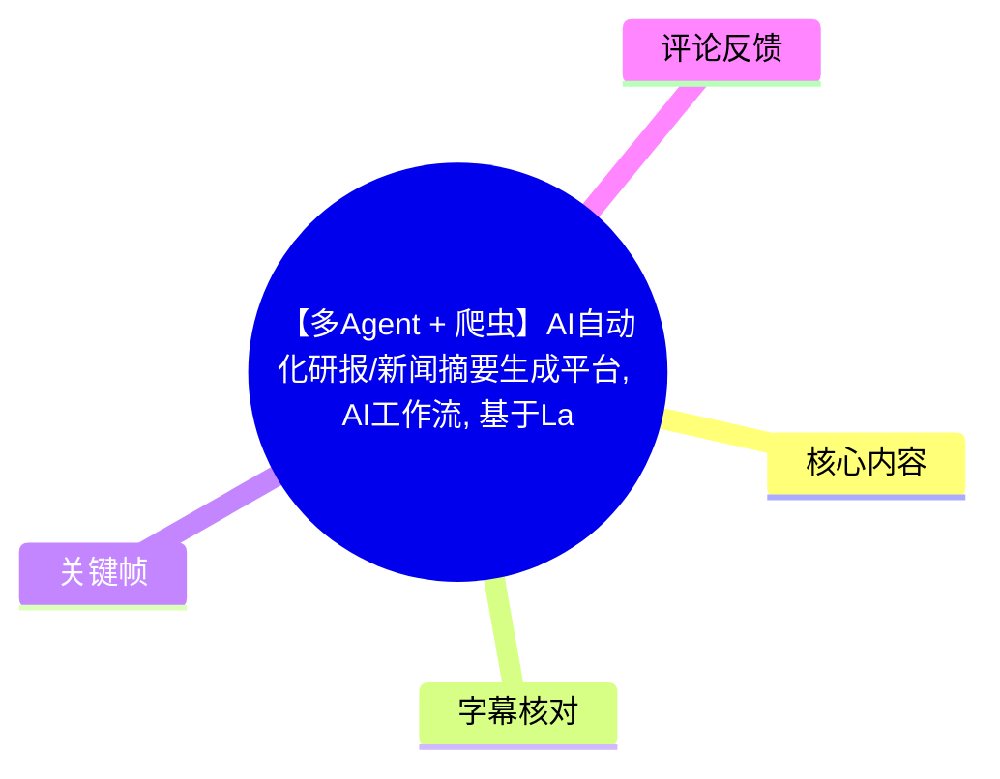
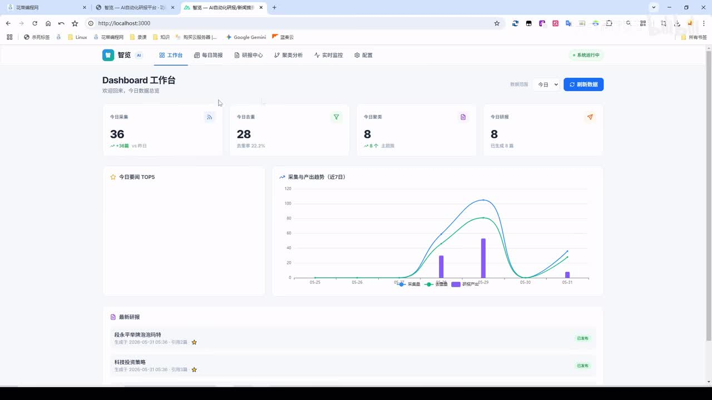
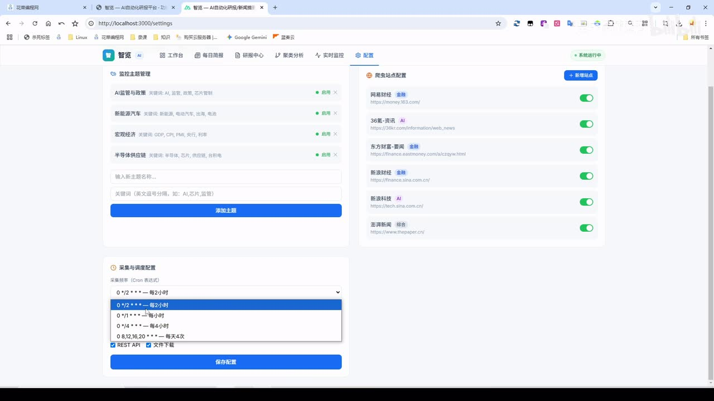
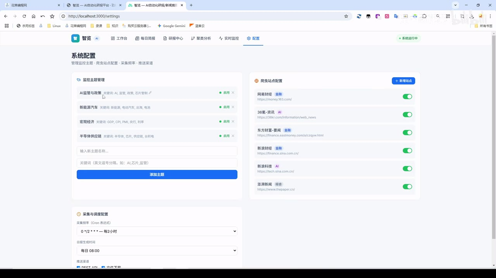
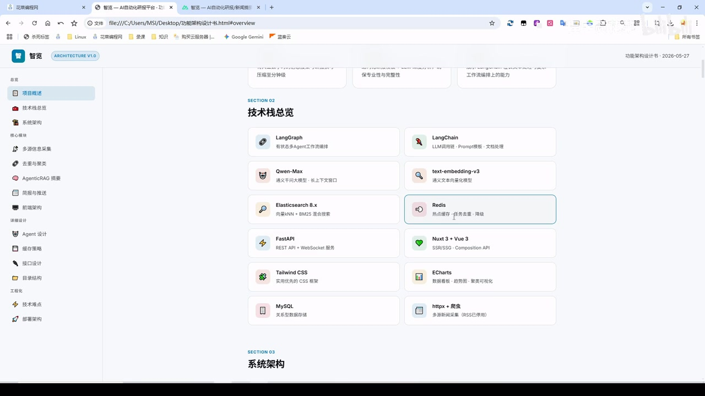

# 【多Agent + 爬虫】AI自动化研报/新闻摘要生成平台

> 来源：[Bilibili 视频](https://www.bilibili.com/video/BV1ucVn6gEhk)  
> UP 主：程序员花菜｜合集：AIcode｜视频时长：11 分 16 秒  
> 视频描述中的资料入口：`https://huacaibc.com`

## 小结

视频展示了一个面向财经、科技等新闻场景的 **AI 自动化研报/新闻摘要平台**。系统以多 Agent 工作流为主线，结合多站点爬虫，从新闻采集、预处理、去重、聚类、摘要、审核到日报/研报组装与推送，形成可定时或手动触发的闭环。

项目的关键设计是：将原本展示为 10 个环节的流程整合为 8 个大步骤，并使采集频率、主题关键词和新闻站点均可配置。视频中的可选采集频率包括每小时、每两小时、每四小时和每日四次；日报默认生成时间展示为每日 08:00。手动采集后，界面会展示 Agent 当前执行状态和整体进度。

技术栈以 **LangGraph + LangChain** 为工作流和大模型调用基础，模型展示为 **Qwen-Max**，向量模型为 **text-embedding-v3**；检索使用 Elasticsearch 8.x 的 KNN + BM25 混合搜索，Redis 用于缓存，FastAPI 提供后端 API，前端采用 Nuxt 3 + Vue 3。关键帧中的项目设计书还展示了 MySQL、httpx + 爬虫、Tailwind CSS 和 ECharts。

视频用一次实际运行演示了结果：某次运行中采集 42 篇、去重后 33 篇、聚类 14 个、生成研报 13 篇，去重率为 21%；日报包含今日要闻 Top 5、2～3 篇深度研报、行业动态速览、数据看板和明日关注。新闻页面可以跳转到来源原文，聚类页面支持按重要性或时间排序。

该视频定位为项目介绍而非完整部署教程。UP 主称完整开发过程共 12 节，本视频为第 1 节，后续第 2～12 节才是开发过程。视频中展示的新闻内容、日期、文章数、市场情绪以及模型版本均是演示时的即时状态，不能视为当前实时数据或生产环境性能承诺；“收费吗”的评论也未获视频或评论区答复。

## 思维导图



```mermaid
mindmap
  root((AI 自动化研报平台))
    目标
      多 Agent 新闻处理
      自动生成日报与研报
      可用于项目展示与求职简历
    工作流
      采集
      预处理与去重
      聚类
      摘要
      审核
      组装
      推送
    配置能力
      新闻站点
      主题与关键词
      定时采集
      手动采集
      日报生成时间
    技术栈
      LangGraph
      LangChain
      Qwen-Max
      Elasticsearch 8.x
      Redis
      FastAPI
      Nuxt 3 与 Vue 3
    输出
      工作台数据看板
      今日要闻 Top 5
      深度研报
      Markdown
      PDF
    限制
      视频仅为项目介绍
      站内字幕不可用
      部分专有名词依赖画面校正
      新闻与统计数据具有时效性
```

## 目录

- [项目定位与工作台概览](#项目定位与工作台概览)
- [配置、调度与手动触发](#配置调度与手动触发)
- [技术栈与系统架构](#技术栈与系统架构)
- [多 Agent 工作流与关键实现](#多-agent-工作流与关键实现)
- [日报、研报与数据看板](#日报研报与数据看板)
- [聚类分析、监控与配置边界](#聚类分析监控与配置边界)
- [求职资料与课程范围](#求职资料与课程范围)
- [关键参数与实践步骤](#关键参数与实践步骤)
- [限制、时效性与核验建议](#限制时效性与核验建议)
- [字幕比对](#字幕比对)
- [评论分析](#评论分析)
- [处理记录](#处理记录)

## 项目定位与工作台概览

### 项目目标：多 Agent、爬虫与工作流的研报自动化 [00:00:00](https://www.bilibili.com/video/BV1ucVn6gEhk?t=0)

UP 主将项目定位为“AI 自动化研报/新闻摘要生成平台”，由三部分组成：

1. **多 Agent 工作流**：把新闻处理拆分为多个有状态的步骤；
2. **多来源爬虫**：从多个新闻渠道抓取信息；
3. **日报/研报输出**：将审核后的内容组装为每日简报、研报及可下载文件。

视频明确提到，该项目可以作为求职时简历中的项目案例。但这属于作者对项目展示价值的判断，不等同于招聘效果保证。

### 工作台展示的数据结构 [00:00:24](https://www.bilibili.com/video/BV1ucVn6gEhk?t=24)

视频一开始展示工作台。UP 主说明，当日尚未爬取数据时，可在“实时监控”中使用 AI 工作流启动数据抓取。工作流被概括为 8 个大步骤：

- 采集；
- 预处理；
- 去重；
- 聚类；
- 摘要；
- 审核；
- 组装；
- 推送。



> 图：该关键帧展示 Dashboard 工作台，包括“今日采集、今日去重、今日聚类、今日研报”指标、近 7 日采集/去重趋势图和最新研报列表。它说明项目不仅生成文本，还提供运行结果和统计可视化。  
> 注意：画面中的 36、28、8、8 是此时界面展示的一组数据；后续实际运行演示出现了 42、33、14、13，二者属于不同展示时点，不能混为同一批任务结果。

### 配套资料范围 [00:00:48](https://www.bilibili.com/video/BV1ucVn6gEhk?t=48)

作者称项目资料包含：

- 平台总览/总体报告；
- 项目设计书；
- 简历模板；
- 面试问题合集；
- 项目启动部署教程。

其中项目设计书可提供 Markdown 与 HTML 两种形式；视频没有展示资料下载权限、价格、许可证或代码仓库地址，因此不能据此判断项目是否开源或是否收费。

## 配置、调度与手动触发

### 定时采集与日报时间 [00:01:12](https://www.bilibili.com/video/BV1ucVn6gEhk?t=72)

系统配置页展示采集与日报调度能力。UP 主举例说明：

| 配置项 | 视频中展示/说明 |
| --- | --- |
| 每两小时采集 | 02:00、04:00、06:00、08:00、10:00、12:00 等 |
| 其他采集频率 | 每小时、每四小时、每日四次 |
| 每日四次示例 | 08:00、12:00、16:00、20:00 |
| 日报生成时间 | 每日 08:00 |
| 即时执行 | 点击“手动采集”按钮 |



> 图：该画面展示 Cron 表达式选项，例如 `0 */2 * * *`（每 2 小时）、`0 * * * *`（每小时）、`0 */4 * * *`（每 4 小时）及每日四次的固定时刻。它为视频中口述的调度参数提供了可视化依据。

视频仅说明可配置调度，并未说明调度器实现、时区规则、失败重试、并发限制、任务幂等性或错过任务后的补偿策略。实际部署时，这些都是定时爬取系统必须另行设计和验证的部分。

### 主题、关键词与新闻站点 [00:01:36](https://www.bilibili.com/video/BV1ucVn6gEhk?t=96)

手动采集启动后，视频展示了 AI 监管、金融政策、新能源等主题。站点来源示例包括：

- 网易财经；
- 36 氪；
- 东方财富；
- 新浪财经；
- 新浪科技；
- 澎湃新闻。

系统支持在配置页开启/关闭站点，也允许新增自定义站点；主题名称和关键词同样可新增或编辑。



> 图：该关键帧展示左侧“监控主题管理”、右侧“爬虫站点配置”，以及下方“采集与调度配置”。画面可辨识到主题如“AI监管与政策”“新能源汽车”“宏观经济”“半导体供应链”，站点则附有分类标签和启用开关，说明系统的采集范围由配置驱动，而非固定写死。

视频提到采集网易财经、36 氪、东方财富和新浪等来源，但没有逐一说明各站点的 HTML 结构适配、登录限制、robots 协议、版权许可或接口稳定性。因此，“可新增站点”不意味着任意网站均可合法且稳定地抓取。

## 技术栈与系统架构

### 技术选型 [00:02:16](https://www.bilibili.com/video/BV1ucVn6gEhk?t=136)

视频及设计书页面展示的技术栈如下：

| 层次 | 技术/组件 | 视频中的角色 |
| --- | --- | --- |
| 工作流编排 | LangGraph | 有状态多 Agent 工作流编排 |
| LLM 调用链 | LangChain | Prompt 模板、文档处理与模型调用链 |
| 大模型 | Qwen-Max | 长上下文处理；视频口述为“千问 3.7 Max”，画面展示为 Qwen-Max |
| 向量模型 | text-embedding-v3 | 文本向量化 |
| 搜索/向量检索 | Elasticsearch 8.x | KNN + BM25 混合搜索 |
| 缓存 | Redis | 热点缓存、任务去重、限流等（后两项来自画面中的组件说明） |
| 后端 API | FastAPI | REST API + WebSocket 服务 |
| 前端 | Nuxt 3 + Vue 3 | SSR/SSG、Composition API |
| 数据库 | MySQL | 关系型数据存储 |
| 爬虫 | httpx + 爬虫 | 多源新闻采集、RSS 已停用（以画面标注为准） |
| UI/可视化 | Tailwind CSS、ECharts | 样式、数据看板和趋势可视化 |



> 图：该关键帧来自项目设计书“技术栈总览”，清楚列出了 LangGraph、LangChain、Qwen-Max、text-embedding-v3、Elasticsearch 8.x、Redis、FastAPI、Nuxt 3 + Vue 3、MySQL、httpx + 爬虫等组件。它可用于校正 ASR 对英文技术名词的误识别。

### 架构关系与检索策略 [00:02:40](https://www.bilibili.com/video/BV1ucVn6gEhk?t=160)

视频描述的架构逻辑是：

- 爬虫从多个新闻渠道采集文章；
- 文本进入 Agent 工作流，进行去重、聚类、摘要与审核；
- Elasticsearch 负责混合搜索；
- Redis 缓存参与增量采集、热点数据或任务层面的缓存；
- FastAPI 对外提供 API 集成；
- Nuxt/Vue 前端展示工作台、日报、研报、聚类和监控页面；
- 处理后的日报、研报可以导出为 Markdown 与 PDF。

其中“Qwen-Max 拥有长上下文窗口”“Elasticsearch 支持 KNN + BM25 混合搜索”是视频及画面中的项目设计陈述。视频没有披露具体上下文长度、索引 Mapping、向量维度、BM25 参数、Embedding 批处理大小、模型温度或成本数据。

## 多 Agent 工作流与关键实现

### 10 个环节整合为 8 个大步骤 [00:03:24](https://www.bilibili.com/video/BV1ucVn6gEhk?t=204)

UP 主说明，项目设计材料中原本写有 10 个工作流环节，视频演示时将其“整合”为前述 8 个大步骤；虽然界面级分组变少，但作者认为各项处理步骤仍不可缺少。

这里应区分：

- **8 个大步骤**：面向界面和整体流程的聚合表述；
- **10 个工作流环节**：设计书中的更细粒度拆分。

视频没有给出这 10 个环节与 8 个步骤的一一映射表，因此不能据此精确还原每一个 Agent 节点、输入输出 Schema 或节点间路由条件。

### 采集、增量、去重与反爬策略 [00:03:48](https://www.bilibili.com/video/BV1ucVn6gEhk?t=228)

视频提到多源信息采集的关键设计：

1. **采集频率可配置**；
2. **增量采集**：使用 URL 哈希与 Redis 缓存；
3. **反爬管理**：使用 UA 轮换与请求间隔；
4. **站点与主题可动态配置**。

可以将其整理为如下处理顺序：

```text
读取主题/站点配置
  → 请求新闻站点
  → 为文章 URL 生成或查询哈希标识
  → Redis 缓存判断是否已处理
  → 保存新增文章
  → 进入去重、聚类、摘要等下游 Agent
```

需要注意，视频仅说明使用“URL 哈希 + Redis 缓存”做增量处理，不代表它解决了文章内容更新、同一新闻多 URL、URL 参数差异、转载改写或跨站重复的问题。后续“去重”步骤可能处理内容相似文章，但视频没有展示具体相似度阈值、算法或评估结果。

### Agent 间数据传递、审核与输出 [00:04:12](https://www.bilibili.com/video/BV1ucVn6gEhk?t=252)

视频说明，爬虫/AI 处理后的数据需要以特定数据结构交给下一个 Agent，后续才能进行聚类、去重与摘要等处理。流程完成审核后：

1. 组装为每日简报和研报；
2. 导出 Markdown 与 PDF；
3. 执行最终推送。

视频没有公开数据模型字段定义、审核规则、人工审核入口、事实核验来源或审核失败后的回退处理。因此“审核通过”在该演示中应理解为项目内部工作流状态，而不能直接等同于新闻事实已经被外部权威机构验证。

### 日报内容与推送 [00:04:36](https://www.bilibili.com/video/BV1ucVn6gEhk?t=276)

每日简报展示包含：

- 今日要闻 Top 5；
- 深度研报 2～3 篇；
- 行业动态速览；
- 数据看板；
- 明日关注。

UP 主还提到推送渠道“包括两个”，但音频未清晰说出具体渠道，画面材料也未完整展示，因此本文不臆测渠道名称。

## 日报、研报与数据看板

### 实际运行状态与处理结果 [00:05:51](https://www.bilibili.com/video/BV1ucVn6gEhk?t=351)

运行期间，视频展示工作流正在处理最后一个处理项；随后显示某聚类主题中“段永平举牌泡泡玛特”相关的文章数为 2。UP 主说明其后会继续进入摘要、审核、组装和推送，左侧可查看 Agent 当前运行到的步骤。

在约 06:24 的演示状态中，UP 主口述：

- 已完成摘要；
- 已审核 5 篇研报；
- 全部审核通过；
- 后续执行 Markdown/PDF 导出与推送；
- 工作流进度达到 100%。

### 工作台统计与原文跳转 [00:06:24](https://www.bilibili.com/video/BV1ucVn6gEhk?t=384)

本次运行完成后，视频口述的当日统计为：

| 指标 | 演示值 |
| --- | ---: |
| 今日采集 | 42 篇 |
| 今日去重后 | 33 篇 |
| 去重率 | 21% |
| 今日聚类 | 14 个 |
| 今日研报 | 13 篇 |

随后工作台左侧展示“今日要闻 Top 5”。用户可点开新闻摘要，查看 AI 生成的简报摘要、新闻来源，并通过“阅读原文”跳转至来源页面。视频演示跳转至网易新闻页面，同时称其他来源也可跳转。

### 新闻实时性与日报内容 [00:07:12](https://www.bilibili.com/video/BV1ucVn6gEhk?t=432)

UP 主以演示当天“2026 年 5 月 31 日”为例，检查一条来源文章日期为 5 月 30 日，并据此说明日报使用每天实时采集的数据。这里的“实时”应理解为该系统演示中的按日/按计划更新，而非对每个新闻站点的毫秒级同步保证。

在每日简报页，除今日要闻外，视频还展示：

- 深度研报；
- 行业动态速览，例如“十五五规划科技投资主线”；
- 市场情绪数据看板；
- 明日关注总结。

视频中的当天市场情绪被描述为“偏乐观”、热度指数较高。该数值和结论是演示日页面中的即时结果，未展示情绪指数计算方法、数据样本、权重或可信区间，不宜用作独立投资判断依据。

### 研报中心与文件导出 [00:08:36](https://www.bilibili.com/video/BV1ucVn6gEhk?t=516)

研报中心支持查看不同日期生成的内容。视频随机打开的一篇研报展示为生成于 2026 年 5 月 31 日凌晨 05:44，并提到 5 月 30 日因未启动项目而没有研报和简报；5 月 28 日、5 月 29 日及当天则有对应记录。

在导出方面，系统可下载：

- PDF 每日智能简报；
- Markdown 格式文件。

视频明确演示了下载结果包含“今日要闻”和“深度研报”等栏目，但没有展示 PDF 排版模板配置、文件存储位置、访问控制或导出失败处理。

## 聚类分析、监控与配置边界

### 聚类图与主题簇列表 [00:09:38](https://www.bilibili.com/video/BV1ucVn6gEhk?t=578)

聚类分析页包含两个部分：

- **左侧聚类导向图**：节点大小表示主题簇重要性，连线表示主题关联度；
- **右侧主题簇列表**：展示当日主题簇，可查看详情和相关文章，并可跳转原文。

视频提到，鼠标悬停节点可查看其关联主题。例如“科技与经济新动向”关联金融、新能源、AI、AI 监管、金融政策等主题；图可实时拖动。演示中当日主题簇数量为 216 组，近期列表数量为 214 组。

“节点重要性”“主题关联度”的具体定义没有披露：可能与文章数量、热度、中心性或模型评分有关，但视频未给出公式，不能擅自确定。

### 排序、实时监控与资源指标 [00:10:26](https://www.bilibili.com/video/BV1ucVn6gEhk?t=626)

聚类详情支持：

- 按重要性排序；
- 按时间排序；
- 查看相关文章列表；
- 跳转文章原文。

实时监控页除工作流进度外，还展示：

- Agent 运行状态；
- 实时日志；
- 系统资源指标；
- 配置项入口。

这意味着平台为用户提供了可观察性界面；但视频没有展示 CPU、内存、GPU、队列深度、失败率、告警阈值或日志保留策略，也未提供高并发时的测试数据。

## 求职资料与课程范围

### 简历模板与面试题 [00:05:02](https://www.bilibili.com/video/BV1ucVn6gEhk?t=302)

视频展示的简历模板内容包括：

- 项目概述；
- 技术栈；
- 核心功能模块；
- 个人职责与技术贡献；
- 技术亮点；
- 面试话术；
- 技能关键词。

面试问题合集覆盖从爬虫基础、AI 相关问题到综合场景的内容。UP 主称围绕该项目整理了 **45 个问题**，适合准备将该项目写入简历的学习者参考。

### 系列教程范围 [00:10:51](https://www.bilibili.com/video/BV1ucVn6gEhk?t=651)

UP 主说明完整开发过程共 12 节：

- 第 1 节：本视频，项目介绍；
- 第 2～12 节：共 11 节，介绍项目开发过程。

因此，若目标是复现项目，不能仅依赖本视频；还需进入作者所说的“学习大厅”学习后续课程，并自行核验资料的获取条件、环境依赖与版本兼容性。

## 关键参数与实践步骤

### 按视频可复现的操作顺序 [00:01:12](https://www.bilibili.com/video/BV1ucVn6gEhk?t=72)

基于视频演示，可抽取出如下用户侧操作流程：

1. 进入“配置”页面；
2. 新建或编辑监控主题，填写主题名和关键词；
3. 启用需要抓取的新闻站点，必要时新增自定义站点；
4. 设置采集 Cron 频率；
5. 设置日报生成时间；
6. 选择导出/推送相关选项并保存配置；
7. 需要立即获取数据时，点击“手动采集”；
8. 在实时监控中查看工作流、Agent 状态与日志；
9. 工作流完成后，在工作台查看采集、去重、聚类、研报统计；
10. 在每日简报、研报中心查看内容，按需导出 PDF 或 Markdown；
11. 在聚类分析中查看主题关联、文章列表和原文。

### 视频中明确出现的参数/机制

| 类别 | 参数或机制 | 说明 |
| --- | --- | ---|
| 调度 | `0 */2 * * *` | 每两小时采集，来自配置页展示 |
| 调度 | `0 * * * *` | 每小时采集，来自下拉选项展示 |
| 调度 | `0 */4 * * *` | 每四小时采集，来自下拉选项展示 |
| 调度 | 08:00、12:00、16:00、20:00 | 每日四次的示例时刻 |
| 日报 | 每日 08:00 | 视频配置页展示的日报生成时间 |
| 增量采集 | URL 哈希 + Redis 缓存 | 防止重复抓取/重复处理的设计说明 |
| 反爬 | UA 轮换 + 请求间隔 | 视频口述的基础反爬管理方式 |
| 检索 | KNN + BM25 | Elasticsearch 8.x 的混合搜索方案 |
| 输出 | Markdown、PDF | 工作流完成后可导出的文件格式 |
| 内容规模 | Top 5、2～3 篇深度研报 | 日报的固定栏目规模说明 |
| 面试题 | 45 个问题 | UP 主对配套问题合集的说明 |

## 限制、时效性与核验建议

### 项目与内容边界

1. **非完整源码/部署展示**：视频没有给出代码、数据库 Schema、环境变量、模型 API 配置、Docker 文件、部署命令或完整接口文档。
2. **审核机制未公开**：虽然演示显示“审核通过”，但没有说明审核 Agent 的 Prompt、判定标准、人工复核流程及事实核验策略。
3. **爬虫合规与稳定性未知**：视频虽提到 UA 轮换和请求间隔，但这不构成对站点规则、版权、访问限制或法律合规的说明。
4. **性能不可由演示推断**：没有压测指标，不能从单次运行推导吞吐量、延迟、成本或生产级稳定性。
5. **导出与推送细节不完整**：推送渠道仅被说为“两个”，未能从可用素材辨识名称。

### 信息时效性

- 视频元数据发布时间换算为 2026 年 5 月 30 日，视频演示页面内部使用了 2026 年 5 月 31 日的日报日期；二者存在可能由时区、预录制或素材时间导致的差异，本文不擅自解释。
- 演示新闻、研报标题、文章数量、聚类数、情绪指标和日报内容均随采集日期改变。
- Qwen-Max、text-embedding-v3、Elasticsearch、Nuxt 等组件的可用版本、接口行为和价格策略可能在视频发布后变化。
- 如将该系统用于金融、政策或投资研究，建议保留原文链接、采集时间、模型版本、提示词版本和人工复核记录；AI 摘要不应替代原始新闻阅读、专业研究或投资建议。

## 字幕比对

| 字幕来源 | 完整性 | 专有名词 | 时间轴 | 主要问题 |
| --- | --- | --- | --- | --- |
| Bilibili 站内字幕 | 不可用 | 无法评价 | 无法评价 | 素材明确标注“未提供可用站内字幕”；抓取过程提示 `Invalid URL` |
| 本次 ASR 字幕 | 较完整，语音覆盖约 97.31% | 存在多处误识别 | 完整，共 31 段 | 英文框架、模型、数据库和中文术语出现同音误识别 |

本次检查了 ASR 结果：识别语言为中文，语言置信度为 `0.99609375`，共 31 个时间分段，首段从 00:00:00.110 开始、末段至 00:11:12.030；诊断未标记 `noAudioStream=true`，说明源视频存在可识别音轨。本文以 **本次带时间轴 ASR** 为时间定位基础，并使用关键帧中的技术栈页面和配置页面校正部分术语。

主要校正包括：

| ASR 误识别/不稳定表述 | 本文采用写法 | 校正依据 |
| --- | --- | --- |
| “Long Graph” | LangGraph | 视频标题、技术栈画面 |
| “LongChain” | LangChain | 视频标题、技术栈画面 |
| “千万的 Max”“千万 3.7 Max” | Qwen-Max；口述版本保留为“千问 3.7 Max” | 技术栈画面为 Qwen-Max |
| “通议的文本项量化模型” | text-embedding-v3 | 技术栈画面 |
| “ES 数损库”“bmr5” | Elasticsearch 8.x、KNN + BM25 | 技术栈画面 |
| “Rebis/regis” | Redis | 技术栈画面、上下文 |
| “V3” | Nuxt 3 + Vue 3 | 技术栈画面 |
| “MACDOM”“PKF” | Markdown、PDF | 上下文及视频画面标识 |
| “剧类/剧导向图” | 聚类/聚类导向图 | 工作流语义与聚类页面说明 |
| “去虫” | 去重 | 工作台“去重”指标与上下文 |

由于没有可用站内字幕，无法进行逐句对照，也不能判断站内字幕是否存在不同表述。正文中对技术专名的修订仅限于画面可验证或标题明确出现的内容；其余不清晰的表述已保守处理。

## 评论分析

本次仅获取到 2 条热评，少于“热评前三条”的上限；没有可用的第 3 条评论，不补造。

1. **AI高190｜4 赞**：“收费吗？”  
   - 观点：关注资料或课程的获取成本。  
   - 价值：反映观众对项目可获得性、商业模式的实际需求。  
   - 核验结论：视频描述只给出资料入口，未公开说明收费、免费、订阅或开源情况；该问题没有在提供的评论素材中得到答复，因此不能推断价格。

2. **缘竭_｜3 赞**：“好好好 学习了”  
   - 观点：对项目选题表示认可，并表达学习意愿。  
   - 价值：可说明该视频对希望学习 AI 工作流、爬虫和项目包装的观众具有吸引力。  
   - 局限：属于简短态度反馈，不包含技术验证、部署经验或对项目效果的独立证据。

## 处理记录

- Worker ID：`worker-mrj0wjed-b0c290ad`
- 模型：`gpt-5.6-terra`
- 可用素材与工具产物：视频元数据、ASR 时间轴字幕（`asr/transcript.srt`）、ASR 分段诊断（`asr/asr-result.json`）、关键帧目录（`frames/`）、评论文件（`comments/comments.json`）。
- 字幕选择：站内字幕不可用，已检查本次 ASR；采用 ASR 的真实 SRT 起止时间生成 Bilibili 时间轴链接，并依据关键帧校正可验证的专有名词。
- 关键帧选择依据：
  - `frames/frame-001.jpg`：展示 Dashboard 指标、趋势与最新研报，支撑工作台说明；
  - `frames/frame-002.jpg`：展示采集 Cron 下拉选项，支撑调度参数；
  - `frames/frame-003.jpg`：展示主题、站点开关和调度配置，支撑可配置性说明；
  - `frames/frame-004.jpg`：展示技术栈总览，用于核正 LangGraph、Qwen-Max、Elasticsearch、Nuxt 等专有名词。
- 评论处理：仅分析了可获取的 2 条热评，未虚构第 3 条。
- 缓存清理：提供的素材中没有缓存清理执行记录；因此不宣称已清理缓存。
- 未解决问题：
  - 未提供可用站内字幕，无法完成站内字幕逐句比对；
  - 未展示代码、部署配置、模型参数与审核规则；
  - 推送渠道名称、资料获取权限与收费情况均无法由现有素材确认。
