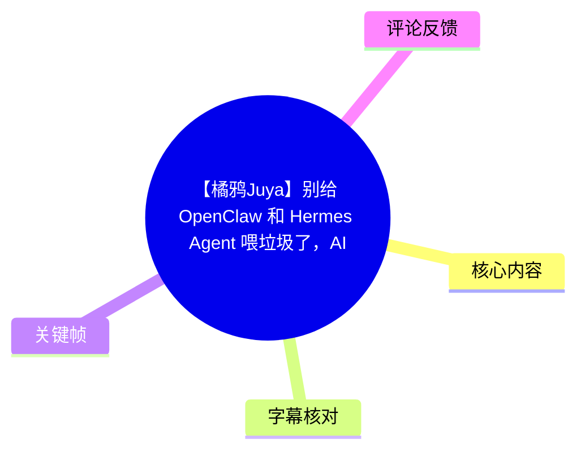
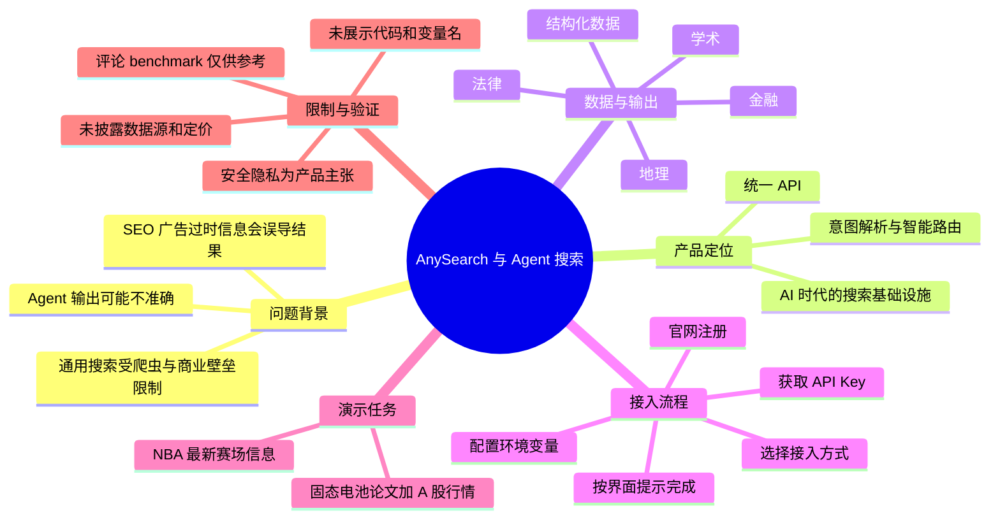
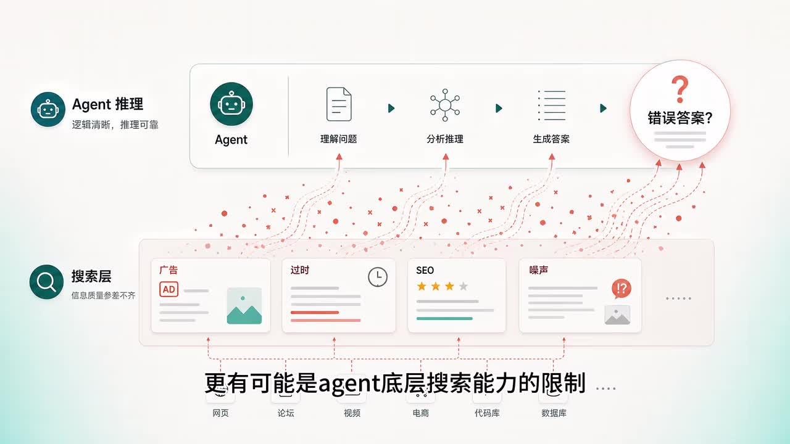
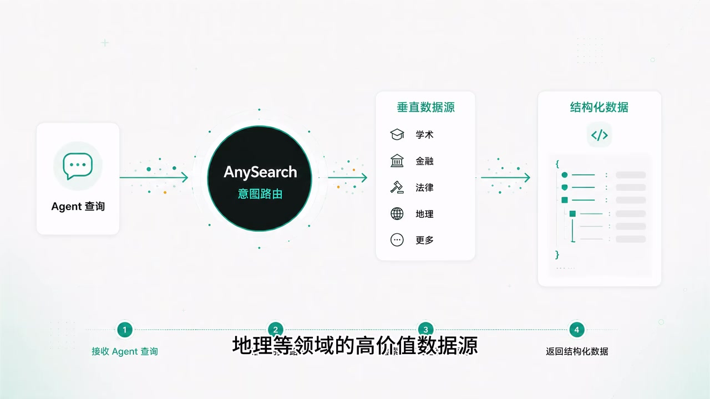
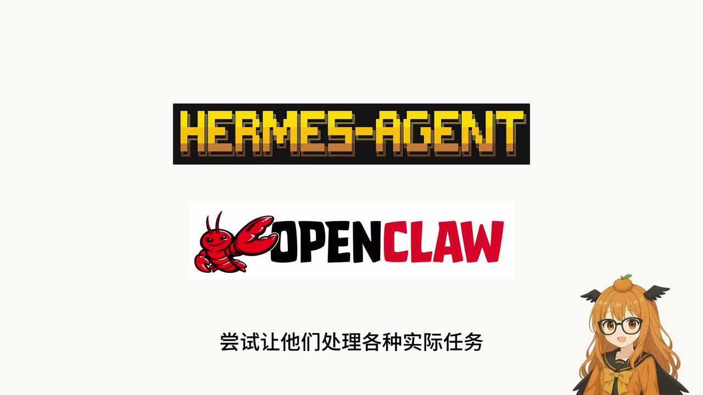

# 【橘鸦Juya】别给 OpenClaw 和 Hermes Agent 喂垃圾了，AI时代的搜索基础设施来了！（附接入教程）

> 来源：[Bilibili 视频](https://www.bilibili.com/video/BV1DCLq6aEba) 
> UP 主：橘鸦Juya｜时长：3 分 02 秒｜分区合集：AIcode 
> 视频简介提供的产品链接：[AnySearch 官网](https://www.anysearch.com/home)

## 小结

视频介绍了 AnySearch：UP 主将其描述为面向 AI Agent 的搜索基础设施，用于改善 OpenClaw、Hermes Agent 等工具在检索实时信息、专业数据时可能遇到的低质量网页、SEO 内容、广告和过时信息问题。

视频的核心思路不是让 Agent 自己从通用搜索结果中筛选，而是让 AnySearch 对查询进行意图解析与路由，匹配金融、法律、学术、地理等垂直数据源，再通过统一 API 返回结构化数据。UP 主认为，这样可以减轻 Agent 的数据源判断与跨库整合负担。

接入流程在视频中仅展示到产品级步骤：注册官网、取得 API Key、选择接入方式、配置环境变量并按界面提示完成配置。视频提到其原生支持 API、MCP 与一项 ASR 识别为“scale”的接入方式；由于未给出配置文件、变量名、命令或代码，不能据此复现具体配置。

演示包括两类查询：一类是“2026 年固态电池学术论文，并结合 A 股新能源板块行情”的跨领域任务；另一类是 NBA 实时信息查询。视频展示的结论是系统可返回便于 AI 后续加工的结构化结果，并据此形成简报或战报。

需要区分**产品宣传与已验证能力**：关于“高价值实时讯源”“安全优先、隐私至上”“无需担心泄漏”等内容均为视频中的产品主张，素材未提供数据源清单、响应延迟、定价、访问权限、隐私政策、数据保留规则或第三方测试，不能直接视为独立验证后的事实。热评中也有用户声称进行了 50 条 benchmark，认为 Tavily 在日常 Web Search 的延迟和 Top 3 官方源命中率上更好；这属于评论者自行报告，未附可复现原始记录。

## 思维导图

## 目录

- [背景：Agent 为什么会得到“垃圾信息”](#背景agent-为什么会得到垃圾信息)
- [AnySearch 的定位、数据路径与结构化输出](#anysearch-的定位数据路径与结构化输出)
- [接入教程：注册、API-Key 与环境配置](#接入教程注册api-key-与环境配置)
- [演示一：固态电池论文与 A 股新能源行情](#演示一固态电池论文与-a-股新能源行情)
- [演示二：NBA 实时信息查询](#演示二nba-实时信息查询)
- [安全、隐私与使用限制](#安全隐私与使用限制)
- [字幕比对](#字幕比对)
- [评论分析](#评论分析)
- [处理记录](#处理记录)

## [背景：Agent 为什么会得到“垃圾信息”](https://www.bilibili.com/video/BV1DCLq6aEba?t=26)

视频从 UP 主使用 OpenClaw 和 Hermes Agent 处理实际任务的经历切入。其观察是：Agent 的输出经常不准确，甚至会出现明显错误；问题未必完全来自模型本身，也可能出在底层搜索能力和数据输入质量。

UP 主列举的机制如下：

1. 大部分 Agent 仍依赖通用搜索引擎 API。
2. 通用搜索覆盖面广，但受网页爬虫机制和商业壁垒影响，未必能触达实时数据或专业数据。
3. 当 Agent 读取到 SEO 内容、广告、过时内容或噪声网页时，后续推理和答案生成都可能建立在错误材料上。
4. 因而，Agent 的“逻辑推理”即使本身通顺，也可能在输入阶段被低质量信息污染。

> 图：画面将 Agent 的“理解问题—分析推理—生成答案”流程，与下方搜索层中的“广告、过时、SEO、噪声”并置，直观说明视频的论点：错误答案可能源于检索输入，而非仅是模型推理失误。该图适合用来理解视频所说的“别给 Agent 喂垃圾”。

### 可迁移的经验

对于需要回答**时效性强、专业门槛高、需要可追溯来源**的问题，不能只因模型能调用搜索工具，就假定其信息可靠。实际部署时仍应明确：

- 查询属于通用网页检索，还是专业/实时数据检索；
- 工具返回内容是否带来源、时间戳和可验证字段；
- Agent 是否会把检索结果与事实结论混淆；
- 关键决策是否需要人工复核或额外的数据源交叉验证。

## [AnySearch 的定位、数据路径与结构化输出](https://www.bilibili.com/video/BV1DCLq6aEba?t=29)

UP 主将 AnySearch 定位为“AI 时代的搜索基础设施”。按视频陈述，其工作模式为：

> Agent 查询 → AnySearch 意图路由 → 匹配垂直数据源 → 返回结构化数据

视频称其聚合了金融、法律、学术、地理等领域的高价值数据源，并用统一 API 提供结构化输入。对 Agent 而言，目标是避免自行判断应该调用哪个数据库、如何抓取网页及如何清洗页面文本，而是直接接收便于解析的结果。

> 图：画面明确展示“Agent 查询”进入“AnySearch 意图路由”后，被分发至学术、金融、法律、地理等垂直数据源，最终输出“结构化数据”。这是理解产品架构主张的关键帧，但它是产品示意图，不代表已披露具体数据提供商或路由规则。

### 视频所强调的差异

| 维度 | 视频对传统搜索的描述 | 视频对 AnySearch 的描述 |
| --- | --- | --- |
| 输入来源 | 通用搜索结果，可能混入广告、SEO、噪声和过时内容 | 面向垂直领域的高价值数据源 |
| Agent 工作负担 | 要自行处理来源筛选、结果判断或跨库整合 | 无需理解底层逻辑即可取得可解析数据 |
| 输出形态 | 网页内容或分散结果 | 结构化数据 |
| 适用任务 | 一般网页搜索 | 跨领域、专业或实时信息任务 |

这里的“结构化”“高价值”“实时”均为视频中的产品描述。素材没有展示 API 响应 JSON、字段定义、来源引用、错误码、限流规则或回退策略，因此无法进一步判断其输出的完整性、可审计性及稳定性。

## [接入教程：注册、API Key 与环境配置](https://www.bilibili.com/video/BV1DCLq6aEba?t=53)

视频给出的接入顺序较短，能够确认的步骤如下：

1. 进入 AnySearch 官网注册。
2. 获取 API Key。
3. 根据所使用的 Agent 或运行环境选择接入方式。
4. 配置环境变量。
5. 按产品界面提示操作，完成连接测试。

UP 主称 AnySearch 原生支持：

- API；
- MCP；
- ASR 识别文本中的“scale”方式。

其中“scale”一词受 ASR 识别质量影响，且素材未提供屏幕中对应英文拼写、具体含义或产品文档，不能擅自扩展为某种确定的协议、SDK 或命令。视频以 Hermes 为例，表示选择了该方式并通过环境变量配置跑通。

### 视频未披露、实际接入前必须确认的参数

素材中**没有**出现以下决定可复现性和生产可用性的细节：

| 项目 | 素材是否提供 | 接入时应确认的内容 |
| --- | --- | --- |
| API Key 环境变量名 | 未提供 | 变量名、加载位置、是否支持 `.env` |
| Base URL / Endpoint | 未提供 | 区域、版本、鉴权端点 |
| SDK 或依赖版本 | 未提供 | 安装命令、兼容运行时 |
| MCP Server 配置 | 未提供 | 启动命令、transport、工具清单 |
| 调用参数 | 未提供 | 查询字段、返回格式、过滤与分页 |
| 配额和限流 | 未提供 | 免费额度、RPM/TPM、超时与重试 |
| 计费 | 未提供 | 请求计价、数据源附加费用 |
| 权限范围 | 未提供 | Key 权限、团队隔离、生产环境轮换策略 |

因此，这段内容可以作为**接入路径概览**，不能替代官方文档或可执行教程。将 API Key 接入终端前，也应避免把密钥直接写入代码仓库、聊天记录或截图。

## [演示一：固态电池论文与 A 股新能源行情](https://www.bilibili.com/video/BV1DCLq6aEba?t=79)

安装完成后，UP 主演示了一个跨学术与金融领域的复杂查询：检索**2026 年固态电池学术论文**，并结合**A 股新能源板块行情**。

视频展示的过程性信息包括：

1. Hermes 识别查询意图；
2. Hermes 调用 AnySearch 工具；
3. AnySearch 对查询自动解析；
4. 系统将请求智能分发到匹配的垂直数据领域；
5. 输出结果以结构化形式呈现，便于 AI 进一步加工；
6. Agent 可将跨领域资料组织为高质量简报。

> 图：开场画面直接点出 Hermes Agent、OpenClaw 及“尝试让他们处理各种实际任务”的主题。它为后续以 Hermes 演示接入和复杂查询提供了工具语境。

### 这个案例说明什么

该案例试图证明，跨领域任务不必由 Agent 先分别寻找论文库、行情库，再由用户或 Agent 手动整合。视频的论断是：通过统一检索入口和后端路由，Agent 即使不了解底层数据源，也可完成“论文 + 行情”这种组合任务。

不过，案例中没有展示：

- 实际输入的完整 prompt；
- 检索到的论文标题、作者、发表时间与数据库来源；
- A 股行情所使用的交易日、板块定义、证券范围与时间点；
- 引用链接、检索时间和数据更新时间；
- 最终简报的全文及事实核验过程。

特别是“2026 年论文”和“行情”都具有显著时效性。任何后续使用该类输出做研究、投资或业务决策时，都应保留查询时间、交易时点和原始来源，不应把 Agent 汇总结果直接作为结论。

## [演示二：NBA 实时信息查询](https://www.bilibili.com/video/BV1DCLq6aEba?t=125)

除专业领域外，UP 主还用 NBA 信息作为日常实时查询案例。视频称，AnySearch 能返回最新赛场信息以及双方球员的表现，并生成覆盖关键要点的战报。

这一段强调了实时体育信息对 AI 的挑战：比赛进程、最终比分、球员数据、伤停与赛程都随时间变化；如果 Agent 读取缓存页面、旧赛季内容或错误转载，回答就可能失真。

### 使用实时体育信息时的核验要点

视频没有展示具体场次、球队、球员姓名、比分或查询结果，因此不能补写具体比赛事实。若将类似工具用于实时内容，应额外要求输出：

- 数据对应的比赛日期、联赛和场次；
- 数据截至的具体时间；
- 比分状态：赛前、进行中、已结束或已更正；
- 球员数据统计口径；
- 原始来源与更新时间；
- 查询失败、延迟或数据冲突时的处理方式。

视频所称“全领域高质量实时讯源”属于产品能力主张；素材未呈现来源覆盖范围及刷新频率。

## [安全、隐私与使用限制](https://www.bilibili.com/video/BV1DCLq6aEba?t=149)

视频最后转向安全与隐私。UP 主指出，当 Agent 深度进入工作流和生活决策时，隐私是关键红线；并称 AnySearch 的理念为“安全优先、隐私至上”，使用者可在高效获取信息的同时不必担心泄漏。

这部分应当谨慎理解：

- **可确认的事实**：视频确实提出安全、隐私是 Agent 检索场景中的重要问题，并将其作为产品卖点。
- **不能从素材确认的事实**：是否加密、是否保留用户查询、日志保存多久、训练数据使用政策、数据跨境位置、第三方共享范围、合规认证、企业权限控制及删除机制。
- **实际风险**：查询文本可能含有公司内部资料、客户信息、个人身份信息、财务数据、源代码片段或业务决策意图。即便检索服务本身可信，也应遵循最小必要披露原则。

### 视频的最终行动建议

UP 主建议仍依赖普通通用搜索获取数据的 Agent 用户尝试 AnySearch：前往 `anysearch.com` 获取 API Key，并接入终端体验。视频在约 2 分 54 秒进入结束语，随后邀请观众点赞、投币。

### 时效性与适用边界

- 视频元数据显示发布时间为 2026 年 5 月；工具功能、支持的协议、模型/Agent 兼容性、套餐和数据源可能已变化。
- 视频是简短推广式介绍，展示的是预期工作流而非完整技术评测。
- 对实时新闻、行情、法律、金融和学术信息，应将 Agent 输出视为检索辅助结果，并回到原始出处核验。
- 金融行情和板块分析不构成投资建议；视频也未提供任何可用于投资决策的具体标的或数据。

## 字幕比对

| 字幕来源 | 完整性 | 专有名词 | 时间轴 | 主要问题 |
| --- | --- | --- | --- | --- |
| Bilibili 站内字幕 `p01-ai-zh.srt` | 与本视频内容严重不符 | 出现 Faker、T1、ONER、Keria、宙斯等英雄联盟赛事词汇 | 有真实 SRT 时间段，但覆盖约 00:11–02:49，内容属于其他视频 | 明显串入电竞解说字幕，不可用于本视频事实整理 |
| 本次 ASR 字幕 | 覆盖主要口播，诊断显示语音覆盖约 147.92 秒、总时长约 181.53 秒 | 能识别 OpenClaw、Hermes、AnySearch、API Key、MCP、A 股、NBA 等主要词 | 带真实分段时间，首段 00:26.340，末段 03:01.300 | 分段过长；“菊鸦/菊鸭”应校正为橘鸦；“AnySeach”“数损”等有漏字、错字；“scale”含义未能由素材确认 |

### 最终字幕选择

正文以**本次 ASR 时间轴**为主，因为其语言为中文、置信诊断显示语言概率为 `0.99853515625`，且内容与视频标题、画面主题和简介一致。站内字幕虽提供了可直接使用的 SRT 时间轴，却是完全不相关的英雄联盟赛事解说，已排除。

本次 ASR 诊断**未标记** `noAudioStream=true`，且提供了音频文件与 8 个带时间戳的识别段，因此不存在“源视频没有音轨”的情形。

依据元数据与关键帧对 ASR 做出的有限校正：

- “菊鸦/菊鸭”统一校正为 UP 主名称“橘鸦Juya”；
- “AnySeach”统一校正为标题、简介和画面共同指向的“AnySearch”；
- “数损、数捯、专页数捳”等统一按语义整理为“数据、专业数据”；
- “scale”保留为 ASR 所得说法，不将其解释为确定的产品名称或技术协议；
- 开场至约 00:26 为无 ASR 口播覆盖区间，正文不据此补充未出现的操作信息。

## 评论分析

> 可获取热评数据共 2 条，虽请求上限为前三条，但素材未提供第 3 条，以下仅分析实际可得内容。评论均为用户观点，不构成独立验证。

### 1. 搜索引擎 API 需求与现有产品体验

- **评论者**：省级退堂鼓表演艺术家
- **获赞**：96
- **核心观点**：认为 Google、百度似乎没有直接提供类似服务；其主观体验是 Gemini 检索较强，但后续表现不稳定，百度则难以查到需要的信息；希望两大搜索引擎直接加入 API 接口。
- **价值**：补充了视频之外的用户需求视角，即 Agent 场景需要的不只是面向人类界面的搜索页面，也需要能被程序稳定调用的接口。
- **可信度与限制**：评论没有说明“服务”的具体定义，也没有给出 Google、百度或 Gemini 的产品版本、测试查询、地区可用性和时间范围；其中“无动于衷”“查无此人”等是体验性表达，不能据此判断各厂商 API 的真实供给状况。

### 2. AnySearch 与 Tavily 的 50 条 benchmark 报告

- **评论者**：生煎包surge
- **获赞**：49
- **核心观点**：该用户称自行运行了 50 条 benchmark，结论是日常 Agent Web Search 更适合 Tavily；AnySearch 内容更长、召回更广，适合深挖或补充上下文。
- **评论中报告的指标**：

| 指标 | AnySearch | Tavily |
| --- | ---: | ---:|
| 成功率 | 50/50 | 50/50 |
| 平均延迟 | 5,347 ms | 1,790 ms |
| P50 延迟 | 4,680 ms | 1,681 ms |
| P95 延迟 | 10,828 ms | 2,296 ms |
| 官方源 Top 3 命中率 | 72% | 82% |
| 官方源 Top 5 命中率 | 98% | 86% |
| 内容丰富度 | 5,557 chars | 4,932 chars |

- **评论者的归纳**：
  - Tavily：更适合交互式搜索，延迟低，首屏官方源准确度较好；
  - AnySearch：返回内容更长、召回面更广，但速度慢；
  - AnySearch 的主要问题是约 4–10 秒延迟；
  - Tavily 的主要问题是部分官方源进不了 Top 5。
- **价值**：这是与视频宣传口径形成对照的、带有具体量化指标的反馈，提示选择搜索基础设施时需要平衡延迟、首屏来源质量、召回深度与内容长度。
- **可信度与限制**：评论未披露 50 条查询集、时间范围、地区、账号套餐、并发量、重试策略、模型版本、评分标准、官方源定义和原始结果。因此这些数字只能作为待复核的用户测试报告，不能推导为普遍性能结论。

## 处理记录

- **Worker ID**：`worker-mrj0wbly-5dc4e50c`
- **整理模型**：`gpt-5.6-terra`
- **可用素材与工具产物**：视频元数据、关键帧提取结果、音频文件、Whisper 类 ASR 结果（模型标识 `medium`，CUDA、`float16`）、ASR SRT、站内 SRT、热评 JSON。
- **字幕选择**：检查了站内字幕与本次 ASR。站内 `p01-ai-zh.srt` 内容为英雄联盟赛事解说，与视频不符，未采用；采用本次 ASR 的真实时间戳为章节定位依据，并以标题、元数据、关键帧校正明显专名错字。
- **关键帧选择依据**：
  - `frames/frame-001.jpg`：展示 Hermes Agent 与 OpenClaw，是视频工具语境的开场证据；
  - `frames/frame-002.jpg`：展示 Agent 推理链如何受到广告、过时、SEO、噪声影响，直接支撑问题定义；
  - `frames/frame-004.jpg`：展示意图路由、垂直数据源和结构化输出，是理解 AnySearch 架构主张的核心画面。
- **缓存清理**：提供的素材未包含缓存清理执行日志；未将其表述为已完成，状态为“无法确认”。
- **未解决问题**：
  - ASR 中“scale”对应的准确产品名称、协议或接入方式未能从素材确认；
  - 视频未展示 API 示例、环境变量名、数据源清单、价格、限流、隐私条款和可复现测试；
  - 热评 benchmark 缺少测试集和原始记录，不能作为结论性性能评测。
