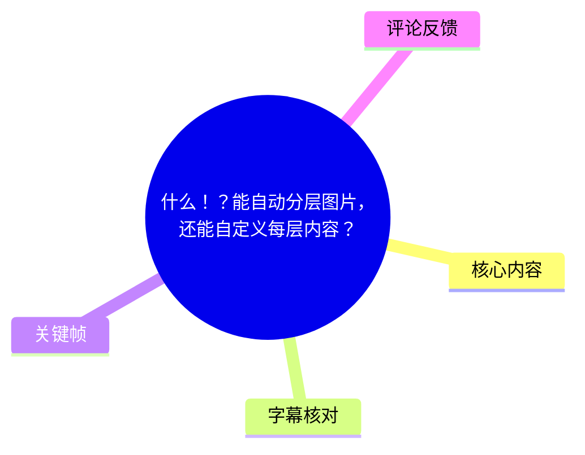
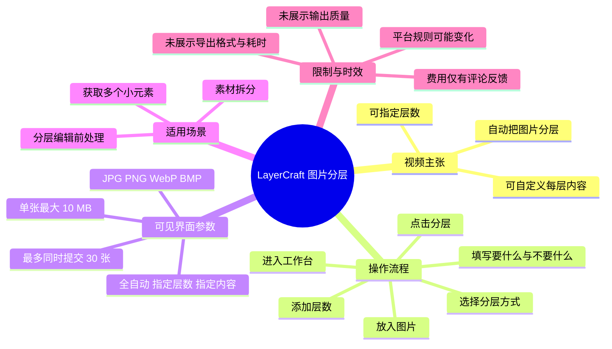
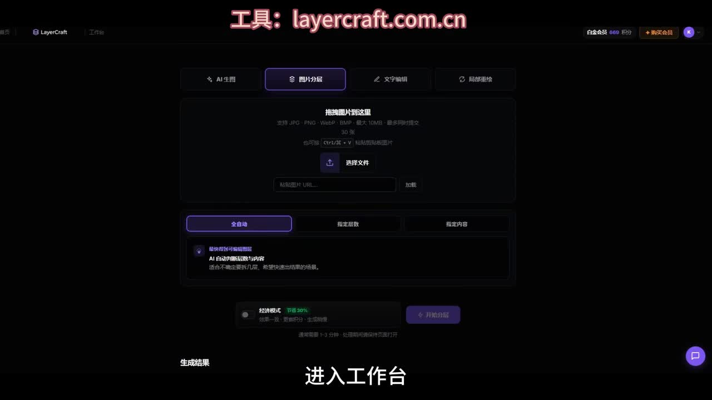

# 什么！？能自动分层图片，还能自定义每层内容？

> 来源：[Bilibili 视频](https://www.bilibili.com/video/BV1SqTL6mEso) 
> UP 主：小圆圆有大宝贝｜合集：AIcode｜视频时长：34 秒｜画面规格：1920 × 1080 
> 视频简介提供的工具地址：`layercraft.com.cn`

## 小结

视频演示了一款名为 **LayerCraft** 的图片分层工具。其基础能力是将一张图片自动拆分为多个图层；视频重点补充的功能是：用户不仅可以指定需要拆成多少层，还能逐层描述“要什么、不要什么”，以控制每层保留的内容。

操作主线很短：进入工作台、上传图片、切换到用于设定图层的选项、添加目标层数、为各层填写正向与排除要求，最后点击“分层”。视频将其定位为从一张图中较精准地获取多个小元素的工具，适合制作素材拆分、海报元素提取或后续分层编辑的需求。

关键界面显示，LayerCraft 的“图片分层”页提供“全自动”“指定层数”“指定内容”三种路径；上传区可见支持 JPG、PNG、WebP、BMP，单张最大 10 MB，并显示最多可同时提交 30 张图片。这些是画面可直接确认的界面参数，不代表平台永久不变的服务政策。

需要注意的是，视频没有展示实际输出图层、边缘精度、透明背景质量、复杂遮挡物处理效果、处理耗时或导出格式。因此，“可按设定内容精确分层”是视频的功能宣称与操作意图，实际效果仍应使用目标图片测试。

费用方面，视频本身没有说明。可获取热评中有用户称签到可获得 4 积分、拆分一张图需 10 积分；这属于用户反馈，未由视频或平台价格页验证，不能当作确定资费。工具功能、积分规则与限额均可能随时间变化。

## 思维导图

## 目录

- [背景与核心问题](#背景与核心问题)
- [工具与界面入口](#工具与界面入口)
- [按内容控制图层的操作步骤](#按内容控制图层的操作步骤)
- [关键帧解读](#关键帧解读)
- [适用场景、限制与时效性](#适用场景限制与时效性)
- [字幕比对](#字幕比对)
- [评论分析](#评论分析)
- [处理记录](#处理记录)

## 背景与核心问题 [00:00](https://www.bilibili.com/video/BV1SqTL6mEso?t=0)

视频以“自动分层图片”和“自定义每层内容”为问题切入。这里的“分层”可理解为：将原本合并在一张位图中的不同视觉元素拆开，使其能够成为独立处理的层，而非仅对整张图进行裁切。

视频强调的差异点不只是自动识别并拆分，还包括用户对拆分目标的干预：

1. **自动分层**：由工具对图片内容进行分层处理。
2. **指定层数**：用户可先确定希望得到的层数。
3. **指定内容**：用户可针对每个图层填写应该保留什么、应该排除什么，以减少“自动识别结果不符合预期”时的随机性。

视频在约 4 秒处将工具称作“LayerCraft”。站内字幕此处误记为“aircraft”，但画面中的产品标识以及视频简介中的网址均为 `layercraft.com.cn`，因此本文统一采用 **LayerCraft**。

## 工具与界面入口 [00:14](https://www.bilibili.com/video/BV1SqTL6mEso?t=14)

UP 主展示的路径是进入 LayerCraft 的工作台后，打开“图片分层”功能并上传图片。

从关键帧可见，页面顶部功能导航包括：

- AI 生图
- 图片分层（当前选中）
- 文字编辑
- 局部重绘

图片分层页面的上传区域显示以下信息：

| 项目 | 画面可见内容 |
| --- | --- |
| 支持格式 | JPG、PNG、WebP、BMP |
| 单张大小上限 | 最大 10 MB |
| 批量提交上限 | 最多同时提交 30 张 |
| 上传方式 | 拖拽图片、选择文件；界面另有 URL 输入与“加载”按钮 |
| 分层模式 | 全自动、指定层数、指定内容 |

这些参数来自视频画面中的当时界面。视频没有说明是否需要登录、是否所有账户均适用、URL 加载支持哪些来源，也没有展示具体上传成功后的文件状态。

## 按内容控制图层的操作步骤 [00:16](https://www.bilibili.com/video/BV1SqTL6mEso?t=16)

### 1. 上传待处理图片 [00:16](https://www.bilibili.com/video/BV1SqTL6mEso?t=16)

进入“图片分层”工作台后，将目标图片放入上传区域。视频口述为“放入图片”，画面则提供拖拽与选择文件入口。

上传前应检查图片格式、单张大小及批量数量是否在界面显示范围内。若原图超过 10 MB，视频未提供压缩、降尺寸或替代上传方案。

### 2. 选择可控分层方式 [00:18](https://www.bilibili.com/video/BV1SqTL6mEso?t=18)

视频说明“点这里就可以自行设定每层内容了”。关键帧中可见“全自动”“指定层数”“指定内容”三个选项，因此控制分层的重点在于不只使用“全自动”，而是转向“指定层数”或“指定内容”相关设置。

三种选项可按视频表达理解为：

| 模式 | 视频可确认的含义 | 适合的需求 |
| --- | --- | --- |
| 全自动 | AI 自动判断图层内容 | 不需要明确干预、先快速试用 |
| 指定层数 | 用户确定希望拆出的层数 | 已知大致需要几层，但未必逐层描述内容 |
| 指定内容 | 用户对图层内容提出要求 | 希望分别获取明确对象或元素 |

视频未展示三个模式之间能否叠加，亦未展示在“指定内容”模式下是否必须先填写层数。

### 3. 添加到目标层数 [00:21](https://www.bilibili.com/video/BV1SqTL6mEso?t=21)

UP 主的操作说明是“点击添加层数到想要的层数”。也就是说，先根据要拆出的对象数量建立多个图层槽位。

一个实用的理解方式是：若目标图中需要分别获取主体、装饰物、文字或背景，就应按实际需要预设相应层数。不过，这种“主体—装饰—文字—背景”的划分是基于视频所述“多个小元素”作出的应用示例，不是视频展示的固定分类。

### 4. 为每层写明保留与排除条件 [00:24](https://www.bilibili.com/video/BV1SqTL6mEso?t=24)

这是视频的核心经验：**每一层都要写下“要什么、不要什么”。**

可将其整理为以下填写原则：

- **要什么**：描述希望在该层留下的对象、元素或区域。
- **不要什么**：描述希望从该层排除的对象、元素或区域。
- **逐层填写**：每个图层分别定义目标，避免所有对象混入同一层。

视频没有给出具体提示词示例、支持的语言范围、字数限制或描述语法。因此，不能据此断言它支持特定格式的 prompt；可确认的仅是界面/口述所表达的“按层填写需要与不需要的内容”这一机制。

### 5. 点击“分层”并检查结果 [00:29](https://www.bilibili.com/video/BV1SqTL6mEso?t=29)

完成图层数量与内容要求设置后，点击“分层”，工具将按设定执行分层。视频称其“特别适合要从一张图中精准获取多个小元素的需求”。

不过，视频没有展示结果预览、图层命名、是否可二次编辑、导出按钮、文件格式或透明通道。因此实际使用时，仍应重点验证：

- 各个对象是否被正确归入目标层；
- 前景边缘是否完整，是否有漏抠或背景残留；
- 相互遮挡的元素是否能被合理分离；
- 是否支持将结果作为带透明背景的独立素材导出；
- 复杂插画、照片、文字海报等不同类型图片的稳定性。

## 关键帧解读 [00:14](https://www.bilibili.com/video/BV1SqTL6mEso?t=14)

> 图：该关键帧直接展示了 LayerCraft 的“图片分层”工作台，而非仅有口述。它确认了产品名称、工具网址、当前选中的“图片分层”模块、上传文件格式与 10 MB/30 张限制，以及“全自动、指定层数、指定内容”三个分层入口，是校正字幕专有名词并理解操作起点的主要视觉依据。

画面上方还以醒目文字标注“工具：layercraft.com.cn”。这与视频简介提供的网址一致，因此可用于排除站内字幕中“aircraft”的转写误差。

## 适用场景、限制与时效性 [00:31](https://www.bilibili.com/video/BV1SqTL6mEso?t=31)

### 视频明确指向的适用需求

UP 主给出的直接场景是：从一张图中“精准获取多个小元素”。据此，较适合的任务包括：

- 将一张合成图拆成可单独使用的视觉素材；
- 在后续设计、排版或局部修改前，尝试分开图中的不同对象；
- 对有明确目标元素的图片，通过“要什么 / 不要什么”降低纯自动分层的不确定性。

### 视频未覆盖的技术限制

以下内容在素材中没有展示或说明，属于使用前必须自行验证的空白项：

| 未验证项 | 为什么重要 |
| --- | --- |
| 分层准确率 | 决定对象是否被正确分到目标层中 |
| 边缘与透明通道质量 | 决定拆出的元素能否直接用于合成 |
| 遮挡与细小物体表现 | 多个元素重叠、发丝、镂空等场景通常更难处理 |
| 最大分层数量 | 视频只说可添加到想要的层数，未给出上限 |
| 处理速度与排队情况 | 视频未展示单图耗时或批量任务表现 |
| 导出格式与商用授权 | 视频未展示下载页、许可条款或素材权属说明 |
| 价格与积分 | 视频未提及，评论中有非官方说法但尚未验证 |

### 时效性提示

本视频发布于 2026 年 6 月。其展示的是当时的产品界面和功能入口；网站页面、文件限制、可用模型、积分价格、免费额度和功能名称均可能变化。访问工具时，应以 `layercraft.com.cn` 当前页面、账户内价格说明和服务条款为准。

## 字幕比对 [00:00](https://www.bilibili.com/video/BV1SqTL6mEso?t=0)

本次任务同时获得了 Bilibili 站内字幕与本次执行的 ASR 字幕。两者都覆盖了视频的主要流程，但均存在识别或转写问题，最终采用“**以站内字幕的完整步骤为主，并以关键帧、视频简介和 ASR 对专有名词进行校正**”的合并策略。

| 字幕来源 | 完整性 | 专有名词 | 时间轴 | 主要问题 |
| --- | --- | --- | --- | --- |
| Bilibili 站内字幕 | 较完整，包含“从一张图中精准获取多个小元素”的结尾用途说明 | “aircraft”不准确，应校正为 LayerCraft | 提供文本但素材未给出逐句时间码 | 基本步骤完整，但产品名缺少首字母/拼写错误 |
| 本次 ASR 字幕 | 中等，覆盖上传、设置、添加层数和分层等主步骤 | “Layercraft”与画面和网址一致 | 提供文本但素材未给出逐句时间码 | 存在“自动分层土地”“琴师”“点击添加菜单”“获取多根小元素”等明显误识别，结尾句也不完整 |

### 关键校正项

| 原始转写 | 校正结果 | 校正依据 |
| --- | --- | --- |
| 站内字幕“aircraft” | LayerCraft | 关键帧左上角产品标识、画面顶部网址及视频简介均指向 `layercraft.com.cn`；ASR 亦识别为 Layercraft |
| ASR“自动分层土地” | 自动分层图片 | 站内字幕、视频标题与上下文一致指向“图片分层” |
| ASR“琴师还能自己决定每层内容” | 其实还能自己决定每层内容 | 站内字幕对应句语义通顺，ASR 为同音误识别 |
| ASR“点击添加菜单” | 点击添加层数 | 站内字幕明确为“点击添加层数”，且与后文“到想要的层数”衔接 |
| ASR“获取多根小元素” | 获取多个小元素 | 站内字幕完整句为“从一张图中精准获取多个小元素的需求” |

站内字幕对操作顺序更完整，因此正文步骤以其为基础；产品名称及界面选项则由关键帧进一步核对。由于没有逐句时间码，文中的秒数是根据 34 秒视频的口述段落与所给关键帧位置进行的定位，适合作为跳转索引，不应视为逐词级字幕时间标注。

## 评论分析 [00:00](https://www.bilibili.com/video/BV1SqTL6mEso?t=0)

以下仅处理可获取的热评前三条；评论是用户观点或个体经历，不等同于已验证的平台规则。

1. **@您打了自己｜6 赞**  
   评论：“一句话,要不要钱”  
   - **观点**：用户最关心工具是否免费或存在收费门槛。  
   - **补充价值**：指出视频虽然介绍了功能与使用流程，但没有回答价格、免费额度或积分消耗。  
   - **可信度与限制**：这是提问而非事实陈述，不能据此判断收费情况。

2. **@h040012281｜4 赞**  
   评论：“回来了，差不多是要钱的。签到给4积分，但拆一张图要10积分”  
   - **观点**：该用户认为服务存在积分消耗，并给出“签到 4 积分、拆一张图 10 积分”的具体说法。  
   - **补充价值**：为视频未涉及的费用问题提供了潜在线索，也意味着免费签到积分可能不足以覆盖一次拆图。  
   - **可信度与限制**：这是单一用户反馈，未附平台规则截图、价格页或时间范围；积分数量、任务成本和活动政策都可能已变动，不能作为确定价格结论。

3. **@中文补档｜0 赞**  
   评论：“🤔”  
   - **观点**：仅表达疑惑或观望，没有可展开的技术、费用或体验信息。  
   - **补充价值**：无。  
   - **可信度与限制**：不构成事实主张，无法用于判断工具能力或资费。

## 评论分析

本次流程未获取到可用热评，因此不推断观众态度或额外结论。

## 处理记录

- **Worker ID**：`worker-mrj0www4-e8d79408`
- **模型**：`gpt-5.6-terra`
- **调用工具与素材产物**：读取任务元数据、视频信息、站内字幕、本次 ASR 字幕、热评数据及关键帧；可用产物目录包含 `merged.mp4`、`audio/audio.wav`、`frames/`、`comments/comments.json`、`subtitles/` 与 `asr/`。
- **字幕选择**：站内字幕作为操作步骤主文本；本次 ASR 用于交叉验证。针对工具名采用关键帧与视频简介中的 `layercraft.com.cn` 校正为 **LayerCraft**；对 ASR 明显错词不直接采纳。
- **关键帧选择依据**：素材仅提供 `frames/frame-001.jpg`。该帧同时包含产品 Logo、工具网址、图片分层功能页、上传格式/大小/数量限制及分层模式选项，信息密度最高，适合作为正文的界面证据。
- **评论处理范围**：仅分析已提供的热评前三条，未扩展至其他评论或回复串。
- **缓存清理**：素材中未提供缓存清理执行日志或结果，无法确认是否完成清理；本文不将其表述为已清理。
- **未解决问题**：未获得实际分层结果、导出格式、处理耗时、最大可设层数、授权条款与官方价格说明；费用相关信息仅来自一条用户评论，尚未验证。
