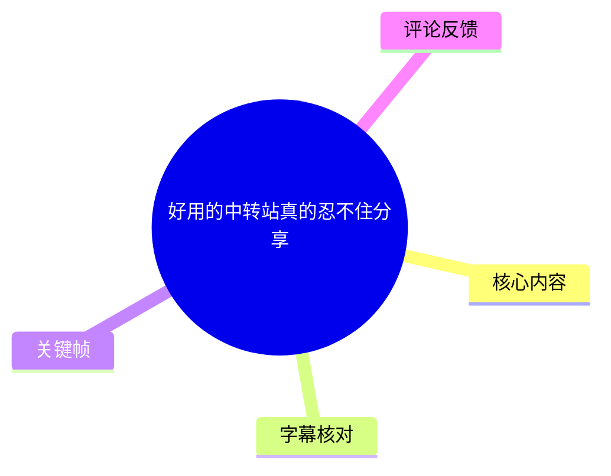
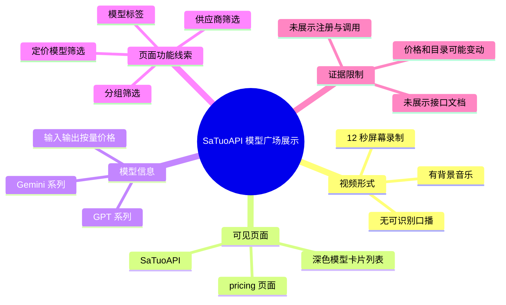
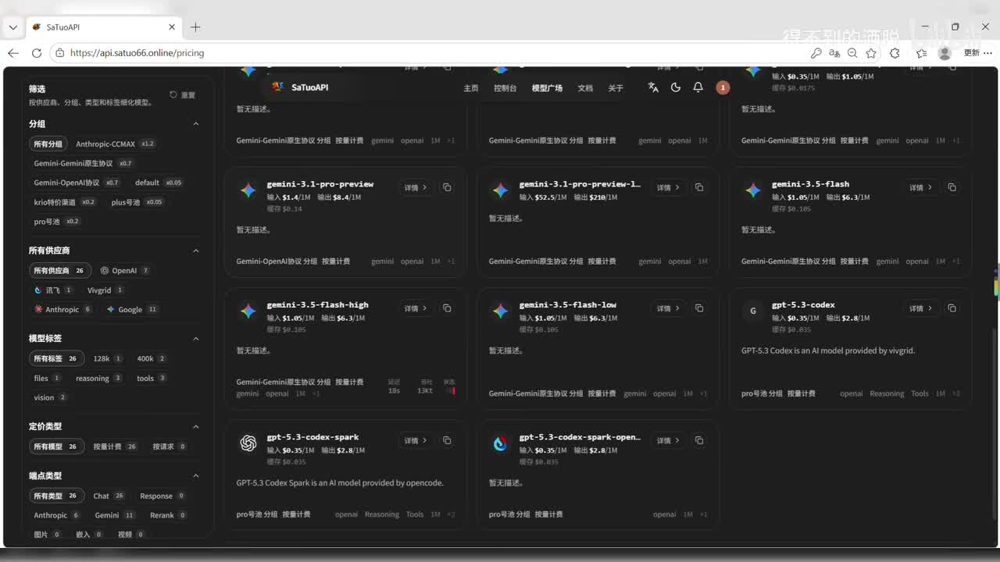
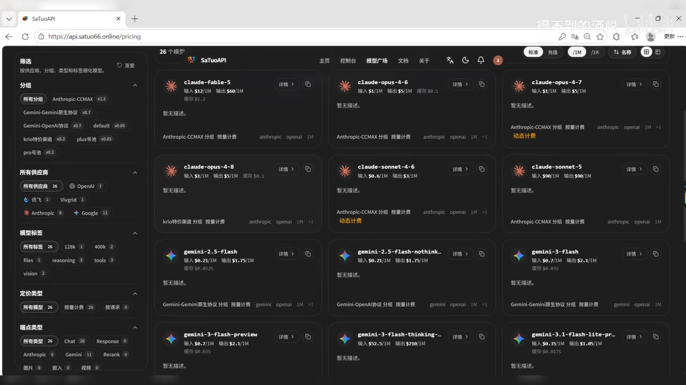
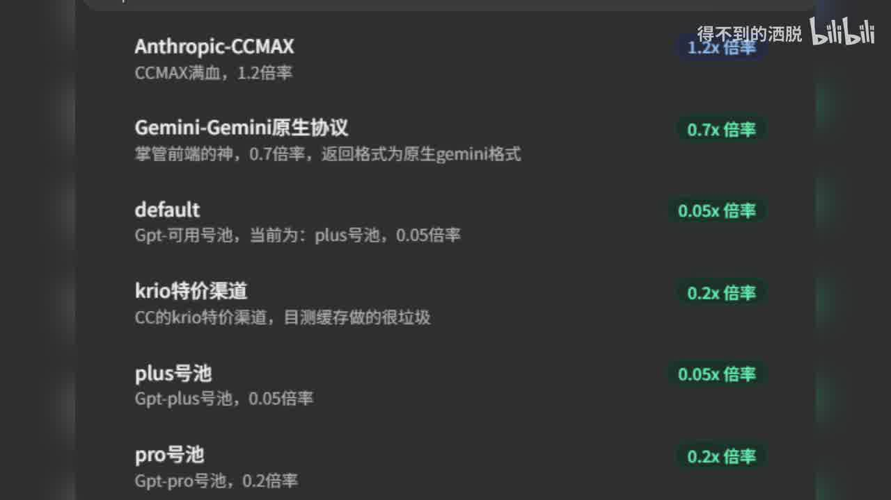
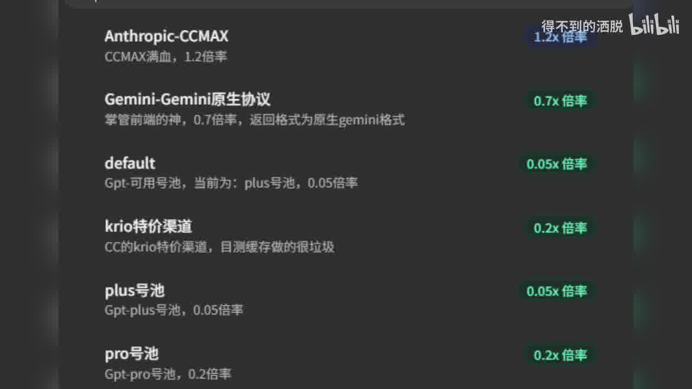

# 好用的中转站真的忍不住分享

> 来源：[Bilibili 视频](https://www.bilibili.com/video/BV1EYTd6CESA)<br>
> UP 主：得不到的洒脱｜发布时间：2026-07-07｜视频时长：12 秒｜分辨率：1920×1080

## 小结

视频以屏幕录制形式展示了一个名为 **SaTuoAPI** 的网站模型广场页面，浏览器地址栏可见路径为 `https://api.satuo66.online/pricing`。结合标题“好用的中转站真的忍不住分享”以及画面内容，UP 主意在推荐或展示该站点的 AI 模型聚合／转发服务；不过，视频没有口播，也没有出现注册、调用接口、支付或实际请求测试过程。

画面的核心信息是模型列表与标价：页面展示 Gemini、GPT 等模型条目，且部分卡片可读到输入、输出的按量计费价格。例如，`gemini-3.1-pro-preview`、`gemini-3.5-flash-high`、`gpt-5.3-codex` 等名称出现在模型卡片中。页面同时带有分组、供应商、模型标签和“定价模型”等筛选区域，说明该页面至少提供按模型浏览与筛选的界面。

对于希望寻找多模型接口入口、比较模型价格或了解可用模型目录的读者，这段视频可作为一个站点线索，而不是可直接据此做采购决定的完整教程。视频没有给出 API 文档、鉴权方式、请求格式、可用区域、稳定性、速率限制、数据处理政策或退款规则，因此无法从素材确认其服务质量及实际可用性。

站内时间轴字幕仅记录了 00:00:04.200—00:00:11.960 的“♪ 音乐 ♪”；本次 ASR 也没有识别到任何语音片段。因此，本文关于页面名称、网址、模型名与价格的整理均来自关键帧中的可见文字，而非语音转写。模型目录、价格、账户余额和筛选数量均可能随页面实时变化，具有强时效性。

## 思维导图





## 目录

- [视频定位与素材边界](#视频定位与素材边界-000004)
- [画面中的模型广场与筛选项](#画面中的模型广场与筛选项-000004)
- [可辨识的模型与展示价格](#可辨识的模型与展示价格-000004)
- [实践建议：将视频线索转化为核验流程](#实践建议将视频线索转化为核验流程-000004)
- [限制、风险与时效性](#限制风险与时效性-000004)
- [字幕比对](#字幕比对)
- [评论分析](#评论分析)
- [处理记录](#处理记录)

## 视频定位与素材边界 [00:00:04](https://www.bilibili.com/video/BV1EYTd6CESA?t=4)

视频总长 12 秒，画面为横向桌面浏览器录屏。可见标签页标题为“SaTuoAPI”，地址栏显示：

```text
https://api.satuo66.online/pricing
```

页面使用深色主题，顶部导航中可辨识“主页”“控制台”“模型广场”“文档”“关于”等入口；视频录制时停留在模型列表界面。右上区域还能看到与账户相关的数值显示，其中包括“输入 $0.35/1M”“输出 $1.05/1M”及“余额 $0.175”等文字；但视频未说明这些数值是当前账户费率、某个选中模型费率还是页面全局提示，不能进一步推断其计费规则。

> 时间定位说明：站内字幕可直接确认的首个时间段从 00:00:04.200 开始，内容仅为背景音乐。关键帧素材未附逐帧时间戳，故不能把某一张截图精确绑定到更细的秒数；本章链接使用唯一可验证的站内字幕起点 4 秒。



> 图：关键帧展示浏览器中的 SaTuoAPI 深色页面、`/pricing` 地址、顶部导航及模型卡片总览。它是确认视频主题为模型目录／定价展示的直接视觉证据。

## 画面中的模型广场与筛选项 [00:00:04](https://www.bilibili.com/video/BV1EYTd6CESA?t=4)

左侧栏可见多层筛选结构，反映页面将模型按多个维度组织：

| 可见筛选区域 | 画面中可读内容 | 可据此确认的内容 | 不能据此确认的内容 |
| --- | --- | --- | --- |
| 分组 | “所有分组”、`Anthropic-CCMAX`、`Gemini-Gemini原生协议`、`Gemini-OpenAI协议`、`krio特价渠道`、`pro穷鬼` 等 | 页面存在分组维度，且一些分组名称直接关联供应商、协议或价格定位 | 各分组对应的访问权限、实际底层渠道和服务承诺 |
| 所有供应商 | “所有供应商 26”、讯飞、Vigrid、Anthropic、Google、OpenAI 等 | 页面可按供应商或来源标签筛选，画面显示总数为 26 | “26”所代表的是供应商、渠道还是其他统计口径；以及这些名称是否均为官方直连 |
| 模型标签 | “所有标签 26”、`128k`、`400k`、`files`、`reasoning`、`tools`、`vision` 等 | 页面以上下文长度或能力标签对模型做分类 | 标签的评测标准、是否所有模型真实支持该能力 |
| 定价模型 | “所有模型 26”“按量计费 26”“按请求 0” | 当前画面中，页面将 26 个模型归入按量计费，并显示按请求分类为 0 | 完整价格单位、阶梯价格、缓存计费、失败请求计费与税费 |

这里的“Gemini-OpenAI 协议”“Gemini-Gemini 原生协议”是页面文字，不应自动等同于 Google 官方接口的具体兼容级别。若要使用，应以该站文档及实测请求为准。



> 图：该帧能集中看到“分组”“所有供应商”“模型标签”“定价模型”四类筛选项，是判断页面具有模型筛选与价目浏览功能的关键依据。

## 可辨识的模型与展示价格 [00:00:04](https://www.bilibili.com/video/BV1EYTd6CESA?t=4)

画面中央为三列模型卡片。以下只记录截图中相对清晰、可直接辨识的文本；价格均保留为**页面展示值**，不代表当前有效报价或官方定价。

| 模型卡片 | 画面可见的输入价 | 画面可见的输出价 | 其他可见信息 |
| --- | ---: | ---: | --- |
| `gemini-3.1-pro-preview` | `$4.4/1M` | `$8.4/1M` | 缓存价可见 `$0.14`；卡片带 Gemini 图标 |
| `gemini-3.1-pro-preview-L` | `$5.2/1M` | `$12/1M` | 名称末尾含 `-L`，但视频未解释其含义 |
| `gemini-3.5-flash` | `$1.05/1M` | `$3.1/1M` | 可见缓存价 `$0.185` |
| `gemini-3.5-flash-high` | `$1.05/1M` | `$6.3/1M` | 可见缓存价 `$0.185` |
| `gemini-3.5-flash-low` | `$1.05/1M` | `$6.3/1M` | 可见缓存价 `$0.185` |
| `gpt-5.3-codex` | `$0.35/1M` | `$2.8/1M` | 卡片说明可读到“GPT-5.3 Codex is an AI model provided by Vigrid.” |
| `gpt-5.3-codex-spark` | `$0.35/1M` | `$2.8/1M` | 卡片说明可读到“GPT-5.3 Codex Spark is an AI model provided by opencode.” |
| `gpt-5.3-codex-spark-open...` | `$0.35/1M` | `$2.8/1M` | 名称在截图中被截断，不能完整还原 |

多个 Gemini 卡片下方可见类似 `gemini`、`openai`、`1M` 等标签；`gpt-5.3-codex` 卡片下方可见 `openai`、`Reasoning`、`Tools`、`1M` 等标签。它们可作为页面对模型能力／协议的标注线索，但视频没有展示这些标签的定义、参数上限或能力测试，不能据此推断模型在所有任务中可稳定调用工具或推理模式。



> 图：该帧清晰呈现 Gemini 与 GPT 系列卡片、输入／输出按百万单位计价文字，以及部分模型的协议和能力标签；它支撑了本节的模型目录与价格摘录。

### 关于价格的正确解读

画面采用 `/1M` 作为价格单位，通常表示每一百万计量单位的价格；但视频未在画面中明示此处的计量单位是 token、字符、请求片段还是由平台自行换算。因此，本文不将其擅自扩展为“每百万 token”的确定结论。

在实际比较成本时，至少应另外核验：

1. 输入、输出和缓存的计量口径；
2. 是否存在模型级别、渠道级别或账户等级差异；
3. 上下文长度、最大输出长度及工具调用是否另行计费；
4. 汇率、充值门槛、最低消费、赠额和退款条件；
5. 页面标价与实际 API 返回账单是否一致。

## 实践建议：将视频线索转化为核验流程 [00:00:04](https://www.bilibili.com/video/BV1EYTd6CESA?t=4)

视频并未演示操作步骤，以下流程是基于其展示的站点和模型价目页面所整理的**审慎核验建议**，不是 UP 主在视频中实际讲解或执行的步骤。

### 1. 先确认服务主体与文档范围

访问视频画面中显示的 `pricing` 页面前，应从该站的“文档”“关于”或服务条款中确认：

- 运营主体与联系方式；
- API Base URL、认证方法和支持的协议；
- 是否为 OpenAI 兼容接口、Gemini 原生协议接口，或二者都支持；
- 数据是否被留存、用于日志分析或模型训练；
- 服务可用地区、内容限制与账户风控规则。

### 2. 用筛选页缩小候选模型

可按画面中的筛选线索建立初筛：

- 关注 OpenAI 兼容调用时，优先查看标有 `openai` 的条目及相关分组；
- 需要大上下文、视觉、文件或工具能力时，查看 `128k`、`400k`、`vision`、`files`、`tools` 等标签；
- 预算敏感时，先比较同一候选模型的输入、输出和缓存展示价，而不只看输入价；
- 同名模型存在多个后缀或渠道时，例如画面中的 `-L`、`spark`、`spark-open...`，需要逐一阅读详情，不应按名称相似性视为同一服务质量。

### 3. 在小额、非敏感场景完成实测

若决定尝试，应避免一开始就上传机密代码、个人信息或生产数据。建议先用低敏感度提示词测试：

1. 鉴权是否有效、模型名是否与页面一致；
2. 首字响应和完整响应的延迟；
3. 长提示词、工具调用或多轮上下文是否稳定；
4. 限流、超时与错误码的处理方式；
5. 控制台扣费是否和价目页口径一致。

### 4. 记录可复现的成本与质量样本

应至少保存测试日期、所选模型的完整名称、请求输入输出计量、控制台账单和响应错误信息。原因是本视频展示的是短时页面状态，不能代替后续的价格、配额和可用性验证。



> 图：该帧突出显示 `gpt-5.3-codex` 与两个 `gpt-5.3-codex-spark` 相关条目，并可见不同“provided by”说明。它提醒使用者：即使模型名称相近，也可能对应不同提供方或渠道，需分别核验。

## 限制、风险与时效性 [00:00:04](https://www.bilibili.com/video/BV1EYTd6CESA?t=4)

### 素材本身的限制

- 视频没有可识别的人声；站内字幕仅为音乐提示，无法补足讲解内容。
- UP 主未展示账号注册、充值、创建 API Key、接口请求、返回结果或失败处理。
- 视频没有说明“中转站”的具体技术架构，因此不能判断其是否为官方直连、聚合路由、代理转发或其他模式。
- 画面上出现的模型名称、供应商名称、能力标签和金额，只能证明录制时页面曾这样显示，不能证明服务实际可用、稳定或合规。
- 无法从现有素材判断价格币种以外的计费口径，尤其不能确认 `/1M` 的具体计量对象。

### 使用第三方模型聚合服务时的风险

若将此类服务用于开发或业务，应重点评估：

- **隐私与合规**：请求可能经过第三方转发；发送源代码、客户数据、密钥或受监管数据前，应确认数据流向和保留政策。
- **模型一致性**：显示的模型名称不必然等于原厂同名端点的版本、配额、系统提示或工具支持。
- **计费与限流**：价目页显示值可能更新，且高并发、缓存、长上下文、失败重试等场景可能存在额外规则。
- **可持续性**：第三方渠道的上游供给、模型上下架和账户策略可能变化，生产环境应准备切换方案。

### 时效性

元数据表明视频发布于 2026-07-07，素材抓取于 2026-07-16；页面截图记录的是这一时间窗口内的状态。AI 模型名称、供应商映射、能力标签及输入／输出价格更新频繁，阅读时应把本文中的价格视为**历史画面摘录**，并以访问当日的官方页面、条款和实际账单为准。

## 字幕比对

| 字幕来源 | 完整性 | 专有名词 | 时间轴 | 主要问题 |
| --- | --- | --- | --- | --- |
| Bilibili 站内字幕 `p01-ai-zh.srt` | 极低；仅含 5 段音乐提示，覆盖 00:00:04.200—00:00:11.960 | 无模型或站点专有名词 | 有效、精确到毫秒 | 不包含任何语义讲解，且未覆盖前 4.2 秒 |
| 本次 ASR | 空；`segments` 为 `[]`，语音覆盖率为 0 | 无 | ASR 文件具备时间戳能力，但没有实际语音分段 | 自动识别语言为英语，置信度 0.5410；诊断提示未识别到语音 |

本次 ASR 已检查：使用 `medium` 模型、CUDA、`float16`，音频时长为 11.9815 秒；结果没有识别出任何语音片段。诊断信息提示“未识别到语音”，但素材未标记 `noAudioStream=true`，因此不能断言源视频没有音轨；结合站内字幕连续标注“♪ 音乐 ♪”，更稳妥的结论是：**视频存在背景音乐或音频内容，但没有可识别的口播文本。**

最终不采用任何一份字幕作为知识正文的语义来源：站内字幕仅用于可靠时间轴起点，ASR 用于确认无口播；页面名称、网址、模型名、价格和标签均以关键帧可见文字为准。经画面校正的重要词语包括：`SaTuoAPI`、`pricing`、`gemini-3.1-pro-preview`、`gemini-3.5-flash-high`、`gpt-5.3-codex`、`Vigrid` 与 `opencode`。

## 评论分析

未获取到可分析的热评。评论数据中 `items` 为空；虽然视频元数据显示回复数为 3，但本次素材未提供具体评论文本、作者信息或点赞排序，因而不能补写、推测或将不可见评论纳入结论。

## 处理记录

- Worker ID：`worker-mrj0www4-e8d79408`
- 文档生成模型：`gpt-5.6-terra`
- ASR 模型与参数：`medium`／自动语言识别／CUDA／`float16`；识别语言结果为 `en`，语言置信度 `0.541015625`。
- 使用的素材工具产物：视频元数据、站内字幕 `p01-ai-zh.srt`、ASR 诊断与空转写结果、12 张关键帧、评论抓取结果。
- 字幕选择：不以字幕承载页面语义；采用站内字幕的 00:00:04.200 作为可验证时间轴依据，并以关键帧进行多模态画面文字整理。ASR 结果为空，未合并。
- 关键帧选择依据：`frame-001.jpg` 用于确认站点、地址与总体布局；`frame-005.jpg` 用于确认筛选结构；`frame-010.jpg` 用于记录模型卡片及展示价格；`frame-012.jpg` 用于观察 GPT 相关条目与不同提供方说明。其余帧与这些画面高度重复，未重复插入。
- 缓存清理：素材未提供缓存清理日志，无法确认是否执行清理；本文不将其表述为已完成。
- 未解决问题：未能从视频确认服务主体、接口文档、API 调用方式、真实模型版本、定价计量单位、支付规则、限流政策、数据处理方式及服务稳定性。
