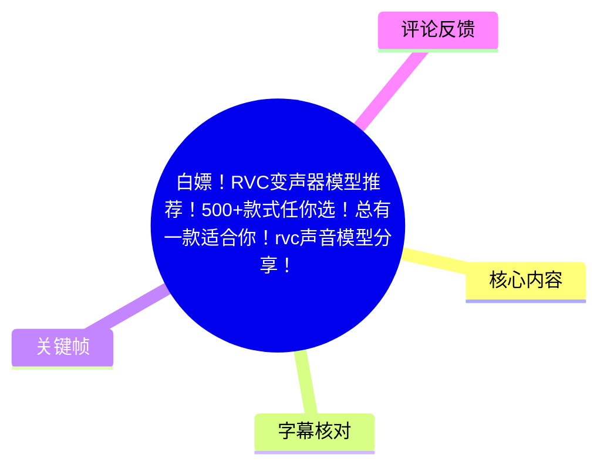
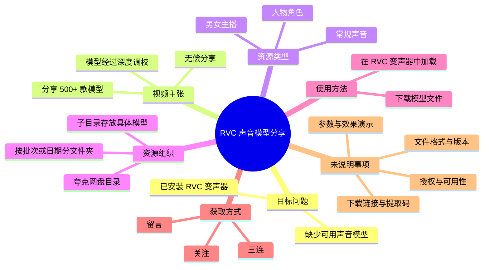
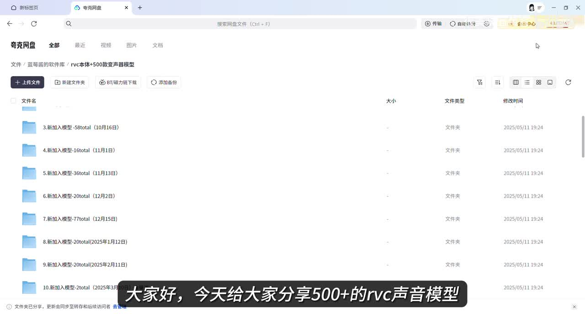
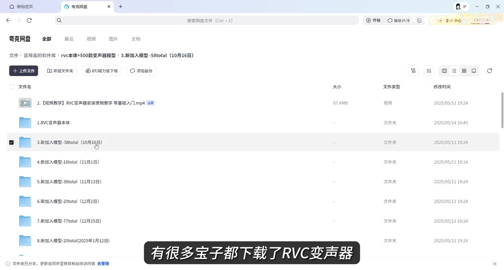
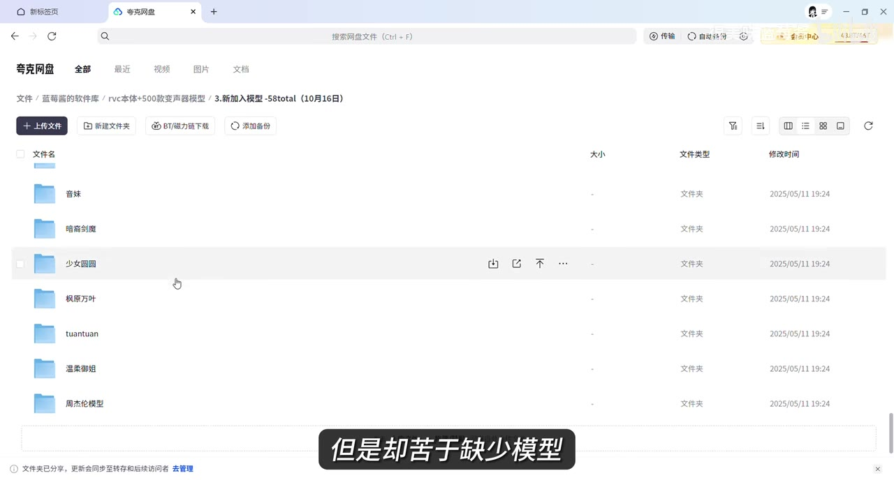
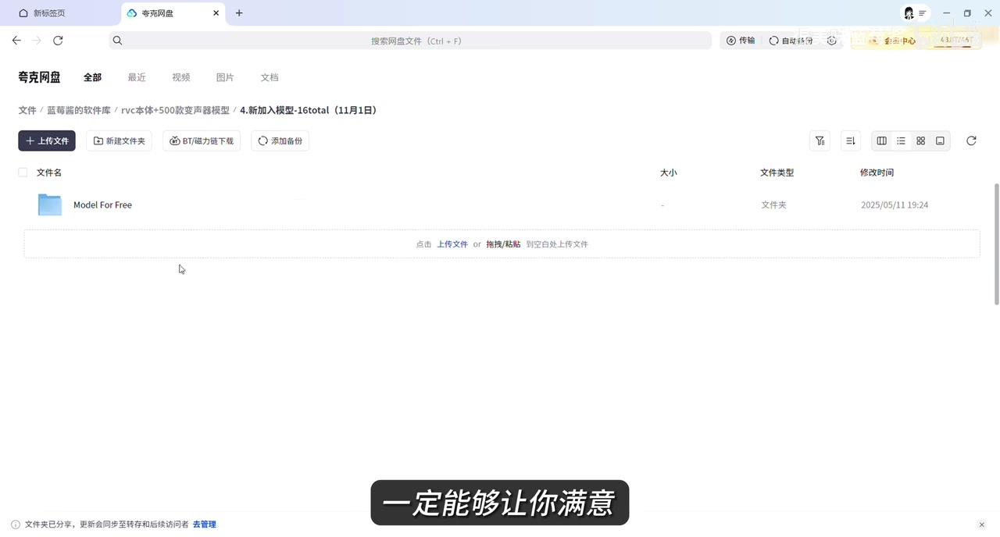

# 白嫖！RVC变声器模型推荐！500+款式任你选！总有一款适合你！rvc声音模型分享！

> 来源：[Bilibili 视频](https://www.bilibili.com/video/BV1fzMezAEzC)  
> UP 主：很美味蓝莓酱｜发布时间：2025-06-16｜时长：46 秒｜分辨率：2680×1440

## 小结

视频是一则面向 RVC（Retrieval-based Voice Conversion，常用于声音转换/变声）的模型资源分享宣传。UP 主称其整理并分享了“500+”款 RVC 声音模型，目标用户是已经下载 RVC 变声器、但缺少可加载模型的使用者。

视频陈述这些模型经过“深度调校”，覆盖常规声音、人物角色以及男女主播等类别。画面展示的是夸克网盘中的资源目录：顶层存在按日期或批次命名的“新加入模型”文件夹，进入后可见以具体声音/角色名称命名的子文件夹，说明资源以网盘目录形式组织。

视频给出的唯一明确使用流程是：下载模型文件，再通过 RVC 变声器加载。它没有展示 RVC 软件界面、模型文件扩展名、下载链接、提取码、适配版本、实时推理参数或实际变声效果，因此不能据此直接完成部署或判断模型质量。

UP 主称资源为“无偿分享”，并要求观众“三连、留言、点免费的关注”。但视频画面和现有文本素材均未给出公开下载地址或获取规则细节；热评中的“求私发”也侧面说明至少有观众仍在寻求获取路径。该资源的可访问性、完整数量、授权情况和后续更新状态均需以视频发布页及 UP 主后续回复为准。

视频发布于 2025 年 6 月。网盘链接、目录、文件可用性和模型兼容性具有明显时效性；“500+”是 UP 主的宣传性陈述，素材只展示了部分目录，未对全部模型逐项盘点或验证。

## 思维导图

## 目录

- [背景与适用对象](#背景与适用对象00)
- [资源主张与目录画面](#资源主张与目录画面00)
- [模型类别与资源组织](#模型类别与资源组织00)
- [视频给出的使用步骤](#视频给出的使用步骤00)
- [获取条件、限制与时效性](#获取条件限制与时效性00)
- [字幕比对](#字幕比对)
- [评论分析](#评论分析)
- [处理记录](#处理记录)

## 背景与适用对象[00:00](https://www.bilibili.com/video/BV1fzMezAEzC?t=0)

视频将问题定位为：部分用户已经下载 RVC 变声器，但尚未找到足够的声音模型。这里的“模型”指可被 RVC 变声器加载、用于将输入声音转换为目标音色的声音模型；视频并未展开 RVC 的安装、音频路由、训练或推理原理。

从素材可确认的适用对象包括：

1. 已经具备 RVC 变声器或相应加载能力的用户；
2. 需要扩充声音模型选择的用户；
3. 希望尝试常规音色、角色音色或主播风格声音的用户。

视频时长仅 46 秒，定位是资源入口介绍而不是完整教学。ASR 有效语音覆盖 `00:00–00:36.980`，最后约 8 秒未识别出语音；现有素材不足以将后段补充为新的操作步骤或规则。

> 图：画面显示夸克网盘路径中包含“rvc本体+500款变声器模型”字样，并列出多个“新加入模型”目录。它为视频确实通过网盘组织资源、且将 RVC 本体与模型资源放在同一资源区提供了画面依据；但目录画面本身不能证明全部文件仍可下载。

## 资源主张与目录画面[00:00](https://www.bilibili.com/video/BV1fzMezAEzC?t=0)

### UP 主的明确陈述

ASR 语音中可辨识出的核心表述为：

- 分享“500+”RVC 声音模型；
- 这些模型被描述为经过“深度调校”；
- 收录范围包括常规声音、人物角色、男女主播；
- 模型可通过“下载模型文件后，用 RVC 变声器加载”的方式使用；
- 资源被称为“无偿分享”。

其中，“500+”与标题、画面底部字幕“500+的rvc声音模型”相互印证。ASR 将其识别为“500家的”，应视为识别错误，不能按“500 家”理解。

“深度调校”“能够让你满意”“打破普通变声器的音阶限制”等是 UP 主的主观或宣传性表述。视频没有提供音频 A/B 对比、模型训练数据、采样率、音域测试、失真率、延迟、显存占用等证据，无法独立验证其效果或“音阶限制”描述。

### 顶层资源目录的可见信息

画面中的夸克网盘显示多个按批次标记的目录，能辨认出例如：

- `3.新加入模型--58total（10月16日）`
- `4.新加入模型--16total（11月1日）`
- `5.新加入模型--36total（11月13日）`
- `6.新加入模型--20total（12月2日）`
- `7.新加入模型--77total（12月15日）`
- `8.新加入模型--20total（2025年1月12日）`
- `9.新加入模型--20total（2025年2月11日）`
- `10.新加入模型--2total（2025年3月10日）`

这些名称表明资源可能存在分批增加或归档的组织方式。应注意：屏幕中可见的 `total` 数量只是局部目录名称，不能据此推算全部资源总数，也不能替代对“500+”模型实际数量的核验。

> 图：画面选中“3.新加入模型--58total（10月16日）”文件夹，同时可看到其他批次目录。该帧的价值在于展示资源并非单一文件，而是按批次维护的文件夹集合；这也意味着不同批次的完整性和可用性可能不同。

## 模型类别与资源组织[00:00](https://www.bilibili.com/video/BV1fzMezAEzC?t=0)

进入一个新增模型目录后，画面显示以下结构：

- 一个名为 `2. 视频教学｜RVC变声器安装使用教学 零基础入门.mp4` 的视频文件，大小显示为 `87.4MB`；
- 一个名为 `1.RVC变声器本体` 的文件夹；
- 一个名为 `3.新加入模型--58total（10月16日）` 的文件夹。

这说明网盘目录中至少尝试将入门教学、RVC 软件本体和新增模型分开存放。视频本身没有播放这份教学文件，也没有验证其内容、适用操作系统或对应 RVC 版本。

> 图：该帧展示三类资源入口：教学视频、RVC 变声器本体和新增模型文件夹。它有助于理解视频资源包的组织层级，但并不意味着三者必然版本匹配，也不能确认文件内容安全或完整。

在另一个目录画面中，可以看到以具体名称命名的子文件夹，包括“音妹”“暗裔剑魔”“少女团圆”“祝原万叶”“tuantuan”“温柔御姐”“周杰伦模型”等可辨认名称。它支持视频关于角色、不同性别/风格音色均有收录的说法，但仅为可见样本。

尤其需要注意，“周杰伦模型”等名称涉及真实人物或公众人物声音指向。视频没有交代模型训练数据来源、权利授权或使用边界。使用任何具有明确人物辨识度的声音模型前，应自行确认平台规则、人格权/声音权益、著作权及商业使用许可，避免将视频中的资源展示误读为授权证明。

> 图：该帧显示多个按角色、人物或音色风格命名的文件夹，直观体现模型分类的多样性。它仅能证明画面中存在这些命名目录，不能证明每个目录内都有可用模型，更不能证明模型与名称所指对象之间具有授权关系。

## 视频给出的使用步骤[00:00](https://www.bilibili.com/video/BV1fzMezAEzC?t=0)

视频明确给出的实操流程只有两步：

1. **下载模型文件。**
2. **使用 RVC 变声器加载该模型。**

可据此整理为最小操作清单：

| 步骤 | 视频已说明的动作 | 视频未说明、需要自行确认的内容 |
| --- | --- | --- |
| 1 | 从分享资源中下载模型文件 | 下载地址、访问权限、提取码、文件是否完整、压缩包是否需要解压 |
| 2 | 在 RVC 变声器中加载模型 | 使用的软件版本、模型文件位置、需要选择的文件、是否需要索引文件 |
| 3 | 开始使用 | 麦克风配置、音频输入输出路由、实时推理开关、音高调整、延迟与性能调优 |

视频没有展示上述第 2、3 步的软件界面，因此以下内容不能被补写为视频教程事实：

- 模型文件是否为 `.pth`、`.index` 或其他格式；
- 是否必须同时加载模型与索引文件；
- 是否支持 Windows、macOS 或 Linux；
- 需要何种显卡、CUDA、Python 或依赖环境；
- 如何设置变调值、检索比例、保护参数、采样率或实时缓冲；
- 是否能在直播软件、游戏语音或会议软件中实时使用。

因此，正确的实践预期是：本视频只能作为模型资源线索。若要实际部署，应优先查阅资源目录内展示的“RVC变声器安装使用教学 零基础入门”文件，或以所使用 RVC 软件的官方/项目文档为准。

## 获取条件、限制与时效性[00:00](https://www.bilibili.com/video/BV1fzMezAEzC?t=0)

### 视频提出的获取条件

UP 主在语音中表示资源“无偿分享”，并希望观众完成：

- 三连；
- 留言；
- 点关注。

这里的“无偿”只能理解为 UP 主在视频中的表达，并不等同于资源具有开放许可，也不代表无须遵守平台条款、模型原始作者许可或第三方权利要求。

### 未提供的关键信息

素材中未见下列内容：

- 夸克网盘公开链接；
- 提取码或访问口令；
- 评论区置顶规则；
- 获取资源是否需要私信、审核或特定格式留言；
- 完整模型清单及每个模型的版本信息；
- 模型质量、适配版本、文件大小与校验信息；
- 资源中 RVC 本体、教程与模型之间的依赖关系；
- 真实人物音色、角色音色的使用授权说明。

> 图：画面中出现名为“Model For Free”的文件夹，和视频“无偿分享”的口头表述相呼应。其价值在于记录视频中对免费资源的呈现方式；但文件夹名称不构成下载许可、商用许可或权利授权。

### 时效与风险

1. **链接时效性**：网盘分享可能失效、转存限制、文件移动或访问策略变化。视频发布时间为 2025 年 6 月，后续可访问性无法从素材中确认。  
2. **版本兼容性**：模型与变声器前端/后端版本之间是否兼容，视频未说明。加载失败时不能仅凭本视频判断原因。  
3. **安全风险**：下载第三方压缩包、程序本体或脚本前，应检查来源、文件类型、哈希或安全扫描结果。视频未提供校验值。  
4. **权利风险**：对角色或特定人物声音的模拟可能涉及平台规范、声音权益和商业使用限制；视频未提供授权信息。  
5. **效果风险**：模型效果受输入音色、麦克风质量、变调设置、语音内容、推理配置等因素影响。视频没有效果试听，不能保证适合每位用户。  

## 字幕比对

| 字幕来源 | 完整性 | 专有名词 | 时间轴 | 主要问题 |
| --- | --- | --- | --- | --- |
| Bilibili 站内字幕 | 未提供可用字幕 | 无从核验 | 无从核验 | 素材抓取过程提示字幕工具因 URL 无效退出，未获得可用站内字幕文本。 |
| 本次 ASR 字幕 | 覆盖 `00:00–00:36.980`，语音覆盖率约 82.05%；46 秒视频后段未识别出语音 | 可辨识 RVC、变声器、模型等核心词，但存在误识别 | 有一个真实时间段：`00:00:00,000 → 00:00:36,980` | 全部语音被合并为单段；“500+”误识别为“500家”，“RVC”一度识别为“RV-C”，“无偿分享”识别为“无常分享”，部分语句断词不自然。 |

### 最终字幕选择与校正

本次没有可用站内字幕，因此正文以**本次 ASR 的真实时间段**为时间轴依据，并使用关键帧中的画面字幕、目录文字与视频标题对关键术语作保守校正。

已校正或保持原样说明如下：

| ASR 原文/问题 | 正文处理 | 校正依据 |
| --- | --- | --- |
| “500家的RVC声音模型” | 记为“500+ 款 RVC 声音模型” | 视频标题及关键帧底部字幕均使用“500+”。 |
| “RV-C变声器” | 统一为“RVC 变声器” | 标题、标签与画面目录均指向 RVC。 |
| “这些声音模型都是无常分享” | 记为“UP 主称无偿分享” | “无常”在语义上不通；结合后续“免费的关注”语境作最小更正，但仍明确为 UP 主自述。 |
| “从常规到人物角色到男女主播都有收录镜和集中” | 仅保留“常规、人物角色、男女主播”等可辨识类别 | 后半句语义不清，未据此扩展任何事实。 |
| “打破普通变生器的音阶限制” | 作为宣传性表述记录，不解释为技术结论 | ASR 可能存在词误；视频未给出参数或演示，无法确认具体技术含义。 |

ASR 诊断未标记 `noAudioStream=true`：源视频存在音轨，且识别语言为中文，语言置信度约为 `0.9990`。因此未将字幕缺失归因于无音轨；站内字幕不可用属于字幕抓取失败信息，而本次 ASR 已实际完成音频识别。

## 评论分析

仅获取到 2 条热评，少于“热评前三条”的上限；以下不将评论内容视为已验证事实。

| 评论者 | 点赞 | 评论内容 | 分析 |
| --- | ---: | --- | --- |
| a目送归鸿a | 3 | “求私发～” | 评论者在寻求私信发送资源，说明从其视角看，公开视频页面或其已知渠道中未能直接获得资源入口。它不能证明 UP 主承诺私发，也不能证明链接不存在。 |
| 琅玕影下 | 3 | “[热词系列_三连]” | 属于对视频“三连”请求的互动回应，没有提供关于模型质量、链接有效性、安装方式或授权的补充信息。 |

没有获取到第 3 条热评，因此不补充推测性内容。现有评论没有形成对资源真实性、模型效果或获取规则的有效验证。

## 处理记录

- Worker ID：`worker-mrj0www4-e8d79408`
- 模型：`gpt-5.6-terra`
- 音频识别模型：`medium`，运行设备为 CUDA，计算类型为 float16；识别语言为中文，语言置信度 `0.9990234375`。
- 使用的素材与工具结果：
  - 视频元数据、封面与关键帧：已提供；
  - 音频文件：`audio/audio.wav`；
  - ASR 结果：`asr/asr-result.json`、`asr/transcript.srt`、`asr/asr-transcript.txt`；
  - 评论数据：`comments/comments.json`，可获取热评 2 条；
  - 站内字幕抓取：未成功，工具告警为 `Invalid URL`，未产生可用字幕。
- 字幕选择：未提供可用站内字幕；采用本次 ASR 的唯一真实分段 `00:00:00,000 → 00:00:36,980` 作为所有时间轴章节的依据。对“500+”“RVC”“无偿分享”等词，结合标题、画面字幕和目录文字进行最小必要校正。
- 关键帧选择依据：
  - `frames/frame-001.jpg`：展示资源总目录及“rvc本体+500款变声器模型”路径文字；
  - `frames/frame-002.jpg`：展示按日期/批次划分的新增模型目录；
  - `frames/frame-003.jpg`：展示教程、RVC 本体和模型目录的层级；
  - `frames/frame-004.jpg`：展示具体模型子目录及“Model For Free”文件夹。
- 缓存清理：提供的素材清单未包含缓存清理执行日志，无法确认是否已清理；不将其表述为已完成。
- 未解决问题：
  - 未获得公开网盘链接、提取码或具体私信发放规则；
  - 未验证“500+”模型的实际总数、文件完整性和可下载性；
  - 未验证模型格式、RVC 版本兼容性、推理参数和实际音质；
  - 未获得模型名称所涉角色/人物声音的授权信息。
