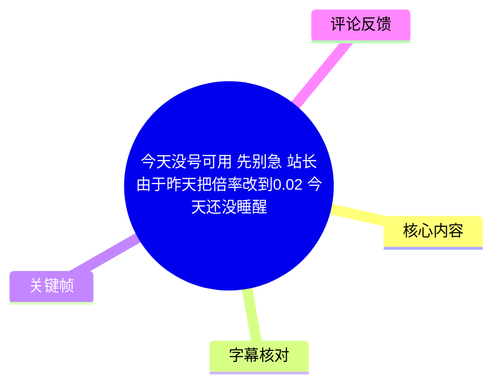
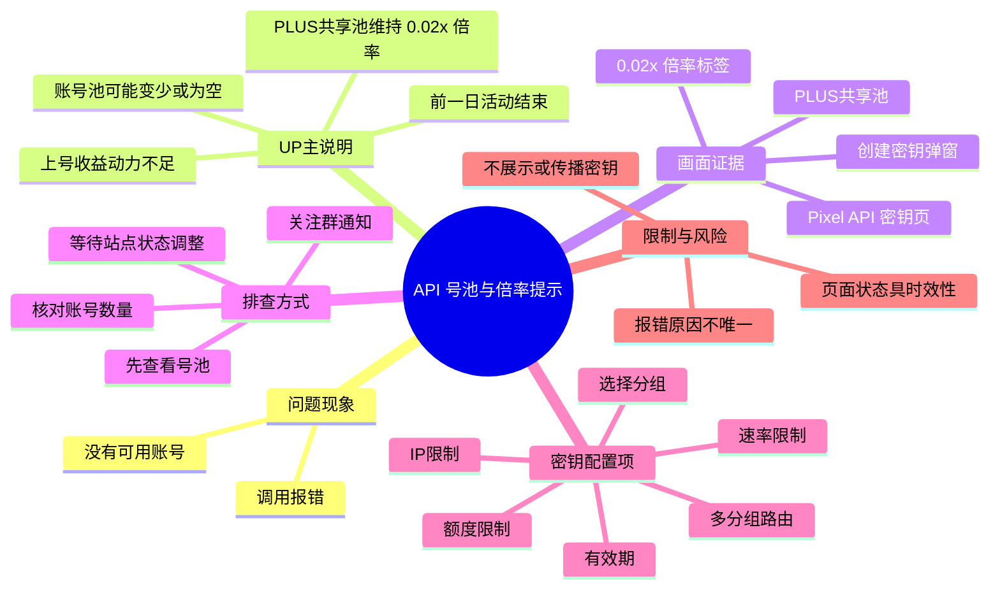
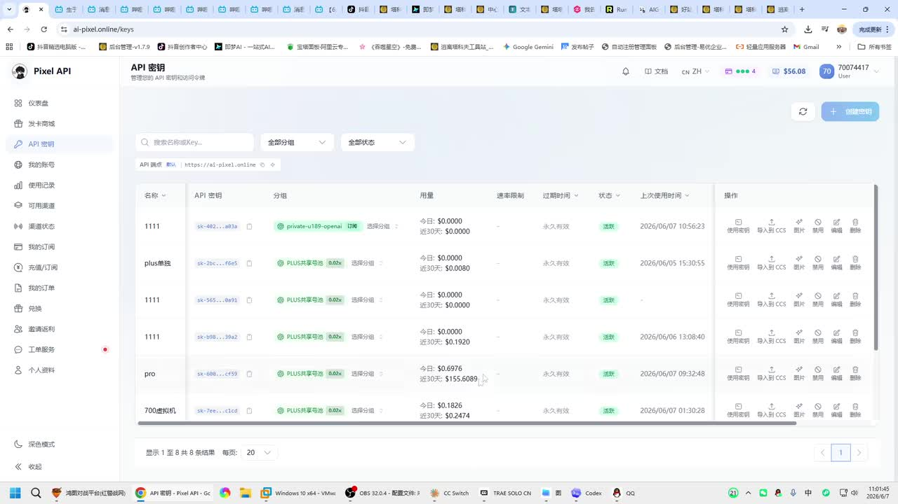
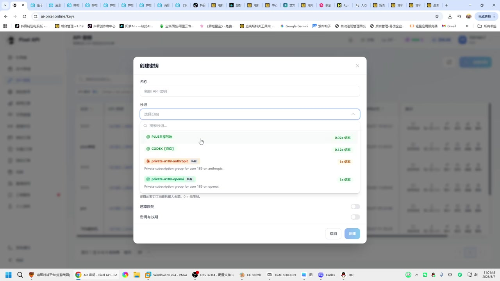
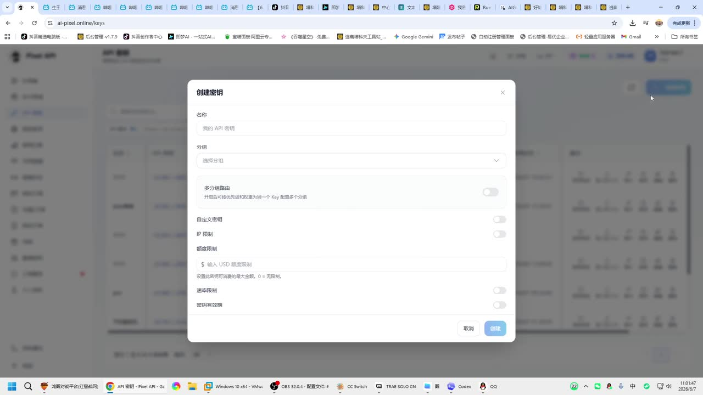
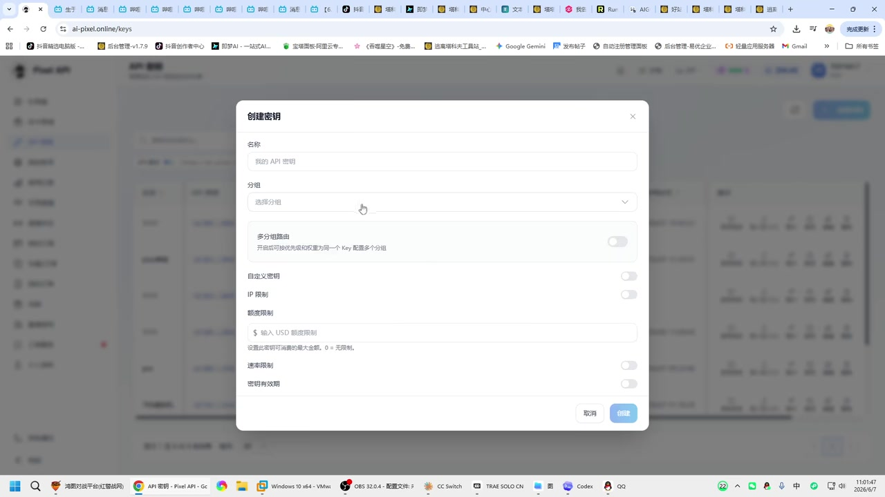

# 今天没号可用 先别急 站长由于昨天把倍率改到0.02 今天还没睡醒

> 来源：[Bilibili 视频](https://www.bilibili.com/video/BV1VwEx6kE2L)  
> UP 主：生于忧患死于忧患｜时长：12 秒｜标签：`api`、`中转站`  
> 时效提醒：视频画面记录的是 **2026-06-07** 前后的页面状态；账户池、倍率、分组和站点规则均可能随时变化。

## 小结

该视频是一则面向 API 中转站使用者的短提示：当调用报错或“没号可用”时，UP 主建议先不要立即判定服务故障，而应优先查看对应号池是否缺少可用账号。视频描述将当前现象归因于前一日活动结束后，某个“PLUS 共享池”的倍率仍保持在 **0.02 倍率**，使其他人缺乏上号的收益动力，进而导致号池可能为空或账号偏少。

画面展示的是名为 **Pixel API** 的网页后台“API 密钥”页面。现有密钥列表中的若干条目被分配至不同分组；其中可见“PLUS共享池”及多条密钥旁带有“0.02x 倍率”标识。新建密钥弹窗中，用户可以填写名称、选择分组，并可见多分组路由、自定义密钥、IP 限制、额度限制、速率限制、密钥有效期等配置项。

视频的可操作经验是：遇到报错时，先检查号池余量或账号状态；如果池中账号很少或没有账号，报错可能是资源不足的结果，而非单纯的本地配置错误。UP 主还建议自行加入相关群组，以便通过群通知获知倍率、号池和服务状态变化。

需要严格区分信息来源：**“0.02 倍率导致没人上号、号池不足会报错”是 UP 主在标题与视频简介中的说明**，并非本次素材可独立验证的平台运行数据。画面只能确认当时网页确实显示了“PLUS共享池”与“0.02x 倍率”等界面文字，不能证明其后续状态、具体结算规则或所有报错原因。

本视频未提供可用的站内字幕；本次 ASR 也没有识别出任何语音片段。因此，本文以视频标题、简介、元数据和关键帧中的可见界面信息为依据整理，不把未识别到的口语内容补写为事实。

## 思维导图

## 目录

- [背景：为何“没号”时先别着急](#背景为何没号时先别着急)
- [画面中的倍率与共享池信息](#画面中的倍率与共享池信息)
- [报错排查：先确认号池资源](#报错排查先确认号池资源)
- [创建 API 密钥时可见的配置项](#创建-api-密钥时可见的配置项)
- [关键帧索引](#关键帧索引)
- [结论、限制与时效性](#结论限制与时效性)
- [字幕比对](#字幕比对)
- [评论分析](#评论分析)
- [处理记录](#处理记录)

## 背景：为何“没号”时先别着急 [00:00](https://www.bilibili.com/video/BV1VwEx6kE2L?t=0)

视频标题直接给出的核心信息是：“今天没号可用”时先不要着急；UP 主将原因描述为站长前一天将倍率改为 **0.02** 后尚未调整回来。视频简介进一步说明，其认为低倍率使他人难以获得收益，因此可能没有人继续上号。

这里的“号”从简介上下文看，指被加入某个共享账号池、供 API 调用使用的账号资源；但视频没有定义账号来源、授权方式、具体模型范围或平台的完整运营规则。因此，阅读时不应将“号池”自动等同于任何特定第三方服务的官方账号池。

> 图：该关键帧展示浏览器中的 **Pixel API → API 密钥**管理页。列表中可见“PLUS共享池”等分组文字和“0.02x 倍率”标签，是本文确认“当时页面显示低倍率共享池”的主要画面依据。列表中的密钥内容已呈截断/遮蔽状态，本文不记录或复现任何密钥字符串。

从视频简介可归纳出如下因果链，但它属于 UP 主的运营判断：

1. 前一日的“狂欢”或活动结束；
2. 共享池倍率仍为 `0.02`；
3. 其他人可能认为该倍率下收益不足；
4. 因而不愿继续向池中上号；
5. 可用账号数下降甚至为空；
6. 用户请求时可能发生报错。

这条链路能解释一部分“资源池枯竭型”错误，但不能排除网络、鉴权、模型限流、余额、配额、IP 策略或服务端故障等其他原因。

## 画面中的倍率与共享池信息 [00:00](https://www.bilibili.com/video/BV1VwEx6kE2L?t=0)

视频画面中的站点地址栏可见 `ai-pixel.online/keys`，页面品牌为 **Pixel API**。左侧导航中，“API 密钥”处于选中状态；主区域是密钥管理表格。

画面可辨认的表格维度包括：

| 页面字段/信息 | 画面中的含义 | 可确认范围 |
| --- | --- | --- |
| 名称 | 密钥条目的自定义名称 | 仅能确认存在名称列 |
| API 密钥 | 每条记录关联的密钥 | 内容为截断显示，不应传播 |
| 分组 | 密钥所使用的资源分组 | 可见“PLUS共享池”等名称 |
| 用量 | 当日及近 30 天的费用/用量展示 | 仅是录制瞬间的页面数据 |
| 速率限制 | 页面中的限制列 | 部分行显示为 `-`，不代表实际无限制 |
| 过期时间 | 密钥的有效期状态 | 画面中可见“永久有效”字样 |
| 状态 | 密钥启用状态 | 多条记录显示“激活” |
| 操作 | 使用密钥、导入到 CCS、图片、禁用、编辑、删除等入口 | 仅确认界面提供这些操作入口 |

共享池选择项中，画面可见以下内容：

| 分组 | 画面可见倍率 | 备注 |
| --- | ---: | --- |
| PLUS共享池 | `0.02x 倍率` | 与标题、简介中的“0.02 倍率”相互印证 |
| CODEX【免费】 | `0.12x 倍率` | 为下拉列表中可见的另一分组 |
| private-u189-anthropic | `1x 倍率` | 标注为私有分组 |
| private-u189-openai | `1x 倍率` | 标注为私有分组 |

> 图：该帧的价值在于同时展示了多个可选分组及其倍率标签：`PLUS共享池 0.02x`、`CODEX【免费】0.12x`，以及两个 `1x` 私有分组。它支持“0.02x 是该录制时页面可见配置”的表述，但不能证明这些倍率在视频发布后仍然有效。

## 报错排查：先确认号池资源 [00:00](https://www.bilibili.com/video/BV1VwEx6kE2L?t=0)

UP 主在视频简介中给出了一条简短但明确的排查优先级：**报错后先看号池有没有号**。可按以下顺序执行，且每一步都应保留错误信息，避免仅凭猜测修改密钥配置。

1. **记录报错原文与发生时间**  
   区分 HTTP 状态码、接口返回体、客户端日志和网页提示。视频没有给出具体错误码，因此不能将任意错误直接认定为“没号”。

2. **确认当前密钥所属分组**  
   在“API 密钥”页查看密钥所在分组。画面表明创建密钥时可以选择分组，已有密钥也显示分组标签；不同分组可能对应不同资源池与倍率。

3. **查看对应号池是否有可用账号**  
   根据 UP 主说明，若号池中账号很少或为空，请求可能报错。这一步应以站点实际的账号池/渠道状态页为准；本视频画面未展示号池数量，因此无法给出具体阈值。

4. **避免把资源问题误判成密钥失效**  
   若密钥在页面中仍显示“激活”，也不必然代表后端资源充足；反过来，资源不足也不必然意味着密钥需要重建。

5. **等待状态调整并关注通知**  
   UP 主建议加入相关群组获取通知。对于倍率、资源池或活动规则频繁变动的站点，通知渠道可以补足网页状态页的滞后，但群消息仍应以站点实际状态为准。

6. **再检查本地侧配置**  
   当号池正常时，再回查 API 地址、鉴权格式、所选模型、限速、配额、IP 白名单及客户端重试策略。视频未演示这些项目，只能作为通用的补充排查方向，不能视为原视频给出的故障处理步骤。

> **经验边界**：视频建议的是“先检查账号池”，不是“所有报错均由账号池为空导致”。尤其在共享资源环境中，资源可用性、限流和服务端策略可能随时改变。

## 创建 API 密钥时可见的配置项 [00:00](https://www.bilibili.com/video/BV1VwEx6kE2L?t=0)

视频后半段展示“创建密钥”弹窗。该弹窗没有展示完整填写与提交过程，但可确认创建流程至少包含“命名—选分组—按需启用限制—创建”几个界面环节。

> 图：该帧展示创建 API 密钥的初始表单。其价值在于说明分组不是隐藏配置，而是创建密钥时的显式选择项；也可见安全与资源控制相关的开关入口。

### 可见操作步骤

1. 在 API 密钥页面点击“创建密钥”。
2. 在弹窗的“名称”字段填写便于识别的名称。
3. 在“分组”下拉菜单中选择资源分组。
4. 视实际需要配置以下开关或字段。
5. 点击“创建”完成创建；视频未展示创建成功后的结果页，因此无法确认默认值、必填校验与最终生效规则。

### 可见字段与限制

| 配置项 | 画面文字 | 可推知的用途 | 视频未说明的部分 |
| --- | --- | --- | --- |
| 名称 | “名称” | 为密钥添加管理标识 | 命名长度、字符规则 |
| 分组 | “选择分组” | 决定密钥使用的资源分组 | 分组的完整权限、模型清单 |
| 多分组路由 | “开启后可按优先级和权重为一个 Key 配置多个分组” | 同一密钥可能支持多个分组的优先级/权重路由 | 具体路由算法和故障切换条件 |
| 自定义密钥 | “自定义密钥”开关 | 允许用户尝试指定密钥内容 | 格式、长度与安全风险规则 |
| IP 限制 | “IP 限制”开关 | 对调用来源做 IP 范围约束 | 支持的 CIDR 格式、多个 IP 规则 |
| 额度限制 | “输入 USD 额度限制”；提示“设置此密钥可消费的最大金额，0 = 无限制” | 控制该密钥最高可消费金额 | 计费周期、超额后的行为 |
| 速率限制 | “速率限制”开关 | 对请求频率实施限制 | 单位、默认 QPS、突发策略 |
| 密钥有效期 | “密钥有效期”开关 | 设置密钥过期规则 | 具体可选时长与过期后的处理 |

> 图：该帧聚焦“分组”选择动作。对排查“没号可用”而言，确认密钥所绑定的分组尤其重要，因为视频描述的问题针对的是共享池资源，而不是所有分组。

### 安全注意事项

- API 密钥属于凭据，不应在截图、日志、评论区或群聊中完整公开。
- 若站点支持 IP 限制，应优先仅放行必要的服务器出口 IP。
- 若密钥用于测试、共享环境或不可信客户端，应考虑启用额度限制、速率限制和有效期。
- “自定义密钥”功能是否安全、是否允许低熵字符串、是否影响撤销策略，视频未给出说明，需以站点实际规则为准。
- 视频画面仅展示设置入口，**没有演示任何密钥创建、导出或调用成功的全过程**。

## 关键帧索引 [00:00](https://www.bilibili.com/video/BV1VwEx6kE2L?t=0)

由于本次 ASR 没有生成带时间戳的语音分段，且素材未附关键帧采样时刻，以下按画面内容索引，不为单帧虚构精确出现秒数；章节链接统一定位至视频起点。

| 关键帧 | 画面内容 | 正文用途与价值 |
| --- | --- | --- |
| [frame-001.jpg](frames/frame-001.jpg) | API 密钥列表页 | 确认 Pixel API 后台、密钥分组、列表中的 `0.02x` 共享池标签与密钥状态界面。 |
| [frame-002.jpg](frames/frame-002.jpg) | 创建密钥弹窗初始状态 | 确认名称、分组、多分组路由、IP/额度/速率/有效期等配置入口。 |
| [frame-003.jpg](frames/frame-003.jpg) | 分组下拉列表 | 确认共享池、免费分组和私有分组并列可选。 |
| [frame-004.jpg](frames/frame-004.jpg) | 展开的分组及倍率标签 | 作为 `PLUS共享池 0.02x`、`CODEX【免费】0.12x` 和私有分组 `1x` 的主要画面证据。 |

## 结论、限制与时效性 [00:00](https://www.bilibili.com/video/BV1VwEx6kE2L?t=0)

本视频传达的实用结论是：在共享账号池或渠道资源模式下，报错排查不应只盯着本地 API Key；应先判断当前密钥所属资源池是否仍有可用账号。若站点因倍率或运营调整导致供给减少，账号池为空确实可能成为调用失败的原因之一。

视频画面还说明，密钥的分组选择与资源策略有关；创建密钥时可见 IP、额度、速率和有效期等控制项。对于实际部署，建议将“资源可用性检查”和“密钥安全/配额限制”作为两条独立工作流处理。

但本素材存在以下明确限制：

- 视频仅 12 秒，未展示报错界面、号池数量、请求日志、接口响应或修复结果。
- `0.02x`、`0.12x`、`1x` 仅是录制页面的可见倍率标签，不足以推导实际成本、收益、结算方式或性能。
- UP 主的“倍率低导致没人上号”属于解释性陈述，未经账号池统计数据验证。
- 视频简介中的 `API.TAKEFU.CN` 是 UP 主写入的文本；本视频画面展示的网站地址则为 `ai-pixel.online/keys`。二者之间的服务关系、跳转关系及归属关系，素材未作说明，不能擅自认定为同一站点。
- 站点后台、资源池、群通知和账号供给均具有高时效性。本文不能据此判断 2026-06-07 之后的可用性，更不构成任何服务稳定性、价格或账号合规性的保证。

## 字幕比对 [00:00](https://www.bilibili.com/video/BV1VwEx6kE2L?t=0)

| 字幕来源 | 完整性 | 专有名词 | 时间轴 | 主要问题 |
| --- | --- | --- | --- | --- |
| Bilibili 站内字幕 | 未提供可用字幕 | 无法核对 | 无 | 素材清单明确标注“未提供可用站内字幕”。 |
| 本次 ASR 字幕 | 空 | 无识别结果 | 无可用分段 | ASR 使用 `medium` 模型、自动语言识别；检测语言为 `en`、置信度 `0.541015625`，共识别到 0 个语音片段，语音覆盖率为 0。 |

本次 ASR 已实际检查，但输出为空，诊断提示为“未识别到语音片段”。诊断数据**没有**标记 `noAudioStream=true`；同时素材中存在已提取的 `audio/audio.wav`，因此不能将此情况表述为“源视频没有音轨”，也不能将其直接归因于工具失败。更准确的结论是：本次音频轨中未识别到可转写的语音内容，可能是视频无口播、语音过弱、主要依赖画面文字，或音频内容不适合本次自动识别。

最终未采用任何字幕文本，而采用以下信息源交叉整理：

1. 视频标题与 UP 主简介中的文字陈述；
2. 视频元数据中的时长、标签和发布时间；
3. 关键帧中的可见页面文字与界面结构；
4. 单条可获取热评中的补充说法。

关键术语按画面原样保留或谨慎转写，包括：`Pixel API`、`PLUS共享池`、`CODEX【免费】`、`private-u189-anthropic`、`private-u189-openai`、`0.02x 倍率`。其中英文私有分组名称仅用于描述画面，不推断其账号类型、服务能力或所有权。

## 评论分析 [00:00](https://www.bilibili.com/video/BV1VwEx6kE2L?t=0)

当前仅获取到 1 条热评，未达到 3 条；因此只分析这条可用评论，不补造其余评论。

| 排名 | 评论者 | 评论内容概括 | 分析与可信度 |
| --- | --- | --- | --- |
| 1 | 小马驹派派营 | 称自己“还有 0.002 倍率，可以来嫖”。 | 该评论从侧面反映评论者关注更低倍率的资源供给，但“0.002 倍率”的对象、平台、账号来源、有效性与合规性均未提供证据。它不能证明视频中的 Pixel API 共享池状态，也不应作为获取或使用账号资源的操作依据。点赞数为 0。 |

评论内容与视频简介都围绕“倍率”和账号供给展开，但两者均属于用户或 UP 主的单方陈述。尤其涉及账号共享、低倍率资源或“嫖”类表达时，应审慎评估服务条款、授权范围、数据安全和账号归属风险。

## 评论分析

- 热评 1：我这还有0.002倍率，可以来嫖

以上内容是观众反馈摘录，只用于补充理解视频反响，不作为正文事实依据。

## 处理记录

- Worker ID：`worker-mrj0wbly-5dc4e50c`
- 调用模型：`gpt-5.6-terra`
- ASR 模型：`medium`，设备 `cuda`，计算类型 `float16`，请求语言 `auto`。
- 使用的素材工具产物：`merged.mp4`、`audio/audio.wav`、`asr/transcript.srt`、`asr/asr-result.json`、`frames/`、`comments/comments.json`、视频元数据。
- 字幕选择：站内字幕未提供；本次 ASR 已检查且无识别片段，未采用虚构字幕。正文依据标题、简介、元数据和关键帧进行多模态整理。
- 时间轴依据：ASR 没有产生 `HH:MM:SS,mmm --> HH:MM:SS,mmm` 的真实分段，站内 SRT 亦不可用；因此所有章节时间轴均使用视频真实起点 `t=0`，不按文字顺序猜测片段秒数。
- 关键帧选择依据：`frame-001` 用于确认密钥列表与共享池倍率标签；`frame-002` 用于记录创建密钥的设置项；`frame-003`、`frame-004` 用于确认分组下拉菜单及可见倍率。未将关键帧中的截断密钥内容写入正文。
- 评论处理：按“可获取热评前三条”规则处理；实际仅获取 1 条，未补充不可获取内容。
- 缓存清理：提供的素材清单未包含缓存清理执行日志；本文不声称已执行未记录的清理操作。
- 未解决问题：无法从现有素材验证号池实时数量、具体报错码、倍率的结算含义、两个页面地址之间的关系，以及视频发布后的平台状态。
