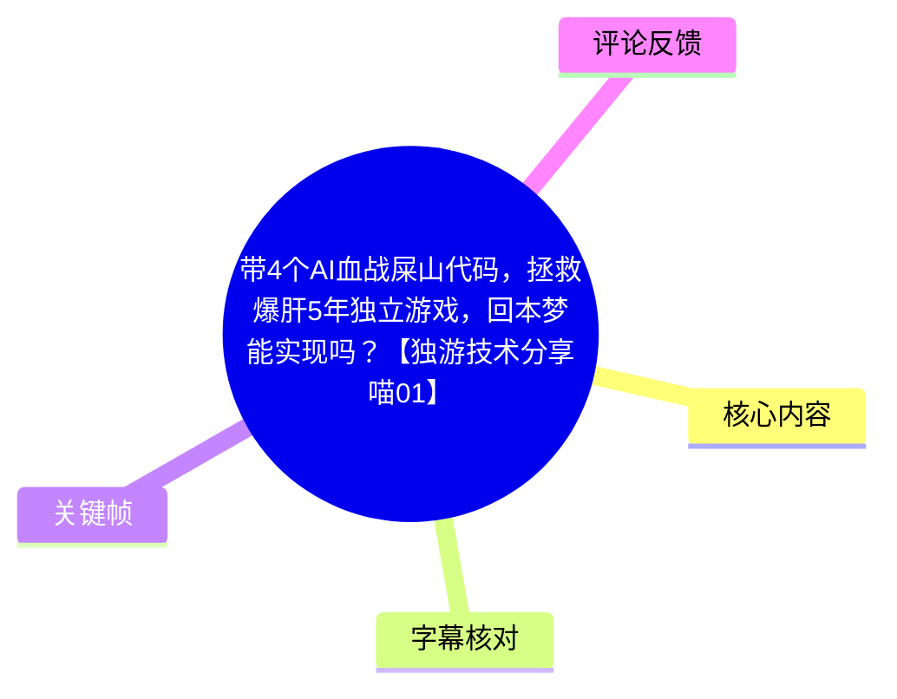
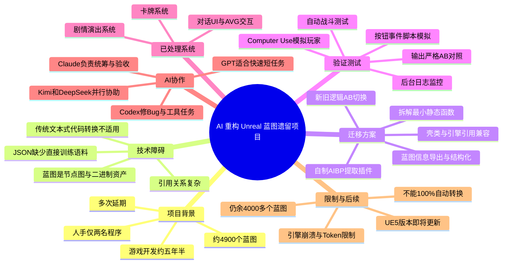
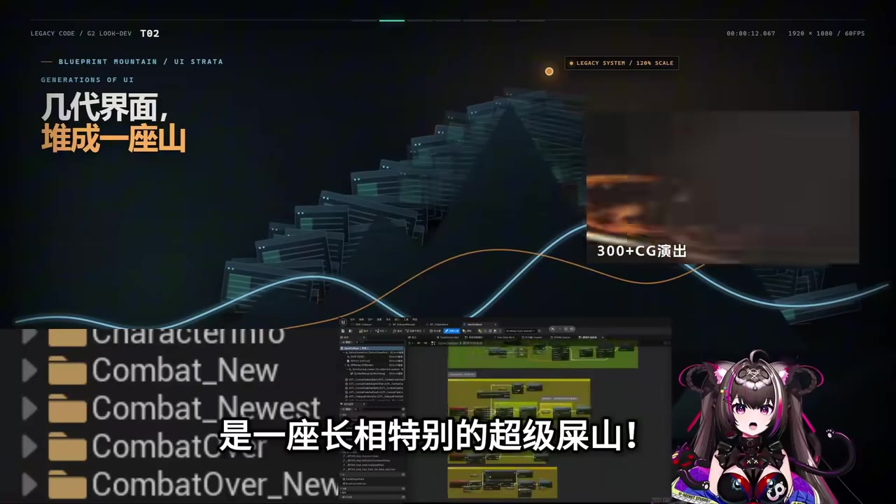
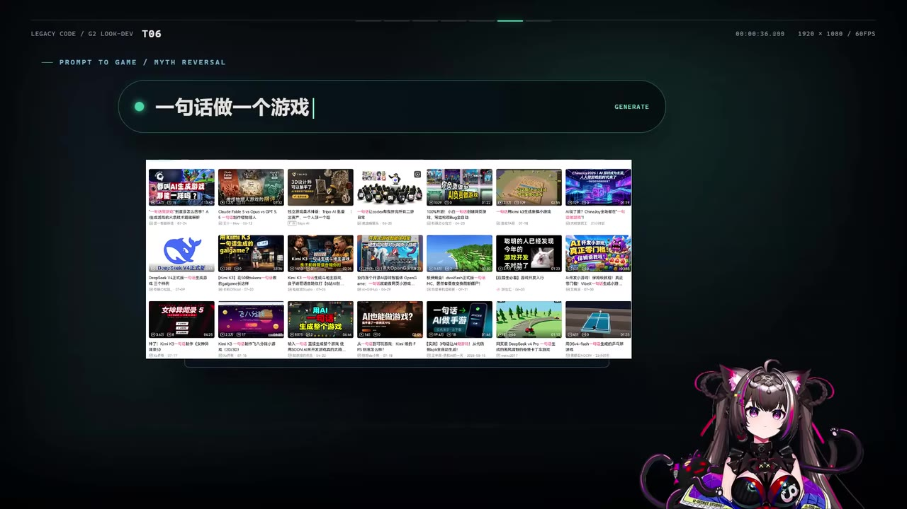
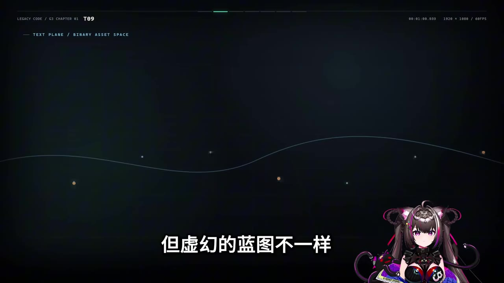
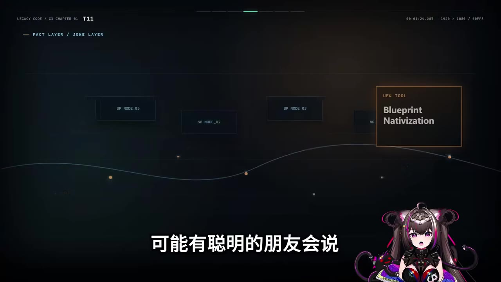

# 带4个AI血战屎山代码，拯救爆肝5年独立游戏，回本梦能实现吗？【独游技术分享喵01】

> 来源：[Bilibili 视频](https://www.bilibili.com/video/BV1G63d6CE5j)  
> UP 主：混沌之神虚妄喵｜时长：14 分 05 秒｜合集：AIcode  
> 关联游戏：Steam《叛逆神魂 / GODSOUL》（链接见视频简介）

## 小结

这是一份独立游戏开发者的实战复盘：UP 主试图以多个编程 Agent 辅助，将运营约五年半、经历多次延期的《叛逆神魂》从大量 Unreal Engine 蓝图（Blueprint）逻辑逐步迁移至代码。其核心目标并非“让 AI 一句话做游戏”，而是解决长期积累的维护成本、测试效率与程序产能瓶颈。

项目的现实难点是：约 **4,900 个蓝图**构成了高度耦合的旧系统；蓝图并不是可被直接投喂给大语言模型的普通源码文本，而更接近可视化、二进制化的节点图。UP 主团队先通过自制 AI 蓝图提取插件将蓝图信息导出为 JSON 等可分析形式，再用“拆小函数—转换—AB 双轨验证—自动化测试”的工作流逐块迁移。

视频最具可迁移性的经验是：**AI 不能替代架构、验证和人工决策，但可以在结构化提取、重复性转换、批量数据回填、日志监控与长时间回归测试上显著放大人类产能。** 特别是在旧蓝图与新代码共存的迁移期，保留原逻辑与新逻辑之间的 AB 切换开关，是控制回归风险的关键工程措施。

已完成或推进的对象包括对话 UI、剧情/演出系统以及卡牌系统。视频称，对话与演出系统迁移后，AI 已对 300 多个对话表进行测试；卡牌部分涉及 900 多张卡、706 个待迁移蓝图，且仍有 4,000 多个蓝图尚待处理。上述数量均为 UP 主在视频中的项目陈述，不等同于第三方审计结果。

UP 主同时说明了四机并行的分工：Claude/“Cloud”（ASR 对品牌名称识别不稳定，下文按语境标记）承担总体规划、规范、分发与验收；Kimi、DeepSeek 与 Codex 被用于并行迁移、辅助与 Bug 修复；GPT 系模型更适合快速查询、短任务、找 Bug 与 Computer Use，但不适合单独长期统筹这个复杂迁移项目。

这不是一套可直接复制的“蓝图自动转代码工具教程”。它依赖自制插件、对 Unreal 引擎引用机制的深度改造、多个模型订阅、四台电脑和长期人工监控。视频明确承认：蓝图转代码目前不能做到 100% 自动化，AI 也会推理出错、Token 不足、引擎频繁崩溃，并可能受到内容审核等外部限制。

## 思维导图

## 目录

- [背景：为什么旧蓝图会成为“代码山”](#背景为什么旧蓝图会成为代码山)
- [蓝图迁移的输入问题：不是普通文本代码](#蓝图迁移的输入问题不是普通文本代码)
- [重构底座：提取、拆分与引用兼容](#重构底座提取拆分与引用兼容)
- [质量保障：AB 双轨、日志和自动化测试](#质量保障ab-双轨日志和自动化测试)
- [三个系统的迁移进展](#三个系统的迁移进展)
- [四台电脑与多 Agent 分工](#四台电脑与多-agent-分工)
- [模型能力体验与边界](#模型能力体验与边界)
- [项目现状、UE5 更新与时效性](#项目现状ue5-更新与时效性)
- [可复用工作流](#可复用工作流)
- [限制、风险与适用范围](#限制风险与适用范围)
- [关键帧索引](#关键帧索引)
- [字幕比对](#字幕比对)
- [评论分析](#评论分析)
- [处理记录](#处理记录)

## 背景：为什么旧蓝图会成为“代码山” [00:00:39](https://www.bilibili.com/video/BV1G63d6CE5j?t=39)

UP 主称，《叛逆神魂》已开发约五年半，发售前经历十余次延期；项目更换过数代 UI 程序，留下大量累积性技术债。视频将其形容为一座“长相特别的超级屎山”，并给出项目规模：约 **4,900 个蓝图**。

这里的“技术债”不是单指代码难看，而是多种问题的叠加：

1. **人员变动与多代实现并存**：UI 经历多轮人员与方案更替，局部逻辑、命名、依赖及数据约定可能不统一。
2. **蓝图资产数量巨大**：蓝图不只是函数文本，还是由节点、引脚、变量、事件、组件和引用构成的资源网络。
3. **系统之间耦合**：对话、演出、卡牌、战斗与 UI 之间存在调用、参数和运行时状态依赖。
4. **人工测试昂贵**：复杂交互和偶发 Bug 往往要求录屏、复现流程、翻查日志，成本高且容易遗漏。
5. **团队程序人力有限**：UP 主称团队只有两名程序，因此“继续纯人工维护”会直接限制玩法与版本迭代空间。

视频一开始反驳了“AI 一句话做游戏”的想象：AI 面对一个长期演进、强依赖、强状态的实际商业项目时，不会天然获得完整上下文，更不会自动保证行为等价。

> 图：画面以层层堆叠的界面资产和 Unreal 编辑器蓝图节点图来表现“几代界面，堆成一座山”。它直观说明本视频面对的不是新建项目，而是需要在现有资产、玩法与用户内容之上继续维护的遗留系统。

## 蓝图迁移的输入问题：不是普通文本代码 [00:01:05](https://www.bilibili.com/video/BV1G63d6CE5j?t=65)

视频指出，常规 LLM 对文本源码的处理模式，不能直接照搬到 Unreal 蓝图上。

### 蓝图为何不便于直接交给 AI

普通代码通常以 `.cpp`、`.h`、`.py` 等文本形式存在，模型可以读取文件、检索符号、理解调用链，并根据上下文输出补丁。蓝图则以可视化节点网络呈现，底层属于 Unreal 资产数据的一部分。即使复制最简单的 “Hello World” 蓝图，也会得到一长串节点相关文本，信息密度、可读性和上下文组织方式都不理想。

UP 主归纳的主要障碍包括：

- 蓝图不是原生的、干净的代码文本；
- 仅用截图喂给模型，信息传递效率低，且难以覆盖大型图表；
- 复制蓝图内容会产生密集、冗长的节点描述；
- 官方早期的蓝图转原生代码相关工具已不可用或被移除，不能作为稳定迁移路径；
- 蓝图之间的类引用、参数引用和继承关系会使“单个函数转代码”变成跨资产的联动问题。

> 图：画面以“一句话做一个游戏！”的输入框和相关视频缩略图构成对照，强调视频的立场：AI 生成原型与改造大型既有项目是不同难度的问题，后者需要工程化上下文与验证体系。

### 术语说明

| 术语 | 本视频中的含义 |
| --- | --- |
| 蓝图（Blueprint） | Unreal Engine 的可视化脚本/逻辑资产系统，由节点、连线、事件、变量和引用等组成。 |
| 蓝图转代码 | 将原有蓝图逻辑改写为代码侧实现，同时保持原有游戏行为、调用关系和数据结果尽可能一致。 |
| 引用 | 蓝图类、对象、参数、变量、组件等之间的依赖；是迁移中最容易造成无法编译或行为变化的问题之一。 |
| 壳类 | 视频所述的兼容性包装方案：为存在冲突的蓝图类提供外层结构，以维持旧调用路径或引用关系。 |
| A/B 切换 | 在原蓝图逻辑和新代码逻辑之间切换，以对照结果并在发现错误时快速回退。 |
| Computer Use | AI 通过视觉与输入控制模拟用户操作的方式；视频将其用于模拟玩家运行游戏流程。 |

## 重构底座：提取、拆分与引用兼容 [00:01:53](https://www.bilibili.com/video/BV1G63d6CE5j?t=113)

### 1. 先解决“让 AI 看见什么”

UP 主在尝试多种 MCP 或插件后发现，现成方案会遗漏蓝图信息。为提高提取完整性，团队分析多个方案并制作了名为 **AIBP** 的“AI 蓝图插件”（名称以视频口述与 ASR 语境为准），目标是尽可能完整地捕捉蓝图底层信息，并将其简化、导出为结构化的交互/参数数据。

视频的关键判断是：

> 即便导出后的文字量仍可能显著大于普通代码，至少 AI 获得了能够检索、分析和推理的输入。

这一阶段的重点不是立刻生成代码，而是建立可靠的“资产事实层”：函数、变量、节点关系、调用关系、参数、默认值和引用信息若提取不全，后续转换即使能编译，也可能在运行时产生隐蔽错误。

### 2. 把大系统拆成最小可验证单元 [00:02:17](https://www.bilibili.com/video/BV1G63d6CE5j?t=137)

面对对话 UI 这一较稳定、成熟的系统，方案是先将大型蓝图拆解为许多最小静态函数，再逐个转换、测试与汇聚回系统。

这种拆解策略的价值在于：

- 降低单次 Prompt 所需的上下文长度；
- 将错误限制在局部函数，而不是整个 UI 系统；
- 让转换结果可以逐函数进行编译和行为验证；
- 更适配 Agent 的任务分发与并行处理；
- 允许在复杂依赖出现前先积累转换规范。

但视频强调：小函数的转换“看似顺利”，并不代表系统级迁移成立。真正的难题来自蓝图引用。

### 3. 用兼容层处理引用关系 [00:03:05](https://www.bilibili.com/video/BV1G63d6CE5j?t=185)

举例而言：一个函数的参数含有蓝图类引用，且该函数又被其他蓝图类调用时，纯代码层可能无法直接找到或表达原有蓝图类。若继续硬转，错误会从一个点连锁扩散到多个调用方。

视频描述的补救措施包括：

1. 由人类开发者制作关键插件；
2. 将蓝图引用参数、变量等信息尽可能压到代码侧；
3. 为冲突蓝图类创建壳类；
4. 对 Unreal 引擎的引用/调用路径进行调整，使蓝图表面仍沿用旧调用接口，而底层实现已替换为新代码。

这一方案本质上是 **渐进式替换（Strangler Fig / 绞杀者模式）** 的游戏引擎实践：旧接口暂时保留，新实现从底层逐步接管。视频没有提供具体源码、引擎修改补丁或插件实现，因此不能据此复现具体 Unreal API 调用方式；但它明确展示了迁移的工程原则——**兼容层先行，避免一次性切断旧依赖网。**

> 图：画面文字为“TEXT PLANE / BINARY ASSET SPACE”，并配有“但虚幻的蓝图不一样”的字幕。该帧有助于理解为什么视频不把蓝图问题简化为“复制文本给模型、让它翻译成 C++”。

## 质量保障：AB 双轨、日志和自动化测试 [00:04:18](https://www.bilibili.com/video/BV1G63d6CE5j?t=258)

### A/B 切换是迁移安全阀

UP 主说明，蓝图导出的 JSON 数据不属于模型常见的训练语料，AI 很多时候只能依靠推理“脑补”逻辑，因此会犯错。而底层重构中，单个函数的偏差都可能造成 UI、剧情、状态机或存档流程的异常。

团队在转换规范中保留了 AB 切换开关：

- **A 侧**：原蓝图版本；
- **B 侧**：新代码版本；
- 单个函数完成转换后，可在两个版本间切换；
- 发现异常时能立刻回退至原蓝图；
- 每批函数迁移后，要求两侧输出进行严格对照。

视频提出的验收标准非常明确：**原蓝图跑一遍，新代码跑一遍，输出结果必须完全一致。** 这是一种行为等价验证目标。需要注意，视频未公开其断言格式、日志字段或自动比对脚本，因此“完全一致”的精确比较粒度无法从素材中确认。

### 自动化验证的两条路径 [00:04:42](https://www.bilibili.com/video/BV1G63d6CE5j?t=282)

UP 主让 AI 模拟玩家行为来做最终验收，采用两种路径：

| 路径 | 做法 | 优势 | 视频提到的限制 |
| --- | --- | --- | --- |
| Computer Use | AI 通过视觉界面操作游戏，跑完整玩家流程 | 更接近真实用户交互，可观察 UI 与流程问题 | 速度较慢 |
| 事件脚本模拟 | 用脚本模拟每个按钮点击事件 | 执行速度更快，适合重复流程 | 不一定覆盖所有视觉、时序和真实输入问题 |

在一次剧情流程中，AI 多次卡住。由于有 AB 开关，团队能够对照后台日志并修改，最终发现原因是一个定时器触发错误。这个案例说明：自动化测试不能只看“有没有崩溃”，还需要将输入、状态、日志和输出一起保留，才能定位蓝图到代码迁移中的时序问题。

### 视频给出的结论

UP 主明确认为，蓝图转代码**当前无法做到 100% 逻辑自动化**。AI 的可用前提是人类提供准确、详细的反馈，并建立回退、对比、验收闭环。

## 三个系统的迁移进展 [00:05:31](https://www.bilibili.com/video/BV1G63d6CE5j?t=331)

### 对话 UI 与 AVG 交互：先啃最成熟的系统

视频先选择对话 UI 作为第一阶段对象。该系统覆盖巨型对话、角色演出和多类 AVG 交互逻辑。选择理由是其相对稳定、成熟，更适合作为迁移流程的试验场。

在完成转换后，AI 对游戏中 **300 多个对话表**进行了大范围测试。视频称，AI 不仅能按常规路径逐表执行，也会寻找可能带特殊逻辑的区域并组合测试；之后还做了从头到尾的全量运行，最终数百场对话没有报错。

这说明 AI 在回归测试中的价值主要在于高重复度、无疲劳与更高覆盖频率；但“没有报错”只表示在该轮测试路径和监控条件下未观测到错误，不能推出所有剧情逻辑均已被形式化验证。

### 剧情/演出系统：时序与数据默认值的风险 [00:05:55](https://www.bilibili.com/video/BV1G63d6CE5j?t=355)

对话 UI 之后，团队处理更复杂的剧情演出系统。视频描述其承担角色进场、移动、表情切换、动画过渡、退场，以及自动与跳过兼容等职责，且涉及大量时间轴、序列与蓝图继承关系，有的蓝图可牵连数百个演出指令。

迁移期间引擎崩溃数十次。尽管前序经验令部分代码转写更顺利，进入游戏测试后仍出现角色战斗立绘/脸部显示消失的问题。排查后，原因是底层数百个子项在转换时丢失了一部分变量默认值。

修复方式是让 AI 从旧数据中逐项提取缺失值，再精确回填到新实现中。这个案例揭示了蓝图迁移中的重要风险：**函数逻辑等价不代表资产数据等价。默认值、序列化字段、资源引用和编辑器配置同样属于运行行为的一部分。**

### 卡牌系统：从技术深度转为规模压力 [00:07:55](https://www.bilibili.com/video/BV1G63d6CE5j?t=475)

卡牌系统的压力主要来自规模和测试复杂度：

- **900 多张卡牌**；
- 涉及 **706 个蓝图**待迁移；
- 许多 Bug 是偶发或连续触发型；
- 过去纯人工测试时，单个异常可能耗费数月排查；
- 玩家只要反馈“这张卡效果怪怪的”，团队就可能需要反复录屏、复现和翻日志。

UP 主起初认为卡牌大多是独立小蓝图，可能更适合 AI 批量处理；但实践中受限于模型 Token、推理失误与编辑器频繁重启，单个 Workflow 一口气处理完整卡牌系统不可行。因此改为多模型、多机器并行，并建立自动战斗测试流程。

### 自动战斗测试的关键能力 [00:09:07](https://www.bilibili.com/video/BV1G63d6CE5j?t=547)

视频中的自动化流程可概括为：

1. AI 打开游戏；
2. 进入战斗；
3. 让角色打出卡牌；
4. 同时监控后台日志；
5. 一旦卡牌触发异常逻辑、报错或数值不对，立即定位问题。

这套机制的优势尤其面向偶发 Bug：不必完全依赖人工恰好看见异常，而是让行为驱动测试与日志监控并行发生。UP 主称该工作已由 AI 基本无休运行一个月，自己每天约 16 小时持续关注运行状态。

截至视频录制时，900 张卡牌只是中途阶段，仍有 **4,000 多个蓝图**以及战斗、战斗 UX 等更难系统待处理。

## 四台电脑与多 Agent 分工 [00:10:19](https://www.bilibili.com/video/BV1G63d6CE5j?t=619)

UP 主称项目体量大到打开编辑器都会卡顿，为突破产能瓶颈，日常采用四台电脑近乎 24 小时并行工作。

| 设备/角色 | 视频中承担的工作 |
| --- | --- |
| 日常工作机（Codex） | 修改当前版本 Bug、编写工具、直播等日常任务。 |
| 主力设备（“Cloud”） | 被描述为“赛博主程序兼指挥官”：写规范、拆分任务、分发工作、收尾验收。ASR 对实际模型品牌识别不稳定，语境可能指 Claude。 |
| 24 小时挂机设备 | 在 Zed Code 等环境中运行 Kimi 或 DeepSeek，持续处理任务。具体 IDE/工具名存在 ASR 不确定性。 |
| 老电脑（Codex） | 依托其他 AI/工具产出的基础继续执行辅助性工作。视频未给出完整的具体任务边界。 |

该分工反映的不是“多个模型各自写一部分代码”这么简单，而是一个更接近软件生产线的角色划分：

- **主控 Agent**：维护规范、上下文和验收门槛；
- **执行 Agent**：按细粒度任务进行转换或补全；
- **测试 Agent**：运行游戏、触发行为、读取日志；
- **人类负责人**：审查每行 AI 产出、处理架构决策、修复高风险问题。

> 图：画面出现“Blueprint Nativization”字样，用于引出“是否可将蓝图直接转为代码”的问题。该图的价值在于提示读者：视频讨论的迁移不是单纯调用某个官方一键功能，而是围绕资产提取、引用兼容与测试验证建立的工作流。

## 模型能力体验与边界 [00:11:08](https://www.bilibili.com/video/BV1G63d6CE5j?t=668)

以下是 UP 主的个人使用体验，不构成可普遍复现的模型基准测试。由于本次 ASR 对模型名存在明显误识别，名称以视频标签、上下文和可辨语义做谨慎整理。

| 模型/工具 | UP 主的主观评价 | 更适合的任务 | 主要问题 |
| --- | --- | --- | --- |
| Claude（视频口述中多次被 ASR 识别为“Cloud”） | 总体表现最好；一轮 Workflow 可处理多个函数；引擎崩溃次数相对少；可根据错误反复改进任务/技能 | 规范、任务拆分、迁移统筹、验收 | 仍可能出错；订阅与 Token 约束影响持续工作 |
| Kimi、DeepSeek | 可参与并行工作 | 辅助转换、补充执行任务 | 视频称触发/搞崩引擎的频率相对更高；有时会向 Claude 求助 |
| Codex | 被安排在日常 Bug 修复、工具和辅助工作中 | 当前版本 Bug、短周期开发任务 | 视频未将其描述为总控 |
| GPT 系模型（ASR 误识别为“GPT5.6”） | 速度快；Computer Use 较流畅 | 找 Bug、短时问答、辅助修当前版本问题 | 不适合单独负责长期复杂迁移的总指挥；曾因上下文衔接、空转测试及敏感卡牌名审核而受阻 |

视频举了一个反例：在 Claude 订阅过期期间，UP 主让 GPT 系模型读取既有文档继续统筹，但其出现空转和过度测试，数天没有有效推进；最终又因数张具有“黑客风”名称的卡牌触发系统拦截而中断。这说明 Agent 在长程任务上的失败模式不仅来自编码能力，也来自上下文持续性、任务边界、外部审核与执行监督。

## 项目现状、UE5 更新与时效性 [00:12:20](https://www.bilibili.com/video/BV1G63d6CE5j?t=740)

### AI 是否会让项目“写崩”

UP 主的回答是：AI 的定位是突破产能瓶颈，而非推翻原有架构。当前蓝图原本由人类编写，转换目标是改变实现形式，理论上不应主动破坏原架构；但这一判断的实际成立依赖于严密的人工审查与 AB 验证。

视频强调的控制措施包括：

- 每一行 AI 生成代码都由人类审查；
- 人类会进行大量手动修改；
- 原蓝图本身已有一定规范；
- 迁移期间保留新旧版本切换；
- 通过游戏流程和日志同时验证。

但项目早期 UI 确实积累了历史包袱，且两名程序的人力规模有限，玩法迭代会受到程序成本限制。因此，AI 并不是“清除技术债”的魔法，而是让有限团队能持续偿还技术债并腾出更多开发时间。

### UE4 到 UE5 的迁移与内容更新 [00:12:44](https://www.bilibili.com/video/BV1G63d6CE5j?t=764)

UP 主称《叛逆神魂》的 Unreal Engine 5 版本即将更新，并表示数月前借助 Claude Opus 4.6（型号以视频口述为准）将游戏从 UE4 迁移到 UE5。视频声称新版优化显存占用，并在价格不变的前提下加入内容，包括：

- 爱丽丝的新日常剧情；
- 两只猫猫的泳装剧情；
- 全新 CG。

这些属于视频发布时的开发计划/版本宣传信息，具体更新时间、实际性能提升、内容数量与最终上线状态应以 Steam 商店页、更新公告和可下载版本为准。

### 时效性提示

- 视频元数据抓取时间为 **2026-08-04**；其中涉及的模型能力、订阅规则、Token 限额、Computer Use 可用性与内容审核规则均可能快速变化。
- “Claude Opus 4.6”“GPT5.6”等名称在本次 ASR 中存在混淆或非标准转写，不能据此当作准确的官方模型版本列表。
- Unreal 蓝图相关工具、引擎版本策略与官方支持范围会随 UE 版本变动，视频中的经验应视为特定项目、特定时间点的工程实践。
- 视频对《叛逆神魂》后续改进、回本目标与新内容的描述均为创作者愿景和计划，不保证实现。

## 可复用工作流 [00:01:53](https://www.bilibili.com/video/BV1G63d6CE5j?t=113)

以下流程是对视频实际做法的结构化整理，适用于“已有可运行产品、需要渐进迁移的可视化脚本/遗留逻辑”场景；并非视频提供的完整可执行脚本。

### 步骤 1：盘点资产与选择首个目标

- 统计蓝图/脚本资产规模、核心依赖和风险等级；
- 不要从战斗、存档等最高耦合系统直接开刀；
- 优先选择相对稳定、边界较清晰、已有可测试流程的系统；
- 视频的首个目标是对话 UI 与 AVG 交互。

**输出物建议：** 资产清单、依赖图、风险等级、测试用例列表、回滚方案。

### 步骤 2：建立完整的结构化提取层

- 不能仅截屏或复制节点文本；
- 提取函数、变量、参数、默认值、类引用、调用关系和必要节点语义；
- 验证提取是否遗漏信息；
- 视频中通过自制 AIBP 类插件解决现成工具信息遗漏问题。

**关键原则：** AI 的上限受输入质量限制。提取层丢掉默认值或引用关系，转换模型再强也会在后续阶段产生错误。

### 步骤 3：拆分为小函数与可验收任务

- 将巨型图表拆为最小静态函数或局部逻辑块；
- 每个任务明确输入、依赖、预期输出与验收条件；
- 避免给 Agent 下达“把整个系统转成代码”的无边界指令；
- 将成功的转换规则沉淀为规范，供后续任务复用。

### 步骤 4：先打通引用兼容，再批量替换

- 识别代码侧无法直接表达的蓝图类型与引用；
- 采用包装/壳类、适配器或桥接接口保留旧调用路径；
- 在必要时处理引擎层的引用解析和调用映射；
- 不要在没有兼容层时直接删除旧蓝图实现。

### 步骤 5：保留 AB 切换与回滚能力

- 原蓝图版本与新代码版本同时存在；
- 转换一个函数或一批函数后，允许立即切换；
- 不一致时快速退回旧逻辑；
- 将 A/B 输出、日志和输入条件存档。

### 步骤 6：分层测试，而不是只跑一次游戏

1. 函数级：输入输出、边界条件、异常处理；
2. 系统级：UI、剧情、状态机、事件触发顺序；
3. 数据级：默认值、资源引用、表格数据、序列化字段；
4. 行为级：模拟玩家点击、跳过、自动、战斗出牌等行为；
5. 日志级：监控异常、断言失败、数值异常与隐性报错；
6. 回归级：对全量对话表、卡牌或关卡反复跑流程。

### 步骤 7：让 AI 长时间运行，但让人类掌控边界

- 将适合批处理的任务交给 Agent：数据提取、回填、日志扫描、重复回归；
- 保留人类对架构、规范、合并、版本控制与最终验收的决定权；
- 使用多台机器或多模型并行前，先确保任务可独立、可验证；
- 对长任务持续监控，避免出现模型空转、编辑器卡死或无效测试。

## 限制、风险与适用范围 [00:12:20](https://www.bilibili.com/video/BV1G63d6CE5j?t=740)

### 视频中已明确的限制

- 蓝图转代码无法达到 100% 自动化；
- 模型会误判逻辑；
- JSON 等导出数据对模型不是天然易懂的训练语料；
- 引用关系是核心技术难点；
- Unreal 编辑器频繁崩溃、重启耗时数分钟；
- 模型 Token 与订阅限制会打断大任务；
- 外部内容审核可能阻断特定命名或任务；
- 自动化测试即使覆盖广，也无法天然证明所有逻辑正确；
- 剩余工作量仍很大：视频称还有 4,000 多个蓝图待处理。

### 不应从视频中推出的结论

- 不能得出“任何 Unreal 蓝图项目都应立即全部转 C++”；
- 不能得出“AI 生成的代码只要能运行就等价于原蓝图”；
- 不能得出“多开几个模型就能解决架构问题”；
- 不能得出“AI 测试没有报错就不存在 Bug”；
- 不能将 UP 主对各模型的个人体验视为普适排行榜或客观基准；
- 不能将视频中的游戏更新承诺视为已上线事实。

### 适合参考的人群

- 正在维护 Unreal Engine 蓝图遗留项目的独立开发者；
- 有明确回归测试基础、希望将 AI 引入代码迁移流程的团队；
- 需要处理大量重复性逻辑、数据回填或偶发 Bug 定位的开发者；
- 有能力维护版本控制、自动化测试、日志系统与人工审查流程的技术负责人。

### 不适合直接照搬的情形

- 没有可运行旧版本，也没有回归基线；
- 无法保留原逻辑作为 A/B 对照；
- 项目强依赖未被记录的手工配置、资源引用或编辑器状态；
- 团队没有人能审核 AI 输出的引擎层代码；
- 期望用“一个 Prompt”替代需求分析、架构设计和质量保障。

## 关键帧索引

| 时间 | 关键帧 | 正文用途与价值 |
| --- | --- | --- |
| 约 00:00:12 |  | 用于说明项目并非从零开始，而是多代 UI 与蓝图资产累积形成的技术债。 |
| 约 00:00:36 |  | 用于建立视频的论题对照：AI 生成原型的传播叙事，与真实遗留项目改造之间存在巨大差异。 |
| 约 00:01:00 |  | 用于说明蓝图处在二进制资产/可视化节点语境，不能直接套用文本代码处理方式。 |
| 约 00:01:24 |  | 用于引出官方/传统蓝图转代码思路的局限，以及视频为何转向自制提取与兼容方案。 |

## 字幕比对

| 字幕来源 | 完整性 | 专有名词 | 时间轴 | 主要问题 |
| --- | --- | --- | --- | --- |
| Bilibili 站内字幕 | 未提供可用字幕 | 无法核验 | 无法使用 | 素材记录显示字幕工具请求返回 `Invalid URL`，未取得可用站内 SRT。 |
| 本次 ASR 字幕 | 较高：共 35 段，覆盖约 803.76 秒语音，覆盖率 95.22% | 较弱：模型名、工具名、游戏系统名和 UE 版本有多处误识别 | 可用：带毫秒级分段起止时间 | 长段落转写、断词少；存在“Cloud/Claude”“蓝图/蓝頭”“UE4/UV4”等明显同音或形近误识别。 |

### 最终字幕选择

正文以**本次 ASR 的带时间轴 SRT**为主要定位依据，章节链接的秒数均取自实际 ASR 分段起点，而非根据文字顺序估算。站内字幕未提供，因此不存在可合并或优先采用的站内文本。

本次 ASR 诊断未标记 `noAudioStream=true`：素材存在音轨，ASR 语言识别为中文，置信度约 0.998，音频时长约 844.07 秒。因此未采用“无音轨”的替代处理路径。

### 基于上下文与画面做出的谨慎校正

以下校正用于改善可读性；其中未能由素材完全证实的型号、工具名称仍保留不确定性说明：

| ASR 转写 | 正文处理 | 校正依据 |
| --- | --- | --- |
| “Cloud” | 多处标作“Claude（可能）”或“视频口述中的 Cloud” | 视频标签含 `claude`，语境为编程 Agent；但 ASR 本身无法稳定证明每个具体型号。 |
| “肥波老师”“北博老师” | 不作为确定姓名写入事实 | 音频转写语义不清，无法可靠还原人名或模型名。 |
| “OPUS4.8”“OPS4.6” | 保留为视频口述的可能版本描述，并标注不确定 | ASR 的版本号存在不一致，无法当作官方准确型号。 |
| “UV4/UV5” | 按语境整理为 UE4 / UE5 | 视频主题为 Unreal Engine，元数据标签含“虚幻引擎”。 |
| “蓝頭”“蓝兔类”等 | 统一为“蓝图”“蓝图类” | 与上下文中的 Unreal Blueprint 概念一致。 |
| “AIBP” | 标记为视频所述自制 AI 蓝图提取插件名称 | 音频可辨识度有限，未获得插件仓库或文档佐证。 |
| “Zcode” | 仅写为“Zed Code 等环境”并保留不确定 | ASR 不能可靠确认具体工具名称。 |

## 评论分析

以下仅处理素材中可获取的热评前三条。评论代表个人观点，不作为已验证事实。

### 1. 长期关注者对创作者毅力的认可

- 评论者：`星魂残影`
- 点赞：16
- 观点概括：评论者称自己从 UP 主第一部游戏起关注至今，认为 UP 主在长期开发中保持毅力，并相信其最终能够成功。
- 补充价值：反映部分受众将视频视为独立开发长期坚持的记录，而不只是 AI 技术展示。
- 可信度与边界：其“从第一部游戏关注至今”的经历为个人陈述，无法独立核验；对项目成功的判断属于支持性期待。

### 2. 以个人成长时间线映照项目周期

- 评论者：`快乐的时某人`
- 点赞：5
- 观点概括：评论者称自己大二时开始关注，如今已经毕业，以此感叹 UP 主项目开发周期很长。
- 补充价值：侧面印证观众对项目长期迭代的感知，与视频中“五年半开发”“多次延期”的自述形成呼应。
- 可信度与边界：该评论仅反映一位观众的关注时间，不能用于精确推断项目开发或公开视频历史。

### 3. 对“原地重构”路线提出质疑

- 评论者：`BUGwxy`
- 点赞：67
- 观点概括：评论者认为，与其在旧代码上持续“雕花”，不如携带美术资产和配置重写一个项目；其主张该体量在 AI 时代三个月可能足够完成。
- 补充价值：这是对视频技术路线最明确的反对意见，提出了“渐进迁移 vs. 重写”的经典工程取舍问题。
- 争议与可信度：该观点未提供项目依赖清单、功能范围、测试成本、存档兼容、发行状态、资产引用复杂度或人力配置等依据。“三个月足够”的估计不能由评论本身验证。视频提供的反向事实是项目有约 4,900 个蓝图、复杂引用、对话/演出/卡牌系统及大量历史包袱；这些因素确实可能使重写成本远超表面代码量。两种路线都需基于实际依赖图、回归基线与商业窗口评估，不能仅以 AI 可用性决定。

## 处理记录

- Worker ID：`worker-mrj0wjed-b0c290ad`
- 生成模型：`gpt-5.6-terra`
- 素材中的 ASR 模型：`large-v3-turbo`，中文识别，运行于 CUDA，`int8_float16`。
- 使用的素材工具结果：
  - 已提供音频文件、ASR SRT、带时间戳转写、ASR JSON 分段、34 张关键帧路径和热评 JSON；
  - 站内字幕获取过程返回 `Invalid URL`，因此没有可用站内字幕；
  - 本文未将站内字幕获取失败表述为音频工具失败，且 ASR 诊断确认视频存在音轨。
- 字幕选择：使用本次 ASR 时间轴字幕作为主要时间定位来源；对明显误识别的专有名词，结合视频标签、关键帧和上下文做了保守校正，并显式标注不确定项。
- 时间轴依据：正文链接优先使用 ASR SRT 的真实分段起点，例如 00:01:53,420 对应 `t=113`；未按叙述顺序猜测时间。
- 关键帧选择依据：
  - `frame-001.jpg`：展示多代 UI、文件夹与蓝图节点，适合说明遗留项目规模；
  - `frame-002.jpg`：展示“一句话做一个游戏”的传播叙事，适合建立问题对照；
  - `frame-003.jpg`：展示蓝图与文本/二进制资产差异，适合解释输入障碍；
  - `frame-004.jpg`：展示 Blueprint Nativization，适合说明传统转换路径的讨论背景。
- 缓存清理：素材未提供缓存清理执行日志；本文不虚构清理结果，记为“未提供可核验记录”。
- 未解决问题：
  - 自制 AIBP 插件的源码、导出格式、覆盖字段与安装方式未提供；
  - 引擎级引用兼容修改未提供代码或补丁，无法复现；
  - 模型精确版本号、部分工具名受 ASR 误识别影响，无法完全确认；
  - 视频中的版本更新、性能优化与后续内容属于发布时计划，需以游戏实际更新公告为准。
