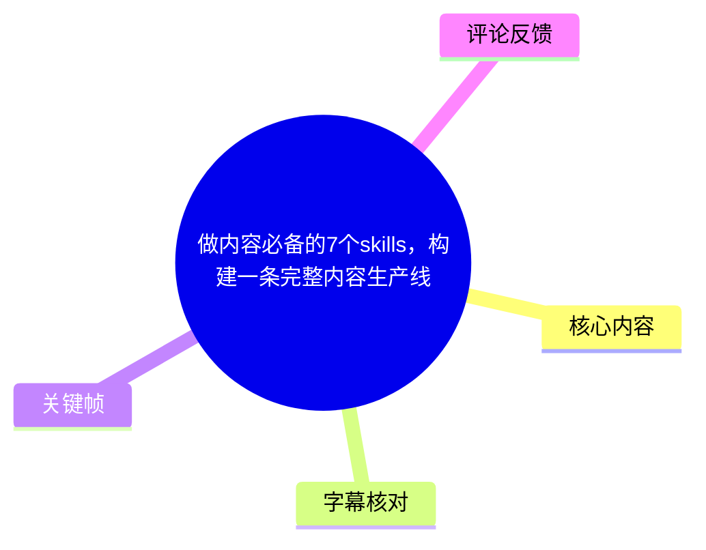
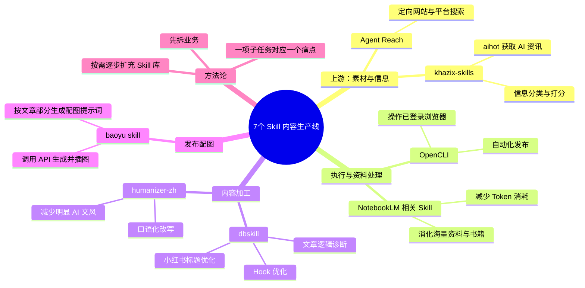
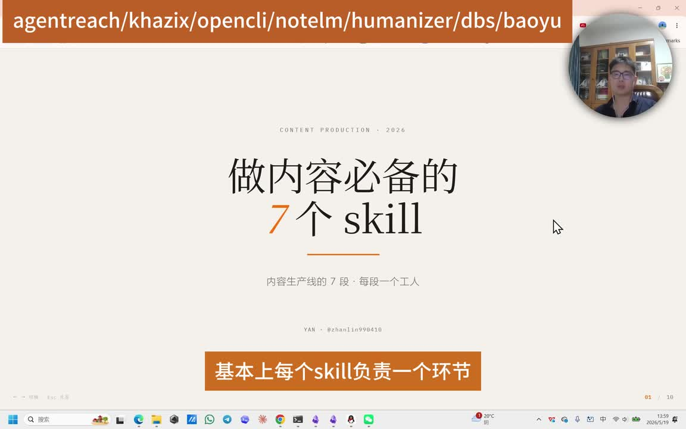
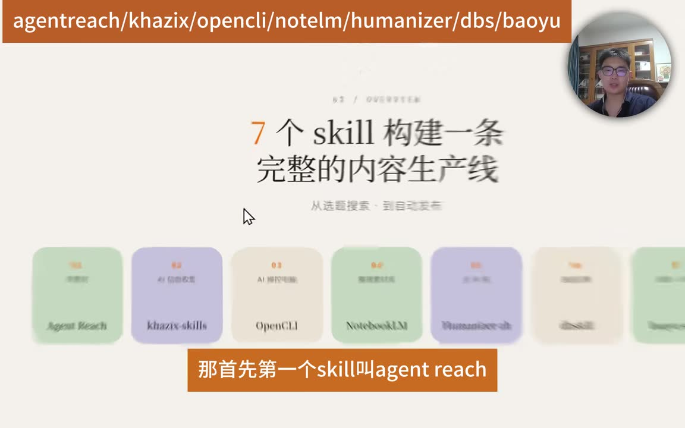
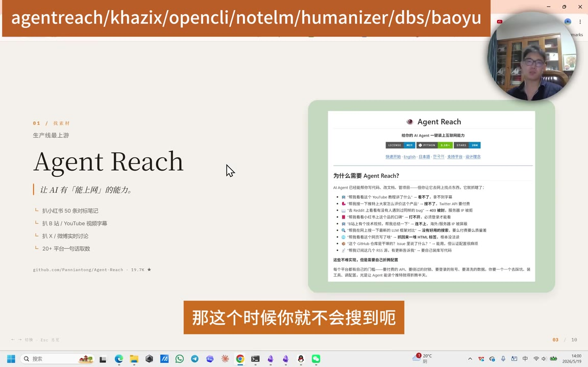
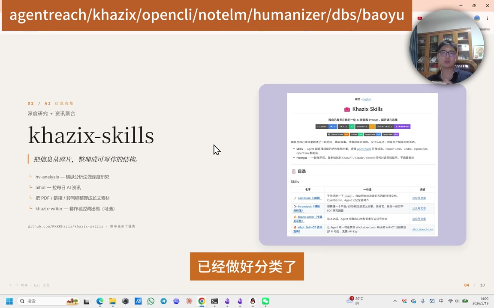

# 做内容必备的7个skills，构建一条完整内容生产线

> 来源：[Bilibili 视频](https://www.bilibili.com/video/BV1bMGr6wEmX)  
> UP 主：yan本人｜发布时间：2026-05-27｜视频时长：04:46  
> 标签：学习、生产线、内容

## 小结

视频提出一套由 7 个 Skill 组成的内容生产线：从找素材、收集 AI 信息、操作浏览器，到消化长资料、去除 AI 痕迹、诊断文章、生成配图并发布。作者的核心思路不是“收藏尽可能多的 Skill”，而是先把自己的业务拆成明确的子任务，再为每个痛点匹配一个工具。

七个被点名的 Skill 依次为：**Agent Reach、khazix-skills、OpenCLI、NotebookLM 相关 Skill、humanizer-zh、dbskill、baoyu skill**。它们分别覆盖信息检索、AI 资讯获取、浏览器操作与发布、资料库问答、口语化改写、内容诊断、图文配图生成等环节。

其中，Agent Reach 的定位是让 Agent 能进入更具体的平台和网站检索内容；khazix-skills 的 `aihot` 用于汇集并分类 AI 最新资讯；OpenCLI 用于模拟人工操作浏览器；NotebookLM 相关方案用于在大量资料或书籍中获取信息，并减少 Cloud Code 的 Token 消耗。

在写作后处理方面，humanizer-zh 被用于将明显的 AI 文风改得更口语化；dbskill 则包含开头 Hook、小红书标题和文章逻辑审查等能力。发布阶段的 baoyu skill 可根据文章结构生成多张配图的提示词，调用已配置的 API 生成图片，并将图片配入文章。

视频属于工具推荐与工作流经验分享，介绍的是作者对各 Skill 用途的判断，不等于对其效果、安全性、平台兼容性或账号风险的验证。尤其是浏览器自动化发布、第三方 API 调用、内容“去 AI 化”与图像生成质量，都需要在实际平台和个人工作流中自行测试。

## 思维导图





## 目录

- [生产线框架：让每个 Skill 负责一个环节](#生产线框架让每个-skill-负责一个环节)
- [上游检索：Agent Reach 与 khazix-skills](#上游检索agent-reach-与-khazix-skills)
- [执行与资料处理：OpenCLI、NotebookLM](#执行与资料处理openclinotebooklm)
- [内容加工：humanizer-zh 与 dbskill](#内容加工humanizer-zh-与-dbskill)
- [发布配图：baoyu skill](#发布配图baoyu-skill)
- [实践方法：按业务痛点搭建 Skill 库](#实践方法按业务痛点搭建-skill-库)
- [关键限制与时效性](#关键限制与时效性)
- [字幕比对](#字幕比对)
- [评论分析](#评论分析)
- [处理记录](#处理记录)

## [生产线框架：让每个 Skill 负责一个环节](https://www.bilibili.com/video/BV1bMGr6wEmX?t=29)

ASR 在 **00:00:29.480** 开始识别到正文。作者将 7 个 Skill 定位为一条内容生产线上的不同节点：从选题、写作，到审查与发布；使用者可让 Agent 承担自动化执行，而自己主要保留判断职责。

作者随后按流程将工作划分为以下环节：

1. 找素材；
2. 信息收集；
3. 操作电脑／浏览器；
4. 整理素材；
5. 去除或弱化 AI 文风；
6. 选题、标题或文章诊断；
7. 配图与发布。

这里的“完整生产线”是作者基于内容创作工作流给出的组织方式，并非表示只要安装 7 个 Skill 就能无人工参与地稳定完成所有平台发布。视频明确强调，人的职责仍是进行判断。



> 图：画面展示“做内容必备的 7 个 skill”以及“基本上每个 skill 负责一个环节”的总论。这是理解后文工具分工的总览关键帧。



> 图：画面列出 Agent Reach、khazix-skills、OpenCLI、NotebookLM、humanizer-zh、dbskill、baoyu 等名称，直观呈现作者所定义的 7 段式生产线。

## [上游检索：Agent Reach 与 khazix-skills](https://www.bilibili.com/video/BV1bMGr6wEmX?t=29)

### 1. Agent Reach：面向具体平台的素材搜索

作者首先推荐 **Agent Reach**。按其介绍，该 Skill 要解决的痛点是：Cloud Code 或 Codex 可能无法直接进入特定网站搜索网页／站内信息。

作者举例称，Agent Reach 可以操作浏览器，到小红书、YouTube 等平台检索与选题相关的具体信息。其预期价值是避免只得到百度等搜索引擎中相对泛化的结果，转而获取平台内更具体、更贴近选题的内容。

可将其理解为内容生产线最上游的“定向搜集”能力：

| 输入 | 处理 | 预期产出 |
| --- | --- | --- |
| 选题方向、关键词 | 进入指定平台或网站检索 | 与选题相关的平台内容、案例或讨论 |
| 泛化检索结果不足 | 访问更垂直的信息源 | 更具体的素材线索 |



> 图：画面将 Agent Reach 标为“找素材／生产线最上游”，并展示其项目页面。它有助于将该工具与“平台内检索”而非一般搜索混淆开。

### 2. khazix-skills：AI 资讯收集、分类与打分

作者第二个推荐的是 **khazix-skills**，并特别建议 AI 内容创作者使用。其中的 `aihot` 功能被描述为可搜索 AI 最新资讯。

视频还称，作者提到的该 Skill 已将收集的 AI 信息做好分类，例如区分：

- 官方发布的信息；
- LLM 相关的信息；
- 某家公司领导者发布的信息。

根据 ASR，视频称该 Skill 会对信息进行打分，因此作者将其视为 AI 类内容生产时较好的信息源。需要注意的是，视频没有提供具体的打分规则、数据源范围、更新频率或准确率，不能据此推断其资讯覆盖完整或评分客观。



> 图：画面将 khazix-skills 标为“AI 信息收集／深度研究 + 资讯聚合”，并展示 `aihot` 等目录信息，是理解其“分类资讯源”定位的直接视觉依据。

## [执行与资料处理：OpenCLI、NotebookLM](https://www.bilibili.com/video/BV1bMGr6wEmX?t=78)

### 3. OpenCLI：像人一样操作浏览器

从 **00:01:18.020** 起，作者介绍第三个 Skill：**OpenCLI**。其用途是像人一样操控浏览器，尤其可操作已经登录过账号的浏览器环境，例如已登录的小红书账号。

作者给出的使用方向是自动化发布内容。这个环节将内容工作流从“生成内容”延伸到“在平台执行操作”。

不过视频没有说明：

- OpenCLI 的具体安装方式与操作命令；
- 对登录凭据、Cookie 或本地浏览器配置的处理方式；
- 平台对自动化操作的规则与限制；
- 发布失败、误发、重复发或账号风控时的恢复机制。

因此，自动化发布应被视为需要人工审核的高风险环节。尤其是公开视频、品牌账号和多平台分发，提交前应确认标题、正文、图片、可见范围及目标账号。

### 4. NotebookLM 相关 Skill：海量资料的省 Token 处理方案

从 **00:01:42.180** 起，作者推荐 **NotebookLM** 及其与 Cloud Code 交互的相关 Skill。适用情境是：

- Cloud Code 的 Token 预算有限；
- 需要消化大量素材；
- 需要阅读或整理多本书；
- 希望从已上传资料中提取信息。

作者描述的流程是：

1. 将书籍或资料保存到 NotebookLM；
2. 使用 `notebook.lm.cloudcode.skill` 一类方案，让 Cloud Code 与 NotebookLM 对话；
3. Cloud Code 从 NotebookLM 获取资料中的信息；
4. 以此减少直接在 Cloud Code 中消耗的大量 Token。

作者将其称为“从大量数据提取信息”的省 Token 方法。这里的“一手、最精确的信息”是视频中的表述；实际准确性仍取决于资料是否完整、NotebookLM 的引用与检索表现、模型回答是否忠实于原文，以及使用者是否回查原始材料。

## [内容加工：humanizer-zh 与 dbskill](https://www.bilibili.com/video/BV1bMGr6wEmX?t=126)

### 5. humanizer-zh：口语化改写与“去 AI 化”

从 **00:02:06.400** 起，作者介绍第五个工具 **humanizer skill**；关键帧中的名称显示为 **humanizer-zh**。作者的判断是，当 Cloud Code 写出的内容过长且 AI 痕迹明显时，平台可能将其判定为低质量 AI 素材。

该 Skill 的定位是将文字作更口语化的改写，以弱化明显的机器生成感。需要区分两点：

- **视频中的功能主张**：该工具可进行口语化改写；
- **尚未被视频验证的结论**：改写后是否真正符合特定作者的个人语言风格、是否能够改善平台分发、是否能规避任何平台识别。

“去 AI 化”不应被理解为绕过平台规则的保证。内容作者仍应对事实准确性、引用合规性、表达风格和最终发布内容负责。

### 6. dbskill：商业诊断延伸到内容诊断

从 **00:02:30.400** 起，作者介绍由博主“don't be silent 聊赚钱的我”开发的 **db skill／dbskill**。作者称其主要帮助进行商业诊断，但其中也包含多个内容相关 Skill。

视频点名的能力包括：

| 子能力 | 视频中的用途 |
| --- | --- |
| `hook` | 优化内容开头 |
| 小红书 `title` | 优化小红书标题 |
| `dbs content` | 审查文章逻辑是否讲清、目标是否表达清楚 |

作者的建议顺序是：在完成“去 AI 味”的处理后，再使用诊断类 Skill 检查文章。其关注点不是单纯润色，而是内容是否存在清晰逻辑、是否传达了希望表达的目的。

这里也要注意，视频没有给出这些诊断 Skill 的评分标准、示例输入输出或适用文体。诊断结果可作为编辑反馈，而不应替代作者对事实、论证、目标受众和平台调性的人工判断。

## [发布配图：baoyu skill](https://www.bilibili.com/video/BV1bMGr6wEmX?t=198)

### 7. baoyu skill：从文章结构到配图生成与插入

从 **00:03:18.760** 起，作者进入最后的发布环节。其场景是：如果要在公众号等图文渠道发布内容，文章通常需要配图；若人工先总结文章，再打开 GPT 网页端逐张生成图片，步骤会比较复杂。

作者介绍的 **baoyu skill** 旨在将这一过程本地化和自动化。视频描述的操作链条为：

1. 在本地配置该 Skill；
2. 申请并配置 API；
3. 向 Cloud Code（ASR 误识为“扣扣”）说明文章内容与配图需求；
4. 例如要求“生成 5 个配图，每一个配图对应一个部分”；
5. Skill 为各部分生成配图提示词；
6. 通过 API 访问图像生成服务；
7. 将生成完成的图片配入文章。

可复用的需求表达结构如下。该格式是根据视频所述流程整理，不是视频提供的固定命令或配置语法：

```text
这是我的文章：<文章正文或文件路径>

请生成 5 张配图：
- 每张图分别对应文章的一个部分；
- 为每张图先生成配图提示词；
- 使用已配置的图像生成 API；
- 将生成结果按对应段落插入文章。
```

此方案的实际效果受 API 账户权限、模型能力、图片生成成本、网络可用性、提示词质量、插图格式和目标平台排版规则影响。视频没有展示 baoyu skill 的安装步骤、支持的图像模型、价格或图片质量对比。

## [实践方法：按业务痛点搭建 Skill 库](https://www.bilibili.com/video/BV1bMGr6wEmX?t=246)

从 **00:04:06.900** 起，作者总结出比“收集工具”更重要的方法：先理解自己的业务，再将业务拆成一个个子业务／子任务。

可按以下方式落地：

1. **明确交付目标**  
   例如，目标是完成一篇公众号图文、一条小红书内容，或一份 AI 行业资讯简报。

2. **拆分流程节点**  
   将工作拆为选题、素材搜集、资料阅读、初稿、改写、逻辑审核、配图、发布等步骤。

3. **为每个节点找出主要痛点**  
   例如：找不到垂直平台信息、长文档难消化、标题不够明确、配图制作耗时。

4. **按痛点选择对应 Skill**  
   每个 Skill 应服务一个明确的工作环节，而不是因为工具热门就加入工作流。

5. **先从少量工具开始验证**  
   作者不建议一次收集 30、40 个不同 Skill，而是建议先收集一点、逐步补充 Skill 库。

6. **保留人的判断与审核**  
   无论是选题、事实来源、口吻、自动化发布，还是图片是否适配上下文，最终都应人工确认。

作者的关键判断是：最终所需 Skill 的数量，可能接近于业务拆解出的子任务数量，而不取决于工具库中可收集的工具总数。其目标是简化动作和 Skill 组合，避免盲目堆叠。

## 关键限制与时效性

### 视频范围内未提供的信息

视频为概览介绍，未展示以下细节：

- 7 个 Skill 的仓库地址、安装命令、版本号与许可证；
- 各 Skill 对 Codex、Cloud Code、操作系统或浏览器环境的兼容性；
- Agent Reach、OpenCLI 的真实成功率、平台覆盖范围和登录状态要求；
- khazix-skills 的信息源、评分指标、更新机制；
- NotebookLM 资料上传限制、引用机制及隐私处理；
- humanizer-zh 的风格保持能力与改写质量；
- dbskill 的具体评估框架；
- baoyu skill 支持的 API、成本、图像模型、图片版权与风格控制能力。

### 风险与边界

- **自动发布风险**：OpenCLI 一类浏览器自动化能力可能触及平台规则、账号风控、误发或公关事故风险。重要账号更适合将自动化限制为“草稿准备”，由人完成发布前确认。
- **内容准确性风险**：检索、NotebookLM 问答、AI 改写和内容诊断均可能遗漏上下文或产生不准确表述，尤其涉及新闻、数据、专业知识时应核查原始来源。
- **风格与合规风险**：“去 AI 化”不能替代真实编辑，也不能保证内容符合平台质量规范。
- **API 与隐私风险**：向第三方模型或图像 API 上传文章、资料、账号关联信息前，应确认数据权限、隐私政策与成本。
- **时效性**：视频发布于 2026-05-27。AI 工具、仓库名称、API 接口、平台自动化策略与账号规则都可能在发布后变化；使用前应以项目官方说明和目标平台现行规则为准。

## 字幕比对

| 字幕来源 | 完整性 | 专有名词 | 时间轴 | 主要问题 |
| --- | --- | --- | --- | --- |
| Bilibili 站内字幕 `p01-ai-zh.srt` | 与本视频内容不匹配 | 不适用 | 有真实分段时间，但仅至约 02:59 | 内容为“帕尼尼减肥法”挑战，与本视频的 7 个内容生产 Skill 完全无关 |
| 本次 ASR（medium） | 覆盖约 89.6% 语音，识别区间为 00:00:29.480–00:04:45.040 | 多处英文工具名存在误识别 | 有时间戳，且与视频时长基本对应 | 首段异常短；`Cloud Code`、工具名及部分词汇有误识别、连写或音译错误 |

### 字幕选择与校正

本次处理**检查了站内字幕与 ASR**。站内字幕虽具备时间轴，但内容明显属于另一支“帕尼尼减肥法”视频，不能作为本视频知识整理的事实依据。ASR 检测结果未标记 `noAudioStream=true`，且诊断显示音频语言为中文、语音覆盖率约为 0.896，因此源视频存在音轨；本整理以本次 ASR 的时间段为时间轴主依据。

结合 ASR 上下文和关键帧画面，对以下明显误识别作谨慎校正：

| ASR 片段 | 正文采用写法 | 校正依据 |
| --- | --- | --- |
| `agent rich` / `agentrich` | Agent Reach | 关键帧顶部工具列表与工具页标题 |
| `卡兹克老师的skill` | khazix-skills | 关键帧明确显示 `khazix-skills` |
| `OpenCLI` | OpenCLI | ASR 前后语义与关键帧工具列表一致 |
| `notebook.lm.cloudcode.skill` | NotebookLM 相关 Skill | ASR 原文保留该描述；未擅自补充具体项目名称 |
| `homainizer` | humanizer-zh | 关键帧工具列表显示 `humanizer-zh` |
| `db skill` / `dbs content` | dbskill / `dbs content` | 依据 ASR 的上下文表述；未验证其官方命名格式 |
| `保育 skill` | baoyu skill | 关键帧工具列表显示 `baoyu` |
| `扣扣` | Cloud Code | 前文持续讨论 Cloud Code，语义上为同一工具环境 |

由于未提供逐帧对应的完整画面转写，以上校正仅限于关键帧中可见的名称和 ASR 上下文，不扩展为对工具能力、作者身份或项目地址的外部验证。

## 评论分析

以下仅处理可获取的热评前三条；评论内容代表评论者个人使用体验或请求，不作为已验证事实。

### 1. 一只纯白糖（57 赞）

该评论按 7 个 Skill 逐项补充了个人判断：

- 认为 Agent Reach 有助于拆解爆款；
- 正在使用 khazix-skills，并高度认可其 AI 资讯获取能力；
- 对 OpenCLI 的实用性持保留意见，担心封号、错误上传和公关事故，认为视频发布更适合人工操作；
- 将 NotebookLM 理解为省 Token 的素材库，但认为额外收益有限；
- 质疑 humanizer-zh 是否能真正符合个人语言风格，并分享自己会用“AI 初稿后语音转文字重说一遍”的修改方式；
- 高度认可 dbskill；
- 认为 baoyu skill 适合图文创作，但对图片质量与风格能否定制尚无结论。

这条评论的价值在于提出了视频未展开的实际问题：平台自动化风险、个人风格保持、配图质量与可定制性。不过这些仍是单一用户观点，未附带测试数据或官方规则依据。

### 2. thewham（2 赞）

评论内容为“@mysakuravia BV1bMGr6wEmX”，属于将视频转发或提醒另一位用户观看的简短互动，没有提供对工具效果、使用步骤或风险的实质补充。

### 3. 你眼前的遗憾（2 赞）

评论请求“帮我整理一下这个视频内容，发到我的邮箱”。这反映出观众对视频信息整理与二次分发的需求，但评论没有提供邮箱地址、工具评价或可验证的实践经验。出于隐私与权限边界，不应将此类评论视为授权进行邮件发送。

## 处理记录

- Worker ID：`worker-mrj0wbly-5dc4e50c`
- 模型：`gpt-5.6-terra`
- ASR 模型与运行信息：`medium`，中文识别，CUDA / `float16`；语音识别区间为 00:00:29.480–00:04:45.040，覆盖率约 89.6%。
- 使用的素材工具结果：已使用任务提供的视频元数据、ASR 时间轴字幕、站内 SRT、关键帧路径、热评 JSON 与封面／帧素材清单；未调用未提供的外部网页、仓库或 API 信息。
- 字幕选择：站内字幕与视频内容不符，未采用；以本次 ASR 为时间轴主体，并依据关键帧可见文字校正少量工具专名。
- 关键帧选择依据：选择 `frame-001.jpg`、`frame-002.jpg`、`frame-003.jpg`、`frame-004.jpg`，因为它们分别呈现总主题、7 工具总览、Agent Reach 页面与 khazix-skills 页面，可直接支撑正文中的工具名称和流程定位。
- 评论范围：仅分析了可获取热评前三条，未扩展至其他评论。
- 缓存清理：素材未提供缓存清理执行结果；为避免编造，不声明已完成清理。
- 未解决问题：各 Skill 的官方仓库、具体安装配置、版本、费用、授权方式、平台兼容性、自动发布合规性及生成质量，均未在提供素材中得到验证。
