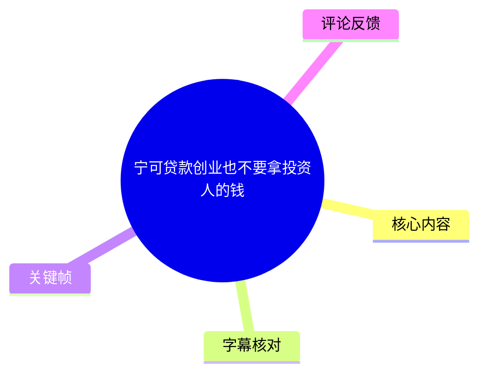
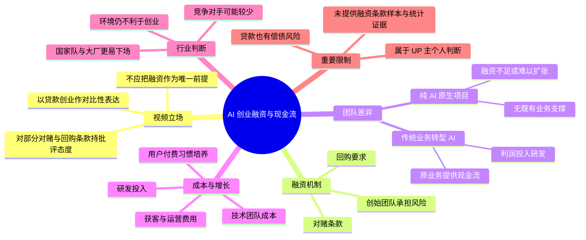

# 宁可贷款创业也不要拿投资人的钱

> 来源：[Bilibili 视频](https://www.bilibili.com/video/BV1x6uc6TETC)  
> UP 主：AI编程布道者-金角大王｜发布时间：2026-08-04｜视频时长：02:16  
> 标签：人工智能、创业、AI、AI 创业、投资

## 小结

视频以鲜明且带有强烈个人立场的方式讨论中国 AI 创业融资。UP 主的核心判断是：部分投资交易中的回购、对赌及高收益要求，会使经营风险过度集中于创始团队；因此，创业者不应把“拿融资”当作项目成立的前提，而应优先建立可自我供血的现金流。

UP 主把自身描述为“传统企业转型做 AI”的团队：原有业务每月提供现金流，团队能用利润投入 AI 研发，因而在没有外部融资时仍可推进。他认为，这类已有基本盘的团队在当前环境中相对更有韧性。

与之相对，视频特别指出纯 AI 原生项目的资金困境：即使产品可用，仍要承担技术团队、研发、获客、运营以及用户付费习惯培养的成本；如果项目没有既有业务支撑，又难以获得融资，就可能在规模化之前耗尽资金。

视频提出的“宁可贷款创业”是立场化表达，并非经过测算后的普遍财务建议。贷款同样存在利息、本息偿还、个人或企业担保及现金流断裂风险；融资条款、投资人类型、项目质量与行业周期也存在显著差异，不能据此推导为“所有投资均不适合创业者”。

内容主要适合正在评估 AI 项目商业化、融资依赖度与现金流安排的创业者阅读。视频发布于 2026 年 8 月，涉及中国与美国融资环境、AI 投资格局的说法均是 UP 主当时的观察，未在视频中给出数据来源或案例样本，应视作观点而非行业统计结论。

## 思维导图

## 目录

- [背景：视频主张与讨论边界](#背景视频主张与讨论边界)
- [融资条款批评：回购、对赌与风险归属](#融资条款批评回购对赌与风险归属)
- [融资并非前提：先建立自主现金流](#融资并非前提先建立自主现金流)
- [两类 AI 团队：转型企业与纯原生项目](#两类-ai-团队转型企业与纯原生项目)
- [成本—增长矛盾：为何产品上线后仍可能缺钱](#成本增长矛盾为何产品上线后仍可能缺钱)
- [行业判断：融资门槛与 AI 竞争格局](#行业判断融资门槛与-ai-竞争格局)
- [可执行的资金规划框架](#可执行的资金规划框架)
- [结论、限制与时效性](#结论限制与时效性)
- [字幕比对](#字幕比对)
- [评论分析](#评论分析)
- [处理记录](#处理记录)

## 背景：视频主张与讨论边界 [00:00:28](https://www.bilibili.com/video/BV1x6uc6TETC?t=28)

视频为竖屏口播形式。ASR 检测到有效语音从 **00:00:28.160** 开始，到 **00:02:15.040** 结束；前约 28 秒没有被 ASR 识别为语音内容。画面标题直接给出视频论点：“宁可贷款创业，也不要拿投资人的钱”。

需要先明确视频的论述性质：

1. **这是经验判断与价值判断，不是融资法律或财务建议。**  
   UP 主以“中国的投资人”“中国投资生态”等概括性措辞表达批评，但没有展示具体协议、机构名称、样本数量、投资阶段或行业数据。

2. **视频谈论的重点是风险分配，而不只是融资金额。**  
   UP 主关心的是投资后是否附带回购、对赌等安排，以及创业失败时创始团队可能承担的后果。

3. **“贷款”仅是用来强化对比的说法。**  
   视频没有讲解贷款产品、利率、期限、担保、还款来源或债务违约处理，因此不能将标题理解为具体融资操作方案。

> 图：画面展示视频标题“宁可贷款创业 也不要拿投资人的钱”及 UP 主口播场景；它直接说明本视频讨论的是创业资金来源与投资条款，而非 AI 技术教程。

## 融资条款批评：回购、对赌与风险归属 [00:00:28](https://www.bilibili.com/video/BV1x6uc6TETC?t=28)

UP 主在 **00:00:28.160—00:00:52.960** 的发言中，批评其所理解的部分中国投资交易结构。他描述的逻辑是：

- 投资人投入资金后，创业团队可能需要签署**对赌条款**；
- 如果企业在若干年内未上市或未完成某项业绩，创始方可能被要求**回购**；
- 这类回购可能附带较高的年化要求。ASR 中出现“百分之十二起步再加四个点”的说法，但该句识别存在明显口误、断词和同音错误，无法仅凭 ASR 确认其准确计算口径；
- UP 主据此认为，风险没有由投资方和创始团队合理分担，而是过多落到了创始团队身上。

他还将此类安排类比为“高利贷”，并使用“无限连带”等强烈措辞。这些属于 UP 主的评价，**不是本整理对所有投资协议的定性**。

### 视频中提到的概念

| 概念 | 视频中的使用方式 | 阅读时应注意 |
| --- | --- | --- |
| 对赌条款 | UP 主将其描述为未达上市或业绩目标时的约束 | 具体条款可能涉及业绩、估值、股权、现金补偿或其他安排，不能只凭名称判断风险。 |
| 回购 | 被描述为创业团队在特定条件下回购投资方权益 | 回购义务主体、触发条件、利率/溢价、执行条件均会影响风险。 |
| “12% 起步再加 4 个点” | ASR 中出现的口头参数 | 原始识别语义不完整，视频未给出合同样本，不能将其视为普遍市场标准。 |
| 风险归属 | 视频最核心的问题意识 | 应区分公司责任、股东责任、个人担保、连带责任与可执行性。 |

> 图：画面中的内嵌字幕出现“然后你要签对赌条款”，对应本段对融资附加条件的讨论。该图有助于将 ASR 的长句切分回“投资—对赌—回购”的论证链条。

### 与美国天使投资的对照

UP 主接着以美国为对照，称相对宽松的做法是：项目被看好后，投资人可投入“天使轮几十万美金”，让创业者先尝试，而不要求回购或对赌。

这一段的可保留信息是：**UP 主强调早期风险投资应允许项目试错，且不宜把所有下行风险转嫁给创始人。**  
但“美国人家相对宽松”仍是高度概括的比较。美国不同州、基金、融资工具（股权、SAFE、可转债等）及创始人谈判地位不同，视频未提供可核验样本，不能据此作全面制度比较。

> 图：内嵌字幕出现“几十万美金类似这种”，对应 UP 主对美国天使轮早期试错资金的举例。它可辅助确认该数字是口播举例，而非一份完整市场报告。

## 融资并非前提：先建立自主现金流 [00:00:52](https://www.bilibili.com/video/BV1x6uc6TETC?t=52)

在 **00:00:28.900—00:00:52.960**，UP 主提出直接建议：在中国创业“不应指望投资”，应依靠自己的钱；若项目从一开始就以拿投资为目标，可能“大概率完蛋”。

这段表述不能机械理解为“永不融资”。结合后文，UP 主实际表达的层次更接近：

- 团队可以寻求融资，UP 主也说“当然要融”；
- 但融资应当是**可选加速器**，而不是项目活下去的唯一前提；
- 团队应优先确保有自主资金来源，至少能在融资不确定时持续研发和验证产品；
- 当创业者完全依赖融资才能启动、获客和维持团队时，议价能力与生存能力都会更弱。

### 可迁移经验：把融资计划改成“多情景现金流计划”

视频没有提供表格或公式，但其论点可转化为以下资金规划问题：

1. **无融资情景**：不融资时，团队可支撑多久？哪些研发、人员和推广开支必须保留？
2. **融资延迟情景**：若融资比预期晚 3—6 个月，是否仍能完成最小可验证产品并维持核心团队？
3. **融资成功情景**：融资资金具体用于缩短哪一段瓶颈——研发、获客、交付还是规模化？
4. **债务情景**：若使用贷款，稳定经营现金流能否覆盖本息，而不依赖未来不确定收入？

其中第 4 点是对标题的必要补充：债务并不会消除风险，而是把风险转化为明确的偿债义务。没有稳定还款来源时，贷款可能比股权融资更快造成现金流压力。

> 图：画面内嵌字幕为“你一开始就大概率完蛋了”，体现 UP 主对“以融资为唯一目标”的强烈警示。该画面应按观点性内容理解，而非概率预测。

## 两类 AI 团队：转型企业与纯原生项目 [00:00:52](https://www.bilibili.com/video/BV1x6uc6TETC?t=52)

UP 主在 **00:00:52.960—00:01:17.140** 将 AI 创业团队分为两类，并以此解释融资约束为何不均等。

### 1. 传统企业转型做 AI

UP 主以自身团队为例，称其原有传统业务每月能产生现金流，因此能够从利润中拿钱研发 AI。他的结论是：即使没有融资，团队仍然可以继续推进。

这类团队的优势在于：

- 有既有业务和收入基础；
- AI 研发可以由经营利润或存量资源支持；
- 不必在产品尚未成熟时完全依赖外部资本；
- 在融资环境收紧时，持续性相对更强。

但视频未说明其传统业务的规模、利润率、AI 研发占比或真实投入周期，因此不能据此推断所有转型企业均具备相同能力。

### 2. 纯 AI 原生项目

UP 主认为，纯 AI 原生项目没有原有业务支撑，一旦拿不到融资，“就死悄悄了”。其理由包括：

- 即便应用已经做出来，用户付费习惯仍需时间建立；
- 扩张需要资金；
- 产品达到规模化收入之前，团队仍要承担持续成本；
- 纯 AI 项目往往没有其他业务利润补贴研发与运营。

这组分析指出了一个重要区别：**产品可上线，不等于商业闭环已建立；商业闭环未建立，也不等于团队没有支出。**

## 成本—增长矛盾：为何产品上线后仍可能缺钱 [00:01:17](https://www.bilibili.com/video/BV1x6uc6TETC?t=77)

在 **00:01:17.140—00:01:41.320**，UP 主以正在做的 AI 编程平台为例，说明从研发到回本之间的资金缺口。

### 视频提到的成本与规模参数

| 项目 | 视频口述 | 信息性质与限制 |
| --- | --- | --- |
| 技术团队“收购成本” | “大几百万上千万” | ASR 识别为“收购成本”，语义可能实际指团队成本或获客成本，原视频未提供文字稿，无法确定，应保留不确定性。 |
| 研发投入 | 研发数月，花费“一两百万” | 口播案例级估算，未说明币种、团队规模、是否含模型调用/云资源/工资。 |
| 回本所需用户 | “可能积累到几十万的用户” | 是 UP 主的商业化判断；未给出客单价、留存、毛利率、付费率或回本公式。 |
| 增长费用 | 运营、广告仍有费用 | 指出获客和运营是持续成本，但未量化。 |

视频所描述的因果链是：

> 研发投入 → 产品上线 → 用户需要时间形成付费习惯 → 需要继续投入获客和运营 → 达到足以回收研发成本的用户规模前，资金可能已耗尽。

UP 主进一步以“带着两天的干粮走十天的路”比喻纯 AI 原生创业：如果团队必须用极短的资金续航证明长期才能实现的目标，才有机会拿到融资，那么这个融资门槛对绝大多数项目而言可能不可完成。

这里有两项实用提醒：

- **不要只估研发预算。** 应同时计算上线后的模型/算力、交付、客服、渠道、市场、运营及合规等持续成本。
- **不要只用注册用户估算回本。** 需要至少补齐付费率、客单价、续费/留存、毛利、获客成本与回款周期；视频未提供这些参数。

## 行业判断：融资门槛与 AI 竞争格局 [00:01:41](https://www.bilibili.com/video/BV1x6uc6TETC?t=101)

在 **00:01:41.320—00:02:15.040**，UP 主将前述问题延展为行业层面的判断。

### “两天干粮走十天路”的融资门槛

UP 主认为，纯 AI 原生团队需要在极短的资源期限内，证明自己能够到达原本需更长时间才能到达的位置，才可能拿到融资；他判断这对“绝大部分”创业者来说是不可能完成的任务。

他因此再次批评部分投资机构，并认为这种环境不利于创业与创新。这是视频的价值判断，未给出融资成功率、机构条款或项目失败率等证据。

### 对竞争格局的双面判断

UP 主同时提出一个看似矛盾、但逻辑上相连的观察：

- 因为多数团队难以获得资金，纯 AI 创业的竞争者可能更少，市场“不卷”；
- 但融资紧张并不意味着环境健康，反而可能抑制创新与创业；
- 对拥有现金流的团队而言，竞争减少可能是相对优势；
- 对没有存量业务的新团队而言，这意味着进入门槛更高。

### 中美 AI 竞争的口播结论

在最后约 10 秒，UP 主称中美 AI 竞争中主要是“国家队和大厂”在下场，国家队会投自己看好的项目，市面上似乎只有少数做基础模型的公司能拿到投资，其他公司几乎拿不到。

这段结论需要严格限定：

- 它是 UP 主在视频发布时的概括性观察；
- “国家队”“大厂”“做基模的公司”在视频中都没有被明确定义；
- 没有列举公司、融资轮次、金额、地域或统计范围；
- 因而它可以作为理解 UP 主融资悲观预期的背景，不能作为 AI 投资市场全貌的事实陈述。

## 可执行的资金规划框架 [00:00:52](https://www.bilibili.com/video/BV1x6uc6TETC?t=52)

视频没有提供具体命令、工具或操作教程。以下框架是依据其“现金流优先、融资非唯一前提”的观点整理出的实践清单，不是视频中已验证的标准答案。

### 第一步：识别项目属于哪种资金结构

- **存量业务转型型**：是否有可持续的既有收入，且利润可投入 AI 研发？
- **纯原生型**：是否完全依赖外部融资或创始人自有资金？
- **混合型**：能否先通过咨询、交付、垂直解决方案或服务收入，部分覆盖产品研发成本？

重点不是给项目贴标签，而是明确：**没有下一笔融资时，谁为下一个研发周期付钱。**

### 第二步：拆分“上线前”与“上线后”预算

| 阶段 | 需要单独核算的内容 |
| --- | --- |
| 上线前 | 人员、研发、模型调用与算力、数据、基础设施、测试、合规准备。 |
| 上线后 | 继续研发、云资源、技术支持、客户交付、运营、渠道、广告与销售。 |
| 回款阶段 | 用户付费转化、回款周期、退款、续费、坏账与税费。 |

UP 主的案例提醒：产品研发完成并不意味着投入结束，反而可能进入获客、运营和规模化服务支出更集中的阶段。

### 第三步：在签约前核查融资与债务的下行责任

无论选择股权融资还是贷款，都应在专业法律、财务人士协助下，逐项确认：

- 是否存在业绩承诺、上市期限、回购触发条件；
- 回购责任由公司、创始股东还是个人承担；
- 是否存在个人担保、连带责任或其他增信安排；
- 股权稀释、清算优先权、控制权与退出权如何约定；
- 若使用贷款，本息偿还是否能由已实现的经营现金流覆盖；
- 在收入低于预期时，团队能砍掉哪些成本、保留哪些核心能力。

这也是对视频标题最重要的校正：**“不拿投资”不自动等于低风险，“贷款”也不等于安全；真正应比较的是不同资金工具在最差情景下的现金流与责任边界。**

## 结论、限制与时效性 [00:02:05](https://www.bilibili.com/video/BV1x6uc6TETC?t=125)

视频最有价值的提醒，是要求创业者把“生存能力”前置于“融资故事”：

1. 建立自主现金流，能提高团队在融资不确定期的续航能力；
2. 纯 AI 原生项目需要为研发后的增长与商业化周期预留资源；
3. 融资时不能只看到账金额，更要理解对赌、回购、责任主体和下行情景；
4. 现金流企业在行业收缩期可能拥有更强韧性，但也不代表其 AI 转型一定成功。

同时，视频存在以下限制：

- 大量结论是强烈的个人经验判断，缺少合同、数据、案例及统计支撑；
- ASR 质量在术语和数字处存在错误，部分金额或成本名称不能精确复原；
- 没有覆盖融资工具的完整差异，例如股权融资、可转债、SAFE、银行贷款、政策资金及产业投资的适用条件；
- 没有解释贷款的利率、抵押、担保、期限和违约风险；
- 有关中美融资生态和 AI 投资主体的判断具有时效性，受政策、市场周期、模型成本、资本偏好及项目质量变化影响。

因此，适合将这条视频作为一个问题意识：**不要让公司只能靠下一轮融资存活。** 至于采用融资、贷款还是自有资金，仍需结合项目现金流、合同条款、股东责任和专业意见逐案决策。

## 字幕比对 [00:00:28](https://www.bilibili.com/video/BV1x6uc6TETC?t=28)

| 字幕来源 | 完整性 | 专有名词/数字 | 时间轴 | 主要问题 |
| --- | --- | --- | --- | --- |
| Bilibili 站内字幕 | 未提供可用站内字幕 | 无法核对 | 无法使用 | 素材明确标注“未提供可用站内字幕”。 |
| 本次 ASR 字幕 | 覆盖 00:00:28.160—00:02:15.040，语音覆盖率 79.09% | 对“投赠生态”“高利贷生怀”“江泰公钓鱼院者上钩”“收购成本”等存在明显误识别；数字上下文也不完整 | 有时间戳，但 6 个分段过长且首段仅 0.74 秒却包含大量文字，分段质量异常 | 缺少标点、断句不可靠，存在同音字、词语粘连和中英文混杂。 |

### 最终字幕选择

本整理**检查并采用本次 ASR 的时间戳作为章节定位依据**，因为没有可用的 Bilibili 站内字幕；同时不把 ASR 的错误词形当作事实。ASR 诊断显示：

- 识别模型：`large-v3-turbo`
- 识别语言：中文，语言置信度 `0.998046875`
- 音频时长：`135.140125` 秒
- 语音起点：`28.16` 秒
- 语音终点：`135.04` 秒
- `noAudioStream=true` **未出现**；素材也提供了 `audio/audio.wav`，因此本视频存在可处理的音轨，不属于“无音轨”情形。

### 结合画面进行的谨慎校正

以下校正仅用于提升可读性，并保留不确定性：

- ASR 的“投赠生态”按上下文整理为“投资生态”；
- “江泰公钓鱼院者上钩”疑为常见成语“姜太公钓鱼，愿者上钩”，但该处不影响主要论点，因此正文未将其作为关键事实展开；
- “技术团队的收购成本”语义异常，可能是“技术团队的……成本”或其他词，未擅自确定；
- “百分之十二起步再加四个点”保留为 ASR 中出现的模糊口述，不转化为精确融资费率；
- 关键帧中可见的内嵌中文字幕，如“然后你要签对赌条款”“几十万美金类似这种”“你一开始就大概率完蛋了”，用于辅助确认对应论述主题。

## 评论分析 [00:02:15](https://www.bilibili.com/video/BV1x6uc6TETC?t=135)

本次仅获取到 2 条热评，低于“前三条”的上限；以下仅分析可获取内容，不将评论观点视为已验证事实。

### 1. 祈燚风（获赞 2）

> “好的项目人家抢着要。垃圾项目人家都是高要求 不能亏。投资也不是做慈善啊 不赚钱啊？”

- **观点概括**：评论者反驳视频对投资人的整体批评，认为项目质量决定融资条件；投资人追求收益并非慈善行为。
- **补充价值**：指出了视频较少讨论的变量——优质项目的竞争性、创始团队的议价权、不同项目对应不同条款。
- **争议与可信度**：该观点具有常识层面的合理性，但“好的”“垃圾”的标准、条款差异与市场实际分布均未给出证据，不能据此否定或证实视频所说的高约束条款现象。

### 2. 尐罗（获赞 2）

> “好的项目才会吸引好的融资[doge]”

- **观点概括**：评论者以简短方式强调项目质量与融资质量之间的关系。
- **补充价值**：提示创业者不能只从投资方视角解释融资困难，也应评估产品、市场、团队、增长与商业化质量。
- **争议与可信度**：评论没有定义“好项目”或“好融资”，也未说明如何评估，属于立场表达而非可验证论据。

### 评论整体观察

两条可获取热评都没有直接讨论贷款风险，而是将讨论重心放在“项目质量与融资条件是否匹配”。这构成对视频单向批评投资环境的一种补充：融资谈判中的风险分配，通常同时受项目质量、市场供需、创始人议价能力、融资阶段及合同结构影响。

## 评论分析

- 热评 1：好的项目人家抢着要。垃圾项目人家都是高要求 不能亏。投资也不是做慈善啊 不赚钱啊？
- 热评 2：好的项目才会吸引好的融资[doge]

以上内容是观众反馈摘录，只用于补充理解视频反响，不作为正文事实依据。

## 处理记录

- Worker ID：`worker-mrj0wjed-b0c290ad`
- 模型：`gpt-5.6-terra`
- 调用工具与模型：素材编排环境提供的视频元数据、关键帧、ASR 结果、ASR SRT、评论数据；语音识别模型为 `large-v3-turbo`
- 使用的应用工具：音频提取 `audio/audio.wav`、ASR 结果 `asr/asr-result.json`、时间轴字幕 `asr/transcript.srt`、关键帧目录 `frames/`、评论文件 `comments/comments.json`
- 字幕选择：站内字幕未提供可用版本；已检查本次 ASR，采用其真实起止时间定位章节，并对明显识别错误保持不确定性说明
- 关键帧选择依据：选用 `frames/frame-001.jpg` 至 `frames/frame-004.jpg`，画面分别呈现视频标题以及“对赌条款”“几十万美金”“一开始就大概率完蛋”等与正文关键论点直接对应的内嵌字幕；图片作为主题和口播语义辅助，不用于编造未出现的数据
- 评论处理：素材中仅获取到 2 条热评，已按“至多前三条”规则全部分析
- 缓存清理：未提供缓存清理执行日志；本整理未声明或推断已完成缓存删除
- 未解决问题：ASR 的术语、数字与成本名称存在误识别；无站内字幕或逐字人工转写可供复核；视频对融资条款及市场格局未提供原始协议、样本或统计数据。
