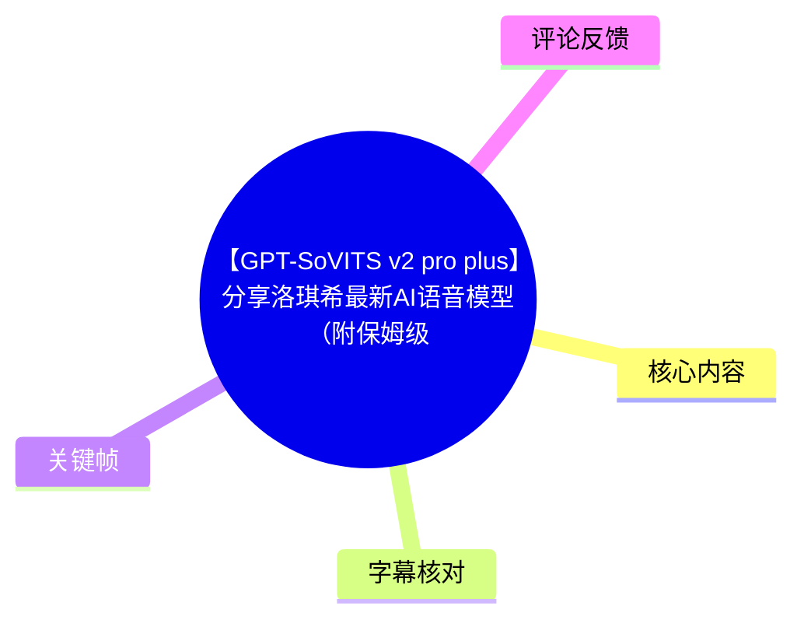
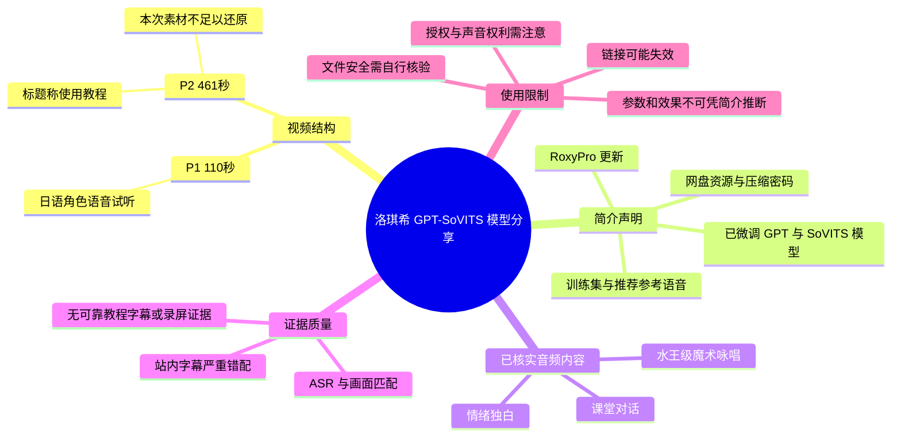
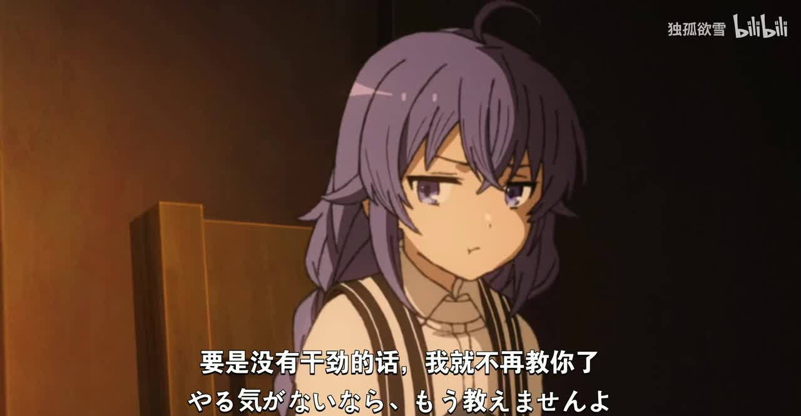

# 【GPT-SoVITS v2 pro plus】分享洛琪希最新AI语音模型（附保姆级使用教程）

> 来源：[Bilibili 视频](https://www.bilibili.com/video/BV1HfF6zNEK8)  
> UP 主：独孤欲雪｜总时长：571 秒（分为 2 P）｜数据抓取时间：2026-07-16  
> **重要素材提示**：本次可用音频仅覆盖 P1 的约 109 秒；P2 标称时长 461 秒，但未获得与教程内容相符的音频、画面关键帧或可靠字幕。因此，不能据标题或简介虚构“保姆级使用教程”的具体操作步骤。

## 小结

该视频在元数据中被定位为 GPT-SoVITS 的洛琪希（Roxy）AI 声音模型分享：简介称资源内含已微调的 GPT 模型、SoVITS 模型、训练集，以及推荐参考语音；第 2 P 的标题为“洛琪希模型使用保姆级教程”。简介还称模型曾更新为 **RoxyPro**，其目标是以“甄选语音集”提高音色稳定度。

但本次实际提取到的音频只对应第 1 P（标称 110 秒）。ASR 识别结果为日语角色台词，内容包括课堂对话、施法咏唱及情绪化独白，呈现的是洛琪希相关角色语音样本，而非软件界面讲解或模型部署过程。由此可确认 P1 的主要价值是**展示/试听目标声线素材**，而不能从中推出训练参数、推理配置或操作流程。

简介提供了两个网盘渠道，并明确写有分卷压缩、解压密码等信息；这属于发布者给出的资源获取说明，不等于资源仍有效、安全或可合法再分发。使用者应自行核验链接、文件来源、模型许可、配音演员与作品素材的授权范围。

站内字幕 `p02-ai-zh.srt` 与视频主题及实际音频完全不一致：其内容讲述新疆和田沙漠植物工厂水稻栽培，且总长仅约 132 秒，与 P2 标称 461 秒也不匹配。因此本站字幕不能作为本视频知识内容的依据。最终以与音频相符、时间轴完整的本次日语 ASR 作为 P1 事实记录依据。

视频标题和简介中的时间信息存在需要留意的时效问题：平台发布时间戳对应 2026-02-06，而简介写有“2026.4.26 更新全新模型 RoxyPro”以及“7 月 14 日补档”。这意味着简介可能在原投稿后被更新；文中资源状态、模型版本和下载可用性均应以访问当日为准。

## 思维导图

## 目录

- [视频定位与素材范围](#视频定位与素材范围)
- [P1：洛琪希日语语音样本](#p1洛琪希日语语音样本)
- [简介中的模型与资源信息](#简介中的模型与资源信息)
- [P2 教程：可确认内容与证据边界](#p2-教程可确认内容与证据边界)
- [可执行的核验与使用建议](#可执行的核验与使用建议)
- [关键帧](#关键帧)
- [结论与限制](#结论与限制)
- [字幕比对](#字幕比对)
- [评论分析](#评论分析)
- [处理记录](#处理记录)

## [视频定位与素材范围](https://www.bilibili.com/video/BV1HfF6zNEK8?t=1)

平台元数据将全片拆为两个分 P：

| 分 P | 标题 | 标称时长 | 本次可用证据 | 可得结论 |
| --- | --- | ---: | --- | --- |
| P1 | 【GPT-SoVITS v2 pro plus】分享洛琪希最新AI语音模型 | 110 秒 | 109.32 秒音频、日语 ASR、2 张动漫关键帧 | 可记录为洛琪希角色声线的日语试听片段。 |
| P2 | 洛琪希模型使用保姆级教程 | 461 秒 | 一份严重错配的站内字幕；无对应音频和教程画面 | 仅能确认其标题声称存在教程，不能还原任何实际步骤。 |

本次 ASR 的首段语音起于 [00:00:00.980](https://www.bilibili.com/video/BV1HfF6zNEK8?t=1)，最后一段结束于 [00:01:48.280](https://www.bilibili.com/video/BV1HfF6zNEK8?t=108)，与 P1 的 110 秒标称时长基本吻合。识别诊断显示语音覆盖约 86.82 秒、覆盖率约 79.42%，中间没有超过阈值的大间隔。

这说明源文件并非无音轨；相反，已提取音轨且语音识别正常完成。问题在于素材链路只提供了 P1 对应音频，未提供 P2 的有效音视频证据。

## [P1：洛琪希日语语音样本](https://www.bilibili.com/video/BV1HfF6zNEK8?t=1)

### [课堂场景中的对话与训诫](https://www.bilibili.com/video/BV1HfF6zNEK8?t=1)

P1 开头是日语角色对话。ASR 可辨识出角色先询问对方一直在看哪里，对方回答在听授课内容；随后角色表示“不要那样盯着看”，担心分心并念错咒文或课程内容。

在 [00:00:14.360](https://www.bilibili.com/video/BV1HfF6zNEK8?t=14) 至 [00:00:25.900](https://www.bilibili.com/video/BV1HfF6zNEK8?t=25) 的段落中，角色以教师/指导者口吻责备对方偷懒，并表示如果没有干劲就不再教导。这一段可用作模型目标声线的样本特征观察：

- 声线以日语女性角色音为主；
- 情绪起点偏严肃、带轻微责备；
- 语句中存在短停顿、反问和语气加强；
- 不应把这段原始角色台词直接等同于模型合成效果，因为素材中没有展示输入文本、参考音频配置或合成结果的 A/B 对照。

> 图：关键帧展示紫发角色在室内说话的镜头，画面字幕对应“如果没有干劲，就不再教你了”一类训诫语义。它与 ASR 在约 20 秒处的日语内容相互印证，说明 P1 确为角色语音片段，而非 GPT-SoVITS 软件操作界面。

### [自我怀疑与情绪表达](https://www.bilibili.com/video/BV1HfF6zNEK8?t=31)

从 [00:00:31.060](https://www.bilibili.com/video/BV1HfF6zNEK8?t=31) 开始，角色转向较低落的自我评价。ASR 可辨识到“像我这样外表也像孩子、并不讨人喜欢的魔族……”以及“擅自期待，又擅自失落”的表达，随后说“请忘掉刚才的话”。

这一段体现出从克制、迟疑到失落的连续情绪变化。若发布者意在展示声音模型所依托的角色素材，它的价值在于覆盖平静陈述、停顿、情绪下沉等语音状态；但视频没有公开说明这段是否被用于训练、是否仅为角色展示，二者不可混同。

### [魔法咏唱与施法反应](https://www.bilibili.com/video/BV1HfF6zNEK8?t=47)

在 [00:00:47.520](https://www.bilibili.com/video/BV1HfF6zNEK8?t=48) 至 [00:01:03.730](https://www.bilibili.com/video/BV1HfF6zNEK8?t=64)，角色进行一段较高张力的魔法咏唱，ASR 中可见连续的日语咒语及“水王级魔术”相关称呼，之后出现“诶？”和“没有爆炸！？”之类的施法反应。

此处可观察到的只是素材声线的表现范围：

1. 咏唱段落语速更快、重音更明显；
2. 长句中有节奏化断句；
3. 施法失败反应带有瞬时提高的惊讶情绪。

由于 ASR 对专有咒语出现了明显不确定识别，例如“破絶の英証”“三年闘武さん”等，很可能不是原始正式写法；本文不将这些词视为已校正的角色设定术语。

### [请求陪伴与收束](https://www.bilibili.com/video/BV1HfF6zNEK8?t=65)

[00:01:05.360](https://www.bilibili.com/video/BV1HfF6zNEK8?t=65) 后，角色台词进入更柔和、脆弱的表达：先抱怨对方没有告诉自己事情、请求不要把自己当小孩，之后说自己也想派上用场、成为对方的支撑。约 [00:01:19.380](https://www.bilibili.com/video/BV1HfF6zNEK8?t=79) 则请求对方“如果不介意，能否再陪在身边一会儿”。

结尾处，角色感谢对方认真听完自己拙劣的故事，并表达高兴。该段覆盖了带哭腔/压抑感的情绪性台词，但由于没有原始台本和人工日语复核，中文转述仅保留 ASR 能稳定支持的语义层，不作为逐字翻译。

## [简介中的模型与资源信息](https://www.bilibili.com/video/BV1HfF6zNEK8?t=1)

以下内容来自投稿简介，不是从 P1 音频或 P2 教程中验证得到的操作结论：

| 简介声明 | 可确认程度 | 解读与限制 |
| --- | --- | --- |
| 2026-04-26 更新“RoxyPro”模型 | 发布者自述 | 简介声称该版本以“甄选语音集”制作、音色稳定度更高；未提供客观指标、对照样本或版本号，无法独立验证。 |
| 资源含微调 GPT 模型与 SoVITS 模型 | 发布者自述 | 说明发布包可能同时包含 GPT-SoVITS 所需的两类模型文件；文件结构、格式、兼容版本未展示。 |
| 资源含训练集及推荐参考语音 | 发布者自述 | 未展示训练集来源、数量、切分质量、授权状态和参考音频规格。 |
| 提供夸克网盘与百度网盘渠道 | 发布者自述 | 链接可能变更、失效或存在访问限制；下载前应进行安全验证。 |
| 夸克资源有多层压缩、分卷压缩和解压密码 | 发布者自述 | 可能增加解压步骤及文件损坏排查成本；也意味着不应绕过来源、密码或传播限制。 |
| 2P 为录制的使用教程 | 页面分 P 标题与简介 | 可确认页面声称存在教程；本次素材不能确认教程中的实际软件版本、按钮路径、参数或错误处理方式。 |

简介还将 GPT-SoVITS 描述为由“花儿不哭”研发的低成本 AI 音色克隆软件，并给出软件文档与外部视频教程链接。该归属和“低成本”表述均按发布者简介原样记录；本文不对外链内容、当前可访问性或技术准确性进行复核。

## [P2 教程：可确认内容与证据边界](https://www.bilibili.com/video/BV1HfF6zNEK8?t=110)

P2 的页面标题为“洛琪希模型使用保姆级教程”，标称时长为 461 秒。按标题推测，它本应是本视频中与模型导入、推理或使用相关的核心部分；但本次提供的证据无法支持任何具体教程复原。

尤其不能编造以下信息：

- 不能确认应下载哪个 GPT-SoVITS 版本或 WebUI 分支；
- 不能确认模型应放入哪个目录；
- 不能确认 GPT 权重、SoVITS 权重、参考音频或文本语言如何选择；
- 不能确认推理文本如何填写、是否要切分文本；
- 不能确认采样率、语速、温度、Top-k、Top-p、分段阈值等参数；
- 不能确认发布者是否展示过音频后处理、模型切换、报错处理或批量合成；
- 不能把无关的水稻字幕误解为视频教程内容。

因此，本条目的“教程”部分只保留证据边界，而非以常见 GPT-SoVITS 工作流补全空缺。后者即使技术上可能合理，也不属于本视频素材能够证明的事实。

## [可执行的核验与使用建议](https://www.bilibili.com/video/BV1HfF6zNEK8?t=1)

以下是基于简介中“模型包 + 训练集 + 推荐参考音频”的声明而提出的**通用核验建议**，不应误读为视频中已演示的步骤：

1. **先核对来源与版本。** 下载前确认链接域名、提取码、发布者说明和资源更新时间；简介中的“RoxyPro”更新说明晚于平台原始投稿时间，实际文件可能已有替换。
2. **检查压缩包完整性。** 简介说明存在分卷和多层压缩。应确认全部分卷已下载、文件大小合理，并在可信的隔离环境中解压；遇到校验或解压错误时，不要通过随意下载未知“修复工具”解决。
3. **识别文件而非臆测参数。** 仅当获得文件后，才能据实际目录名、文件扩展名、项目文档判断其属于 GPT 权重、SoVITS 权重、参考音频或训练数据；目前素材未给出文件名。
4. **以项目官方文档为准。** 投稿简介提供了 GPT-SoVITS 文档链接，但视频本身未展示其版本对应关系。实际部署时，应优先使用所安装项目版本的文档和界面提示。
5. **核验输出而非只听角色原声。** P1 展示的是角色原始日语片段。评估模型时应另行对比合成输出在清晰度、情绪、发音、长文本稳定性及参考音频依赖度上的表现。
6. **审慎处理权利与传播。** 角色原声、训练集、配音演员声线、模型权重和二次分发都可能受到作品版权、人格权、平台政策或发布者条件约束。用途和传播范围应自行确认。

## [关键帧](https://www.bilibili.com/video/BV1HfF6zNEK8?t=20)

> 图 1：角色坐在室内、神情严肃，底部出现中文与日文字幕。它与约 20 秒的 ASR 训诫段落相符，是确认 P1 内容性质及 ASR 语言匹配度的主要画面证据。

> 图 2：角色面部特写，眼角可见泪光，底部带中日双语字幕。该画面有助于理解 P1 后段的低落、请求陪伴等情绪性台词；但素材未附该帧的精确抓帧时间，故不将其绑定为某一句台词的精确时间证据。

两张关键帧均为动漫角色画面，未展示模型文件、下载页面、GPT-SoVITS 用户界面或参数面板。因此它们只能支持“角色样本试听”判断，不能支持“教程已展示操作配置”的判断。

## [结论与限制](https://www.bilibili.com/video/BV1HfF6zNEK8?t=108)

本视频可可靠整理出的核心信息是：发布者分享了一个面向洛琪希角色声线的 GPT-SoVITS 模型资源，并在 P1 给出了约 109 秒的日语角色语音试听；简介自述资源包括微调 GPT/SoVITS 模型、训练集和参考语音，并称后续更新为 RoxyPro。

真正决定可复现性的模型版本、权重目录、推理参数、参考音频要求、生成效果和报错处理，理应来自 P2 教程，但本次未获得与之对应的可靠素材。故这些内容必须保留为未知，而不能由标题、常识或其他 GPT-SoVITS 教程补写。

信息有效性还受以下因素限制：

- 网盘资源、提取码及外部文档链接可能失效或更新；
- 简介中的补档与更新记录表明资源状态可能变化；
- P1 原始片段不能代表模型合成质量；
- 模型训练素材及角色声线的授权状态未在现有素材中说明；
- 站内字幕发生严重内容串片，不能作为本视频事实来源。

## 字幕比对

| 字幕来源 | 完整性 | 专有名词 | 时间轴 | 主要问题 |
| --- | --- | --- | --- | --- |
| Bilibili 站内字幕 `p02-ai-zh.srt` | 不完整且主题错配 | 出现“和田”“植物工厂”“快速繁育水稻”等，与本视频无关 | 00:00:04—00:02:11，时长约 132 秒，与 P2 标称 461 秒不符 | 内容是沙漠水稻/温室报道，既不对应洛琪希模型，也不对应实际日语音频。 |
| 本次 ASR 字幕 | 覆盖 P1 的约 109 秒；31 段 | “水王级魔术”等词可部分辨识，但咒语及个别词存在误识风险 | 00:00:00.980—00:01:48.280，与 P1 标称 110 秒匹配 | 未覆盖 P2；日语专有名词和咒语无法仅凭 ASR 完全校正。 |

### 最终字幕选择

采用**本次 ASR 时间轴**记录 P1 的日语角色语音内容，并仅做语义级中文概述；不采用站内字幕的正文内容。选择依据如下：

- ASR 语言诊断为日语，置信概率为 `0.998046875`；
- ASR 时长与 P1 标称 110 秒高度吻合；
- 两张关键帧均为带日语对白的洛琪希角色画面，与 ASR 的角色对话性质一致；
- 站内字幕讨论水稻种植，与标题、画面、音频均无关联，属于不可用的串片/错配字幕。

本次 ASR 结果中未标记 `noAudioStream=true`；源视频存在可识别的音轨。未能覆盖 P2 的原因是现有提取素材只含约 109 秒音频，而不是“视频没有音轨”。

## 评论分析

仅获取到 2 条热评，少于要求上限 3 条；以下不将评论内容当作已验证事实。

1. **一颗小饭团吖（67 赞）**  
   评论认为配音演员“小原好美”的声线样本不多，并建议可使用其在其他动画作品中的配音进行训练。该观点反映了部分用户对训练数据量与声线覆盖度的关注。  
   **可信度边界**：评论未提供具体作品、音频来源、授权情况或训练结果，不能据此认定模型训练集确实不足，也不能将“使用其他番剧素材训练”视为合规建议。

2. **独孤欲雪（30 赞）**  
   UP 主表示接近 1000 收藏，并称“基于该模型的群星顾问语音包制作已进入尾声”，若个人测试无问题，将在数日后发布介绍视频。  
   **补充价值**：说明发布者计划围绕该模型制作衍生语音包，并有后续发布意向。  
   **可信度边界**：这是未来计划及个人测试状态，不能等同于产品已经发布、质量已验证或资源可用。

3. **第三条热评**  
   当前提供的热评数据中仅含 2 条，未获取到第三条，故不补充推测性分析。

## 处理记录

- **Worker ID**：`worker-mrj0www4-e8d79408`
- **模型**：`gpt-5.6-terra`
- **素材与工具链**：使用任务提供的 Bilibili 元数据、分 P 信息、投稿简介、关键帧、站内 SRT、ASR SRT、ASR 诊断结果与热评 JSON；未对未提供的网盘文件、外链文档或 P2 内容作外部推断。
- **ASR 检查结果**：已检查本次 ASR。模型为 `medium`，设备为 CUDA、`float16`，自动识别语言为日语；音频时长 `109.3195625` 秒，无 `noAudioStream=true` 标记。
- **字幕选择**：弃用站内 `p02-ai-zh.srt`，因其内容为水稻植物工厂报道且时长错配；采用本次 ASR 作为 P1 时间轴依据。P2 无可靠字幕，明确保留为空白证据区。
- **关键帧选择依据**：`frame-001.jpg` 含角色训诫画面及中日字幕，可与约 20 秒 ASR 段落印证；`frame-002.jpg` 呈现角色含泪的情绪特写，可辅助理解后段情绪表达。两者均不被用于推断软件操作。
- **缓存清理**：未提供可执行的缓存清理日志或清理结果；本文不虚构已清理状态。
- **未解决问题**：P2 的实际教程画面、模型文件名与版本、完整安装流程、推理参数、生成示例、资源当前有效性、文件安全性及授权状态均未能由本次素材验证。
