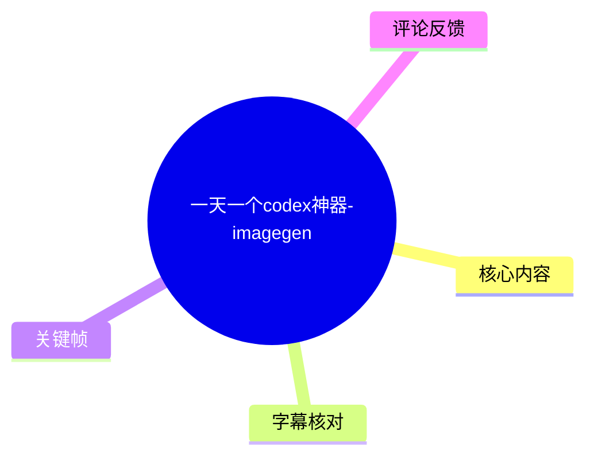
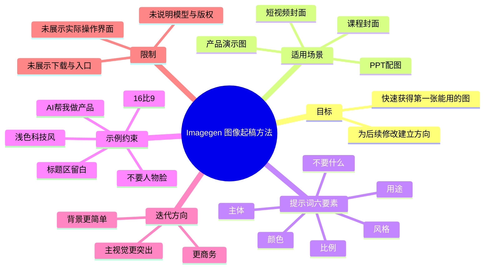
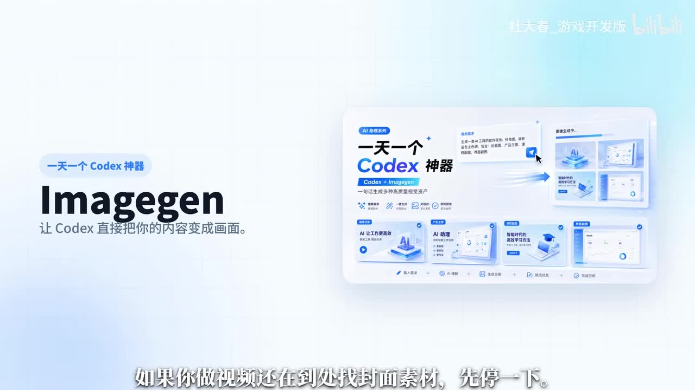
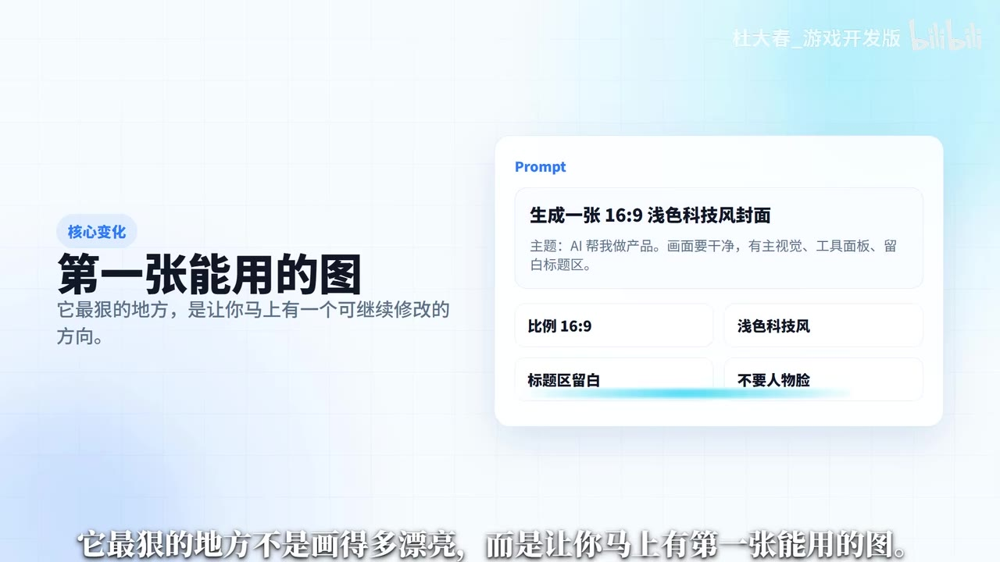
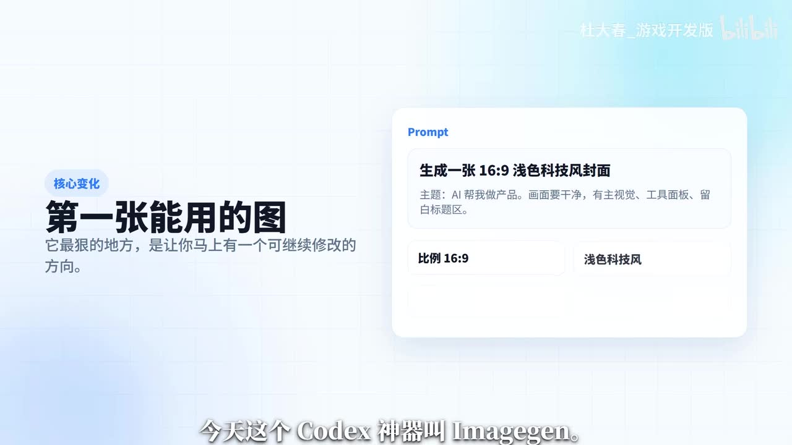

# 一天一个codex神器-imagegen

> 来源：[Bilibili 视频](https://www.bilibili.com/video/BV18n7Z6dEPb)<br>
> UP 主：杜大春_游戏开发版｜合集：AIcode｜视频时长：45 秒｜标签：vibecoding、CODEX、神器、openai codex

## 小结

视频介绍名为 **Imagegen** 的 Codex 图像生成能力（画面标题写作 “Imagegen”，ASR 曾误识别为 “AmiGen”）。UP 主将其定位为视频封面、课程封面、产品演示图和 PPT 配图的快速起稿工具，核心价值不是单纯生成“漂亮图”，而是尽快给出一张可以继续修改、已经具备明确方向的首稿。

视频给出的关键经验是：不要只下达“画一张好看的图”这类笼统要求，而要在提示词中明确 **用途、比例、主体、风格、颜色、不要什么** 六类信息。画面还具体展示了“标题区留白”“不要人物脸”等约束，它们分别对应排版可用性与内容排除条件。

示例需求为生成一张 **16:9、浅色科技风** 的封面，主题是“AI 帮我做产品”，同时要求画面干净、有主视觉、包含工具面板、标题区域留白、不要人物脸。生成首稿后，再以“更商务”“背景更简单”“主视觉更突出”等方向继续迭代。

这是一支方法导向的短视频，没有展示实际 Codex 操作界面、调用方式、安装/下载链接、模型版本、价格、权限、输出分辨率或版权条款。因此，“Imagegen 是否可直接在某个 Codex 客户端中调用、如何开通、是否支持 image-to-image”等问题，不能仅凭本视频确认。

信息时效上，视频发布于 2026 年 6 月；AI 工具的入口、名称、模型能力与可用地区可能快速变化。本文只整理视频明确表达及关键帧可见信息，不将其扩展为对当前产品可用性的保证。

## 思维导图





## 目录

- [背景：从找素材转为快速起稿](#背景从找素材转为快速起稿)
- [核心定位：第一张能用的图](#核心定位第一张能用的图)
- [提示词示例与可见参数](#提示词示例与可见参数)
- [迭代步骤与适用场景](#迭代步骤与适用场景)
- [经验提炼、限制与时效性](#经验提炼限制与时效性)
- [字幕比对](#字幕比对)
- [评论分析](#评论分析)
- [处理记录](#处理记录)

## 背景：从找素材转为快速起稿 [00:00](https://www.bilibili.com/video/BV18n7Z6dEPb?t=0)

视频开头面向正在为视频封面四处寻找素材的创作者，提出替代思路：将内容需求直接描述给 Codex 图像生成能力，由其先产生一个可用方向，再在这个方向上修改。

画面将该能力命名为 **“Imagegen”**，并写有“让 Codex 直接把你的内容变成画面”。这里的“把内容变成画面”是视频的产品定位表达；视频未提供其背后的具体模型、API、插件来源或安装渠道。



> 图：该关键帧直接呈现“Imagegen”名称、“一天一个 Codex 神器”系列定位，以及“让 Codex 直接把你的内容变成画面”的主张。它用于校正 ASR 中的 “AmiGen” 识别，并说明视频讨论的是图像生成工作流。

## 核心定位：第一张能用的图 [00:00](https://www.bilibili.com/video/BV18n7Z6dEPb?t=0)

UP 主强调，Imagegen “最狠的地方不是画得多漂亮，而是让你马上有第一张能用的图”。关键不在于一步生成最终成品，而在于生成一个可评估、可调整的视觉起点。

从视频画面可见，“第一张能用的图”被解释为：**让用户马上有一个可继续修改的方向**。这意味着首稿应至少满足用途、版式和视觉方向的基本要求，方便后续围绕商务感、背景复杂度和主视觉强度继续收敛。



> 图：画面左侧明确写出“核心变化：第一张能用的图”，并补充“让你马上有一个可继续修改的方向”。该帧将视频的评价标准从“图好不好看”转为“是否能服务后续工作”。

## 提示词示例与可见参数 [00:12](https://www.bilibili.com/video/BV18n7Z6dEPb?t=12)

视频给出了一条用于封面起稿的示例需求。结合 ASR 与关键帧中可见文字，可整理为：

```text
生成一张 16:9 浅色科技风封面
主题：AI 帮我做产品。
画面要干净，有主视觉、工具面板，留白标题区。
不要人物脸。
```

其中可明确识别的参数及其作用如下：

| 参数/约束 | 视频中的表达 | 对结果的作用 |
| --- | --- | --- |
| 用途 | 封面 | 约束构图服务于传播与标题承载，而不是普通插画。 |
| 比例 | 16:9 | 指向横向视频封面比例。 |
| 主体 | AI 帮我做产品；工具面板 | 指定内容主题及主要视觉元素。 |
| 风格 | 浅色科技风 | 约束整体视觉语言。 |
| 颜色/画面气质 | 浅色、干净 | 控制亮度与画面复杂度。 |
| 留白 | 标题区留白 | 为后续叠加标题文字预留版面。 |
| 排除条件 | 不要人物脸 | 避免出现不需要的人脸主体。 |


> 图：关键帧以卡片方式呈现“比例 16:9”“浅色科技风”“标题区留白”“不要人物脸”。它证明“标题区留白”是视频画面明确出现的要求，也显示排除条件应写入提示词。

需要注意：ASR 在首段中识别出“不要提取留白”，该句不通顺；关键帧显示的原意应为 **“标题区留白”**。本文据画面文字进行校正，而非将 ASR 的误识别当作操作要求。

## 迭代步骤与适用场景 [00:24](https://www.bilibili.com/video/BV18n7Z6dEPb?t=24)

视频描述的流程可以还原为以下顺序：

1. **先定义使用场景**：例如短视频封面、课程封面、产品演示图或 PPT 配图。
2. **一次性给出结构化要求**：至少说清用途、比例、主体、风格、颜色和“不要什么”。
3. **加入版式与排除约束**：示例中的“标题区留白”“不要人物脸”分别服务于后期文字排版和内容控制。
4. **获得第一张可用图作为方向稿**：视频称“几秒钟后你就有方向了”；这是 UP 主的体验性表述，视频未展示实际生成耗时测量。
5. **围绕问题继续修改**：视频依次给出的调整方向包括：
   - 更商务一点；
   - 背景更简单一点；
   - 主视觉再突出一点。
6. **将结果用于目标载体**：视频列举短视频封面、课程封面、产品演示图、PPT 配图。



> 图：画面中的 Prompt 区写有“生成一张 16:9 浅色科技风封面”，并展示“主题：AI 帮我做产品”“画面要干净”“有主视觉”“工具面板”“留白标题区”等内容。它说明该视频提倡以明确、组合式约束代替抽象审美词。

## 经验提炼、限制与时效性 [00:24](https://www.bilibili.com/video/BV18n7Z6dEPb?t=24)

### 可迁移经验

视频最后将提示词组织归纳为六件事：

1. **用途**：图最终放在哪里用；
2. **比例**：如 16:9；
3. **主体**：画面要表达什么、主要对象是什么；
4. **风格**：如浅色科技风；
5. **颜色**：明确整体色彩或色调倾向；
6. **不要什么**：直接列出应排除的内容。

该框架的价值在于让生成目标同时包含“要做什么”和“不要做什么”。对于封面类任务，除主题外尤其应补足比例、标题留白、主体位置和背景复杂度，否则即便图像美观，也可能不适合实际发布。

### 视频未覆盖的限制

以下信息在视频中没有给出，不能据此推断：

- Imagegen 的官方下载地址、安装步骤或具体产品入口；
- 是否为 Codex 官方内置能力、第三方扩展，或某种工作流名称；
- 是否可以直接调用 image-to-image（评论中的 “image2”）；
- 可用模型、账户套餐、地区限制、速率限制与费用；
- 最大生成尺寸、可编辑方式、导出格式；
- 商用授权、版权归属与内容安全限制；
- 实际生成页面、具体对话记录与生成结果对比。

因此，视频更适合作为 **AI 图像需求描述与迭代的提示词经验**，而不是完整的工具部署或选型教程。

### 时效性说明

元数据表明视频发布于 2026 年 6 月 4 日。AI 产品命名、入口、套餐、能力范围与合规政策具有时效性；本文不验证发布后 Imagegen 是否仍以相同名称、方式或权限提供服务。尝试前应以 Codex 或相关产品的当前官方文档为准。

## 字幕比对 [00:00](https://www.bilibili.com/video/BV18n7Z6dEPb?t=0)

| 字幕来源 | 完整性 | 专有名词 | 时间轴 | 主要问题 |
| --- | --- | --- | --- | --- |
| Bilibili 站内字幕 | 未提供可用字幕 | 无法核验 | 无法使用 | 素材明确说明未提供可用站内字幕。 |
| 本次 ASR 字幕 | 较高：诊断显示语音覆盖约 97.86%，2 个分段覆盖 00:00.560—00:41.500 | 存在误识别 | 可用：含真实 SRT 起止时间 | 将 “Imagegen” 识别为 “AmiGen”；“标题区留白”误识别为不通顺的“不要提取留白”；末句“画张好看的图”存在疑似误识别。 |

本次 ASR 使用 `medium` 模型、中文识别，音频时长约 41.835 秒；诊断中**未标记** `noAudioStream=true`，说明源视频存在可识别音轨，并非无音轨素材。

最终采用 **本次 ASR 的时间轴** 作为章节定位依据，并以关键帧可见文字修正关键术语：

- `AmiGen` → **Imagegen**：由开场画面大标题“Imagegen”校正。
- `不要提取留白` → **标题区留白**：由提示词卡片中的明确文字校正。
- ASR 中的“别只说化妆好看的图”语义异常；结合上下文，保留其核心意思为“不要只说画张好看的图”，但不将其视为逐字可靠转写。
- ASR 末尾提到“用途、比例、主体、风格、颜色、不要什么”，与视频提出的“六件事”框架一致。

## 评论分析 [00:24](https://www.bilibili.com/video/BV18n7Z6dEPb?t=24)

仅处理本次可获取的热评前三条；三条评论点赞数均为 0，以下内容反映提问者关切，不构成已验证事实。

1. **设计大会员小方块**：“这个在在哪下载”  
   - 观点：关注工具的下载或获取入口。  
   - 补充价值：反映视频没有给出下载信息，观众无法仅凭内容完成工具落地。  
   - 可信度与结论：这是合理提问，但评论本身未提供答案；不能据此推断该工具一定需要单独下载。

2. **sonshe**：“哪里下载？”  
   - 观点：同样关注获取渠道。  
   - 补充价值：与第一条形成重复信号，说明“如何使用/从哪里进入”是视频信息缺口。  
   - 可信度与结论：没有附带链接、产品名或官方来源，不能作为安装指引。

3. **一榔头锤爆你**：“codex能直接调image2吗？”  
   - 观点：询问 Codex 是否可直接调用 image-to-image 能力。  
   - 补充价值：指出图像生成工作流中“文生图”之外的关键能力需求。  
   - 可信度与结论：视频未演示 image-to-image，也未回答该问题；因此无法从视频或评论确认支持情况。

## 评论分析

- 热评 1：这个在在哪下载
- 热评 2：哪里下载？
- 热评 3：codex能直接调image2吗？

以上内容是观众反馈摘录，只用于补充理解视频反响，不作为正文事实依据。

## 处理记录

- Worker ID：`worker-mrj0wjed-b0c290ad`
- 整理模型：`gpt-5.6-terra`
- 已检查素材：视频元数据、ASR 结果与 SRT 时间轴、关键帧清单及已提供关键帧画面、热评前三条。
- ASR 模型与参数：`medium`｜语言 `zh`｜设备 `cuda`｜计算类型 `float16`｜音频时长约 `41.835` 秒。
- 字幕选择：站内字幕未提供可用文件；已检查本次 ASR，采用其 SRT 的 `00:00:00,560—00:00:24,720` 与 `00:00:24,720—00:00:41,500` 时间轴。术语和明显语义错误由关键帧画面校正。
- 关键帧选择依据：
  - `frames/frame-001.jpg`：确认工具名称为 Imagegen 及整体定位；
  - `frames/frame-002.jpg`：展示完整提示词示例；
  - `frames/frame-003.jpg`：说明“第一张能用的图”的核心价值；
  - `frames/frame-004.jpg`：确认 16:9、浅色科技风、标题区留白、不要人物脸等可见参数。
- 缓存清理：提供的素材中未包含缓存清理执行记录；本文未声称已执行缓存删除。
- 未解决问题：Imagegen 的实际入口、下载方式、是否为官方 Codex 功能、是否支持 image-to-image、模型与费用、版权及商用限制，均未在视频素材中获得验证。
