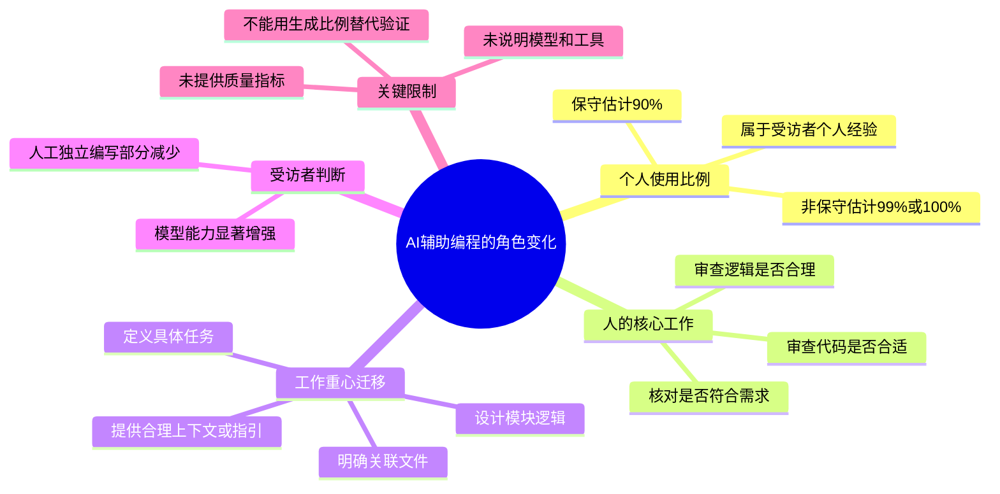

# 姚顺宇：自己 90% 代码由 AI 生成，AI 不能写的代码越来越少

> 来源：[Bilibili 视频](https://www.bilibili.com/video/BV113L26LErZ)  
> UP 主：财经网科技｜时长：43 秒｜标签：人工智能、IT、程序员、姚顺宇  
> 视频为竖屏访谈剪辑，画面标注“谷歌 DeepMind 前研究员”，但该身份仅作为画面文字呈现，未在本视频中提供进一步履历或出处。

## 小结

视频记录了姚顺宇对 AI 辅助编程的个人使用判断：他称，按“保守估计”，自己约 **90% 的代码由模型生成**；若不保守，比例可达 **99% 甚至 100%**。这是一位受访者的个人经验，不应直接外推为所有程序员、团队或项目的平均水平。

他强调，AI 生成代码并不等于人无需参与。人的时间仍主要花在审查生成结果：检查代码是否合适、逻辑是否合理，以及产物是否真正符合原先需求。视频中最明确的经验是：在 AI 辅助工具存在后，开发工作的重心从逐行实现转向**模块与逻辑设计、文件关联梳理、任务定义以及向模型提供合理上下文/指引**。

视频末尾表达了对模型能力快速提升的主观看法：模型能力“比人的能力强太多”，而自己能够独立编写的部分正在不断减少。结合标题“AI不能写的代码越来越少”，可理解为受访者认为模型可覆盖的编码范围正在扩大；但原始口语在此处有片段化表达，视频没有给出具体模型、工具、任务类型、评测指标或错误率，不能据此得出“AI 已能可靠完成全部软件工程工作”的结论。

这段内容适合正在使用代码生成工具的开发者、技术管理者和学习编程的人阅读。可迁移的重点不是“把 90% 当作目标”，而是保留设计、审查、验证和责任归属能力。热评中“可以不写，但不能看不懂”的概括，与视频中“花很多时间审查代码”的观点相呼应，但属于评论者意见而非视频验证结论。

时效性方面，视频元数据显示发布时间为 2026 年 5 月；AI 编程模型与工具迭代很快，代码生成比例、可完成任务范围及实际可靠性都可能随模型、代码库、权限设置和测试流程变化。

## 思维导图

## 目录

- [视频背景与信息边界](#视频背景与信息边界)
- [90%：AI 生成代码的个人估计](#90ai-生成代码的个人估计)
- [生成之后：审查仍是必要环节](#生成之后审查仍是必要环节)
- [开发重心：从手写实现转向设计与任务定义](#开发重心从手写实现转向设计与任务定义)
- [模型能力与“不能写的代码”边界](#模型能力与不能写的代码边界)
- [可执行的 AI 辅助编程流程](#可执行的-ai-辅助编程流程)
- [关键帧解读](#关键帧解读)
- [结论、限制与时效性](#结论限制与时效性)
- [字幕比对](#字幕比对)
- [评论分析](#评论分析)
- [处理记录](#处理记录)

## 视频背景与信息边界 [00:00:00](https://www.bilibili.com/video/BV113L26LErZ?t=0)

这是一段约 43 秒的访谈摘录。画面顶部概括了核心论点：“姚顺宇：保守估计自己的代码 90% 是 AI 生成的”“AI 不能写的代码越来越少”。受访者在随后口述中围绕代码生成比例、审查工作和开发流程变化展开说明。

需要区分以下三层信息：

1. **受访者陈述**：90%、99% 或 100% 是其个人对自己代码产出的估计。
2. **视频可观察事实**：视频没有点名所用模型、IDE、编程语言、代码规模、项目类型、提示词形式，也没有展示测试或上线数据。
3. **不可直接推导的结论**：不能把“生成比例高”直接等同于“无需人工审核”“生产质量已被证明”或“所有开发岗位都受同等影响”。

> 图：开场关键帧同时给出受访者画面与视频标题，适合用于确认本片讨论的主题是 AI 生成代码比例及其对编程工作的影响；它不提供模型名称或可复现技术参数。

## 90%：AI 生成代码的个人估计 [00:00:02](https://www.bilibili.com/video/BV113L26LErZ?t=2)

受访者在开头给出量化判断：

- **保守估计：约 90% 的代码由模型生成。**
- 若不保守，比例“可能就是 99 或者 100”。
- 他将“90%”称为给自己“留点面子”的保守说法，带有明显的口语化、自谦语气。

这一比例描述的是“代码由模型产生”的程度，而不是完整的软件交付工作量。视频紧接着说明，他仍要投入大量时间检查生成代码。因此，不能把这组百分比理解为人只承担 10% 的总工程责任，或把它视作对代码正确率、可维护性、安全性、测试覆盖率的量化承诺。

> 图：画面以终端/代码界面作为“模型产生代码”的视觉隐喻，并配有“是模型产生的”字幕。该图帮助对应 00:02—00:05 的比例陈述，但屏幕内容不足以识别具体语言、模型或项目。

> 图：此帧直观呈现“保守估计90%”这一视频最核心的数字信息，适合避免将标题中的比例误读为平台统计或行业均值；它实际是受访者的个人判断。

## 生成之后：审查仍是必要环节 [00:00:09](https://www.bilibili.com/video/BV113L26LErZ?t=9)

受访者说明，即使代码由模型产生，自己仍“需要花很多时间去看这个 code”，主要审查三件事：

1. **是否写得合适**：关注实现方式是否适用于当前任务与项目约束。
2. **是否写得合理**：关注逻辑的自洽性。
3. **是否真的是自己想让它写的**：关注输出是否与原始意图、需求和任务边界一致。

这三项构成了 AI 辅助编程中最基本的人工责任链：**生成并不替代理解，输出并不自动等于需求满足**。视频没有展开具体的审查技术，如单元测试、静态分析、代码评审或安全扫描；这些方法可以作为实践补充，但并非视频明确展示的操作步骤。

> 图：该帧对应“我需要花很多时间去……”的口述段落，突出视频并未把 AI 编程描述为完全自动化，而是强调人工审查仍占据时间。

## 开发重心：从手写实现转向设计与任务定义 [00:00:16](https://www.bilibili.com/video/BV113L26LErZ?t=16)

受访者认为，有了 AI 辅助工具后，“写 code/解 code”过程中最重要的部分，可能已转变为“怎么去设计”。他将需要先行明确的内容拆解为：

- **设计代码或模块的逻辑**；
- 明确它需要与**哪个文件相关联**；
- 明确需要完成的**具体事情/任务**；
- 向模型给出一些**合理的指引或上下文**。

这里的“合理的”在站内中文字幕中于 00:31—00:33 处被截断，ASR 将其识别为英语词 `contact`，结合上下文更可能是在说“合理的 context（上下文）”或“合理的……”。但视频字幕并未完整呈现该词，不能将其断言为确切术语。可以确认的是：受访者强调模型需要得到与任务逻辑相关的输入，而不是脱离代码库上下文随意生成。

### 视频陈述可整理为的任务定义顺序

1. 先说明要解决什么问题。
2. 设计所需模块或代码逻辑。
3. 指出相关文件及其连接关系。
4. 明确该实现需要完成的具体事项。
5. 向模型提供合理的任务指引/上下文。
6. 获取代码输出后进行人工检查。

该顺序是对视频口述内容的结构化整理，不代表视频展示了某个固定工具的操作界面、提示词模板或自动化工作流。

## 模型能力与“不能写的代码”边界 [00:00:36](https://www.bilibili.com/video/BV113L26LErZ?t=36)

在结尾处，受访者表示“模型比人的能力强太多了”，并称自己能写的部分“越来越少”。

标题进一步将观点概括为“AI 不能写的代码越来越少”。不过，00:38—00:42 的口述在各字幕版本中存在语义不完整的问题：站内中文字幕显示“他不能写 / 而我能写的部分……”，本次 ASR 也识别出“它不能写而我能写的部分……”。结合标题与前后语境，可以较稳妥地记录为：**受访者认为，随着模型能力增强，原本需要由人独立编写的部分正在缩小。**

应保留以下边界：

- 视频表达的是能力趋势与个人感受，**未给出模型能力比较的测试方法**。
- “模型能力强”并未在视频中被定义为代码正确率、架构能力、调试能力、安全性、业务理解或长期维护能力中的哪一项。
- 生成能力变强不消除审查责任；这一点与他在前段花时间检查代码的表述一致。
- 不应将含混的片段直接扩写为“AI 已经没有不能写的代码”——视频标题的“越来越少”本身仍保留了限制。

## 可执行的 AI 辅助编程流程 [00:00:22](https://www.bilibili.com/video/BV113L26LErZ?t=22)

以下流程仅根据视频所述“设计—关联文件—任务—给模型指引—审查”的顺序整理，补入了必要的验证关口；其中验证方式属于通用工程实践补充，视频未明确点名具体工具。

### 1. 定义问题和完成条件

在请求模型写代码前，先界定：

- 要解决的具体问题；
- 输入、输出和异常情况；
- 哪些行为算完成，哪些行为不可接受；
- 与现有逻辑的兼容要求。

**原因**：视频明确将“设计”视为更重要的部分。若任务本身未定义清楚，模型即使能产出大量代码，也难以保证“真的是我想让它写的”。

### 2. 设计模块逻辑

将需求转成模块职责、主要流程、状态变化或接口关系。这里的重点不是让模型猜测设计，而是由开发者先决定关键逻辑。

**视频对应表述**：如何设计“这个 code 的逻辑”。

### 3. 指明相关文件与连接关系

告诉模型新代码应放入或影响哪些文件、模块、接口或配置，而不是仅给出孤立功能描述。

**视频对应表述**：需要与哪个文件相关联。

### 4. 列出具体任务，并提供合理上下文

把实现事项拆成明确任务，例如新增、修改、删除或适配哪些行为，并向模型提供理解任务所需的上下文。视频未给出上下文内容的具体格式，因此不宜虚构固定提示词、文件数量或 token 参数。

**注意**：站内字幕在“给一些合理的”后截断；ASR 的 `contact` 识别不足以证明原词。这里采用“合理上下文/指引”的保守表述。

### 5. 获取输出后逐项审查

至少针对视频明确提出的三项问题核对：

- 写法是否合适；
- 逻辑是否合理；
- 输出是否符合原始意图。

如用于真实项目，还应通过项目既有的构建、测试、代码评审和安全流程验证；这些属于必要的工程风险控制，但不是视频中出现的具体命令或参数。

## 关键帧解读 [00:00:00](https://www.bilibili.com/video/BV113L26LErZ?t=0)

本视频提供了 12 张关键帧路径。正文选用了前 4 张，因为它们分别对应视频中的主题开场、模型生成代码的视觉表达、90% 的核心数字以及人工审查代码的段落，能够直接支撑正文中最重要的四项信息。

| 关键帧 | 正文用途 | 可确认画面信息 | 选择价值 |
| --- | --- | --- | --- |
| `frames/frame-001.jpg` | 背景与主题 | 受访者、节目标题、AI 生成代码比例议题 | 确认视频的论题与受访谈形式 |
| `frames/frame-002.jpg` | 90% 估计 | 代码/终端屏幕、“是模型产生的”字幕 | 对应模型生成代码的主张 |
| `frames/frame-003.jpg` | 数字重点 | “保守估计90%”字幕 | 锚定个人比例判断，避免误读 |
| `frames/frame-004.jpg` | 审查环节 | 受访者讲话、“我需要花很多时间去”字幕 | 支撑人工审核仍重要的结论 |

未选用其余关键帧，并非表示其无价值，而是现有素材中未提供这些帧对应的逐帧时间说明；为避免根据文件序号臆测具体画面内容，本文只使用已能从给定预览可靠对应的帧。

## 结论、限制与时效性 [00:00:36](https://www.bilibili.com/video/BV113L26LErZ?t=36)

### 可迁移经验

- AI 编程的高价值不只在于快速生成代码，更在于让开发者将精力投入到设计、拆解、上下文组织和结果验证。
- 高生成比例不等于低人工投入：受访者明确说自己仍要花大量时间审查。
- 能阅读、理解和判断代码是否符合意图，是使用 AI 工具时不可省略的能力。

### 视频没有覆盖的限制

- 未说明使用的模型、版本、编辑器、代理工具或编程语言。
- 未交代“90%”的统计口径：按代码行数、提交量、文件数、初稿比例还是最终保留比例均不明确。
- 未展示生成代码的质量、缺陷率、测试结果、性能、安全性或维护成本。
- 未区分原型开发、个人项目、遗留系统、受监管系统等不同场景。
- 未给出提示词、上下文输入、权限控制或代码审查的具体技术参数。

### 时效性

元数据中的发布时间为 2026 年 5 月。视频讨论的是随模型能力变化而快速演进的 AI 编程实践，其结论尤其是“99% 或 100%”的个人比例和模型能力判断，具有明显的个人性与时间敏感性。实际采用时应以当前使用的模型、代码库、测试体系和组织规范重新验证。

## 字幕比对 [00:00:00](https://www.bilibili.com/video/BV113L26LErZ?t=0)

| 字幕来源 | 完整性 | 专有名词/术语 | 时间轴 | 主要问题 |
| --- | --- | --- | --- | --- |
| Bilibili 站内中文字幕 `p01-ai-zh.srt` | 高，覆盖 00:00:00.040—00:00:42.380 | 将 `code` 多次误写为“扣子”；末尾语句有断裂 | 高，21 个细分段，覆盖与视频时长基本一致 | 00:31—00:36 在“合理的”后截断；00:38 后“他不能写”语义不完整 |
| Bilibili 站内英文字幕 `p01-ai-en.srt` | 高，时间段与中文字幕一致 | 正确保留 `code`、`file` 等概念 | 高 | 00:31—00:36 同样在 “reasonable...” 处截断；末尾 “It can't write” 缺少明确指代 |
| 本次 ASR `asr/transcript.srt` | 低，诊断语音覆盖率仅 24.39% | 识别出 `code`；将疑似“context/上下文”识别为 `contact` | 低，全部内容被挤压至 00:31.020—00:41.360 两段 | 与站内字幕的完整时间分布明显不一致，两个长句内缺乏可用细粒度断句 |

### 最终字幕选择与校正

本文以 **Bilibili 站内中文时间轴字幕为主**，原因是其覆盖 42.38 秒、分段完整，且与英文、日文、西班牙文、葡萄牙文版本在主要内容上相互印证。章节时间链接优先采用站内 SRT 的真实起止时间换算秒数。

本次 ASR 已实际检查，不存在 `noAudioStream=true` 标记；诊断显示音频时长为 42.399625 秒，语言识别为中文，置信度为 0.99853515625。因此，该视频**有音轨**，并非无音轨素材。ASR 的问题是识别时间轴压缩和覆盖不足，而不是工具没有获取到音频。

通过多字幕对照进行的保守校正如下：

- 站内中文字幕中的“扣子”“解扣子”统一按上下文校正为 `code`、“写代码/编程问题”，英文字幕直接使用 `code`，本次 ASR 也识别为 `code`。
- “哪个文件相关联”由中文、英文 `which file`、日文和其他语种字幕相互支持。
- 00:31—00:36 的“合理的……”在各语言字幕均不完整；ASR 的 `contact` 不足以确定原词。正文只写为“合理的指引或上下文”，并明确其不确定性。
- 00:38—00:42 的“他不能写”语义不完整。标题可辅助理解整体主题，但不能替代缺失语音，因此正文保留为“受访者认为模型可覆盖范围扩大”的概括，而没有虚构完整原句。

## 评论分析 [00:00:00](https://www.bilibili.com/video/BV113L26LErZ?t=0)

以下仅分析当前可获取的热评前三条。评论反映观众观点，不构成已验证事实。

1. **电龙的口水｜498 赞**  
   评论：“简而言之，可以不写，但不能看不懂。coding还是要学”  
   - 观点：认可 AI 可以减少手写代码，但强调理解代码仍是前提。  
   - 与视频关系：与受访者“花很多时间看代码”“是否写得合适、合理”的表述高度一致。  
   - 边界：这是对视频的简化总结，不代表所有学习路径或岗位要求都已被证明。

2. **可乐汉堡薯条炸鸡｜82 赞**  
   评论：“有没有程序员说下，目前生存空间有没有受到冲击[笑哭]”  
   - 观点：提出 AI 编程工具对程序员就业与生存空间的潜在影响。  
   - 与视频关系：视频谈到人能写的部分减少，容易引出职业影响讨论。  
   - 边界：该评论是提问，未提供数据、行业范围或答案，不能据此判断就业市场实际变化。

3. **Tony_3rd｜41 赞**  
   评论：“确实，我现在已经实际上变成提示词工程师了。主要精力放在给AI写文档和审查测试上”  
   - 观点：评论者自述其工作重心转到为 AI 准备文档、审查与测试。  
   - 与视频关系：与“设计逻辑—关联文件—明确任务—提供指引—审查”的流程相呼应。  
   - 边界：属于单一个人经验；“提示词工程师”是其自我描述，不能代表普遍岗位转型。

## 评论分析

- 热评 1：简而言之，可以不写，但不能看不懂。coding还是要学
- 热评 2：有没有程序员说下，目前生存空间有没有受到冲击[笑哭]
- 热评 3：确实，我现在已经实际上变成提示词工程师了。主要精力放在给AI写文档和审查测试上

以上内容是观众反馈摘录，只用于补充理解视频反响，不作为正文事实依据。

## 处理记录

- Worker ID：`worker-mrj0wbly-5dc4e50c`
- 整理模型：`gpt-5.6-terra`
- ASR 模型与运行参数：`medium`；语言自动识别为 `zh`，置信度 `0.99853515625`；设备 `cuda`；计算类型 `float16`。
- 使用的素材与工具产物：视频元数据、站内多语言 SRT、`asr/asr-result.json`、`asr/transcript.srt`、关键帧目录 `frames/`、热评文件 `comments/comments.json`。
- 字幕选择：以站内中文 SRT 为时间轴主源，并以英文等站内字幕及本次 ASR 交叉检查；站内中文的“扣子”依据英语字幕与 ASR 校正为 `code`。本次 ASR 已检查，但因仅覆盖约 24.39% 音频且时间戳压缩，不作为主要时间轴依据。
- 音轨判断：ASR 结果未标记 `noAudioStream=true`，且提供了 42.399625 秒音频诊断；因此按“有音轨”处理。
- 关键帧选择依据：选取 `frame-001` 至 `frame-004`，因为给定画面预览可可靠对应主题、模型生成代码、90% 数字与审查代码四项正文核心信息；未对其余帧的未提供预览内容作推测。
- 评论范围：仅处理可获取的热评前三条，未扩展到其他评论。
- 缓存清理：提供的素材中没有缓存清理执行日志，无法确认是否已清理；本文不虚构清理结果。
- 未解决问题：00:31—00:36 的“合理的……”和 00:38—00:42 的片段存在字幕截断/指代不清；视频未提供所用模型、代码统计口径、项目条件和质量指标。
