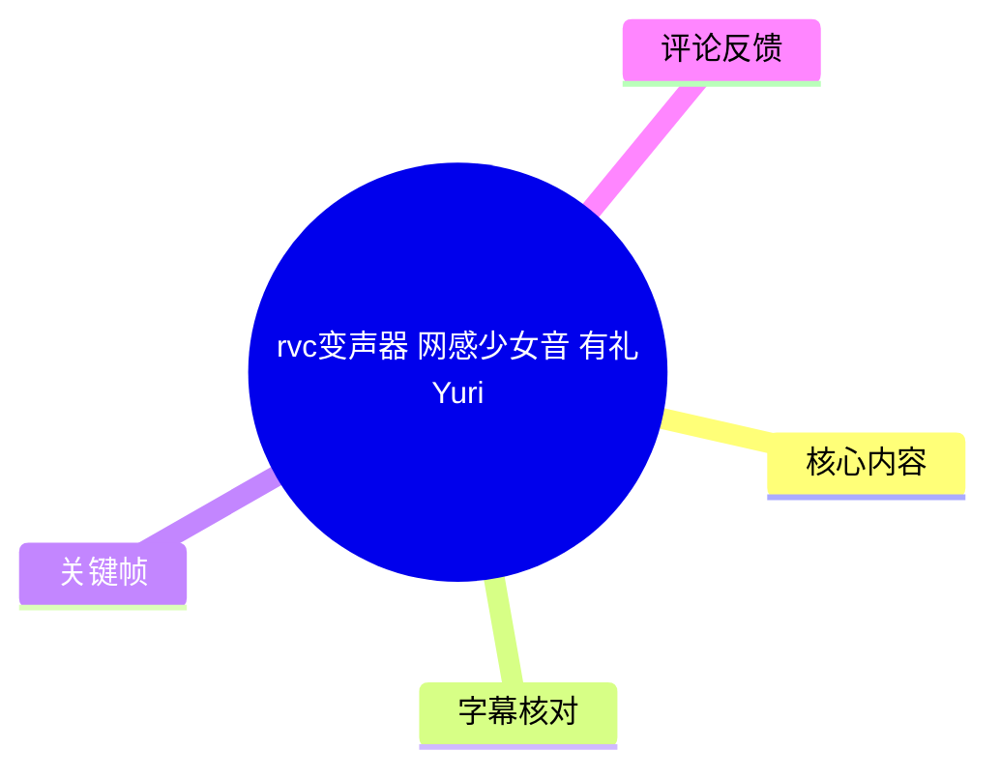
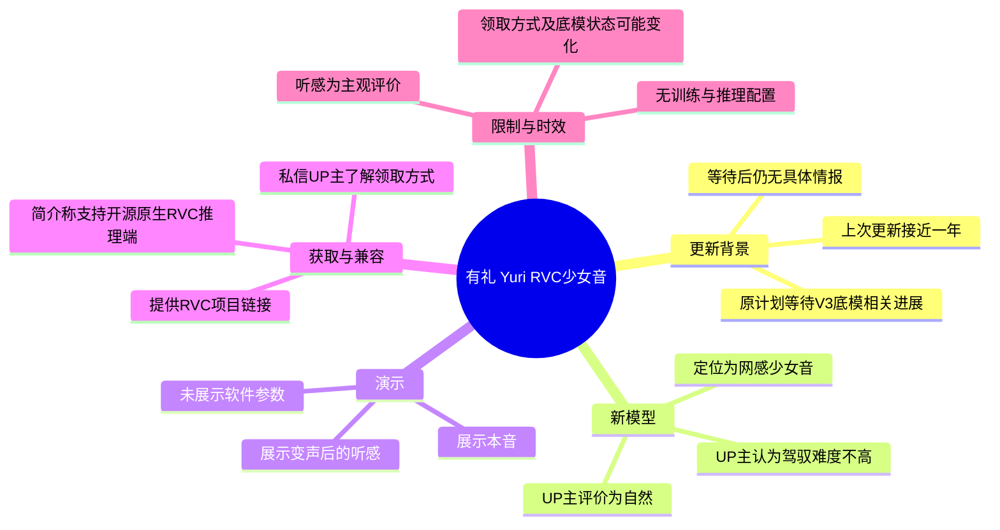

# rvc变声器 网感少女音 有礼Yuri

> 来源：[Bilibili 视频](https://www.bilibili.com/video/BV1KYc7zmErE) 
> UP 主：千鹤AI变声｜发布时间：2026-02-13｜视频时长：1 分 53 秒 
> 标签：少女音、女声、RVC、AI变声、变声器

## 小结

视频发布了一款名为“有礼 Yuri”的 RVC 变声模型，定位为“网感少女音”。UP 主的核心判断是：该音色虽然具有网感风格，但听感仍较自然，并且“驾驭难度”不高，适合用户选用。

此次更新距离 UP 主所称的上一次模型更新约接近一年。视频画面展示的历史投稿页中，可见一条发布日期为 2025-05-16、标题含“原质御姐音 鹤纪 Tsurugi”的视频；但 ASR 对该旧模型名称识别不稳定，因此不能仅据 ASR 确认其完整名称。

延迟更新的原因是 UP 主原本在等待新的 RVC “V3 底模/底稿”相关进展，希望基于新底模训练或运行新模型以争取更好效果；但其称从前一年 9—10 月推迟至当年 1—2 月，仍未得到具体情报，因此决定不再继续等待，恢复模型发布频率。这里的底模更新状态是视频中的个人信息与判断，并非本视频提供的可复现实测结论。

视频没有展示 RVC 安装、推理软件界面、训练数据、采样率、F0 提取器、变调值、索引比例、延迟或硬件占用等参数；它是一次音色发布与听感演示，而不是配置教程。UP 主在结尾说明，想了解领取方式的用户可通过 Bilibili 私信联系本人；视频简介同时称模型支持开源原生 RVC 推理端，并给出 RVC 项目链接。

该内容的时效锚点是视频口述的“2026 年 2 月 13 日晚上 10:03”。模型领取方式、UP 主私信响应、RVC 底模后续进展及链接可用性都可能在发布后变化，应以当前页面和项目仓库为准。

## 思维导图

## 目录

- [更新背景：接近一年的间隔](#更新背景接近一年的间隔)
- [延迟原因：等待 RVC V3 底模信息](#延迟原因等待-rvc-v3-底模信息)
- [新模型定位：网感少女音“有礼 Yuri”](#新模型定位网感少女音有礼-yuri)
- [本音与变声效果试听](#本音与变声效果试听)
- [获取方式、兼容性与实践边界](#获取方式兼容性与实践边界)
- [结论、限制与时效性](#结论限制与时效性)
- [字幕比对](#字幕比对)
- [评论分析](#评论分析)
- [处理记录](#处理记录)

## [更新背景：接近一年的间隔](https://www.bilibili.com/video/BV1KYc7zmErE?t=1)

**时间范围：00:00:01.620—00:00:25.760**

UP 主在开场口述当前时间为“26 年 2 月 13 号晚上 10 点 03 分”，并表示与上一次更新相隔接近一年。其称此前更新曾获得用户支持与认可，并向观众表达感谢。

画面并非 RVC 操作界面，而是 UP 主的 Bilibili 个人投稿页。该页用于呈现旧视频列表和更新时间背景，能支持“已有一段时间未更新”的叙述，但不能单独证明各模型的技术表现。

> 图：关键帧展示 UP 主的投稿列表，其中可见日期为 2025-05-16 的历史投稿。它为“距离上次更新接近一年”的背景提供了画面佐证；画面文字较小，旧视频的完整标题不应只凭 ASR 擅自补全。

## [延迟原因：等待 RVC V3 底模信息](https://www.bilibili.com/video/BV1KYc7zmErE?t=25)

**时间范围：00:00:25.760—00:00:49.800**

UP 主解释，新模型较久未发布“是有原因的”：其此前听闻可能会更新新的 RVC 底模，并称之为“V3 底模”。因此，原计划是在新底模更新后再运行或制作新模型，以期带来更好的效果。

其叙述的等待时间线为：

1. 从前一年约 9—10 月开始等待相关更新；
2. 等待期推至当年约 1—2 月；
3. 截至录制时仍没有“具体情报”；
4. 因而决定不再继续等待。

需要区分的是：视频未说明“底模”具体指向的仓库版本、模型架构、发布日期、兼容要求或性能指标；“更新后效果会更好”是 UP 主的预期，并没有在视频中以 A/B 对比、客观指标或实际参数予以验证。

> 图：画面字幕强调“是有原因的”，与口述中关于等待底模进展的解释相对应。该帧有助于定位本段论述的主题，但不包含底模版本细节。

## [新模型定位：网感少女音“有礼 Yuri”](https://www.bilibili.com/video/BV1KYc7zmErE?t=49)

**时间范围：00:00:49.800—00:01:14.160**

在决定保持模型发布频率后，UP 主带来这款新模型。根据视频标题，它被命名或标识为“有礼 Yuri”；根据口述和标题标签，其音色定位是“网感少女音”。

UP 主同时给出两项主观听感评价：

- 尽管属于“网感”取向，声音仍然“非常自然”；
- 该音色的驾驭难度不高，适合用户选用。

“网感”“自然”“驾驭难度”均是感性评价，不等同于可量化参数。视频没有交代模型的适合音域、推荐变调范围、输入嗓音条件、语言适配性或抗噪表现，因此不能从本视频推导出普遍的效果保证。

> 图：开场采用少女角色视觉与醒目的日期字幕，和视频“少女音”主题及发布时点相呼应。它说明视频的包装定位，但角色形象并不能证明模型对应具体角色或声源。

## [本音与变声效果试听](https://www.bilibili.com/video/BV1KYc7zmErE?t=74)

**时间范围：00:01:14.160—00:01:38.440**

UP 主按惯例展示自己的“本音”，随后让观众聆听与变声音相关的效果，并询问观众的听感。其最终评价是“很好听”的音色，且再次强调其相对易于驾驭。

从可获取语音内容可整理出的试听流程是：

1. UP 主先说明将展示本音；
2. 口述“哈喽，大家好，这个是我说话的本音”；
3. 随后展示变声效果；
4. 以个人感受总结音色好听、使用门槛相对不高。

视频仅提供短时口语演示，未展示干声与变声后音频的完整分轨、实时/离线模式、前后对照波形，也没有公布转换参数。因此，试听可用于初步判断风格，不足以评估长文本稳定性、歌声表现、爆破音处理、环境噪声容忍度或不同用户嗓音下的一致性。

## [获取方式、兼容性与实践边界](https://www.bilibili.com/video/BV1KYc7zmErE?t=98)

**时间范围：00:01:38.440—00:01:51.120**

UP 主在结尾给出的实际获取路径是：用户可在 Bilibili 私信 UP 主，了解模型领取方式。视频简介还写明：

- 模型支持“开源原生 RVC 推理端”；
- RVC 的全称为 **Retrieval-based Voice Conversion**；
- 简介给出项目地址：<https://github.com/RVC-Project/Retrieval-based-Voice-Conversion-WebUI>。

### 可依据视频执行的步骤

1. 确认自己需要的是“有礼 Yuri”这款网感少女音模型；
2. 在 Bilibili 向“千鹤AI变声”私信，询问领取方式；
3. 如使用开源原生 RVC 推理端，参考视频简介提供的 RVC 项目链接；
4. 在实际部署前，另行向发布者或项目文档确认模型文件、版本兼容性、授权范围及推理配置。

### 视频未提供、不能补写的关键参数

| 参数或事项 | 视频是否提供 | 说明 |
| --- | ---: | --- |
| 模型下载链接或文件名 | 否 | 仅说明通过私信获取领取方式。 |
| 模型格式与文件组成 | 否 | 未展示 `.pth`、索引文件或其他文件。 |
| RVC 版本与推理端版本 | 否 | 仅称支持开源原生 RVC 推理端。 |
| F0 提取方法、变调值、索引比例 | 否 | 未展示任何推理配置。 |
| 实时推理延迟与硬件需求 | 否 | 未进行性能演示。 |
| 训练数据来源和授权 | 否 | 不应据标题或角色视觉推定。 |

## 结论、限制与时效性

这是一则以听感展示和发布通知为核心的短视频。可迁移的经验是：当上游工具或底模更新长期没有明确时间表时，发布者可以在等待“潜在更优方案”与维持内容更新节奏之间作出取舍；本视频中的取舍是停止无限期等待，先发布当前模型。

对于潜在使用者，最可靠的信息是模型风格定位、UP 主自述的自然度与易驾驭性，以及私信获取方式和原生 RVC 推理端兼容声明。最需要自行验证的则是实际适配效果、参数配置、文件来源、使用授权和部署成本。

时效性方面，视频口述时间为 2026-02-13 晚间；模型领取方式、私信渠道、项目版本及所谓 V3 底模的进展均可能在之后变化。视频中没有提供可复核的版本号或性能数据，不应将其主观试听评价延伸为对所有输入声音、所有设备和所有 RVC 环境的效果承诺。

## 字幕比对

| 字幕来源 | 完整性 | 专有名词 | 时间轴 | 主要问题 |
| --- | --- | --- | --- | --- |
| Bilibili 站内字幕 | 不可用 | 无法核验 | 无法核验 | 素材明确标注“未提供可用站内字幕”；抓取过程也记录字幕工具因 `Invalid URL` 退出。 |
| 本次 ASR 字幕 | 较完整 | 存在多处误识别 | 可用 | 共 5 段，覆盖约 109.5 秒语音、覆盖率 97.21%，首段从 1.620 秒开始、最后语音至 111.120 秒；但“网感”“本音”“RVC V3 底模”等词存在同音或断词错误。 |

最终采用**本次 ASR 的真实 SRT 时间段**作为章节时间轴依据，因为没有可用的站内字幕。ASR 诊断显示音频时长为 112.64 秒、语言为中文、语言置信度 0.9961，且未标记 `noAudioStream=true`；因此可以确认源视频存在音轨，未发生“无音轨改用画面理解”的情形。

结合标题、视频简介、口述上下文与关键帧，对 ASR 中影响理解的词语作如下审慎校正：

| ASR 原文 | 正文采用 | 校正依据 |
| --- | --- | --- |
| “王感的少女音” | “网感少女音” | 视频标题直接写有“网感少女音”。 |
| “北音” | “本音” | 上下文为 UP 主展示自己说话的原始声音。 |
| “RVC底膜”“V3底膏” | “RVC 底模”“V3 底模” | 语义上下文为模型基础版本更新；但未能确认其具体技术名称或版本细节。 |
| “质感与解音合计” | 不作为旧模型正式名称引用 | 关键帧可见旧投稿标题文字，但 ASR 与画面均不足以稳定、完整确认该名称。 |

## 评论分析

可获取热评上限为 3 条，但素材中实际仅返回 **2 条**，均为 0 赞；以下仅分析可获取内容，不将评论当作已验证事实。

1. **祈愿两岸统一**：“已三连，求”  
   - 观点：表达已完成“三连”互动，并以“求”表示希望获得某项内容。  
   - 可能指向：结合视频结尾的私信领取说明，可能是在请求模型或领取方式，但评论未明确说明具体诉求。  
   - 信息价值：只能反映存在获取意愿，未提供模型质量、使用方法或授权方面的补充证据。

2. **风向逆转a丶**：“已三连”  
   - 观点：表达支持和互动行为。  
   - 信息价值：未提供具体体验、参数、问题反馈或技术评价，不能据此判断模型实际效果。

## 处理记录

- Worker ID：`worker-mrj0wbly-5dc4e50c`
- 模型：`gpt-5.6-terra`
- ASR 模型与参数：`medium`；语言自动识别为中文（置信度 0.99609375）；`cuda`；`float16`；音频时长 112.64 秒。
- 使用的素材与工具结果：使用已提供的元数据、ASR 结果 JSON、ASR SRT、关键帧、视频简介与热评 JSON；站内字幕抓取尝试记录为 `Invalid URL`，无可用站内字幕。
- 字幕选择：未提供站内字幕，采用本次 ASR SRT 的 5 个真实时间段作为时间轴；针对“网感”“本音”“RVC V3 底模”等明显识别偏差，仅依据标题、简介、上下文和画面进行最小必要校正。
- 关键帧选择依据：`frame-001.jpg` 用于呈现少女音主题的开场视觉与口述日期；`frame-002.jpg` 用于佐证投稿页和历史更新背景；`frame-004.jpg` 对应“延迟更新有原因”的说明。未将画面无法确认的小字作为技术事实。
- 评论处理：按“热评前三条”规则检查，仅获取到 2 条，已全部纳入分析。
- 缓存清理：提供的素材中未包含缓存清理执行记录；本整理未获得可操作的缓存路径或清理回执，故不能声明已完成清理。
- 未解决问题：旧模型完整名称、RVC V3 底模的具体指代、模型文件与授权、推理参数及实际性能均未在视频中提供，需以 UP 主后续说明或相关项目文档为准。
