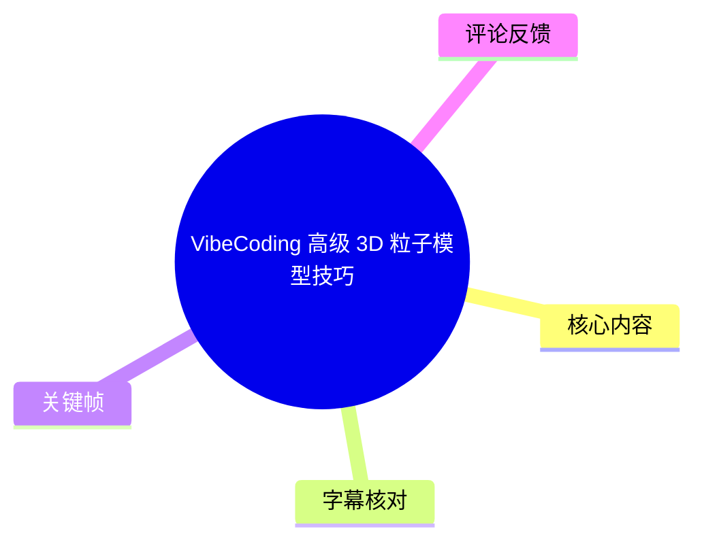
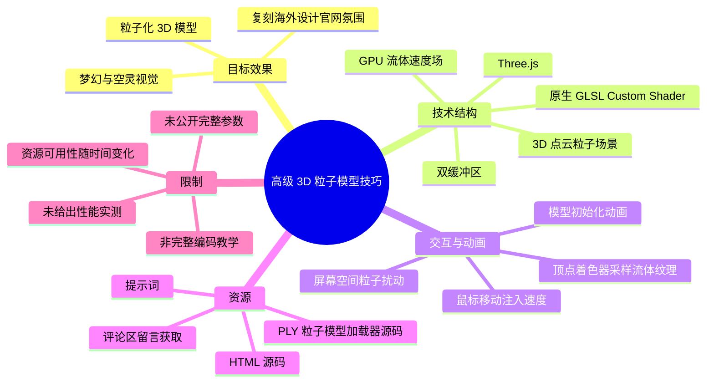
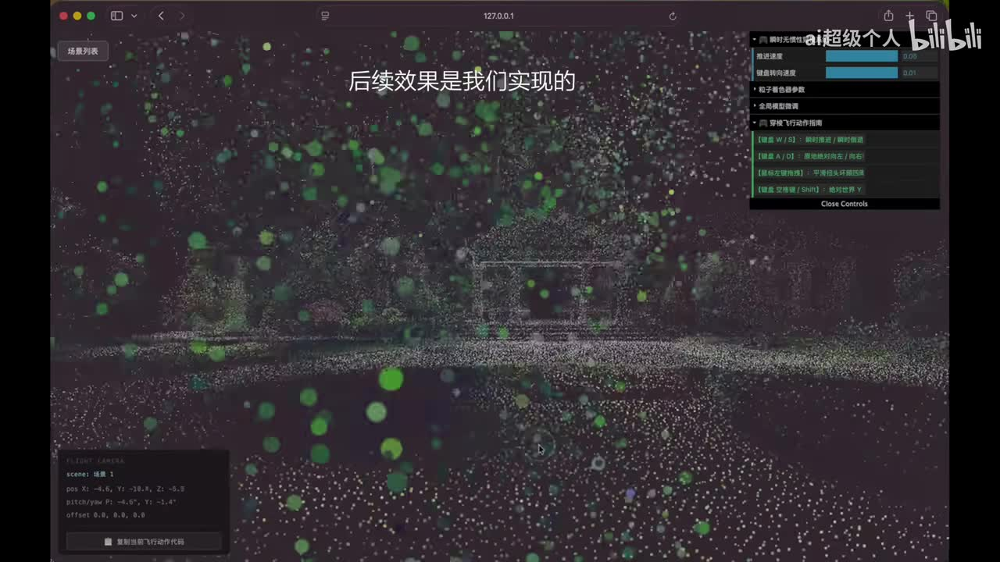
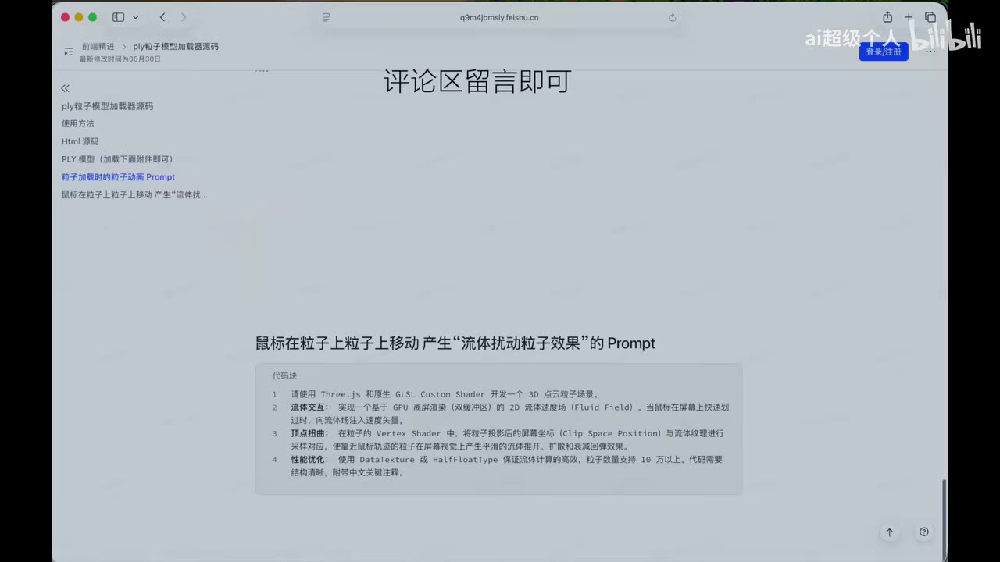

# VibeCoding 高级 3D 粒子模型技巧

> 来源：[Bilibili 视频](https://www.bilibili.com/video/BV1gfTj6pEze) 
> UP 主：ai超级个人｜视频时长：1 分 01 秒｜分辨率：1920×1080 
> 视频简介：探索实现海外高级 3D 粒子网站效果的方法和技术原理。

## 小结

视频展示了一种用于网页视觉设计的 **3D 粒子化模型 / 点云粒子场景**：以粒子构成三维模型或空间结构，整体呈现梦幻、空灵的动态氛围。UP 主将其定位为对“海外顶尖设计师官网”视觉效果的复刻，并称后续展示的效果均有源码。

从视频画面与配套文档页可确认，方案的技术栈指向 **Three.js + 原生 GLSL Custom Shader**。其中，鼠标交互并非仅移动相机：画面中的提示词明确要求通过 GPU 双缓冲的二维流体速度场（Fluid Field）接收鼠标移动注入，并在顶点着色器中读取流体纹理，令鼠标轨迹附近的粒子产生扰动。

视频还提及两个可附加的效果：其一是粒子化的 3D 模型；其二是 3D 模型初始化时的动画。UP 主称文档中提供了相应提示词，源码中也包含相关实现；视频末尾展示的文档页面则说明，获取方式是“评论区留言即可”。

适合已有基础 WebGL / Three.js 使用经验、希望用 AI 编程（Vibe Coding）快速搭建高表现力官网首屏或交互艺术效果的开发者与设计师。该视频是效果导览和资源引导，不是从零编码教程：没有逐行代码、项目依赖版本、模型处理流程、性能实测数据或完整调参说明。

时效方面，视频元数据抓取于 2026-07-13；展示的文档页面标注“最新修改时间为 06 月 30 日”。源码与文档的实际可访问性、提示词内容、依赖版本及资源发放规则都可能随后变化，应以原视频评论区或 UP 主当前提供的材料为准。

## 思维导图

## 目录

- [背景与展示目标](#背景与展示目标-0000)
- [成品效果与交互构成](#成品效果与交互构成-0005)
- [技术原理：点云、Shader 与流体扰动](#技术原理点云shader-与流体扰动-0020)
- [资源与复现步骤](#资源与复现步骤-0040)
- [参数、限制与时效性](#参数限制与时效性-0054)
- [字幕比对](#字幕比对)
- [评论分析](#评论分析)
- [处理记录](#处理记录)

## 背景与展示目标 [00:00](https://www.bilibili.com/video/BV1gfTj6pEze?t=0)

视频开场将内容定义为一个“高级 Web Coding 技巧”，核心是实现具有高级感的 3D 粒子网站视觉。UP 主先让观众观看成品，再说明参考对象是“海外顶尖设计师的官网”；“顶尖”是视频中的主观评价，而非本记录可独立验证的排名或行业事实。

视频的目标不是解释某个特定海外网站的全部页面架构，而是聚焦其可迁移的视觉语言：

1. 使用大量细小粒子构成空间中的主体或轮廓。
2. 通过粒子密度、景深感、明暗与颜色变化营造空灵氛围。
3. 让用户鼠标移动对局部粒子产生实时扰动。
4. 让模型首次加载时带有单独的入场 / 初始化动画。

前置知识方面，若要将视频中的信息落地，至少需要能理解 Three.js 的场景、相机、几何体与渲染循环，并对 GLSL 顶点着色器、纹理采样及 GPU 计算有基本认识。视频未说明是否使用 React、Vite、React Three Fiber 或特定 AI 编程工具；标签虽包含 Claude、Gemini、Codex，但不能据此推断实际实现使用了其中任一工具。

## 成品效果与交互构成 [00:05](https://www.bilibili.com/video/BV1gfTj6pEze?t=5)

UP 主展示的成品由粒子化三维结构、前景漂浮颗粒和可操作的调试面板组成。画面中可见深色背景下的浅色点云及较显眼的绿色粒子，粒子既形成主体的空间轮廓，也形成前后层次不同的悬浮效果。

> 图：该关键帧直接呈现了粒子模型的空间层次、绿色前景粒子与右上角控制面板。它说明视频所谈的并不是静态图片滤镜，而是包含粒子场景、相机控制与可调交互强度的实时网页效果；左下区域也可见相机状态信息。

视频口述及画面共同能确认的互动结构包括：

- **粒子化 3D 模型**：UP 主称已准备可分享的 demo。
- **模型初始化动画**：UP 主称文档中有对应提示词，源码内也有实现。
- **鼠标扰动**：鼠标移动时，粒子会产生扰动；视频将其作为成品体验的重要组成。
- **相机控制**：关键帧的控制说明中可辨识出 `W / S` 与 `A / D` 按键对应相机移动方向，另有 `Space / Shift` 相关控制提示；但画面文字较小，无法可靠确认每一个方向、速度或按键映射，不能将其扩展为精确操作说明。
- **调试参数面板**：画面右上存在多项滑块/开关型控制项，其中可见数值 `0.06`、`0.01`。由于标签文字在关键帧中无法完全辨清，本记录不将其断言为具体参数名或推荐值。

## 技术原理：点云、Shader 与流体扰动 [00:20](https://www.bilibili.com/video/BV1gfTj6pEze?t=20)

UP 主表示会“源码里解其底层的实现”。虽然视频没有完整展开代码，但结尾展示的文档提示词补充了明确的技术要求。可确认的实现链条如下。

### 1. Three.js 与原生 GLSL 自定义着色器

文档中要求“使用 Three.js 和原生 GLSL Custom Shader 开发一个 3D 点云粒子场景”。这意味着核心不是把模型表面直接作为常规网格材质渲染，而是以点（points / particles）的形式处理大量顶点或采样点，并通过自定义 Shader 决定其位置、大小、颜色和运动方式。

在这一结构中：

- **Three.js** 负责场景、相机、渲染器、几何数据与纹理资源的组织。
- **GLSL 顶点着色器** 适合实时修改每个粒子的顶点位置。
- **片元着色器** 可用于控制粒子外观；但视频和提示词未展示具体片元 Shader 逻辑，不能断定其采用了圆点、精灵图、噪声或特定混色算法。
- 展示文档的标题为“ply粒子模型加载器源码”，并列出“PLY 模型（加载下面附件即可）”。据此可知，该资源面向 PLY 模型加载，而不是视频中已明确展示了所有通用模型格式。

### 2. 鼠标输入转换为流体速度场

文档提示词要求实现“基于 GPU 高精度（双缓冲区）的 2D 流体速度场（Fluid Field）”。其可理解为：不让鼠标坐标直接、硬性地位移某个粒子，而是先把鼠标快速移动形成的速度写入一张二维速度纹理，再令粒子读取这一场，使作用结果具有扩散、拖曳或流体般连续的运动感。

提示词中可确认的要点包括：

- 鼠标快速移动时，向流体场注入速度矢量。
- 流体场采用 GPU 计算。
- 该流体场标注为“高精度（双缓冲区）”。
- 双缓冲意味着计算通常需要在两套纹理状态之间交替读写；视频未给出具体 FBO、RenderTarget 或迭代次数配置。
- 该场是 **二维** 的，适合作为屏幕投影平面的交互数据，而不是视频中已被证明的三维 Navier–Stokes 体积流体模拟。

### 3. 屏幕空间采样与顶点扭曲

文档提示词进一步要求：在粒子的 Vertex Shader 中，将粒子投影后的屏幕坐标（Clip Space Position）与流体纹理进行采样交互，使靠近鼠标轨迹的粒子发生屏幕投影层面的扰动。

这一设计有一个重要意义：粒子是否受到影响，不只取决于它在三维世界坐标中离鼠标射线多近，也与它投影到屏幕之后的位置有关。因此，无论模型如何旋转或相机如何变化，交互效果都可相对自然地贴合用户看到的画面区域。

> 图：该关键帧显示了“PLY粒子模型加载器源码”文档、评论区留言获取提示，以及“鼠标在粒子上移动产生‘流体扰动粒子效果’的 Prompt”。下方提示词明确出现 Three.js、GLSL Custom Shader、GPU 双缓冲区二维流体速度场、Vertex Shader、Clip Space Position、DataTexture / HalfFloatType 和“10 万以上”粒子等技术关键词，是本视频技术细节最集中的证据。

### 4. 性能目标与数据纹理

文档提示词建议使用 `DataTexture` 或 `HalfFloatType`，并提出“粒子数量支持 10 万以上”的目标。

需要严格区分：

- **视频 / 文档陈述**：提示词要求或期待系统支持 10 万以上粒子。
- **不能据此得出的结论**：视频没有给出设备型号、浏览器、帧率、显存占用、真实可稳定渲染粒子数量、纹理尺寸或降级策略。因此“10 万以上”不是已经被视频实测证明的跨设备性能结论。
- **实际影响因素**：粒子数量、渲染分辨率、流体纹理精度、流体迭代次数、透明混合、移动端 GPU 能力、浏览器 WebGL / WebGL2 支持情况，都会影响最终性能。

## 资源与复现步骤 [00:40](https://www.bilibili.com/video/BV1gfTj6pEze?t=40)

视频没有演示完整的下载安装、命令执行或代码粘贴过程。依据 UP 主口述和文档画面，可整理出不超出素材范围的复现路径。

### 视频明确给出的资源线索

1. UP 主称粒子化 3D 模型有 demo 可分享。
2. 文档页面标题为“ply粒子模型加载器源码”。
3. 文档列有“使用方法”“Html 源码”“PLY 模型（加载下面附件即可）”等条目。
4. 文档有“粒子加载时的粒子动画 Prompt”相关内容。
5. 针对鼠标交互，文档给出“鼠标在粒子上粒子上移动产生‘流体扰动粒子效果’的 Prompt”。
6. 页面中央明确写有“评论区留言即可”，这是视频中展示的获取渠道。

### 建议的实现顺序

以下顺序是基于视频所展示模块关系进行的工程化整理，不代表 UP 主已逐步演示过每一步。

1. **获取资源并确认格式**  
   按视频展示的方式，在评论区留言获取 demo / 源码；准备文档所述的 HTML 源码及 PLY 模型附件。若资源未获得，视频本身不足以重建同款项目。

2. **建立基础点云场景**  
   使用 Three.js 创建渲染器、场景和相机；加载 PLY 数据后，将顶点或采样数据组织为点云粒子。视频未披露相机位置、点大小、模型缩放或颜色配置，应从获得的源码中查看。

3. **接入自定义 Shader**  
   使用 GLSL 顶点着色器处理粒子位置，将必要的时间、鼠标、分辨率、流体纹理等数据作为 uniform 传入。具体 uniform 名称、坐标归一化方式和扰动公式未在视频中公开。

4. **先实现模型初始化动画**  
   依据文档对应 Prompt 或源码，让粒子从初始状态过渡至目标模型形态。视频只确认存在这项动画，没有说明是随机散点聚合、缩放渐现、噪声消散还是其他动画类型。

5. **构建二维 GPU 流体速度场**  
   为鼠标快速移动产生的速度建立二维纹理状态，并通过双缓冲更新。应在鼠标移动时注入速度矢量，而不是只记录鼠标的绝对位置。

6. **在顶点着色器采样流体场**  
   将粒子变换到裁剪空间（Clip Space）或与之对应的纹理坐标后，从流体纹理采样扰动；将结果作用到粒子位置，形成鼠标附近的局部动态响应。

7. **以性能为约束进行调试**  
   以实际目标设备测试粒子量和流体纹理精度。可优先检查 `DataTexture` / `HalfFloatType` 的可用性，并为不支持相应能力的设备准备粒子数或效果复杂度的降级策略；这一降级策略是工程建议，视频未提供现成方案。

## 参数、限制与时效性 [00:54](https://www.bilibili.com/video/BV1gfTj6pEze?t=54)

### 可确认的参数与指标

| 项目 | 视频 / 文档中可确认的信息 | 说明 |
| --- | --- | --- |
| 视频时长 | 61 秒 | 单 P，1920×1080。 |
| 模型资源 | PLY 模型 | 文档页面明确提及 PLY 模型附件。 |
| 场景类型 | 3D 点云粒子场景 | 文档提示词明确提出。 |
| 核心渲染技术 | Three.js + 原生 GLSL Custom Shader | 文档提示词明确提出。 |
| 交互计算 | GPU 二维流体速度场 | 提示词注明 Fluid Field。 |
| 状态更新 | 双缓冲区 | 提示词明确标注“高精度（双缓冲区）”。 |
| 纹理 / 精度建议 | `DataTexture` 或 `HalfFloatType` | 提示词提出的优化建议。 |
| 粒子规模目标 | 10 万以上 | 提示词中的目标要求，非视频实测成绩。 |
| 可见调试数值 | `0.06`、`0.01` | 位于控制面板，但参数标签无法可靠辨认。 |

### 视频未覆盖的关键限制

- 未给出完整源码、Prompt 全文或资源下载地址；仅展示了获取提示。
- 未说明 PLY 模型的顶点数量、是否进行重采样、是否保留颜色属性及加载错误处理。
- 未说明 WebGL 版本、浏览器兼容性、移动端支持与纹理浮点能力检测。
- 未提供实际帧率、GPU 占用、内存使用、压力测试设备或 10 万粒子性能证明。
- 未展示流体算法的衰减、扩散、粘度、分辨率、注入半径、注入强度等决定视觉效果和性能的参数。
- 调试面板上的滑块存在，但关键帧不足以可靠识别其完整名称与全部取值范围。

### 时效性说明

视频发布时间的 Unix 时间戳为 `1782979279`，换算为 UTC 为 2026-07-02 08:07:59；元数据抓取时间为 2026-07-13。文档画面显示“最新修改时间为 06 月 30 日”，但没有展示年份与精确时区。资源获取依赖评论区留言，意味着 demo 是否仍发放、附件是否仍可下载、源码是否更新，都不能由本视频永久保证。

## 字幕比对

| 字幕来源 | 完整性 | 专有名词 | 时间轴 | 主要问题 |
| --- | --- | --- | --- | --- |
| Bilibili 站内字幕 | 未提供可用字幕 | 无法核验 | 无可用时间轴 | 素材中未提供可用站内字幕，无法用于转写或交叉校对。 |
| 本次 ASR 字幕 | 覆盖视频口述主体 | 存在明显识别错误 | 提供的是无逐句秒级标记文本 | 对“Web Coding”“源码”“3D 模型”等主体内容可用，但部分词语误识别，且未转录画面文档中的技术细节。 |

本次任务已经执行 ASR。由于没有可用站内字幕，正文以 **本次 ASR 字幕为口述基础**，再以两个关键帧的可见文字和上下文进行校正与补充。

重要校正如下：

| ASR 文本 | 正文采用表述 | 校正依据 |
| --- | --- | --- |
| “高级web coding技巧” | 高级 Web Coding 技巧 | 口述语境与视频标题一致。 |
| “所以版是我复刻的效果” | “所以这是我复刻的效果” | 结合前文“海外顶尖设计师的官网”的语义校正。 |
| “原码的冰铁力解其底层的实现” | 源码及其底层实现 | ASR 此处音近误识别，无法恢复逐字原话，按上下文谨慎概括。 |
| “这个效果其中粒子化的” | 粒子化的 3D 模型 | 后续口述明确接“3D模型”，关键帧也显示点云模型。 |
| “我们圆码里头也有” | 源码里也有 | 上下文为初始化动画的实现。 |
| 未转录技术提示词 | Three.js、GLSL、Fluid Field、双缓冲、DataTexture、HalfFloatType 等 | 由 `frames/frame-002.jpg` 中可见文档文字补充，非 ASR 直接识别结果。 |

## 评论分析

仅处理素材中可获取的热评前三条。三条评论点赞数均为 1，且均未提供技术细节、复现反馈或源码有效性的验证，因此只能反映有限的观看者需求，不能作为资源一定可获得的证据。

| 排名 | 评论者 | 评论内容 | 分析 |
| --- | --- | --- | --- |
| 1 | unbias | “求个demo” | 直接请求 demo，表明观众关注可运行资源而非单纯效果展示；没有提供额外技术信息。 |
| 2 | 指南针ky | “求demo” | 与第一条诉求一致，侧面说明 demo 是观众最关心的交付物；不构成 UP 主已回复或已发放资源的证明。 |
| 3 | 嚄u- | “求demo” | 同样是资源请求，未包含争议、补充教程或使用体验。 |

三条热评高度同质：都在索取 demo。这与视频末尾文档中“评论区留言即可”的画面相呼应，但素材没有提供 UP 主回复、私信记录或下载链接，因此不能确认这些请求是否已经得到满足。

## 处理记录

- Worker ID：worker-mrj0wjed-b0c290ad
- 调用模型：gpt-5.6-terra
- 使用的应用工具：视频元数据读取、素材清单读取、ASR 字幕读取、关键帧视觉核验、热评 JSON 读取。
- 字幕选择：站内字幕未提供可用版本；本次 ASR 已执行并作为口述内容的主要依据。对 ASR 明显误识别处结合上下文校正；技术细节以关键帧中的文档文字补充。
- 关键帧选择依据：
  - `frames/frame-001.jpg`：展示实际粒子化三维场景、色彩层次、控制面板和相机状态，是理解目标视觉与交互存在性的直接证据。
  - `frames/frame-002.jpg`：展示 PLY 资源页、评论区获取方式以及鼠标流体扰动 Prompt，包含 Three.js、GLSL、GPU 双缓冲、Clip Space、DataTexture / HalfFloatType、10 万粒子等关键技术信息。
- 评论范围：仅分析可获取热评前三条，未扩展至其余 88 条回复。
- 缓存清理：未提供可执行的缓存清理工具或清理结果；本记录未声明已清理素材缓存。
- 未解决问题：完整源码、Prompt 全文、模型附件、具体调试参数、浏览器兼容性、性能测试条件及评论区资源发放状态均未在给定素材中完整提供。
