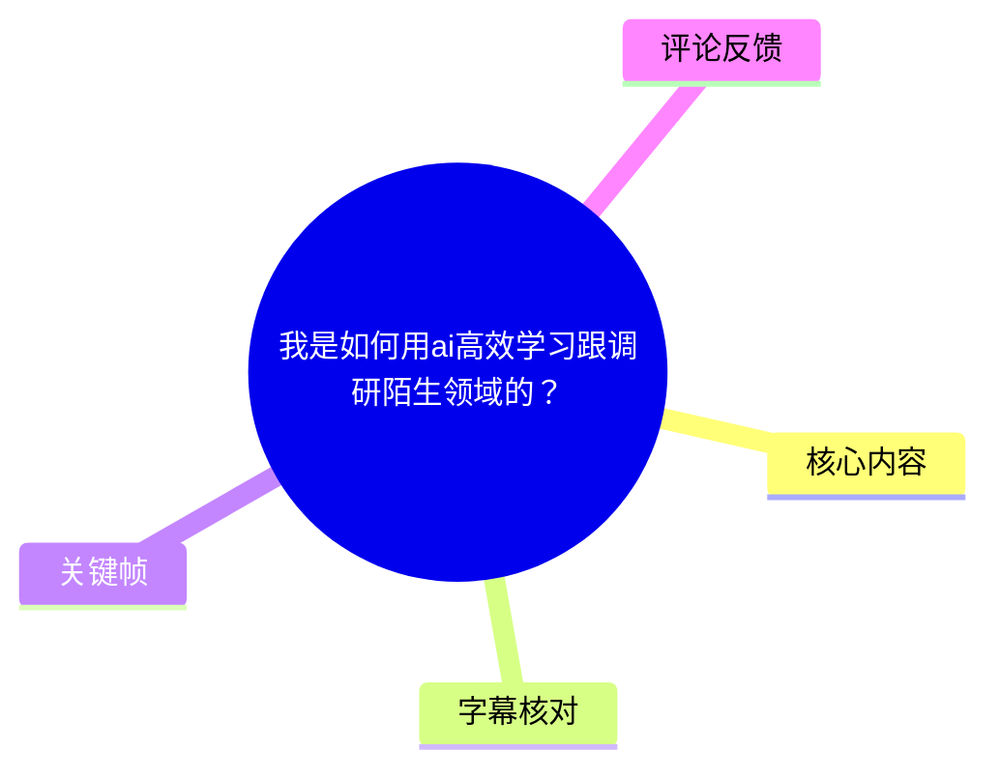
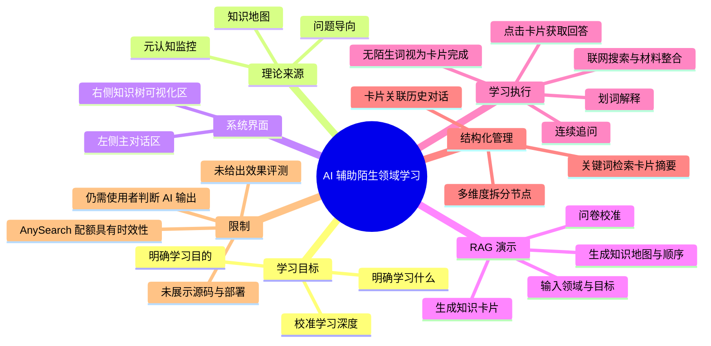
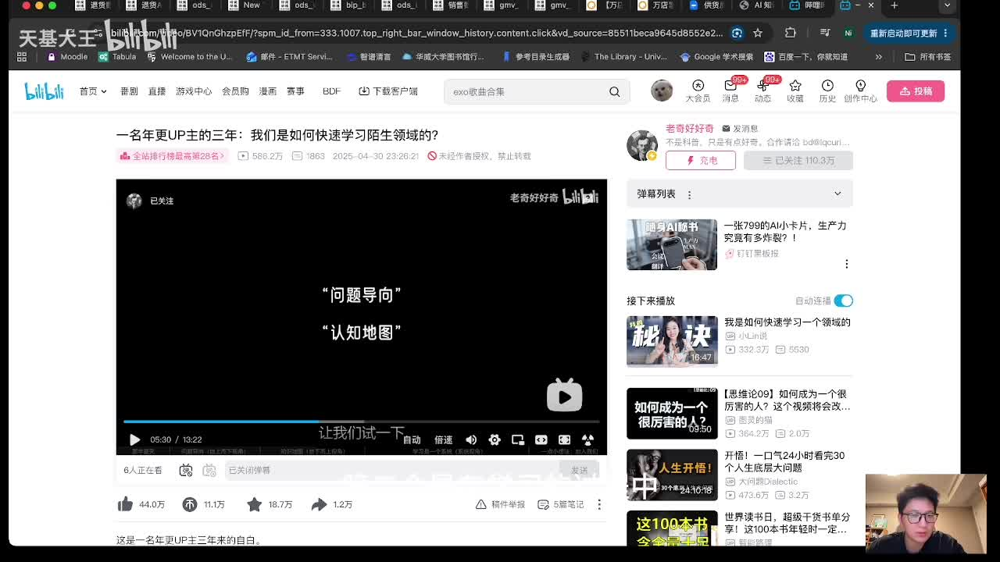
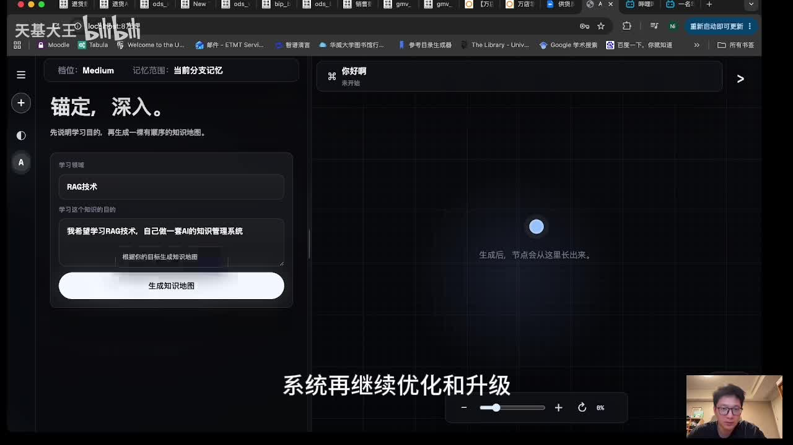
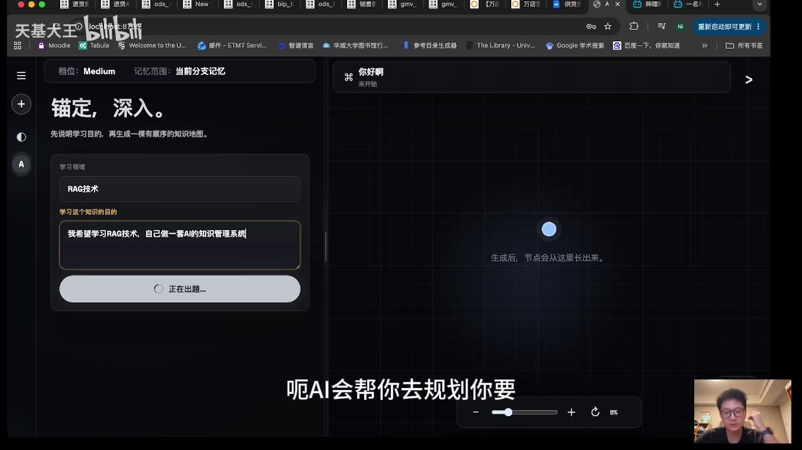
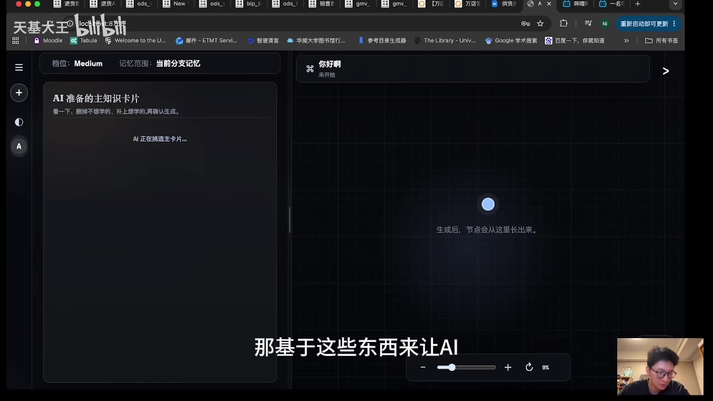

# 我是如何用 AI 高效学习跟调研陌生领域的？

> 来源：[Bilibili 视频](https://www.bilibili.com/video/BV1GcGX6iEUG) 
> UP 主：天基大王｜发布时间：2026-05-28｜视频时长：11 分 22 秒｜分辨率：1280×720  
> 标签：AI、人工智能、学习、教程

## 小结

视频展示了一套由 UP 主自行制作的、用于学习和调研陌生领域的 AI 辅助系统。其目标不是让 AI 直接替代知识理解，而是将“下一步该学什么、学到多深、何时继续拆分”等决策工作尽量交给 AI，使使用者把注意力集中在理解具体知识点上。

系统的学习框架来自三个方向：**问题导向**、**知识地图**与**元认知监控**。视频中，UP 主将其实现为“左侧对话区 + 右侧知识树可视化区”的界面：先填写学习领域与学习目的，经由问卷校准目标和深度，再生成主知识卡片、知识地图及学习顺序。

演示以 **RAG（检索增强生成）技术**为例。用户希望学习 RAG，以继续升级现有系统，并最终让它成为可检索既有学习内容的个人 AI 知识管理系统。系统会围绕用户的已有基础、目标与知识需求生成地图；点击卡片后，AI 会结合预设提示词、联网检索、科研文章及咨询报告等材料组织回答。

视频特别强调两项降低学习阻力的能力：其一是**划词解释与连续追问**，用来在当前上下文中逐层澄清术语；其二是让 AI 按不同维度拆分知识节点，例如按技术路线、构建步骤、典型场景或核心组件拆分 RAG 工作流。前者避免对话被新提问“冲走”，后者降低自行绘制思维导图时的拆分决策成本。

需要注意，这是一段产品演示而非完整部署教程：视频没有公开代码仓库、模型、提示词全文、技术架构、数据存储策略、隐私措施或实际评测结果。UP 主称系统是自己做的开源系统，但本素材未提供项目地址，因此不能据此确认其开源状态、可用性与维护情况。

联网搜索部分提到了 GitHub 开源项目 **AnySearch**，并称其“每天有一千次 API 调用、搜索质量较高”。这属于视频中的使用者陈述，受项目版本、服务策略、账户额度和 API 规则影响，具有明显时效性；截至本视频素材所反映的时间，不能将其视为长期固定参数。

## 思维导图

## 目录

- [背景：把学习路径决策外包给 AI](#背景把学习路径决策外包给-ai)
- [系统定位与 RAG 示例目标](#系统定位与-rag-示例目标)
- [学习前校准：领域、目的与深度](#学习前校准领域目的与深度)
- [知识地图生成与卡片学习流程](#知识地图生成与卡片学习流程)
- [联网检索、上下文解释与完成标准](#联网检索上下文解释与完成标准)
- [核心方法：多维度拆分知识节点](#核心方法多维度拆分知识节点)
- [检索与心流：系统带来的学习体验](#检索与心流系统带来的学习体验)
- [可复用操作流程](#可复用操作流程)
- [参数、限制与时效性](#参数限制与时效性)
- [字幕比对](#字幕比对)
- [评论分析](#评论分析)
- [处理记录](#处理记录)

## [背景：把学习路径决策外包给 AI](https://www.bilibili.com/video/BV1GcGX6iEUG?t=0)

视频开头，UP 主说明该项目在其个人学习中提供了较大帮助，并说明设计灵感来自另一位 UP 主的视频。其归纳出的学习原则有三项：

1. **问题导向**：学习应从要解决的问题出发，通过不断拆解，找到能力范围内可以处理的更小问题。
2. **认知／知识地图**：学习不能只有线性问答，还应拥有较清晰的概念结构与知识关系。
3. **元认知机制**：学习者需要观察自己的学习状态，并调整后续学习方向。

UP 主的产品化处理方式是：把“学什么、下一步去哪学、是否还要继续深入某一知识点”等过程性决策交给 AI，自己把更多脑力放在理解知识点本身。视频没有声称 AI 能保证答案正确；其重点是减少学习路线规划与界面操作造成的认知负担。

> 图：画面展示 UP 主浏览一段强调“问题导向”“认知地图”的视频，是理解本系统理论来源的关键帧。它表明本视频并非只介绍某个检索工具，而是尝试把一套学习方法转化为产品流程。

## [系统定位与 RAG 示例目标](https://www.bilibili.com/video/BV1GcGX6iEUG?t=71)

UP 主使用 RAG 作为完整演示案例。其设定的学习目标不是泛泛地“了解 RAG”，而是：

- 学习 RAG 技术；
- 将其用于优化、升级当前制作的系统；
- 长期目标是把系统做成一套 AI 知识管理系统；
- 除了带领自己学习，还能在之后快速检索自己已学习过的知识点和领域。

这个例子体现了视频的前提：系统需要的不仅是一个主题名称，还需要一个**明确的使用目标**。目标会影响系统建议的学习深度、知识卡片与后续路径。

界面被设计为类似 ChatGPT 的双栏布局：

- **左侧**：主对话区，用于与 AI 对话、阅读回答、追问术语；
- **右侧**：可伸展的知识树／知识地图可视化区，用于呈现节点、结构及学习顺序。

> 图：左侧表单中可见“学习领域：RAG 技术”及学习目的，右侧为等待生成节点的知识图谱画布。该画面直接说明系统将抽象学习目标转化为可视化路径的入口。

## [学习前校准：领域、目的与深度](https://www.bilibili.com/video/BV1GcGX6iEUG?t=100)

UP 主认为，在进入陌生领域前至少要先回答两个问题：

1. **要学什么？**
2. **学习目的是什么？**

在此基础上，AI 通过问卷进一步校准学习流程与涉及的知识点。视频演示中，问卷会询问或允许使用者选择的信息包括：

- 希望只了解概念，还是学习到更深入的程度；
- 对 RAG 设计的优先考虑；
- 是否了解 RAG 与知识库管理系统之间的关系；
- 对哪些框架更熟悉，例如视频中提到的 **LangChain**。

因此，系统生成知识地图并非只依据单个关键词，而是试图结合目标、深度偏好与已有基础。画面上还显示“档位：Medium”“记忆范围：当前分支记忆”，但视频未解释这些选项背后的具体模型配置、上下文长度或计费逻辑，不能据此推断其技术参数。

> 图：画面左侧显示“AI 准备的主知识卡片”及“AI 正在挑选主卡片”，右侧等待知识树生成。这一帧有助于理解：问卷并非最终产物，而是生成学习主节点前的校准环节。

## [知识地图生成与卡片学习流程](https://www.bilibili.com/video/BV1GcGX6iEUG?t=178)

在用户确认学习需求后，AI 会列出需要学习的相关知识点，使用者确认后生成知识地图。UP 主将知识地图描述为：

- 由若干**主知识卡片**构成；
- 每张主卡片可进一步拆分为细分领域；
- 地图用于呈现“需要学哪些内容”；
- 同时呈现这些内容的**先后顺序**。

当使用者想学习某张卡片，例如“RAG 定义与动机”时，可直接点击该卡片。系统会把两类信息送入 AI：

1. UP 主为该系统设计的提示词；
2. 与当前卡片相关的知识信息。

随后 AI 会联网搜索，并结合科研文章、咨询报告等来源来输出回答。视频提到麦肯锡类型的咨询报告只是其可能纳入的材料类别，未展示具体文章、引用列表或可复现的来源筛选规则。

这种结构的价值在于：对话内容不再是一次性、线性流逝的记录，而是被绑定到知识卡片与右侧地图中。学习者可以从卡片进入对话，也可以在之后从地图回到当时的学习记录。

## [联网检索、上下文解释与完成标准](https://www.bilibili.com/video/BV1GcGX6iEUG?t=243)

### 联网搜索能力

UP 主介绍其联网搜索功能使用了 GitHub 上较热门的开源项目 **AnySearch**。视频中的直接说法是：

- AnySearch 提供“每天一千次”的 API 调用；
- 搜索质量“比较高”；
- 该功能被用于检索与当前问题相关的文章。

同时，UP 主解释了演示中搜索响应较慢的原因：系统提示词设计得较长，希望回答质量更高，且要考虑全局对话背景。因此，视频呈现了一个现实权衡：**更长、更强调上下文的提示词可能增加响应时间**。但未提供响应时延、模型名称、token 数量、检索排序方式或质量对比数据。

### 划词解释与逐层追问

UP 主指出，普通 AI 对话中的痛点是：当自己另起问题追问某个术语时，原先对话容易被“冲走”。其设计的处理方式是：

1. 在回答中划选不理解的词语或专业名词；
2. 请求 AI 根据**当前语境**解释其含义；
3. 若仍不理解，再继续划词、继续追问；
4. 逐层消除本段对话中的陌生概念。

UP 主给出的个人完成标准是：当一段对话中划出的词都不再有生词，这一段内容才算真正理解；相应卡片才算学习完成。这是个人的学习判据，而非经研究验证的通用掌握测量方法。实际学习中，仍可能需要通过复述、练习、项目应用或外部验证检查理解是否牢固。

### 卡片与对话的双向定位

当一个卡片学完后，用户仍可通过右侧知识图找到该卡片，并使用“深入”功能定位回左侧相应对话框。系统由此兼顾了：

- 对话中的细节与上下文；
- 知识地图中的全局位置；
- 后续复习时的可追溯性。

## [核心方法：多维度拆分知识节点](https://www.bilibili.com/video/BV1GcGX6iEUG?t=492)

UP 主认为，系统中最重要的不是联网搜索，而是**拆分**。他此前也会在学习中手动做思维导图，但会面临两个主要决策成本：

- 一个知识点应在什么时机继续拆分；
- 应按什么角度拆分。

以“RAG 基本工作流程”为例，视频列举了多种可能的细分角度：

| 拆分角度 | 视频中的含义 |
| --- | --- |
| 技术路线 | 从不同实现或方案路径理解 RAG |
| 分类方法 | 按不同分类维度组织知识 |
| 构建步骤 | 按构建 RAG 的步骤推进 |
| 典型场景 | 以实际应用场景为轴展开 |
| 核心组件 | 以系统构成要素为轴继续细化 |

系统将“选择拆分维度”的决策交给 AI。例如，用户要求按照典型场景拆分时，AI 会生成子节点；若某个节点重要，还可以要求按核心组件等另一维度再拆一次。视频后段展示了对同一知识内容以不同维度进行拆分的过程。

> 图：左侧显示 AI 正在出题／生成内容，右侧为知识图谱画布；它体现了系统将学习输入转变为节点结构的动态过程。结合后段口述，可将其理解为多维拆分功能的界面基础，而非已经展示全部生成结果的最终画面。

这种方法的适用前提是：用户能判断哪个节点值得深挖，并能对 AI 给出的拆分结果进行取舍。AI 可以降低“从何处切入”的成本，但无法替使用者自动保证拆分粒度合理、覆盖完整或没有概念重叠。

## [检索与心流：系统带来的学习体验](https://www.bilibili.com/video/BV1GcGX6iEUG?t=640)

视频最后补充了系统的检索机制：用户输入关键词后，关键词会交给 AI；AI 检索每张卡片的摘要，并匹配最相关的卡片返回结果。按照视频描述，这属于对**知识卡片摘要**的检索，而不是对所有原始对话全文、所有外部资料或整个本地文件系统的检索。视频没有说明所用的向量模型、索引技术、重排策略、召回率或隐私边界。

UP 主对整套系统的总体评价是，它能够：

- 帮助更快进入心流状态；
- 减少被“接下来学什么”“要学多深”等决策打断；
- 让同一段对话中的问题被持续追问和梳理；
- 通过结构化知识图展示学习状态与学习历史。

这里的“更快进入心流”“不会被打断”是 UP 主基于个人使用体验的判断。视频未包含对照实验、用户样本或学习效果量化结果，因此应视为产品设计目标与主观经验，而非已验证的普适结论。

## [可复用操作流程](https://www.bilibili.com/video/BV1GcGX6iEUG?t=111)

若借鉴视频方法学习一个陌生领域，可按其演示顺序执行：

1. **定义学习主题**  
   输入具体学习领域，例如 RAG，而不是只写“AI”或“编程”。

2. **写清楚最终目的**  
   说明学习后要解决什么问题。视频案例是：为升级个人系统而学习 RAG，并建立后续可检索的个人知识管理能力。

3. **声明当前基础与目标深度**  
   根据问卷选择是了解概念还是深度学习，并补充已熟悉的工具或框架，例如 LangChain。

4. **确认 AI 生成的主知识卡片**  
   检查 AI 给出的学习内容是否与目标相符，再确认生成知识地图。这里不应完全照单全收；对于明显无关、过宽或重复的节点，应手动删改。

5. **按知识卡片学习**  
   点击一个具体卡片，让系统连同当前卡片信息与预设提示词发送给 AI，获取面向该节点的回答。

6. **使用检索补充外部材料**  
   使用联网搜索寻找相关资料。视频中的实现使用 AnySearch，但其额度与可用性需要在实际使用时重新确认。

7. **划词解释并持续追问**  
   对陌生术语在原对话语境下请求解释；如果解释本身仍有新概念，则继续分层追问。

8. **以“无未理解术语”为个人检查点**  
   视频把没有待解释生词作为卡片学习完成的条件。更稳妥的实践是再补充输出性检验，例如自己复述、写笔记、完成小实验或解决真实问题。

9. **需要深入时选择拆分维度**  
   对关键节点，可要求 AI 按技术路线、步骤、典型场景或核心组件等维度继续拆分；不要仅追求树越深越好，应服务于当前学习目的。

10. **通过关键词检索回溯内容**  
    后续输入关键词，从卡片摘要中定位相关节点，再进入其关联对话复习或继续学习。

## [参数、限制与时效性](https://www.bilibili.com/video/BV1GcGX6iEUG?t=267)

### 视频中明确出现的参数与条件

| 项目 | 视频信息 | 解读 |
| --- | --- | --- |
| 视频时长 | 682 秒 | 约 11 分 22 秒 |
| 示例主题 | RAG 技术 | 用于演示，不代表系统只支持 RAG |
| 示例已有基础 | LangChain | 问卷可据此校准路径 |
| 界面结构 | 左侧对话区、右侧知识树 | 用于同时保留局部语境与全局结构 |
| 记忆范围显示 | 当前分支记忆 | 仅见于界面，未解释具体实现 |
| 档位显示 | Medium | 仅见于界面，无法确认对应模型或能力 |
| 联网搜索项目 | AnySearch | UP 主称其为 GitHub 开源项目 |
| AnySearch 调用额度 | 每天 1,000 次 API 调用 | 视频陈述，需以实际服务规则为准 |
| 检索对象 | 每张卡片的摘要 | 视频未说明底层索引、向量或重排方案 |

### 未披露或尚未验证的内容

- 未提供系统源代码地址、部署地址、许可证或安装步骤。
- 未展示所调用的具体大模型、联网搜索 API 配置、提示词全文、数据库或存储格式。
- 未说明学习记录是否上传到第三方、如何处理隐私数据、是否支持导出或删除。
- 未提供 RAG 检索准确率、知识地图质量、响应速度、成本、并发能力等测评。
- 未展示 AI 生成错误、检索失败、资料冲突、幻觉回答或错误拆分时的校正机制。
- 没有证据表明“无生词”就等同于真正掌握，更不能替代实践与事实核验。

### 时效性提醒

本视频发布于 2026-05-28，素材抓取于 2026-07-16。AnySearch 的 API 配额、服务可用性、GitHub 项目状态，以及大模型与联网检索的实际表现都可能在之后变化。涉及第三方服务的价格、额度、模型版本和隐私政策，应以使用当日的官方信息为准。

## [字幕比对](https://www.bilibili.com/video/BV1GcGX6iEUG?t=0)

| 字幕来源 | 完整性 | 专有名词 | 时间轴 | 主要问题 |
| --- | --- | --- | --- | --- |
| Bilibili 站内字幕 `p01-ai-zh.srt` | 严重不完整，仅至 00:02:45 左右 | 与视频主题不匹配 | 有真实 SRT 时间戳，但对应内容错误 | 内容是“拥有强大力量”“敌人”“龙爪手”等影视对白，与本视频 AI 学习系统讲解无关 |
| 本次 ASR 字幕 | 覆盖约 584.53 秒语音，语音覆盖率约 85.82% | 存在错字，但可由上下文校正 | 有完整分段时间戳；首段 00:00:00.620，末段 00:11:19.860 | 将“项目、学习、知识、RAG、LangChain、AnySearch、拆分”等多处识别为近音或错字；段落间存在演示等待空档 |

本次 ASR 使用 `medium` 模型，识别语言为中文，语言置信度约为 `0.9912`；素材诊断中**没有** `noAudioStream=true` 标记，且 ASR 成功识别到连续讲解音频，因此不能将字幕问题归因于无音轨。

最终正文以**本次 ASR 的时间戳和内容**为主，并结合关键帧、视频标题、简介与上下文校正术语；站内字幕不作为内容依据，仅保留其“存在但与视频不匹配”的比对结论。重要校正包括：

| ASR 原始识别 | 正文采用 | 校正依据 |
| --- | --- | --- |
| REG / REG 技朱 | RAG / RAG 技术 | 视频主题与界面画面显示“RAG技术”，且语境为检索增强生成 |
| longchain | LangChain | AI 应用领域常见框架名称；ASR 语境为“对哪个框架熟悉” |
| AnySearch 的近音错写 | AnySearch | UP 主口述项目名，且上下文明确是 GitHub 搜索项目 |
| 拆封 | 拆分 | 后文反复说明按维度细分知识节点 |
| 联络搜所 | 联网搜索 | 口述功能与后续“搜索文章”语境一致 |
| 原认知 | 元认知 | 与视频简介中“元认知监控”一致 |

ASR 中存在三处较长空档，约为 00:03:38—00:03:52、00:09:35—00:09:44、00:10:28—00:10:40；结合视频性质，可谨慎理解为界面生成、等待或操作演示期间，但素材未逐帧提供这些时间段的明确说明，因此不对空档中的具体操作作额外推断。

## [评论分析](https://www.bilibili.com/video/BV1GcGX6iEUG?t=492)

本次素材要求获取热评前三条，但实际仅提供 **2 条可获取热评**；以下只分析这两条，不补造第三条。

### 1. 尼兰德罗（8 赞）

评论认为，开局就展示完整知识地图可能导致信息爆炸，因为用户会同时面对许多当前尚不需要了解的信息。该评论提出的替代关系是：

- 微观层面：先从最小问题出发，逐个解决；
- 宏观层面：在之后回顾时，再把解决问题过程中学到的概念结构化为知识地图。

这条评论直接指出了视频方案的一个设计张力：**全局结构的可见性**有助于规划，但过早、过密地展示结构也可能增加认知负担。它并未否定知识地图本身，而是建议将问题导向与知识地图按不同阶段结合。该观点属于用户体验与学习策略判断，视频没有提供实验数据可裁定哪种流程更优。

### 2. 立花奏で（8 赞）

评论提出“这不就是 Obsidian 的一个功能吗”。其核心是质疑视频系统与既有知识管理工具之间的差异性。

从本视频呈现内容看，系统确实与知识图谱、笔记链接、检索和对话记录组织等知识管理能力存在交叉；但视频还特别强调了 AI 驱动的学习前问卷、按目标生成知识卡片、基于不同维度自动拆分节点、卡片绑定上下文对话等流程。仅凭这条评论和本视频素材，无法确认其功能是否已被 Obsidian 原生功能完整覆盖，也无法判断两者在插件、自动化程度、数据结构和交互方式上的实际差异。因此，该评论可作为“应与成熟工具比较”的提醒，而不能作为已经验证的等同性结论。

## [处理记录](https://www.bilibili.com/video/BV1GcGX6iEUG?t=0)

- Worker ID：`worker-mrj0wjed-b0c290ad`
- 整理模型：`gpt-5.6-terra`
- ASR 模型：`medium`，CUDA / `float16`，自动语言识别为中文。
- 使用素材与工具产物：视频元数据、站内 SRT、ASR SRT、ASR 分段诊断、关键帧、热评 JSON；素材目录中包含合并视频、WAV 音频、帧提取、ASR、字幕与评论产物。
- 字幕选择：检查后弃用站内字幕作为正文内容来源；站内字幕与实际视频语义明显不符且仅覆盖前约 165 秒。正文采用本次 ASR 的真实时间戳，并以视频简介、上下文与画面校正专名及明显近音错误。
- 关键帧选择依据：选用 `frame-001.jpg` 说明理论灵感来源；选用 `frame-002.jpg` 说明 RAG 目标输入与双栏布局；选用 `frame-003.jpg` 说明问卷／主知识卡片生成过程；选用 `frame-004.jpg` 说明知识图谱生成状态。其余关键帧未在提供素材中附带可核验画面描述，未强行赋予具体含义。
- 评论处理：仅分析已获取的 2 条热评；可获取热评不足 3 条，未编造缺失评论。
- 缓存清理：素材未提供缓存清理执行记录；因此标记为**未记录／无法确认**，不作已清理声明。
- 未解决问题：系统源码与部署入口未提供；AnySearch 的实际额度、版本与服务状态未核验；系统所用模型、提示词、存储与隐私机制均未披露。

## 评论分析

- 热评 1：我似乎会觉得这种一开始就给你整个知识地图，然后让你一个板块一个板块去学的方式，很容易会觉得信息爆炸，因为一开始塞了太多你不需要知道的信息在你面前了，我也一直想探索如何兼顾问题导向（微观），知识地图（宏观）的学习方式，然后我觉得它们两的关系更像是我先从最小问题出发，一个一个解决，后面回顾的时候把解决这些问题所学到的概念再结构化成知识地图
- 热评 2：这不就是obsidian的一个功能吗

以上内容是观众反馈摘录，只用于补充理解视频反响，不作为正文事实依据。
