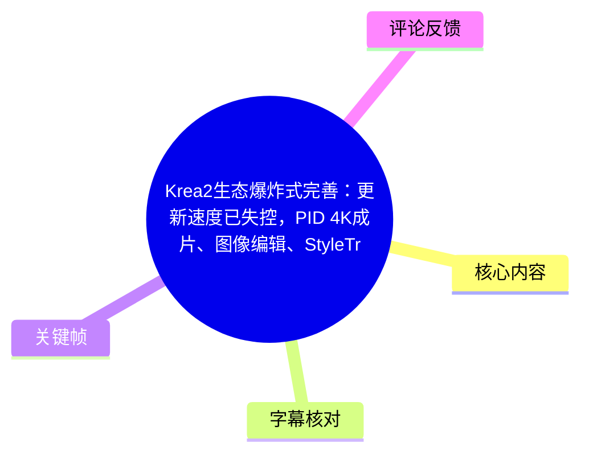
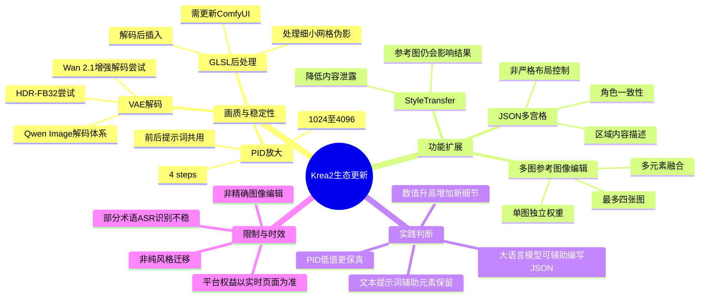
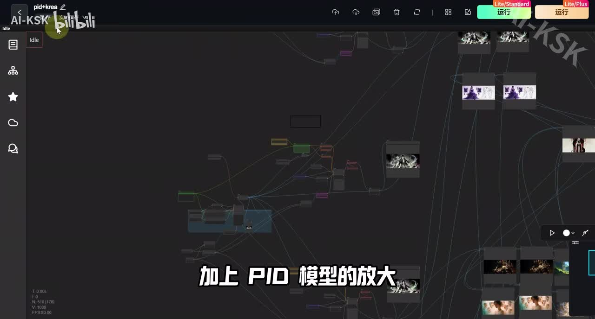
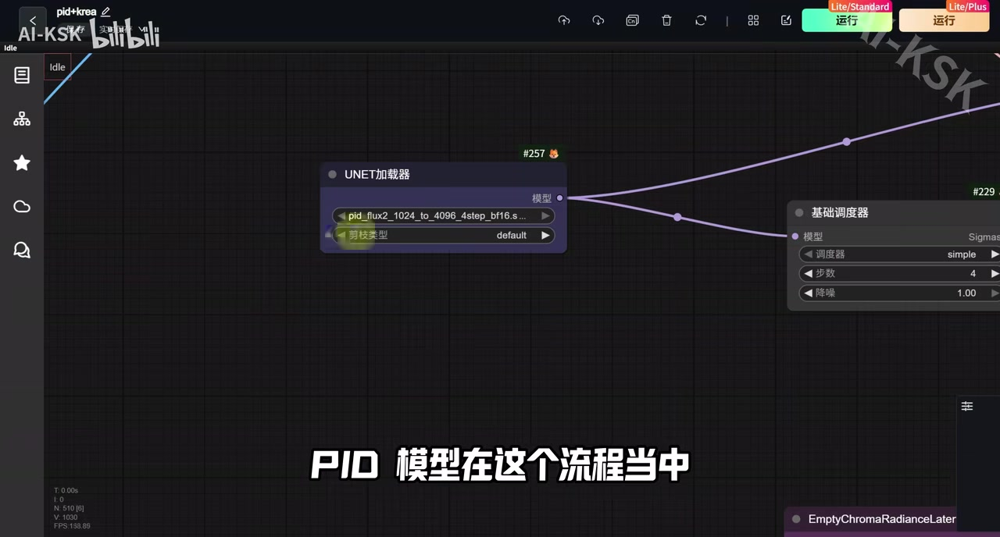
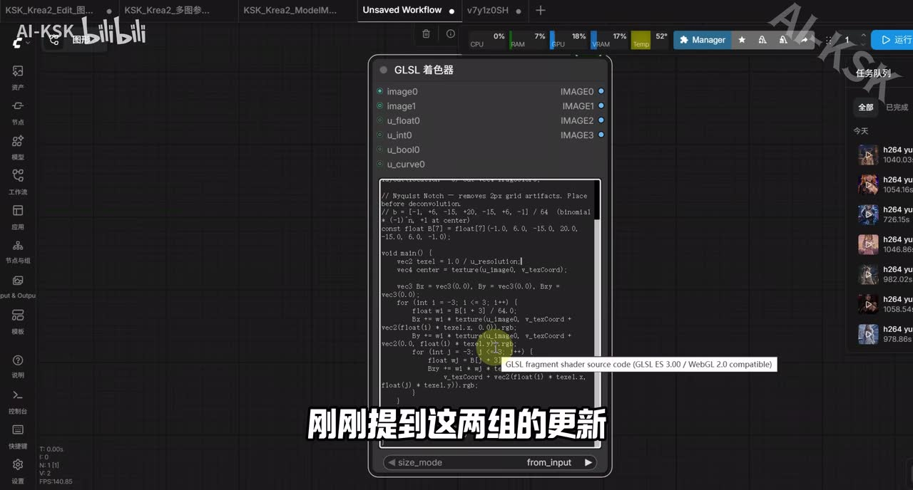
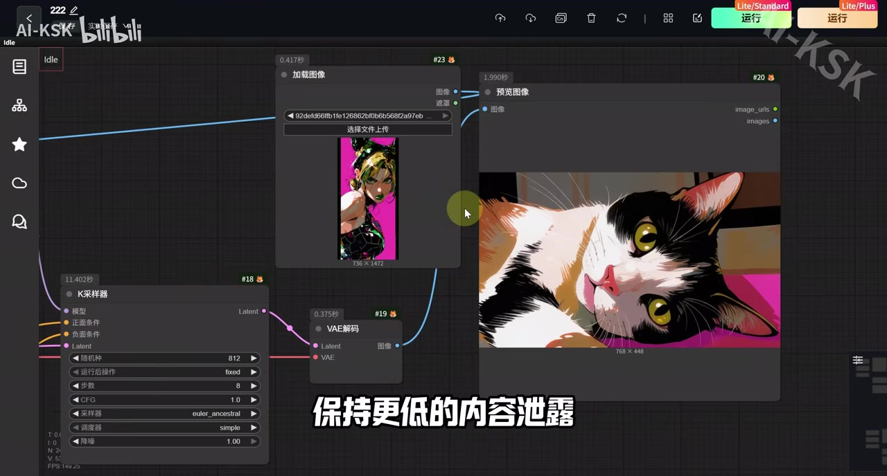

## 小结

本视频集中梳理了 **Krea2 生态近期的工作流更新**。作者将变化分成两条主线：一是以 **PID 四倍放大、VAE 解码优化、GLSL 着色器后处理** 为核心的画质与稳定性增强；二是以 **多图参考图像编辑、StyleTransfer 风格迁移、JSON 多宫格分镜** 为核心的功能扩展。

最具操作性的流程是：先用 Krea2 生成基础图，再接入 PID 放大模型，将 **1024 级输入放大至 4096**，演示工作流采用 **4 steps**。前后段共用提示词，因此快速启动时主要设置提示词、基础尺寸与画幅比例即可。作者建议优先测试与 Krea2 解码体系相近的 **Qwen Image PID** 路线，并尝试 HDR-FB32 VAE 或 Wan 2.1 增强解码模型改善颗粒和灰阶过渡。

在参考图控制方面，视频明确为“图像编辑”降温：它更接近最多四张参考图的**多元素融合与分层权重控制**，而不是精确局部编辑。StyleTransfer 则更偏向降低参考图具体内容向结果图的泄露；但作者指出，二者都会受到参考图内容影响，单节点测试不能等同于真正纯粹、稳定的风格迁移。若追求纯风格控制，仍更接近模型训练问题。

JSON 多宫格测试显示，Krea2 可接受 JSON 形式提示词，可用于描述多格分镜及局部区域内容，四格中的角色一致性也具备可行性。但作者同时说明，Krea2 并未针对层级式提示词做特殊训练，因此 JSON 应被视为结构化提示词组织手段，而非确定性的版式语言。

本期适合已有 ComfyUI 或节点式工作流基础，希望测试 Krea2 高分辨率出图、参考图融合、风格控制与分镜生成的创作者。模型版本、节点兼容性、在线工作流部署及平台促销均可能快速变化；视频中的效果判断主要来自作者测试体感，未提供统一基准测试、完整工作流 JSON 或全部参数文件。

## 思维导图

## 目录

- [更新背景与两条主线](#更新背景与两条主线)
- [PID × Krea2：四倍放大流程](#pid--krea2四倍放大流程)
- [VAE 解码与 GLSL 后处理](#vae-解码与-glsl-后处理)
- [PID 测试差异与细节控制](#pid-测试差异与细节控制)
- [JSON 多宫格分镜](#json-多宫格分镜)
- [多图参考图像编辑](#多图参考图像编辑)
- [StyleTransfer 风格迁移](#styletransfer-风格迁移)
- [线上流程、资源与时效信息](#线上流程资源与时效信息)
- [可复用操作步骤](#可复用操作步骤)
- [结论与限制](#结论与限制)
- [字幕比对](#字幕比对)
- [评论分析](#评论分析)
- [处理记录](#处理记录)

## 更新背景与两条主线 [00:00](https://www.bilibili.com/video/BV1U1TS6gEVe?t=0)

作者开场认为，Krea2 相关生态的完善速度已超过自己的视频更新速度。本期不是对单一模型的讲解，而是把围绕 Krea2 的多个节点、模型和在线流程集中整理。

视频将更新归纳为两类：

1. **稳定性与画质增强**
   - Krea2 与 PID 模型组合，用于高分辨率放大；
   - 调整 VAE 解码器，改善颗粒和灰阶过渡问题；
   - 图像解码后增加 GLSL 着色器，处理细小网格伪影后再进入后续流程。

2. **功能性拓展**
   - 图像编辑节点：增强图像参考控制、分层权重与多元素融合；
   - StyleTransfer 节点：更聚焦风格迁移，并尽量降低参考图内容泄露；
   - JSON 多宫格：用于分镜、多格角色一致性和局部画面描述。

“稳定性”是作者对成片可靠性与视觉质量的概括，并非视频中给出的量化工程指标。

> 图：该帧展示节点画布中的 `pid+krea` 工作流及多个输入输出分支。它的价值在于说明本期内容依赖一条多节点链路，而非仅替换一个基础模型。

## PID × Krea2：四倍放大流程 [01:00](https://www.bilibili.com/video/BV1U1TS6gEVe?t=60)

PID 模型在本流程中承担图像放大任务。作者称，流程可将图像由 **1024 放大至 4096**，即四倍边长放大；演示配置采用 **4 个步骤**。

### 快速启动方式

按视频描述，工作流的日常启动只需处理以下项目：

1. 加载提示词；
2. 提示词尽量符合 Krea2 模型规范；
3. 设置基础图尺寸和宽高比例；
4. 运行生成；
5. PID 后段直接复用前段提示词，无须再单独填写 PID 提示词。

因此，作者将“提示词 + 尺寸/比例”视为快速启动的主要可调项，PID 四倍放大已经作为后段默认结构存在。

### PID 版本选择

视频提到 PID 存在多个模型版本，ASR 可较可靠识别到：

- PID Flux 2 版本；
- PID Qwen Image 版本。

作者更推荐 **Qwen Image PID**。其理由是：图像进入 PID 流程时需要经过 VAE 编码，而 Krea2 使用 Qwen Image 解码器；在同一链路中使用 Qwen Image PID，他认为更合理。

这属于作者的组合经验，不应推导为 Qwen Image PID 在所有题材、参数与输入素材下都必然优于其他路线。

> 图：该帧可见 UNET 加载器中的 `pid_flux2_1024_to_4096_4step` 文件名，以及基础调度器的“步数 4”。它直接支撑视频关于“1024 至 4096、4 steps”的描述。

## VAE 解码与 GLSL 后处理 [01:35](https://www.bilibili.com/video/BV1U1TS6gEVe?t=95)

### VAE 的优化方向

作者认为颗粒感、灰阶过渡等问题，部分来自解码器环节。为提升解码质量，视频建议在 VAE 加载器处尝试 **HDR-FB32**。

此外，作者还提到：

- Wan 2.1 的解码器与 Qwen Image 解码器“互通”；
- 因而可以测试 Wan 2.1 的增强解码模型。

当前素材没有提供 HDR-FB32 的完整文件名、模型链接、版本信息或同条件对照图，因此这些内容应理解为待实际验证的搭配建议，而不是通用结论。

### GLSL 着色器的处理位置

GLSL 着色器被放在：

> 解码之后 → 后续处理之前

作者称该节点可处理细小网格伪影。视频表示会分享该节点及相关参数，并将节点放入夸克网盘；但当前提供素材没有完整 GLSL 代码与参数文本，无法据此复现。

使用前提是：**ComfyUI 需要更新到最新版本。**

> 图：该帧显示“GLSL 着色器”节点、多个图像输入输出端口和片段着色器代码编辑区。它说明 GLSL 是独立的图像后处理节点，而不是 Krea2 或 PID 的内置模型参数。

## PID 测试差异与细节控制 [02:20](https://www.bilibili.com/video/BV1U1TS6gEVe?t=140)

作者对不同 PID 路线的总体判断是：PID、Flux 相关版本和 Qwen Image 相关版本都能产生可用结果，但侧重点不同。

| 路线 | 视频中的作者评价 | 适合关注的方向 |
| --- | --- | --- |
| PID Qwen Image | 细节保持较好，清晰化程度更突出 | 细节、清晰度、纹理保留 |
| PID / Flux 2 | 放大后对风格化的保持较好 | 原画风格延续 |
| 其他未被 ASR 稳定识别的版本 | 作者称整体结果均不差 | 需自行确认模型名和实际效果 |

视频还提到 PID 流程中有一个控制细节增量的数值参数，但 ASR 未能可靠识别具体字段名称。可确认的行为关系是：

- 参数为 **0** 时，更接近原图；
- 参数提高至 **0.1、0.2** 或更高时，生成结果会增加更多细节；
- 数值越高，结果与原始图像的距离越大。

因此，该参数可理解为“原图保真度”和“新细节再生成”之间的平衡项。建议从 0 起测，在同一输入图、相同提示词下逐步提高数值，并检查新增细节是否造成角色、材质或构图漂移。

## JSON 多宫格分镜 [03:15](https://www.bilibili.com/video/BV1U1TS6gEVe?t=195)

视频讨论了多宫格图像生成与 JSON 提示词的可行性。

### 视频测试结论

作者进行了多组“多宫格 + JSON”测试，并给出以下观察：

- Krea2 支持 JSON 形式提示词；
- 四格画面中角色可以表现出一定一致性；
- JSON 可用于描述横向区域或画面局部应出现的内容；
- Krea2 并未针对层级式提示词做特殊训练。

因此，JSON 在这里更适合组织复杂提示词、描述多个分镜或画面区域，而不代表模型支持严格、确定的空间布局语法。

### 作者的使用建议

作者认为 JSON 的文字组织难度不高，交给大语言模型辅助编写即可；真正难点仍是画布控制和构图控制。

视频还提及 Krea2 对 X/Y 方向的处理方式更符合作者习惯，但没有给出完整 JSON 样例、字段定义或固定 Schema，本文不能补写具体格式。

一个可复用的保守做法是：

1. 从四格等分的简单分镜开始；
2. 在每格重复写入角色身份、发型、服装等稳定特征；
3. 分别补充每格动作、景别、背景和情绪；
4. 多次生成并筛选角色一致性；
5. 将 JSON 当作提示词模板，而非硬性排版指令。

## 多图参考图像编辑 [04:25](https://www.bilibili.com/video/BV1U1TS6gEVe?t=265)

作者特别提醒，不应对该“图像编辑”节点期待过高。它并未达到当前专用图像编辑模型的精确编辑能力，更接近一种可调权重的多图参考与元素融合方案。

### 输入数量与可调项目

视频称该节点最多可输入 **4 张图像**，演示实际使用了 **3 张图像**。需要设置的主要内容包括：

- 正向提示词；
- 反向提示词；
- 每张参考图在渲染过程中的权重。

作者观察到：某张图的权重越高，该图中的角色、外观或元素在结果中的相似度与一致性也越高。其体验接近早期 IP-Adapter 类参考图方案。

### 适用范围

适合：

- 混合人物、服装、动物、场景、物件等多个主体元素；
- 通过文本提示词进一步强调希望保留的内容；
- 用于创意融合、概念图和灵感探索。

不宜直接承诺：

- 对指定区域进行严格替换；
- 完整保留每张参考图中的全部元素；
- 获得专用编辑模型级别的稳定局部控制。

作者的最终定位是：该节点是有价值的创意性多元素参考工具，但不是成熟意义上的精确图像编辑方案。

## StyleTransfer 风格迁移 [05:40](https://www.bilibili.com/video/BV1U1TS6gEVe?t=340)

视频中的 StyleTransfer 节点需要额外加入图片作为风格参考，并可对 `reference1`、`reference2` 调整权重。

### 与多图参考编辑的选择关系

| 创作目标 | 视频建议的优先方案 |
| --- | --- |
| 希望参考图中的人物、物件、服装等元素更多进入结果 | 多图参考图像编辑，并在提示词中明确写出相关元素 |
| 希望较少带入参考图的具体内容，只借用视觉风格 | StyleTransfer |
| 希望获得真正纯粹、稳定、可复用的风格控制 | 倾向训练模型，而不是单节点单次测试 |

作者将 StyleTransfer 类比为 IP-Adapter 系列中更偏风格参考的方案，并推测该节点可能修改了模型注意力相关机制。该“注意力机制”说法是作者推测，当前素材没有模型结构、源码或权重说明，不能视为已验证技术事实。

### 核心限制

作者强调，图像编辑和 StyleTransfer 两条路径都会受到参考图内容影响。所谓“低内容泄露”是相对目标，并不意味着参考图中人物、物件或构图信息绝不会进入结果。

> 图：画面显示参考图加载、采样和输出预览，字幕为“保持更低的内容泄露”。该帧的价值在于说明 StyleTransfer 的目标是相对减少内容迁移，而非保证绝对纯风格。

## 线上流程、资源与时效信息 [06:35](https://www.bilibili.com/video/BV1U1TS6gEVe?t=395)

作者称视频对应的 AI 工作流及可一键启动的应用已部署在线上，可用于运行和测试。视频简介提供的相关入口包括：

- [RunningHub 注册入口](https://www.runninghub.cn/?inviteCode=rh-v1111)
- [快捷创作入口](https://www.runninghub.cn/ai-generator/2046514150500524034?inviteCode=rh-v1111)
- [Krea2 单图风格迁移](https://www.runninghub.cn/post/2073675891854630914/?inviteCode=rh-v1111)
- [Krea2 双参考风格迁移](https://www.runninghub.cn/post/2073700191701655554/?inviteCode=rh-v1111)
- [PID × Krea2 细节增强引擎](https://www.runninghub.cn/post/2073373288369319937/?inviteCode=rh-v1111)
- [Krea2 JSON 多宫格分镜](https://www.runninghub.cn/post/2073304573829275649/?inviteCode=rh-v1111)
- [Krea2 多图参考图像编辑](https://www.runninghub.cn/post/2073314422151540738/?inviteCode=rh-v1111)
- [Krea2 LoRA 页面](https://huggingface.co/ilkerzgi/fal-Krea-2-Style-LoRAs)

### 平台权益信息存在不一致

ASR 中出现“注册送 1200 HB、每日登录送 100 点”的表述；而视频简介写的是填邀请码可获得 **1000 RH 币**。两者的数额和单位不一致，且属于促销内容。

因此，注册奖励、每日奖励、会员折扣和模型价格均应以访问当日的平台官方页面为准，不应把视频口播或简介文本当作长期有效承诺。

视频还提到，当时线上环境可能尚未支持图像编辑和风格迁移，说明“流程已部署”不等于所有节点始终可运行。实际使用前应在目标流程页面确认功能状态。

## 可复用操作步骤 [01:00](https://www.bilibili.com/video/BV1U1TS6gEVe?t=60)

### 1. 构建 Krea2 基础生成段

1. 加载 Krea2 相关模型；
2. 输入符合 Krea2 使用习惯的提示词；
3. 设置基础图尺寸及宽高比例；
4. 生成基础图像。

### 2. 接入 PID 四倍放大段

1. 将基础图送入 PID 放大流程；
2. 选择 PID 模型版本；
3. 按作者建议，优先测试 Qwen Image PID；
4. 保持演示工作流中的四倍放大结构；
5. 将步数设为视频演示的 **4 steps**；
6. 直接复用 Krea2 前段提示词；
7. 输出 1024 至 4096 的放大图像。

### 3. 测试 VAE 解码

1. 在 VAE 加载器处尝试 HDR-FB32；
2. 若工作流兼容，再尝试 Wan 2.1 增强解码模型；
3. 对比颗粒、灰阶过渡、边缘和纹理清晰度；
4. 每次只更换一个变量，避免结果无法归因。

### 4. 控制 PID 细节偏移

1. 找到 PID 流程中控制细节增量的数值项；
2. 从 **0** 开始；
3. 依次测试 **0.1、0.2** 等值；
4. 检查新增细节是否造成原图偏离；
5. 保真优先时采用低值，增强优先时逐步提高。

> 注意：当前素材无法可靠确认该参数的正式字段名，使用时应以实际工作流节点说明为准。

### 5. 插入 GLSL 后处理

1. 更新 ComfyUI 至最新版本；
2. 将 GLSL 着色器置于 VAE 解码之后；
3. 在进入后续流程前处理细小网格伪影；
4. 使用作者分享节点或参数前，核查节点版本与依赖；
5. 未获得原始代码、参数前，不假定其他 GLSL 方案能得到相同效果。

### 6. 使用多图参考编辑

1. 最多接入 4 张参考图；
2. 设置正向提示词与反向提示词；
3. 分别设定每张图的权重；
4. 想加强某张图的元素影响时，提高该图权重；
5. 在提示词中重复描述希望保留的对象；
6. 将该功能用于多元素创意融合，而不是精确局部编辑。

### 7. 选择图像编辑或 StyleTransfer

- 需要更多保留参考对象、服装、人物和物件：选择多图参考图像编辑；
- 希望减少参考图具体内容进入结果：尝试 StyleTransfer；
- 需要稳定、可复用、低内容泄露的纯风格控制：考虑风格训练路线。

## 结论与限制 [07:10](https://www.bilibili.com/video/BV1U1TS6gEVe?t=430)

本期最具迁移价值的思路，是把 Krea2 出图拆分为多个可独立测试的环节：

> 基础生成 → PID 放大 → VAE 解码 → GLSL 后处理 → 参考图控制

其中，PID 不仅是尺寸放大工具，也在“原图保真—清晰化—新增细节”之间进行取舍。作者关于从低值开始测试的建议，适合用于避免放大过程过度偏离原始图像。

JSON 多宫格可用于组织复杂分镜描述，并在视频中展示了角色一致性的可能性；但它不应被夸大为严格布局控制。多图编辑与 StyleTransfer 则为参考图融合提供了创作入口，但都无法完全摆脱输入图内容的影响。

主要限制如下：

- 视频未提供完整工作流 JSON、完整 GLSL 参数或统一测试集；
- HDR-FB32、部分 PID 版本名称及细节控制字段受到 ASR 误识别影响；
- 图像编辑节点更接近元素融合，不等同于精确编辑模型；
- StyleTransfer 的“低内容泄露”是相对表现，不是绝对保证；
- 平台工作流、节点版本、注册权益、折扣和在线可用性可能变化；
- 作者对不同模型效果的判断主要是个人测试经验，不等同于标准化性能结论。

## 字幕比对 [00:00](https://www.bilibili.com/video/BV1U1TS6gEVe?t=0)

| 字幕来源 | 完整性 | 专有名词 | 时间轴 | 主要问题 |
| --- | --- | --- | --- | --- |
| Bilibili 站内字幕 | 未提供可用字幕 | 无法评估 | 无法评估 | 当前素材中没有可用站内字幕文件 |
| 本次 ASR 字幕 | 覆盖全片主要讲述内容 | 中等 | 未附逐句时间戳，只能章节级定位 | 存在音译、模型名与节点名误识别 |

本次 ASR 已执行。由于未提供可用站内字幕，正文以 **本次 ASR** 为基础，并用视频标题、简介、标签和关键帧对可核对术语作保守修正。

| ASR 识别形式 | 正文采用形式 | 校正依据 |
| --- | --- | --- |
| career2 / Kareer 2 / Core2 | Krea2 | 视频标题、简介均明确写作“Krea2” |
| Jason / Jezus / JCTS | JSON | 标题和简介明确出现“JSON 多宫格” |
| GALSL / GRS Air | GLSL 着色器 | 标题提及 GLSL；关键帧显示“GLSL 着色器”节点 |
| QnImage / QBIMAGE | Qwen Image | ASR 发音与上下文接近；但具体模型文件仍须以流程页为准 |
| 风格芡仪 | StyleTransfer | 标题、简介均有风格迁移相关流程 |
| ronyharbor.cn | 未采用为网址 | 与简介中的 RunningHub 域名不一致，避免使用 ASR 可能错误的网址 |

未能可靠确认的内容包括：HDR-FB32 的完整模型文件名、PID 中控制细节增量的准确字段名，以及 ASR 中部分未稳定转写的 PID 版本名称。

## 评论分析 [00:00](https://www.bilibili.com/video/BV1U1TS6gEVe?t=0)

仅分析当前可获取的热评前三条，不将评论内容视为已验证事实。

1. **AI视频总结｜1 赞**
   - 观点：将视频概括为 PID 4K 放大、图像编辑、风格迁移、JSON 多宫格、GLSL 后处理和云端部署的综合教程。
   - 补充信息：没有独立的参数、流程或测试补充，主要复述视频内容。
   - 可信度：评论明确标注“内容由 @AI全文总结 生成，仅供参考”，可反映受众关注点，但不构成额外技术证据。

2. **清枫夜半｜8 赞**
   - 观点：认可模型在大图输出时仍能维持细节，认为效果不错。
   - 与视频关系：呼应作者对 PID 放大后细节保持、清晰度提升的积极评价。
   - 限制：未给出模型版本、工作流、输入图、参数或对照样例，属于个人体验，不能推广为通用性能结论。

3. **黄金狮子流星雨｜2 赞**
   - 观点：认为这种新闻式更新合集节省搜索时间。
   - 与视频关系：反映本视频将多个 Krea2 生态更新集中整理的内容价值。
   - 限制：该评论评价的是信息组织形式，不提供模型能力或工作流效果的额外证据。

## 处理记录 [00:00](https://www.bilibili.com/video/BV1U1TS6gEVe?t=0)

- Worker ID：`worker-mrj0wjed-b0c290ad`
- 模型：`gpt-5.6-terra`
- 使用素材与工具：任务提供的视频元数据、视频简介、ASR 字幕、关键帧、热评数据，以及已生成的 `merged.mp4`、`audio/audio.wav`、`frames/`、`comments/comments.json`、`asr/` 产物。
- 字幕选择：未提供可用 Bilibili 站内字幕；本次 ASR 已执行并作为正文基础。对 Krea2、JSON、GLSL、StyleTransfer、RunningHub 等可由标题、简介或关键帧交叉确认的术语进行保守校正。
- 关键帧选择依据：
  - `frames/frame-001.jpg`：显示 Krea2 与 PID 的节点工作流全貌，用于解释多节点链路；
  - `frames/frame-004.jpg`：显示 PID Flux 2 模型名和 4 steps 参数，用于支撑放大流程；
  - `frames/frame-002.jpg`：显示 GLSL 着色器节点与代码区，用于说明解码后处理；
  - `frames/frame-003.jpg`：显示参考图和输出预览，用于解释 StyleTransfer 的低内容泄露目标。
- 缓存清理：未提供缓存清理执行日志；不宣称已删除视频、音频、关键帧、字幕或评论产物。
- 未解决问题：
  - ASR 没有逐句时间戳，正文时间轴按内容顺序进行章节级定位；
  - 部分模型名、VAE 文件名及 PID 细节参数字段无法仅凭当前素材准确确认；
  - 未对 RunningHub 页面、夸克网盘资源、节点最新版本和平台活动进行实时外部验证。

## 评论分析

本次流程未获取到可用热评，因此不推断观众态度或额外结论。
