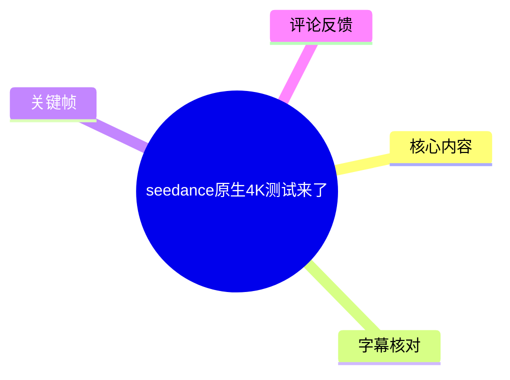
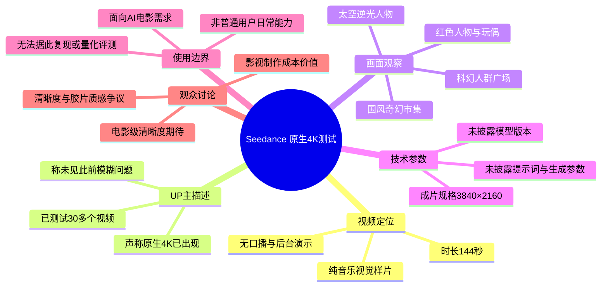
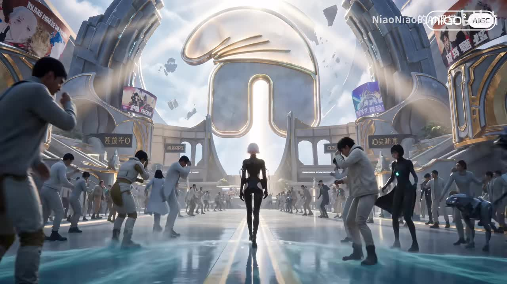

# seedance原生4K测试来了

> 来源：[Bilibili 视频](https://www.bilibili.com/video/BV1To7g6dEE6)  
> UP 主：NiaoNiao的AI课堂｜视频时长：2 分 24 秒｜视频画面规格：3840×2160  
> 信息时点：视频元数据发布时间为 2026-06-23；下文关于产品能力、可用范围与产出数量的表述，均以该视频描述及其发布时点为准。

## 小结

这是一支以纯音乐和 AI 生成画面为主的视觉测试短片，主题是 **Seedance 的“原生 4K”画质表现**。视频本体未提供口播说明或制作后台演示，而是连续展示科幻广场、人物特写、国风奇幻街市、太空人物等不同类型的高复杂度场景，让观众直接观察大画幅画面中的人物、环境、光影和远景细节。

UP 主在视频简介中给出的核心新闻是：其称 Seedance 已出现“原生 4K”，并同步完成了测试；目前已制作 30 多个视频，未再出现“以前那种糊的情况”。这是一项创作者测试结论，不等同于官方公告、统一开放范围或客观基准评测。

从可见样片看，测试重点不是单一人像，而是覆盖了人群密集的科幻场景、带玩偶与金属材质的红色人物场景、建筑与角色混杂的国风市集，以及逆光太空场景。这样的素材适合观察远景主体是否保持辨识度、画面是否具有足够的纹理层次，以及高反差光照下主体轮廓是否清楚。

视频中**没有展示具体提示词、模型版本、生成时长、帧率、码率、单条价格、输入素材、镜头控制或后期流程**，因此不能从本片复现相同结果，也不能据此判断“原生 4K”是否指模型直接输出分辨率、平台编码规格，或某种后处理链路。

UP 主同时明确提示：这种 4K 并非面向“正常用户”的日常能力，而更偏向 AI 电影制作需求。结合热评可见，观众对其影视制作成本价值和视觉质感有不同看法：有人认为面向影视剧组可能具有成本优势，也有人认为过度清晰会削弱电影质感。这些均为评论观点，未在视频中得到验证。

## 思维导图

## 目录

- [视频定位与时效性](#视频定位与时效性-000000)
- [核心视觉测试：以复杂场景观察细节](#核心视觉测试以复杂场景观察细节-000038)
- [样片中的画面类型与可观察指标](#样片中的画面类型与可观察指标-000056)
- [可执行的观看与评估步骤](#可执行的观看与评估步骤-000121)
- [技术参数、限制与结论](#技术参数限制与结论-000129)
- [字幕比对](#字幕比对-000000)
- [评论分析](#评论分析-000000)
- [处理记录](#处理记录-000000)

## [视频定位与时效性](https://www.bilibili.com/video/BV1To7g6dEE6?t=0) [00:00:00]

视频从音乐与视觉样片开始。站内字幕在 00:00:00.380—00:00:03.020 标注为“♪ 音乐 ♪”；本次 ASR 在 00:00:00.140—00:00:01.680 识别出疑似歌词片段“Yo te vi,”。两者均表明开头不是中文口播讲解。

因此，本片应被理解为一段**以画面展示为主的测试样片**，而非教程或参数发布会。其标题“seedance原生4K测试来了”与简介共同构成了对内容主题和测试结论的主要文字来源。

视频简介中的可确认陈述包括：

1. UP 主认为该质量“有点离谱”，并称 Seedance 的“原生 4K”已经出现。
2. UP 主称自己一方同步进行了测试，建议观众在电脑端打开观看。
3. UP 主称远处人物也较清晰。
4. UP 主称目前已产出 30 多个视频，未出现以往的模糊情况。
5. UP 主称这一类 4K 不属于普通用户常规使用范围，更适合制作 AI 电影。

上述内容均应保留为“UP 主称述”，因为素材中没有平台公告、测试方法、原始文件下载链接或逐条样本记录可供交叉验证。

> 图：该帧展示了一个人群密集、建筑结构复杂的科幻广场。其价值在于可同时观察远处群体、前景人物、金属建筑轮廓与地面反射；这类高信息密度画面比单一人物特写更适合检视细节保留情况。关键帧文件本身未附带时间戳，故不将其时间位置作为事实标注。

## [核心视觉测试：以复杂场景观察细节](https://www.bilibili.com/video/BV1To7g6dEE6?t=38) [00:00:38]

站内字幕在 00:00:38.840—00:00:48.440 连续标记为音乐，没有提供语言内容。此段仍以视觉展示为主，不能从字幕中提取模型设置或操作步骤。

从已提供画面可见，短片有意采用多类容易暴露生成质量问题的视觉元素：

- **人群与远景结构**：科幻广场中同时存在近景行人、中央人物、远处建筑、悬浮物和反光地面。若画面分辨率或细节生成不足，远处人物通常容易糊成色块，复杂建筑边缘也可能不稳定。
- **人物与材质细节**：红色场景中的女性角色穿戴皮革、金属链条、扣件等细节丰富的服装，旁边还有绒毛质感的玩偶。该类组合适合观察面部稳定性、服装饰件结构，以及软硬材质之间的区分。
- **高饱和与高反差光照**：红色背景、黑色服装、局部高光会考验暗部层次与边缘过渡；但仅凭压缩后的视频画面，不能对真实纹理、色深或编码质量作定量结论。

> 图：该帧把人脸、黑色服装、金属挂饰、红色背景与毛绒玩偶放进同一构图。它有助于讨论 AI 视频画面中常见的细节风险，如饰品形状、材质区分和人物主体表现；但该截图不能替代逐帧稳定性检验。

### 视频所呈现的“4K”与可验证事实

| 项目 | 素材能支持的结论 | 不能据此确认的内容 |
| --- | --- | --- |
| 成片画面规格 | 元数据标注为 3840×2160，属于 4K UHD 分辨率 | 文件是否全链路以无损或高码率 4K 保存 |
| “原生 4K” | 标题和简介将本次测试称为“原生 4K” | 原生的具体技术定义、是否未经过超分或后期放大 |
| 清晰度表现 | 样片展示了多个复杂场景，UP 主称远景人物清晰 | 与旧版本、其他模型或不同设置下的量化比较 |
| 稳定性 | UP 主称 30 多个视频未出现此前模糊问题 | 30 多个样本的提示词分布、失败率、选择偏差与完整样本列表 |
| 可用性 | UP 主称更适合 AI 电影制作 | 普通用户是否可用、入口、套餐、价格和地区限制 |

## [样片中的画面类型与可观察指标](https://www.bilibili.com/video/BV1To7g6dEE6?t=56) [00:00:56]

站内字幕在 00:00:56.940—00:01:00.680 标为音乐。后续在 00:01:05.499—00:01:09.819、00:01:21.980—00:01:38.200 等区间也均只有音乐提示，说明视频没有通过字幕解释不同样片的制作条件。

### 国风奇幻街市：检查环境叙事与多主体关系

国风街市画面中包含传统建筑、灯笼、摊贩、拟人动物、儿童、双主角和远处楼阁，属于多主体、多景深、多类型资产同框的场景。观看时可重点留意：

- 中景和远景角色是否仍保持相对清楚的轮廓；
- 灯笼、屋檐、牌匾和市场物品是否出现明显形变或重复纹理；
- 人物与环境的比例关系是否自然；
- 大量角色共处时，是否出现肢体、服装或道具的异常融合。

> 图：该帧展示了高密度的国风市集构图，前景、中景、远景都包含角色和物体。它是判断“远处也清晰”这一主张时较有价值的视觉样本，但没有原始输出文件、放大裁切或逐帧对比，不能据此给出客观锐度评分。

### 太空逆光人物：检查轮廓、高光与暗部

太空场景以发光星体和黑色服装人物构成逆光画面。此类画面适合观察：

- 人物白发与深色服装之间的边缘是否清晰；
- 强光源附近是否出现过度泛白、光晕异常或主体轮廓吞没；
- 暗部服装是否仍能保留可辨识的结构；
- 背景星空、行星边缘和飞行器形体是否与前景人物分离。

> 图：该帧以明亮行星边缘光勾勒黑色人物，能帮助观察高反差场景下的主体分离与轮廓表现。其价值是作为视觉样片，而非模型能力的严格基准，因为视频未披露相机运动、帧间变化和生成条件。

## [可执行的观看与评估步骤](https://www.bilibili.com/video/BV1To7g6dEE6?t=81) [00:01:21]

UP 主在简介中建议“用电脑点开看看”。虽然视频没有展示操作界面，但依据这一建议和样片性质，可按以下方式进行**观看层面的评估**；这些不是视频中披露的生成步骤，也不涉及未提供的模型参数。

1. **优先在大屏幕或电脑端观看**  
   小尺寸移动设备会缩小远景人物、建筑纹理和服装细节，难以判断画面是否真的保留高分辨率信息。

2. **确认播放器实际清晰度档位与网络状态**  
   成片元数据为 3840×2160，但在线播放是否以相应清晰度呈现，会受账号权限、设备性能、网络带宽和平台转码档位影响。视频没有提供实际播放码率，不能仅根据标题判断当前播放流质量。

3. **分别查看四类细节区域**  
   - 远景：人群、楼阁、标牌与背景物体是否仍可辨识；  
   - 人物：面部、头发、手部、服装结构是否自然；  
   - 材质：金属、皮革、毛绒、玻璃或地面反射是否有区分；  
   - 高反差区域：强光边缘、阴影服饰和夜空背景是否丢失层次。

4. **暂停与连续播放结合判断**  
   暂停画面有助于看纹理和静态形变；连续播放则更适合查看人物、物体与镜头运动过程中是否稳定。当前提供的关键帧只能支持前者，不能代替完整运动稳定性测试。

5. **不要将样片观感等同于通用能力**  
   本片未公开提示词、抽样数量的完整分布、失败样本、对照组和生成成本。即便画面观感良好，也不能直接推导为任意题材、任意镜头或任意用户账户均能稳定获得同样效果。

## [技术参数、限制与结论](https://www.bilibili.com/video/BV1To7g6dEE6?t=129) [00:02:09]

站内字幕在 00:02:09.509—00:02:19.329 仍只有音乐标记，视频末段没有补充口播结论。以下技术信息应严格区分“已知”与“未知”。

### 已知参数与事实

| 项目 | 内容 |
| --- | --- |
| 视频标题 | seedance原生4K测试来了 |
| 视频时长 | 144 秒 |
| 视频画面尺寸 | 3840×2160 |
| 视频主题 | Seedance “原生 4K”视觉样片测试 |
| 音频内容 | 以音乐为主；未检测到中文口播讲解 |
| UP 主样本说法 | “目前出了 30 多个视频，没有以前那种糊的情况” |
| UP 主适用范围说法 | 更适合做 AI 电影，不是普通用户的正常使用能力 |
| 视频内操作演示 | 未提供 |

### 未披露的关键技术参数

- Seedance 的具体产品版本、模型名称与发布时间；
- “原生 4K”的官方定义和实现路径；
- 提示词、负面提示词、参考图、角色一致性方式；
- 单段时长、帧率、镜头运动设置、种子值与生成次数；
- 是否使用超分、插帧、剪辑、调色、降噪或其他后期处理；
- 原始输出码率、编码格式、上传前后的压缩情况；
- 单条生成成本、套餐门槛、申请方式与普通用户可见的开放状态；
- 与“以前那种糊的情况”对应的旧版本样片及可复核对照。

### 结论与适用边界

本片最有价值的部分，是以多种高复杂度视觉题材展示了 3840×2160 成片中的主观细节观感，并通过简介传达了 UP 主对 Seedance 画质改进和影视制作用途的判断。对于 AI 影像创作者，它可作为“为什么要在大屏上检查远景、材质和高反差画面”的观察样本。

但本片不是完整技术教程，也不是严格的性能评测。由于缺少参数、对照组、原始素材和完整样本集，不能据此得出模型稳定性、成本效率、可复现性或普通用户可获得性的确定结论。产品能力与开放策略可能在视频发布后变化，使用前应以 Seedance 的当期官方页面、账户权限和实际生成结果为准。

## [字幕比对](https://www.bilibili.com/video/BV1To7g6dEE6?t=0) [00:00:00]

| 字幕来源 | 完整性 | 专有名词 | 时间轴 | 主要问题 |
| --- | --- | --- | --- | --- |
| Bilibili 站内字幕 `p01-ai-zh.srt` | 覆盖多个音乐区间，但没有语义性讲解文本 | 未出现 Seedance、4K 等专有名词 | 有真实起止时间，例如 00:00:00.380—00:00:03.020 | 内容均为“♪ 音乐 ♪”，无法承载视频主题、参数或结论 |
| 本次 ASR 字幕 | 仅识别 2 段、合计约 4.07 秒语音，占 143.38 秒音频约 2.84% | 未识别 Seedance、4K 等中文主题词 | 有真实时间戳：00:00:00.140—00:00:01.680、00:00:03.120—00:00:05.650 | 自动判定语言为西班牙语（置信度 0.8242），结果疑似歌曲歌词；诊断提示有效语音覆盖不足 4% |

### 字幕选择与校正说明

- 本次 ASR 已检查：模型为 `medium`，使用 CUDA 与 `float16`，音频时长约 143.38 秒；`noAudioStream` **未标记为 true**，因此不是“源视频没有音轨”，而是音轨以音乐为主，语音识别覆盖率很低。
- 站内字幕与 ASR 在开头时间上均指向音乐内容：站内字幕标记“♪ 音乐 ♪”，ASR 给出疑似西班牙语歌词片段。两份结果均不支持将其扩展为中文口播。
- 正文时间轴优先采用站内 SRT 中可直接使用的真实音乐分段起点；涉及标题、Seedance、原生 4K、30 多个视频及使用范围的文字信息，采用视频元数据标题与简介，不将其伪装成字幕口播。
- 关键帧用于补充多模态画面理解：确认视频包含科幻广场、红色人物场景、国风市集与太空逆光人物等画面类型；未从画面中推断不存在的模型设置、人物名称或剧情。

## [评论分析](https://www.bilibili.com/video/BV1To7g6dEE6?t=0) [00:00:00]

仅处理本次可获取的热评前三条；评论反映观众态度与潜在使用需求，不应视为已经验证的产品事实。

1. **爱吨吨吨的GAGA｜40 赞**  
   观点是“别喊贵，这对于影视剧组来说，便宜得没边了”。该评论将评价维度从普通消费者价格转向影视剧组预算，补充了视频简介中“给做 AI 电影的用”的受众判断。  
   **可信度与限制：** 视频未披露价格、生成次数、人工修片成本或与传统制作的对照，因而“便宜得没边”属于主观成本判断，不能据此确认实际性价比。

2. **总是吃不到羊的小灰灰｜12 赞**  
   观点是“原生4k才是真正的电影级画面，太震撼了”。该评论认可高分辨率与电影感之间的关联，呼应了视频以大画面样片展示清晰度的表达方式。  
   **可信度与限制：** “电影级”缺乏本片内的客观标准。电影质感还受镜头语言、运动稳定性、动态范围、色彩管理、声音和后期等因素影响，不能只由分辨率决定。

3. **雨沐川｜6 赞**  
   观点是提示词中可加入“IMAX 胶片颗粒”来增加质感，认为过于清晰反而可能显假、缺少质感。该评论提出了清晰度与风格化之间的张力：高分辨率并不自动等于更强的电影观感。  
   **可信度与限制：** 这是创作建议而非本视频已展示的工作流。视频没有给出提示词，也未测试胶片颗粒效果；是否适合加入颗粒，取决于项目风格、交付规格和后期策略。

## [处理记录](https://www.bilibili.com/video/BV1To7g6dEE6?t=0) [00:00:00]

- Worker ID：`worker-mrj0wbly-5dc4e50c`
- 模型：`gpt-5.6-terra`
- ASR 模型与配置：`medium` / CUDA / `float16` / 自动语言识别；识别语言为西班牙语，语言置信度 `0.82421875`。
- 已检查素材：视频元数据、视频简介、站内字幕 `p01-ai-zh.srt`、本次 ASR 结果与诊断、12 个关键帧路径清单、可获取热评前 3 条。
- 字幕选择：站内字幕作为时间轴分段依据；本次 ASR 已完成核查，但仅识别到疑似音乐歌词，未用于转写视频主题。标题和简介中的陈述明确标为 UP 主描述。
- 关键帧选择依据：选用 `frame-001.jpg`、`frame-002.jpg`、`frame-003.jpg`、`frame-004.jpg`，分别覆盖人群科幻场景、人物与复杂材质、国风多主体街市、太空高反差人物；用于说明不同画面复杂度下可观察的细节维度。关键帧清单未提供对应时间戳，未将其作为精确时间定位证据。
- 缓存清理：素材清单未提供缓存清理执行日志；本文不虚构已执行的清理结果。
- 未解决问题：缺少 Seedance 官方说明、模型版本与开放状态、生成参数、价格、原始输出文件、完整 30 余条样本及旧版对照，无法完成可复现的画质与成本评测。

## 评论分析

- 热评 1：别喊贵，这对于影视剧组来说，便宜得没边了[吃瓜]
- 热评 2：原生4k才是真正的电影级画面，太震撼了！
- 热评 3：4K 的话感觉还是提示词加点IMAX胶片颗粒会更有质感一些，太清晰了反而有点假,没质感.

以上内容是观众反馈摘录，只用于补充理解视频反响，不作为正文事实依据。
