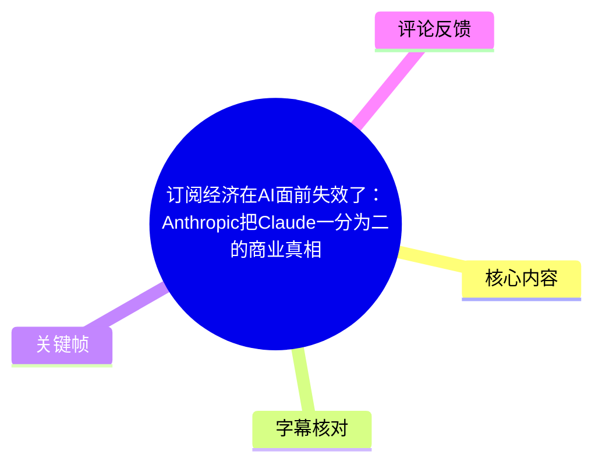
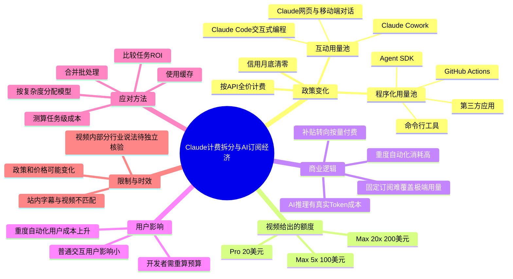
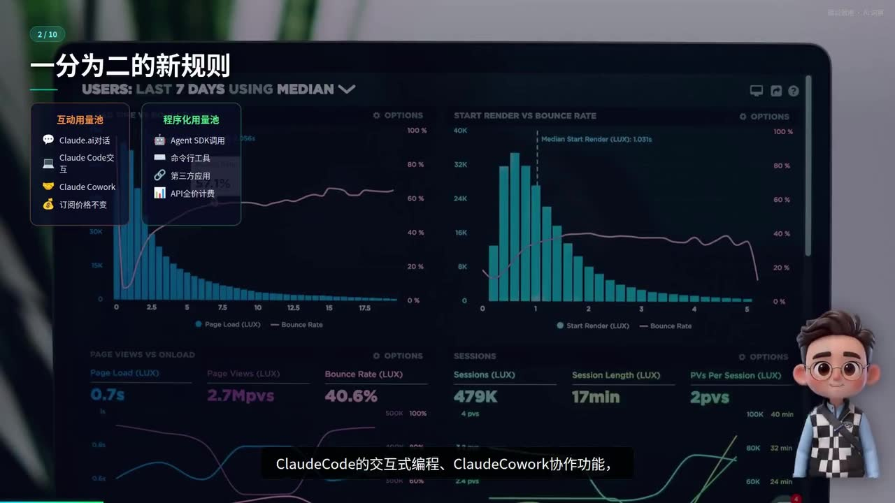

# 订阅经济在AI面前失效了：Anthropic把Claude一分为二的商业真相

> 来源：[Bilibili 视频](https://www.bilibili.com/video/BV1CuLG6UEoe)  
> UP 主：猫十一说｜视频时长：10 分 22 秒｜合集：AIcode  
> **时效提示**：视频围绕描述中所称的 2026 年 5 月 Anthropic 政策调整、以及 6 月 15 日生效节点展开。计费规则、模型价格、可用地区和产品名称均可能后续变化；本文记录的是视频中的陈述与分析，不将其自动视为 Anthropic 当前官方政策。

## 小结

视频讨论的核心新闻是：据视频陈述，Anthropic 将 Claude 订阅中的使用量拆分为两个独立池——**互动用量池**继续服务 Claude 网页对话、Claude Code 交互式编程和 Claude Cowork；**程序化用量池**则覆盖 Agent SDK、命令行工具、GitHub Actions 与第三方应用，并改为按 API 全价从独立信用额度中扣费。

视频给出的关键参数是：Pro 每月获得 **20 美元**程序化信用，Max 5x 为 **100 美元**，Max 20x 为 **200 美元**；信用月底清零、不结转。作者的核心判断是，这并非单纯的“赠送额外额度”，而是把过去订阅制对重度自动化使用的隐性补贴，转为显性的 API 按量成本，因此对重度程序化用户构成“变相涨价”。

作者将其放入更大的商业逻辑中：传统 SaaS 可以用固定月费覆盖少数重度用户，是因为边际成本主要是带宽、存储等；而生成式 AI 的每次 Token 推理均有真实算力成本。当少数用户以较低订阅费运行大量后台自动化任务时，订阅收入与推理成本之间的缺口难以仅靠扩大用户规模弥补。

对普通 Claude 网页端、移动端问答用户而言，视频的结论是影响较小：如果不使用 SDK、第三方工具或后台自动化，日常交互仍在原订阅互动额度中。真正需要重做预算的是开发者、Agent 工作流使用者和批量处理场景的用户。

视频给出的可迁移实践是：按任务价值与复杂度选择模型；合并批处理；通过缓存减少重复调用；将对话订阅与程序化 API 分开核算；在 Claude、GPT、Gemini 等候选模型之间，以任务级 ROI 而非单纯“月费”比较成本。

需要注意的是，站内字幕与本视频主题完全不符，内容实际是沃尔玛食品测评；本次 ASR 有完整音频覆盖但存在大量专有名词误识别。本文以**本次 ASR 时间轴为主**，再用视频标题、简介和关键帧文字校正 Claude、Anthropic、Sonnet 等术语；无法从给定素材独立验证的视频外部新闻细节，均保留为“视频称/作者认为”。

## 思维导图





## 目录

- [新闻背景：从“订阅”到“成本对齐”](#新闻背景从订阅到成本对齐)
- [规则拆分：互动池与程序化池](#规则拆分互动池与程序化池)
- [为什么作者认为这是变相涨价](#为什么作者认为这是变相涨价)
- [政策演变与算力成本逻辑](#政策演变与算力成本逻辑)
- [不同用户的影响与成本规划](#不同用户的影响与成本规划)
- [开发者的任务级优化步骤](#开发者的任务级优化步骤)
- [行业判断、限制与时效性](#行业判断限制与时效性)
- [字幕比对](#字幕比对)
- [评论分析](#评论分析)
- [处理记录](#处理记录)

## 新闻背景：从“订阅”到“成本对齐” [00:00](https://www.bilibili.com/video/BV1CuLG6UEoe?t=0)

视频开场将此事定位为 AI 行业的“重磅消息”：Anthropic 将从 **6 月 15 日**起调整 Claude 的计费方式。作者认为，表面上这是产品与计费结构的更新，实质上是 AI 订阅经济不得不承认其成本模型存在约束。

在作者描述的旧模式里，用户支付固定月费后，可以在同一订阅额度内进行 Claude 对话、代码编写和自动化脚本运行。视频特别关注一种高消耗行为：用户将订阅权限用于长时间、批量或后台运行的自动化任务，从而以订阅价格获取远高于固定月费所对应的推理资源。

作者的商业判断可以概括为：

1. **传统软件订阅的成本结构可预测性更高**：多数用户低频使用，少数高频用户的边际成本相对低，可以由总体收入摊薄。
2. **大模型服务的边际成本不可忽略**：输入与输出 Token 都需要推理计算，调用越多、上下文越长、输出越多，资源消耗越显著。
3. **极端重度用户会放大订阅制风险**：当用户以几十美元订阅费消耗数百美元等值 API 资源，固定月费与成本之间形成作者所称的“剪刀差”。
4. **拆分计费是风险隔离手段**：保留常见交互体验，同时将更接近生产、自动化与批处理性质的调用改为可计量、可预算的成本项。


> 图：开场关键帧直接呈现“AI订阅经济失效了”的论题，说明视频不是单纯解释产品套餐，而是从 AI 服务的单位经济模型切入。该画面用于建立全文分析框架。

## 规则拆分：互动池与程序化池 [00:58](https://www.bilibili.com/video/BV1CuLG6UEoe?t=58)

### 两个独立额度池 [01:03](https://www.bilibili.com/video/BV1CuLG6UEoe?t=63)

视频称，6 月 15 日起 Claude 用量被分为两个相互独立的池子：

| 用量类别 | 视频列举的覆盖场景 | 计费/额度处理 |
| --- | --- | --- |
| 互动用量 | Claude 网站对话、Claude Code 的交互式编程、Claude Cowork 协作功能 | 继续使用原有订阅额度；视频称限制“不变” |
| 程序化用量 | Claude Agent SDK、命令行工具、GitHub Actions、第三方应用 | 从新的独立信用池扣除；按 API 全价计费 |

这项划分的关键不在于“是否使用 Claude”，而在于**调用是面向人的交互式使用，还是面向系统的程序化、自动化运行**。前者更接近订阅产品体验，后者更接近 API 资源消耗。



> 图：关键帧以双栏形式把“互动用量池”与“程序化用量池”并列展示，并列出 Claude.ai 对话、Claude Code、Claude Cowork 与 Agent SDK、命令行工具、第三方应用等归属。这是理解政策边界的核心视觉证据。

### 程序化信用额度与限制 [01:32](https://www.bilibili.com/video/BV1CuLG6UEoe?t=92)

视频列出的每月程序化信用为：

| 订阅层级 | 程序化信用额度 |
| --- | ---: |
| Pro | 20 美元/月 |
| Max 5x | 100 美元/月 |
| Max 20x | 200 美元/月 |

作者强调三项限制：

- **信用按 API 全价计费**，而非按照过去被订阅价隐性覆盖的方式扣减；
- **信用耗尽即不能继续由该信用池承担**，用户需要评估是否开通额外用量；
- **月底清零且不结转**，未消耗的信用不会累计到下一计费周期。

因此，程序化信用更像一笔设置了有效期的 API 预算，而不是可以无限累积或完全等同于旧订阅权益的“免费增量”。

## 为什么作者认为这是变相涨价 [01:53](https://www.bilibili.com/video/BV1CuLG6UEoe?t=113)

### 从“订阅覆盖”切换到“API 价格表” [02:04](https://www.bilibili.com/video/BV1CuLG6UEoe?t=124)

作者用 Max 5x 用户举例：过去如果用户以每月 100 美元订阅，且将大量额度用于自动化脚本，实际可能获得大量推理资源；调整后，尽管程序化信用也是 100 美元，但它按 API 全价扣费，因此能换取的 Token 数量受具体输入、输出比例限制。

视频以 Claude Sonnet 的 API 价格为例，给出：

| 项目 | 视频中给出的价格 |
| --- | ---: |
| 输入 | 3 美元 / 百万 Token |
| 输出 | 15 美元 / 百万 Token |
| 信用结转比例 | 0% |
| 计费方式 | 100% 按 API 全价计费 |

> 注：上述为视频口述及画面展示的价格和解释，用于说明成本逻辑；模型价格与版本可能变化，应以服务商当期官方价格页为准。


> 图：画面明确显示“为什么这是涨价”，并展示 Sonnet 输入 3 美元/百万 Token、输出 15 美元/百万 Token、信用结转比例 0%、按 API 全价计费。它将“同样 100 美元”与“实际购买力变化”之间的关系可视化。

### 购买力下降的原因 [02:30](https://www.bilibili.com/video/BV1CuLG6UEoe?t=150)

作者的推理链条如下：

1. 旧订阅机制下，重度用户可能把互动订阅额度用于高频自动化调用。
2. 新机制将这类调用单列为程序化用量，按 API 标价核算。
3. 因输入与输出分别计费，且输出 Token 单价更高，复杂 Agent 的成本会随任务链路、重试次数、上下文长度和输出量快速上升。
4. 信用不能结转，使用户面临双向约束：用得少会浪费信用，用得多则需要额外支出。
5. 因此，作者认为成本控制压力从平台部分转移到了用户侧预算管理。

这里的“变相涨价”是**作者对重度程序化用户有效成本上升的评价**，不等于所有订阅用户的标价都上涨。对不使用程序化能力的普通用户，视频后文明确判断其影响有限。


> 图：该画面承接价格说明，字幕明确表达“Anthropic 把成本控制的压力从自己身上转移给了用户”。它有助于区分视频的事实描述与作者的商业解读：拆分规则本身是政策变化，“成本转移”是对其激励效果的分析。

## 政策演变与算力成本逻辑 [03:00](https://www.bilibili.com/video/BV1CuLG6UEoe?t=180)

### 视频叙述的时间线 [03:08](https://www.bilibili.com/video/BV1CuLG6UEoe?t=188)

作者将此次调整解释为长期博弈的结果，并给出以下时间线：

| 时间 | 视频中的陈述 | 在论证中的作用 |
| --- | --- | --- |
| 2024 年 2 月 | Anthropic 在服务条款中禁止第三方工具通过订阅账户访问 Claude，但执行不严格 | 说明平台早已尝试限制订阅账户的程序化滥用 |
| 2026 年 2 月 | 随着鼓励长时间后台运行的开源 Agent 平台用户增长，Anthropic 开始严肃执行限制 | 说明执行层面的收紧 |
| 2026 年 5 月 | 全面进行政策重构 | 从规则约束转为计费结构拆分 |
| 2026 年 5 月初 | 视频称 Anthropic 宣布与 SpaceX 合作，借用其数据中心算力，并取消高峰时段用量限制 | 用于对比“供给扩张预期”与后续订阅收紧 |
| 2026 年 6 月 15 日 | 新的程序化信用与计费安排生效 | 视频所讨论的政策落地节点 |

以上时间线来自视频口述及简介。素材中未提供官方公告、服务条款或合作公告原文，故其中具体日期、产品范围与合作细节应在实际决策前另行核对。

### 传统 SaaS 为什么难以直接套用 [04:01](https://www.bilibili.com/video/BV1CuLG6UEoe?t=241)

视频从单位经济学解释 AI 订阅制的矛盾：

- 传统 SaaS 的“月付包量”通常建立在使用分布不均衡之上：大量轻度用户的收入可摊薄少数重度用户。
- 对许多传统软件，重度使用主要增加的是带宽、存储和服务负载，边际成本相对较低。
- 生成式 AI 的一次调用则包含实际推理成本；Token 消耗、模型规格、上下文窗口、输出长度和并发都会影响资源使用。
- 最能证明产品价值的重度自动化用户，同时也可能是最难以用固定月费覆盖的用户。

作者将其概括为一个悖论：每天运行数百个自动化工作流的开发者，既是 Claude 能力最有说服力的验证者，也可能是订阅盈利模型中风险最高的变量。

## 不同用户的影响与成本规划 [05:05](https://www.bilibili.com/video/BV1CuLG6UEoe?t=305)

### 影响分层 [05:09](https://www.bilibili.com/video/BV1CuLG6UEoe?t=309)

视频将用户影响划为三类：

| 用户类型 | 典型行为 | 视频判断 | 应关注事项 |
| --- | --- | --- | --- |
| 普通交互用户 | 网页端或移动端问答、日常 Claude Code 交互 | 几乎无感 | 确认自身没有经 SDK 或第三方服务触发程序化调用 |
| 开发者 | 使用 SDK、CLI、GitHub Actions 或第三方集成 | 需要重新规划成本 | 估算每月调用量与 API 费率的对应关系 |
| 重度自动化用户 | 大量后台任务、批量流程、长时间 Agent 工作流 | 实际成本可能显著上升 | 评估订阅、API、缓存与替代模型的组合 |

对第三类用户，作者提出一个方向：若核心需求是大规模程序化调用，直接采用 Claude API 并配合良好缓存策略，可能比仅依赖订阅额度更适合精确预算。这里的重点不是“API 一定更便宜”，而是**API 成本更可观测、更可控制，也更容易同其他模型横向比较**。

### 从套餐选择转向任务 ROI [06:07](https://www.bilibili.com/video/BV1CuLG6UEoe?t=367)

作者认为，当程序化调用回归 API 定价体系，开发者的决策逻辑将发生变化：

- 对话、写作、临时协作等交互任务，可继续按订阅体验评估；
- 批量文档处理、自动化编排、代码审查流水线、后台 Agent 等任务，应按 API 成本、质量、延迟和稳定性进行任务级比较；
- 可在 Claude、GPT、Gemini 等不同模型之间，按场景计算 ROI，而不是把所有任务固定交给同一模型；
- 对 Anthropic 而言，挑战是同时维持交互产品体验优势与 API 价格竞争力。

视频提及 Claude Sonnet、GPT-4o、Gemini 2.5 Pro 等模型作为比较对象；但 ASR 将部分名称错误识别为“Sony 4.6”等，本文已依据上下文校正为模型比较的泛称，未据此补充未出现的具体型号、价格或性能结论。

## 开发者的任务级优化步骤 [08:29](https://www.bilibili.com/video/BV1CuLG6UEoe?t=509)

视频没有给出代码或具体账单案例，但提出了明确的成本管理方向。可按以下顺序执行：

### 1. 盘点哪些调用属于程序化用量 [08:34](https://www.bilibili.com/video/BV1CuLG6UEoe?t=514)

先区分业务调用路径：

- 是否由 Claude Agent SDK、CLI 或 CI/CD 任务发起；
- 是否通过 GitHub Actions 执行；
- 是否经由第三方应用、自动化工具或后台 Agent 调用；
- 是否只是用户主动进行的网页端/客户端交互。

这一步用于识别哪些工作流需要纳入新的程序化信用与 API 预算，而非默认都归为订阅使用。

### 2. 按输入、输出与频率测算预算 [05:23](https://www.bilibili.com/video/BV1CuLG6UEoe?t=323)

作者建议开发者明确估算：

- 每月程序化调用量；
- 每次任务的平均输入与输出 Token；
- 20、100、200 美元信用分别能支撑多久；
- 信用用完后是否需要打开额外用量；
- 输出长度、上下文传递、失败重试和多 Agent 链路是否造成额外消耗。

可将每类任务抽象为：

```text
月度任务成本 ≈
月执行次数 ×
（平均输入Token × 输入单价 + 平均输出Token × 输出单价）
+ 重试、工具调用与上下文扩张带来的额外成本
```

该公式是对视频“按 API 费率测算”的结构化表达，不包含视频未提供的缓存折扣、批量折扣、地区税费或各模型当前实际单价。

### 3. 合并批量任务，减少重复调用 [08:47](https://www.bilibili.com/video/BV1CuLG6UEoe?t=527)

视频提出第一个优化问题：**批量任务能否合并处理？**

适用思路包括：

- 将相似的小任务合并为结构化批次，而非对每条记录单独发起完整上下文调用；
- 复用系统提示词、项目规则和稳定背景信息；
- 避免在每一步工作流重复传入大量不变资料；
- 为可延迟的任务设置队列，以便统一调度和预算控制。

限制是：批量过大可能带来超时、输出难以定位、错误重跑范围过大或上下文过长等问题，因此需在吞吐、可观测性和失败隔离之间取舍。

### 4. 为稳定信息设计缓存策略 [08:52](https://www.bilibili.com/video/BV1CuLG6UEoe?t=532)

视频明确提问：**缓存策略能否减少重复调用？**

可迁移的原则是：

- 对不会频繁变化的知识摘要、文档解析结果、模板输出或分类结果建立缓存；
- 用输入内容哈希、版本号、提示词版本和模型版本共同构成缓存键；
- 对时间敏感内容设置过期策略，避免旧结果被误用；
- 为缓存命中率、节省调用数和错误率建立监控。

视频没有提供 Claude 特定缓存 API 的具体配置，因此不应据此推导出某项功能已开通、折扣比例或缓存收费规则。

### 5. 用不同价位模型匹配不同复杂度 [08:55](https://www.bilibili.com/video/BV1CuLG6UEoe?t=535)

视频提出第三个问题：**不同复杂度的任务是否应使用不同价位模型？**

实践上可按以下维度分流：

| 任务特点 | 可采用的决策原则 |
| --- | --- |
| 高风险、高价值、复杂推理 | 优先评估质量、可靠性与错误代价，再比较成本 |
| 大批量、结构化、规则清晰 | 优先比较单位处理成本、吞吐量与稳定性 |
| 低风险初筛、摘要、格式转换 | 选择成本更低但质量仍满足要求的方案 |
| 需要人工即时协作 | 关注交互体验，订阅产品可能仍更合适 |

作者将这种精打细算视为 AI 应用成熟，而非“能力倒退”：当每一次调用都有明确成本，团队才会真正衡量 AI 是否创造了足够价值。

## 行业判断、限制与时效性 [07:12](https://www.bilibili.com/video/BV1CuLG6UEoe?t=432)

### 视频的宏观结论 [07:24](https://www.bilibili.com/video/BV1CuLG6UEoe?t=444)

作者的总体结论是：固定月费即可无限调用 AI 的“补贴时代”正在结束，行业正朝使用量与成本对齐的方向收敛。视频还称 OpenAI 的 ChatGPT Pro、微软 GitHub Copilot 也面临类似的重度使用成本挑战，并提及某些高频编程自动化场景会转向按量计费。

这里应严格区分：

- **可从视频确认的内容**：作者提出了 AI 推理成本高、重度自动化用户影响大、应转向精细化成本管理的观点。
- **视频转述但素材未附官方来源的内容**：关于其他厂商具体限制、具体生效时间及其计费变化。
- **不可直接推出的结论**：所有 AI 订阅都会取消、所有普通用户都会涨价、某一厂商当前价格一定优于另一厂商。

### 适用范围与关键限制 [09:15](https://www.bilibili.com/video/BV1CuLG6UEoe?t=555)

1. **新闻时效性强**：视频描述的政策节点是 2026 年，套餐、用量边界、模型名称与 API 价格可能已变化。
2. **“无限制”应谨慎理解**：视频使用“无限制”描述旧订阅体验，但实际服务通常可能存在公平使用、速率、区域或产品条款限制；给定素材未提供完整官方条款。
3. **额度不等于固定 Token 数**：因为输入/输出计价不同，任务 Token 构成不同，同样金额对应的任务量会显著不同。
4. **缓存不是无条件省钱**：缓存策略需要考虑失效、正确性、隐私和版本一致性。
5. **模型替换需验证质量**：更低单价模型未必满足复杂代码、长上下文、工具使用或高可靠性任务要求。
6. **评论不能替代政策说明**：用户对网页端是否收费的疑问，不能仅靠评论或作者判断解决，应查看自己的产品入口、套餐条款和账单页面。

## 字幕比对

| 字幕来源 | 完整性 | 专有名词 | 时间轴 | 主要问题 |
| --- | --- | --- | --- | --- |
| Bilibili 站内字幕 `p01-ai-zh.srt` | 与本视频完全不匹配 | 大量沃尔玛、山姆、食品名词；与 Claude 主题无关 | 有完整分段时间轴，但对应另一条视频内容 | 从“之前做山姆视频”开始，至沃尔玛烘焙、宠物区、枕头测评结束；不可用作本文事实或时间定位 |
| 本次 ASR 字幕 | 高：93 段，语音覆盖约 588.46 秒，占视频约 94.72% | 存在系统性误识别，但可由标题、简介、画面和上下文校正 | 有完整时间戳；首段 0 秒、末段 620.65 秒，无大间隙 | 将 Anthropic 识别为“Anthropec/AnthroPic”，Claude 识别为“Cloud”，Sonnet 识别为“CloudSonic”，部分模型和术语识别错误 |

### 最终字幕选择与校正原则

最终采用**本次 ASR 的时间轴与内容**，不采用站内字幕的文本内容。原因是站内字幕所述主题与视频标题、简介、音频 ASR 和给定关键帧完全矛盾，属于错配字幕；本次 ASR 虽然有专名错误，但语言诊断为中文、置信度约 0.9985，且时间覆盖连续，主题与画面一致。

本次 ASR **未标记 `noAudioStream=true`**；相反，素材提供了 `audio/audio.wav`，且 ASR 诊断显示约 94.72% 的语音覆盖。因此，站内字幕错配并非源视频无音轨造成，也不应视作 ASR 工具失败。

依据视频标题、简介、关键帧以及上下文完成的主要校正如下：

| ASR 误识别 | 本文采用表述 | 校正依据 |
| --- | --- | --- |
| Anthropec / AnthroPic | Anthropic | 视频标题、简介与上下文 |
| Cloud | Claude | 视频标题、简介、关键帧中的 Claude.ai/Claude Code/Claude Cowork |
| CloudSonic | Claude Sonnet | 价格段画面显示 Sonnet，且上下文为 Claude API 模型价格 |
| Cloud Agent SDK | Claude Agent SDK | 产品语境与标题主题 |
| Open Cloud | 以“视频口述的第三方/开源 Agent 平台名称”保守表述 | ASR 词形不稳定，给定素材不足以唯一确认名称 |
| Sony 4.6 | 未写为确定型号；改为“Claude、GPT、Gemini 等模型比较” | ASR 明显错误，素材未提供可靠的具体型号文字 |

## 评论分析

以下仅处理可获取的热评前三条，评论反映的是用户态度和疑问，不作为已经验证的事实。

### 1. 夏aaa天：质疑高价与竞争力

> “作死小能手，比国产领先百分之十，价格贵十倍不止”  
> 点赞：16

- **观点概括**：评论者认为 Anthropic 相比国产替代产品的能力优势有限，但价格显著更高，因此政策收紧可能削弱其竞争力。
- **与视频的关系**：呼应了视频“程序化用量将进入充分竞争的 API 市场”的判断。
- **可信度与限制**：其中“领先百分之十”“贵十倍”均未给出模型版本、基准任务、计费口径或地区条件，属于情绪化的相对评价，不能据此得出实际性能或价格结论。

### 2. 自然造字师斯庙算多：担忧其他厂商跟进

> “卧槽，OpenAI不会哪天也来这么一手吧[笑哭]”  
> 点赞：6

- **观点概括**：评论者担心类似的订阅与程序化用量拆分可能蔓延到 OpenAI 等其他平台。
- **与视频的关系**：视频确实把该事件解读为行业从固定订阅向成本对齐迁移的信号。
- **可信度与限制**：这是对未来政策的担忧，不是关于 OpenAI 已采取某项措施的证据。不同厂商的产品线、套餐条款和 API 与订阅关系并不相同，应分别查看官方说明。

### 3. 熊猫胖答：追问普通网页端是否受影响

> “啥意思？我正常的使用Cloud的网页端或者移动APP来问问题，这个也要按API来收费吗？”  
> 点赞：3

- **观点概括**：评论者关注最实际的边界：普通网页端、移动 App 问答是否会被纳入 API 按量收费。
- **视频内可回应的部分**：按作者说法，网页对话与日常 Claude Code 交互属于“互动用量池”，仍使用原订阅额度；不使用 SDK 或第三方工具的用户，影响较小。
- **需保留的限制**：评论中“Cloud”应理解为 Claude。具体账户是否受影响仍取决于实际套餐、功能入口、地区、是否经第三方工具调用以及最新条款，不能以视频转述替代官方账单与政策确认。

## 处理记录

- **Worker ID**：`worker-mrj0wjed-b0c290ad`
- **模型**：`gpt-5.6-terra`
- **调用工具与素材**：视频元数据、视频简介、关键帧清单与画面、站内字幕 `p01-ai-zh.srt`、本次 ASR 结果及 SRT、热评前三条。
- **字幕选择**：检查了站内字幕与本次 ASR。站内字幕内容为沃尔玛/山姆食品测评，与视频主题完全错配，予以排除；采用本次 ASR 的真实分段时间轴，并结合标题、简介、画面校正专有名词。
- **ASR 音频状态**：ASR 结果提供音频源路径、93 个分段及约 94.72% 覆盖率，未见 `noAudioStream=true` 标记；因此按“源视频有音轨”处理。
- **关键帧选择依据**：选用 `frame-001` 表达视频总论题；`frame-002` 直接展示互动池/程序化池边界；`frame-003` 展示 Sonnet 输入输出价格、零结转和 API 全价计费；`frame-004` 说明作者关于成本压力转移的判断。这些画面均直接服务于正文关键论点。
- **时间轴依据**：全部章节时间链接均按本次 ASR SRT 的起止时间换算为秒数，不按文字段落顺序猜测。
- **缓存清理**：未提供缓存目录、清理命令或清理结果素材；本文不虚构已执行的缓存清理，仅记录为“无可验证清理记录”。
- **未解决问题**：
  - 给定素材未附 Anthropic、OpenAI、GitHub 或 SpaceX 的原始公告，无法独立核验视频涉及的所有政策日期、合作细节及其他厂商动态；
  - ASR 对部分第三方工具和模型名称误识别严重，未能由现有画面唯一确认者均采取保守转述；
  - 元数据中的发布时间时间戳与简介内“2026 年 5 月 14 日宣布”的新闻日期不是同一概念，本文分别保留，未将二者混同。
