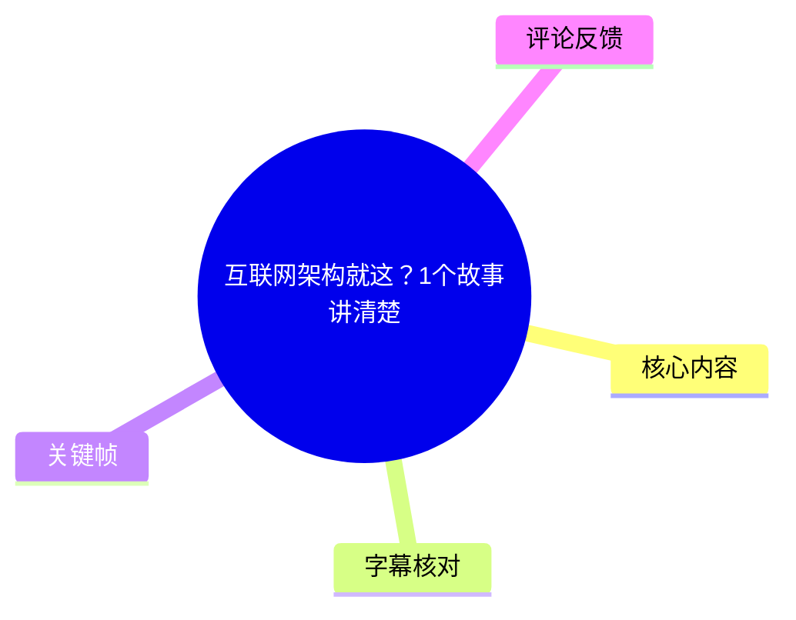
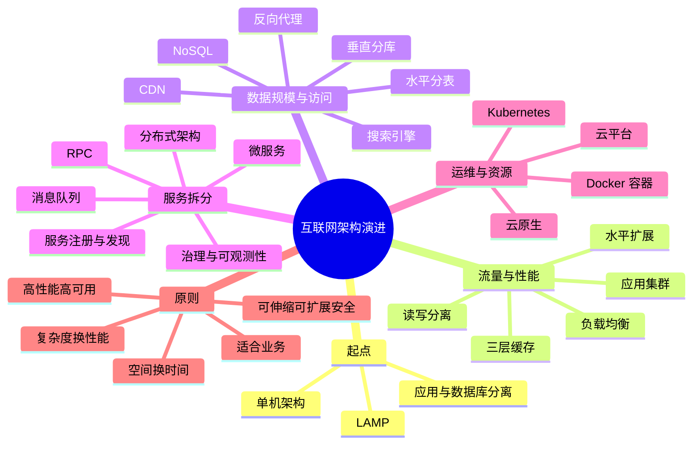
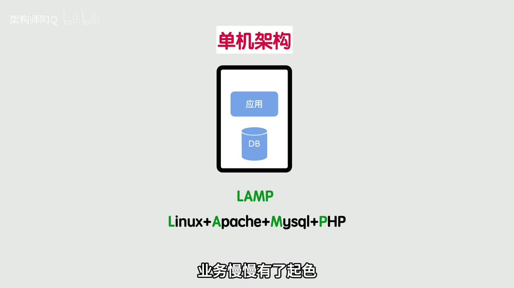
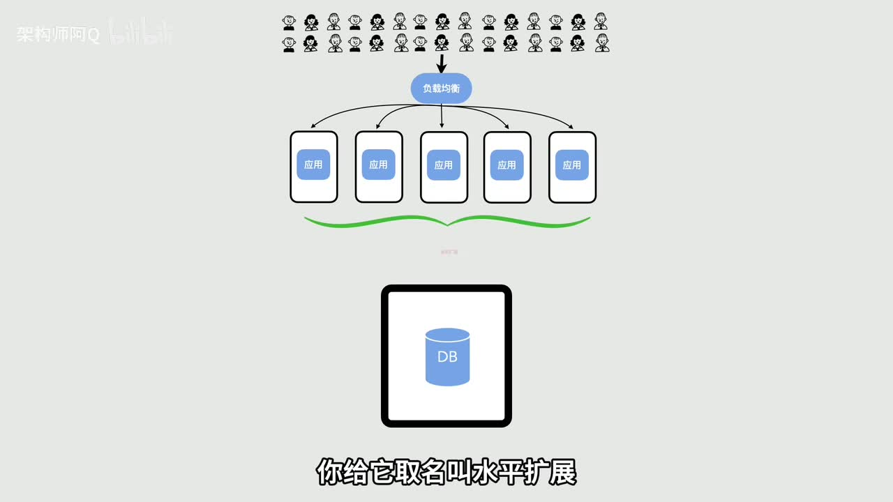
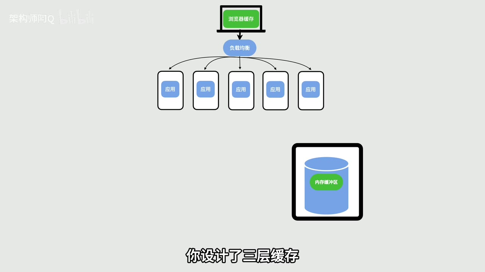
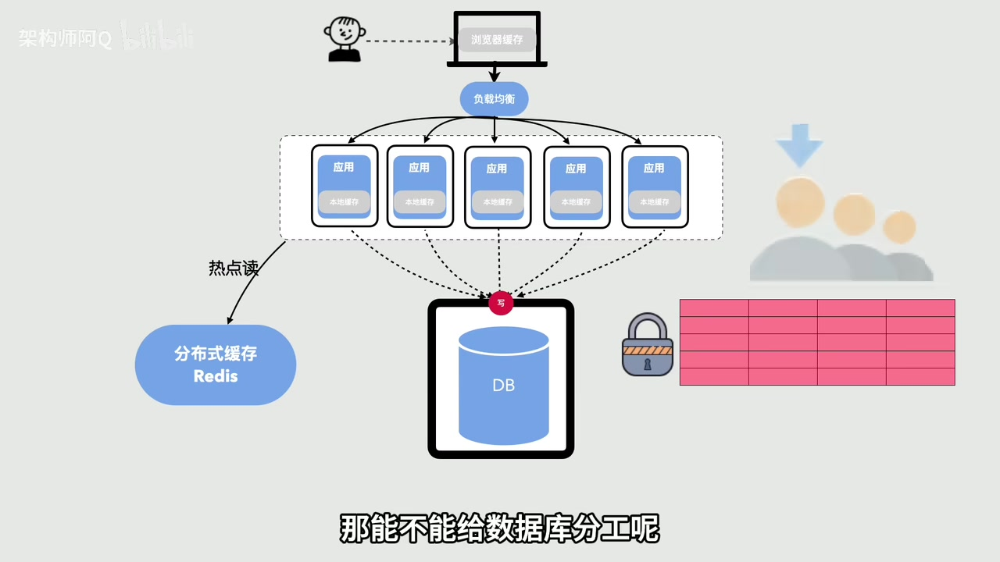

# 互联网架构就这？1个故事讲清楚

> 来源：[Bilibili 视频](https://www.bilibili.com/video/BV1M15Q6eEhL) 
> UP 主：架构师阿Q｜发布时间：2026-05-14｜视频时长：12 分 44 秒｜分区收藏：AIcode

## 小结

视频用“小型网站随用户、流量和数据增长不断遇到瓶颈”的连续故事，串联了互联网架构中常见的概念：单机、应用与数据库分离、集群、负载均衡、缓存、读写分离、分库分表、CDN、反向代理、搜索引擎、NoSQL、分布式、微服务、消息队列、容器、Kubernetes 与云原生。

核心叙事不是“应当一开始就采用全套大厂技术”，而是**每增加一层架构，都是为解决此前规模下已经出现的具体问题**：资源争抢、应用吞吐上限、数据库读压、写入阻塞、单表膨胀、异地访问、复杂检索、代码耦合、服务协作、部署不一致和资源闲置等。

视频给出一个用于理解而非精确容量规划的算例：单台应用服务器假设可承载 `100` 个请求，当有 `500` 个请求时，部署 `5` 台相同应用实例，并用负载均衡分流。这体现了通过增加同类节点进行**水平扩展**的思路；实际系统的容量仍取决于请求类型、数据库、网络、CPU、内存、限流策略等条件，不能直接照此比例外推。

视频尤其强调三条架构思维：没有“最好”的架构，只有适合当前业务的架构；架构演进常是在“空间换时间、复杂度换性能”之间取舍；最终应围绕高性能、高可用、可伸缩、可扩展与安全五类目标做权衡。它适合刚接触后端、运维或系统设计的学习者建立概念地图，也适合作为和实际项目对照的入门框架。

需要注意，视频采用高度概括的科普表达。例如，“缓存让数据库挂了还能顶一阵”“读写分离解决读写互相阻塞”“消息队列使服务彻底解耦”等，描述的是可能收益或设计目标，不等于不需要处理缓存一致性、主从延迟、消息重复/积压、故障转移、观测与安全治理。视频未提供具体产品选型、部署配置、SLA 或压测数据。

## 思维导图

## 目录

- [背景：用问题驱动理解架构演进](#背景用问题驱动理解架构演进)
- [从单机到集群：先解决资源与吞吐](#从单机到集群先解决资源与吞吐)
- [缓存与数据库扩展：处理读、写与数据量](#缓存与数据库扩展处理读写与数据量)
- [边缘访问与专用数据能力](#边缘访问与专用数据能力)
- [从巨石到分布式与微服务](#从巨石到分布式与微服务)
- [微服务治理：调用、异步与稳定性](#微服务治理调用异步与稳定性)
- [容器、编排、云平台与云原生](#容器编排云平台与云原生)
- [架构演进步骤与落地检查表](#架构演进步骤与落地检查表)
- [总结、限制与时效性](#总结限制与时效性)
- [字幕比对](#字幕比对)
- [评论分析](#评论分析)
- [处理记录](#处理记录)

## 背景：用问题驱动理解架构演进 [00:00:32](https://www.bilibili.com/video/BV1M15Q6eEhL?t=32)

视频把“互联网架构”解释为一个不断补齐短板、应对新问题的迭代闭环，而非孤立名词的堆砌。故事从一个访问量很小的网站开始：为了快速上线，应用程序与数据库同部署在一台服务器上，视频以 **LAMP**（Linux、Apache、MySQL、PHP）作为此类单机部署的例子。

随着业务起色，应用和数据库开始在同一台机器上争抢资源。视频的第一步改造是将二者拆开：

- **应用服务器**：处理请求与业务逻辑。
- **数据库服务器**：持久化数据并处理 I/O。
- 预期收益：职责分离、减少资源相互影响，并提高可用性。

这里的“可用性提升”是视频的概括性判断：应用与数据库物理分离能降低同机资源竞争，但并不自动消除数据库单点、网络故障或发布故障等风险。

> 图：关键帧展示了“应用 + DB”同机部署的单机架构，并直接标注 LAMP。它是理解后续所有拆分、扩容与治理动作的基线：后续方案都是针对这个简单起点暴露出的瓶颈逐步增加组件。

## 从单机到集群：先解决资源与吞吐 [00:00:56](https://www.bilibili.com/video/BV1M15Q6eEhL?t=56)

### 应用集群、负载均衡与水平扩展 [00:00:56](https://www.bilibili.com/video/BV1M15Q6eEhL?t=56)

当单台应用服务器处理不过来时，视频用“单机可扛 100 个请求、现有 500 个请求”的简化例子说明扩容思路：部署 `5` 台运行相同代码的应用服务器，形成**应用集群**。

但多台实例需要一个请求入口进行分发，因此增加**负载均衡**：

1. 用户请求先到负载均衡。
2. 负载均衡将请求分配到多个应用实例。
3. 若一个实例异常，视频描述为可将其流量屏蔽，由其他实例承接。
4. 通过增加同类应用节点应对流量，称为**水平扩展**。
5. 通过故障节点隔离与冗余实例降低整体中断风险，视频称为**高可用**。

> 图：关键帧清晰呈现“用户流量 → 负载均衡 → 多个应用实例 → DB”的关系，并标示“水平扩展”。它说明应用层已经从单点变为横向复制，但数据库仍是下一处潜在瓶颈。

### 为什么应用扩容后数据库成为瓶颈 [00:01:20](https://www.bilibili.com/video/BV1M15Q6eEhL?t=80)

视频指出，应用层扛住流量后，大量请求仍会穿透到数据库，数据库就会成为新的性能瓶颈。其对数据库查询路径的概述是：

1. 应用向数据库发起查询。
2. 数据库先在内存缓冲区查找。
3. 命中则直接返回；未命中才访问磁盘并把结果补入缓冲区。
4. 视频称内存读取速度可比磁盘读取快“千倍以上”。

由于内存缓冲区容量有限，不能将所有数据都依赖于这一层保存，因此视频顺势引出应用外部缓存。这里“千倍以上”是视频中的通俗数量级表达，实际差异会因硬件、I/O 模式、数据库引擎和工作负载而变化。

## 缓存与数据库扩展：处理读、写与数据量 [00:02:08](https://www.bilibili.com/video/BV1M15Q6eEhL?t=128)

### 三层缓存：优先拦截热点读请求 [00:02:08](https://www.bilibili.com/video/BV1M15Q6eEhL?t=128)

视频将经常访问的热点数据放到独立且更大的缓存中，并给出三层缓存的访问顺序：

1. **浏览器缓存**；
2. **应用服务器本地缓存**；
3. **分布式缓存**；
4. 以上均未命中时，才访问数据库。

视频强调，缓存不只保存数据库原始表数据，还可以缓存页面、接口响应、静态资源和计算结果；其原则是“什么常用就缓存什么”。视频称缓存可使查询从毫秒级变为微秒级，并显著降低数据库压力。

> 图：关键帧将浏览器缓存、负载均衡、多个含“本地缓存”的应用实例，以及数据库内存缓冲区放入同一张图。它有助于区分“数据库自身缓冲区”和“应用架构中的多层缓存”并非同一概念。

视频随后补充：数据库缓冲区存的是原始表数据；三层缓存可存放更广泛的、能提升访问效率的内容。视频也提到数据库暂时不可用时缓存可以“顶一阵子”。这需要结合限制理解：缓存数据可能过期或不完整，缓存本身也需考虑高可用、击穿、雪崩、穿透与一致性，视频未展开这些实现条件。

### 读写分离：针对读多写少的工作负载 [00:03:21](https://www.bilibili.com/video/BV1M15Q6eEhL?t=201)

缓存主要解决热点读；写请求和非热点读仍会进入数据库。视频将数据库写入描述为比读取更慢，并提到写操作可能涉及行锁、表锁以及高并发下的排队。

给数据库“分工”的方法是**读写分离**：

- **主库**负责写；
- **从库**负责读；
- 主从之间通过数据库同步保持数据一致；
- 对于互联网系统常见的“读多写少”模式，可采用“一主多从”分摊读取压力。

该模式的关键限制是复制同步可能带来读到旧数据的问题；视频没有讨论同步方式、延迟指标、读己之写、故障切换或跨库事务。因此，视频中“彻底解决读写互相阻塞”应理解为面向典型读取扩展需求的概念化描述，而不是所有数据库问题的通用结论。

### 分库分表与分布式数据库：应对海量存储 [00:03:45](https://www.bilibili.com/video/BV1M15Q6eEhL?t=225)

当订单表、日志表等持续变大，单库单表无法承载时，视频提出**拆库拆表**：

- **垂直分库**：按业务拆分为用户库、商品库、订单库等，使业务数据互不干扰。
- **水平分表**：将一张大表按 `UID` 哈希等规则拆成多张小表，以分散压力。
- **数据库中间件**：视频称其可以对应用透明，避免修改大量业务代码。

视频将这一阶段概括为数据库从单点走向分布式，存储能力与并发能力可继续扩展。实际落地仍需额外设计分片键、路由、全局唯一 ID、跨分片查询、跨分片事务、数据迁移与热点分片治理；这些内容未在视频中展开。

> 图：关键帧把“分布式缓存 Redis”用于热点读、写入回数据库，以及锁和表格等元素并置，直观说明缓存不能消除写入与数据一致性问题，数据库仍需要承担持久化与并发控制责任。

## 边缘访问与专用数据能力 [00:04:33](https://www.bilibili.com/video/BV1M15Q6eEhL?t=273)

### CDN 与反向代理：访问速度和边界防护 [00:04:33](https://www.bilibili.com/video/BV1M15Q6eEhL?t=273)

当用户分布在全国且应用服务器直接暴露在公网时，视频引入两类组件：

- **CDN**：在多地部署节点，把静态资源预先放到离用户更近的节点；用户通过域名解析得到较近节点的 IP，从而就近获取资源。视频用“家门口的快递站”作类比。
- **反向代理**：位于用户与应用之间，公网请求先到反向代理，再转发到内网应用服务器。视频称其可以隐藏真实应用服务器，并承担流量清洗、权限校验等工作。

这里应区分：CDN 的主要叙事目标是静态资源就近分发；反向代理是入口转发与应用边界的一种部署方式。具体安全能力取决于产品、策略、WAF/DDoS 防护配置和后端网络隔离，不能仅凭部署反向代理自动获得完整安全防护。

### 搜索引擎与 NoSQL：为复杂检索和分析分工 [00:05:22](https://www.bilibili.com/video/BV1M15Q6eEhL?t=322)

视频认为传统关系型数据库面对模糊查询、全文搜索和多维统计时可能不适合直接承担全部工作，并以电商商品搜索、新闻热搜中使用 `LIKE` 查询“慢到死”为例，引出专用数据组件：

- **搜索引擎**：利用倒排索引，使搜索获得更快的响应。
- **NoSQL 数据库**：用于承载若干类数据，并强调高并发、易扩展等特点。

视频的重点是“按访问模式和能力边界选择合适的存储/检索组件”，让系统从简单 CRUD 扩展到复杂检索与分析。它没有点名具体搜索引擎或 NoSQL 产品，也未说明数据同步、索引构建、最终一致性、查询语法和成本，因此不应据此推断固定选型。

## 从巨石到分布式与微服务 [00:05:46](https://www.bilibili.com/video/BV1M15Q6eEhL?t=346)

### 业务拆分与分布式架构 [00:05:46](https://www.bilibili.com/video/BV1M15Q6eEhL?t=346)

视频用用户、商品、订单都塞在同一个应用中的电商平台描述**巨石应用**。随着功能增多，出现三类问题：

1. 修改用户相关代码也要全量发布整个应用，多人同时开发容易产生冲突；
2. 订单服务流量高时，只能把整个应用一起扩容，造成资源浪费；
3. 不同业务功能耦合在同一个部署单元中，独立演进困难。

解决方式是按业务边界拆分：用户功能成为独立用户系统，商品、订单等也成为各自的小系统。视频将这些系统可独立部署、发布和扩容的形态称为**分布式架构**。

### RPC 与服务注册发现 [00:06:34](https://www.bilibili.com/video/BV1M15Q6eEhL?t=394)

服务拆开后，下单需要查询库存、生成订单等跨系统协作，因此视频引入：

- **RPC（远程调用）**：让跨机器服务调用在使用体验上接近调用本地代码；
- **服务注册与发现中心**：新增服务向中心注册地址；调用方从中心获取目标服务地址后再直接调用。

视频是在说明服务数量变多后，“如何找到可调用目标”这一问题。它未讨论 RPC 的超时、重试、幂等、版本兼容、负载均衡、鉴权和网络分区等工程细节。

### 从分布式进一步拆到微服务 [00:07:55](https://www.bilibili.com/video/BV1M15Q6eEhL?t=475)

视频认为初步业务拆分后，单个“用户系统”仍可能同时包含登录、个人信息、会员和地址等模块，仍然偏大。不同团队想使用不同技术栈，或只想扩容会员模块时，整体扩容会继续造成浪费。

进一步的拆分原则是：**一个服务只做一件事**。例如将登录、会员、支付等变为独立小服务。视频将具有以下特征的架构称为**微服务架构**：

- 服务可独立开发、发布与扩容；
- 团队可按服务分别协作；
- 热门服务如订单、支付可单独增加更多机器；
- 某个服务发生 Bug 时，理论上影响范围可被限制在相应小功能内。

视频同时明确承认代价：服务变多后，调用关系更复杂，排障也更困难。微服务并非只是“把服务拆小”，还需要后续治理能力支撑。

## 微服务治理：调用、异步与稳定性 [00:06:58](https://www.bilibili.com/video/BV1M15Q6eEhL?t=418)

### 消息队列：异步协作、削峰与恢复处理 [00:07:31](https://www.bilibili.com/video/BV1M15Q6eEhL?t=451)

视频指出，服务间如果同步等待对方立即回复，彼此依赖会增大。**消息队列**的思路是：生产方把消息放入队列后继续处理，消费方在需要时取消息并处理。

视频列出的价值包括：

- 降低服务间直接等待造成的耦合；
- 某个服务暂时不可用时，消息可等待其恢复后继续处理；
- 面对流量突增，先将请求存入队列，按系统处理能力慢慢消化，即**削峰填谷**。

“消息不会丢”是视频的目标性表述。实际是否丢失取决于持久化、确认机制、重试、死信队列、消费幂等与监控等设计；同时还需要处理重复消息、顺序要求和积压问题。

### 可观测性、限流、熔断、降级与服务治理 [00:09:08](https://www.bilibili.com/video/BV1M15Q6eEhL?t=548)

面对服务调用链复杂、流量可能冲垮系统、服务数量难管理的问题，视频列出微服务体系中的配套能力：

- **全链路追踪**：帮助定位慢服务；
- **限流**：限制进入系统或服务的请求量；
- **熔断与降级**：在依赖异常或系统压力过高时自动保护系统；
- **服务治理**：通过统一监控、日志、链路等能力管理服务。

视频将配齐这些能力后的形态称为“大厂标准的微服务体系”，并提到可承载“千万级”流量。这是科普语境下的能力愿景，实际吞吐量需要结合业务请求复杂度、硬件资源、数据库与中间件、网络、降级策略和压测结果验证，不能从服务数量或架构名称直接推导。

## 容器、编排、云平台与云原生 [00:09:32](https://www.bilibili.com/video/BV1M15Q6eEhL?t=572)

### 微服务的运维压力与 Docker 容器 [00:09:32](https://www.bilibili.com/video/BV1M15Q6eEhL?t=572)

视频转向微服务的运维代价：服务从几个增长到数百个后，每次上线都可能要配置环境、安装依赖、调参数；环境稍有不同，就会出现“本地能跑、服务器不能跑”的问题。面对大促等突发场景，逐台配置数十台机器的扩容方式也难以满足效率要求。

视频提出将服务及其运行环境封装为“密封盒子”：

- 把每个微服务的代码、依赖、配置和运行环境打包为**镜像**；
- 在不同服务器上直接运行；
- 目标是“一次打包，到处运行”，减少环境不一致。

这种方案被命名为 **Docker 容器**。视频的概念重点在于交付环境一致性，并未涉及镜像分层、容器网络、数据持久化、镜像安全扫描或资源隔离配置。

### Kubernetes、云平台与云原生 [00:10:20](https://www.bilibili.com/video/BV1M15Q6eEhL?t=620)

容器规模从几百到上千后，视频继续引入“全能大管家” **Kubernetes（K8s）** 来管理容器，并列举其自动化能力：

- 流量高时自动扩容容器；
- 流量低时自动缩容容器；
- 容器故障时自动重启。

即使拥有容器编排，视频仍指出自购服务器与机房意味着为大促准备的大量机器可能闲置。因此将系统迁移到云平台：CPU、内存、带宽等资源可按需申请、使用后释放、按需付费，底层机房对使用者更透明。

视频将最终形态称为**云原生**，并概括其特征为弹性、自动化、高可用和可扩展。需要注意：

- Kubernetes 的自动扩缩容、故障重启依赖资源指标、健康检查、控制器、调度和容量等具体配置；
- 云平台的按需付费并不等于必然节省成本，长期稳定负载、出网流量、托管服务和预留资源都可能影响账单；
- “云原生”在视频中是概括性的架构阶段标签，并未给出严格定义或完整实践清单。

## 架构演进步骤与落地检查表 [00:11:08](https://www.bilibili.com/video/BV1M15Q6eEhL?t=668)

### 视频的演进链路

视频在结尾将此前故事压缩为以下“问题—方案”关系：

| 业务/技术问题 | 视频给出的主要方案 | 视频强调的结果 |
| --- | --- | --- |
| 小网站快速上线 | 单机架构 | 简单直接 |
| 应用与数据库抢资源 | 应用与数据库分离 | 解耦资源、增强可用性 |
| 应用并发不足 | 应用集群 + 负载均衡 | 高并发、水平扩展 |
| 查询性能与数据库压力 | 多层缓存 | 加速热点读、减少数据库访问 |
| 读多写少、读压力大 | 读写分离 | 分摊读压力 |
| 海量数据与单表膨胀 | 分库分表 + 分布式数据库 | 扩展存储与并发能力 |
| 异地访问慢、入口安全 | CDN + 反向代理 | 加速访问、隐藏后端入口 |
| 全文搜索与复杂分析 | 搜索引擎 + NoSQL | 支持复杂检索与分析 |
| 业务膨胀、代码维护困难 | 业务拆分 + 分布式架构 | 独立部署与扩容 |
| 团队协作、局部弹性需求 | 微服务架构 | 更细粒度的独立演进 |
| 运维、成本、自动化 | 容器化 + 云平台 | 环境一致、弹性资源与自动化 |

### 按视频思路进行架构决策的步骤

以下是对视频叙事顺序的整理，属于学习与评审检查表，不是视频提供的可直接执行部署方案：

1. **先确认当前瓶颈，而不是先选技术名词。**  
   区分是 CPU/内存争抢、应用吞吐、热点读、写入排队、数据量、网络距离、检索能力、代码耦合还是部署效率问题。

2. **优先采用能以最小复杂度解决当前问题的方案。**  
   小规模业务可以从单机或应用/数据库分离开始；不要因“未来可能很大”而无条件直接采用微服务、Kubernetes 等复杂方案。

3. **需要扩吞吐时，先明确扩的是哪一层。**  
   应用层可考虑集群、负载均衡和水平扩展；数据层则需先分析读写比例、数据规模和查询模式，不能把应用层扩容当作数据库扩容。

4. **面对读性能问题，区分热点与非热点。**  
   热点内容可使用浏览器、本地、分布式缓存分层拦截；但缓存策略必须与数据更新、失效和可接受的数据陈旧程度一并设计。

5. **面对数据规模增长，先确定拆分边界。**  
   业务边界可用于垂直分库；数据分布规则可用于水平分表。选择 `UID` 哈希等分片方式前，应评估查询路径与热点风险。

6. **拆服务前，先确认独立发布与独立扩容确有收益。**  
   如果业务量、团队规模和变更频率都有限，分布式调用、服务发现、消息队列和可观测性会额外引入维护成本。

7. **服务数量增长后，同时建设治理与运维能力。**  
   视频提到的 RPC、注册发现、消息队列、链路追踪、限流、熔断、降级、监控与日志，应作为服务复杂度增长的配套能力，而不是只完成“拆分”。

8. **容器化与云平台解决的是交付和资源管理问题。**  
   Docker 解决环境一致性，Kubernetes 负责容器编排，云平台提供按需资源；三者不能替代容量规划、故障演练、安全控制和成本管理。

## 总结、限制与时效性 [00:11:56](https://www.bilibili.com/video/BV1M15Q6eEhL?t=716)

视频最终给出三条核心思维：

1. **没有最好的架构，只有最适合业务的架构。**  
   初创公司不应一开始就默认采用微服务；单机能够满足需求时，单机就是合理选择，应由业务增长推动架构演进。

2. **架构演进常是“空间换时间、复杂度换性能”。**  
   增加机器、组件和分层，目标是承受更大流量与并发，但也会带来资源、维护和协作复杂度。

3. **围绕五大目标进行权衡。**  
   视频列出：高性能、高可用、可伸缩、可扩展、足够安全。

### 内容边界

- 本视频是架构概念与演进逻辑科普，不是某个系统的真实架构设计文档。
- 视频没有给出代码、命令、参数阈值、产品版本、云厂商配置、成本数据或压测报告。
- 多个结论采用简化说法。实际工程上，缓存一致性、主从复制延迟、分布式事务、消息可靠性、服务调用重试、故障转移、数据安全、容器安全和云成本都是必须单独设计的主题。
- 视频出现“千万级流量”“自动扩缩容”等表述，但缺乏单位、统计口径和环境数据，不能作为容量承诺。

### 时效性

视频发布于 2026-05-14。其讲解的概念框架具有较稳定的教育价值，但具体技术生态、产品能力、Kubernetes 版本、云服务定价、数据库/中间件选型与最佳实践会持续变化。学习时应将本片视为“为什么演进”的脉络，再以项目当前的技术文档、官方文档、压测和故障演练结果确认“如何落地”。

## 字幕比对

| 字幕来源 | 完整性 | 专有名词 | 时间轴 | 主要问题 |
| --- | --- | --- | --- | --- |
| Bilibili 站内字幕 | 未提供可用字幕 | 无法核验 | 无法使用 | 素材中未提供站内字幕文件或可用文本。 |
| 本次 ASR 字幕 | 较高：31 段，语音覆盖约 731.36 秒，占视频约 95.73% | 较差：多个术语出现错字、乱码或同音误识别 | 可用：提供了逐段 SRT 起止时间 | 开头第一段的起止时间仅约 0.2 秒却包含长文本；“Kubernetes”“NoSQL”“消息队列”等多处识别错误。 |

本次检查了 ASR 结果：识别语言为中文，语言置信度为 `0.99951171875`，模型为 `medium`，含时间戳；诊断中**没有** `noAudioStream=true` 标记，且生成了约 95.73% 的语音覆盖，因此可确认源视频存在可识别音轨，并非无音轨视频。

最终正文以**本次 ASR 的 SRT 时间轴**作为章节定位依据，并结合上下文、视频画面文字和常见术语校正语义。由于没有可用站内字幕，无法进行逐句交叉验证。重要校正包括：

| ASR 中的错误/不稳定文本 | 正文采用的表述 | 校正依据 |
| --- | --- | --- |
| “NAM 技术” | LAMP | 关键帧 `frame-001.jpg` 明确显示“LAMP / Linux + Apache + Mysql + PHP”。 |
| “类层缓冲区”“类存缓冲区” | 内存缓冲区 | 语境为数据库先查内存、未命中再查磁盘。 |
| “数捕服”“数捁库”等 | 数据库 | 上下文持续讨论应用、DB、读写与查询。 |
| “读写分尼” | 读写分离 | 前后文为主库写、从库读。 |
| “CNN” | CDN | 前文明确描述全国节点、就近获取静态资源。 |
| “no sucker” | NoSQL | 前文描述复杂数据与高并发扩展，常见术语对应 NoSQL。 |
| “搜所引擎”“盗牌索引” | 搜索引擎、倒排索引 | 语义为全文检索与搜索加速。 |
| “消息对列”“薛峰田谷” | 消息队列、削峰填谷 | 前后文描述异步消息、临时存储请求与按能力消化。 |
| “KYS” | Kubernetes（K8s） | 语境为容器编排、自动扩缩容与自动重启。 |

## 评论分析

仅处理素材中可获取的热评前三条。评论反映观众感受或经验，不构成已经验证的技术事实。

1. **朱居居居居｜637 赞**  
   > “总结：面多加水，水多加面”

   - 观点：用“面多加水、水多加面”的循环比喻概括视频的迭代扩展逻辑。
   - 价值：准确抓住视频的叙事节奏——每一次扩展解决旧问题，又可能引入新的管理问题。
   - 限制：这是幽默化概括，未涉及架构扩展的成本边界；实际并非所有问题都能靠继续加组件解决。

2. **ballchencz｜335 赞**  
   > “很理想的架构演进过程，但实际情况，很多公司的业务量根本用不着分布式，单体就能抗住……”

   - 观点：指出视频的演进过程较理想化，现实中很多业务并不需要分布式；过早按亿级用户设计，可能造成团队与研发投入浪费。
   - 对视频的补充：这与视频结尾“初创公司别一上来就微服务、单机够用就好”的原则一致，强化了按实际业务规模做架构选择的重要性。
   - 可信度边界：评论是个人对行业现实的概括，未提供具体公司、指标或案例；其方向性提醒值得参考，但不能视为所有公司的普遍结论。

3. **比星比星｜128 赞**  
   > “这样的分享太棒了……它本身也是存在一个由简到繁的过程……”

   - 观点：认为视频的价值在于呈现“由简到繁”的因果过程，使抽象名词回到现实痛点与朴素解决方案。
   - 对学习的启示：适合先建立问题—方案—新问题的脉络，再学习每个组件的实现细节，而不是孤立背诵缓存、RPC、Kubernetes 等名词。
   - 限制：这是对讲解方式的正面评价，没有补充具体技术验证或实践数据。

## 处理记录

- Worker ID：`worker-mrj0www4-e8d79408`
- 模型：`gpt-5.6-terra`
- 调用工具与素材：已提供的视频元数据、关键帧列表、ASR 诊断与 SRT、热评 JSON；未提供可用 Bilibili 站内字幕。
- ASR 检查：使用 `medium` 模型生成，语言为中文，`float16/CUDA`；有时间戳，语音覆盖约 `95.73%`；诊断未标记 `noAudioStream=true`。
- 字幕选择：无站内字幕可用；采用本次 ASR 的 SRT 时间轴定位，正文术语根据语境与关键帧画面校正，不将 ASR 乱码原样作为技术事实。
- 时间轴依据：全部章节链接均使用 ASR/SRT 实际起止时间换算的秒数，例如 `00:03:21,330` 对应 `t=201`。
- 关键帧选择依据：选用 `frame-001.jpg`、`frame-002.jpg`、`frame-003.jpg`、`frame-004.jpg`，因为所提供画面分别明确展示单机 LAMP、负载均衡与应用集群、三层缓存结构、Redis/数据库写入与锁等，能够直接支撑正文对应概念；其余关键帧虽在路径清单中存在，但未提供画面内容，不据此编造描述。
- 评论处理：仅分析了可获取热评前三条，未扩展至其他评论。
- 缓存清理：素材未提供缓存清理执行记录；本整理未声明或编造清理结果。
- 未解决问题：ASR 的首段时间长度与文本长度明显不匹配；无站内字幕可供逐句校验；视频未提供具体产品版本、配置参数、压测数据和完整架构图。
