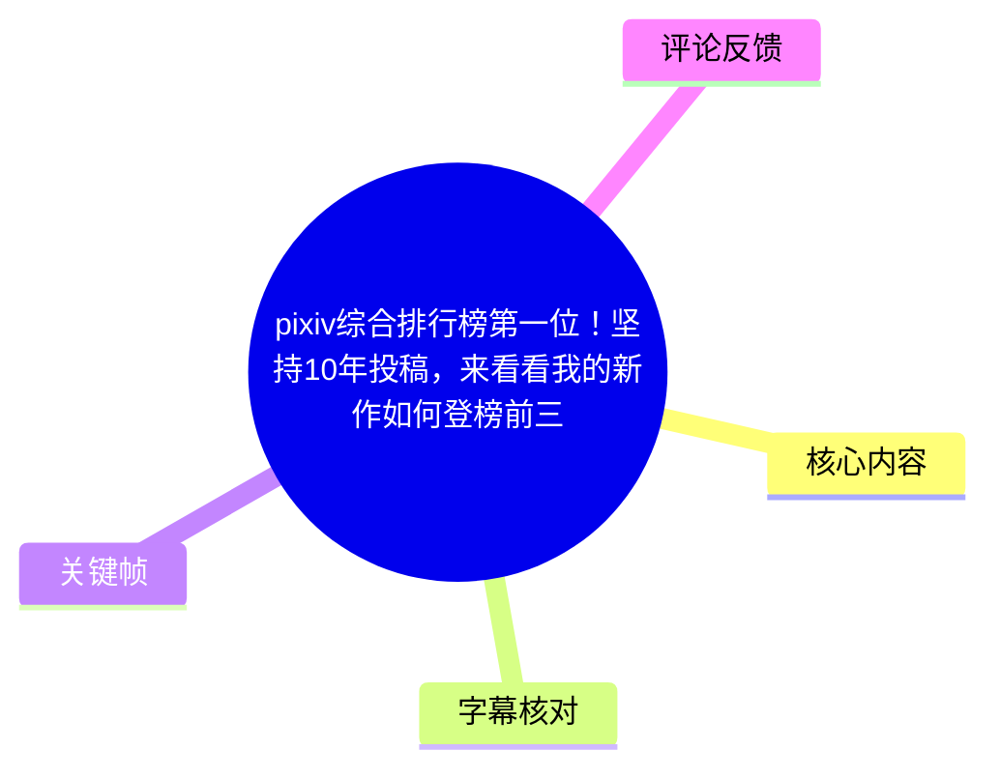
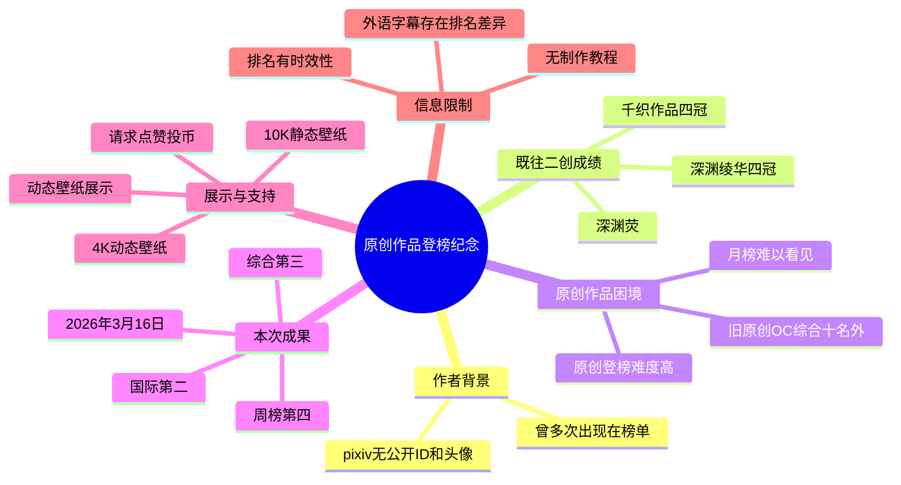
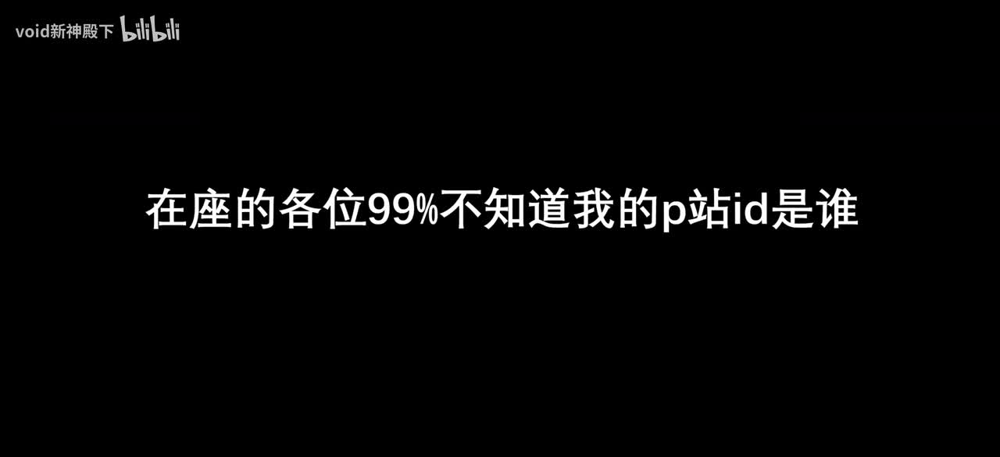
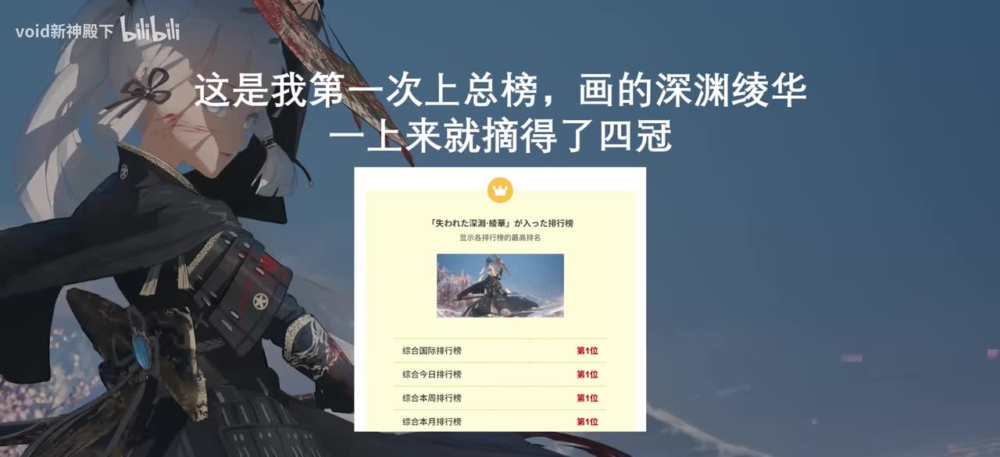
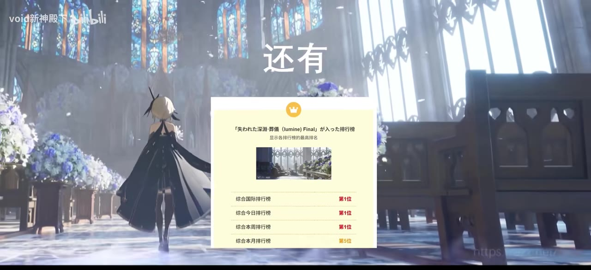
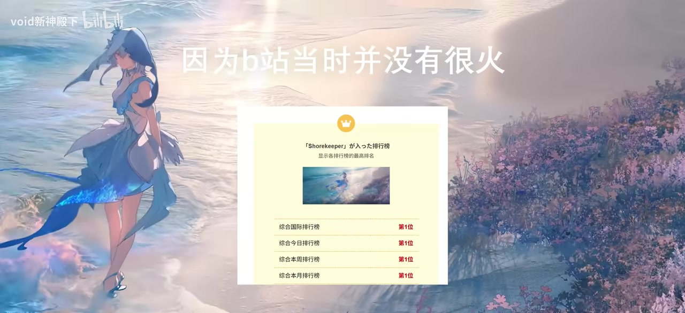

# pixiv综合排行榜第一位！坚持10年投稿，来看看我的新作如何登榜前三

> 来源：[Bilibili 视频](https://www.bilibili.com/video/BV1aXQQB8EK8) 
> UP 主：void新神殿下｜视频时长：103 秒｜画面分辨率：4720 × 2160 
> 注：标题提及“坚持 10 年投稿”与“综合排行榜第一位”，但视频口述的本次原创作品成绩为“综合第三、国际第二、周榜第四”；应以视频内明确口述及中文字幕为准，不能将标题中的表述直接等同于本次作品的全部排名。

## 小结

视频是画师 **void新神殿下** 对其 pixiv 排行经历及一张原创作品取得排名的纪念展示。作者称，自己在 pixiv 上没有公开 ID，甚至没有头像，但此前曾多次以作品进入榜单；开场以《原神》相关二创作品——深渊绫华、深渊荧及千织作品——举例，说明这些作品曾取得“四冠”等成绩。

作者的核心反思是：二创作品的榜单表现并非仅靠个人创作，更多依赖受众对既有角色的喜爱与投入。与之相对，作者此前的原创 OC 曾处于综合榜第十名之外，月榜甚至无法看见，因此明确认为：**原创作品进入榜单的难度很高**。

视频最重要的时效性信息是，作者称其原创图在 **2026 年 3 月 16 日**首次取得“综合第三、国际第二、周榜第四”的成绩，并制作本片留念。站内中文字幕与本次中文 ASR 在这一排名上相互印证；部分站内外语自动字幕却写成“综合第二”，与中文原文不一致，本文不采用该版本。

后半段从约 01:08 起进入动态壁纸展示与音乐段落。视频未讲解绘制软件、图层结构、动画制作流程、排名算法或投稿操作步骤，因此不能将其整理为可复现的技术教程。视频简介仅补充该套作品提供实体周边、4K 动态壁纸与 10K 静态壁纸等商品信息，未给出具体价格、获取链接、授权条款或文件格式。

本视频适合关注插画作品传播、二创与原创作品受众差异、pixiv 榜单成绩展示，以及动态壁纸成品效果的观众阅读。所有排名、互动数据与商品信息均具有时效性，且排名陈述主要来自作者自述与画面展示，未附 pixiv 原始页面链接供独立复核。

## 思维导图

## 目录

- [视频背景：匿名账号与榜单身份](#视频背景匿名账号与榜单身份)
- [既往二创作品的榜单案例](#既往二创作品的榜单案例)
- [原创作品进入榜单的难点](#原创作品进入榜单的难点)
- [本次原创作品成绩与纪念意义](#本次原创作品成绩与纪念意义)
- [动态壁纸展示、产品信息与参数](#动态壁纸展示产品信息与参数)
- [可迁移经验、限制与时效性](#可迁移经验限制与时效性)
- [关键帧索引](#关键帧索引)
- [字幕比对](#字幕比对)
- [评论分析](#评论分析)
- [处理记录](#处理记录)

## [视频背景：匿名账号与榜单身份](https://www.bilibili.com/video/BV1aXQQB8EK8?t=0)

视频开场，作者以“99% 不知道我的 P 站 ID 是谁”引出身份问题，随即说明自己在 pixiv 上“没有 ID”，甚至没有头像，却经常出现在榜单中。这里的“P 站”在中文互联网语境中通常指 pixiv；视频与站内字幕均围绕 pixiv 排名展开。

这段表达的重点不是账号运营方法，而是作者用“没有可辨认的主页身份”与“作品频繁登榜”形成反差：观众可能记得作品，却未必能将作品与创作者账号建立稳定对应关系。该说法属于作者对自身账号状态与传播经历的陈述，视频未展示其 pixiv 主页，无法据此核验具体账号设置。

> 图：关键帧直接呈现开场主旨，明确本片从“作品被看见、作者身份未被辨认”的反差切入，适合作为理解后续榜单回顾的语境依据。

## [既往二创作品的榜单案例](https://www.bilibili.com/video/BV1aXQQB8EK8?t=11)

### [深渊绫华：首次登上总榜与“四冠”](https://www.bilibili.com/video/BV1aXQQB8EK8?t=11)

作者称，自己第一次上总榜时创作的是“深渊绫华”，且作品“一上来就摘得了四冠”。画面中的榜单卡片列出了多个综合维度，关键帧可见其均标为“第 1 位”；这与作者所说“四冠”相对应。

> 图：画面同时保留角色插画、作品缩略图与榜单卡片，是视频中“深渊绫华四冠”陈述的直接视觉佐证；但卡片的具体榜单日期与统计口径在现有素材中无法完整辨读。

### [深渊荧与千织：更多角色二创的上榜记录](https://www.bilibili.com/video/BV1aXQQB8EK8?t=15)

作者随后提到“还有深渊荧”，并在约 00:18 后展示更多作品。对于“千织”作品，作者表示自己原本没有预料到它也会获得“四冠”。站内中文字幕将角色名识别为“千之”，本次 ASR 识别为“千枝”，而站内英文、日文、西班牙文等字幕均对应 **Chiori / 千织**，因此本文将该专名校正为“千织”。

> 图：该帧展示一幅以教堂空间、花卉与背影角色构成的作品，以及相应榜单卡片。它说明作者并非仅以单一作品为例，而是在回顾多个角色二创的上榜经历。

### [角色热度并非完全等于个人能力](https://www.bilibili.com/video/BV1aXQQB8EK8?t=30)

作者紧接着作出归因：这些成绩“并不是我一个人的努力”，更多依靠“大家对角色的热爱”。这不是对 pixiv 算法机制的技术解释，而是作者对二创传播条件的经验判断。

可以从视频中谨慎提炼出两层含义：

1. **已有角色的受众基础会影响作品传播。** 当作品基于已有热门角色时，观众对角色本身的情感、搜索与转发意愿可能为作品带来额外关注。
2. **作者不将二创高排名完全归功于个人。** 这是一种对受众、角色 IP 与创作质量共同作用的归因，而非“只要画热门角色就能上榜”的因果承诺。
3. **不能外推为平台规则。** 视频没有提供曝光、收藏、浏览、标签、投稿时间或榜单算法等数据，不能由此得出 pixiv 排名的具体计算方法。

> 图：画面文字说明“因为B站当时并没有很火”，中央榜单卡片显示多个“第1位”。该帧有助于区分作者提到的不同作品及其传播背景，但无法替代完整榜单页面或算法数据。

## [原创作品进入榜单的难点](https://www.bilibili.com/video/BV1aXQQB8EK8?t=37)

作者用一张此前创作的原创 OC 作为对照：其综合排名在第十名开外，月榜则“跌到连影子都看不到”。基于这一经历，作者得出“原创能上榜难度无疑是相当大的”的判断。

这里应区分事实层级：

- **视频明确陈述：** 作者此前一张原创 OC 的综合排名未进前十，月榜表现更弱。
- **作者经验判断：** 原创作品上榜困难。
- **不能确认的内容：** 该 OC 的投稿日期、题材、互动数据、标签、排行周期，以及与二创作品之间是否存在严格可比的时间和流量条件，素材均未提供。

对创作者而言，这段最具可迁移性的经验不是“原创一定无法传播”，而是认识到原创作品缺少既有角色的认知基础，需要以画面风格、世界观、角色辨识度或持续创作来建立受众连接。后半句属于基于视频主题的合理解读，不是作者提供的具体运营方案。

作者在 00:47 后明确表示“不会放弃”，希望终有一天能靠自己的力量获得认可。这构成了本片的叙事转折：从二创作品的外部角色热度，转向原创作品被认可的目标。

## [本次原创作品成绩与纪念意义](https://www.bilibili.com/video/BV1aXQQB8EK8?t=54)

### [2026年3月16日的原创图成绩](https://www.bilibili.com/video/BV1aXQQB8EK8?t=54)

作者称，终于在 **2026 年 3 月 16 日**，第一次通过原创图获得了以下成绩：

| 榜单维度 | 视频中文口述与站内中文字幕 |
| --- | --- |
| 综合排行 | 第三 |
| 国际排行 | 第二 |
| 周榜 | 第四 |

该成绩是视频的核心新闻点。作者表示因此“开视频留念”。

需要特别处理字幕间的冲突：站内中文字幕和本次 ASR 都识别为“综合第三、国际第二、周榜第四”；站内阿拉伯语、英语、日语、葡萄牙语、西班牙语字幕则部分写成“综合第二”。由于本次 ASR 的识别语言为中文、置信概率为 0.9970703125，且其语义与中文站内字幕一致，本文采用“综合第三”的说法。

### [标题与正文排名表述的边界](https://www.bilibili.com/video/BV1aXQQB8EK8?t=56)

视频标题包含“pixiv 综合排行榜第一位”及“新作如何登榜前三”等宣传性表述，但现有字幕正文没有说本次原创图拿到综合第一，反而明确说“综合第三”。已给出的关键帧也主要展示历史二创作品的多个第 1 位记录，而非本次原创图的综合第 1 位证明。

因此，严谨表述应为：

- 作者展示过若干历史作品获得多个榜单第 1 位的经历；
- 本片明确纪念的原创图成绩为综合第三、国际第二、周榜第四；
- 标题中的“第一位”可能指作者历史作品或强调性标题措辞，现有素材不足以确认其对应哪一张作品、哪一项榜单、哪一日期；
- 不应将标题自动改写为“本次原创图综合第一”。

## [动态壁纸展示、产品信息与参数](https://www.bilibili.com/video/BV1aXQQB8EK8?t=63)

### [进入动态壁纸环节](https://www.bilibili.com/video/BV1aXQQB8EK8?t=63)

作者在口播末尾说明，接下来是“给大家欣赏动态壁纸”环节，并请求观众点赞、投币支持。站内中文 SRT 的语音字幕延续至约 01:08，之后至约 01:32 主要为带歌词标记的音乐字幕；视频总时长为 103 秒，因此最后约 10 秒未见可用文字字幕内容。

动态壁纸展示定位为成品欣赏，而非制作过程演示。素材未提供逐帧动画说明，因此无法确认其中使用了哪些动态技术，例如粒子、镜头运动、循环时长、帧率、编码格式或交互效果。

### [简介中的商品与分辨率信息](https://www.bilibili.com/video/BV1aXQQB8EK8?t=68)

视频简介提供了以下与作品交付相关的信息：

| 项目 | 已知信息 | 未知或未公开信息 |
| --- | --- | --- |
| 动态壁纸 | 标明提供 4K 动态壁纸 | 文件格式、帧率、码率、时长、平台兼容性 |
| 静态壁纸 | 标明提供 10K 静态壁纸 | 精确像素尺寸、色彩空间、文件格式 |
| 实体周边 | 标明“有实体周边” | 周边品类、价格、库存、发货地区 |
| 获取方式 | 简介称当月壁纸、往期作品可通过“工坊内联接”获取 | 当前链接地址、有效期、具体购买规则 |
| 正版声明 | 作者称除所列网站外，其他壁纸网站上的其作品均为盗版 | 无法仅凭简介独立核验各网站授权状态 |

此外，视频文件元数据为 **4720 × 2160**，这是本视频画面的分辨率，并不等同于简介所称 4K 动态壁纸或 10K 静态壁纸的最终交付尺寸。

## 可迁移经验、限制与时效性

### 可迁移经验

1. **分清“角色流量”与“作品认可”。** 作者将二创作品的佳绩部分归因于观众对角色的热爱，这提醒创作者不要把单次排名完全视作个人能力的单变量结果。
2. **原创创作需要更长期的受众积累。** 作者以旧 OC 的较弱排名与本次原创图进榜形成前后对照，体现持续创作与不放弃的创作态度；但视频没有披露完整十年投稿记录，不能据此构造具体成长曲线。
3. **展示成绩时应保存可核验资料。** 视频中的榜单卡片适合纪念与传播，但若需进行外部复盘，仍应保留作品链接、统计日期、榜单类别、截图原始来源及互动数据。
4. **成品展示与教程应明确区分。** 本片展示的是创作成果、排名叙事与动态壁纸视觉效果，不包含可直接复用的软件参数或制作步骤。

### 重要限制

- 未提供 pixiv 原作品链接、投稿日期、标签、收藏量、浏览量或榜单规则，无法分析本次进入前三的可复现原因。
- 视频标题与视频口述存在“第一位”与“综合第三”的表述边界，本文以中文音频、中文站内字幕和 ASR 一致内容为准。
- “坚持 10 年投稿”仅出现在视频标题中，视频口述未展开具体时间线、投稿频率或作品数量。
- 动态壁纸段主要为视觉展示与音乐，缺少技术讲解；不能推断动画制作工具、工程设置或授权范围。
- 简介中的商品、购买路径与版权声明均可能随时间变化，应在实际购买或授权使用前访问作者当期官方渠道确认。

### 时效性说明

- 作者口述排名对应 **2026 年 3 月 16 日**，属于特定日期的排行榜结果。
- 视频元数据抓取时间为 **2026-07-16**；抓取时视频统计为 1,127,147 播放、169,354 点赞、57,039 收藏、12,714 投币、1,137 分享、1,185 评论。这些均为抓取快照，不代表当前实时数据。
- 排行榜位置、商品可得性、周边库存、平台链接及版权处置均可能在视频发布后变化。

## 关键帧索引

| 关键帧 | 正文位置 | 画面内容 | 选择价值 |
| --- | --- | --- | --- |
|  | 开场背景 | 黑底大字说明观众不知道作者的 P 站 ID | 直接建立“身份不显眼但作品登榜”的叙事起点。 |
|  | 深渊绫华案例 | 深渊绫华作品与多个第 1 位榜单卡片 | 为“首次总榜、四冠”提供画面层面的对应证据。 |
|  | 深渊荧案例 | 教堂场景中的角色作品及榜单卡片 | 展示作者回顾的不止一项上榜作品。 |
|  | 更多历史作品 | 海岸角色插画、榜单卡片与“B站当时并没有很火”文字 | 补充作者对早期作品传播背景的描述。 |

> 其余关键帧文件虽已提供，但当前素材中未附各帧对应的精确采样时间与画面说明。为避免依据文件序号臆测时间位置，正文仅采用能与已知画面内容及字幕段落明确对应的帧。

## 字幕比对

| 字幕来源 | 完整性 | 专有名词 | 时间轴 | 主要问题 |
| --- | --- | --- | --- | --- |
| Bilibili 站内中文字幕 `p01-ai-zh.srt` | 覆盖口播约 00:00–01:08，后续含部分音乐歌词字幕 | “深渊吟”“千之”“家人们的处理”等存在识别或转写偏差 | 分段细，起止时间可直接使用 | 将本次原创图成绩写为“综合第三、国际第二、周榜第四”；与 ASR 一致。 |
| Bilibili 站内外语字幕 | 覆盖范围与中文站内字幕大体相近 | 多语言版本将“Chiori”对应为“千织”，有助于校正中文误识 | 分段时间可用 | 英文、阿拉伯语、日语等版本部分写为“综合第二”，与中文口述/中文 SRT/ASR 冲突。 |
| 本次 ASR `medium` | 识别到 00:00–01:08.440，语音覆盖约 66.24 秒；之后主要为音乐或未识别内容 | “深渊灵华”“深淮银”“千枝”“四冢”“原剩”“动态地址”等有同音误识 | 共 4 个长段，时间戳可用但不如站内字幕细 | 对长句切分粗；专有名词和个别词语需结合站内字幕、外语字幕与画面校正。 |

### 最终字幕选择与校正原则

本文以 **站内中文字幕的细粒度时间轴** 为主，以 **本次中文 ASR** 复核音频语义，并参考站内多语字幕校正专有名词。ASR 诊断显示存在音频流，语言识别为中文，概率 0.9970703125；`asr-result.json` 未标记 `noAudioStream=true`，因此不存在“源视频无音轨”的情况。

主要校正如下：

| 原始识别 | 采用表述 | 校正依据 |
| --- | --- | --- |
| 深渊灵华 / 深渊绫华 | 深渊绫华 | 站内中文字幕、画面文字及角色常用名称一致。 |
| 深淮银 / 深渊吟 | 深渊荧 | 站内外语字幕对应 “Abyss Lumine”，画面为角色作品回顾。 |
| 千枝 / 千之 | 千织 | 站内英、日、西、葡等字幕均出现 Chiori 对应名。 |
| 四冢 | 四冠 | 站内中文及其他语言字幕均表述为“四冠”。 |
| 家人们的处理 | 家人们的助力/支持 | 语义上下文是对观众热爱的感谢；该处具体用词存在转写不稳，正文避免将其作为精确引文。 |
| 综合第二 | 综合第三 | 中文站内字幕和本次 ASR 一致为“综合第三”，优先采用中文音频对应结果。 |
| 动态地址 | 动态壁纸 | 站内中文字幕明确为“动态壁纸环节”，且与视频简介的壁纸信息一致。 |

## 评论分析

以下仅分析当前可获取的热评前三条。评论代表个体观众反馈，不构成对作者经历、作品质量或排名数据的独立验证。

1. **大雷即是正义｜4,327 赞**  
   评论：“原来是正经的啊，难怪没看到你[doge]”。  
   该评论以玩笑方式回应作者“没有 P 站 ID/头像”的开场设定，体现观众对标题或账号身份的调侃式互动。它没有提供作品排名、创作过程或商品信息，不应作事实补充。

2. **无宀了一么｜2,943 赞**  
   评论：“强”。  
   这是简短的正向认可，显示观众对作品或成绩的赞赏，但信息量有限，无法据此判断观众具体认可的是原创图、动态壁纸还是作者长期创作。

3. **眠りアリス｜2,410 赞**  
   评论称，恰恰是这张原创画让其记住 “void” 的名字，并认为这种“静谧而生动的美”对自己初入 P 站时影响很大，祝愿作者后续继续成功。  
   这条评论补充了一个受众视角：尽管作者担心原创作品缺少角色热度，仍有观众因原创画形成了对作者本人的明确记忆。这与视频中“希望靠自己的力量获得认可”的主题形成呼应。但这只是单位观众的个人体验，不能推导为作品整体传播效果或排名原因。

## 处理记录

- **Worker ID**：worker-mrj0www4-e8d79408
- **整理模型**：gpt-5.6-terra
- **ASR 模型**：medium；识别语言为中文，语言概率 0.9970703125，使用 CUDA / float16。
- **使用的素材与工具产物**：视频元数据 `info.json`、音频 `audio/audio.wav`、本次 ASR 结果 `asr/asr-result.json` 与 `asr/transcript.srt`、站内多语 SRT、关键帧 `frames/`、热评数据 `comments/comments.json`。
- **字幕选择**：以站内中文 SRT 的细分时间轴为主；以本次 ASR 核对中文口述；以站内多语字幕辅助确认“千织”等专有名词。对“综合第二/第三”的冲突，采用中文站内字幕与 ASR 一致的“综合第三”。
- **关键帧选择依据**：仅选用 `frame-001` 至 `frame-004` 中能够与开场身份陈述、深渊绫华、深渊荧及历史榜单画面明确对应的帧；未根据关键帧文件序号推测其精确时间点。
- **评论处理范围**：仅处理素材中可获取的热评前三条，未扩展至其他评论或楼中楼。
- **缓存清理**：提供的素材未包含缓存清理执行记录，无法确认是否已清理；不将其表述为已完成。
- **未解决问题**：缺少本次原创图的 pixiv 原链接、具体作品名、完整榜单截图、排名统计口径、动态壁纸技术参数及购买链接；标题中“综合排行榜第一位”与正文“综合第三”的确切对应关系无法仅凭现有素材完全消除。
