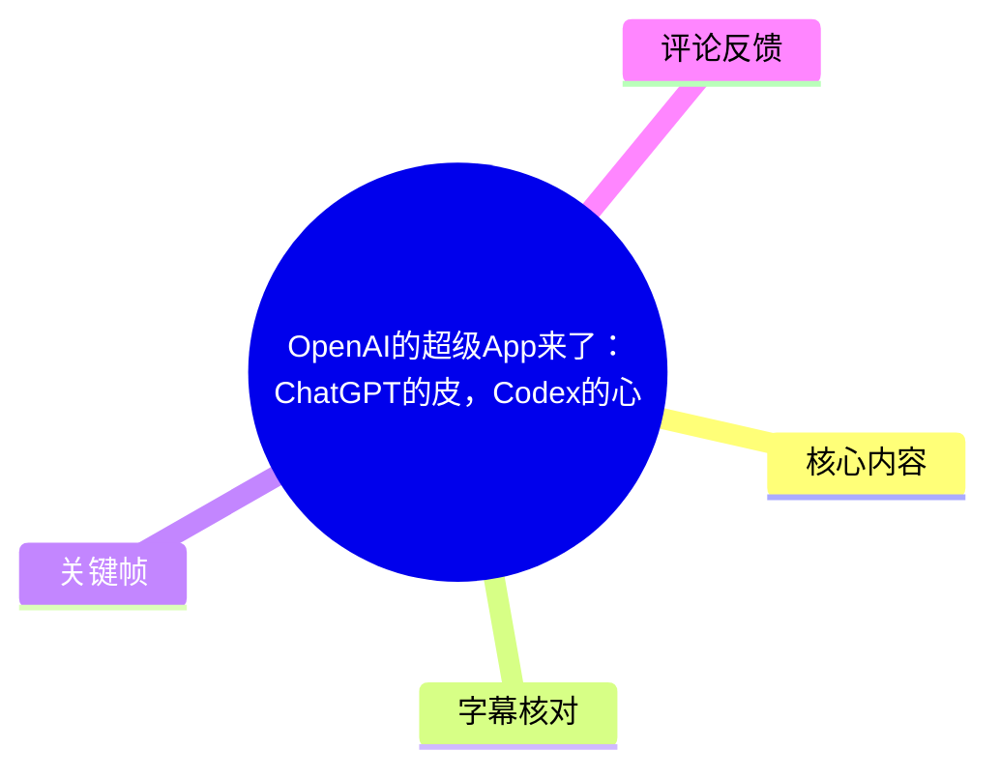
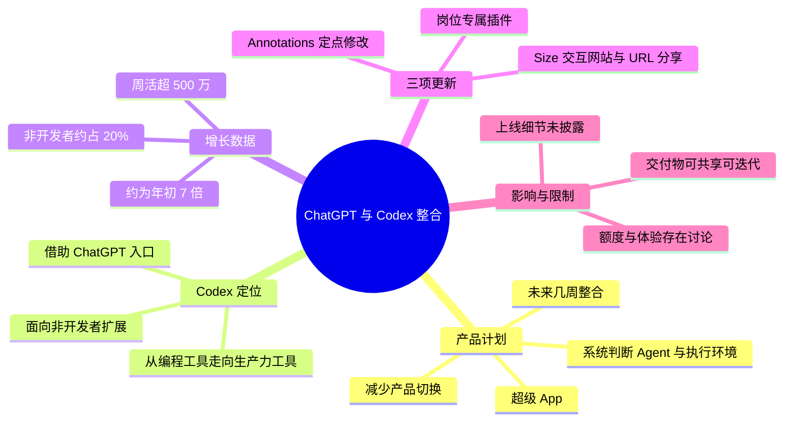
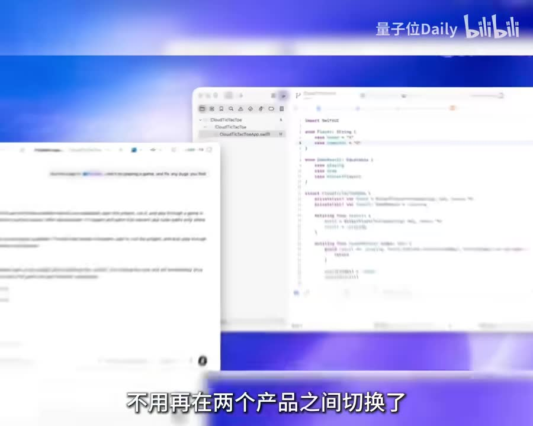
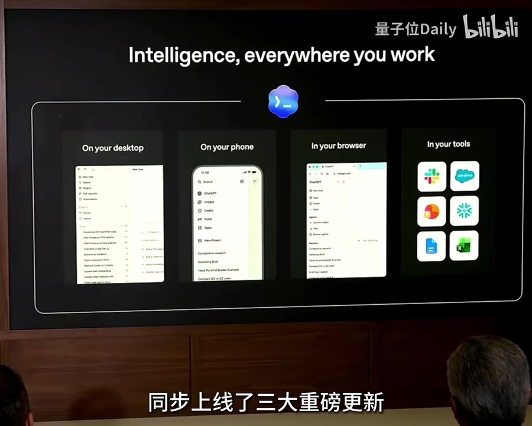
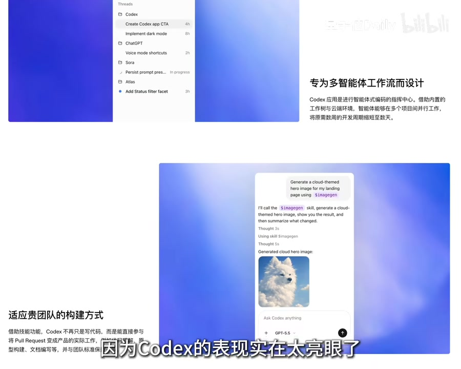

# OpenAI的超级App来了：ChatGPT的皮，Codex的心

> 来源：[Bilibili 视频](https://www.bilibili.com/video/BV1Du796mEHi)<br>
> UP 主：量子位Daily｜视频时长：1 分 43 秒｜合集：AIcode  
> 视频简介：整合 ChatGPT 和 Codex，OpenAI 开始反击。

## 小结

视频报道了一项仍处于“未来几周”计划阶段的 OpenAI 产品整合：将 **ChatGPT 与 Codex 合并为一个超级 App**。按视频说法，用户将不必在对话/创作产品与智能体执行环境之间来回切换；系统会判断调用哪个 Agent、在哪个环境中执行任务。

报道的核心判断是：表面上看像是把 Codex 放进 ChatGPT，但 OpenAI 实际希望借助 ChatGPT 的入口，把 **Codex 推向更广泛的生产力场景**。视频给出的理由是 Codex 增长迅速：周活跃用户超过 500 万、约为年初的 7 倍，且非开发者已占其用户的 20%。

围绕这一定位，视频列出三项 Codex 更新：**面向岗位的专属插件**、名为 **“Size”** 的交互式网站输出与 URL 分享能力，以及 **Annotations 标注功能**。其中，“Size”的英文名称由本次 ASR 识别得出，视频素材未提供站内字幕或可核对的官方文字，因此保留该转写并标注不确定性。

对实际用户而言，可关注的工作流变化是：从“聊天获得答案”转向“由 Agent 产出可交付、可共享、可在指定区域迭代的工作成果”。视频所举覆盖方向包括数据分析、创意制作、销售、投资等，目标受众并不局限于开发者。

需要注意，这是一则新闻型短视频，所有功能范围、上线节奏、额度、定价、可用地区、实际路由逻辑和隐私边界均未在视频中说明。热评集中担忧整合后可能发生的**额度收缩**与**不同用户形态相互干扰**，但这些属于用户意见，不能视为已证实的产品政策。

## 思维导图





## 目录

- [计划：ChatGPT 与 Codex 合并为超级 App](#计划chatgpt-与-codex-合并为超级-app-0023)
- [Codex 的增长与 OpenAI 的产品定位](#codex-的增长与-openai-的产品定位-0024)
- [更新一：岗位专属插件与预置工作流](#更新一岗位专属插件与预置工作流-0048)
- [更新二：Size——输出可托管交互式网站](#更新二size输出可托管交互式网站-0058)
- [更新三：Annotations——限定区域的精确修改](#更新三annotations限定区域的精确修改-0112)
- [战略判断、使用步骤与限制](#战略判断使用步骤与限制-0136)
- [字幕比对](#字幕比对)
- [评论分析](#评论分析)
- [处理记录](#处理记录)

## 计划：ChatGPT 与 Codex 合并为超级 App [00:23](https://www.bilibili.com/video/BV1Du796mEHi?t=23)

视频开篇提出“ChatGPT 的时代就要宣告结束了”的强烈表述；这应理解为视频的传播性说法，而非产品终止公告。其实际报道内容是：OpenAI 透露计划在**未来几周**把 ChatGPT 和 Codex 整合起来。

视频描述的整合后形态包括：

1. **统一入口**：同一应用既能进行对话、创作，也能调用 Agent 执行长程任务。
2. **减少切换**：用户不必再在 ChatGPT 与 Codex 两个产品之间手动来回切换。
3. **自动执行编排**：系统将自动判断应使用哪个 Agent，以及应在哪个环境中执行。
4. **并行更新**：除整合计划外，Codex 还同步面向“打工人”推出三项重大更新。



> 图：画面将聊天界面与代码/开发环境并置，直观对应视频所说的“无需再在两个产品之间切换”。它帮助理解此次整合并非单纯的品牌合并，而是要连接对话入口与任务执行环境。

视频并未具体解释“系统自动判断”的决策条件，例如模型选择依据、用户是否可以手动覆盖路由、Agent 可访问的外部工具范围，以及长程任务的执行时长和失败恢复机制。因此，不能据此推断系统已经具备完全自动化的跨场景代理能力。

## Codex 的增长与 OpenAI 的产品定位 [00:24](https://www.bilibili.com/video/BV1Du796mEHi?t=24)

视频认为，虽然外观上是将 Codex 装进 ChatGPT，但 OpenAI 更想借助 ChatGPT 的入口优势来推广 Codex。其论据和定位如下：

| 视频陈述 | 具体内容 | 含义 |
| --- | --- | --- |
| Codex 周活跃用户 | 已超过 500 万 | 视频以此说明产品已有较大使用规模 |
| 相较年初的增长 | 达到年初约 7 倍 | 反映视频所述的快速增长趋势 |
| 非开发者占比 | 分析师、运营、设计师等群体约占 Codex 用户数的 20% | Codex 的使用场景开始超出软件开发 |
| OpenAI 下一步目标 | 把 Codex 打造成大众化生产力工具 | 通过 ChatGPT 入口扩大用户覆盖面 |



> 图：画面标题为“Intelligence, everywhere you work”，并将桌面、手机、浏览器和工具连接并列展示。它为“从单一编码工具走向多端、跨工具生产力入口”的视频判断提供了画面语境。

这里的“很多任务上的表现都超过 ChatGPT”是视频转述的概括性判断，未列出测评基准、任务集、模型版本或具体胜率，不能扩展为对所有任务和所有版本的普遍结论。上述用户规模与比例也应以视频发布时点为准，后续可能变化。

## 更新一：岗位专属插件与预置工作流 [00:48](https://www.bilibili.com/video/BV1Du796mEHi?t=48)

为推动 Codex 走向更普遍的生产力场景，视频首先介绍了**六类面向特定岗位的专属插件**。已明确提及的覆盖方向包括：

- 数据分析；
- 创意制作；
- 销售；
- 投资；
- 以及视频概述中未逐一念出的其他岗位类别。

视频强调，每个插件会打包三类内容：

1. **技能**：使 Codex 能针对某类工作执行相应操作；
2. **指令**：沉淀该岗位常见的任务要求；
3. **工作流**：将完成任务的步骤预设为较易调用的流程。

因此，视频所描述的使用路径不是让每位用户从零配置 Agent，而是选择与角色/任务相匹配的插件后直接开始使用。其预期价值在于降低初始配置与提示词组织成本，让不以编程为主的用户也可使用 Codex 处理工作任务。



> 图：画面中的中文说明强调“专为多智能体工作流而设计”，并展示任务列表与由技能生成图片的例子。它有助于理解视频所称“插件”并非单一命令，而是包含技能和流程的工作单元。

### 可据视频复用的操作步骤

视频未给出具体按钮路径或配置界面，能够严谨整理的步骤仅限于：

1. 明确自身任务属于数据分析、创意制作、销售、投资等哪个岗位场景；
2. 选用对应的岗位专属插件；
3. 将工作目标交给已封装技能、指令和工作流的 Codex；
4. 在无需繁琐配置的前提下开始执行；
5. 后续可将成果输出、分享，并通过标注方式发起局部迭代。

> 视频没有给出六类插件的完整名称、每类插件的输入输出格式、权限范围、支持的平台和收费方式，实际使用前需以 OpenAI 当时的产品文档为准。

## 更新二：Size——输出可托管交互式网站 [00:58](https://www.bilibili.com/video/BV1Du796mEHi?t=58)

第二项更新在 ASR 中被识别为 **“Size”**。按视频描述，这项能力可让 Codex 将工作成果直接输出为：

- **可托管的交互式网站**；
- 可通过 **URL** 分享；
- 分享对象为**同一 Workspace 内的成员**。

这意味着，视频所设想的 AI 交付物不再只是聊天文本、代码片段或静态文件，也可成为其他团队成员能打开、使用和继续协作的工作空间。视频将其概括为“可共享、可交互”的成果。

### 面向团队的交付流程

结合视频所述功能，可整理为以下流程：

1. 使用 Codex 完成某项工作任务；
2. 将结果输出为交互式网页；
3. 由系统托管该网页；
4. 生成或获得可访问的 URL；
5. 在同一 Workspace 内向成员分享；
6. 团队成员打开页面、查看或与成果交互，并进入后续编辑环节。

这里的“可托管”与“URL 分享”不等于公开互联网发布。视频明确的对象范围是同一 Workspace 内成员，未说明是否支持公开链接、跨 Workspace 访问、访问权限分级、链接有效期、数据保存期限或自定义域名。

此外，**“Size”这一名称存在转写不确定性**：站内字幕未提供，ASR 在该处只给出“Size”，没有足够的画面文字可完成官方名称校正。因此本文不将其擅自改写为其他功能名。

## 更新三：Annotations——限定区域的精确修改 [01:12](https://www.bilibili.com/video/BV1Du796mEHi?t=72)

第三项更新是 **Annotations（标注）功能**。视频给出的机制是：

1. 用户在文档或文件中精确圈定/选定需要操作的区域；
2. Codex 仅在被选中的部分进行修改；
3. 由此让指令更直接、修改更精准、迭代效率更高。

这一设计针对的是 AI 交付后常见的编辑问题：如果仅用自然语言描述“改一下某段内容”，模型可能误改范围过大，或需要反复说明上下文。标注提供了明确的操作边界，使“修改哪里”从模糊语言变成可见的选区。

### 一个符合视频机制的抽象示例

视频未展示具体文件类型和实际命令。以下仅是对其工作机制的抽象说明，而非视频演示的原例：

1. AI 已生成一份文档、页面或其他文件；
2. 用户选中其中一块需要调整的区域；
3. 用户提出仅针对该区域的修改要求；
4. Codex 将修改限制在选区内；
5. 用户检查结果，如仍不满意可继续标注下一处。

这种方式的关键限制是：视频没有说明“仅在选区修改”是否为绝对约束，是否会因依赖关系而调整选区外内容，也未说明可支持的文件格式、多人并发编辑冲突处理或版本回退能力。

## 战略判断、使用步骤与限制 [01:36](https://www.bilibili.com/video/BV1Du796mEHi?t=96)

视频最后将此次整合定义为一次“战略反击”：ChatGPT 曾让 OpenAI 在 Chat 时代领先，而 Codex 是否能够帮助 OpenAI 扭转 Agent 竞争格局，仍以问句收束，并未给出确定答案。

### 视频呈现的完整产品逻辑

```text
ChatGPT 的广泛入口
        ↓
连接 Codex 的 Agent 执行能力
        ↓
岗位插件降低使用门槛
        ↓
生成可托管、可分享的交付物
        ↓
以 Annotations 实现局部、精确迭代
        ↓
从“聊天回答”延伸到“团队生产力工作流”
```

### 适用人群与可迁移经验

- **非开发岗位用户**：可重点关注岗位化插件是否确实减少了从需求描述到成果产出的门槛。
- **团队协作场景**：可评估“交互式成果 + Workspace URL 分享”是否比传递静态文件和聊天记录更顺畅。
- **需要频繁修改 AI 产物的用户**：可重点测试标注编辑是否能够有效控制修改范围。
- **开发者与技术团队**：可关注统一入口是否真的减少工具切换，同时验证 Agent 的执行透明度、可控性和可追溯性。

### 视频未覆盖但实际应验证的限制

| 维度 | 视频已说明 | 视频未说明、需后续验证 |
| --- | --- | --- |
| 上线时间 | “未来几周” | 确切发布日期、分批范围与地区 |
| 账号/套餐 | 未说明 | 免费版、订阅版、企业版的权限与额度 |
| Agent 路由 | 系统自动判断 Agent 与环境 | 路由依据、人工切换能力、错误处理 |
| 插件 | 六类岗位专属插件 | 完整类别、安装方式、支持语言与权限 |
| 网站托管 | 可输出交互式网站并 URL 分享 | 数据保留、公开性、访问控制、成本 |
| Annotations | 选区内修改 | 文件格式、跨区域依赖、版本管理 |
| 数据安全 | 未说明 | Workspace 数据隔离、审计、合规与第三方接入 |

新闻时效性方面，视频元数据对应 2026 年 6 月初，而素材抓取时间为 2026 年 7 月。由于报道中功能仍带有计划和更新属性，当前可用性及具体政策可能已经变化；不应仅凭此视频确定现行产品能力。

## 字幕比对

| 字幕来源 | 完整性 | 专有名词 | 时间轴 | 主要问题 |
| --- | --- | --- | --- | --- |
| Bilibili 站内字幕 | 未提供可用字幕 | 无从核验 | 无从核验 | 素材明确标注“未提供可用站内字幕” |
| 本次 ASR 字幕 | 覆盖约 78.52 秒语音，诊断语音覆盖率 76.96% | ChatGPT 被误识别为“Chad GPT”；Codex 出现 CodeX/Code x/Code s 等变体；“Size”名称存疑 | 有时间戳；首段 00:23.300，末段 01:41.820 | 每段文本过长、断句不足；专名和个别词汇存在识别误差 |

### 最终字幕选择与校正原则

本文采用**本次 ASR 的原始时间轴**作为章节链接依据：主要内容从 `00:00:23,300` 开始，末段至 `00:01:41,820`。ASR 诊断未标记 `noAudioStream=true`，且素材包含 `audio/audio.wav`，因此可确认源视频具备可识别音轨；并非无音轨视频，也不是工具失败情形。

在不改变原意的前提下，依据视频标题、元数据标签和画面语境完成以下专有名词规范化：

- `Chad GPT`、`Chat GPT` → **ChatGPT**
- `CodeX`、`Code x`、`Code s` → **Codex**
- `agent` → **Agent**（仅作大小写规范）
- `Workspace` → **Workspace**

对于 **“Size”**，由于没有站内字幕可交叉核验，且现有关键帧未展示足以确认功能正式名称的清晰文字，保留 ASR 结果并明确其不确定性，不将其当作已验证的官方命名。

## 评论分析

仅处理素材中可获取的热评前三条。评论反映的是用户预期和担忧，不构成对 OpenAI 产品政策的事实证明。

| 热评 | 点赞 | 观点概括 | 可提供的信息与可信度 |
| --- | ---: | --- | --- |
| 学仙谩有真人度：“额度整合在一起，就完蛋了” | 372 | 担心产品合并会让原本的可用额度受到影响 | 反映用户对套餐额度和资源分配的敏感性；视频未披露额度方案，因此不能确认 |
| USER_00000000：“省流：合并后减额度” | 99 | 将整合直接概括为可能减少额度 | 属于判断性结论，没有提供来源、实测或官方依据；应视为推测 |
| 河里的小于：“成功的把两种不同使用的形式用户放到了一个APP里，总感觉两边不讨好” | 98 | 担忧聊天用户与编码/Agent 用户的需求不同，统一 App 可能牺牲两端体验 | 提出了合理的产品设计风险：统一入口是否仍能满足差异化工作流，需等待实际界面和使用反馈验证 |

三条高赞评论共同指向两个风险：一是**资源/额度政策**，二是**统一产品的体验取舍**。这与视频强调的“减少切换、自动路由”形成对照：产品整合能否成功，不只取决于能力叠加，也取决于套餐规则是否透明、不同用户是否仍能保持高效的专用工作流。

## 处理记录

- Worker ID：`worker-mrj0wbly-5dc4e50c`
- 整理模型：`gpt-5.6-terra`
- ASR 模型：`medium`，语言识别为中文（`zh`），语言置信度 `0.9990234375`，运行设备为 CUDA，计算类型为 `float16`
- 使用的素材工具产物：`merged.mp4`、`audio/audio.wav`、`asr/transcript.srt`、`asr/asr-result.json`、关键帧目录 `frames/`、评论文件 `comments/comments.json`
- 字幕选择：站内字幕未提供可用版本；已检查本次 ASR，采用其时间戳作为视频章节定位，并基于标题、标签与关键帧将 ChatGPT、Codex 等明显误识别专名规范化。“Size”保留 ASR 形式并标注未核验。
- 时间轴依据：使用 ASR SRT/分段数据的真实起止时间，章节链接分别定位至 23、24、48、58、72、96 秒；未按文字顺序臆测时间。
- 关键帧选择依据：`frame-002.jpg` 用于呈现 ChatGPT 与开发环境切换问题；`frame-003.jpg` 支撑跨端、跨工具生产力定位；`frame-004.jpg` 展示多智能体工作流与技能生成示例。所选帧均与相邻正文主题直接对应。
- 评论范围：仅分析可获取热评前三条，未扩展至其余评论。
- 缓存清理：提供的素材中未包含缓存清理执行日志，无法确认是否已执行清理；本文不虚构清理结果。
- 未解决问题：六类插件的完整名单、“Size”的官方名称、功能确切上线时间、套餐额度、地区可用性、托管与 URL 访问权限、Annotations 的文件类型支持范围，均未能从现有视频素材中确认。
